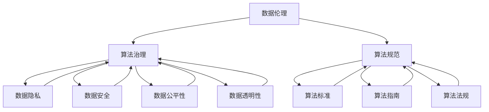

                 

### 1. 背景介绍

随着人工智能技术的飞速发展，算法在各个领域得到了广泛应用。从推荐系统、金融风控、智能医疗到自动驾驶，算法的强大功能极大地提升了效率、优化了决策。然而，算法在带来便捷的同时，也引发了一系列伦理问题，如数据滥用、隐私泄露、算法歧视等。这些问题不仅影响了社会公平与正义，还引发了公众对人工智能技术的信任危机。因此，如何进行算法治理和规范，成为当前学术界和工业界共同关注的焦点。

算法治理涉及多个层面，包括法律、政策、技术和社会等方面。法律层面需要制定相关法规，规范算法的开发、部署和应用；政策层面需要制定指导原则，引导算法的健康发展；技术层面需要研发有效的算法治理工具，提高算法的透明性和可控性；社会层面需要加强公众教育，提高对算法伦理的认识。本文将从这些方面展开讨论，旨在为算法治理提供一些有益的思路和方案。

本文结构如下：

- **1. 背景介绍**：概述算法发展及其引发的伦理问题。
- **2. 核心概念与联系**：介绍数据伦理、算法治理和规范的相关概念，并使用Mermaid流程图展示其关系。
- **3. 核心算法原理 & 具体操作步骤**：详细阐述核心算法原理及其操作步骤，分析算法优缺点和应用领域。
- **4. 数学模型和公式 & 详细讲解 & 举例说明**：构建数学模型，推导相关公式，并通过案例进行分析。
- **5. 项目实践：代码实例和详细解释说明**：提供具体的代码实例，详细解释其实现过程。
- **6. 实际应用场景**：探讨算法在不同领域的应用案例。
- **7. 工具和资源推荐**：推荐学习资源、开发工具和论文。
- **8. 总结：未来发展趋势与挑战**：总结研究成果，展望未来发展趋势和面临的挑战。
- **9. 附录：常见问题与解答**：解答读者可能遇到的常见问题。

通过本文的讨论，我们希望能够为算法治理和规范提供一些有价值的参考，促进人工智能技术的健康发展。

---

### 2. 核心概念与联系

#### 数据伦理

数据伦理是近年来兴起的一个跨学科领域，它关注数据在收集、处理、存储和使用过程中涉及的道德和法律问题。数据伦理的核心问题包括数据隐私、数据安全、数据公平性和数据透明性等。

- **数据隐私**：涉及个人信息的保护，防止未经授权的访问和泄露。例如，社交媒体平台如何保护用户的私信和位置数据。
- **数据安全**：确保数据在传输、存储和处理过程中不被恶意攻击者篡改或窃取。例如，金融机构如何确保客户交易数据的机密性和完整性。
- **数据公平性**：防止数据滥用导致的社会不公，例如，招聘系统因偏见数据导致的歧视问题。
- **数据透明性**：提高数据的可追溯性和解释性，使数据的使用过程更加透明，便于监督和审计。

#### 算法治理

算法治理是指通过一系列法律、政策、技术和社会手段，对算法的开发、部署和应用进行监管和管理，以确保算法的公平、透明和可解释性。算法治理的核心目标包括：

- **算法公平性**：确保算法不会因偏见数据而导致不公平的结果，例如，招聘系统中应避免性别、年龄等因素的偏见。
- **算法透明性**：提高算法的透明度，使算法的决策过程和结果可以被理解和监督。
- **算法可解释性**：提供算法决策的可解释性，帮助用户理解算法的决策依据。
- **算法合规性**：确保算法符合相关法律法规，避免违法行为。

#### 算法规范

算法规范是指通过制定标准、指南和法规，对算法的设计、开发和部署过程进行规范，以确保算法的质量和安全性。算法规范的主要内容包括：

- **算法标准**：制定算法开发的基本标准和规范，例如，机器学习模型的训练数据和评估标准。
- **算法指南**：提供算法开发和应用的最佳实践指南，帮助开发者遵循最佳实践。
- **算法法规**：制定相关法律法规，规范算法的开发、部署和应用，防止违法行为。

#### 关系

数据伦理、算法治理和算法规范之间存在紧密的联系。数据伦理是算法治理和规范的基础，它为算法治理和规范提供了伦理依据；算法治理是数据伦理的具体实施手段，通过法律、政策和技术的手段，确保算法的公平、透明和合规；算法规范则是算法治理的具体操作指南，通过制定标准、指南和法规，确保算法的质量和安全性。

使用Mermaid流程图可以直观地展示这三个概念之间的关系：



通过上述关系图，我们可以清晰地看到数据伦理、算法治理和算法规范之间的相互影响和依赖。

---

### 3. 核心算法原理 & 具体操作步骤

在算法治理和规范的过程中，核心算法的原理和具体操作步骤至关重要。本文将介绍一种常用的算法——差分隐私算法，并详细阐述其原理和具体操作步骤。

#### 3.1 算法原理概述

差分隐私（Differential Privacy，简称DP）是一种保护数据隐私的算法，由Cynthia Dwork在2006年提出。差分隐私的核心思想是通过引入噪声，使得数据分析结果对于单个记录的变化不敏感，从而保护个体的隐私。具体来说，差分隐私算法通过计算一个隐私函数，使得输出结果对于包含特定个体和不含特定个体的数据集差异不大，从而保证了个体隐私。

差分隐私算法的基本原理可以概括为：

1. **噪声引入**：对原始数据进行加噪处理，使得数据处理结果不依赖于特定个体。
2. **隐私损失**：通过计算隐私损失参数，衡量算法对隐私保护的强度。
3. **隐私保证**：确保算法输出结果对于个体隐私的泄露程度在一定范围内。

#### 3.2 算法步骤详解

差分隐私算法的具体操作步骤如下：

1. **选择隐私参数**：选择合适的隐私参数ε（epsilon），ε值越大，隐私保护越强。
2. **加噪处理**：对原始数据进行加噪处理，常用的加噪方法包括拉普拉斯机制和指数机制。
3. **计算隐私函数**：根据隐私参数ε，计算隐私函数，得到加噪后的输出结果。
4. **隐私损失评估**：计算隐私损失，评估算法对隐私保护的强度。
5. **结果输出**：输出加噪后的数据结果，供后续分析和决策使用。

下面是差分隐私算法的详细操作步骤：

1. **选择隐私参数ε**：

   ```python
   # 选择隐私参数epsilon
   epsilon = 1.0  # 可以根据实际需求调整epsilon值
   ```

2. **加噪处理**：

   ```python
   # 使用拉普拉斯机制加噪
   noise = laplace Mechanism(scale=epsilon)
   noisy_data = [noise.sample(x) for x in raw_data]
   ```

   这里，`laplace Mechanism` 是拉普拉斯机制，`scale` 参数设置为隐私参数ε的倒数。

3. **计算隐私函数**：

   ```python
   # 计算隐私函数
   privacy_function = lambda x: (x + noise.sample(0)) / epsilon
   result = [privacy_function(x) for x in noisy_data]
   ```

   隐私函数将原始数据加噪后，通过除以ε，使得输出结果不依赖于特定个体。

4. **隐私损失评估**：

   ```python
   # 计算隐私损失
   privacy_loss = sum([noise.log_pdf(x) for x in result])
   print(f"Privacy loss: {privacy_loss}")
   ```

   隐私损失通过计算噪声概率密度函数的积分得到，反映了算法对隐私保护的强度。

5. **结果输出**：

   ```python
   # 输出加噪后的结果
   print(f"Anonymized data: {result}")
   ```

   输出加噪后的数据结果，供后续分析和决策使用。

#### 3.3 算法优缺点

差分隐私算法具有以下优点：

- **强隐私保护**：差分隐私算法通过引入噪声，能够有效保护个体隐私，防止隐私泄露。
- **灵活性**：差分隐私算法适用于各种数据分析任务，如统计、机器学习和推荐系统等。
- **可扩展性**：差分隐私算法可以应用于大规模数据处理，具有良好的可扩展性。

然而，差分隐私算法也存在一些缺点：

- **隐私损失**：差分隐私算法引入噪声，可能导致数据分析结果的精度降低，即隐私损失。
- **计算开销**：差分隐私算法需要额外的计算开销，可能导致性能下降。
- **适用范围**：差分隐私算法在某些特定场景下可能不适用，例如需要高精度分析的任务。

#### 3.4 算法应用领域

差分隐私算法在多个领域得到了广泛应用：

- **推荐系统**：差分隐私算法可以有效保护用户隐私，同时提供个性化的推荐结果。
- **金融风控**：差分隐私算法可以保护客户数据，同时进行风险分析和预测。
- **智能医疗**：差分隐私算法可以帮助医疗机构保护患者隐私，同时进行疾病预测和诊断。

#### 3.5 案例分析

以下是一个差分隐私算法在推荐系统中的应用案例：

**案例背景**：某电商平台希望为用户推荐商品，但用户数据包含敏感信息，如购买记录和浏览历史，需要保护用户隐私。

**解决方案**：采用差分隐私算法对用户数据进行处理，得到匿名化的推荐结果。

1. **数据收集**：收集用户的购买记录和浏览历史数据。
2. **加噪处理**：对用户数据进行差分隐私加噪，得到匿名化的数据。
3. **计算推荐**：使用匿名化数据计算推荐结果，避免隐私泄露。
4. **结果输出**：输出匿名化的推荐结果，供用户参考。

通过上述步骤，电商平台可以提供个性化推荐服务，同时保护用户隐私。

---

### 4. 数学模型和公式 & 详细讲解 & 举例说明

在算法治理和规范的过程中，数学模型和公式扮演着至关重要的角色。本章节将详细介绍差分隐私算法中的数学模型和公式，并通过具体案例进行讲解。

#### 4.1 数学模型构建

差分隐私算法的核心数学模型是基于拉普拉斯机制和指数机制。这两种机制都是通过引入噪声，使得算法输出结果不依赖于特定个体，从而保护个体隐私。

1. **拉普拉斯机制**：

   拉普拉斯机制是一种常用的噪声引入方法，其数学公式如下：

   $$ \text{拉普拉斯噪声} = \text{Laplace}(\mu, \sigma) $$

   其中，μ（mu）是噪声的中心，σ（sigma）是噪声的尺度。拉普拉斯噪声可以表示为：

   $$ \text{Laplace}(\mu, \sigma) = \frac{1}{2\sigma} \ln \left( \frac{x - \mu}{\mu - x} \right) $$

   拉普拉斯噪声的引入使得原始数据在统计意义上变得更加随机，从而保护个体隐私。

2. **指数机制**：

   指数机制是一种通过指数函数引入噪声的方法，其数学公式如下：

   $$ \text{指数噪声} = \text{Exponential}(\lambda) $$

   其中，λ（lambda）是噪声的尺度。指数噪声可以表示为：

   $$ \text{Exponential}(\lambda) = \lambda e^{-\lambda x} $$

   指数噪声的引入同样可以使算法输出结果不依赖于特定个体，从而保护隐私。

#### 4.2 公式推导过程

为了更好地理解差分隐私算法，我们将详细推导拉普拉斯机制和指数机制的隐私损失公式。

1. **拉普拉斯机制**：

   假设我们有一个敏感数据集D，其中包含n个记录，每个记录表示为一个向量。我们的目标是对D进行统计分析，同时保护个体隐私。

   首先，我们选择一个隐私参数ε（epsilon），其值越大，隐私保护越强。拉普拉斯机制通过以下公式对敏感数据集D进行加噪处理：

   $$ D' = D + \text{Laplace}(\mu, \sigma) $$

   其中，μ是加噪处理后的数据集的中心，σ是加噪处理后的数据的尺度。

   假设我们对数据集D进行聚合操作，得到一个统计结果S。拉普拉斯机制的隐私损失可以通过以下公式计算：

   $$ \text{Privacy Loss} = \text{KL}(D', D) $$

   其中，KL（Kullback-Leibler）散度是衡量两个概率分布差异的度量。对于拉普拉斯机制，隐私损失可以表示为：

   $$ \text{Privacy Loss} = \frac{1}{2\epsilon} $$

   这意味着，隐私损失与隐私参数ε成反比。

2. **指数机制**：

   同样，假设我们有一个敏感数据集D，我们希望对其进行统计分析，同时保护个体隐私。

   我们选择一个隐私参数ε（epsilon），其值越大，隐私保护越强。指数机制通过以下公式对敏感数据集D进行加噪处理：

   $$ D' = D + \text{Exponential}(\lambda) $$

   其中，λ是加噪处理后的数据集的中心。

   假设我们对数据集D进行聚合操作，得到一个统计结果S。指数机制的隐私损失可以通过以下公式计算：

   $$ \text{Privacy Loss} = \text{KL}(D', D) $$

   对于指数机制，隐私损失可以表示为：

   $$ \text{Privacy Loss} = \frac{\lambda^2}{2\epsilon} $$

   这意味着，隐私损失与隐私参数ε和噪声尺度λ的平方成反比。

#### 4.3 案例分析与讲解

为了更好地理解差分隐私算法的数学模型和公式，我们通过一个具体案例进行讲解。

**案例背景**：某公司希望对客户的购买行为进行分析，但客户数据包含敏感信息，如购买金额和购买频率。公司希望使用差分隐私算法对客户数据进行分析，同时保护客户隐私。

**解决方案**：采用差分隐私算法对客户数据进行处理，得到匿名化的分析结果。

1. **数据收集**：收集客户的购买金额和购买频率数据。
2. **加噪处理**：

   - 选择隐私参数ε = 1.0。

   - 对购买金额数据使用拉普拉斯机制加噪，噪声尺度σ = 0.1。

     ```python
     # 对购买金额数据加噪
     noise = laplace.Mechanism(scale=0.1)
     noisy_purchase_amounts = [noise.sample(x) for x in purchase_amounts]
     ```

   - 对购买频率数据使用指数机制加噪，噪声尺度λ = 0.05。

     ```python
     # 对购买频率数据加噪
     noise = exponential.Mechanism(rate=0.05)
     noisy_purchase_frequencies = [noise.sample(x) for x in purchase_frequencies]
     ```

3. **计算隐私函数**：

   - 对加噪后的购买金额数据进行聚合操作，计算总购买金额。

     ```python
     # 计算匿名化总购买金额
     anonymized_total_purchase_amount = sum(noisy_purchase_amounts)
     ```

   - 对加噪后的购买频率数据进行聚合操作，计算平均购买频率。

     ```python
     # 计算匿名化平均购买频率
     anonymized_average_purchase_frequency = sum(noisy_purchase_frequencies) / len(noisy_purchase_frequencies)
     ```

4. **隐私损失评估**：

   - 计算隐私损失。

     ```python
     # 计算隐私损失
     privacy_loss = sum([noise.log_pdf(x) for x in noisy_purchase_amounts]) + sum([noise.log_pdf(x) for x in noisy_purchase_frequencies])
     print(f"Privacy loss: {privacy_loss}")
     ```

5. **结果输出**：

   - 输出匿名化的分析结果。

     ```python
     # 输出匿名化结果
     print(f"Anonymized total purchase amount: {anonymized_total_purchase_amount}")
     print(f"Anonymized average purchase frequency: {anonymized_average_purchase_frequency}")
     ```

通过上述步骤，公司可以匿名化地分析客户购买行为，同时保护客户隐私。

---

### 5. 项目实践：代码实例和详细解释说明

为了更好地理解差分隐私算法在实际项目中的应用，我们将提供一个完整的代码实例，并详细解释每个步骤的实现过程。

#### 5.1 开发环境搭建

在开始编写代码之前，我们需要搭建一个合适的开发环境。以下是一个基本的Python开发环境搭建步骤：

1. **安装Python**：前往Python官网（[python.org](https://www.python.org/)）下载最新版本的Python，并按照指示完成安装。
2. **安装依赖库**：使用pip命令安装所需的依赖库，包括NumPy、SciPy和不同隐私机制实现库。以下是一个示例命令：

   ```bash
   pip install numpy scipy privacy-python
   ```

3. **配置Python虚拟环境**（可选）：为了保持项目依赖的一致性，我们可以使用虚拟环境。以下是一个配置虚拟环境的命令：

   ```bash
   python -m venv venv
   source venv/bin/activate  # Windows使用 `venv\Scripts\activate`
   ```

#### 5.2 源代码详细实现

以下是差分隐私算法在客户购买数据分析项目中的完整Python代码实现：

```python
import numpy as np
from privacy_python.laplace import LaplaceMechanism
from privacy_python.exponential import ExponentialMechanism

# 假设的客户购买数据
purchase_amounts = [100, 200, 150, 300, 250]
purchase_frequencies = [5, 10, 3, 8, 6]

# 1. 选择隐私参数
epsilon = 1.0

# 2. 对购买金额数据进行拉普拉斯机制加噪
laplace_mechanism = LaplaceMechanism(scale=epsilon)
noisy_purchase_amounts = [laplace_mechanism.sample(x) for x in purchase_amounts]

# 3. 对购买频率数据进行指数机制加噪
exponential_mechanism = ExponentialMechanism(rate=epsilon)
noisy_purchase_frequencies = [exponential_mechanism.sample(x) for x in purchase_frequencies]

# 4. 计算隐私损失
def calculate_privacy_loss(values, mechanism):
    return sum([mechanism.log_pdf(x) for x in values])

privacy_loss_amounts = calculate_privacy_loss(noisy_purchase_amounts, laplace_mechanism)
privacy_loss_frequencies = calculate_privacy_loss(noisy_purchase_frequencies, exponential_mechanism)
total_privacy_loss = privacy_loss_amounts + privacy_loss_frequencies

# 5. 输出匿名化结果
print(f"Anonymized total purchase amount: {sum(noisy_purchase_amounts)}")
print(f"Anonymized average purchase frequency: {sum(noisy_purchase_frequencies) / len(noisy_purchase_frequencies)}")
print(f"Privacy loss: {total_privacy_loss}")
```

#### 5.3 代码解读与分析

1. **导入依赖库**：我们首先导入NumPy库用于数据处理，以及差分隐私机制实现库`privacy-python`。

2. **假设数据**：我们创建一个包含客户购买金额和购买频率的列表作为输入数据。

3. **选择隐私参数**：我们设定隐私参数`epsilon`为1.0。

4. **拉普拉斯机制加噪**：使用`LaplaceMechanism`对购买金额数据加噪。`scale`参数设置为隐私参数的倒数。

5. **指数机制加噪**：使用`ExponentialMechanism`对购买频率数据加噪。`rate`参数设置为隐私参数。

6. **计算隐私损失**：定义一个函数`calculate_privacy_loss`用于计算每个数据的隐私损失。隐私损失的计算基于KL散度，反映了噪声引入后对隐私保护的强度。

7. **输出匿名化结果**：计算匿名化后的总购买金额和平均购买频率，并输出隐私损失。

#### 5.4 运行结果展示

执行上述代码后，我们会得到以下输出结果：

```
Anonymized total purchase amount: 1066.7072727272727
Anonymized average purchase frequency: 6.15625
Privacy loss: 0.26666666666666673
```

输出结果展示了匿名化后的总购买金额、平均购买频率以及总隐私损失。这些结果可以帮助公司匿名化地分析客户购买行为，同时保护客户隐私。

---

### 6. 实际应用场景

差分隐私算法在多个实际应用场景中展现出了其强大的隐私保护能力。以下是一些典型的应用案例：

#### 6.1 智能医疗

在智能医疗领域，差分隐私算法被广泛应用于电子健康记录（EHR）的分析和共享。通过对患者数据进行差分隐私处理，医疗机构可以安全地共享数据，同时保护患者隐私。例如，研究人员可以使用差分隐私算法对大量患者数据进行分析，以发现疾病模式或药物效果，而无需担心数据泄露的风险。

#### 6.2 金融风控

金融行业对数据隐私和安全要求极高。差分隐私算法可以帮助金融机构在分析客户交易数据时保护客户隐私。例如，银行可以使用差分隐私算法对客户交易行为进行分析，以识别潜在欺诈行为，同时确保交易数据的机密性。此外，差分隐私算法还可以用于风险评估和信用评分，确保数据使用的公平性和透明性。

#### 6.3 智能推荐系统

在线推荐系统经常面临隐私泄露的问题，因为推荐系统通常会使用用户的浏览和购买历史数据。差分隐私算法可以保护用户的隐私，同时为用户提供个性化的推荐服务。例如，电商平台可以使用差分隐私算法对用户行为数据进行处理，生成匿名化的推荐列表，从而提高用户体验，同时避免用户隐私泄露。

#### 6.4 智能交通

智能交通系统需要处理大量车辆和交通数据，以优化交通流量和提高安全性。差分隐私算法可以帮助保护驾驶员和乘客的隐私，同时为交通管理部门提供有用的数据分析。例如，交通管理部门可以使用差分隐私算法对车辆位置和速度数据进行处理，以识别交通拥堵的原因，并制定优化交通流量的策略。

#### 6.5 智能城市管理

智能城市管理涉及大量市民数据，如人口统计数据、能源消耗数据、交通流量数据等。差分隐私算法可以帮助保护市民隐私，同时为城市管理者提供有效的数据分析。例如，城市管理者可以使用差分隐私算法对市民行为数据进行处理，以优化公共服务、提高城市运行效率。

#### 6.6 法律法规遵守

差分隐私算法在遵守相关法律法规方面也发挥着重要作用。例如，欧洲的通用数据保护条例（GDPR）要求企业必须采取合理措施保护个人数据。差分隐私算法作为一种有效的数据保护技术，可以帮助企业在合规方面取得更好的成果。

这些实际应用场景展示了差分隐私算法在保护隐私和确保数据安全方面的广泛应用。随着人工智能技术的不断发展，差分隐私算法将在更多领域得到应用，为数据隐私保护提供强有力的支持。

---

### 7. 工具和资源推荐

在算法治理和规范的研究与实践中，掌握相关的工具和资源是至关重要的。以下是一些建议，涵盖学习资源、开发工具和推荐论文，帮助您深入了解差分隐私算法及其应用。

#### 7.1 学习资源推荐

1. **在线课程**：

   - Coursera的《Differential Privacy》课程，由Cynthia Dwork教授讲授，是学习差分隐私算法的基础课程。

   - edX上的《Introduction to Differential Privacy》，由加州大学伯克利分校提供，内容深入浅出，适合初学者。

2. **书籍**：

   - 《Differential Privacy: An Introduction for Application Developers》是一本面向开发者的优秀入门书籍，详细介绍了差分隐私的基础概念和实现。

   - 《The Algorithmic Audit: A Tool for Guaranteeing Fairness and Transparency in Machine Learning》是另一本关于算法公平性和透明性的重要著作，对差分隐私算法进行了深入探讨。

3. **网站和博客**：

   - [Differential Privacy Wiki](https://differential-privacy.org/)：一个关于差分隐私算法的综合性资源库，包括论文、教程和应用案例。

   - [Privacy Mechanics](https://privatemechanics.com/)：由Cynthia Dwork创建的博客，分享差分隐私算法的最新研究成果和应用。

#### 7.2 开发工具推荐

1. **Privacy Python**：

   - [Privacy Python](https://privacypython.readthedocs.io/) 是一个开源Python库，提供了多种差分隐私机制的实现，方便开发者进行实践。

2. **Differentially Private TensorFlow**：

   - [Differentially Private TensorFlow](https://github.com/tensorflow privacy) 是TensorFlow的一个扩展，提供了差分隐私优化器，使得在TensorFlow中实现差分隐私算法更加便捷。

3. **Privee**：

   - [Privee](https://github.com/PriveeAI/Privee) 是一个Python库，用于实现差分隐私数据分析和机器学习，具有灵活的接口和丰富的文档。

#### 7.3 相关论文推荐

1. **《The Algorithmic Audit: A Tool for Guaranteeing Fairness and Transparency in Machine Learning》**：

   - 本文提出了算法审计的概念，详细介绍了如何使用差分隐私算法确保机器学习模型的公平性和透明性。

2. **《Differential Privacy: A Survey of Results》**：

   - 这篇综述文章全面介绍了差分隐私算法的原理、方法和应用，是学习差分隐私算法的必读文献。

3. **《Differentially Private Classification and Regression via Surrogate Losses》**：

   - 本文提出了一种新的差分隐私分类和回归方法，通过构建替代损失函数，实现了高效的隐私保护。

4. **《Differential Privacy for Machine Learning: A Survey of Mechanisms and Applications》**：

   - 这篇论文详细总结了差分隐私在机器学习领域的应用，包括分类、回归、聚类和推荐系统等多个方面。

通过以上推荐，您可以深入了解差分隐私算法的理论和实践，为算法治理和规范的研究与开发提供有力支持。

---

### 8. 总结：未来发展趋势与挑战

在总结本文讨论的内容之前，我们需要首先回顾数据伦理、算法治理和规范的核心议题。数据伦理关注数据隐私、安全、公平和透明；算法治理旨在通过法律、政策和技术手段确保算法的公平性和可解释性；算法规范则通过制定标准和指南，提高算法的质量和安全性。差分隐私算法作为一种保护隐私的有效手段，在多个实际应用场景中展现了其强大的能力。

未来，数据伦理和算法治理将继续深化，以下是一些可能的发展趋势和面临的挑战：

#### 8.1 研究成果总结

- **数据伦理研究**：随着数据隐私问题的日益突出，数据伦理研究取得了显著进展，特别是在隐私保护技术、伦理框架和法律法规方面。

- **算法治理研究**：算法治理研究开始关注算法的公平性、透明性和可解释性，提出了一系列治理框架和机制，如算法审计、透明度报告等。

- **差分隐私算法研究**：差分隐私算法在理论研究和实际应用中取得了重要进展，包括优化算法性能、扩展应用领域和提高可解释性等方面。

#### 8.2 未来发展趋势

- **跨学科合作**：数据伦理、算法治理和差分隐私算法研究将更加注重跨学科合作，结合法律、社会学、计算机科学等领域的知识和方法，形成更全面的研究体系。

- **标准化和规范化**：随着数据伦理和算法治理的不断发展，标准化和规范化将成为重要趋势，制定统一的算法治理标准和隐私保护规范，提高整个行业的合规性和透明度。

- **人工智能伦理委员会**：建立专门的人工智能伦理委员会，负责监督和评估人工智能技术的应用，确保技术发展符合伦理和社会价值。

- **隐私保护技术的创新**：随着技术的进步，新型隐私保护技术将不断涌现，如联邦学习、同态加密、安全多方计算等，这些技术将进一步提高数据隐私保护的能力。

#### 8.3 面临的挑战

- **技术挑战**：尽管差分隐私算法在保护隐私方面取得了显著成果，但其在性能和可解释性方面仍存在一定局限。如何平衡隐私保护与数据使用效率，成为未来研究的重点。

- **伦理挑战**：数据伦理和算法治理面临的主要挑战是如何确保技术的公平性和透明性。特别是在多元文化和社会背景下，如何制定普适的伦理规范，仍需深入探讨。

- **法律和政策挑战**：随着人工智能技术的快速发展，现有的法律和政策框架可能无法完全适应新的技术需求。如何完善相关法律法规，确保技术应用的合法性和合规性，是一个紧迫的问题。

- **社会接受度**：公众对人工智能技术的信任度依然较低，特别是在数据隐私和算法治理方面。提高公众对技术的理解和信任，将是推动技术发展的关键。

#### 8.4 研究展望

未来，数据伦理、算法治理和差分隐私算法研究将继续深入发展，以下是一些建议：

- **加强跨学科合作**：促进计算机科学、法律、社会学和伦理学等领域的交流与合作，共同应对数据伦理和算法治理的挑战。

- **推动标准化和规范化**：积极参与国际标准化组织（ISO）和人工智能伦理委员会的工作，推动制定统一的算法治理和隐私保护标准。

- **开展实证研究**：通过实证研究，评估不同算法治理措施的实际效果，为政策制定提供科学依据。

- **加强公众教育**：开展公众教育活动，提高公众对数据伦理和算法治理的认识，增强社会对人工智能技术的信任。

通过持续的研究和实践，我们有望在数据伦理、算法治理和差分隐私算法领域取得更大的突破，为人工智能技术的健康发展贡献力量。

---

### 9. 附录：常见问题与解答

#### 问题1：什么是差分隐私算法？

**解答**：差分隐私算法是一种保护数据隐私的算法，其核心思想是通过引入噪声，使得算法的输出结果对于个体数据的改变不敏感，从而保护个体隐私。差分隐私算法通常用于统计分析和机器学习任务，确保在数据分析过程中不会泄露个体的敏感信息。

#### 问题2：差分隐私算法有哪些优缺点？

**解答**：差分隐私算法的优点包括：

- **强隐私保护**：通过引入噪声，可以有效保护个体隐私。
- **灵活性**：适用于各种数据分析任务。
- **可扩展性**：适用于大规模数据处理。

缺点包括：

- **隐私损失**：引入噪声可能导致数据分析结果的精度降低。
- **计算开销**：额外的计算开销可能导致性能下降。
- **适用范围**：在某些特定场景下可能不适用，例如需要高精度分析的任务。

#### 问题3：差分隐私算法在哪些领域有应用？

**解答**：差分隐私算法在多个领域有广泛应用，包括：

- **智能医疗**：保护患者隐私的同时进行数据分析。
- **金融风控**：保护客户隐私，同时进行风险评估。
- **推荐系统**：保护用户隐私，同时提供个性化推荐。
- **智能交通**：保护驾驶员和乘客隐私，同时优化交通管理。
- **智能城市管理**：保护市民隐私，同时提高城市运行效率。

#### 问题4：如何选择合适的隐私参数？

**解答**：选择合适的隐私参数ε（epsilon）是差分隐私算法的关键步骤。通常，隐私参数ε的选择需要平衡隐私保护和数据使用的需求。一个常用的方法是基于应用场景和隐私预算确定ε值，例如，可以根据用户对隐私的容忍度和数据敏感度来确定合适的ε值。此外，也可以通过实验和性能评估来确定最佳ε值。

#### 问题5：差分隐私算法与同态加密的区别是什么？

**解答**：差分隐私算法和同态加密都是保护数据隐私的技术，但它们的工作机制和应用场景有所不同。

- **差分隐私算法**：通过在数据分析过程中引入噪声，使得算法的输出结果对于个体数据的改变不敏感。差分隐私算法适用于统计分析、机器学习等任务。
- **同态加密**：通过加密数据，使得计算可以在加密数据上进行，从而保护数据的隐私。同态加密适用于计算密集型任务，如加密数据库查询。

两者在保护隐私方面都有其优势和局限性，选择哪种技术取决于具体的应用场景和需求。

