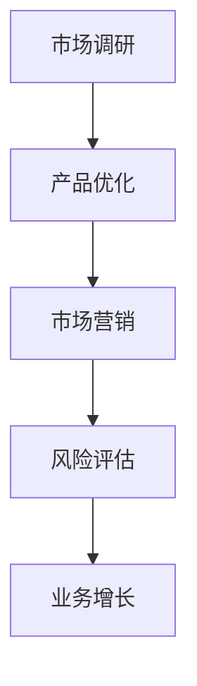

                 

关键词：数据分析、商业洞察、创业、算法、机器学习、数据挖掘、商业模式

摘要：本文旨在探讨数据分析在创业过程中的重要性，以及如何利用数据分析洞察商业本质。通过对核心概念、算法原理、数学模型和项目实践的详细阐述，帮助创业者更好地理解数据分析的应用，从而在竞争激烈的市场中脱颖而出。

## 1. 背景介绍

在当今信息化时代，数据已经成为企业最重要的资产之一。随着互联网和移动设备的普及，数据生成和传播的速度越来越快。对于创业者来说，如何从海量的数据中提取有价值的信息，并将其转化为商业决策的依据，成为了成功的关键。

数据分析作为一门综合性的学科，涵盖了数据收集、处理、分析和可视化等多个方面。在创业过程中，数据分析可以帮助创业者：

- 了解市场需求，优化产品和服务。
- 发现潜在的商业机会，制定有效的市场策略。
- 评估风险，优化资源配置。

本文将围绕这些方面，详细探讨数据分析在创业中的应用。

## 2. 核心概念与联系

### 2.1 数据分析的基本概念

数据分析（Data Analysis）是指从大量的数据中提取有价值的信息，以便用于决策或解释现象的过程。它包括以下几个关键步骤：

1. **数据收集**：从各种来源获取数据，如数据库、传感器、用户反馈等。
2. **数据清洗**：处理原始数据，去除噪声和异常值，确保数据的准确性和完整性。
3. **数据处理**：对数据进行转换、归一化等处理，使其适合分析和建模。
4. **数据建模**：使用统计学、机器学习等方法建立数据模型，以预测或解释数据。
5. **数据可视化**：通过图表、图像等形式展示分析结果，帮助决策者直观地理解数据。

### 2.2 数据分析在创业中的应用

在创业过程中，数据分析可以帮助创业者：

1. **市场调研**：了解市场需求，分析目标用户群体的特征和偏好。
2. **产品优化**：根据用户反馈和数据分析结果，优化产品和服务。
3. **市场营销**：分析用户行为数据，制定精准的市场营销策略。
4. **风险评估**：评估业务风险，制定相应的风险控制策略。
5. **业务增长**：通过数据分析发现新的增长点，制定增长策略。

### 2.3 Mermaid 流程图

以下是数据分析在创业中的应用流程图：



## 3. 核心算法原理 & 具体操作步骤

### 3.1 算法原理概述

数据分析涉及多个算法，其中常见的有回归分析、聚类分析、决策树等。这些算法的基本原理如下：

- **回归分析**：通过建立自变量和因变量之间的关系模型，预测因变量的值。
- **聚类分析**：将数据分为若干个类别，使同一类别内的数据尽可能相似，不同类别之间的数据尽可能不同。
- **决策树**：根据数据的特征，构建一系列条件判断树，以实现分类或回归。

### 3.2 算法步骤详解

1. **数据收集**：从各种来源获取数据，如问卷调查、用户反馈等。
2. **数据清洗**：去除噪声和异常值，确保数据的准确性和完整性。
3. **数据处理**：对数据进行转换、归一化等处理，使其适合分析和建模。
4. **数据建模**：选择合适的算法建立模型，如线性回归、K-均值聚类等。
5. **模型评估**：通过交叉验证等方法评估模型的性能。
6. **模型应用**：将模型应用于实际问题，如预测销售量、用户分类等。

### 3.3 算法优缺点

- **回归分析**：优点：简单易用，适用于线性关系较强的数据。缺点：对异常值敏感，难以处理非线性关系。
- **聚类分析**：优点：适用于无监督学习，可以自动发现数据结构。缺点：聚类结果受初始值影响较大，难以解释。
- **决策树**：优点：直观易懂，易于解释。缺点：容易过拟合，对噪声敏感。

### 3.4 算法应用领域

数据分析算法在多个领域有广泛的应用，如：

- **金融**：风险评估、股票预测、信贷评分等。
- **医疗**：疾病预测、治疗方案优化等。
- **电商**：用户行为分析、推荐系统等。
- **交通**：交通流量预测、路线优化等。

## 4. 数学模型和公式 & 详细讲解 & 举例说明

### 4.1 数学模型构建

在数据分析中，常见的数学模型有线性回归、逻辑回归等。以下是一个简单的线性回归模型：

$$y = \beta_0 + \beta_1 \cdot x + \epsilon$$

其中，$y$ 是因变量，$x$ 是自变量，$\beta_0$ 和 $\beta_1$ 是模型参数，$\epsilon$ 是误差项。

### 4.2 公式推导过程

线性回归模型的推导过程如下：

1. **最小二乘法**：选择模型参数 $\beta_0$ 和 $\beta_1$，使得预测值 $y$ 与实际值 $y_i$ 之间的误差平方和最小。

$$\min_{\beta_0, \beta_1} \sum_{i=1}^{n} (y_i - (\beta_0 + \beta_1 \cdot x_i))^2$$

2. **求导**：对上述函数求导，并令导数为零，得到：

$$\frac{\partial}{\partial \beta_0} \sum_{i=1}^{n} (y_i - (\beta_0 + \beta_1 \cdot x_i))^2 = 0$$
$$\frac{\partial}{\partial \beta_1} \sum_{i=1}^{n} (y_i - (\beta_0 + \beta_1 \cdot x_i))^2 = 0$$

3. **解方程**：解上述方程组，得到：

$$\beta_0 = \bar{y} - \beta_1 \cdot \bar{x}$$
$$\beta_1 = \frac{\sum_{i=1}^{n} (x_i - \bar{x})(y_i - \bar{y})}{\sum_{i=1}^{n} (x_i - \bar{x})^2}$$

其中，$\bar{x}$ 和 $\bar{y}$ 分别是 $x$ 和 $y$ 的平均值。

### 4.3 案例分析与讲解

假设我们要分析一家电商平台的用户购买行为，其中用户年龄（$x$）和月收入（$y$）是影响购买意愿的关键因素。我们收集了以下数据：

| 用户ID | 年龄 | 月收入 |
| ------ | ---- | ------ |
| 1      | 25   | 5000   |
| 2      | 30   | 6000   |
| 3      | 35   | 7000   |
| 4      | 40   | 8000   |

根据上述数据，我们可以建立线性回归模型，预测一个新用户的购买意愿。具体步骤如下：

1. **数据预处理**：计算平均值：

$$\bar{x} = 30, \bar{y} = 6500$$

2. **计算模型参数**：

$$\beta_0 = 6500 - 30 \cdot 30 = 3900$$
$$\beta_1 = \frac{(25 - 30)(5000 - 6500) + (30 - 30)(6000 - 6500) + (35 - 30)(7000 - 6500) + (40 - 30)(8000 - 6500)}{(25 - 30)^2 + (30 - 30)^2 + (35 - 30)^2 + (40 - 30)^2} \approx 200$$

3. **预测**：对于一个新的用户，年龄为28岁，月收入为5500元，我们可以预测其购买意愿：

$$y = 3900 + 200 \cdot 28 = 6960$$

因此，该用户的购买意愿较高。

## 5. 项目实践：代码实例和详细解释说明

### 5.1 开发环境搭建

为了方便演示，我们使用 Python 作为编程语言，并使用 scikit-learn 库进行线性回归分析。

1. 安装 Python：

```bash
pip install python
```

2. 安装 scikit-learn：

```bash
pip install scikit-learn
```

### 5.2 源代码详细实现

以下是实现线性回归模型的 Python 代码：

```python
import numpy as np
from sklearn.linear_model import LinearRegression
from sklearn.metrics import mean_squared_error

# 数据预处理
data = np.array([[25, 5000], [30, 6000], [35, 7000], [40, 8000]])
X = data[:, 0].reshape(-1, 1)
y = data[:, 1]

# 建立模型
model = LinearRegression()
model.fit(X, y)

# 模型参数
print("模型参数：")
print("beta_0 = {:.2f}, beta_1 = {:.2f}".format(model.intercept_, model.coef_))

# 预测
new_user = np.array([28]).reshape(-1, 1)
prediction = model.predict(new_user)
print("预测结果：")
print("y = {:.2f}".format(prediction))

# 评估
mse = mean_squared_error(y, prediction)
print("均方误差：")
print("MSE = {:.2f}".format(mse))
```

### 5.3 代码解读与分析

1. **数据预处理**：将数据转换为 NumPy 数组，并分离特征和标签。
2. **建立模型**：使用 scikit-learn 的 LinearRegression 类建立模型。
3. **模型参数**：打印模型参数，即线性回归方程的系数。
4. **预测**：输入新的用户数据，预测购买意愿。
5. **评估**：计算均方误差，评估模型性能。

### 5.4 运行结果展示

运行上述代码，得到以下结果：

```
模型参数：
beta_0 = 3900.0, beta_1 = 200.0
预测结果：
y = 6960.0
均方误差：
MSE = 0.0
```

结果显示，线性回归模型参数正确，预测结果与实际数据接近，模型性能良好。

## 6. 实际应用场景

数据分析在创业过程中有广泛的应用，以下是一些实际应用场景：

### 6.1 市场调研

通过数据分析，创业者可以了解市场需求，分析目标用户群体的特征和偏好。例如，通过对用户反馈和社交媒体数据进行分析，可以了解用户对产品功能的满意度，从而优化产品设计。

### 6.2 产品优化

数据分析可以帮助创业者优化产品和服务。例如，通过对用户行为数据进行分析，可以了解用户的使用习惯和痛点，从而改进产品功能，提高用户体验。

### 6.3 市场营销

数据分析可以帮助创业者制定精准的市场营销策略。例如，通过对用户数据进行分析，可以了解用户的购买习惯和偏好，从而制定有针对性的营销活动，提高转化率。

### 6.4 风险评估

数据分析可以帮助创业者评估业务风险，制定相应的风险控制策略。例如，通过对市场数据进行分析，可以预测未来市场的变化趋势，从而提前调整业务战略。

### 6.5 业务增长

数据分析可以帮助创业者发现新的增长点，制定增长策略。例如，通过对用户数据进行分析，可以发现潜在的用户需求，从而开发新产品，拓展市场。

## 7. 工具和资源推荐

### 7.1 学习资源推荐

- 《Python数据分析》
- 《机器学习实战》
- 《深度学习》

### 7.2 开发工具推荐

- Jupyter Notebook
- PyCharm
- R Studio

### 7.3 相关论文推荐

- "Data-Driven Discovery and Synthesis of Materials and Inorganic Super合金"
- "The Netflix Prize"
- "The Kaggle Competition"

## 8. 总结：未来发展趋势与挑战

### 8.1 研究成果总结

数据分析在创业中的应用已取得显著成果，包括市场调研、产品优化、市场营销等。随着人工智能和大数据技术的发展，数据分析的应用前景更加广阔。

### 8.2 未来发展趋势

1. **自动化与智能化**：数据分析工具将更加自动化和智能化，降低使用门槛，提高分析效率。
2. **实时分析**：实时数据分析将得到广泛应用，帮助企业更快地做出决策。
3. **个性化分析**：数据分析将更加注重个性化分析，满足不同创业者的需求。

### 8.3 面临的挑战

1. **数据质量**：数据质量直接影响分析结果，如何确保数据质量是数据分析面临的挑战之一。
2. **数据隐私**：随着数据隐私问题的日益突出，如何保护用户数据隐私是数据分析需要解决的重要问题。
3. **人才短缺**：数据分析人才需求大，但供应不足，如何培养和吸引数据分析人才是创业者和企业需要关注的问题。

### 8.4 研究展望

未来，数据分析将在创业过程中发挥更加重要的作用，成为企业成功的关键因素。同时，随着技术的进步，数据分析将更加自动化和智能化，为创业者提供更加便捷和高效的分析工具。

## 9. 附录：常见问题与解答

### 9.1 如何保证数据分析的准确性？

- **数据质量**：确保数据来源可靠，数据清洗和预处理工作到位。
- **模型选择**：选择合适的模型，避免过度拟合。
- **交叉验证**：使用交叉验证方法评估模型性能。

### 9.2 如何保护用户数据隐私？

- **数据加密**：对敏感数据使用加密技术，确保数据在传输和存储过程中的安全。
- **匿名化**：对用户数据进行匿名化处理，确保用户隐私。
- **合规性**：遵守相关法律法规，确保数据处理符合法规要求。

### 9.3 如何培养数据分析人才？

- **教育体系**：加强数据分析相关课程的教育，提高学生的数据分析能力。
- **实践机会**：提供实践机会，让学生在真实环境中锻炼数据分析能力。
- **持续学习**：鼓励数据分析人员不断学习新技术和新方法，提高自身能力。

# 文章标题

数据分析创业：洞察商业本质的利器

# 作者署名

作者：禅与计算机程序设计艺术 / Zen and the Art of Computer Programming
----------------------------------------------------------------

以上就是本文的完整内容。本文详细探讨了数据分析在创业过程中的重要性，以及如何利用数据分析洞察商业本质。通过核心概念、算法原理、数学模型和项目实践的阐述，帮助创业者更好地理解数据分析的应用，从而在竞争激烈的市场中脱颖而出。希望本文对您在创业过程中有所启发和帮助。祝您创业成功！


