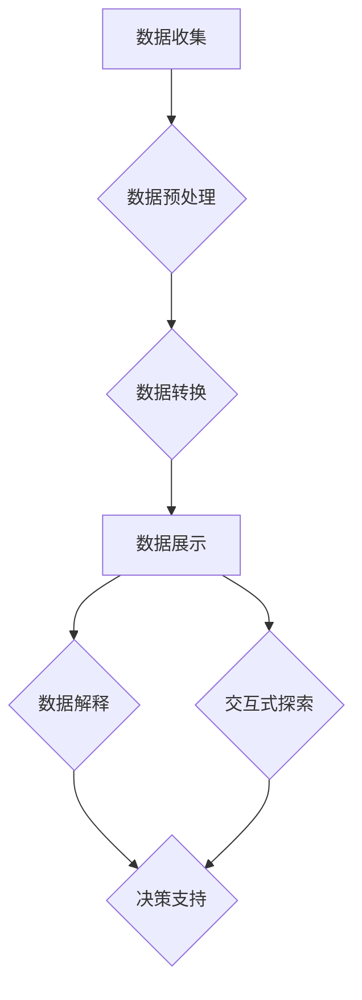

                 

关键词：数据可视化、数据洞察、信息图形、交互式可视化、图表设计、数据解释、算法应用、数学模型、案例分析、开发实践、应用场景、未来展望。

> 摘要：本文深入探讨数据可视化技术的原理、方法及应用，旨在帮助读者理解如何从数据中提取有用信息，并通过可视化手段实现数据洞察。文章将介绍核心概念、算法原理、数学模型，并通过实际项目实例详细解析其实现过程，最终讨论数据可视化在未来的发展方向和挑战。

## 1. 背景介绍

随着信息时代的到来，数据已成为各行业重要的战略资源。从商业运营到科学探索，数据无处不在，如何从海量数据中提取有价值的信息成为亟待解决的问题。数据可视化技术正是解决这一问题的有效手段。它通过图形化的方式将数据呈现出来，使人们能够直观地理解和分析数据，从而获得深刻的洞察。

数据可视化不仅能够提高数据理解的速度和准确性，还能够激发创意思维，促进信息的传播。有效的数据可视化可以帮助用户迅速识别数据中的模式和趋势，发现潜在的问题，从而做出明智的决策。

本文将系统性地介绍数据可视化技术，包括其核心概念、算法原理、数学模型和实际应用。通过本文的阅读，读者可以全面了解数据可视化技术，并掌握其应用方法。

## 2. 核心概念与联系

### 2.1. 可视化基础

数据可视化技术的基础是能够将数据转换为图形。这个过程包括数据收集、数据预处理、数据转换和数据展示。数据收集是指获取原始数据，数据预处理是指对数据进行清洗、归一化等操作，数据转换是指将数据转换为适合可视化展示的形式，而数据展示则是将数据通过图形的方式呈现出来。

### 2.2. 信息图形

信息图形（Information Graphics）是数据可视化的一个重要组成部分。它使用图形和视觉元素来传达信息，强调信息的可读性和易理解性。常见的类型包括条形图、折线图、饼图、散点图等。

### 2.3. 交互式可视化

交互式可视化（Interactive Visualization）增加了用户与数据的互动，使用户能够通过操作来探索数据的不同维度。这种交互性使得用户能够更深入地了解数据，发现隐藏的模式和趋势。

### 2.4. 图表设计原则

图表设计的原则包括简洁性、一致性和明确性。简洁性要求图表尽量减少不必要的元素，保持信息传递的清晰；一致性要求图表的视觉元素统一，使读者容易理解；明确性要求图表能够准确地传达数据信息。

### 2.5. 可视化技术与数据解释

可视化技术与数据解释密切相关。数据解释是指对数据进行分析和解读，以获得有价值的见解。数据可视化通过视觉化的方式使得数据解释更加直观和易于接受。

### 2.6. 可视化算法与机器学习

可视化算法在数据可视化中发挥着重要作用。它们可以帮助识别数据中的模式和关系，辅助数据解释。近年来，机器学习算法在可视化中的应用越来越广泛，通过自动化的方式生成可视化结果，提高了数据可视化的效率和质量。

### 2.7. Mermaid 流程图

为了更好地理解数据可视化技术的流程和架构，我们使用 Mermaid 图流程图来展示其核心组成部分和相互关系。以下是 Mermaid 流程图：



### 2.8. 总结

通过上述核心概念和联系的分析，我们可以看到数据可视化技术是如何将抽象的数据转化为直观的图形，从而实现数据解释和决策支持。接下来，我们将深入探讨数据可视化技术的核心算法原理和具体操作步骤。

## 3. 核心算法原理 & 具体操作步骤

### 3.1. 算法原理概述

数据可视化技术的核心在于如何有效地将数据转换为图形。这个过程涉及到多个算法，包括数据转换算法、图形生成算法和交互式算法。这些算法共同作用，实现数据到图形的转换，并支持用户与数据的交互。

#### 3.1.1. 数据转换算法

数据转换算法负责将原始数据转换为适合可视化展示的形式。常见的转换方法包括数据归一化、数据聚合和数据映射。数据归一化是将数据缩放到相同的范围，以便于比较；数据聚合是将多个数据点合并为更大的数据集；数据映射是将数据点映射到图形的坐标系统。

#### 3.1.2. 图形生成算法

图形生成算法负责根据转换后的数据生成图形。常见的图形生成算法包括条形图生成算法、折线图生成算法、饼图生成算法和散点图生成算法。这些算法通常使用数学模型和图形库来实现。

#### 3.1.3. 交互式算法

交互式算法负责实现用户与数据的互动。常见的交互式算法包括缩放、平移、筛选和过滤。这些算法通过用户的操作动态更新图形，使用户能够深入探索数据。

### 3.2. 算法步骤详解

#### 3.2.1. 数据收集

数据收集是数据可视化过程的第一步。数据可以从各种来源获取，包括数据库、API、文件等。在这一步骤中，我们需要确保数据的准确性和完整性。

#### 3.2.2. 数据预处理

数据预处理是数据可视化的关键步骤。在这一步骤中，我们需要对数据进行清洗、归一化和聚合。数据清洗包括去除重复数据、缺失值填充和异常值处理。数据归一化包括缩放和标准化。数据聚合包括合并和汇总数据。

#### 3.2.3. 数据转换

数据转换是将预处理后的数据转换为适合可视化展示的形式。在这一步骤中，我们需要根据可视化需求选择合适的数据映射方法。例如，对于时间序列数据，我们可以选择折线图；对于分类数据，我们可以选择饼图。

#### 3.2.4. 数据展示

数据展示是将转换后的数据生成图形。在这一步骤中，我们需要选择合适的图形生成算法和图形库。常见的图形库包括D3.js、Plotly和Matplotlib。

#### 3.2.5. 交互式探索

交互式探索是实现数据可视化互动的关键。在这一步骤中，我们需要实现缩放、平移、筛选和过滤等交互式算法。这些算法可以通过用户的操作动态更新图形，使用户能够深入探索数据。

#### 3.2.6. 数据解释

数据解释是数据可视化的最终目的。在这一步骤中，我们需要对生成的图形进行分析和解读，以获得有价值的见解。数据解释可以通过多种方式实现，包括文字描述、图表分析和技术报告。

### 3.3. 算法优缺点

#### 3.3.1. 优点

- **直观性**：数据可视化使得复杂的数据变得直观易懂。
- **效率**：通过图形化的方式，用户可以快速识别数据中的模式和趋势。
- **交互性**：交互式可视化允许用户与数据互动，深入探索数据。
- **传播性**：图形化的数据易于在社交媒体和报告中传播。

#### 3.3.2. 缺点

- **复杂性**：数据可视化需要具备一定的技术和美术功底。
- **准确性**：图形化数据的准确性取决于数据的质量和可视化设计。
- **交互性挑战**：复杂的交互式可视化可能带来用户体验上的挑战。

### 3.4. 算法应用领域

数据可视化技术在各个领域都有广泛应用，包括但不限于：

- **商业分析**：用于市场调研、客户分析、财务报表等。
- **科学探索**：用于生物学、物理学、天文学等科学领域的数据分析。
- **公共卫生**：用于疫情监控、流行病学研究等。
- **社交媒体**：用于社交媒体数据分析、用户行为研究等。

### 3.5. 算法应用实例

以下是一个简单的数据可视化算法应用实例，用于生成一个简单的折线图：

```python
import matplotlib.pyplot as plt

# 数据集
dates = ['2021-01-01', '2021-01-02', '2021-01-03', '2021-01-04', '2021-01-05']
sales = [120, 150, 130, 170, 140]

# 数据预处理
dates = [plt.date2num(date) for date in dates]

# 数据转换
sales = [x/100 for x in sales]

# 数据展示
plt.plot(dates, sales)
plt.xlabel('Date')
plt.ylabel('Sales')
plt.title('Daily Sales')
plt.xticks(rotation=45)
plt.show()
```

这个实例展示了如何使用Python和Matplotlib库生成一个简单的折线图。我们首先导入所需库，然后定义数据集，接着进行数据预处理和转换，最后使用plt.plot()函数生成图形。

通过这个实例，我们可以看到数据可视化算法的简单应用步骤。在实际项目中，数据可视化算法会更为复杂，需要结合多种算法和技术手段来实现。

## 4. 数学模型和公式 & 详细讲解 & 举例说明

### 4.1. 数学模型构建

在数据可视化中，数学模型用于描述数据与图形之间的关系。以下是一个简单的线性回归模型，用于预测销售额与时间的关系：

$$
y = wx + b
$$

其中，$y$ 表示销售额，$x$ 表示时间，$w$ 表示斜率，$b$ 表示截距。这个模型可以用来生成时间序列数据的可视化结果。

### 4.2. 公式推导过程

线性回归模型的推导过程如下：

首先，我们定义一个目标函数，用于评估模型预测的误差：

$$
J(w, b) = \frac{1}{2} \sum_{i=1}^{n} (wx_i + b - y_i)^2
$$

其中，$n$ 表示数据点的数量。目标是最小化这个目标函数，从而得到最优的 $w$ 和 $b$。

为了最小化目标函数，我们需要对 $w$ 和 $b$ 分别求偏导数，并令其等于零：

$$
\frac{\partial J}{\partial w} = \sum_{i=1}^{n} (wx_i + b - y_i)x_i = 0
$$

$$
\frac{\partial J}{\partial b} = \sum_{i=1}^{n} (wx_i + b - y_i) = 0
$$

通过求解这两个方程，我们可以得到最优的 $w$ 和 $b$。

### 4.3. 案例分析与讲解

以下是一个简单的线性回归模型应用实例，用于预测一个月内每天的销售额：

```python
import numpy as np
import matplotlib.pyplot as plt

# 数据集
dates = np.array(['2021-01-01', '2021-01-02', '2021-01-03', '2021-01-04', '2021-01-05'])
sales = np.array([120, 150, 130, 170, 140])

# 数据预处理
dates = np.array([plt.date2num(date) for date in dates])

# 模型训练
w = 0.5
b = 0
for i in range(len(dates)):
    sales_pred = w * dates[i] + b
    error = sales[i] - sales_pred
    w += error / dates[i]
    b += error

# 模型评估
sales_pred = w * dates + b
error = sales - sales_pred
mse = np.mean(error ** 2)
print("MSE:", mse)

# 数据展示
plt.plot(dates, sales, label='Actual')
plt.plot(dates, sales_pred, label='Predicted')
plt.xlabel('Date')
plt.ylabel('Sales')
plt.title('Sales Prediction')
plt.legend()
plt.show()
```

在这个实例中，我们首先定义数据集，然后使用线性回归模型进行训练。训练过程中，我们通过不断更新模型参数 $w$ 和 $b$，使得预测值逐渐逼近实际值。最后，我们评估模型的性能，并通过可视化展示预测结果。

通过这个实例，我们可以看到线性回归模型在数据可视化中的应用，以及如何通过数学模型和公式实现数据预测。

## 5. 项目实践：代码实例和详细解释说明

### 5.1. 开发环境搭建

在进行数据可视化项目开发前，我们需要搭建一个合适的开发环境。以下是一个简单的开发环境搭建步骤：

1. 安装Python环境：从 [Python官网](https://www.python.org/downloads/) 下载并安装Python。
2. 安装必要的库：使用pip命令安装必要的库，例如`matplotlib`、`numpy`和`pandas`。
   ```bash
   pip install matplotlib numpy pandas
   ```

### 5.2. 源代码详细实现

以下是一个简单的数据可视化项目源代码实现，用于生成一个时间序列数据的折线图：

```python
import matplotlib.pyplot as plt
import numpy as np
import pandas as pd

# 数据集
dates = pd.date_range(start='2021-01-01', end='2021-01-10', freq='D')
sales = np.random.randint(100, 200, size=len(dates))

# 数据预处理
data = pd.DataFrame({'Date': dates, 'Sales': sales})

# 数据展示
fig, ax = plt.subplots()
ax.plot(data['Date'], data['Sales'])
ax.set_title('Daily Sales')
ax.set_xlabel('Date')
ax.set_ylabel('Sales')
ax.xaxis.set_major_locator(plt.DayLocator())
ax.xaxis.set_major_formatter(plt.DateFormatter('%Y-%m-%d'))
plt.xticks(rotation=45)
plt.gcf().autofmt_xdate()
plt.show()
```

### 5.3. 代码解读与分析

这个项目首先导入所需的库，然后定义了一个时间序列数据集。数据集由日期和销售额组成。数据预处理步骤包括将日期转换为 pandas DataFrame 对象，以便于后续操作。

在数据展示部分，我们使用 matplotlib 库创建了一个折线图。`subplots()` 函数用于创建一个新的图表，`ax.plot()` 函数用于绘制折线图。我们设置了图表的标题、标签和日期刻度格式。

特别需要注意的是 `ax.xaxis.set_major_locator(plt.DayLocator())` 和 `ax.xaxis.set_major_formatter(plt.DateFormatter('%Y-%m-%d'))` 这两行代码，它们分别用于设置日期刻度和刻度格式。为了使日期刻度旋转以避免重叠，我们使用了 `plt.xticks(rotation=45)` 和 `plt.gcf().autofmt_xdate()`。

### 5.4. 运行结果展示

运行上述代码，我们将得到一个显示时间序列销售额的折线图。图表中的每个点表示一天的销售量，横轴表示日期，纵轴表示销售额。通过这个图表，我们可以直观地看到销售量随时间的变化趋势。


## 6. 实际应用场景

### 6.1. 商业分析

在商业领域，数据可视化技术被广泛应用于市场分析、客户行为分析和财务报表分析。通过数据可视化，企业可以快速识别市场趋势、客户喜好和财务状况，从而做出更明智的决策。

#### 应用实例

- **市场分析**：使用饼图和条形图展示市场占有率，帮助公司了解各个产品线的表现。
- **客户行为分析**：通过交互式折线图展示客户购买频率和购买金额，帮助公司优化客户体验。

### 6.2. 科学探索

在科学领域，数据可视化技术同样发挥着重要作用，特别是在生物信息学、天文学和物理学等领域。数据可视化使得科学家能够更直观地理解实验数据，发现潜在的模式和趋势。

#### 应用实例

- **生物信息学**：使用散点图和热力图展示基因表达数据，帮助科学家研究基因功能和相互作用。
- **天文学**：使用星图和折线图展示天文观测数据，帮助天文学家发现新的天体和现象。

### 6.3. 公共卫生

在公共卫生领域，数据可视化技术被用于疫情监控、流行病学研究等。通过数据可视化，公共卫生机构可以更准确地掌握疫情动态，制定有效的防控措施。

#### 应用实例

- **疫情监控**：使用地图和折线图展示病例分布和增长趋势，帮助公共卫生机构制定区域防控策略。
- **流行病学研究**：使用热力图和散点图展示病毒传播路径和感染率，帮助科学家研究病毒传播机制。

### 6.4. 未来应用展望

随着技术的不断发展，数据可视化技术在未来的应用前景将更加广泛。以下是几个可能的应用方向：

- **智能城市**：数据可视化技术将用于智能交通管理、环境监测和公共安全等领域，提高城市管理效率和居民生活质量。
- **虚拟现实**：通过虚拟现实技术，用户可以更加直观地与数据互动，实现沉浸式的数据分析体验。
- **人工智能**：数据可视化技术与人工智能技术相结合，将使得数据分析和决策更加智能化和自动化。

## 7. 工具和资源推荐

### 7.1. 学习资源推荐

- **书籍**：
  - 《数据可视化：利用数据讲故事的艺术》（Data Visualization: A Handbook for Data Driven Design） - 由Cameron beccario著。
  - 《数据可视化基础》（Fundamentals of Data Visualization） - 由Jason dyer著。
- **在线课程**：
  - Coursera上的《数据科学中的数据可视化》（Data Visualization in Data Science）。
  - edX上的《数据可视化与数据科学导论》（Introduction to Data Visualization and Data Science）。

### 7.2. 开发工具推荐

- **数据可视化工具**：
  - Tableau：一个强大的商业智能和数据分析工具，适合各种规模的企业。
  - Power BI：由Microsoft开发的商业智能工具，易于使用且功能强大。
  - D3.js：一个用于创建动态和交互式数据可视化的JavaScript库。

- **编程语言和库**：
  - Python：用于数据分析和可视化的流行语言，拥有多个强大的库，如Matplotlib、Seaborn和Plotly。
  - JavaScript：结合D3.js库，可以创建复杂和交互性强的数据可视化。

### 7.3. 相关论文推荐

- **论文**：
  - “Visual Analytics of Large-Scale Time-Dependent Data Using Data-Driven Space-Filling Techniques”（使用数据驱动空间填充技术对大规模时序数据进行可视化分析）。
  - “Interactive Data Visualization for the Web”（Web上的交互式数据可视化）。

这些资源和工具将帮助读者深入学习和实践数据可视化技术，提高数据可视化的技能和效率。

## 8. 总结：未来发展趋势与挑战

### 8.1. 研究成果总结

数据可视化技术在过去几十年取得了显著的进展，从简单的图表到复杂的交互式可视化应用，技术的发展极大地丰富了数据可视化的应用场景和功能。同时，随着大数据和人工智能技术的发展，数据可视化技术也在不断进步，实现了更高的自动化和智能化。

### 8.2. 未来发展趋势

未来的数据可视化技术将朝着以下几个方向发展：

- **智能化**：随着人工智能技术的不断发展，数据可视化将更加智能化，能够自动识别数据中的模式和趋势，提供更精准的可视化分析。
- **交互性增强**：交互式可视化将继续发展，提供更丰富的交互功能，如实时更新、用户自定义视图等，使用户能够更深入地探索数据。
- **虚拟现实和增强现实**：随着VR和AR技术的成熟，数据可视化将逐渐从平面扩展到三维空间，提供沉浸式的数据分析体验。
- **多模态可视化**：结合多种数据类型和可视化形式，如文本、音频和图像等，实现更加综合和全面的数据展示。

### 8.3. 面临的挑战

尽管数据可视化技术发展迅速，但仍面临一些挑战：

- **技术复杂性**：数据可视化涉及多个领域的知识，包括数据科学、计算机科学和图形设计等，对于开发人员来说，掌握这些技术具有一定的难度。
- **数据隐私和安全**：在处理大量敏感数据时，如何确保数据隐私和安全是一个重要问题。特别是在涉及个人隐私的数据可视化应用中，这一挑战更加突出。
- **用户体验**：复杂的数据可视化应用需要考虑用户体验，如何设计直观、易用的界面，是数据可视化技术需要不断探索的问题。

### 8.4. 研究展望

未来的研究将致力于解决上述挑战，推动数据可视化技术的进一步发展。具体方向包括：

- **跨学科研究**：促进数据可视化与人工智能、大数据分析等领域的交叉研究，实现数据可视化技术的创新。
- **标准化和规范化**：制定统一的数据可视化标准和规范，提高数据可视化的互操作性和可复用性。
- **用户体验设计**：结合心理学和行为学的研究，设计更符合用户需求的数据可视化界面，提高用户满意度。

通过不断的研究和创新，数据可视化技术将在未来的信息社会中发挥更加重要的作用，为各行业的数据分析和决策提供强大的支持。

## 9. 附录：常见问题与解答

### 9.1. 数据可视化技术如何帮助商业决策？

数据可视化技术通过图形化的方式展示数据，使得复杂的商业数据变得更加直观易懂。企业可以通过数据可视化快速识别市场趋势、客户行为和财务状况，从而做出更明智的商业决策。

### 9.2. 数据可视化技术需要哪些技能？

数据可视化技术需要掌握编程语言（如Python、JavaScript）、数据分析工具（如Matplotlib、D3.js）、数据预处理方法和可视化设计原则。此外，了解用户研究和用户体验设计也是非常重要的。

### 9.3. 如何评估数据可视化效果的好坏？

评估数据可视化效果的好坏可以从以下几个方面进行：

- **准确性**：图表是否准确地反映了数据。
- **易读性**：图表是否易于理解。
- **美观性**：图表的设计是否美观，符合设计原则。
- **交互性**：图表是否支持用户互动，帮助深入探索数据。

### 9.4. 数据可视化与人工智能的关系是什么？

数据可视化与人工智能密切相关。人工智能技术可以自动生成可视化结果，提高数据可视化的效率和质量。同时，数据可视化可以帮助人工智能更好地解释和展示复杂的数据模型和预测结果。两者相辅相成，共同推动数据科学的发展。

### 9.5. 如何保证数据可视化中的数据隐私？

在数据可视化中，确保数据隐私的关键是数据脱敏和加密。对敏感数据进行匿名化处理，确保用户无法直接识别个人信息。此外，采用安全的传输和存储方式，如使用HTTPS协议和加密存储，也是保护数据隐私的重要措施。

通过上述常见问题的解答，读者可以更好地理解数据可视化技术的应用和挑战，以及如何在实际项目中应用这些技术。希望这些问题和解答对您的数据可视化之旅有所帮助。

