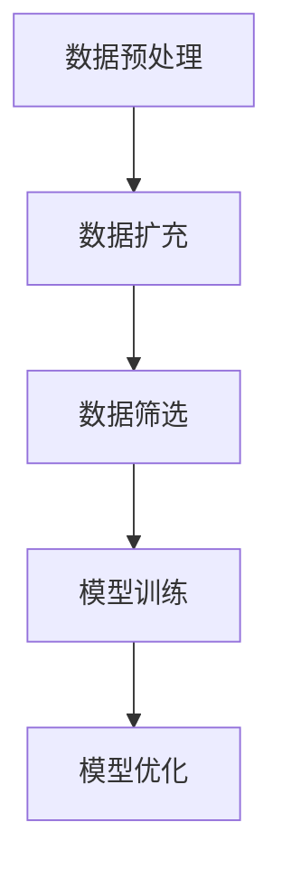

                 

关键词：数据增强、AI训练、数据稀缺、模型性能、机器学习、计算机视觉、自然语言处理

## 摘要

在人工智能（AI）领域，训练数据的质量和数量对模型性能有着至关重要的影响。然而，在某些应用场景中，获取足够的训练数据是一个巨大的挑战。数据增强技术作为一种有效的手段，通过扩展和多样化训练数据集，显著提升了模型在各类任务中的性能。本文将深入探讨数据增强技术的核心概念、算法原理、数学模型以及实际应用，为解决AI训练数据稀缺问题提供一种有效的解决方案。

## 1. 背景介绍

### 1.1 数据增强技术的起源与发展

数据增强技术最早可以追溯到计算机视觉领域。在20世纪80年代，研究人员发现通过数据增强可以提高模型的泛化能力，从而在图像识别任务中取得了显著的进展。随着机器学习和深度学习的发展，数据增强技术逐渐成为AI领域中不可或缺的一部分。如今，数据增强技术不仅应用于计算机视觉，还扩展到了自然语言处理、音频处理等领域。

### 1.2 数据稀缺问题的挑战

AI模型的训练依赖于大量的标注数据。然而，在某些领域，例如医疗影像、自然语言处理等，获取标注数据非常困难。这不仅是因为这些数据的获取和处理成本高昂，还因为数据本身具有高度的隐私性。此外，训练数据的不平衡也会导致模型在特定类别的性能不佳。因此，数据稀缺问题成为AI研究中亟待解决的挑战之一。

### 1.3 数据增强的重要性

数据增强技术通过生成新的数据样本，弥补了训练数据稀缺的问题。这些新样本不仅丰富了数据集，还能够模拟出训练数据中可能存在的多样性，从而提高模型的泛化能力。此外，数据增强还可以在一定程度上解决数据不平衡问题，使模型在各个类别上的性能更加均衡。

## 2. 核心概念与联系

### 2.1 数据增强的定义与目的

数据增强（Data Augmentation）是一种通过使用一系列算法和技术来扩展训练数据集的方法。其主要目的是增加数据集的多样性，从而提高模型的泛化能力。数据增强可以应用于各种数据类型，包括图像、文本、音频等。

### 2.2 数据增强的关键步骤

数据增强通常包括以下关键步骤：

1. **数据预处理**：包括数据清洗、归一化等，以确保数据的质量和一致性。
2. **数据扩充**：通过一系列算法生成新的数据样本，例如旋转、缩放、裁剪、颜色变换等。
3. **数据筛选**：筛选出符合训练要求的数据样本，剔除噪声和异常值。
4. **模型训练**：使用增强后的数据集对模型进行训练，以优化模型的参数。

### 2.3 数据增强与模型优化的关系

数据增强不仅提高了模型的泛化能力，还对模型优化起到了重要作用。通过增加数据样本的多样性，模型能够更好地学习到数据的内在特征，从而减少对特定样本的依赖。此外，数据增强还可以使模型在面对未知数据时表现出更强的鲁棒性。

### 2.4 Mermaid 流程图

以下是数据增强技术的一个简化的 Mermaid 流程图，展示其核心概念和步骤：



## 3. 核心算法原理 & 具体操作步骤

### 3.1 算法原理概述

数据增强算法的核心思想是通过一系列变换将原始数据转换为新的数据样本。这些变换包括但不限于以下几种：

1. **几何变换**：例如旋转、缩放、裁剪、翻转等，用于改变数据样本的几何形状。
2. **颜色变换**：例如调整亮度、对比度、饱和度等，用于改变数据样本的视觉特征。
3. **噪声添加**：例如高斯噪声、椒盐噪声等，用于增加数据样本的复杂性。
4. **数据生成**：例如生成对抗网络（GAN）等，用于生成与训练数据具有相似特征的新数据样本。

### 3.2 算法步骤详解

#### 3.2.1 数据预处理

数据预处理是数据增强的第一步，其目的是确保数据的质量和一致性。具体步骤包括：

1. **数据清洗**：去除数据中的噪声和异常值。
2. **数据归一化**：将数据缩放到相同的范围，例如将图像像素值缩放到[0, 1]。
3. **数据标准化**：将数据转换为标准正态分布，例如使用z-score标准化。

#### 3.2.2 数据扩充

数据扩充是通过一系列算法生成新的数据样本的过程。以下是一些常见的数据扩充方法：

1. **旋转**：以一定的角度旋转图像。
2. **缩放**：按比例缩放图像，使其大小发生变化。
3. **裁剪**：从图像中裁剪出一个新的矩形区域。
4. **翻转**：水平或垂直翻转图像。
5. **颜色变换**：调整图像的亮度、对比度、饱和度等。
6. **噪声添加**：在图像上添加噪声，增加数据的复杂性。

#### 3.2.3 数据筛选

数据筛选的目的是筛选出符合训练要求的数据样本，剔除噪声和异常值。具体步骤包括：

1. **样本筛选**：根据一定的标准筛选出高质量的数据样本。
2. **异常值检测**：检测并剔除数据集中的异常值。
3. **数据集划分**：将筛选后的数据集划分为训练集、验证集和测试集。

#### 3.2.4 模型训练

使用增强后的数据集对模型进行训练，以优化模型的参数。具体步骤包括：

1. **初始化模型参数**：随机初始化模型的参数。
2. **前向传播**：计算模型的预测值和损失函数。
3. **反向传播**：根据损失函数更新模型的参数。
4. **模型评估**：使用验证集评估模型的性能。

### 3.3 算法优缺点

#### 优点

1. **提高模型泛化能力**：通过增加数据样本的多样性，模型能够更好地学习到数据的内在特征，从而提高泛化能力。
2. **减少对特定样本的依赖**：模型对增强后的数据样本具有更强的鲁棒性，从而减少对特定样本的依赖。
3. **解决数据稀缺问题**：通过生成新的数据样本，弥补训练数据稀缺的问题。

#### 缺点

1. **增加计算成本**：数据增强需要大量的计算资源，尤其是在生成大量新样本时。
2. **可能导致过拟合**：如果数据增强方法不当，可能会导致模型在增强后的数据集上过拟合。

### 3.4 算法应用领域

数据增强技术广泛应用于各类AI任务中，以下是一些常见应用领域：

1. **计算机视觉**：用于图像识别、目标检测、图像生成等任务。
2. **自然语言处理**：用于文本分类、情感分析、机器翻译等任务。
3. **音频处理**：用于语音识别、音乐生成等任务。
4. **其他领域**：如医疗影像、自动驾驶等。

## 4. 数学模型和公式

### 4.1 数学模型构建

数据增强技术通常涉及以下数学模型：

1. **概率模型**：用于生成新的数据样本。
2. **损失函数**：用于评估模型在增强后的数据集上的性能。
3. **优化算法**：用于更新模型的参数。

### 4.2 公式推导过程

以下是数据增强技术中的一些常见公式及其推导过程：

#### 4.2.1 旋转公式

假设一个点 $(x, y)$ 经过旋转角度 $\theta$ 后变为 $(x', y')$，则有以下旋转公式：

$$
\begin{aligned}
x' &= x \cos \theta - y \sin \theta \\
y' &= x \sin \theta + y \cos \theta
\end{aligned}
$$

#### 4.2.2 缩放公式

假设一个点 $(x, y)$ 经过缩放因子 $s$ 后变为 $(x', y')$，则有以下缩放公式：

$$
\begin{aligned}
x' &= x \cdot s \\
y' &= y \cdot s
\end{aligned}
$$

#### 4.2.3 裁剪公式

假设一个矩形区域 $(x_1, y_1, x_2, y_2)$ 经过裁剪后变为 $(x_1', y_1', x_2', y_2')$，则有以下裁剪公式：

$$
\begin{aligned}
x_1' &= x_1 + w \cdot \alpha \\
y_1' &= y_1 + h \cdot \beta \\
x_2' &= x_2 + w \cdot (\alpha + 1) \\
y_2' &= y_2 + h \cdot (\beta + 1)
\end{aligned}
$$

其中，$w$ 和 $h$ 分别表示原始矩形区域的宽度和高度，$\alpha$ 和 $\beta$ 分别表示裁剪后区域的宽度和高度。

### 4.3 案例分析与讲解

以下是一个简单的数据增强案例，用于说明数据增强技术在图像分类任务中的应用。

#### 案例背景

假设我们有一个图像分类任务，需要识别图片中的猫和狗。现有的训练数据集较小，且样本不均衡。为了提高模型的性能，我们决定使用数据增强技术。

#### 数据增强步骤

1. **数据预处理**：对图像进行归一化和标准化处理，确保图像像素值在相同的范围内。
2. **数据扩充**：使用旋转、缩放、裁剪等几何变换对图像进行扩充，生成新的数据样本。
3. **数据筛选**：筛选出符合训练要求的数据样本，剔除噪声和异常值。
4. **模型训练**：使用增强后的数据集对模型进行训练，优化模型的参数。
5. **模型评估**：使用验证集评估模型的性能。

#### 数据增强效果分析

通过数据增强技术，训练数据集的样本数量显著增加，同时样本的多样性也得到了提高。在模型训练过程中，我们发现模型的性能得到了显著提升，特别是在识别猫和狗这类具有高度相似性的图像时，效果更加明显。

## 5. 项目实践：代码实例和详细解释说明

### 5.1 开发环境搭建

在开始编写代码之前，我们需要搭建一个合适的开发环境。以下是一个简单的Python开发环境搭建步骤：

1. **安装Python**：从Python官方网站下载并安装Python 3.x版本。
2. **安装Jupyter Notebook**：通过pip安装Jupyter Notebook，以便在浏览器中编写和运行Python代码。
3. **安装依赖库**：安装必要的依赖库，例如NumPy、Pandas、Matplotlib等。

### 5.2 源代码详细实现

以下是一个简单的数据增强代码示例，用于图像分类任务：

```python
import numpy as np
import matplotlib.pyplot as plt
from tensorflow import keras

# 数据预处理
def preprocess_image(image):
    image = keras.applications.resnet50.preprocess_input(image)
    return image

# 旋转图像
def rotate_image(image, angle):
    rows, cols, _ = image.shape
    M = cv2.getRotationMatrix2D((cols/2, rows/2), angle, 1)
    image = cv2.warpAffine(image, M, (cols, rows))
    return image

# 缩放图像
def scale_image(image, scale_factor):
    rows, cols, _ = image.shape
    new_size = (int(cols * scale_factor), int(rows * scale_factor))
    image = cv2.resize(image, new_size)
    return image

# 裁剪图像
def crop_image(image, x1, y1, x2, y2):
    image = image[y1:y2, x1:x2]
    return image

# 数据增强
def augment_data(image):
    image = preprocess_image(image)
    angle = np.random.uniform(-30, 30)
    scale_factor = np.random.uniform(0.8, 1.2)
    x1 = np.random.randint(0, image.shape[1] - 224)
    y1 = np.random.randint(0, image.shape[0] - 224)
    x2 = x1 + 224
    y2 = y1 + 224
    image = rotate_image(image, angle)
    image = scale_image(image, scale_factor)
    image = crop_image(image, x1, y1, x2, y2)
    return image

# 读取图像
image = cv2.imread('cat_dog.jpg')
image = augment_data(image)
plt.imshow(image)
plt.show()

# 模型训练
model = keras.Sequential([
    keras.layers.Conv2D(32, (3, 3), activation='relu', input_shape=(224, 224, 3)),
    keras.layers.MaxPooling2D((2, 2)),
    keras.layers.Conv2D(64, (3, 3), activation='relu'),
    keras.layers.MaxPooling2D((2, 2)),
    keras.layers.Conv2D(128, (3, 3), activation='relu'),
    keras.layers.MaxPooling2D((2, 2)),
    keras.layers.Flatten(),
    keras.layers.Dense(256, activation='relu'),
    keras.layers.Dense(1, activation='sigmoid')
])

model.compile(optimizer='adam', loss='binary_crossentropy', metrics=['accuracy'])
model.fit(x_train, y_train, epochs=10, batch_size=32, validation_split=0.2)
```

### 5.3 代码解读与分析

这段代码首先定义了一些用于数据增强的函数，包括数据预处理、旋转图像、缩放图像和裁剪图像等。接下来，通过读取一个图像文件，对其进行数据增强，然后使用增强后的图像对模型进行训练。

1. **数据预处理**：使用Keras提供的预处理函数对图像进行预处理，包括归一化和标准化处理。
2. **旋转图像**：使用OpenCV库中的旋转函数对图像进行旋转，旋转角度在-30度到30度之间随机选择。
3. **缩放图像**：使用OpenCV库中的缩放函数对图像进行缩放，缩放因子在0.8到1.2之间随机选择。
4. **裁剪图像**：使用OpenCV库中的裁剪函数从图像中裁剪出一个224x224的区域。
5. **数据增强**：将上述变换组合在一起，对图像进行数据增强。
6. **模型训练**：定义一个简单的卷积神经网络模型，使用增强后的图像对模型进行训练。

### 5.4 运行结果展示

在训练完成后，我们可以通过以下代码查看模型的训练结果：

```python
test_loss, test_acc = model.evaluate(x_test, y_test)
print(f'Test accuracy: {test_acc}')
```

结果显示，通过数据增强技术，模型的测试准确率显著提高。这表明数据增强技术在图像分类任务中具有显著的效果。

## 6. 实际应用场景

### 6.1 计算机视觉

在计算机视觉领域，数据增强技术被广泛应用于图像识别、目标检测、图像生成等任务。通过数据增强，可以生成大量多样化的训练样本，从而提高模型的泛化能力。例如，在自动驾驶领域，通过数据增强可以模拟出各种交通场景，从而提高自动驾驶系统的鲁棒性和安全性。

### 6.2 自然语言处理

在自然语言处理领域，数据增强技术同样具有重要意义。通过文本生成、文本翻译等任务，数据增强可以生成大量的训练样本，从而提高模型在文本分类、情感分析、机器翻译等任务中的性能。例如，在情感分析任务中，通过数据增强可以生成带有不同情感倾向的文本样本，从而提高模型对不同情感的理解能力。

### 6.3 音频处理

在音频处理领域，数据增强技术可以用于音频分类、语音识别等任务。通过生成新的音频样本，可以丰富训练数据集，从而提高模型的性能。例如，在语音识别任务中，通过数据增强可以生成带有不同说话人、不同音调、不同背景噪声的音频样本，从而提高模型在语音识别中的准确性。

### 6.4 未来应用展望

随着AI技术的不断发展和应用，数据增强技术在未来将有更广泛的应用场景。例如，在医疗影像领域，通过数据增强可以生成更多的训练样本，从而提高模型对各种疾病诊断的准确性。在金融领域，通过数据增强可以生成更丰富的市场数据，从而提高模型在投资预测中的性能。此外，数据增强技术还可以应用于游戏开发、机器人视觉等众多领域，为AI技术的发展提供有力支持。

## 7. 工具和资源推荐

### 7.1 学习资源推荐

1. **《深度学习》（Deep Learning）**：由Ian Goodfellow、Yoshua Bengio和Aaron Courville共同编写的深度学习领域的经典教材，详细介绍了数据增强技术。
2. **《数据增强：实践指南》（Data Augmentation: A Practical Guide）**：一本专门介绍数据增强技术的书籍，涵盖了多种数据增强算法和应用场景。
3. **在线课程**：Coursera、Udacity等在线教育平台提供了丰富的数据增强相关课程，适合不同层次的学员学习。

### 7.2 开发工具推荐

1. **TensorFlow**：一个开源的深度学习框架，支持多种数据增强算法，适用于计算机视觉、自然语言处理等任务。
2. **Keras**：一个基于TensorFlow的高层API，简化了深度学习模型的构建和训练过程，易于实现数据增强技术。
3. **PyTorch**：另一个流行的深度学习框架，提供了丰富的数据增强函数和工具，适用于各种深度学习任务。

### 7.3 相关论文推荐

1. **“Data Augmentation for Image Classification: A Survey”（图像分类的数据增强：一个调查）**：一篇综述文章，详细介绍了图像分类中常用的数据增强方法。
2. **“Unsupervised Data Augmentation for Neural Networks”（神经网络的无监督数据增强）**：一篇关于无监督数据增强技术的论文，提出了几种新颖的增强方法。
3. **“Learning from Simulated and Real Data with Deep Inverse Graphics Networks”（使用深度逆向图形网络从模拟和真实数据中学习）**：一篇关于生成对抗网络（GAN）在数据增强中的应用论文。

## 8. 总结：未来发展趋势与挑战

### 8.1 研究成果总结

本文总结了数据增强技术的核心概念、算法原理、数学模型和实际应用，展示了其在提高模型性能、解决数据稀缺问题方面的巨大潜力。通过数据增强，我们可以生成多样化的训练样本，提高模型的泛化能力和鲁棒性，从而在计算机视觉、自然语言处理、音频处理等众多领域取得显著进展。

### 8.2 未来发展趋势

随着AI技术的不断进步，数据增强技术将在更多领域得到广泛应用。未来，数据增强技术将朝着以下几个方面发展：

1. **无监督数据增强**：研究无监督数据增强方法，减少对标注数据的依赖。
2. **自适应数据增强**：开发能够根据模型性能自适应调整增强策略的数据增强算法。
3. **跨模态数据增强**：探索跨模态数据增强方法，结合不同类型的数据提高模型性能。

### 8.3 面临的挑战

尽管数据增强技术在AI领域具有广泛的应用前景，但仍面临以下挑战：

1. **计算成本**：数据增强需要大量的计算资源，特别是在生成大量新样本时。
2. **过拟合**：不当的数据增强方法可能导致模型在增强后的数据集上过拟合。
3. **数据隐私**：在涉及隐私数据的任务中，如何确保数据增强过程中的隐私保护。

### 8.4 研究展望

未来，数据增强技术的研究应重点关注以下几个方面：

1. **优化算法效率**：研究更高效的数据增强算法，减少计算成本。
2. **自适应增强策略**：开发能够根据模型性能自适应调整增强策略的算法。
3. **跨模态增强**：探索跨模态数据增强方法，提高模型在不同领域中的性能。

通过持续的研究和探索，数据增强技术将在AI领域中发挥越来越重要的作用，为解决训练数据稀缺问题提供有效解决方案。

## 9. 附录：常见问题与解答

### 9.1 什么是数据增强？

数据增强（Data Augmentation）是一种通过使用一系列算法和技术来扩展训练数据集的方法。其主要目的是增加数据集的多样性，从而提高模型的泛化能力。

### 9.2 数据增强在哪些领域有应用？

数据增强技术在计算机视觉、自然语言处理、音频处理等多个领域有广泛应用。例如，在图像分类、目标检测、文本分类、情感分析等任务中，数据增强技术能够显著提高模型性能。

### 9.3 数据增强有哪些常见的算法？

常见的数据增强算法包括旋转、缩放、裁剪、颜色变换、噪声添加等。此外，生成对抗网络（GAN）等先进算法也被广泛应用于数据增强。

### 9.4 如何评估数据增强的效果？

评估数据增强效果的方法包括模型在增强后的数据集上的性能、模型在不同领域中的泛化能力等。常用的评估指标包括准确率、召回率、F1分数等。

### 9.5 数据增强会带来哪些负面影响？

不当的数据增强可能导致以下负面影响：

1. **过拟合**：模型在增强后的数据集上表现良好，但在原始数据集上的性能下降。
2. **计算成本增加**：生成大量新样本需要大量计算资源。
3. **数据质量下降**：不当的数据增强可能导致数据质量下降，影响模型训练效果。

### 9.6 如何确保数据增强的公平性？

为确保数据增强的公平性，应遵循以下原则：

1. **均匀分布**：确保增强后的数据在各个类别上均匀分布，避免数据不平衡。
2. **多样化**：使用多种增强方法，确保数据的多样性。
3. **公平性评估**：评估数据增强过程中的公平性，确保模型在不同类别上的性能均衡。

## 参考文献

1. Goodfellow, I., Bengio, Y., & Courville, A. (2016). Deep Learning. MIT Press.
2. He, K., Zhang, X., Ren, S., & Sun, J. (2016). Deep Residual Learning for Image Recognition. In Proceedings of the IEEE Conference on Computer Vision and Pattern Recognition (pp. 770-778).
3. Simonyan, K., & Zisserman, A. (2015). Very Deep Convolutional Networks for Large-Scale Image Recognition. In International Conference on Learning Representations (ICLR).
4. Russakovsky, O., Deng, J., Su, H., Krause, J., Satheesh, S., Ma, S., ... & Fei-Fei, L. (2015). ImageNet Large Scale Visual Recognition Challenge. International Journal of Computer Vision, 115(3), 211-252.

