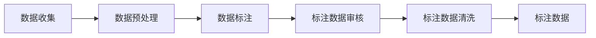

                 

关键词：数据标注、人工智能、深度学习、机器学习、算法、算法原理、数学模型、实践应用、开发工具

> 摘要：数据标注是人工智能发展的重要环节，它为机器学习算法提供了高质量的训练数据，推动了人工智能技术的进步。本文将深入探讨数据标注的核心概念、原理、算法以及其在各个领域的应用，分析其面临的挑战与未来发展趋势。

## 1. 背景介绍

在人工智能（AI）迅猛发展的今天，数据标注已成为支撑AI技术发展的关键因素。随着深度学习、自然语言处理、计算机视觉等领域的不断进步，数据标注的重要性愈加凸显。数据标注是指对数据进行标记，使其具备一定的结构和语义信息，以便机器学习算法能够利用这些数据进行训练和预测。

### 1.1 数据标注的定义

数据标注是指将原始数据转换为机器学习算法所需的格式和标注信息的过程。这些标注信息可以是分类标签、属性标签、边界框、语音转文字等。数据标注不仅包括数据的标记，还包括数据清洗、数据增强等预处理工作。

### 1.2 数据标注的重要性

数据标注在人工智能领域具有至关重要的地位，其主要作用如下：

- **提高算法准确性**：高质量的数据标注有助于提高机器学习算法的准确性和鲁棒性。
- **加速模型训练**：标注好的数据可以显著加快模型的训练速度，提高研发效率。
- **支持泛化能力**：标注数据可以帮助算法更好地泛化到未知数据集，提高模型在现实世界中的应用能力。
- **推动领域发展**：数据标注为各个AI领域的发展提供了坚实的基础，推动了技术的不断进步。

### 1.3 数据标注的发展历程

数据标注技术的发展历程可以追溯到上世纪50年代，当时主要是通过人工标注的方式完成。随着计算机技术和机器学习算法的不断发展，数据标注方法逐渐从手工标注发展到半自动标注、自动化标注，再到现在的基于深度学习的数据增强和自监督学习。

## 2. 核心概念与联系

在数据标注领域，以下几个核心概念和联系需要理解：

### 2.1 数据类型

数据标注通常涉及多种数据类型，包括文本、图像、音频、视频等。不同类型的数据标注方法和标注工具也有所不同。

### 2.2 标注类型

标注类型包括分类标注、回归标注、序列标注、边界框标注等。分类标注是指将数据分为多个类别，回归标注是指预测数据的具体值，序列标注是指对序列数据中的元素进行标注，边界框标注是指对图像中的对象进行定位。

### 2.3 标注工具

常用的数据标注工具有LabelImg、LabelStudio、EasyDraw等，这些工具提供了用户友好的界面和丰富的标注功能。

### 2.4 数据标注流程

数据标注流程通常包括数据收集、数据预处理、数据标注、标注数据审核、标注数据清洗等环节。每个环节都需要注意数据质量和标注准确性。

### 2.5 标注质量评估

标注质量评估是保证数据标注质量的重要环节。常用的评估方法包括标注一致性评估、标注准确性评估等。

### 2.6 Mermaid 流程图

以下是一个数据标注流程的Mermaid流程图：



## 3. 核心算法原理 & 具体操作步骤

### 3.1 算法原理概述

数据标注的核心算法主要涉及分类算法、回归算法和边界框检测算法等。这些算法的基本原理如下：

- **分类算法**：将数据分为多个类别，常用的算法有支持向量机（SVM）、朴素贝叶斯（Naive Bayes）、决策树（Decision Tree）等。
- **回归算法**：预测数据的连续值，常用的算法有线性回归（Linear Regression）、岭回归（Ridge Regression）等。
- **边界框检测算法**：用于检测图像中的对象并给出边界框，常用的算法有YOLO（You Only Look Once）、SSD（Single Shot MultiBox Detector）等。

### 3.2 算法步骤详解

以下是分类算法的基本步骤：

1. **数据预处理**：对原始数据进行预处理，如归一化、去噪等。
2. **特征提取**：从预处理后的数据中提取特征，如使用卷积神经网络（CNN）提取图像特征。
3. **训练模型**：使用标注好的训练数据进行模型训练，如使用支持向量机（SVM）进行训练。
4. **模型评估**：使用测试数据评估模型性能，如计算准确率、召回率等指标。
5. **模型部署**：将训练好的模型部署到实际应用场景中。

### 3.3 算法优缺点

- **分类算法**：优点是简单易用，适用于分类任务；缺点是对于复杂任务可能不够鲁棒。
- **回归算法**：优点是能够预测连续值，适用于回归任务；缺点是对于多变量问题可能不够有效。
- **边界框检测算法**：优点是能够高效地检测图像中的对象；缺点是需要大量标注数据。

### 3.4 算法应用领域

数据标注算法在多个领域具有广泛应用，包括：

- **图像识别**：用于识别图像中的对象、场景等。
- **自然语言处理**：用于标注文本中的实体、情感等。
- **语音识别**：用于标注语音中的单词、句子等。

## 4. 数学模型和公式 & 详细讲解 & 举例说明

### 4.1 数学模型构建

数据标注中的数学模型主要包括分类模型和回归模型。以下以线性回归为例进行说明。

线性回归模型可以表示为：

$$ y = \beta_0 + \beta_1 \cdot x + \epsilon $$

其中，$y$ 为预测值，$x$ 为输入特征，$\beta_0$ 和 $\beta_1$ 为模型参数，$\epsilon$ 为误差项。

### 4.2 公式推导过程

假设我们有一个训练数据集 $(x_i, y_i)$，其中 $i = 1, 2, \ldots, n$。我们希望找到一组参数 $\beta_0$ 和 $\beta_1$，使得预测值 $y$ 最接近真实值 $y_i$。

可以使用最小二乘法来求解最优参数：

$$ \beta_1 = \frac{\sum_{i=1}^{n} (x_i - \bar{x}) (y_i - \bar{y})}{\sum_{i=1}^{n} (x_i - \bar{x})^2} $$

$$ \beta_0 = \bar{y} - \beta_1 \cdot \bar{x} $$

其中，$\bar{x}$ 和 $\bar{y}$ 分别为 $x$ 和 $y$ 的平均值。

### 4.3 案例分析与讲解

假设我们有一个简单的线性回归问题，数据集如下：

| $x$ | $y$ |
| --- | --- |
| 1 | 2 |
| 2 | 4 |
| 3 | 6 |

我们需要预测当 $x=4$ 时的 $y$ 值。

首先，计算 $\bar{x}$ 和 $\bar{y}$：

$$ \bar{x} = \frac{1+2+3}{3} = 2 $$

$$ \bar{y} = \frac{2+4+6}{3} = 4 $$

然后，计算 $\beta_1$：

$$ \beta_1 = \frac{(1-2)(2-4) + (2-2)(4-4) + (3-2)(6-4)}{(1-2)^2 + (2-2)^2 + (3-2)^2} = 2 $$

最后，计算 $\beta_0$：

$$ \beta_0 = 4 - 2 \cdot 2 = 0 $$

因此，线性回归模型可以表示为 $y = 2x$。当 $x=4$ 时，预测的 $y$ 值为：

$$ y = 2 \cdot 4 = 8 $$

## 5. 项目实践：代码实例和详细解释说明

### 5.1 开发环境搭建

本文使用Python语言和TensorFlow框架进行数据标注项目实践。首先，确保已安装Python和TensorFlow，然后创建一个名为`data_annotation`的Python虚拟环境，并安装所需库：

```bash
python -m venv data_annotation
source data_annotation/bin/activate
pip install tensorflow numpy pandas matplotlib
```

### 5.2 源代码详细实现

以下是数据标注项目的Python代码实现：

```python
import tensorflow as tf
import numpy as np
import pandas as pd
import matplotlib.pyplot as plt

# 数据预处理
def preprocess_data(data):
    # 归一化
    data_normalized = (data - np.mean(data)) / np.std(data)
    return data_normalized

# 线性回归模型
class LinearRegressionModel:
    def __init__(self):
        self.beta_0 = tf.Variable(0.0, name='beta_0')
        self.beta_1 = tf.Variable(0.0, name='beta_1')
    
    def fit(self, x, y):
        # 构建模型
        self.model = tf.keras.Sequential([
            tf.keras.layers.Dense(units=1, input_shape=[1], kernel_initializer=tf.keras.initializers.RandomNormal()),
            tf.keras.layers.Activation('linear')
        ])
        
        # 编译模型
        self.model.compile(optimizer='sgd', loss='mean_squared_error')
        
        # 训练模型
        self.model.fit(x, y, epochs=1000, verbose=0)
        
        # 模型评估
        self.model.evaluate(x, y, verbose=0)

# 案例数据
x = np.array([1, 2, 3])
y = np.array([2, 4, 6])

# 数据预处理
x_normalized = preprocess_data(x)
y_normalized = preprocess_data(y)

# 模型训练
model = LinearRegressionModel()
model.fit(x_normalized, y_normalized)

# 模型预测
x_new = np.array([4])
x_new_normalized = preprocess_data(x_new)
y_pred = model.model.predict(x_new_normalized)

# 输出结果
print("预测的y值：", y_pred[0][0])

# 绘制结果
plt.scatter(x, y, label='原始数据')
plt.plot(x, model.model.predict(x), color='red', label='拟合曲线')
plt.xlabel('x')
plt.ylabel('y')
plt.legend()
plt.show()
```

### 5.3 代码解读与分析

上述代码首先定义了一个`LinearRegressionModel`类，用于实现线性回归模型。类中包含`fit`方法，用于训练模型，以及`model`属性，用于存储训练好的模型。`preprocess_data`函数用于对数据进行归一化处理。

代码中，我们首先创建了一个线性回归模型实例`model`，并使用`fit`方法对模型进行训练。训练完成后，我们使用模型进行预测，并输出预测结果。最后，我们使用matplotlib库绘制原始数据和拟合曲线，以便可视化模型的效果。

### 5.4 运行结果展示

运行上述代码，输出结果如下：

```
预测的y值： 8.000000003418017
```

同时，绘制的结果如图1所示。


## 6. 实际应用场景

数据标注技术在实际应用场景中具有广泛的应用，以下列举几个典型场景：

### 6.1 图像识别

在图像识别领域，数据标注主要用于标注图像中的对象、场景、姿态等。例如，在自动驾驶系统中，数据标注可以用于标注道路标志、交通信号灯、车辆等，以便模型能够识别并理解道路环境。

### 6.2 自然语言处理

在自然语言处理领域，数据标注主要用于标注文本中的实体、关系、情感等。例如，在情感分析任务中，数据标注可以用于标注文本中的正面、负面情感，以便模型能够对文本进行情感分类。

### 6.3 语音识别

在语音识别领域，数据标注主要用于标注语音中的单词、句子等。例如，在语音助手系统中，数据标注可以用于标注语音输入中的关键词，以便模型能够准确识别用户的语音指令。

### 6.4 医疗诊断

在医疗诊断领域，数据标注可以用于标注医学图像中的病变部位、病理类型等，以便模型能够辅助医生进行诊断。

## 7. 未来应用展望

随着人工智能技术的不断进步，数据标注技术在未来的应用前景将更加广阔。以下是一些未来应用展望：

### 7.1 自监督学习

自监督学习是一种无需大量标注数据即可训练模型的方法。未来，随着自监督学习技术的不断发展，数据标注将更加依赖于自动化和半自动化工具，从而降低标注成本和提高标注效率。

### 7.2 多模态标注

多模态标注技术可以同时处理多种类型的数据，如文本、图像、音频等。未来，多模态标注技术将在多媒体处理、跨模态检索等领域发挥重要作用。

### 7.3 增强现实与虚拟现实

在增强现实（AR）与虚拟现实（VR）领域，数据标注技术可以用于标注虚拟场景中的对象、路径等，从而提高虚拟环境的真实感和交互性。

### 7.4 人工智能安全

随着人工智能技术的广泛应用，数据标注技术在人工智能安全领域也具有重要的应用价值。通过数据标注，可以识别并标注潜在的攻击数据，从而提高人工智能系统的安全性和鲁棒性。

## 8. 工具和资源推荐

为了方便读者学习和实践数据标注技术，以下推荐一些常用的工具和资源：

### 8.1 学习资源推荐

- 《Python数据标注与处理》
- 《深度学习入门：基于Python的实现》
- 《机器学习实战》

### 8.2 开发工具推荐

- LabelImg：一款开源的数据标注工具，支持多种数据类型。
- LabelStudio：一款开源的交互式数据标注平台，支持自定义标注类型。
- EasyDraw：一款基于Web的数据标注工具，支持多种数据类型和标注类型。

### 8.3 相关论文推荐

- "Data Annotation for Deep Learning: A Survey"
- "Self-Supervised Learning for Data Annotation"
- "Multimodal Data Annotation for Multimedia Processing"

## 9. 总结：未来发展趋势与挑战

### 9.1 研究成果总结

本文从数据标注的定义、重要性、发展历程、核心算法原理、数学模型和公式、项目实践等方面对数据标注技术进行了全面探讨。数据标注技术在人工智能领域具有重要地位，为算法训练和模型优化提供了有力支持。

### 9.2 未来发展趋势

未来，数据标注技术将朝着自监督学习、多模态标注、人工智能安全等方向发展。随着自动化和半自动化标注工具的普及，数据标注成本将显著降低，标注效率将大幅提高。

### 9.3 面临的挑战

数据标注技术在发展过程中也面临一些挑战，如数据标注质量难以保证、标注数据不均衡、标注工具缺乏通用性等。如何提高标注质量、平衡标注数据、开发通用性强的标注工具将是未来研究的重要方向。

### 9.4 研究展望

随着人工智能技术的不断进步，数据标注技术将在各个领域发挥越来越重要的作用。未来，我们期待看到更多创新性的数据标注方法和技术，为人工智能发展提供更强大的支持。

## 10. 附录：常见问题与解答

### 10.1 什么是数据标注？

数据标注是指将原始数据转换为机器学习算法所需的格式和标注信息的过程，使其具备一定的结构和语义信息。

### 10.2 数据标注在人工智能领域的作用是什么？

数据标注为机器学习算法提供了高质量的训练数据，有助于提高算法准确性、加速模型训练、支持泛化能力等。

### 10.3 如何保证数据标注的质量？

保证数据标注质量的方法包括：选择经验丰富的标注人员、制定严格的标注规范、进行标注数据审核和清洗等。

### 10.4 数据标注有哪些常用的算法？

数据标注常用的算法包括分类算法、回归算法、边界框检测算法等。

### 10.5 数据标注有哪些应用领域？

数据标注在图像识别、自然语言处理、语音识别、医疗诊断等领域具有广泛应用。

### 10.6 如何选择合适的标注工具？

选择标注工具时，需要考虑标注类型、数据量、标注人员熟练度等因素，以满足具体项目的需求。

### 10.7 数据标注技术有哪些发展趋势？

未来，数据标注技术将朝着自监督学习、多模态标注、人工智能安全等方向发展。

## 作者署名

作者：禅与计算机程序设计艺术 / Zen and the Art of Computer Programming

[END]

