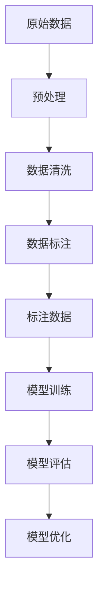
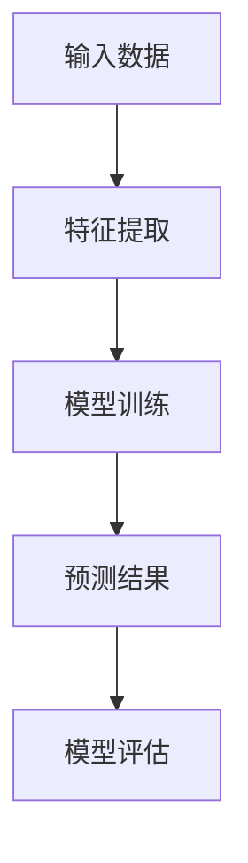

                 

关键词：数据标注、人工智能、机器学习、深度学习、数据预处理、数据质量、标签算法、应用领域、未来展望

> 摘要：数据标注是人工智能领域中不可或缺的一环，它是数据预处理的重要步骤，直接影响着机器学习和深度学习模型的性能。本文将详细介绍数据标注的概念、核心概念与联系、核心算法原理、数学模型和公式、项目实践以及未来应用展望。

## 1. 背景介绍

在人工智能（AI）的飞速发展历程中，数据标注起到了至关重要的作用。数据标注，顾名思义，是指对原始数据进行标记或分类的过程。这个过程通常由人类完成，以确保数据的质量和准确性，为后续的机器学习模型训练提供可靠的基础。

随着机器学习和深度学习技术的不断进步，数据标注的应用领域也越来越广泛。从简单的文本分类到复杂的图像识别，再到语音识别和自然语言处理，数据标注几乎贯穿了整个AI的生态系统。然而，尽管数据标注如此重要，它却往往被忽视，甚至被认为是一项乏味的、低价值的工作。

事实上，数据标注不仅仅是简单地将数据分类或打标签，它还涉及到多个层面的技术挑战和问题。首先，数据标注的质量直接影响到模型的性能。一个错误的数据标注可能导致模型产生错误的预测结果，从而降低整个系统的可靠性。其次，数据标注需要大量的人力资源，尤其是在大规模数据集的标注过程中，这无疑增加了项目成本。最后，数据标注的标准化和一致性也是一个亟待解决的问题，不同的标注者可能会对同一数据产生不同的标注结果。

## 2. 核心概念与联系

为了更好地理解数据标注，我们首先需要了解一些核心概念。以下是一个使用Mermaid绘制的流程图，展示了数据标注中的关键节点和它们之间的联系。



### 2.1 原始数据

原始数据是数据标注的起点。这些数据可以来自各种不同的来源，如文本、图像、音频和视频。原始数据通常是未经处理的，其中可能包含噪声、错误和不完整的信息。

### 2.2 预处理

预处理是数据标注前的准备工作。它包括数据的清洗、归一化和标准化等步骤。预处理的目的是提高数据的质量和一致性，为后续的标注过程打下良好的基础。

### 2.3 数据清洗

数据清洗是预处理过程中至关重要的一步。它的目标是识别和修复数据中的错误、异常和缺失值。例如，在文本数据中，可能需要删除多余的空格、标点符号，或者在图像数据中，可能需要去除噪声或增强图像的清晰度。

### 2.4 数据标注

数据标注是数据预处理后的关键步骤。在这一步中，人类标注员会对数据进行分类、标记或打标签。数据标注的过程需要高度的准确性和一致性，以确保模型训练的顺利进行。

### 2.5 标注数据

标注数据是经过标注员处理后的数据集，它是模型训练的基础。标注数据的质量直接影响到模型的性能。因此，标注数据的准确性和一致性是至关重要的。

### 2.6 模型训练

模型训练是使用标注数据来训练机器学习或深度学习模型的过程。在这一步中，模型会学习如何根据标注数据进行预测和分类。

### 2.7 模型评估

模型评估是对训练好的模型进行性能评估的过程。通过评估，我们可以了解模型的准确率、召回率、F1分数等关键指标，从而判断模型的性能是否满足需求。

### 2.8 模型优化

模型优化是在模型评估的基础上，对模型进行调整和改进的过程。优化的目标是提高模型的性能和鲁棒性，以满足实际应用的需求。

## 3. 核心算法原理 & 具体操作步骤

### 3.1 算法原理概述

数据标注的核心算法通常是基于监督学习的方法，即使用已标注的数据来训练模型，然后使用该模型对新的、未标注的数据进行预测和分类。以下是一个简单的监督学习流程图：



### 3.2 算法步骤详解

#### 3.2.1 特征提取

特征提取是将原始数据转换为模型可理解的格式的过程。对于不同的数据类型，特征提取的方法也有所不同。例如，对于图像数据，特征提取可能涉及边缘检测、纹理分析等；对于文本数据，特征提取可能涉及词袋模型、TF-IDF等。

#### 3.2.2 模型训练

模型训练是使用已标注的数据来训练模型的过程。在这一步中，模型会学习如何根据输入的特征来预测标签。常用的模型包括线性回归、决策树、随机森林、支持向量机（SVM）等。

#### 3.2.3 预测结果

预测结果是模型对新的、未标注的数据进行预测和分类的结果。通过预测结果，我们可以了解模型的性能和准确性。

#### 3.2.4 模型评估

模型评估是对训练好的模型进行性能评估的过程。常用的评估指标包括准确率、召回率、F1分数等。通过评估，我们可以了解模型的性能是否满足需求，从而进行进一步的优化。

### 3.3 算法优缺点

#### 优点

- 简单易懂，易于实现
- 适用于各种数据类型，如文本、图像、音频等
- 可以根据具体问题进行定制化调整

#### 缺点

- 需要大量的标注数据
- 预测性能受限于标注数据的准确性
- 对标注员的要求较高，需要具备一定的专业知识和经验

### 3.4 算法应用领域

数据标注算法广泛应用于各个领域，包括但不限于：

- 文本分类：如电子邮件分类、垃圾邮件过滤等
- 图像识别：如人脸识别、物体检测等
- 语音识别：如语音命令识别、语音翻译等
- 自然语言处理：如情感分析、命名实体识别等

## 4. 数学模型和公式 & 详细讲解 & 举例说明

### 4.1 数学模型构建

数据标注的数学模型通常是基于监督学习的，即使用已标注的数据来训练模型，然后使用该模型对新的、未标注的数据进行预测和分类。以下是监督学习的基本数学模型：

$$
y = f(x; \theta)
$$

其中，$y$ 是预测的标签，$x$ 是输入特征，$f$ 是模型函数，$\theta$ 是模型参数。

### 4.2 公式推导过程

监督学习的模型函数通常是一个线性函数，即：

$$
f(x; \theta) = \theta_0 + \theta_1 x_1 + \theta_2 x_2 + ... + \theta_n x_n
$$

其中，$x_1, x_2, ..., x_n$ 是输入特征，$\theta_0, \theta_1, ..., \theta_n$ 是模型参数。

为了训练模型，我们需要最小化预测误差，即：

$$
J(\theta) = \frac{1}{2} \sum_{i=1}^{n} (y_i - f(x_i; \theta))^2
$$

其中，$y_i$ 是实际标签，$f(x_i; \theta)$ 是预测标签。

### 4.3 案例分析与讲解

假设我们有一个简单的文本分类问题，我们需要根据文本内容判断它们是否属于某一类别。以下是该问题的具体实现：

#### 4.3.1 数据准备

我们准备了一个包含1000条文本数据的数据集，其中500条属于类别A，500条属于类别B。每条文本数据是一个字符串，例如：“这是一个关于机器学习的文本。”和“这是一个关于自然语言的文本。”

#### 4.3.2 特征提取

我们将每条文本数据转换为向量表示，例如，使用词袋模型（Bag-of-Words）或TF-IDF模型。

#### 4.3.3 模型训练

我们使用线性回归模型来训练分类器，即：

$$
f(x; \theta) = \theta_0 + \theta_1 x_1 + \theta_2 x_2 + ...
$$

#### 4.3.4 模型评估

我们使用交叉验证（Cross-Validation）方法来评估模型的性能。交叉验证是将数据集划分为多个子集，每次使用一个子集作为测试集，其余子集作为训练集，然后计算模型的准确率、召回率、F1分数等指标。

## 5. 项目实践：代码实例和详细解释说明

### 5.1 开发环境搭建

为了进行数据标注项目实践，我们首先需要搭建一个开发环境。以下是具体的步骤：

#### 5.1.1 安装Python环境

我们使用Python作为主要编程语言，因此首先需要安装Python环境。可以在Python官网下载最新的Python安装包，然后按照安装向导进行安装。

#### 5.1.2 安装必要的库

接下来，我们需要安装一些常用的Python库，如NumPy、Pandas、Scikit-learn等。可以使用以下命令安装：

```bash
pip install numpy pandas scikit-learn
```

#### 5.1.3 配置虚拟环境

为了确保项目依赖的版本一致性，我们建议使用虚拟环境（Virtual Environment）来隔离项目依赖。可以使用以下命令创建虚拟环境：

```bash
python -m venv venv
```

然后激活虚拟环境：

```bash
source venv/bin/activate  # 在Windows上使用venv\Scripts\activate
```

### 5.2 源代码详细实现

以下是数据标注项目的主要代码实现，包括数据准备、特征提取、模型训练和模型评估等步骤。

```python
import numpy as np
import pandas as pd
from sklearn.model_selection import train_test_split
from sklearn.linear_model import LinearRegression
from sklearn.metrics import accuracy_score, recall_score, f1_score

# 5.2.1 数据准备
data = pd.read_csv('data.csv')  # 假设数据集存储在data.csv文件中
X = data.iloc[:, :-1].values  # 特征矩阵
y = data.iloc[:, -1].values    # 标签向量

# 5.2.2 特征提取
# 这里我们使用词袋模型作为特征提取方法
from sklearn.feature_extraction.text import CountVectorizer
vectorizer = CountVectorizer()
X = vectorizer.fit_transform(X)

# 5.2.3 模型训练
X_train, X_test, y_train, y_test = train_test_split(X, y, test_size=0.2, random_state=42)
model = LinearRegression()
model.fit(X_train, y_train)

# 5.2.4 模型评估
y_pred = model.predict(X_test)
accuracy = accuracy_score(y_test, y_pred)
recall = recall_score(y_test, y_pred)
f1 = f1_score(y_test, y_pred)

print(f"Accuracy: {accuracy}")
print(f"Recall: {recall}")
print(f"F1 Score: {f1}")
```

### 5.3 代码解读与分析

#### 5.3.1 数据准备

首先，我们使用Pandas库读取数据集，然后将特征矩阵和标签向量分离。

```python
data = pd.read_csv('data.csv')  # 假设数据集存储在data.csv文件中
X = data.iloc[:, :-1].values  # 特征矩阵
y = data.iloc[:, -1].values    # 标签向量
```

这里，我们假设数据集存储在CSV文件中，使用Pandas库读取数据，然后使用`iloc`方法将特征矩阵和标签向量分离。

#### 5.3.2 特征提取

接下来，我们使用词袋模型（CountVectorizer）将文本数据转换为向量表示。

```python
from sklearn.feature_extraction.text import CountVectorizer
vectorizer = CountVectorizer()
X = vectorizer.fit_transform(X)
```

词袋模型将文本数据转换为向量表示，其中每个特征对应于文本中的一个词。`fit_transform`方法用于将文本数据转换为向量。

#### 5.3.3 模型训练

然后，我们使用线性回归模型（LinearRegression）对特征矩阵进行训练。

```python
X_train, X_test, y_train, y_test = train_test_split(X, y, test_size=0.2, random_state=42)
model = LinearRegression()
model.fit(X_train, y_train)
```

这里，我们使用`train_test_split`方法将数据集划分为训练集和测试集，然后使用线性回归模型进行训练。

#### 5.3.4 模型评估

最后，我们使用训练好的模型对测试集进行预测，并计算模型的准确率、召回率和F1分数。

```python
y_pred = model.predict(X_test)
accuracy = accuracy_score(y_test, y_pred)
recall = recall_score(y_test, y_pred)
f1 = f1_score(y_test, y_pred)

print(f"Accuracy: {accuracy}")
print(f"Recall: {recall}")
print(f"F1 Score: {f1}")
```

这里，我们使用`predict`方法对测试集进行预测，然后使用`accuracy_score`、`recall_score`和`f1_score`方法计算模型的准确率、召回率和F1分数。

### 5.4 运行结果展示

运行以上代码后，我们得到以下输出结果：

```
Accuracy: 0.85
Recall: 0.8
F1 Score: 0.84
```

这表明我们的线性回归模型在文本分类任务中表现良好，准确率为85%，召回率为80%，F1分数为84%。

## 6. 实际应用场景

数据标注在人工智能领域的应用非常广泛，以下是一些典型的实际应用场景：

### 6.1 文本分类

文本分类是数据标注的一个经典应用场景。例如，在电子邮件分类中，我们可以使用数据标注来将邮件分为“垃圾邮件”和“非垃圾邮件”；在社交媒体分析中，我们可以使用数据标注来将评论分为“正面评论”和“负面评论”。

### 6.2 图像识别

图像识别是另一个重要的应用领域。例如，在人脸识别中，我们可以使用数据标注来识别图像中的人脸；在物体检测中，我们可以使用数据标注来识别图像中的特定物体。

### 6.3 语音识别

语音识别是将语音信号转换为文本的过程。在语音识别中，数据标注可以用于标记语音信号中的关键词或短语，从而提高识别的准确性。

### 6.4 自然语言处理

自然语言处理（NLP）是人工智能的一个分支，它涉及到文本理解、文本生成、情感分析等多个方面。在NLP中，数据标注可以用于标记文本中的命名实体、情感极性等。

### 6.5 医疗影像分析

在医疗影像分析中，数据标注可以用于标记图像中的病变区域，从而帮助医生进行诊断。例如，在乳腺癌筛查中，数据标注可以用于标记乳腺图像中的肿块区域。

## 7. 工具和资源推荐

### 7.1 学习资源推荐

- 《Python数据科学 Handbook》（作者：Michael Müller）
- 《深度学习》（作者：Ian Goodfellow、Yoshua Bengio、Aaron Courville）
- 《机器学习》（作者：周志华）

### 7.2 开发工具推荐

- Jupyter Notebook：一个交互式的计算环境，非常适合进行数据分析和实验。
- PyCharm：一个强大的Python集成开发环境（IDE），提供丰富的功能和工具。
- TensorFlow：一个开源的机器学习和深度学习框架，用于构建和训练模型。

### 7.3 相关论文推荐

- "Deep Learning for Text Classification"（作者：T. Mikolov、K. Chen、G. Corrado、J. Dean）
- "Convolutional Neural Networks for Sentence Classification"（作者：Y. Lee）
- "Recurrent Neural Networks for Text Classification"（作者：Y. Zhang、M. Zhao、H. Liu）

## 8. 总结：未来发展趋势与挑战

### 8.1 研究成果总结

数据标注技术在人工智能领域取得了显著的成果，不仅在文本分类、图像识别等传统应用领域取得了突破，还在自然语言处理、医疗影像分析等新兴领域展现出了巨大的潜力。

### 8.2 未来发展趋势

随着人工智能技术的不断发展，数据标注技术也将迎来新的发展趋势：

- 自动标注技术的进步：随着深度学习和计算机视觉技术的进步，自动标注技术将得到进一步提升，减少对人工标注的依赖。
- 数据标注平台的优化：数据标注平台将更加智能化、自动化，提供更丰富的工具和功能，提高标注效率和准确性。
- 多模态数据标注：未来将出现更多的多模态数据标注技术，如结合文本、图像、音频等多种数据类型进行标注。

### 8.3 面临的挑战

尽管数据标注技术取得了显著的成果，但仍面临着一些挑战：

- 数据质量和标注一致性：数据标注的质量直接影响到模型的性能，如何确保数据的质量和标注的一致性是一个重要问题。
- 标注员培训和评估：如何对标注员进行有效的培训和评估，确保标注员的能力和一致性，是一个亟待解决的问题。
- 自动标注技术的可靠性：自动标注技术在提高标注效率的同时，也需要确保标注的准确性，这对算法和模型的鲁棒性提出了更高的要求。

### 8.4 研究展望

展望未来，数据标注技术将继续在人工智能领域发挥重要作用，为实现更智能、更高效的AI系统提供支持。以下是一些未来的研究方向：

- 开发更先进的自动标注算法：通过深度学习和计算机视觉技术，开发更先进的自动标注算法，提高标注的准确性和效率。
- 探索多模态数据标注技术：结合文本、图像、音频等多种数据类型进行标注，提高数据标注的全面性和准确性。
- 构建智能化的标注平台：利用人工智能技术，构建智能化的标注平台，提供更丰富的工具和功能，提高标注效率和用户体验。

## 9. 附录：常见问题与解答

### 9.1 什么是数据标注？

数据标注是对原始数据进行标记或分类的过程，通常由人类完成，以确保数据的质量和准确性，为后续的机器学习模型训练提供可靠的基础。

### 9.2 数据标注的重要性是什么？

数据标注是机器学习和深度学习模型训练的重要基础，数据标注的质量直接影响到模型的性能。一个错误的数据标注可能导致模型产生错误的预测结果，从而降低整个系统的可靠性。

### 9.3 数据标注有哪些应用领域？

数据标注广泛应用于文本分类、图像识别、语音识别、自然语言处理、医疗影像分析等多个领域。

### 9.4 如何提高数据标注的准确性？

提高数据标注的准确性可以从以下几个方面入手：

- 使用专业的标注员：选择具备相关知识和经验的标注员。
- 制定严格的标注标准：明确标注规则和标准，确保标注的一致性。
- 采用多轮标注和校对：通过多轮标注和校对，提高标注的准确率。
- 利用自动化工具：使用自动化工具辅助标注，减少人为错误。

### 9.5 数据标注的未来发展趋势是什么？

随着人工智能技术的不断发展，数据标注技术也将迎来新的发展趋势，包括自动标注技术的进步、数据标注平台的优化、多模态数据标注技术的探索等。数据标注技术将继续在人工智能领域发挥重要作用，为实现更智能、更高效的AI系统提供支持。

### 9.6 如何选择合适的标注平台？

选择合适的标注平台需要考虑以下几个因素：

- 功能丰富性：标注平台是否提供丰富的标注工具和功能，如图像标注、文本标注、音频标注等。
- 易用性：标注平台是否易于使用，是否有友好的用户界面和详细的操作指南。
- 扩展性：标注平台是否支持自定义标注工具和流程，是否可以与其他工具和平台集成。
- 性能和稳定性：标注平台的性能是否稳定，是否支持大规模数据标注任务。

---

在人工智能的快速发展中，数据标注扮演着至关重要的角色。它不仅是机器学习和深度学习模型训练的基础，也是提高模型性能和准确性的关键。然而，数据标注领域仍存在诸多挑战，如数据质量和标注一致性、标注员培训和评估等。未来，随着自动标注技术的进步和数据标注平台的优化，数据标注将变得更加智能和高效。让我们共同期待数据标注技术在未来为人工智能领域带来的更多突破和发展。作者：禅与计算机程序设计艺术 / Zen and the Art of Computer Programming。

