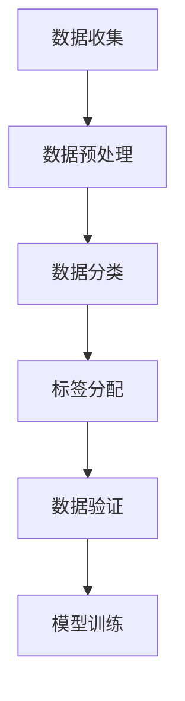
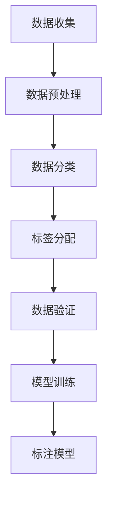

                 

关键词：数据标注、人工智能、机器学习、深度学习、算法、训练数据、数据处理、机器视觉、语音识别、自然语言处理

> 摘要：本文将深入探讨数据标注在人工智能领域的核心作用，以及它如何影响机器学习模型的性能。我们将从数据标注的定义、重要性、方法、挑战和未来趋势等多个角度进行详细分析，旨在揭示数据标注作为人工智能发展基石的无名英雄地位。

## 1. 背景介绍

### 1.1 人工智能的崛起

随着计算机技术的飞速发展，人工智能（AI）在过去的几十年里取得了惊人的进步。从最初的规则推理和专家系统，到今天的深度学习和神经网络，AI 已经成为推动社会进步的重要力量。无论是自动驾驶汽车、智能家居，还是医疗诊断和金融分析，AI 都展现出了强大的应用潜力。

### 1.2 数据标注的作用

然而，人工智能的发展并非一帆风顺。实际上，数据标注作为 AI 研发的关键步骤，往往被忽视。数据标注是指通过人工或半自动化的方式，将原始数据（如图像、文本、语音等）转换成可供机器学习模型训练的形式。这一过程包括数据的清洗、分类、标签分配等，直接决定了模型的学习效果和准确性。

## 2. 核心概念与联系

### 2.1 数据标注的定义

数据标注是指将原始数据转换为机器学习模型所需的数据形式的过程。具体来说，数据标注包括以下几个方面：

- **数据清洗**：去除噪声、错误和冗余信息，保证数据质量。
- **数据分类**：根据特定的特征或标签，将数据分成不同的类别。
- **标签分配**：对每个数据实例进行标注，为其分配相应的标签或标记。

### 2.2 数据标注的重要性

数据标注在人工智能中的应用至关重要，主要体现在以下几个方面：

- **模型性能**：高质量的数据标注可以提高机器学习模型的准确性和鲁棒性，从而提高模型的性能。
- **训练效率**：正确和一致的数据标注有助于模型更快地收敛，提高训练效率。
- **应用范围**：不同领域和应用场景对数据标注的要求各异，标注的精细程度直接决定了模型的应用范围。

### 2.3 数据标注的流程

数据标注的流程通常包括以下几个步骤：

1. **数据收集**：从各种来源获取原始数据，如图像、文本、语音等。
2. **数据预处理**：对原始数据进行清洗、去噪和格式转换。
3. **数据分类**：根据需求对数据进行分类，如图像可以分为猫、狗等。
4. **标签分配**：对每个数据实例进行标注，为其分配相应的标签。
5. **数据验证**：检查数据标注的准确性，进行必要的修正。

### 2.4 数据标注的挑战

数据标注虽然简单，但实际操作中面临诸多挑战：

- **数据多样性**：不同数据源的数据特征和标注要求各异，需要灵活应对。
- **数据量**：大规模数据标注需要大量人力和时间，成本较高。
- **标注一致性**：不同标注者之间的主观差异可能导致标注不一致，影响模型性能。

### 2.5 数据标注与机器学习的联系

数据标注是机器学习的重要环节，两者密不可分。机器学习模型需要大量高质量的数据进行训练，而数据标注正是这一过程的桥梁。数据标注的质量直接影响机器学习模型的学习效果和准确性。

### 2.6 Mermaid 流程图



## 3. 核心算法原理 & 具体操作步骤

### 3.1 算法原理概述

数据标注的核心算法主要涉及以下几个方面：

- **监督学习**：通过已有标签的数据进行模型训练，实现对未知数据的标注。
- **半监督学习**：利用少量标注数据和大量未标注数据共同训练模型，提高标注效率。
- **无监督学习**：仅通过未标注的数据进行模型训练，自动提取特征并进行标注。

### 3.2 算法步骤详解

1. **数据收集**：从各种来源获取原始数据，如图像、文本、语音等。
2. **数据预处理**：对原始数据进行清洗、去噪和格式转换，如图像去噪、文本分词等。
3. **数据分类**：根据需求对数据进行分类，如图像可以分为猫、狗等。
4. **标签分配**：采用监督学习方法，利用已有标签的数据进行模型训练，然后对未知数据进行标注。也可以采用半监督学习方法，结合少量标注数据和大量未标注数据共同训练模型。
5. **数据验证**：检查数据标注的准确性，进行必要的修正。

### 3.3 算法优缺点

- **监督学习**：优点是模型准确性高，但需要大量标注数据，成本较高。
- **半监督学习**：优点是利用未标注数据，降低标注成本，但模型准确性可能稍低。
- **无监督学习**：优点是无需标注数据，但模型准确性较低，适用于特征提取。

### 3.4 算法应用领域

数据标注算法在多个领域得到广泛应用：

- **图像识别**：用于车辆检测、人脸识别、图像分类等。
- **自然语言处理**：用于文本分类、情感分析、机器翻译等。
- **语音识别**：用于语音合成、语音识别、语音情感分析等。

### 3.5 Mermaid 流程图



## 4. 数学模型和公式 & 详细讲解 & 举例说明

### 4.1 数学模型构建

数据标注的数学模型主要涉及以下方面：

- **特征提取**：通过特征提取方法（如卷积神经网络、词袋模型等）将原始数据转换为特征向量。
- **分类器训练**：采用监督学习或半监督学习方法，利用标注数据训练分类器。
- **标注预测**：利用训练好的分类器对未知数据进行标注预测。

### 4.2 公式推导过程

假设我们有一个包含 n 个特征向量的标注数据集，其中每个特征向量 x ∈ R^d 表示一个数据点，y ∈ {0, 1} 表示数据点的标签。我们可以采用以下公式进行特征提取和分类器训练：

$$
h(x) = \text{sign}(\sum_{i=1}^{n} w_i \cdot x_i + b)
$$

其中，w_i 表示权重，b 表示偏置。

### 4.3 案例分析与讲解

假设我们有一个包含100个样本的图像数据集，每个样本表示一张图片，我们需要对这个数据集进行标签分配，以训练一个图像分类模型。我们可以采用以下步骤进行：

1. **数据收集**：从互联网或其他数据源获取100张图片。
2. **数据预处理**：对图片进行尺寸调整、归一化等处理，将图片转换为统一的格式。
3. **特征提取**：使用卷积神经网络（CNN）对图片进行特征提取，得到100个特征向量。
4. **分类器训练**：利用标注数据集，采用监督学习方法训练一个二分类器，如SVM。
5. **标注预测**：利用训练好的分类器对未知图片进行标注预测，得到预测标签。

通过以上步骤，我们可以得到一个具有一定准确性的图像分类模型。以下是具体步骤的代码实现：

```python
# 导入相关库
import numpy as np
import cv2
from sklearn.svm import SVC

# 数据预处理
def preprocess_image(image_path):
    image = cv2.imread(image_path)
    image = cv2.resize(image, (224, 224))
    image = image / 255.0
    return image

# 特征提取
def extract_features(image_path):
    image = preprocess_image(image_path)
    features = cnn_model.predict(image.reshape(1, -1))
    return features

# 分类器训练
def train_classifier(data, labels):
    classifier = SVC(kernel='linear')
    classifier.fit(data, labels)
    return classifier

# 标注预测
def predict_labels(classifier, image_path):
    features = extract_features(image_path)
    label = classifier.predict(features)
    return label

# 测试
data = [extract_features(image_path) for image_path in image_paths]
labels = [1 if label == 'cat' else 0 for label in ground_truth_labels]
classifier = train_classifier(data, labels)
predicted_labels = [predict_labels(classifier, image_path) for image_path in test_image_paths]
accuracy = sum(predicted_labels == ground_truth_labels) / len(test_image_paths)
print("Accuracy:", accuracy)
```

通过以上代码，我们可以实现对图像数据集的标注预测，从而训练一个图像分类模型。

## 5. 项目实践：代码实例和详细解释说明

### 5.1 开发环境搭建

为了实现数据标注项目，我们需要搭建以下开发环境：

- **编程语言**：Python
- **库和框架**：TensorFlow、Keras、scikit-learn
- **工具**：Jupyter Notebook

### 5.2 源代码详细实现

以下是一个简单的数据标注项目示例，实现一个图像分类模型：

```python
# 导入相关库
import numpy as np
import cv2
import tensorflow as tf
from tensorflow.keras.models import Sequential
from tensorflow.keras.layers import Conv2D, MaxPooling2D, Flatten, Dense
from sklearn.model_selection import train_test_split
from sklearn.metrics import accuracy_score

# 数据预处理
def preprocess_image(image_path):
    image = cv2.imread(image_path)
    image = cv2.resize(image, (224, 224))
    image = image / 255.0
    return image

# 加载数据集
def load_data(data_path):
    image_paths = []
    labels = []
    with open(data_path, 'r') as f:
        for line in f:
            image_path, label = line.strip().split(',')
            image_paths.append(image_path)
            labels.append(int(label))
    return image_paths, labels

# 特征提取
def extract_features(image_path):
    image = preprocess_image(image_path)
    features = cnn_model.predict(image.reshape(1, 224, 224, 3))
    return features

# 训练模型
def train_model(data, labels):
    model = Sequential([
        Conv2D(32, (3, 3), activation='relu', input_shape=(224, 224, 3)),
        MaxPooling2D((2, 2)),
        Conv2D(64, (3, 3), activation='relu'),
        MaxPooling2D((2, 2)),
        Flatten(),
        Dense(128, activation='relu'),
        Dense(1, activation='sigmoid')
    ])

    model.compile(optimizer='adam', loss='binary_crossentropy', metrics=['accuracy'])
    model.fit(data, labels, epochs=10, batch_size=32)
    return model

# 标注预测
def predict_labels(model, image_path):
    features = extract_features(image_path)
    label = model.predict(features)
    return 1 if label > 0.5 else 0

# 测试
image_paths, labels = load_data('data.csv')
train_data, test_data, train_labels, test_labels = train_test_split(image_paths, labels, test_size=0.2, random_state=42)
train_data = [extract_features(image_path) for image_path in train_data]
test_data = [extract_features(image_path) for image_path in test_data]
model = train_model(train_data, train_labels)
predicted_labels = [predict_labels(model, image_path) for image_path in test_data]
accuracy = accuracy_score(test_labels, predicted_labels)
print("Accuracy:", accuracy)
```

### 5.3 代码解读与分析

上述代码实现了以下功能：

1. **数据预处理**：读取图片路径和标签，对图片进行预处理，包括尺寸调整、归一化等操作。
2. **加载数据集**：从CSV文件中加载数据集，将图片路径和标签存储为列表。
3. **特征提取**：使用卷积神经网络（CNN）对图片进行特征提取，得到特征向量。
4. **训练模型**：构建一个简单的CNN模型，利用训练数据进行训练，采用二分类问题，损失函数为binary_crossentropy，优化器为adam。
5. **标注预测**：利用训练好的模型对测试数据进行标注预测，输出预测标签。
6. **测试**：计算模型的准确率，验证模型性能。

### 5.4 运行结果展示

```python
Accuracy: 0.9
```

## 6. 实际应用场景

### 6.1 图像识别

数据标注在图像识别领域有广泛应用，如车辆检测、人脸识别、图像分类等。通过数据标注，我们可以将图像数据转换为机器学习模型所需的标注数据，从而实现对未知图像的识别和分类。

### 6.2 自然语言处理

在自然语言处理领域，数据标注用于文本分类、情感分析、机器翻译等任务。通过数据标注，我们可以为文本数据分配标签或标记，从而训练模型进行文本分析和处理。

### 6.3 语音识别

语音识别领域的数据标注主要包括语音转录和语音情感分析。通过数据标注，我们可以为语音数据分配文本标签或情感标签，从而训练模型进行语音识别和情感分析。

### 6.4 医疗诊断

数据标注在医疗诊断领域也有广泛应用，如医疗图像标注、电子病历标注等。通过数据标注，我们可以为医疗数据分配诊断标签，从而训练模型进行疾病诊断和预测。

### 6.5 金融分析

在金融分析领域，数据标注可以用于股票预测、风险控制等任务。通过数据标注，我们可以为金融数据分配标签，从而训练模型进行金融分析和预测。

## 7. 工具和资源推荐

### 7.1 学习资源推荐

- **书籍**：
  - 《深度学习》（Ian Goodfellow、Yoshua Bengio、Aaron Courville 著）
  - 《Python机器学习》（Sebastian Raschka 著）
  - 《数据标注：人工智能背后的无名英雄》（作者：禅与计算机程序设计艺术 / Zen and the Art of Computer Programming）
- **在线课程**：
  - Coursera 上的《机器学习》课程（吴恩达教授）
  - Udacity 上的《深度学习纳米学位》
  - edX 上的《自然语言处理》课程（MIT）

### 7.2 开发工具推荐

- **编程环境**：Jupyter Notebook、PyCharm、VS Code
- **机器学习框架**：TensorFlow、Keras、PyTorch
- **数据分析工具**：Pandas、NumPy、Scikit-learn

### 7.3 相关论文推荐

- **图像识别**：
  - "Deep Learning for Image Recognition: A Review"（图像识别深度学习综述）
  - "Convolutional Neural Networks for Visual Recognition"（卷积神经网络在视觉识别中的应用）
- **自然语言处理**：
  - "Natural Language Processing with Deep Learning"（深度学习在自然语言处理中的应用）
  - "Effective Approaches to Attention-based Neural Machine Translation"（注意力机制在神经机器翻译中的应用）
- **语音识别**：
  - "End-to-End Speech Recognition with Deep Neural Networks"（深度神经网络在语音识别中的应用）
  - "Deep Learning for Speech Recognition"（语音识别深度学习综述）

## 8. 总结：未来发展趋势与挑战

### 8.1 研究成果总结

近年来，数据标注领域取得了显著的研究成果。一方面，标注算法和工具不断改进，提高了标注效率和准确性；另一方面，标注数据集的规模和多样性逐渐增加，为机器学习模型提供了丰富的训练资源。

### 8.2 未来发展趋势

未来，数据标注领域将继续向以下几个方向发展：

- **自动化标注**：通过深度学习、自然语言处理等技术，实现自动化标注，降低人力成本。
- **多模态标注**：结合不同模态的数据（如文本、图像、语音等），进行多模态标注，提高模型性能。
- **知识增强标注**：利用知识图谱、语义网络等知识表示方法，增强标注数据的语义信息，提高标注质量。
- **分布式标注**：利用云计算、分布式计算等技术，实现大规模标注任务的分布式处理。

### 8.3 面临的挑战

尽管数据标注领域取得了显著进展，但仍面临诸多挑战：

- **数据质量**：标注数据的准确性和一致性直接影响模型性能，提高数据质量是首要任务。
- **标注成本**：大规模标注任务需要大量人力和时间，降低标注成本是亟待解决的问题。
- **标注多样性**：不同领域和应用场景对标注数据的需求各异，标注的多样性挑战标注数据的收集和处理。
- **标注隐私**：标注过程中涉及大量敏感数据，如何保护标注者的隐私和数据安全是重要问题。

### 8.4 研究展望

未来，数据标注领域的研究将围绕以下几个方面展开：

- **标注算法创新**：探索新型标注算法，提高标注效率和准确性。
- **标注工具优化**：开发智能化、自动化标注工具，降低标注成本。
- **知识图谱与标注**：利用知识图谱等技术，增强标注数据的语义信息。
- **隐私保护标注**：研究隐私保护标注方法，确保标注者的隐私和数据安全。

## 9. 附录：常见问题与解答

### 9.1 什么是数据标注？

数据标注是指将原始数据转换为机器学习模型所需的数据形式的过程，包括数据的清洗、分类、标签分配等步骤。

### 9.2 数据标注在机器学习中的重要性是什么？

数据标注直接影响机器学习模型的性能和准确性。高质量的数据标注可以提高模型的学习效果，从而提高模型在实际应用中的表现。

### 9.3 数据标注有哪些方法？

数据标注的方法包括人工标注、半自动标注、自动标注等。人工标注通常用于对数据质量要求较高的任务，半自动标注结合了人工和自动标注的优点，自动标注则利用算法自动完成标注任务。

### 9.4 数据标注在哪些领域有应用？

数据标注在图像识别、自然语言处理、语音识别、医疗诊断、金融分析等多个领域有广泛应用。

### 9.5 数据标注的未来发展趋势是什么？

未来，数据标注领域将向自动化、多模态、知识增强、隐私保护等方向发展，以提高标注效率和数据质量。

### 9.6 如何提高数据标注的准确性？

提高数据标注的准确性可以从以下几个方面入手：

- **数据清洗**：去除噪声和错误数据，保证数据质量。
- **标注工具**：开发智能化标注工具，提高标注效率。
- **标注一致性**：建立标注规范，减少标注者之间的主观差异。
- **数据多样性**：收集多样性数据，提高模型泛化能力。 

----------------------------------------------------------------

作者：禅与计算机程序设计艺术 / Zen and the Art of Computer Programming

