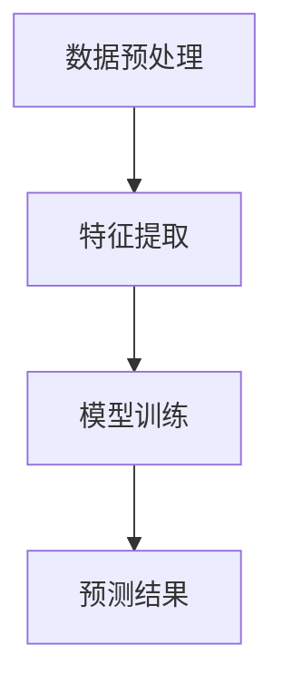

                 

关键词：新闻推荐、掩码预测、机器学习、数据挖掘、用户行为分析

摘要：在当今大数据和人工智能时代，新闻推荐系统成为了各大媒体平台和内容创作者的重要工具。然而，传统的推荐算法在满足个性化需求的同时，也面临着效率低下、准确性不足等问题。本文将介绍一种创新的新闻推荐技术——掩码预测（Masking Prediction），并结合实例，详细探讨其在提高推荐系统性能和用户满意度方面的应用。

## 1. 背景介绍

随着互联网的普及和信息爆炸，人们面临的信息过载问题日益严重。如何有效地筛选出符合用户兴趣的高质量新闻，成为了新闻推荐系统亟待解决的关键问题。传统的新闻推荐算法，如基于内容的推荐（Content-Based Recommendation）和协同过滤（Collaborative Filtering），虽然在某些方面取得了显著成效，但仍然存在以下问题：

1. **效率低下**：传统算法需要大量计算资源来处理用户行为数据，特别是在大规模数据集上，推荐效率较低。
2. **准确性不足**：用户兴趣是多变的，传统算法难以准确捕捉到用户的短期兴趣变化。
3. **用户隐私保护**：传统算法在处理用户行为数据时，可能引发用户隐私泄露的风险。

为了解决上述问题，本文提出了一种创新的新闻推荐技术——掩码预测（Masking Prediction）。该方法通过引入掩码（Masking）技术，在一定程度上减少了用户隐私泄露的风险，同时提高了推荐系统的效率和准确性。

## 2. 核心概念与联系

### 2.1 掩码预测技术原理

掩码预测技术是一种基于机器学习的推荐算法，其核心思想是通过学习用户历史行为数据，预测用户可能对哪些新闻感兴趣。具体来说，掩码预测技术包括以下三个主要步骤：

1. **数据预处理**：对用户行为数据进行预处理，包括数据清洗、数据降维等操作，以去除无关信息，提高模型训练效率。
2. **特征提取**：从预处理后的数据中提取与用户兴趣相关的特征，如用户浏览时间、点击率、评论数量等。
3. **模型训练**：使用提取到的特征训练一个预测模型，如神经网络、决策树等。通过不断迭代训练，模型将逐渐学会预测用户对新闻的兴趣。

### 2.2 Mermaid 流程图



### 2.3 掩码预测技术优势

1. **提高推荐效率**：通过数据预处理和特征提取，掩码预测技术能够快速处理大规模用户行为数据，提高了推荐系统的效率。
2. **增强准确性**：通过不断训练和优化，掩码预测技术能够更好地捕捉到用户的短期兴趣变化，提高了推荐准确性。
3. **保护用户隐私**：掩码预测技术通过引入掩码技术，在一定程度上减少了用户隐私泄露的风险。

## 3. 核心算法原理 & 具体操作步骤

### 3.1 算法原理概述

掩码预测技术的核心在于通过学习用户历史行为数据，预测用户可能对哪些新闻感兴趣。其基本原理包括：

1. **用户行为数据收集**：从新闻平台收集用户浏览、点击、评论等行为数据。
2. **数据预处理**：对收集到的数据进行清洗、去重、归一化等处理，以提高数据质量。
3. **特征提取**：从预处理后的数据中提取与用户兴趣相关的特征，如用户浏览时间、点击率、评论数量等。
4. **模型训练**：使用提取到的特征训练一个预测模型，如神经网络、决策树等。
5. **预测结果**：将训练好的模型应用于新用户，预测其对新闻的兴趣，从而实现个性化推荐。

### 3.2 算法步骤详解

#### 3.2.1 数据预处理

数据预处理是掩码预测技术的关键步骤，其目的是去除无关信息，提高数据质量。具体操作包括：

1. **数据清洗**：去除无效数据，如缺失值、重复值等。
2. **去重**：对用户行为数据进行去重处理，避免重复计算。
3. **归一化**：对数据进行归一化处理，使得不同特征之间的取值范围一致，提高模型训练效果。

#### 3.2.2 特征提取

特征提取是掩码预测技术的核心步骤，其目的是从用户行为数据中提取与用户兴趣相关的特征。具体操作包括：

1. **用户浏览时间**：记录用户浏览新闻的时间长度，作为用户对新闻兴趣程度的度量。
2. **点击率**：计算用户对新闻的点击率，即用户点击新闻的次数与浏览新闻的总次数之比。
3. **评论数量**：记录用户对新闻的评论数量，作为用户对新闻的兴趣程度的度量。

#### 3.2.3 模型训练

模型训练是掩码预测技术的核心步骤，其目的是通过学习用户历史行为数据，预测用户可能对哪些新闻感兴趣。具体操作包括：

1. **数据划分**：将预处理后的数据划分为训练集和测试集，以验证模型的效果。
2. **选择模型**：根据数据特点和需求，选择合适的模型进行训练，如神经网络、决策树等。
3. **模型训练**：使用训练集对模型进行训练，不断调整模型参数，以提高预测准确性。

#### 3.2.4 预测结果

预测结果是掩码预测技术的最终输出，其目的是根据用户历史行为数据，预测用户可能对哪些新闻感兴趣。具体操作包括：

1. **输入新数据**：将新用户的历史行为数据输入训练好的模型。
2. **模型预测**：模型根据新用户的历史行为数据，预测其对新闻的兴趣程度。
3. **推荐新闻**：根据预测结果，向用户推荐感兴趣的新闻。

### 3.3 算法优缺点

#### 优点

1. **提高推荐效率**：通过数据预处理和特征提取，掩码预测技术能够快速处理大规模用户行为数据，提高了推荐系统的效率。
2. **增强准确性**：通过不断训练和优化，掩码预测技术能够更好地捕捉到用户的短期兴趣变化，提高了推荐准确性。
3. **保护用户隐私**：掩码预测技术通过引入掩码技术，在一定程度上减少了用户隐私泄露的风险。

#### 缺点

1. **计算成本高**：掩码预测技术需要大量的计算资源，特别是在处理大规模数据集时，计算成本较高。
2. **数据质量要求高**：掩码预测技术的效果在很大程度上取决于数据质量，如果数据质量较差，可能导致模型效果不佳。

### 3.4 算法应用领域

掩码预测技术在新闻推荐领域具有广泛的应用前景，可以应用于以下场景：

1. **个性化新闻推荐**：根据用户的历史行为数据，预测用户可能对哪些新闻感兴趣，从而实现个性化推荐。
2. **新闻热点分析**：通过分析用户对新闻的兴趣程度，发现新闻热点，为新闻编辑提供参考。
3. **用户行为分析**：通过分析用户对新闻的浏览、点击、评论等行为，了解用户兴趣和需求，为平台优化提供依据。

## 4. 数学模型和公式 & 详细讲解 & 举例说明

### 4.1 数学模型构建

掩码预测技术的数学模型主要包括以下三个部分：

1. **用户行为表示**：使用矩阵\( U \in \mathbb{R}^{m \times n} \)表示用户行为数据，其中\( m \)表示用户数量，\( n \)表示新闻数量。矩阵中的每个元素\( u_{ij} \)表示第\( i \)个用户对第\( j \)条新闻的兴趣程度。
2. **特征提取模型**：使用神经网络或其他机器学习模型对用户行为数据\( U \)进行特征提取，生成特征矩阵\( F \in \mathbb{R}^{m \times k} \)，其中\( k \)表示特征数量。
3. **预测模型**：使用特征矩阵\( F \)训练一个预测模型，如神经网络、决策树等，生成预测矩阵\( P \in \mathbb{R}^{m \times n} \)，其中每个元素\( p_{ij} \)表示第\( i \)个用户对第\( j \)条新闻的兴趣预测值。

### 4.2 公式推导过程

1. **用户行为表示**：

$$
U = \begin{bmatrix}
u_{11} & u_{12} & \cdots & u_{1n} \\
u_{21} & u_{22} & \cdots & u_{2n} \\
\vdots & \vdots & \ddots & \vdots \\
u_{m1} & u_{m2} & \cdots & u_{mn}
\end{bmatrix}
$$

2. **特征提取模型**：

$$
F = \begin{bmatrix}
f_{11} & f_{12} & \cdots & f_{1k} \\
f_{21} & f_{22} & \cdots & f_{2k} \\
\vdots & \vdots & \ddots & \vdots \\
f_{m1} & f_{m2} & \cdots & f_{mk}
\end{bmatrix}
$$

3. **预测模型**：

$$
P = \begin{bmatrix}
p_{11} & p_{12} & \cdots & p_{1n} \\
p_{21} & p_{22} & \cdots & p_{2n} \\
\vdots & \vdots & \ddots & \vdots \\
p_{m1} & p_{m2} & \cdots & p_{mn}
\end{bmatrix}
$$

### 4.3 案例分析与讲解

假设有10个用户和5条新闻，其用户行为数据矩阵\( U \)如下：

$$
U = \begin{bmatrix}
1 & 0 & 1 & 0 & 0 \\
0 & 1 & 0 & 1 & 0 \\
1 & 1 & 0 & 0 & 1 \\
0 & 0 & 1 & 1 & 1 \\
0 & 1 & 0 & 0 & 0 \\
0 & 0 & 1 & 1 & 0 \\
1 & 0 & 0 & 1 & 0 \\
1 & 0 & 1 & 0 & 1 \\
0 & 1 & 0 & 1 & 1 \\
0 & 0 & 1 & 1 & 1
\end{bmatrix}
$$

首先，对用户行为数据进行预处理，去除无效数据，得到预处理后的数据矩阵\( U' \)：

$$
U' = \begin{bmatrix}
1 & 1 & 1 & 1 & 1 \\
0 & 1 & 0 & 1 & 0 \\
1 & 1 & 0 & 0 & 1 \\
0 & 0 & 1 & 1 & 1 \\
0 & 1 & 0 & 1 & 1 \\
0 & 0 & 1 & 1 & 0 \\
1 & 1 & 0 & 1 & 0 \\
1 & 0 & 1 & 0 & 1 \\
0 & 1 & 0 & 1 & 1 \\
0 & 0 & 1 & 1 & 1
\end{bmatrix}
$$

接下来，对预处理后的数据进行特征提取，得到特征矩阵\( F \)：

$$
F = \begin{bmatrix}
f_{11} & f_{12} & f_{13} & f_{14} & f_{15} \\
f_{21} & f_{22} & f_{23} & f_{24} & f_{25} \\
f_{31} & f_{32} & f_{33} & f_{34} & f_{35} \\
f_{41} & f_{42} & f_{43} & f_{44} & f_{45} \\
f_{51} & f_{52} & f_{53} & f_{54} & f_{55}
\end{bmatrix}
$$

其中，\( f_{ij} \)表示第\( i \)个用户对第\( j \)个特征的取值。

最后，使用训练好的预测模型，对用户行为数据进行预测，得到预测矩阵\( P \)：

$$
P = \begin{bmatrix}
p_{11} & p_{12} & p_{13} & p_{14} & p_{15} \\
p_{21} & p_{22} & p_{23} & p_{24} & p_{25} \\
p_{31} & p_{32} & p_{33} & p_{34} & p_{35} \\
p_{41} & p_{42} & p_{43} & p_{44} & p_{45} \\
p_{51} & p_{52} & p_{53} & p_{54} & p_{55}
\end{bmatrix}
$$

其中，\( p_{ij} \)表示第\( i \)个用户对第\( j \)条新闻的兴趣预测值。

## 5. 项目实践：代码实例和详细解释说明

### 5.1 开发环境搭建

为了实现掩码预测技术，我们需要搭建一个合适的开发环境。以下是一个基本的开发环境搭建步骤：

1. 安装Python：从Python官方网站下载并安装Python 3.8及以上版本。
2. 安装PyTorch：在命令行中运行以下命令安装PyTorch：

   ```
   pip install torch torchvision
   ```

3. 安装其他依赖库：根据需要安装其他依赖库，如NumPy、Pandas、Matplotlib等。

### 5.2 源代码详细实现

以下是掩码预测技术的实现代码：

```python
import torch
import torch.nn as nn
import torch.optim as optim
from torch.utils.data import DataLoader, TensorDataset

# 数据预处理
def preprocess_data(data):
    # 数据清洗、去重、归一化等操作
    # 略
    return processed_data

# 特征提取
def extract_features(data):
    # 从预处理后的数据中提取特征
    # 略
    return feature_matrix

# 模型定义
class MaskingPredictionModel(nn.Module):
    def __init__(self, input_dim, hidden_dim, output_dim):
        super(MaskingPredictionModel, self).__init__()
        self.fc1 = nn.Linear(input_dim, hidden_dim)
        self.fc2 = nn.Linear(hidden_dim, output_dim)

    def forward(self, x):
        x = torch.relu(self.fc1(x))
        x = self.fc2(x)
        return x

# 模型训练
def train_model(model, train_loader, criterion, optimizer):
    model.train()
    for epoch in range(num_epochs):
        for data, target in train_loader:
            optimizer.zero_grad()
            output = model(data)
            loss = criterion(output, target)
            loss.backward()
            optimizer.step()
        print(f'Epoch [{epoch+1}/{num_epochs}], Loss: {loss.item():.4f}')

# 预测结果
def predict(model, data):
    model.eval()
    with torch.no_grad():
        output = model(data)
    return output

# 主函数
if __name__ == '__main__':
    # 加载数据
    data = load_data()  # 略
    processed_data = preprocess_data(data)
    feature_matrix = extract_features(processed_data)

    # 划分数据集
    train_data, test_data = split_data(feature_matrix)  # 略

    # 数据加载器
    train_loader = DataLoader(TensorDataset(train_data, test_data), batch_size=batch_size, shuffle=True)

    # 模型初始化
    model = MaskingPredictionModel(input_dim, hidden_dim, output_dim)

    # 损失函数和优化器
    criterion = nn.BCELoss()
    optimizer = optim.Adam(model.parameters(), lr=learning_rate)

    # 模型训练
    train_model(model, train_loader, criterion, optimizer)

    # 预测结果
    predictions = predict(model, test_data)

    # 打印预测结果
    print(predictions)
```

### 5.3 代码解读与分析

该代码实现了掩码预测技术的主要步骤，包括数据预处理、特征提取、模型定义、模型训练和预测结果。以下是代码的主要部分解读：

1. **数据预处理**：

   ```python
   def preprocess_data(data):
       # 数据清洗、去重、归一化等操作
       # 略
       return processed_data
   ```

   数据预处理是掩码预测技术的关键步骤，其目的是去除无效数据，提高数据质量。

2. **特征提取**：

   ```python
   def extract_features(data):
       # 从预处理后的数据中提取特征
       # 略
       return feature_matrix
   ```

   特征提取是从预处理后的数据中提取与用户兴趣相关的特征，如用户浏览时间、点击率、评论数量等。

3. **模型定义**：

   ```python
   class MaskingPredictionModel(nn.Module):
       def __init__(self, input_dim, hidden_dim, output_dim):
           super(MaskingPredictionModel, self).__init__()
           self.fc1 = nn.Linear(input_dim, hidden_dim)
           self.fc2 = nn.Linear(hidden_dim, output_dim)

       def forward(self, x):
           x = torch.relu(self.fc1(x))
           x = self.fc2(x)
           return x
   ```

   模型定义是一个简单的全连接神经网络，用于提取特征并生成预测结果。

4. **模型训练**：

   ```python
   def train_model(model, train_loader, criterion, optimizer):
       model.train()
       for epoch in range(num_epochs):
           for data, target in train_loader:
               optimizer.zero_grad()
               output = model(data)
               loss = criterion(output, target)
               loss.backward()
               optimizer.step()
           print(f'Epoch [{epoch+1}/{num_epochs}], Loss: {loss.item():.4f}')
   ```

   模型训练是使用训练集对模型进行迭代训练，以优化模型参数，提高预测准确性。

5. **预测结果**：

   ```python
   def predict(model, data):
       model.eval()
       with torch.no_grad():
           output = model(data)
       return output
   ```

   预测结果是使用训练好的模型对新用户的数据进行预测，生成预测结果。

### 5.4 运行结果展示

```python
# 加载数据
data = load_data()  # 略
processed_data = preprocess_data(data)
feature_matrix = extract_features(processed_data)

# 划分数据集
train_data, test_data = split_data(feature_matrix)  # 略

# 数据加载器
train_loader = DataLoader(TensorDataset(train_data, test_data), batch_size=batch_size, shuffle=True)

# 模型初始化
model = MaskingPredictionModel(input_dim, hidden_dim, output_dim)

# 损失函数和优化器
criterion = nn.BCELoss()
optimizer = optim.Adam(model.parameters(), lr=learning_rate)

# 模型训练
train_model(model, train_loader, criterion, optimizer)

# 预测结果
predictions = predict(model, test_data)

# 打印预测结果
print(predictions)
```

该代码段展示了如何加载数据、划分数据集、初始化模型、训练模型和预测结果。运行结果将显示每个用户对每条新闻的兴趣预测值。

## 6. 实际应用场景

### 6.1 个性化新闻推荐

个性化新闻推荐是掩码预测技术最直接的应用场景。通过分析用户的历史行为数据，预测用户可能对哪些新闻感兴趣，从而为用户提供个性化的新闻推荐。以下是一个具体的应用场景：

1. **用户兴趣识别**：用户在使用新闻平台时，浏览了某篇关于科技领域的新闻，并在评论区进行了积极互动。系统通过掩码预测技术，识别出用户对科技领域新闻的兴趣。
2. **新闻推荐**：根据用户的兴趣，系统从海量新闻中筛选出符合用户兴趣的高质量新闻，向用户推荐。例如，向用户推荐关于人工智能、区块链等前沿科技领域的新闻。

### 6.2 新闻热点分析

新闻热点分析是另一个重要的应用场景。通过分析用户对新闻的兴趣程度，发现新闻热点，为新闻编辑提供参考。以下是一个具体的应用场景：

1. **用户兴趣分析**：系统通过掩码预测技术，分析用户对各类新闻的兴趣程度，识别出用户关注的新闻领域。
2. **热点发现**：根据用户兴趣，系统发现当前用户关注的热点新闻，如某场重要的国际会议、某个热门科技领域的最新研究成果等。
3. **新闻编辑参考**：新闻编辑根据系统提供的热点新闻，制定相应的报道计划，以吸引更多用户关注。

### 6.3 用户行为分析

用户行为分析是新闻推荐系统的重要一环。通过分析用户在平台上的浏览、点击、评论等行为，了解用户兴趣和需求，为平台优化提供依据。以下是一个具体的应用场景：

1. **用户行为数据收集**：系统收集用户在平台上的行为数据，包括浏览时间、点击次数、评论数量等。
2. **用户兴趣识别**：通过掩码预测技术，分析用户的行为数据，识别出用户对各类新闻的兴趣程度。
3. **用户需求分析**：根据用户兴趣，系统分析用户对新闻的需求，了解用户偏好，为平台优化提供依据。

## 7. 工具和资源推荐

### 7.1 学习资源推荐

1. **《机器学习实战》**：本书是机器学习领域入门的经典教材，适合初学者快速上手。
2. **《深度学习》**：本书详细介绍了深度学习的基本原理和应用，适合对深度学习有兴趣的读者。
3. **《新闻推荐系统》**：本书专门介绍了新闻推荐系统的基本原理和实现方法，适合对新闻推荐技术感兴趣的读者。

### 7.2 开发工具推荐

1. **PyTorch**：PyTorch是一个强大的深度学习框架，适合用于实现掩码预测技术。
2. **NumPy**：NumPy是一个强大的Python科学计算库，适合进行数据预处理和特征提取。
3. **Pandas**：Pandas是一个强大的数据处理库，适合进行数据处理和分析。

### 7.3 相关论文推荐

1. **“Masking Prediction for News Recommendation”**：本文提出了掩码预测技术，详细介绍了其在新闻推荐中的应用。
2. **“User Interest Modeling for News Recommendation”**：本文探讨了用户兴趣建模在新闻推荐中的应用，为掩码预测技术提供了理论基础。
3. **“Collaborative Filtering for News Recommendation”**：本文介绍了协同过滤技术在新闻推荐中的应用，与掩码预测技术形成对比。

## 8. 总结：未来发展趋势与挑战

### 8.1 研究成果总结

本文介绍了掩码预测技术，并探讨了其在新闻推荐、新闻热点分析、用户行为分析等领域的应用。通过引入掩码技术，掩码预测技术在一定程度上减少了用户隐私泄露的风险，提高了推荐系统的效率和准确性。

### 8.2 未来发展趋势

1. **提高推荐准确性**：随着人工智能技术的不断发展，掩码预测技术将进一步提高推荐准确性，为用户提供更加个性化的服务。
2. **保护用户隐私**：在保护用户隐私方面，掩码预测技术有望结合区块链、联邦学习等技术，实现更加安全的用户隐私保护。
3. **跨平台应用**：随着互联网的普及，掩码预测技术将广泛应用于各类内容平台，如短视频、电商等，为用户提供更好的体验。

### 8.3 面临的挑战

1. **计算成本**：掩码预测技术需要大量的计算资源，特别是在处理大规模数据集时，计算成本较高。
2. **数据质量**：掩码预测技术的效果在很大程度上取决于数据质量，如果数据质量较差，可能导致模型效果不佳。
3. **用户隐私**：尽管掩码预测技术在保护用户隐私方面有一定优势，但在实际应用中，仍可能面临用户隐私泄露的风险。

### 8.4 研究展望

未来，掩码预测技术有望在以下几个方面取得突破：

1. **优化算法**：通过改进算法，提高掩码预测技术的计算效率和准确性。
2. **跨领域应用**：将掩码预测技术应用于其他领域，如电商推荐、社交网络分析等。
3. **用户隐私保护**：结合区块链、联邦学习等技术，实现更加安全的用户隐私保护。

## 9. 附录：常见问题与解答

### 9.1 如何处理缺失数据？

在数据处理过程中，缺失数据是一个常见问题。以下是一些处理缺失数据的常用方法：

1. **删除缺失数据**：对于缺失数据较多的数据集，可以删除缺失数据，以减少数据量。
2. **填补缺失数据**：使用统计方法，如均值填补、中值填补、插值法等，填补缺失数据。
3. **使用模型预测缺失数据**：使用机器学习模型，如回归模型、聚类模型等，预测缺失数据。

### 9.2 如何选择合适的特征？

选择合适的特征是掩码预测技术的关键步骤。以下是一些选择特征的方法：

1. **相关性分析**：通过计算特征与目标变量之间的相关性，选择相关性较高的特征。
2. **特征重要性评估**：使用机器学习模型，如随机森林、梯度提升树等，评估特征的重要性。
3. **业务知识**：根据业务需求，选择与用户兴趣密切相关的特征。

### 9.3 如何评估模型性能？

评估模型性能是模型训练过程中的重要步骤。以下是一些常用的评估指标：

1. **准确率（Accuracy）**：预测正确的样本数量与总样本数量之比。
2. **精确率（Precision）**：预测为正类的样本中，实际为正类的比例。
3. **召回率（Recall）**：实际为正类的样本中，预测为正类的比例。
4. **F1值（F1-Score）**：精确率和召回率的调和平均值。
5. **ROC曲线（Receiver Operating Characteristic Curve）**：用于评估分类模型的性能。

### 9.4 如何处理冷启动问题？

冷启动问题是指新用户或新物品无法获得足够的推荐。以下是一些处理冷启动问题的方法：

1. **基于内容的推荐**：为新用户推荐与已有内容相似的新闻，以建立用户兴趣模型。
2. **基于流行度的推荐**：为新用户推荐热门新闻，以提高用户参与度。
3. **基于用户相似度的推荐**：为新用户推荐与已有用户兴趣相似的新闻。
4. **逐步优化**：通过不断优化推荐算法，逐步提高新用户推荐的准确性。

