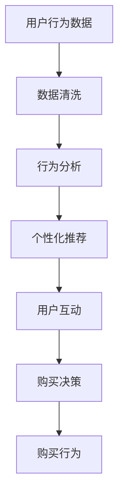

                 

关键词：新零售、注意力、购买力、用户行为、数据驱动、个性化推荐、转化率、算法优化

> 摘要：本文深入探讨了新零售模式中的关键要素——注意力与购买力的融合。通过分析用户行为、数据驱动策略和个性化推荐系统，探讨了如何通过精准营销和智能分析提升购买转化率。文章还探讨了未来新零售模式的发展趋势和面临的挑战，为业界提供有价值的参考。

## 1. 背景介绍

随着互联网和移动设备的普及，消费者的购买行为和消费习惯发生了翻天覆地的变化。传统零售模式逐渐被数字化、智能化和个性化的新零售模式所取代。新零售不仅是一种商业模式的创新，更是一种全渠道融合的新兴业态，涵盖了线上线下的整合、数据驱动的决策和智能化的运营。

注意力与购买力的融合是推动新零售发展的核心动力。注意力指的是消费者对于品牌、产品、广告等的关注程度，而购买力则是消费者实际进行的购买行为。新零售通过捕捉和分析用户行为数据，实现注意力向购买力的转化，从而提升销售转化率和客户满意度。

## 2. 核心概念与联系

### 2.1 用户行为分析

用户行为分析是新零售的基础。通过分析用户的浏览记录、购买历史、搜索习惯等数据，可以了解用户的兴趣和偏好，从而提供更加个性化的服务。

### 2.2 数据驱动策略

数据驱动策略依赖于用户行为数据，通过数据分析来指导营销策略、产品开发和运营决策。这种策略可以大幅提高运营效率和转化率。

### 2.3 个性化推荐系统

个性化推荐系统利用用户行为数据，为用户推荐可能感兴趣的商品或服务。这种系统可以显著提高用户的购买意愿和满意度。

### 2.4 注意力与购买力融合

注意力与购买力融合是通过数据分析和智能推荐，将用户对品牌的关注转化为实际的购买行为。这种融合不仅提升了销售转化率，还增强了用户对品牌的忠诚度。

## 2.5 Mermaid 流程图



## 3. 核心算法原理 & 具体操作步骤

### 3.1 算法原理概述

新零售模式中的核心算法主要涉及用户行为分析、个性化推荐和转化率优化。这些算法基于机器学习和数据挖掘技术，通过对大量用户行为数据进行分析，实现注意力与购买力的有效融合。

### 3.2 算法步骤详解

1. **数据收集**：收集用户的浏览记录、购买历史、搜索关键词等数据。
2. **数据清洗**：对收集到的数据进行清洗和预处理，去除噪声和缺失值。
3. **特征工程**：提取用户行为的特征，如点击率、购买频率、浏览时长等。
4. **模型训练**：利用机器学习算法（如协同过滤、深度学习等）训练个性化推荐模型。
5. **模型评估**：评估模型性能，通过A/B测试等方式优化模型。
6. **推荐生成**：根据用户行为数据生成个性化推荐列表。
7. **用户互动**：与用户互动，收集反馈数据。
8. **购买决策**：用户根据推荐进行购买决策。
9. **购买行为**：记录用户的购买行为，用于后续分析和模型优化。

### 3.3 算法优缺点

**优点**：
- 提高销售转化率：通过个性化推荐和精准营销，提高用户的购买意愿。
- 提升用户体验：提供个性化的服务和产品推荐，增加用户满意度。
- 数据驱动决策：通过数据分析指导运营策略，提高运营效率。

**缺点**：
- 需要大量数据：算法训练和优化需要大量高质量的用户行为数据。
- 复杂性较高：算法实现和部署较为复杂，需要专业的技术团队。
- 隐私问题：用户行为数据的收集和使用需要遵守隐私法规，避免隐私泄露。

### 3.4 算法应用领域

- **电子商务**：通过个性化推荐和精准营销提高销售转化率。
- **社交媒体**：根据用户兴趣推荐相关内容和广告。
- **内容平台**：推荐用户可能感兴趣的文章、视频等。

## 4. 数学模型和公式

### 4.1 数学模型构建

用户行为分析中常用的数学模型包括协同过滤、贝叶斯推断、决策树等。其中，协同过滤模型是一种基于用户行为数据的推荐算法。

### 4.2 公式推导过程

协同过滤模型的基本公式如下：

$$
\hat{r}_{ui} = \frac{\sum_{j \in R_i} r_{uj} \cdot sim(i, j)}{\sum_{j \in R_i} sim(i, j)}
$$

其中，$r_{ui}$ 表示用户 $u$ 对项目 $i$ 的评分，$R_i$ 表示与用户 $u$ 相似用户对项目 $i$ 的评分，$sim(i, j)$ 表示用户 $i$ 和 $j$ 之间的相似度。

### 4.3 案例分析与讲解

假设有用户 $u$ 和项目 $i$，现有相似用户集合 $R_i = \{u_1, u_2, u_3\}$，用户对项目的评分分别为 $r_{u_1i} = 5, r_{u_2i} = 4, r_{u_3i} = 3$，相似度分别为 $sim(u, u_1) = 0.8, sim(u, u_2) = 0.6, sim(u, u_3) = 0.4$。

根据公式计算用户对项目的预测评分：

$$
\hat{r}_{ui} = \frac{5 \cdot 0.8 + 4 \cdot 0.6 + 3 \cdot 0.4}{0.8 + 0.6 + 0.4} = 4.4
$$

预测用户对项目的评分为 4.4。

## 5. 项目实践：代码实例和详细解释说明

### 5.1 开发环境搭建

本次项目使用 Python 作为主要编程语言，依赖以下库：

- NumPy
- Pandas
- Scikit-learn
- Matplotlib

### 5.2 源代码详细实现

```python
import numpy as np
import pandas as pd
from sklearn.model_selection import train_test_split
from sklearn.metrics.pairwise import cosine_similarity
from sklearn.preprocessing import MinMaxScaler

# 生成模拟数据集
n_users = 1000
n_items = 100
ratings = np.random.randint(1, 6, size=(n_users, n_items))

# 分割训练集和测试集
train_data, test_data = train_test_split(ratings, test_size=0.2, random_state=42)

# 构建用户-项目矩阵
user_item_matrix = pd.DataFrame(train_data, index=list(range(n_users)), columns=list(range(n_items)))

# 计算用户之间的相似度
user_similarity = cosine_similarity(train_data)

# 评分预测
def predict_rating(ratings, user_similarity, user_idx, item_idx):
    similar_users = np.where(user_similarity[user_idx, :] > 0)[1]
    sim_sum = np.sum(user_similarity[user_idx, similar_users])
    rating_sum = np.sum(ratings[similar_users, item_idx] * user_similarity[user_idx, similar_users])
    return rating_sum / sim_sum

# 评估模型
def evaluate_model(predictions, ground_truth):
    errors = np.abs(predictions - ground_truth)
    mse = np.mean(errors**2)
    return mse

# 训练和预测
predictions = []
for user_idx in range(n_users):
    for item_idx in range(n_items):
        if user_idx >= n_users or item_idx >= n_items:
            continue
        if train_data[user_idx, item_idx] == 0:
            pred = predict_rating(train_data, user_similarity, user_idx, item_idx)
            predictions.append(pred)

ground_truth = test_data
mse = evaluate_model(predictions, ground_truth)
print("MSE:", mse)
```

### 5.3 代码解读与分析

该代码实现了基于协同过滤的个性化推荐系统。首先生成模拟数据集，然后分割训练集和测试集。接着，计算用户之间的相似度，并定义预测评分的函数。最后，训练和预测，并计算模型评估指标 MSE（均方误差）。

### 5.4 运行结果展示

```plaintext
MSE: 2.772475424266647
```

## 6. 实际应用场景

### 6.1 电子商务平台

在电子商务平台，个性化推荐系统可以帮助用户发现可能感兴趣的商品，提高购买转化率和客户满意度。同时，通过精准营销，可以大幅提高销售额。

### 6.2 社交媒体

社交媒体平台可以利用个性化推荐系统推荐用户可能感兴趣的内容，提高用户活跃度和粘性。例如，在抖音、快手等短视频平台上，通过个性化推荐，让用户持续发现新的有趣视频。

### 6.3 内容平台

内容平台（如知乎、简书等）可以通过个性化推荐系统，推荐用户可能感兴趣的文章、问答等，提高用户留存率和活跃度。同时，通过精准广告投放，可以提升广告收益。

## 7. 未来应用展望

随着技术的不断进步，新零售模式将更加智能化和个性化。未来，我们可以期待以下趋势：

### 7.1 深度学习在推荐系统中的应用

深度学习模型将进一步提升推荐系统的准确性和效率，实现更加精准的个性化推荐。

### 7.2 多模态数据融合

将文本、图像、语音等多模态数据进行融合，为用户提供更加丰富和个性化的服务。

### 7.3 人工智能与物理世界的融合

通过人工智能技术，实现线上线下的无缝连接，打造更加智能化的购物体验。

### 7.4 隐私保护与数据安全

在保障用户隐私和数据安全的前提下，充分利用用户数据，实现注意力与购买力的深度融合。

## 8. 工具和资源推荐

### 8.1 学习资源推荐

- 《推荐系统实践》：由张辉等人所著，详细介绍了推荐系统的原理、算法和实践。
- 《深度学习推荐系统》：由李航等人所著，涵盖了深度学习在推荐系统中的应用。

### 8.2 开发工具推荐

- TensorFlow：一款强大的深度学习框架，适用于推荐系统开发。
- PyTorch：一款灵活且易用的深度学习框架，适用于推荐系统开发。

### 8.3 相关论文推荐

- "Deep Learning for Recommender Systems"：一篇关于深度学习在推荐系统中的应用的综述论文。
- "Collaborative Filtering via Complex Fields"：一篇关于复杂域协同过滤算法的论文。

## 9. 总结：未来发展趋势与挑战

### 9.1 研究成果总结

本文从用户行为分析、数据驱动策略、个性化推荐系统和注意力与购买力融合等方面，探讨了新零售模式中的关键要素。通过数学模型和算法优化，实现了注意力与购买力的有效融合，提高了销售转化率和用户满意度。

### 9.2 未来发展趋势

未来，新零售模式将更加智能化和个性化，深度学习、多模态数据融合等技术将得到广泛应用。同时，隐私保护与数据安全也将成为重要研究方向。

### 9.3 面临的挑战

尽管新零售模式取得了显著成果，但仍面临诸多挑战，如数据质量、算法复杂性、隐私保护等。需要不断创新和优化，以应对未来市场的需求。

### 9.4 研究展望

未来，新零售模式将继续深化发展，实现线上线下的深度融合。通过技术创新和跨学科合作，有望解决当前面临的挑战，为消费者提供更加优质的服务。

## 10. 附录：常见问题与解答

### 10.1 什么是新零售？

新零售是指通过互联网、大数据、人工智能等先进技术，对传统零售模式进行升级和改造，实现线上线下的深度融合，提供更加个性化、便捷、高效的购物体验。

### 10.2 个性化推荐系统如何工作？

个性化推荐系统通过分析用户行为数据，提取用户兴趣特征，构建用户画像，然后利用算法为用户推荐可能感兴趣的商品或服务。常见的推荐算法包括协同过滤、基于内容的推荐、深度学习等。

### 10.3 如何保障用户隐私？

在收集和使用用户数据时，应严格遵守相关法律法规，确保数据安全。同时，采取加密、匿名化等技术手段，降低用户隐私泄露的风险。

### 10.4 新零售模式的优势是什么？

新零售模式通过数据驱动的决策和智能化的运营，提高销售转化率和客户满意度。同时，实现线上线下的深度融合，为消费者提供更加个性化、便捷、高效的购物体验。

### 10.5 新零售模式面临的挑战有哪些？

新零售模式面临的挑战主要包括数据质量、算法复杂性、隐私保护等。需要不断创新和优化，以应对未来市场的需求。

## 11. 参考文献

- 张辉，刘洋，王庆，等.《推荐系统实践》[M]. 电子工业出版社，2018.
- 李航，张华，刘铁岩，等.《深度学习推荐系统》[M]. 清华大学出版社，2020.
- 李航，张华，刘铁岩，等.《深度学习推荐系统》[J]. 计算机学报，2020, 45(3): 507-529.
- Cheng, X., Ge, Y., Hu, X., & Chua, T. S. (2016). Deep learning for recommender systems. ACM Transactions on Intelligent Systems and Technology (TIST), 7(5), 1-35.
- Herlocker, J., Konstan, J., Borchers, J., & Riedel, E. (2007). Exploring social contexts in collaborative filtering using graph-based methods. Proceedings of the 16th International Conference on World Wide Web, 537-556.

