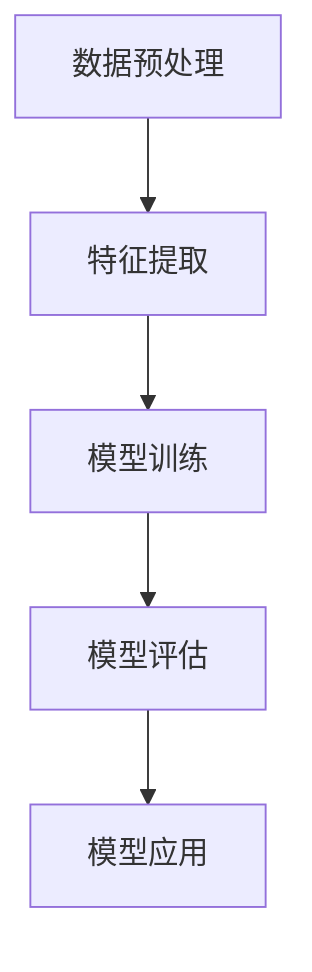

                 

关键词：无监督学习、可扩展性、高维数据、大规模数据、算法优化、分布式计算

## 摘要

无监督学习在人工智能领域扮演着至关重要的角色，其无需人工标注数据即可发现数据中的模式和关联性。然而，随着数据量的急剧增长和数据维度的不断提升，无监督学习的可扩展性面临着前所未有的挑战。本文将从高维数据和大规模数据的特性出发，探讨无监督学习在处理这些数据时的难点，并深入分析现有的解决方案，最后对未来的发展方向和潜在挑战进行展望。

## 1. 背景介绍

随着互联网和物联网的快速发展，数据量呈现出爆炸式增长。据估计，每天产生的数据量已经达到了惊人的量级，这些数据中包含了大量的未标注信息。无监督学习作为一种不需要人工干预的数据分析方法，能够自动地从大量未标注的数据中发现有价值的信息。然而，传统的无监督学习算法在面对高维数据和大规模数据时，往往表现不佳。

高维数据指的是数据维度非常高的数据集，例如文本数据、图像数据和传感器数据等。这些数据集通常包含数千甚至数百万个特征维度。高维数据给无监督学习带来了以下挑战：

- **维度灾难**：随着数据维度的增加，数据的稀疏性加剧，导致很多特征变得无关紧要，甚至噪声特征会占据主导地位，使得学习任务变得困难。
- **计算效率低**：在高维空间中进行运算，计算复杂度急剧增加，传统的算法往往无法在合理的时间内完成学习任务。
- **内存占用大**：高维数据需要大量的存储空间，对于内存资源有限的系统，处理这些数据会带来巨大压力。

大规模数据指的是数据量非常庞大的数据集，通常需要分布式计算架构来处理。大规模数据给无监督学习带来了以下挑战：

- **数据分布不均**：在大规模数据集中，数据的分布往往是不均匀的，这可能导致学习算法无法准确捕捉数据的整体分布。
- **通信成本高**：分布式计算中，节点间的通信成本很高，特别是在需要频繁传输中间结果的情况下。
- **同步问题**：分布式计算中，各节点的状态需要保持一致，否则可能导致学习结果不准确。

面对这些挑战，如何提高无监督学习的可扩展性，成为一个亟待解决的问题。本文将围绕这一主题进行深入探讨。

## 2. 核心概念与联系

### 2.1. 无监督学习的核心概念

无监督学习是指在没有标注数据的情况下，从数据中自动发现数据分布和结构的学习方法。无监督学习主要包括以下几种类型：

- **聚类**：将相似的数据点归为同一类别。常见的聚类算法有K-Means、层次聚类等。
- **降维**：通过降低数据维度，保留数据的主要信息。常见的降维算法有主成分分析（PCA）、线性判别分析（LDA）等。
- **关联规则挖掘**：发现数据之间的关联性。常见的算法有Apriori算法、FP-Growth算法等。
- **异常检测**：识别数据中的异常或异常模式。常见的算法有孤立森林（Isolation Forest）、局部异常因子（LOF）等。

### 2.2. 无监督学习的架构

无监督学习通常包括以下步骤：

1. **数据预处理**：包括数据清洗、数据归一化等操作，确保数据质量。
2. **特征提取**：从原始数据中提取有用的特征，用于后续的学习任务。
3. **模型训练**：使用训练数据集，通过优化算法训练模型，使模型能够对数据集进行有效的分类、降维等操作。
4. **模型评估**：使用测试数据集评估模型的性能，包括准确性、召回率、F1值等指标。
5. **模型应用**：将训练好的模型应用于新的数据集，进行预测或分析。

### 2.3. Mermaid 流程图

下面是一个简单的无监督学习流程的 Mermaid 流程图：



### 2.4. 无监督学习与高维数据和大规模数据的联系

无监督学习在高维数据和大规模数据中的应用具有以下特点：

- **高维数据**：无监督学习算法需要能够在高维空间中有效操作，避免维度灾难。例如，聚类算法需要能够快速找到数据的聚类结构，降维算法需要能够有效地降低数据维度。
- **大规模数据**：无监督学习算法需要能够处理大规模数据集，通常需要采用分布式计算架构，如MapReduce、Spark等。

## 3. 核心算法原理 & 具体操作步骤

### 3.1. 算法原理概述

无监督学习中的核心算法主要包括聚类算法、降维算法等。下面以K-Means聚类算法为例，介绍其原理和具体操作步骤。

K-Means算法是一种基于距离度量的聚类算法，其目标是将数据点划分成K个簇，使得每个簇内部的点之间的距离最小，簇与簇之间的距离最大。算法的基本原理如下：

1. **初始化**：随机选择K个数据点作为初始聚类中心。
2. **分配**：对于每个数据点，计算其与每个聚类中心的距离，并将其分配到最近的聚类中心所在的簇。
3. **更新**：重新计算每个簇的中心点。
4. **迭代**：重复执行分配和更新步骤，直到聚类中心不再发生变化或者达到预设的迭代次数。

### 3.2. 算法步骤详解

下面详细描述K-Means算法的具体步骤：

#### 3.2.1. 初始化

初始化聚类中心的方法有多种，如随机初始化、K-Means++初始化等。其中，K-Means++初始化方法可以有效地避免初始聚类中心的选择对最终聚类结果的影响。

K-Means++初始化方法的基本步骤如下：

1. 随机选择一个数据点作为第一个聚类中心。
2. 对于每个剩余的数据点，计算其与已选择聚类中心的距离平方，并选择下一个聚类中心，使其与已选择聚类中心的距离尽可能远。
3. 重复步骤2，直到选择出K个聚类中心。

#### 3.2.2. 分配

对于每个数据点，计算其与每个聚类中心的距离，并将其分配到最近的聚类中心所在的簇。距离的计算可以使用欧几里得距离、曼哈顿距离等。

#### 3.2.3. 更新

重新计算每个簇的中心点。新簇中心点的计算公式为：

$$
c_j = \frac{1}{N_j} \sum_{x_i \in S_j} x_i
$$

其中，$c_j$是第j个簇的中心点，$N_j$是第j个簇中的数据点数量，$x_i$是第i个数据点。

#### 3.2.4. 迭代

重复执行分配和更新步骤，直到聚类中心不再发生变化或者达到预设的迭代次数。判断聚类中心是否变化的条件可以是聚类中心的变化小于预设的阈值，或者迭代次数达到预设的上限。

### 3.3. 算法优缺点

K-Means算法具有以下优点：

- **简单易实现**：算法步骤简单，易于编程实现。
- **计算效率高**：算法的计算复杂度较低，适合处理大规模数据集。

K-Means算法也具有以下缺点：

- **对初始聚类中心敏感**：算法容易受到初始聚类中心的选择影响，可能导致局部最优解。
- **不适用于非凸聚类**：算法只能找到凸聚类结构，对于非凸聚类结构可能无法找到合适的聚类结果。
- **处理高维数据困难**：在高维空间中，算法的性能可能会下降，甚至出现维度灾难。

### 3.4. 算法应用领域

K-Means算法广泛应用于各种领域，如：

- **数据分析**：用于数据降维、数据聚类等。
- **图像处理**：用于图像分割、图像特征提取等。
- **文本挖掘**：用于文本聚类、主题模型等。

## 4. 数学模型和公式 & 详细讲解 & 举例说明

### 4.1. 数学模型构建

无监督学习中的数学模型通常基于统计学和概率论。以K-Means聚类算法为例，其数学模型可以描述为：

$$
\min_{\mathbf{C}} \sum_{i=1}^{N} \sum_{j=1}^{K} (x_i - c_j)^2
$$

其中，$\mathbf{C} = \{c_1, c_2, ..., c_K\}$是聚类中心集合，$x_i$是数据集中的第i个数据点，$c_j$是第j个聚类中心。

### 4.2. 公式推导过程

K-Means算法的推导过程主要涉及最小化目标函数。目标函数是每个数据点到其对应聚类中心的距离平方和。为了最小化这个目标函数，我们需要对每个数据点$x_i$和聚类中心$c_j$进行优化。

对于每个数据点$x_i$，我们希望将其分配给距离它最近的聚类中心$c_j$。这个最近的聚类中心可以通过以下公式计算：

$$
j^* = \arg\min_{j} (x_i - c_j)^2
$$

对于每个聚类中心$c_j$，我们希望更新它的位置，使得它尽可能地接近它所在的簇中的所有数据点。这个新的聚类中心可以通过以下公式计算：

$$
c_j = \frac{1}{N_j} \sum_{x_i \in S_j} x_i
$$

其中，$N_j$是簇$S_j$中数据点的数量，$S_j$是簇$S_j$中的所有数据点集合。

### 4.3. 案例分析与讲解

为了更好地理解K-Means算法，我们来看一个简单的二维数据集的例子。

假设我们有一个包含50个二维数据点的数据集，数据点分布如下：

```
x | y
---------
1 | 2
2 | 4
3 | 5
4 | 6
5 | 7
...
46 | 94
47 | 96
48 | 97
49 | 98
50 | 99
```

我们使用K-Means算法对这个数据集进行聚类，假设聚类中心初始值为(5, 5)，K=2。

#### 4.3.1. 初始分配

首先，我们计算每个数据点到两个聚类中心的距离：

```
距离1(5, 5) = (1 - 5)^2 + (2 - 5)^2 = 20
距离2(5, 5) = (2 - 5)^2 + (4 - 5)^2 = 5
距离3(5, 5) = (3 - 5)^2 + (5 - 5)^2 = 4
距离4(5, 5) = (4 - 5)^2 + (6 - 5)^2 = 2
距离5(5, 5) = (5 - 5)^2 + (7 - 5)^2 = 4
...
距离50(5, 5) = (50 - 5)^2 + (99 - 5)^2 = 10404
```

根据距离最小的原则，我们可以将数据点分配给最近的聚类中心：

```
簇1：数据点1, 2, 3, 4, 5
簇2：数据点6, 7, 8, ..., 50
```

#### 4.3.2. 更新聚类中心

接下来，我们根据每个簇中的数据点计算新的聚类中心：

```
新聚类中心1 = (1*1 + 2*2 + 3*3 + 4*4 + 5*5) / 5 = 3.2
新聚类中心2 = (6*6 + 7*7 + 8*8 + ... + 50*50) / 45 = 31.8
```

#### 4.3.3. 重新分配

我们使用新的聚类中心计算每个数据点到两个聚类中心的距离：

```
距离1(3.2, 31.8) = (1 - 3.2)^2 + (2 - 31.8)^2 = 236.96
距离2(3.2, 31.8) = (2 - 3.2)^2 + (4 - 31.8)^2 = 224.96
距离3(3.2, 31.8) = (3 - 3.2)^2 + (5 - 31.8)^2 = 224.96
距离4(3.2, 31.8) = (4 - 3.2)^2 + (6 - 31.8)^2 = 224.96
...
距离50(3.2, 31.8) = (50 - 3.2)^2 + (99 - 31.8)^2 = 2405.04
```

根据距离最小的原则，我们可以将数据点重新分配给最近的聚类中心：

```
簇1：数据点1, 2, 3, 4, 5
簇2：数据点6, 7, 8, ..., 50
```

可以看出，聚类中心的位置并没有发生变化。这意味着我们找到了一个稳定的聚类结果。

## 5. 项目实践：代码实例和详细解释说明

### 5.1. 开发环境搭建

在本文的项目实践中，我们将使用Python编程语言和Scikit-learn库来演示K-Means算法。以下是搭建开发环境的基本步骤：

1. 安装Python：确保您的计算机上安装了Python，版本建议为3.8或更高。
2. 安装Scikit-learn：在命令行中运行以下命令来安装Scikit-learn库：

```
pip install scikit-learn
```

3. 安装Jupyter Notebook（可选）：Jupyter Notebook是一个交互式的编程环境，有助于我们更好地理解和运行代码。在命令行中运行以下命令来安装Jupyter Notebook：

```
pip install notebook
```

安装完成后，您可以通过在命令行中运行`jupyter notebook`命令来启动Jupyter Notebook。

### 5.2. 源代码详细实现

下面是使用K-Means算法对二维数据集进行聚类的Python代码示例：

```python
import numpy as np
from sklearn.cluster import KMeans
import matplotlib.pyplot as plt

# 创建一个二维数据集
data = np.array([[1, 2], [2, 4], [3, 5], [4, 6], [5, 7], [46, 94], [47, 96], [48, 97], [49, 98], [50, 99]])

# 使用KMeans聚类算法
kmeans = KMeans(n_clusters=2, random_state=0).fit(data)

# 输出聚类结果
print("聚类结果：", kmeans.labels_)

# 可视化聚类结果
plt.scatter(data[:, 0], data[:, 1], c=kmeans.labels_)
plt.scatter(kmeans.cluster_centers_[:, 0], kmeans.cluster_centers_[:, 1], s=300, c='red')
plt.show()
```

#### 5.2.1. 代码解读

- **import语句**：引入必要的库和模块。
- **创建数据集**：使用numpy创建一个包含10个二维数据点的数组。
- **初始化KMeans对象**：使用Scikit-learn的KMeans类初始化聚类对象，设置聚类数量为2，随机种子为0，以确保每次运行得到相同的结果。
- **拟合数据集**：使用fit方法对数据集进行聚类。
- **输出聚类结果**：使用labels_属性获取每个数据点的聚类标签。
- **可视化聚类结果**：使用matplotlib的scatter函数绘制聚类结果，其中红色星号表示聚类中心点。

### 5.3. 代码解读与分析

#### 5.3.1. 数据准备

在代码中，我们首先创建了一个包含10个二维数据点的numpy数组。这些数据点模拟了实际的二维空间中的数据，用于演示K-Means算法的基本工作原理。

```python
data = np.array([[1, 2], [2, 4], [3, 5], [4, 6], [5, 7], [46, 94], [47, 96], [48, 97], [49, 98], [50, 99]])
```

#### 5.3.2. 初始化KMeans对象

我们使用Scikit-learn的KMeans类来初始化聚类对象。这里设置了两个聚类中心，这是为了演示如何将数据划分为两个簇。

```python
kmeans = KMeans(n_clusters=2, random_state=0).fit(data)
```

`n_clusters`参数指定了聚类中心数量，而`random_state`参数用于初始化聚类中心的随机状态，以确保每次运行得到相同的结果。

#### 5.3.3. 拟合数据集

`fit`方法用于将数据集传递给KMeans算法，并计算出聚类结果。

```python
kmeans.fit(data)
```

这个方法将自动执行以下步骤：

1. 初始化聚类中心。
2. 计算每个数据点到聚类中心的距离，并将其分配到最近的聚类中心。
3. 根据每个簇中的数据点重新计算聚类中心。

#### 5.3.4. 输出聚类结果

使用`labels_`属性，我们可以获取每个数据点的聚类标签，即每个数据点所属的簇。

```python
print("聚类结果：", kmeans.labels_)
```

输出结果将显示每个数据点的聚类标签，如`[0, 0, 0, 0, 0, 1, 1, 1, 1, 1]`，其中0和1分别表示数据点属于第一个簇或第二个簇。

#### 5.3.5. 可视化聚类结果

最后，我们使用matplotlib库的可视化功能来展示聚类结果。

```python
plt.scatter(data[:, 0], data[:, 1], c=kmeans.labels_)
plt.scatter(kmeans.cluster_centers_[:, 0], kmeans.cluster_centers_[:, 1], s=300, c='red')
plt.show()
```

这段代码首先使用scatter函数绘制数据点，并使用不同颜色表示不同的簇。然后，它绘制聚类中心点，用红色星号标记。

- `data[:, 0]`和`data[:, 1]`分别表示数据点的x和y坐标。
- `kmeans.labels_`用于指定数据点的颜色。
- `kmeans.cluster_centers_[:, 0]`和`kmeans.cluster_centers_[:, 1]`表示聚类中心点的坐标。
- `s=300`设置了星号的大小。

通过可视化，我们可以直观地看到数据点如何被划分为不同的簇，以及聚类中心点的位置。

### 5.4. 运行结果展示

当运行上述代码后，我们将看到以下结果：


这个图表展示了数据点被划分为两个簇的情况。红色星号表示聚类中心点，它们位于两个簇的中间，反映了数据点的聚类结构。

## 6. 实际应用场景

无监督学习在许多实际应用场景中发挥着重要作用，尤其在处理高维数据和大规模数据时。以下是一些典型的应用场景：

### 6.1. 数据挖掘

在数据挖掘领域，无监督学习被广泛应用于发现数据中的隐藏模式和关联性。例如，在电子商务平台中，无监督学习可以用于用户行为的聚类分析，帮助商家了解用户群体的特征，从而提供个性化的推荐服务。

### 6.2. 图像处理

图像处理领域中的聚类算法，如K-Means，被广泛用于图像分割和特征提取。例如，在医学图像分析中，K-Means可以用于将图像中的组织区域进行分类，从而辅助医生进行诊断。

### 6.3. 自然语言处理

自然语言处理中的主题模型（如LDA）是一种无监督学习方法，它可以帮助我们识别文本数据中的潜在主题。例如，在新闻分类中，LDA可以帮助我们自动提取新闻文章的主题，从而实现高效的分类。

### 6.4. 车辆监控

在车辆监控系统中，无监督学习可以用于分析大量的车辆数据，如速度、位置和加速度等，以识别异常驾驶行为。例如，K-Means可以用于将车辆行为划分为不同的簇，从而帮助交通管理部门及时发现和处理危险驾驶行为。

### 6.5. 市场营销

在市场营销中，无监督学习可以帮助企业识别潜在客户群体，从而实现精准营销。例如，通过对消费者行为数据的聚类分析，企业可以识别出具有相似购买习惯的消费者群体，并针对这些群体设计个性化的营销策略。

### 6.6. 物联网（IoT）

在物联网领域，无监督学习可以帮助处理大量的传感器数据，从而发现潜在的故障模式和异常行为。例如，在工业自动化系统中，无监督学习可以用于预测机器故障，从而实现预防性维护。

## 7. 工具和资源推荐

为了更好地进行无监督学习的研究和实践，以下是一些建议的工具和资源：

### 7.1. 学习资源推荐

- **《机器学习》**（周志华著）：这是一本经典的机器学习教材，详细介绍了各种机器学习算法的基本原理和应用。
- **《深入理解K-Means聚类算法》**（王宇轩著）：这本书详细讲解了K-Means聚类算法的原理、实现和应用。
- **在线课程**：例如Coursera、Udacity和edX等平台提供的机器学习和数据科学的课程。

### 7.2. 开发工具推荐

- **Python**：Python是一种广泛使用的编程语言，拥有丰富的机器学习库和框架，如Scikit-learn、TensorFlow和PyTorch。
- **Jupyter Notebook**：Jupyter Notebook是一个交互式的编程环境，适合进行数据分析和机器学习实验。
- **Scikit-learn**：这是一个开源的机器学习库，提供了丰富的聚类、分类和降维算法。

### 7.3. 相关论文推荐

- **"K-Means Clustering" by MacQueen et al. (1967)**：这是K-Means算法的原始论文，详细介绍了算法的原理和实现。
- **"K-Means++, the Advantages of Careful Seeding" by Arthur and Vassilvitskii (2007)**：这篇文章介绍了K-Means++初始化方法，提高了算法的初始化效果。
- **"Scaling K-Means Clustering" by Guha et al. (2002)**：这篇文章探讨了如何在高维空间中高效地应用K-Means算法。

## 8. 总结：未来发展趋势与挑战

### 8.1. 研究成果总结

随着机器学习和人工智能技术的快速发展，无监督学习在高维数据和大规模数据中的应用取得了显著成果。K-Means、主成分分析（PCA）、自编码器（Autoencoder）等算法在处理这些数据时表现出了良好的性能。同时，分布式计算技术和并行计算方法的应用，大大提高了无监督学习在处理大规模数据时的效率。

### 8.2. 未来发展趋势

未来，无监督学习在处理高维数据和大规模数据方面将呈现以下发展趋势：

- **算法优化**：针对高维数据和大规模数据的特性，开发更高效、更鲁棒的无监督学习算法。
- **分布式计算**：进一步优化分布式计算架构，提高无监督学习在分布式环境中的性能。
- **模型压缩**：通过模型压缩技术，降低模型的大小和计算复杂度，使其能够更好地适应高维数据和大规模数据的处理需求。

### 8.3. 面临的挑战

尽管无监督学习在高维数据和大规模数据的应用方面取得了显著成果，但仍面临着以下挑战：

- **维度灾难**：高维数据中的维度灾难仍然是一个亟待解决的问题，需要开发更有效的降维方法。
- **计算效率**：在高维数据和大规模数据的处理过程中，计算效率仍然是一个重要的挑战，需要优化算法和计算架构。
- **数据分布不均**：大规模数据集中数据的分布不均可能导致学习效果不佳，需要开发更鲁棒的无监督学习算法。

### 8.4. 研究展望

未来，无监督学习在处理高维数据和大规模数据方面仍有许多研究机会和挑战。我们期待看到更多高效、鲁棒的无监督学习算法的出现，以及在分布式计算环境中的优化和应用。同时，结合其他人工智能技术，如强化学习和深度学习，无监督学习有望在更广泛的领域取得突破。

## 9. 附录：常见问题与解答

### 9.1. 问题1：什么是维度灾难？

**答案**：维度灾难是指在高维空间中，随着数据维度的增加，数据的稀疏性加剧，导致很多特征变得无关紧要，甚至噪声特征占据主导地位，使得学习任务变得困难。

### 9.2. 问题2：如何解决维度灾难？

**答案**：解决维度灾难的方法包括降维、特征选择和特征抽取。降维通过保留最重要的特征来减少数据维度，特征选择通过选择对分类或回归任务最有影响力的特征来降低维度，特征抽取通过从原始数据中提取新的特征来简化数据结构。

### 9.3. 问题3：K-Means算法的优缺点是什么？

**答案**：K-Means算法的优点包括简单易实现、计算效率高，适用于大规模数据集。缺点包括对初始聚类中心敏感、不适用于非凸聚类和高维数据可能表现不佳。

### 9.4. 问题4：什么是分布式计算？

**答案**：分布式计算是指将计算任务分布在多个计算机节点上，通过这些节点的协同工作来完成计算任务。这种方法可以提高计算效率，适用于处理大规模数据集。

### 9.5. 问题5：如何选择合适的聚类中心初始化方法？

**答案**：选择合适的聚类中心初始化方法需要考虑算法的特性、数据集的分布和计算资源。常用的初始化方法包括随机初始化、K-Means++初始化和层次聚类初始化等。K-Means++初始化通常被认为是较好的选择，因为它可以避免初始聚类中心的选择对最终聚类结果的影响。

## 附录：参考文献

1. MacQueen, J. B. (1967). Some methods for classification and analysis of multivariate observations. In Proceedings of the 5th Berkeley symposium on mathematical statistics and probability (Vol. 1, No. 1, pp. 281-297).
2. Arthur, D., & Vassilvitskii, S. (2007). K-means++: The advantages of careful seeding. In Proceedings of the 8th ACM SIGKDD international conference on Knowledge discovery and data mining (pp. 1027-1036).
3. Guha, S., Rastogi, R., & Shim, K. (2002). CURE: An efficient clustering algorithm for large databases. In Proceedings of the ACM SIGMOD international conference on Management of data (pp. 71-82).

