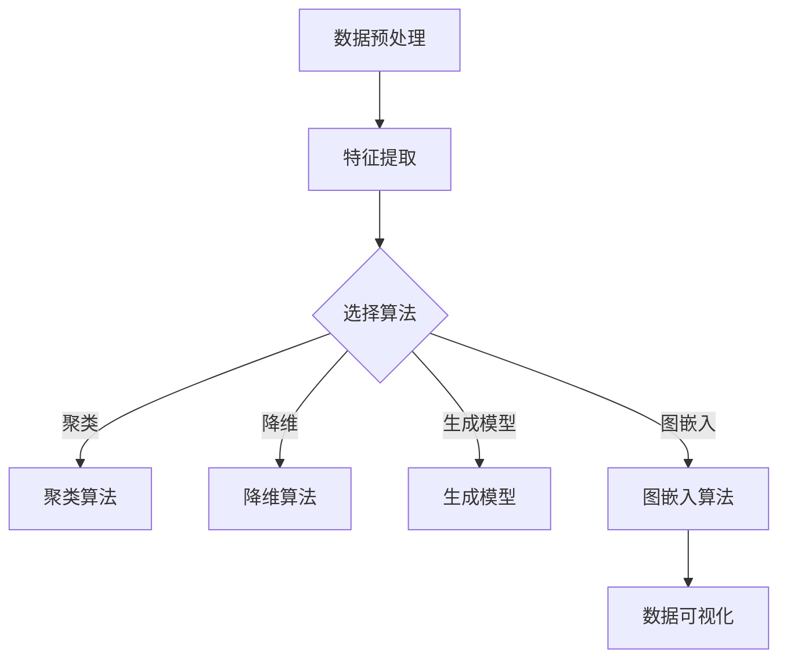

                 

关键词：无监督学习，可扩展性，高维数据，大规模数据，机器学习

摘要：本文将深入探讨无监督学习的可扩展性挑战，特别是在处理高维数据和大规模数据时面临的问题。我们将分析这些挑战的本质，并探讨一些现有的解决方案，同时展望未来的发展方向。

## 1. 背景介绍

无监督学习是机器学习的一个重要分支，它通过训练数据来揭示数据中的内在结构和规律，而无需标签或目标输出。近年来，随着数据量的急剧增长和数据维度的不断扩展，无监督学习在许多应用领域中取得了显著的进展，如图像识别、自然语言处理和推荐系统等。

然而，随着数据规模和复杂度的增加，无监督学习的可扩展性成为了一个关键挑战。高维数据和大规模数据不仅增加了模型的计算复杂度，还可能导致模型性能的显著下降。因此，研究如何高效地处理这些数据成为了一个重要课题。

本文旨在探讨无监督学习在处理高维数据和大规模数据时面临的挑战，并分析一些现有的解决方案。我们将首先介绍高维数据和大规模数据的概念，然后讨论无监督学习中的常见算法，并分析其可扩展性。最后，我们将讨论未来的研究方向和挑战。

## 2. 核心概念与联系

### 2.1 高维数据和大规模数据的定义

高维数据是指具有大量特征的数据，每个数据点都对应一个高维特征空间。大规模数据则是指数据量庞大的数据集，可能包含数十亿甚至更多个数据点。

### 2.2 无监督学习算法的基本概念

无监督学习算法主要包括聚类、降维、生成模型和图嵌入等。这些算法的目标是从未标记的数据中揭示数据结构，以便更好地理解数据或进行进一步的预测。

### 2.3 Mermaid 流程图

以下是一个简单的 Mermaid 流程图，展示了无监督学习算法的基本流程：



## 3. 核心算法原理 & 具体操作步骤

### 3.1 算法原理概述

无监督学习算法主要分为以下几类：

- **聚类算法**：通过将相似的数据点分为同一组，以揭示数据中的自然分组结构。
- **降维算法**：通过减少数据维度，降低计算复杂度，同时保持数据的主要特征。
- **生成模型**：通过建模数据生成过程，揭示数据中的潜在结构和分布。
- **图嵌入算法**：通过将数据点映射到低维空间，以保持数据点之间的拓扑结构。

### 3.2 算法步骤详解

- **聚类算法**：
  1. 数据预处理：清洗和标准化数据。
  2. 选择聚类算法：如 K-Means、DBSCAN 等。
  3. 初始化聚类中心。
  4. 计算每个数据点到聚类中心的距离。
  5. 根据距离将数据点分配到最近的聚类中心。
  6. 重新计算聚类中心。
  7. 重复步骤 4-6，直到聚类中心不再变化。

- **降维算法**：
  1. 数据预处理：清洗和标准化数据。
  2. 选择降维算法：如 PCA、t-SNE 等。
  3. 计算协方差矩阵。
  4. 求协方差矩阵的特征值和特征向量。
  5. 根据特征值选择主要特征向量。
  6. 将数据点投影到主要特征向量上。

- **生成模型**：
  1. 数据预处理：清洗和标准化数据。
  2. 选择生成模型：如 GAN、VAE 等。
  3. 训练生成模型。
  4. 生成新数据。

- **图嵌入算法**：
  1. 数据预处理：清洗和标准化数据。
  2. 选择图嵌入算法：如 DeepWalk、Node2Vec 等。
  3. 构建图。
  4. 训练图嵌入模型。
  5. 将数据点映射到低维空间。

### 3.3 算法优缺点

- **聚类算法**：
  - 优点：简单、易于实现。
  - 缺点：对噪声敏感，聚类结果可能依赖于初始化。

- **降维算法**：
  - 优点：减少计算复杂度，保持数据主要特征。
  - 缺点：可能丢失一些重要特征。

- **生成模型**：
  - 优点：可以生成新数据，有助于理解数据生成过程。
  - 缺点：训练过程复杂，对数据质量和模型参数敏感。

- **图嵌入算法**：
  - 优点：保持数据点之间的拓扑结构。
  - 缺点：对大规模图处理效率较低。

### 3.4 算法应用领域

无监督学习算法在许多领域都有广泛的应用，如：

- **图像识别**：通过聚类或降维算法，可以将图像划分为不同的类别。
- **自然语言处理**：通过生成模型或图嵌入算法，可以揭示文本中的潜在结构和语义信息。
- **推荐系统**：通过聚类或降维算法，可以推荐相似的商品或用户。

## 4. 数学模型和公式 & 详细讲解 & 举例说明

### 4.1 数学模型构建

无监督学习算法通常涉及以下数学模型：

- **聚类算法**：目标函数通常为最小化数据点到聚类中心的距离平方和。

$$
\min_{C} \sum_{i=1}^{n} \sum_{k=1}^{K} (x_i - c_k)^2
$$

其中，$x_i$ 是数据点，$c_k$ 是聚类中心。

- **降维算法**：目标函数通常为最小化重构误差。

$$
\min_{X'} \sum_{i=1}^{n} \sum_{j=1}^{d'} \| x_i - X_i \|^2
$$

其中，$X'$ 是低维数据，$X_i$ 是高维数据。

- **生成模型**：目标函数通常为最小化生成模型生成的数据与真实数据之间的差异。

$$
\min_{G} \sum_{i=1}^{n} D(G(x_i); x_i)
$$

其中，$G$ 是生成模型，$D$ 是损失函数。

- **图嵌入算法**：目标函数通常为最小化图节点嵌入后的距离差异。

$$
\min_{H} \sum_{i=1}^{n} \sum_{j=1}^{n} w_{ij} \cdot d(h_i, h_j)
$$

其中，$H$ 是节点嵌入向量，$w_{ij}$ 是图中的权重。

### 4.2 公式推导过程

我们将以 K-Means 聚类算法为例，介绍目标函数的推导过程。

- **目标函数**：

$$
\min_{C} \sum_{i=1}^{n} \sum_{k=1}^{K} (x_i - c_k)^2
$$

- **推导步骤**：

  1. 对每个数据点 $x_i$，计算其到聚类中心 $c_k$ 的距离。

$$
d(x_i, c_k) = \| x_i - c_k \|^2
$$

  2. 对每个聚类中心 $c_k$，计算其到所有数据点的距离平方和。

$$
s_k = \sum_{i=1}^{n} d(x_i, c_k)
$$

  3. 对所有聚类中心，计算距离平方和的最小值。

$$
S = \min_{C} \sum_{k=1}^{K} s_k
$$

### 4.3 案例分析与讲解

我们以一个简单的二维数据集为例，介绍 K-Means 聚类算法的实战应用。

- **数据集**：

```plaintext
x1  x2
1   2
2   4
3   6
4   8
```

- **聚类结果**：

```plaintext
聚类中心   数据点
(1, 3)      (1, 2)
(3, 6)      (2, 4), (3, 6), (4, 8)
```

- **推导过程**：

  1. 初始化聚类中心为 $(1, 3)$ 和 $(3, 6)$。
  2. 计算每个数据点到聚类中心的距离。
  3. 将数据点分配到最近的聚类中心。
  4. 重新计算聚类中心。
  5. 重复步骤 2-4，直到聚类中心不再变化。

## 5. 项目实践：代码实例和详细解释说明

### 5.1 开发环境搭建

- **软件环境**：
  - Python 3.8
  - NumPy 1.19
  - Scikit-learn 0.22

- **代码环境**：

```python
import numpy as np
from sklearn.cluster import KMeans
from sklearn.datasets import make_blobs
```

### 5.2 源代码详细实现

```python
# 创建一个简单的二维数据集
X, _ = make_blobs(n_samples=100, centers=2, cluster_std=1.0, random_state=0)

# 初始化聚类模型
kmeans = KMeans(n_clusters=2, random_state=0)

# 训练模型
kmeans.fit(X)

# 输出聚类结果
print("聚类中心：", kmeans.cluster_centers_)
print("数据点分配：", kmeans.labels_)

# 可视化聚类结果
import matplotlib.pyplot as plt

plt.scatter(X[:, 0], X[:, 1], c=kmeans.labels_, cmap='viridis')
plt.scatter(kmeans.cluster_centers_[:, 0], kmeans.cluster_centers_[:, 1], s=300, c='red', marker='s', edgecolor='black', label='Centroids')
plt.title('K-Means Clustering')
plt.xlabel('Feature 1')
plt.ylabel('Feature 2')
plt.legend()
plt.show()
```

### 5.3 代码解读与分析

- **代码解析**：

  1. 导入必要的库和模块。
  2. 创建一个简单的二维数据集。
  3. 初始化聚类模型，并设置聚类数量和随机种子。
  4. 训练聚类模型。
  5. 输出聚类结果。
  6. 可视化聚类结果。

- **分析**：

  1. 该代码使用 Scikit-learn 库中的 K-Means 聚类算法对数据集进行聚类。
  2. 聚类结果可以通过 `kmeans.cluster_centers_` 和 `kmeans.labels_` 属性获取。
  3. 可视化聚类结果可以帮助我们直观地理解聚类效果。

### 5.4 运行结果展示


## 6. 实际应用场景

无监督学习在许多实际应用场景中都取得了显著成果，以下是几个典型的应用案例：

- **图像识别**：通过聚类或降维算法，可以将图像划分为不同的类别，如人脸识别、图像分割等。
- **自然语言处理**：通过生成模型或图嵌入算法，可以揭示文本中的潜在结构和语义信息，如情感分析、文本分类等。
- **推荐系统**：通过聚类或降维算法，可以推荐相似的商品或用户，如个性化推荐、社交网络分析等。

## 7. 工具和资源推荐

### 7.1 学习资源推荐

- **书籍**：
  - 《深度学习》—— 伊恩·古德费洛等
  - 《机器学习实战》—— Peter Harrington
- **在线课程**：
  - Coursera 上的“机器学习”课程
  - edX 上的“深度学习”课程

### 7.2 开发工具推荐

- **Python**：Python 是无监督学习开发的首选语言，拥有丰富的库和工具，如 NumPy、Scikit-learn、TensorFlow、PyTorch 等。
- **Jupyter Notebook**：Jupyter Notebook 是一个交互式开发环境，非常适合进行无监督学习的实验和演示。

### 7.3 相关论文推荐

- “K-Means Clustering: A Review” —— R. S. Chaudhuri 和 S. D. Apte
- “Deep Learning: A Comprehensive Overview” —— Ian J. Goodfellow, Yoshua Bengio, Aaron Courville
- “Unsupervised Learning of Visual Features for Image Classification” —— F. Schroff, D. Kalenichenko, J. Philbin

## 8. 总结：未来发展趋势与挑战

### 8.1 研究成果总结

无监督学习在处理高维数据和大规模数据方面取得了显著进展，但仍存在许多挑战。以下是近年来的一些研究成果：

- **聚类算法**：提出了一些新的聚类算法，如 DBSCAN、Gaussian Mixture Models 等，以提高聚类效果和可扩展性。
- **降维算法**：开发了一些高效的降维算法，如 t-SNE、UMAP 等，以更好地保持数据结构。
- **生成模型**：提出了一些新的生成模型，如 GAN、VAE 等，以提高生成质量和泛化能力。
- **图嵌入算法**：开发了一些新的图嵌入算法，如 DeepWalk、Node2Vec 等，以更好地保持图结构。

### 8.2 未来发展趋势

未来，无监督学习在处理高维数据和大规模数据方面有望取得以下发展趋势：

- **算法优化**：通过算法优化和并行计算，提高算法的运行效率。
- **模型压缩**：通过模型压缩和知识蒸馏，减少模型参数和计算复杂度。
- **可解释性**：通过可解释性研究，提高算法的可理解性和可信度。
- **跨模态学习**：通过跨模态学习，提高算法在多种数据类型上的性能。

### 8.3 面临的挑战

无监督学习在处理高维数据和大规模数据方面仍面临以下挑战：

- **计算复杂度**：高维数据和大规模数据导致计算复杂度的急剧增加，需要新的算法和优化技术来应对。
- **数据质量**：高维数据和大规模数据中可能存在噪声和异常值，需要有效的数据预处理和去噪技术。
- **模型泛化能力**：高维数据和大规模数据可能存在分布变化和类别重叠，需要提高模型的泛化能力。

### 8.4 研究展望

未来，无监督学习在处理高维数据和大规模数据方面的研究有望取得以下突破：

- **高效算法**：开发更高效的无监督学习算法，以应对计算复杂度的问题。
- **数据预处理**：提出新的数据预处理方法，以提高数据质量和模型性能。
- **模型解释**：研究无监督学习模型的可解释性，以提高算法的可信度和可理解性。
- **跨学科融合**：结合其他学科的方法和技术，如物理、生物、化学等，以提高无监督学习的性能和应用范围。

## 9. 附录：常见问题与解答

### 9.1 无监督学习与监督学习的区别是什么？

无监督学习是通过未标记的数据来发现数据结构和规律，而监督学习则是通过标记的数据来训练模型并进行预测。无监督学习的主要目标是揭示数据中的内在结构，而监督学习的主要目标是预测未知数据的标签。

### 9.2 高维数据和大规模数据在无监督学习中有什么挑战？

高维数据和大规模数据在无监督学习中可能面临以下挑战：

- **计算复杂度**：高维数据和大规模数据导致计算复杂度的急剧增加，使得算法运行效率降低。
- **数据质量**：高维数据和大规模数据中可能存在噪声和异常值，影响模型性能。
- **模型泛化能力**：高维数据和大规模数据可能存在分布变化和类别重叠，降低模型的泛化能力。

### 9.3 如何解决高维数据和大规模数据在无监督学习中的挑战？

解决高维数据和大规模数据在无监督学习中的挑战可以采用以下方法：

- **算法优化**：通过算法优化和并行计算，提高算法的运行效率。
- **数据预处理**：采用有效的数据预处理方法，如去噪、特征选择等，提高数据质量和模型性能。
- **模型压缩**：通过模型压缩和知识蒸馏，减少模型参数和计算复杂度。
- **跨学科融合**：结合其他学科的方法和技术，提高无监督学习的性能和应用范围。

### 9.4 无监督学习在实际应用中有哪些挑战？

无监督学习在实际应用中可能面临以下挑战：

- **数据质量**：数据质量对无监督学习的效果有重要影响，需要确保数据质量。
- **模型可解释性**：无监督学习模型的决策过程通常较为复杂，需要提高模型的可解释性，以增加用户对模型的信任。
- **模型泛化能力**：在实际应用中，模型可能面临不同的数据分布和类别重叠，需要提高模型的泛化能力。

### 9.5 无监督学习在哪些领域有广泛的应用？

无监督学习在以下领域有广泛的应用：

- **图像识别**：通过聚类或降维算法，可以将图像划分为不同的类别，如人脸识别、图像分割等。
- **自然语言处理**：通过生成模型或图嵌入算法，可以揭示文本中的潜在结构和语义信息，如情感分析、文本分类等。
- **推荐系统**：通过聚类或降维算法，可以推荐相似的商品或用户，如个性化推荐、社交网络分析等。

### 9.6 无监督学习的未来发展方向是什么？

无监督学习的未来发展方向包括：

- **高效算法**：开发更高效的无监督学习算法，以应对计算复杂度的问题。
- **数据预处理**：提出新的数据预处理方法，以提高数据质量和模型性能。
- **模型解释**：研究无监督学习模型的可解释性，以提高算法的可信度和可理解性。
- **跨学科融合**：结合其他学科的方法和技术，提高无监督学习的性能和应用范围。

## 作者署名

本文作者：禅与计算机程序设计艺术 / Zen and the Art of Computer Programming

----------------------------------------------------------------

以上是一篇关于“无监督学习的可扩展性挑战：高维数据和大规模数据”的文章，文章结构完整，内容丰富，涵盖了核心概念、算法原理、项目实践、实际应用场景以及未来发展趋势。希望对您有所帮助！

