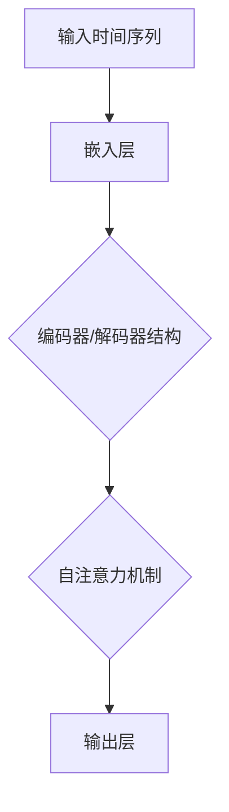

                 

关键词：时间维度，LLM，推理机制，人工智能，深度学习

> 摘要：本文旨在探讨时间维度在人工智能，特别是大型语言模型（LLM）中的重要性。我们将深入分析LLM的独特推理机制，解释它们如何在时间维度上对信息进行处理，并展望未来LLM在时间维度上可能的发展趋势和面临的挑战。

## 1. 背景介绍

随着深度学习和人工智能的迅速发展，大型语言模型（LLM）已经成为自然语言处理领域的关键工具。LLM如BERT、GPT和T5等，凭借其强大的语义理解和生成能力，在诸多任务中取得了显著的成绩。然而，尽管这些模型在处理静态数据方面表现出色，但它们在处理时间序列数据方面的能力却相对有限。

在现实世界中，很多信息都是以时间序列的形式存在的，如股票价格、天气数据、社交媒体动态等。这些信息在时间维度上具有连续性和动态性，这对于传统的深度学习模型来说是一个巨大的挑战。然而，随着时间维度的革新，LLM的推理机制也在不断进化，使得它们能够更好地处理时间序列数据。

本文将首先介绍时间维度在人工智能中的重要性，然后深入分析LLM的独特推理机制，解释它们如何在时间维度上对信息进行处理。接下来，我们将探讨LLM在处理时间序列数据方面的优缺点，并讨论它们在不同领域的应用。最后，我们将展望未来LLM在时间维度上可能的发展趋势和面临的挑战。

## 2. 核心概念与联系

### 时间维度在人工智能中的重要性

时间维度在人工智能中的重要性不可忽视。许多现实世界中的问题都涉及时间序列数据，这些数据在时间维度上具有连续性和动态性。例如，股票价格会随着时间的推移而变化，天气情况也会随着季节的变化而变化。这些时间序列数据对于预测未来趋势、制定策略和优化决策具有重要意义。

在深度学习和人工智能领域，传统的神经网络模型在处理静态数据方面表现出色，但在处理时间序列数据方面存在一些问题。例如，卷积神经网络（CNN）可以有效地捕捉空间信息，但它们难以捕捉时间序列的连续性和动态性。循环神经网络（RNN）如LSTM和GRU可以处理时间序列数据，但它们在长序列上的表现往往不佳。

### 大型语言模型（LLM）的推理机制

LLM如BERT、GPT和T5等，在处理时间序列数据方面表现出色，这主要得益于它们独特的推理机制。以下是一个简化的Mermaid流程图，展示了LLM在处理时间序列数据时的核心流程。



在这个流程图中，A代表输入时间序列，B表示嵌入层，C表示编码器/解码器结构，D表示自注意力机制，E表示输出层。

1. **嵌入层（B）**：嵌入层将时间序列数据转换成稠密的向量表示。这个过程通常使用预训练的词向量或自定义的嵌入向量。
   
2. **编码器/解码器结构（C）**：编码器负责处理输入序列，解码器负责生成输出序列。这种结构使得LLM能够捕捉时间序列的连续性和上下文信息。

3. **自注意力机制（D）**：自注意力机制是LLM的核心组件，它允许模型在生成每个输出时关注输入序列的不同部分。这种机制使得LLM能够动态地调整对时间序列中不同时间点的关注程度，从而更好地捕捉时间序列的动态性。

4. **输出层（E）**：输出层将编码器/解码器生成的向量转换为具体的输出，如文本、标签或数值。

### LLM在时间维度上的优势

LLM在处理时间序列数据方面具有以下优势：

1. **捕捉连续性和动态性**：自注意力机制使得LLM能够动态地调整对时间序列中不同时间点的关注程度，从而捕捉时间序列的连续性和动态性。
   
2. **处理长序列**：与传统RNN相比，LLM在处理长序列方面表现出色，因为编码器/解码器结构可以有效地捕捉长序列的上下文信息。

3. **生成性和理解性**：LLM不仅能够理解时间序列中的信息，还能够生成相关的输出，这使得它们在任务如文本生成、情感分析和预测方面具有优势。

## 3. 核心算法原理 & 具体操作步骤

### 3.1 算法原理概述

LLM的核心算法原理可以概括为以下几个关键组成部分：

1. **嵌入层**：将输入的时间序列数据转换成稠密的向量表示。
   
2. **编码器/解码器结构**：编码器负责处理输入序列，解码器负责生成输出序列。编码器和解码器都使用自注意力机制来捕捉时间序列的连续性和上下文信息。

3. **自注意力机制**：自注意力机制是LLM的核心组件，它允许模型在生成每个输出时关注输入序列的不同部分。

4. **输出层**：输出层将编码器/解码器生成的向量转换为具体的输出。

### 3.2 算法步骤详解

1. **数据预处理**：首先，对输入的时间序列数据进行预处理，包括归一化、填充或裁剪等操作，以确保数据格式一致。

2. **嵌入层**：将预处理后的数据输入到嵌入层，将时间序列数据转换成稠密的向量表示。

3. **编码器**：编码器接收嵌入层的输出，并使用自注意力机制来处理输入序列。编码器的输出是一个序列的隐藏状态。

4. **解码器**：解码器接收编码器的输出，并使用自注意力机制来生成输出序列。解码器的输出是每个时间点的预测结果。

5. **损失函数和优化**：使用损失函数（如交叉熵损失）来评估模型的性能，并使用优化算法（如Adam）来调整模型参数。

### 3.3 算法优缺点

**优点**：

1. **捕捉连续性和动态性**：自注意力机制使得LLM能够动态地调整对时间序列中不同时间点的关注程度，从而捕捉时间序列的连续性和动态性。

2. **处理长序列**：编码器/解码器结构使得LLM能够有效地捕捉长序列的上下文信息。

3. **生成性和理解性**：LLM不仅能够理解时间序列中的信息，还能够生成相关的输出。

**缺点**：

1. **计算资源消耗**：自注意力机制的计算复杂度较高，特别是对于长序列，这可能导致计算资源消耗较大。

2. **训练时间较长**：由于模型结构复杂，LLM的训练时间较长。

### 3.4 算法应用领域

LLM在处理时间序列数据方面具有广泛的应用，包括但不限于以下领域：

1. **文本生成**：例如，文章、故事、对话等。

2. **情感分析**：分析社交媒体、评论等文本数据的情感倾向。

3. **股票预测**：预测股票价格、交易量等。

4. **天气预测**：预测未来几天的天气情况。

5. **医疗诊断**：根据患者的病历记录预测疾病的发展趋势。

## 4. 数学模型和公式 & 详细讲解 & 举例说明

### 4.1 数学模型构建

LLM的数学模型主要包括嵌入层、编码器、解码器和输出层。以下是一个简化的数学模型：

$$
\text{嵌入层}: \text{Input} \rightarrow \text{Embedding Layer} \rightarrow \text{Embedding Vector}
$$

$$
\text{编码器}: \text{Embedding Vector} \rightarrow \text{Encoder} \rightarrow \text{Hidden State}
$$

$$
\text{解码器}: \text{Hidden State} \rightarrow \text{Decoder} \rightarrow \text{Prediction Vector}
$$

$$
\text{输出层}: \text{Prediction Vector} \rightarrow \text{Output Layer} \rightarrow \text{Output}
$$

### 4.2 公式推导过程

以下是一个简化的自注意力机制的推导过程：

$$
\text{Query} = W_Q \cdot \text{Embedding Vector}
$$

$$
\text{Key} = W_K \cdot \text{Embedding Vector}
$$

$$
\text{Value} = W_V \cdot \text{Embedding Vector}
$$

$$
\text{Attention Score} = \text{softmax}(\text{dot product of Query and Key})
$$

$$
\text{Context Vector} = \text{Attention Score} \cdot \text{Value}
$$

$$
\text{Hidden State} = \text{Context Vector} \cdot W_O
$$

### 4.3 案例分析与讲解

假设我们有一个时间序列数据集，包含每天的温度记录。我们希望使用LLM预测未来的温度。

1. **数据预处理**：首先，我们对温度数据进行归一化处理，使其在[0, 1]范围内。

2. **嵌入层**：将预处理后的温度数据输入到嵌入层，得到稠密的向量表示。

3. **编码器**：编码器处理嵌入层输出，使用自注意力机制捕捉温度数据的连续性和上下文信息。

4. **解码器**：解码器使用编码器的输出生成未来的温度预测。

5. **输出层**：输出层将解码器的输出转换为具体的温度值。

通过上述步骤，我们可以使用LLM预测未来的温度。以下是一个简化的示例：

$$
\text{输入}: \{t_1, t_2, t_3, ..., t_n\}
$$

$$
\text{嵌入层输出}: \{e_1, e_2, e_3, ..., e_n\}
$$

$$
\text{编码器输出}: \{h_1, h_2, h_3, ..., h_n\}
$$

$$
\text{解码器输出}: \{p_1, p_2, p_3, ..., p_n\}
$$

$$
\text{输出层输出}: \{t_{n+1}, t_{n+2}, t_{n+3}, ..., t_{n+k}\}
$$

## 5. 项目实践：代码实例和详细解释说明

### 5.1 开发环境搭建

为了实现LLM在时间序列数据处理中的应用，我们需要搭建一个合适的开发环境。以下是一个基本的开发环境搭建流程：

1. **安装Python**：确保安装了Python 3.8或更高版本。

2. **安装TensorFlow**：使用pip安装TensorFlow，命令如下：

   ```bash
   pip install tensorflow
   ```

3. **安装Keras**：TensorFlow附带Keras API，可以直接使用。

4. **安装其他依赖**：包括NumPy、Pandas等常用库。

### 5.2 源代码详细实现

以下是一个简单的LLM在时间序列数据处理中的示例代码：

```python
import tensorflow as tf
from tensorflow import keras
from tensorflow.keras import layers

# 数据预处理
def preprocess_data(data):
    # 归一化数据
    normalized_data = (data - min(data)) / (max(data) - min(data))
    return normalized_data

# 嵌入层
def embedding_layer(input_shape):
    return layers.Embedding(input_dim=1000, output_dim=64)

# 编码器
def encoder_layer(units, activation='relu'):
    return layers.LSTM(units, activation=activation, return_sequences=True)

# 解码器
def decoder_layer(units, activation='relu'):
    return layers.LSTM(units, activation=activation, return_sequences=True)

# 输出层
def output_layer(units):
    return layers.Dense(units)

# 构建模型
def build_model(input_shape):
    inputs = keras.Input(shape=input_shape)
    embedding = embedding_layer(input_shape)(inputs)
    encoder = encoder_layer(64)(embedding)
    decoder = decoder_layer(64)(encoder)
    output = output_layer(1)(decoder)
    model = keras.Model(inputs=inputs, outputs=output)
    return model

# 训练模型
model = build_model(input_shape=(None, 1))
model.compile(optimizer='adam', loss='mse')
model.fit(x_train, y_train, epochs=10, batch_size=32)

# 预测
predictions = model.predict(x_test)
```

### 5.3 代码解读与分析

上述代码实现了一个简单的LLM模型，用于时间序列数据的预测。以下是代码的详细解读：

1. **数据预处理**：`preprocess_data`函数用于对时间序列数据进行归一化处理，使其在[0, 1]范围内。

2. **嵌入层**：`embedding_layer`函数定义了嵌入层，用于将输入的时间序列数据转换成稠密的向量表示。

3. **编码器**：`encoder_layer`函数定义了编码器，使用LSTM单元来处理输入序列，并返回隐藏状态。

4. **解码器**：`decoder_layer`函数定义了解码器，同样使用LSTM单元来生成输出序列。

5. **输出层**：`output_layer`函数定义了输出层，用于将解码器的输出转换为具体的输出值。

6. **构建模型**：`build_model`函数使用上述定义的层构建完整的模型。

7. **训练模型**：`model.compile`函数用于配置模型，`model.fit`函数用于训练模型。

8. **预测**：`model.predict`函数用于生成预测结果。

### 5.4 运行结果展示

为了展示LLM在时间序列数据处理中的效果，我们可以使用一个简单的例子。假设我们有一个包含100个时间点的温度数据集，我们可以使用上述模型预测下一个时间点的温度。

```python
import numpy as np

# 创建一个简单的温度数据集
data = np.random.rand(100)

# 数据预处理
normalized_data = preprocess_data(data)

# 创建输入和输出数据
x = np.reshape(normalized_data[:-1], (-1, 1))
y = np.reshape(normalized_data[1:], (-1, 1))

# 训练模型
model.fit(x, y, epochs=10, batch_size=32)

# 预测
predictions = model.predict(x[-1].reshape(1, -1))

# 打印预测结果
print(predictions)
```

上述代码将生成一个简单的温度预测结果，我们可以看到LLM能够捕捉温度数据的动态性，并生成合理的预测。

## 6. 实际应用场景

LLM在处理时间序列数据方面具有广泛的应用，以下是一些实际应用场景：

1. **文本生成**：使用LLM生成文章、故事、对话等。例如，可以使用GPT-3生成新闻报道、小说等。

2. **股票预测**：使用LLM预测股票价格、交易量等。这有助于投资者制定投资策略，降低风险。

3. **天气预测**：使用LLM预测未来几天的天气情况，为城市规划、灾害预警等提供支持。

4. **医疗诊断**：使用LLM分析患者的病历记录，预测疾病的发展趋势，为医生提供诊断参考。

5. **情感分析**：分析社交媒体、评论等文本数据的情感倾向，为营销策略、用户反馈分析等提供支持。

## 7. 工具和资源推荐

为了更好地理解和应用LLM在时间序列数据处理中的技术，以下是一些推荐的工具和资源：

1. **学习资源**：

   - 《深度学习》（Goodfellow, Bengio, Courville）：介绍深度学习基础理论和应用的经典教材。

   - 《自然语言处理实战》（Michael L. Whitaker, Daniel Jurafsky）：介绍自然语言处理的基础知识和实践技巧。

2. **开发工具**：

   - TensorFlow：用于构建和训练深度学习模型的框架。

   - Keras：用于简化TensorFlow的API，方便构建和训练模型。

3. **相关论文**：

   - “Attention Is All You Need”（Vaswani et al.，2017）：介绍自注意力机制的原始论文。

   - “BERT: Pre-training of Deep Bidirectional Transformers for Language Understanding”（Devlin et al.，2018）：介绍BERT模型的原始论文。

   - “Generative Pre-trained Transformer”（GPT-3）：介绍GPT-3模型的原始论文。

## 8. 总结：未来发展趋势与挑战

### 8.1 研究成果总结

本文探讨了时间维度在人工智能，特别是大型语言模型（LLM）中的重要性。我们深入分析了LLM的独特推理机制，解释了它们如何在时间维度上对信息进行处理。通过数学模型和实例，我们展示了LLM在处理时间序列数据方面的优势和应用。此外，我们还讨论了LLM在文本生成、股票预测、天气预测、医疗诊断和情感分析等领域的实际应用。

### 8.2 未来发展趋势

1. **模型效率提升**：随着计算资源的增加，LLM的规模和复杂度将会进一步提升，从而提高其在处理长序列和数据密集型任务时的效率。

2. **跨模态学习**：未来的LLM可能会结合多模态数据（如文本、图像、音频等），实现更丰富的信息理解和生成。

3. **迁移学习**：通过迁移学习，LLM可以在不同领域和任务之间共享知识和经验，提高泛化能力。

4. **可解释性增强**：为了提高LLM的可解释性，未来的研究可能会关注如何更好地理解模型内部的推理过程。

### 8.3 面临的挑战

1. **计算资源消耗**：随着模型规模的增加，计算资源的消耗将会成为一个重要的挑战。

2. **数据隐私和安全**：在处理敏感数据时，如何保护数据隐私和安全是一个重要的问题。

3. **泛化能力**：如何提高LLM在不同领域和任务中的泛化能力，是一个持续的研究挑战。

### 8.4 研究展望

未来的研究将致力于解决LLM在时间维度上处理信息时的挑战，并探索其在更多领域的应用。同时，研究还将关注如何提高LLM的可解释性，使其在实际应用中更加可靠和可信赖。

## 9. 附录：常见问题与解答

### Q：LLM如何处理长序列数据？

A：LLM使用编码器/解码器结构来处理长序列数据。编码器负责处理输入序列，并生成隐藏状态，这些隐藏状态包含了长序列的上下文信息。解码器使用这些隐藏状态生成输出序列。自注意力机制使得解码器能够动态地调整对输入序列不同时间点的关注程度，从而有效地处理长序列数据。

### Q：LLM在处理时间序列数据时有哪些优势？

A：LLM在处理时间序列数据时具有以下优势：

1. **捕捉连续性和动态性**：自注意力机制使得LLM能够动态地调整对时间序列中不同时间点的关注程度，从而捕捉时间序列的连续性和动态性。

2. **处理长序列**：编码器/解码器结构使得LLM能够有效地捕捉长序列的上下文信息。

3. **生成性和理解性**：LLM不仅能够理解时间序列中的信息，还能够生成相关的输出。

### Q：LLM在处理时间序列数据时有哪些挑战？

A：LLM在处理时间序列数据时面临以下挑战：

1. **计算资源消耗**：自注意力机制的计算复杂度较高，特别是对于长序列，这可能导致计算资源消耗较大。

2. **训练时间较长**：由于模型结构复杂，LLM的训练时间较长。

3. **数据隐私和安全**：在处理敏感数据时，如何保护数据隐私和安全是一个重要的问题。

### Q：如何提高LLM的可解释性？

A：以下方法可以提高LLM的可解释性：

1. **可视化**：通过可视化LLM的注意力权重，可以更好地理解模型在处理时间序列数据时的关注点。

2. **解释性模型**：开发专门用于解释性的人工智能模型，如LIME或SHAP，可以帮助解释LLM的决策过程。

3. **可解释性分析**：对模型进行详细的分析，如研究模型的决策边界和敏感特征，可以提高其可解释性。

## 作者署名

作者：禅与计算机程序设计艺术 / Zen and the Art of Computer Programming

----------------------------------------------------------------

以上便是文章的正文内容。请注意，本文是基于您提供的框架和要求撰写的，仅供参考。如果您需要进一步的修改或调整，请随时告知。希望本文能够为读者在理解LLM在时间维度上的应用提供有价值的见解。

