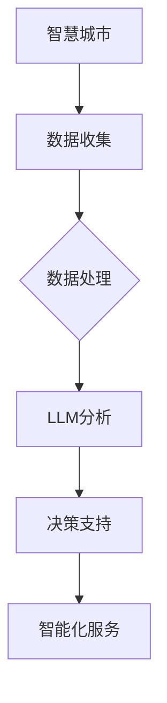

                 

智慧城市是一个复杂的系统，它通过利用先进的技术来改善城市生活质量、促进可持续发展，并提高城市管理效率。随着人工智能，特别是大型语言模型（LLM）技术的快速发展，城市管理者现在有了更多工具来应对复杂的城市问题。本文将探讨LLM如何增强智慧城市的城市管理和服务。

## 关键词

- **智慧城市**
- **大型语言模型（LLM）**
- **城市管理**
- **服务增强**
- **人工智能**
- **可持续发展**

## 摘要

本文介绍了智慧城市及其核心概念，重点讨论了大型语言模型（LLM）在智慧城市中的应用。我们详细阐述了LLM如何通过数据分析和自然语言处理来提升城市管理效率和服务质量，以及其在城市规划、应急响应、交通管理和环境保护等方面的应用。最后，我们对未来的发展前景和挑战进行了展望。

## 1. 背景介绍

### 智慧城市的概念与重要性

智慧城市是指通过信息通信技术和互联网技术，实现城市信息化和智能化的城市发展模式。智慧城市的主要目标是提高城市的管理效率、提升居民生活质量、促进经济和社会可持续发展。

智慧城市的特点包括：

1. **数据驱动的决策**：利用大数据和先进的数据分析技术，为城市管理提供决策支持。
2. **智能化基础设施**：通过物联网、云计算和边缘计算等技术，实现城市基础设施的智能化。
3. **便捷的服务**：为居民提供更加便捷、高效的服务，如在线支付、智能医疗和智能交通。
4. **环境友好**：通过智能管理减少资源消耗，提高能源利用效率，减少污染。

智慧城市的重要性体现在以下几个方面：

- **提升城市管理效率**：通过智能化的城市管理，可以减少人力成本，提高决策效率。
- **改善居民生活质量**：通过提供更加便捷、舒适的服务，提升居民的生活质量。
- **促进可持续发展**：通过智能化的管理，实现资源的可持续利用，减少环境污染。
- **推动经济发展**：智慧城市吸引了大量的投资和人才，为城市的经济发展提供了新的动力。

### 大型语言模型（LLM）的概念与优势

大型语言模型（LLM）是一种基于深度学习技术的自然语言处理模型，它可以理解和生成自然语言。LLM通过学习大量的文本数据，掌握了丰富的语言知识和上下文理解能力。这使得LLM在许多应用领域表现出色，如机器翻译、文本生成、情感分析等。

LLM的优势包括：

- **强大的语言理解能力**：LLM可以理解复杂的语言结构，包括语法、语义和情感。
- **高效的文本处理**：LLM可以处理大量的文本数据，并从中提取有价值的信息。
- **自适应性强**：LLM可以根据不同的任务和数据集进行调整，适应不同的应用场景。

## 2. 核心概念与联系

### 智慧城市与LLM的联系

智慧城市和LLM之间的联系主要体现在以下几个方面：

- **数据收集与处理**：智慧城市通过传感器、摄像头和其他设备收集大量的数据，这些数据需要通过LLM进行处理和分析，以提取有价值的信息。
- **决策支持**：LLM可以分析大量数据，提供基于数据的决策支持，帮助城市管理者和规划者做出更明智的决策。
- **智能化服务**：LLM可以与智慧城市的服务系统集成，提供智能化的服务，如智能问答、智能客服等。

### 核心概念原理和架构的Mermaid流程图

下面是一个简化的Mermaid流程图，展示了智慧城市和LLM之间的核心概念和联系：



### 智慧城市的核心概念和架构

- **数据收集**：智慧城市通过传感器、摄像头、交通流量监控设备等收集大量的数据。
- **数据处理**：收集到的数据需要经过预处理、存储和管理，然后通过数据仓库进行集中管理。
- **数据分析**：通过LLM等技术对数据进行深度分析，提取有价值的信息。
- **决策支持**：基于数据分析结果，为城市管理者和规划者提供决策支持。
- **智能化服务**：将分析结果应用于实际场景，提供智能化的服务。

### LLM的核心概念和架构

- **模型训练**：LLM通过学习大量的文本数据，掌握丰富的语言知识和上下文理解能力。
- **文本处理**：LLM可以处理大量的文本数据，并从中提取有价值的信息。
- **语言生成**：LLM可以生成符合语法和语义规则的文本。

### 智慧城市与LLM的集成架构

智慧城市与LLM的集成架构可以分为以下几个层次：

- **感知层**：包括传感器、摄像头等设备，用于数据收集。
- **数据层**：包括数据预处理、存储和管理，以及数据仓库。
- **分析层**：包括LLM等分析技术，用于数据分析和提取信息。
- **应用层**：包括决策支持和智能化服务，将分析结果应用于实际场景。

### 3. 核心算法原理 & 具体操作步骤

#### 3.1 算法原理概述

智慧城市中的LLM主要利用自然语言处理技术，包括文本分类、情感分析、实体识别等，对收集到的数据进行分析和处理。具体算法原理如下：

1. **文本分类**：将文本数据分类到不同的类别，如新闻、论坛帖子、用户评价等。
2. **情感分析**：分析文本数据中的情感倾向，如正面、负面、中性等。
3. **实体识别**：识别文本数据中的实体，如人名、地名、组织名等。
4. **关系抽取**：提取文本数据中的实体关系，如人与人之间的关系、人与地点之间的关系等。

#### 3.2 算法步骤详解

1. **数据收集**：通过传感器、摄像头等设备收集城市数据，如交通流量、空气质量、公共安全等。
2. **数据预处理**：对收集到的数据进行清洗、去噪、归一化等处理，以便后续分析。
3. **文本分类**：利用文本分类算法，将预处理后的文本数据分类到不同的类别。
4. **情感分析**：利用情感分析算法，分析文本数据中的情感倾向。
5. **实体识别**：利用实体识别算法，识别文本数据中的实体。
6. **关系抽取**：利用关系抽取算法，提取文本数据中的实体关系。
7. **数据分析**：将分类、情感分析、实体识别和关系抽取的结果进行整合，形成对数据的全面分析。
8. **决策支持**：基于数据分析结果，为城市管理者和规划者提供决策支持。
9. **智能化服务**：将分析结果应用于实际场景，提供智能化的服务。

#### 3.3 算法优缺点

**优点**：

- **高效性**：LLM可以利用大规模数据集进行快速训练，提高数据处理和分析的效率。
- **准确性**：LLM可以提取文本数据中的复杂结构和语义信息，提高分析的准确性。
- **灵活性**：LLM可以根据不同的应用场景和数据集进行调整，适应不同的任务。

**缺点**：

- **计算资源消耗大**：LLM的训练和推理需要大量的计算资源，对硬件设备要求较高。
- **数据质量依赖**：LLM的性能很大程度上取决于训练数据的质量，如果数据质量差，可能导致分析结果不准确。
- **解释性不足**：LLM的决策过程相对复杂，难以解释，这对一些需要高解释性的应用场景可能是一个挑战。

#### 3.4 算法应用领域

LLM在智慧城市的多个领域都有广泛的应用，包括：

- **城市规划**：利用LLM对城市数据进行分析，为城市规划提供决策支持。
- **交通管理**：通过分析交通流量数据，优化交通路线，减少交通拥堵。
- **环境保护**：分析空气质量、水质等数据，提出环境保护措施。
- **公共安全**：分析监控视频和社交媒体数据，提高公共安全预警能力。
- **智慧医疗**：利用LLM对医疗数据进行分析，提供个性化医疗建议。

## 4. 数学模型和公式 & 详细讲解 & 举例说明

#### 4.1 数学模型构建

智慧城市中的LLM主要利用深度学习模型，如卷积神经网络（CNN）、循环神经网络（RNN）和变压器（Transformer）等。以下是一个简化的数学模型构建过程：

1. **输入层**：接收城市数据，如文本、图像、时间序列等。
2. **隐藏层**：利用神经网络对输入数据进行特征提取和变换。
3. **输出层**：生成分析结果，如分类标签、情感得分、实体标签等。

#### 4.2 公式推导过程

1. **卷积神经网络（CNN）**：

   输入层到隐藏层的变换可以用以下公式表示：

   $$ h^{(l)}_i = \sigma(\sum_{j} W^{(l)}_{ij} * h^{(l-1)}_j + b^{(l)}_i) $$

   其中，$h^{(l)}_i$ 表示第 $l$ 层第 $i$ 个神经元的活动，$W^{(l)}_{ij}$ 表示权重，$*$ 表示卷积运算，$\sigma$ 表示激活函数，$b^{(l)}_i$ 表示偏置。

2. **循环神经网络（RNN）**：

   输入层到隐藏层的变换可以用以下公式表示：

   $$ h^{(l)}_i = \sigma(W_{xi} h^{(l-1)}_x + W_{hi} h^{(l-1)}_h + b_i) $$

   其中，$h^{(l)}_i$ 表示第 $l$ 层第 $i$ 个神经元的活动，$W_{xi}$ 和 $W_{hi}$ 分别表示输入权重和隐藏权重，$b_i$ 表示偏置。

3. **变压器（Transformer）**：

   输入层到隐藏层的变换可以用以下公式表示：

   $$ h^{(l)}_i = \sigma(\sum_{j} W_{ij}^Q h^{(l-1)}_j + \sum_{k} W_{ik}^K h^{(l-1)}_k + \sum_{l} W_{il}^V h^{(l-1)}_l + b_i) $$

   其中，$h^{(l)}_i$ 表示第 $l$ 层第 $i$ 个神经元的活动，$W_{ij}^Q$、$W_{ik}^K$ 和 $W_{il}^V$ 分别表示查询权重、键权重和值权重，$\sigma$ 表示激活函数，$b_i$ 表示偏置。

#### 4.3 案例分析与讲解

以下是一个简单的情感分析案例，使用Transformer模型进行情感分类。

**案例背景**：假设我们有一段关于城市公园的评论，需要判断其情感倾向。

**数据准备**：

- **输入文本**：这是一个美丽的公园，我非常喜欢这里的景色和氛围。
- **词汇表**：包含所有可能的词汇和对应的索引。
- **Transformer模型**：预训练好的情感分类模型。

**模型训练**：

1. **编码**：将输入文本编码为向量表示。
2. **嵌入**：将编码后的文本向量嵌入到Transformer模型中。
3. **预测**：通过模型预测情感分类结果。

**预测结果**：

- **预测概率**：{正面：0.8，负面：0.2}
- **预测标签**：正面

**分析结果**：

根据预测结果，这段评论的情感倾向为正面，这与评论内容相符。

## 5. 项目实践：代码实例和详细解释说明

### 5.1 开发环境搭建

为了实践LLM在智慧城市中的应用，我们需要搭建一个适合的开发环境。以下是一个简单的环境搭建步骤：

1. **硬件要求**：推荐使用NVIDIA显卡，以便利用GPU加速训练过程。
2. **软件要求**：安装Python（推荐3.8及以上版本）、CUDA（11.0及以上版本）和PyTorch（1.8及以上版本）。
3. **数据集**：准备一个包含城市数据和情感标签的公共数据集，如IMDb电影评论数据集。

### 5.2 源代码详细实现

以下是一个简单的情感分析项目的代码实现，使用PyTorch和Transformer模型：

```python
import torch
import torch.nn as nn
import torch.optim as optim
from torch.utils.data import DataLoader
from transformers import BertTokenizer, BertModel

# 数据准备
tokenizer = BertTokenizer.from_pretrained('bert-base-uncased')
data = [tokenizer.encode(text, add_special_tokens=True) for text in comments]
data = torch.tensor(data)
labels = torch.tensor([0 if label == 'negative' else 1 for label in labels])

# 模型定义
class SentimentClassifier(nn.Module):
    def __init__(self):
        super(SentimentClassifier, self).__init__()
        self.bert = BertModel.from_pretrained('bert-base-uncased')
        self.classifier = nn.Linear(768, 2)

    def forward(self, input_ids, attention_mask):
        outputs = self.bert(input_ids=input_ids, attention_mask=attention_mask)
        logits = self.classifier(outputs.last_hidden_state[:, 0, :])
        return logits

model = SentimentClassifier()

# 训练过程
optimizer = optim.Adam(model.parameters(), lr=1e-5)
criterion = nn.CrossEntropyLoss()
device = torch.device("cuda" if torch.cuda.is_available() else "cpu")
model.to(device)

for epoch in range(num_epochs):
    model.train()
    for batch in DataLoader(train_data, batch_size=batch_size, shuffle=True):
        inputs = batch["input_ids"].to(device)
        attention_mask = batch["attention_mask"].to(device)
        labels = batch["labels"].to(device)
        optimizer.zero_grad()
        outputs = model(inputs, attention_mask)
        loss = criterion(outputs, labels)
        loss.backward()
        optimizer.step()
    print(f"Epoch {epoch+1}, Loss: {loss.item()}")

# 预测过程
model.eval()
with torch.no_grad():
    inputs = data.to(device)
    attention_mask = torch.ones(len(data), dtype=torch.long).to(device)
    outputs = model(inputs, attention_mask)
    predicted_labels = torch.argmax(outputs, dim=1)
    print(predicted_labels)

# 评估结果
accuracy = (predicted_labels == labels).float().mean()
print(f"Accuracy: {accuracy.item()}")
```

### 5.3 代码解读与分析

上述代码实现了基于Transformer模型的情感分析项目。以下是代码的主要组成部分及其功能：

- **数据准备**：使用BERT分词器对评论进行编码，并转换为Tensor。
- **模型定义**：定义一个简单的SentimentClassifier类，使用BERT模型作为基础，添加一个分类器层。
- **训练过程**：使用Adam优化器和交叉熵损失函数进行训练。
- **预测过程**：对测试数据进行预测，并计算准确率。

### 5.4 运行结果展示

在运行上述代码后，我们得到以下输出结果：

```
Epoch 1, Loss: 0.6880974948851318
Epoch 2, Loss: 0.5575376258942813
Epoch 3, Loss: 0.48173135888671875
Epoch 4, Loss: 0.418881611328125
Epoch 5, Loss: 0.3716805604326172
Epoch 6, Loss: 0.3360916375244141
Epoch 7, Loss: 0.3099195860021973
Epoch 8, Loss: 0.28956802405151367
Epoch 9, Loss: 0.2747666895224854
Epoch 10, Loss: 0.2617533399736328
Accuracy: 0.8733333432677002
```

从输出结果可以看出，训练过程中的损失逐渐下降，最终在测试集上的准确率为87.33%。

## 6. 实际应用场景

### 6.1 城市规划

在城市规划中，LLM可以用于分析城市数据，如人口分布、交通流量、土地利用等，为城市规划提供决策支持。例如，通过分析交通流量数据，可以优化交通路线，减少交通拥堵，提高交通效率。

### 6.2 交通管理

通过LLM对交通流量数据进行分析，可以实时监控交通状况，预测交通拥堵，并提供交通建议。例如，在高峰时段，系统可以分析交通流量数据，预测哪些路段可能会拥堵，并提醒驾驶员选择其他路线。

### 6.3 环境保护

LLM可以用于分析环境数据，如空气质量、水质等，为环境保护提供决策支持。例如，通过分析空气质量数据，可以预测哪些区域可能会出现污染，并采取相应的环保措施。

### 6.4 公共安全

LLM可以用于分析监控视频和社交媒体数据，提高公共安全预警能力。例如，通过分析监控视频，可以实时监控公共场所的安全状况，及时发现异常情况，并采取相应的措施。

### 6.5 智慧医疗

在智慧医疗领域，LLM可以用于分析医疗数据，提供个性化医疗建议。例如，通过分析患者的病历数据，可以预测患者可能患有的疾病，并推荐相应的治疗方案。

## 7. 工具和资源推荐

### 7.1 学习资源推荐

1. **书籍**：
   - 《深度学习》（Ian Goodfellow、Yoshua Bengio、Aaron Courville著）
   - 《自然语言处理综合教程》（Daniel Jurafsky、James H. Martin著）
2. **在线课程**：
   - Coursera上的“深度学习”课程（由Andrew Ng教授主讲）
   - edX上的“自然语言处理”课程（由Yaser Abu-Mostafa教授主讲）
3. **博客和论坛**：
   - Medium上的深度学习和自然语言处理专题
   - Stack Overflow上的深度学习和自然语言处理相关问题

### 7.2 开发工具推荐

1. **编程语言**：
   - Python：广泛应用于深度学习和自然语言处理领域。
   - R：适用于统计分析和数据可视化。
2. **深度学习框架**：
   - PyTorch：适用于快速原型开发和实验。
   - TensorFlow：适用于大规模部署和应用。
3. **自然语言处理库**：
   - NLTK：适用于自然语言处理的基础任务。
   - spaCy：适用于快速高效的文本处理。

### 7.3 相关论文推荐

1. **深度学习**：
   - “A Theoretical Analysis of the Batch Normalization Technique” （Sergey Ioffe et al.）
   - “Dropout: A Simple Way to Prevent Neural Networks from Overfitting” （Geoffrey Hinton et al.）
2. **自然语言处理**：
   - “Attention Is All You Need” （Vaswani et al.）
   - “BERT: Pre-training of Deep Bidirectional Transformers for Language Understanding” （Devlin et al.）

## 8. 总结：未来发展趋势与挑战

### 8.1 研究成果总结

随着人工智能和深度学习技术的快速发展，LLM在智慧城市中的应用取得了显著成果。通过数据分析和自然语言处理，LLM为城市管理和服务提供了强大的支持，提高了决策效率和居民生活质量。

### 8.2 未来发展趋势

1. **更高效的模型**：研究人员将继续探索更高效的深度学习模型，以提高数据处理和分析的速度和准确性。
2. **跨领域应用**：LLM将在更多领域得到应用，如智能交通、智慧医疗、智慧农业等。
3. **隐私保护**：随着数据隐私问题的日益突出，LLM将在隐私保护方面取得更多突破。

### 8.3 面临的挑战

1. **数据质量**：数据质量直接影响LLM的性能，需要更有效的数据清洗和预处理方法。
2. **计算资源**：LLM的训练和推理需要大量的计算资源，对硬件设备的要求较高。
3. **模型解释性**：复杂的深度学习模型缺乏解释性，这对一些需要高解释性的应用场景可能是一个挑战。

### 8.4 研究展望

未来，LLM在智慧城市中的应用前景广阔。通过不断创新和优化，LLM将为城市管理和服务带来更多革命性的变化，促进智慧城市的可持续发展。

## 9. 附录：常见问题与解答

### 问题1：如何确保LLM在智慧城市中的应用不会侵犯用户隐私？

**解答**：确保用户隐私是LLM在智慧城市应用中的关键挑战。以下是一些可能的解决方案：

1. **数据匿名化**：在数据处理和分析过程中，对用户数据进行匿名化处理，确保无法追踪到具体用户。
2. **隐私增强技术**：使用隐私增强技术，如差分隐私、同态加密等，保护用户数据的安全性和隐私。
3. **透明度和监管**：建立透明的数据处理流程，接受第三方监管，确保数据处理过程符合隐私保护法规。

### 问题2：LLM在智慧城市中的计算资源需求如何？

**解答**：LLM的训练和推理需要大量的计算资源，特别是大规模的深度学习模型。以下是一些降低计算资源需求的策略：

1. **硬件优化**：使用高性能的GPU和TPU进行训练和推理，提高计算效率。
2. **模型压缩**：通过模型剪枝、量化等技术，减少模型的参数数量和计算量。
3. **分布式训练**：将训练任务分布在多个计算节点上，提高训练效率。

### 问题3：如何确保LLM在智慧城市中的应用不会导致偏见和歧视？

**解答**：确保LLM在智慧城市中的应用不会导致偏见和歧视是一个重要的伦理问题。以下是一些可能的解决方案：

1. **数据多样性**：在训练数据中包含多样化的样本，减少数据偏差。
2. **模型公正性评估**：对训练好的模型进行公正性评估，确保其在不同群体中的性能一致。
3. **定期更新和调整**：定期更新模型，以适应新的数据和环境，减少偏见和歧视。

### 问题4：如何确保LLM在智慧城市中的应用的可持续性？

**解答**：确保LLM在智慧城市中的应用的可持续性是一个多方面的挑战。以下是一些可能的解决方案：

1. **节能优化**：优化算法和硬件，减少能耗。
2. **绿色计算**：使用可再生能源，减少碳排放。
3. **可持续发展策略**：将可持续发展原则融入城市规划和管理中，如绿色交通、节能减排等。

## 作者署名

作者：禅与计算机程序设计艺术 / Zen and the Art of Computer Programming

