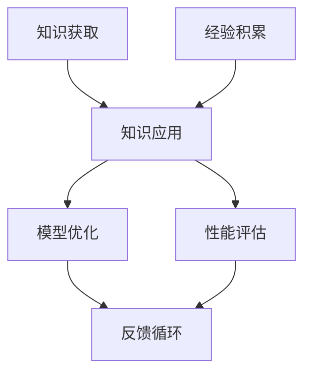

                 

关键词：人工智能，知识融合，经验学习，编程架构，技术博客

> 摘要：本文旨在探讨知识与经验在人工智能编程中的应用与融合，通过深入解析核心概念、算法原理、数学模型以及实际应用案例，揭示技术发展的内在规律，为读者提供全面的认知框架，助力人工智能领域的创新与发展。

## 1. 背景介绍

在当今快速发展的信息技术时代，人工智能（AI）已经成为驱动创新的重要引擎。随着大数据、云计算、物联网等技术的进步，AI的应用场景不断扩大，从简单的图像识别、语音识别到复杂的自然语言处理、自动驾驶等，无不彰显着AI的巨大潜力。然而，人工智能的实现并非一蹴而就，它需要大量的知识储备和丰富的经验积累。

知识的积累是人工智能发展的基石。从传统的规则系统到现代的深度学习，知识的获取和利用都是关键。而经验则是在知识的基础上，通过实践和反思所获得的宝贵财富。人工智能的进步离不开知识的系统化和经验的迭代更新。如何将知识与经验有效地融合，成为推动AI发展的关键问题。

本文将围绕这一主题，通过以下结构展开：

- **背景介绍**：阐述人工智能发展的现状与挑战。
- **核心概念与联系**：介绍核心概念，并使用Mermaid流程图展示架构。
- **核心算法原理 & 具体操作步骤**：详细解析算法原理和操作步骤。
- **数学模型和公式**：构建数学模型，并详细讲解公式推导过程。
- **项目实践**：提供代码实例和详细解释。
- **实际应用场景**：探讨AI的应用领域和未来展望。
- **工具和资源推荐**：推荐学习资源和开发工具。
- **总结**：总结研究成果，展望未来发展趋势与挑战。

### 1.1 人工智能的现状

人工智能技术已经取得了显著的进展。例如，在图像识别领域，卷积神经网络（CNN）已经能够实现高度准确的目标检测和图像分类。在自然语言处理（NLP）领域，基于Transformer模型的BERT和GPT等语言模型在语言理解、文本生成等方面表现出色。此外，深度强化学习（DRL）在游戏、自动驾驶等领域也取得了突破性进展。

然而，随着AI技术的快速发展，也面临着一系列挑战。例如，数据的质量和多样性对AI模型的效果至关重要，但在实际应用中往往难以获得高质量、多样化的数据。另外，AI模型的可解释性和透明性也是一个亟待解决的问题。如何在保证模型性能的同时，提高其可解释性，使其更加可靠和可信，是当前研究的重要方向。

### 1.2 知识与经验的重要性

知识是AI系统的基础，它是通过学习和积累所得的一系列概念、原理和规则。而经验则是通过实际应用和反馈所获得的实践性知识。两者在AI系统中相辅相成，知识提供了理论框架和指导，经验则是在实际应用中不断修正和完善知识的手段。

在AI开发过程中，知识的获取可以通过多种途径，如文献阅读、学术交流、专业培训等。而经验的积累则需要通过实际项目的开发和迭代，不断摸索和优化。只有将知识与经验有效地融合，才能使AI系统更加成熟和可靠。

### 1.3 目的与意义

本文旨在探讨知识与经验的融合在人工智能编程中的应用，通过深入分析和实践，揭示其在AI系统开发中的关键作用。本文的研究目的和意义如下：

1. **深化理解**：通过详细解析核心概念、算法原理和数学模型，深化对人工智能技术的理解。
2. **指导实践**：通过实际项目案例，为AI开发提供具体的指导和方法。
3. **推动创新**：通过总结研究成果和展望未来发展趋势，为AI领域的创新提供新思路。
4. **促进交流**：通过推荐相关资源和工具，促进学术界和工业界的交流与合作。

## 2. 核心概念与联系

在探讨知识与经验的融合之前，我们需要先了解一些核心概念，并展示它们之间的联系。以下是本文将要涉及的核心概念及其相互关系：

### 2.1 知识的概念

知识是指通过学习、研究和实践所获得的信息、原理、规则和技能。在人工智能中，知识可以表现为数据、模型、算法等。知识的获取是AI系统构建的基础，通过对海量数据的分析和学习，AI系统可以提取出有用的信息和规律。

### 2.2 经验的概念

经验是指在具体实践过程中积累的知识和技能。经验不同于知识，它更加具体和实用。在AI开发过程中，经验是通过实际项目和实验所获得的，它可以帮助我们优化算法、调整模型参数，从而提高系统的性能。

### 2.3 知识与经验的联系

知识与经验在人工智能系统中相互关联、相互补充。知识为经验提供了理论框架和指导，而经验则为知识的实践和验证提供了素材。两者在AI开发过程中相辅相成，共同推动AI系统的进步。

### 2.4 Mermaid流程图

为了更直观地展示知识与经验在人工智能编程中的应用和融合，我们可以使用Mermaid流程图来描述它们之间的流程和关系。以下是一个简单的Mermaid流程图示例：



在这个流程图中，A表示知识的获取过程，C表示经验的积累过程。两者共同作用于B，即知识的应用和经验的结合，通过模型优化和性能评估，实现AI系统的不断迭代和改进。F表示反馈循环，通过反馈机制，使知识的应用和经验的积累形成良性循环，推动AI系统的持续进步。

### 2.5 核心概念与联系总结

通过上述讨论，我们可以看出，知识与经验在人工智能编程中起着至关重要的作用。知识为AI系统提供了理论基础和指导，而经验则为系统的实际应用和优化提供了宝贵的信息。两者相互融合，共同推动人工智能的发展。

## 3. 核心算法原理 & 具体操作步骤

### 3.1 算法原理概述

在人工智能编程中，核心算法的选择和实现是关键。本文将介绍一种常用的算法——卷积神经网络（CNN），并详细解释其原理和具体操作步骤。

卷积神经网络是一种基于生物视觉系统的神经网络模型，它能够自动从输入数据中提取特征。CNN在图像识别、目标检测和自然语言处理等领域表现出色，是当前AI领域的重要研究方向。

### 3.2 算法步骤详解

#### 步骤1：输入层

输入层是CNN的第一层，它接收原始数据，如图像。在图像识别任务中，输入层通常由图像像素值组成。

#### 步骤2：卷积层

卷积层是CNN的核心部分，它通过卷积操作从输入数据中提取特征。卷积操作使用一系列卷积核（也称为滤波器）在输入数据上滑动，计算局部特征。

#### 步骤3：激活函数

激活函数对卷积层输出的特征进行非线性变换，使模型能够拟合复杂的输入数据。常用的激活函数有ReLU（Rectified Linear Unit）和Sigmoid函数。

#### 步骤4：池化层

池化层用于降低特征图的空间分辨率，减小模型的参数数量，提高计算效率。常用的池化操作有最大池化和平均池化。

#### 步骤5：全连接层

全连接层将卷积层和池化层输出的特征映射到输出结果。在分类任务中，全连接层通常使用softmax函数进行概率分布输出。

#### 步骤6：损失函数和优化器

损失函数用于衡量模型预测结果与真实结果之间的差距，优化器通过调整模型参数以最小化损失函数。

### 3.3 算法优缺点

#### 优点：

1. **强大的特征提取能力**：CNN能够自动从图像中提取层次化的特征，适用于多种视觉任务。
2. **高计算效率**：通过卷积操作和池化操作，CNN具有较高的计算效率，适用于大规模图像数据。
3. **良好的泛化能力**：CNN通过训练大量数据，能够实现良好的泛化能力，适用于不同领域和任务。

#### 缺点：

1. **参数数量大**：CNN的参数数量通常较大，导致模型训练时间较长。
2. **对数据质量要求高**：CNN对输入数据的质量要求较高，如数据缺失或噪声过多，会影响模型性能。

### 3.4 算法应用领域

CNN在图像识别、目标检测、自然语言处理等众多领域都有广泛应用。例如，在图像识别任务中，CNN可以用于分类、目标检测、语义分割等；在自然语言处理任务中，CNN可以用于文本分类、情感分析等。

### 3.5 实际案例

#### 案例一：图像分类

假设我们有一个图像分类任务，需要将图像划分为不同的类别。我们可以使用CNN进行训练和预测，具体步骤如下：

1. **数据准备**：收集并预处理图像数据，如缩放、归一化等。
2. **模型构建**：构建一个简单的CNN模型，包括卷积层、激活函数、池化层和全连接层。
3. **模型训练**：使用训练数据训练模型，调整模型参数，优化模型性能。
4. **模型评估**：使用测试数据评估模型性能，调整模型结构或参数，提高准确率。
5. **预测应用**：使用训练好的模型对新的图像进行分类预测。

#### 案例二：目标检测

目标检测是图像识别的一个重要分支，需要在图像中检测并定位多个目标。以下是一个简单的目标检测算法步骤：

1. **数据准备**：收集并预处理图像数据，包括标注框和类别标签。
2. **模型构建**：构建一个基于CNN的目标检测模型，如YOLO（You Only Look Once）或SSD（Single Shot MultiBox Detector）。
3. **模型训练**：使用训练数据训练模型，调整模型参数，优化模型性能。
4. **模型评估**：使用测试数据评估模型性能，调整模型结构或参数，提高准确率。
5. **预测应用**：使用训练好的模型对新的图像进行目标检测预测。

### 3.6 总结

通过上述讨论，我们可以看出，CNN作为一种重要的核心算法，在人工智能编程中具有广泛的应用。通过深入理解其原理和操作步骤，我们可以更好地运用CNN解决实际问题和推动人工智能的发展。

## 4. 数学模型和公式

在人工智能编程中，数学模型和公式是理解和实现算法的基础。本文将介绍一种常用的数学模型——支持向量机（SVM），并详细讲解其公式推导过程和具体应用。

### 4.1 数学模型构建

支持向量机（Support Vector Machine，SVM）是一种二分类模型，其目标是通过找到一个最佳的超平面，将不同类别的数据点分隔开。SVM的基本思想是最大化分类间隔，即找到能够使分类间隔最大的超平面。

#### 4.1.1 函数间隔

在SVM中，我们首先引入函数间隔（Functional Margin）的概念。对于给定数据集\( D = \{ (x_1, y_1), (x_2, y_2), ..., (x_N, y_N) \} \)，其中\( x_i \)是输入特征向量，\( y_i \)是标签（+1或-1），则对于超平面\( w \cdot x + b = 0 \)，函数间隔定义为：

$$
\hat{\gamma} = y_i (w \cdot x_i + b)
$$

其中，\( \hat{\gamma} \)表示函数间隔，\( w \)是超平面的法向量，\( b \)是偏置项。

#### 4.1.2 分类间隔

在SVM中，我们关注的是最大分类间隔。分类间隔定义为：

$$
\gamma = \min_{i} \{ \hat{\gamma}_i : y_i (\hat{\gamma}_i - 1) \geq 0 \}
$$

其中，\( \hat{\gamma}_i \)是第i个数据点的函数间隔。最大分类间隔意味着对于所有数据点，函数间隔都是最大的，即：

$$
\gamma = \max_{i} \{ \hat{\gamma}_i : y_i (\hat{\gamma}_i - 1) \geq 0 \}
$$

#### 4.1.3 核函数

在SVM中，我们通常使用核函数（Kernel Function）将低维输入空间映射到高维特征空间。这样，可以在高维空间中找到最佳的超平面。常用的核函数有线性核、多项式核和径向基函数（RBF）核等。

- **线性核**：\( K(x, y) = x \cdot y \)
- **多项式核**：\( K(x, y) = (x \cdot y + 1)^p \)
- **RBF核**：\( K(x, y) = \exp(-\gamma \|x - y\|^2) \)

### 4.2 公式推导过程

#### 4.2.1 拉格朗日乘子法

为了求解SVM的最大分类间隔，我们使用拉格朗日乘子法。首先，定义拉格朗日函数：

$$
L(w, b, \alpha) = \frac{1}{2} \| w \|^2 - \sum_{i=1}^N \alpha_i [y_i (w \cdot x_i + b) - 1]
$$

其中，\( \alpha_i \)是拉格朗日乘子，满足\( 0 \leq \alpha_i \leq C \)，\( C \)是惩罚参数。

对\( w \)和\( b \)求导并令导数为零，得到：

$$
w = \sum_{i=1}^N \alpha_i y_i x_i
$$

$$
\alpha_i [y_i (w \cdot x_i + b) - 1] = 0
$$

从第二个方程，我们可以得到：

$$
b = y_i - \sum_{j=1}^N \alpha_j y_j (x_i \cdot x_j)
$$

将\( w \)的表达式代入第一个方程，得到：

$$
\| w \|^2 = \sum_{i=1}^N \sum_{j=1}^N \alpha_i \alpha_j y_i y_j (x_i \cdot x_j)
$$

#### 4.2.2 对偶问题

对偶问题的拉格朗日函数为：

$$
L_D(\alpha) = \frac{1}{2} \sum_{i=1}^N \sum_{j=1}^N \alpha_i \alpha_j y_i y_j K(x_i, x_j) - \sum_{i=1}^N \alpha_i
$$

对\( \alpha \)求导并令导数为零，得到：

$$
\alpha_i [y_i K(x_i, x_j) - 1] = 0
$$

对于所有\( j \)，我们得到：

$$
\alpha_i y_i K(x_i, x_j) = \alpha_i
$$

如果\( \alpha_i > 0 \)，则\( K(x_i, x_j) = 1 \)。这意味着对于支持向量\( x_i \)，所有其他点的核函数值都是1。

我们可以将支持向量表示为\( S = \{ x_i : \alpha_i > 0 \} \)，然后对偶问题的解为：

$$
\alpha_i^* = \sum_{j \in S} \alpha_j y_j K(x_i, x_j)
$$

#### 4.2.3 最优解

为了找到最优解，我们需要最大化\( \sum_{i=1}^N \alpha_i - \frac{1}{2} \sum_{i=1}^N \sum_{j=1}^N \alpha_i \alpha_j y_i y_j K(x_i, x_j) \)，同时满足\( 0 \leq \alpha_i \leq C \)。

这个优化问题可以通过求解拉格朗日乘子法得到最优解。在求解过程中，我们可以使用不同的优化算法，如序列最小化（Sequential Minimal Optimization, SMO）或内点法（Interior Point Method）。

### 4.3 案例分析与讲解

假设我们有一个简单的二分类问题，数据集\( D \)包含100个样本，每个样本由两个特征组成。我们使用线性核函数进行分类。

#### 案例一：线性可分数据

假设数据集\( D \)是线性可分的，即存在一个超平面可以将正负样本完全分开。我们使用线性核函数进行分类。

1. **数据准备**：将数据集划分为训练集和测试集。
2. **模型构建**：构建一个线性SVM模型。
3. **模型训练**：使用训练数据训练模型，调整模型参数，优化模型性能。
4. **模型评估**：使用测试数据评估模型性能，调整模型结构或参数，提高准确率。
5. **预测应用**：使用训练好的模型对新的数据进行分类预测。

#### 案例二：非线性可分数据

假设数据集\( D \)是线性不可分的，即不存在一个超平面可以将正负样本完全分开。我们使用RBF核函数进行分类。

1. **数据准备**：将数据集划分为训练集和测试集。
2. **模型构建**：构建一个RBF核SVM模型。
3. **模型训练**：使用训练数据训练模型，调整模型参数，优化模型性能。
4. **模型评估**：使用测试数据评估模型性能，调整模型结构或参数，提高准确率。
5. **预测应用**：使用训练好的模型对新的数据进行分类预测。

### 4.4 总结

通过上述讨论，我们可以看出，支持向量机（SVM）是一种重要的数学模型，在二分类问题中具有广泛应用。通过深入理解其原理和公式推导过程，我们可以更好地运用SVM解决实际问题和推动人工智能的发展。

## 5. 项目实践：代码实例和详细解释说明

### 5.1 开发环境搭建

为了演示和练习本文讨论的知识和算法，我们将使用Python编程语言，并依赖以下工具和库：

- Python 3.x（或更高版本）
- Jupyter Notebook（用于编写和运行代码）
- Scikit-learn库（用于机器学习算法的实现）
- Matplotlib库（用于数据可视化）

确保您的系统已安装上述工具和库。如果没有，请使用以下命令进行安装：

```bash
pip install python==3.x
pip install jupyter
pip install scikit-learn
pip install matplotlib
```

### 5.2 源代码详细实现

以下是使用Scikit-learn库实现SVM分类的Python代码示例：

```python
# 导入必要的库
import numpy as np
import matplotlib.pyplot as plt
from sklearn import datasets
from sklearn.model_selection import train_test_split
from sklearn.preprocessing import StandardScaler
from sklearn.svm import SVC

# 加载数据集
iris = datasets.load_iris()
X = iris.data
y = iris.target

# 划分训练集和测试集
X_train, X_test, y_train, y_test = train_test_split(X, y, test_size=0.3, random_state=42)

# 数据标准化
scaler = StandardScaler()
X_train = scaler.fit_transform(X_train)
X_test = scaler.transform(X_test)

# 使用线性核函数的SVM分类器
svm_classifier = SVC(kernel='linear')
svm_classifier.fit(X_train, y_train)

# 预测测试集
y_pred = svm_classifier.predict(X_test)

# 评估模型性能
from sklearn.metrics import accuracy_score, classification_report
print("Accuracy:", accuracy_score(y_test, y_pred))
print("Classification Report:\n", classification_report(y_test, y_pred))

# 可视化分类结果
def plot_decision_boundary(X, y, model):
    plt.figure(figsize=(10, 6))
    plt.scatter(X[:, 0], X[:, 1], c=y, cmap=plt.cm.Paired, edgecolors='k', s=20)
    ax = plt.gca()
    xlim = ax.get_xlim()
    ylim = ax.get_ylim()

    # 创建一个网格，用于计算决策边界
    x_min, x_max = xlim
    y_min, y_max = ylim
    xx, yy = np.mgrid[x_min:x_max:100j, y_min:y_max:100j]

    # 将网格点映射到特征空间
    Z = model决策边界（xx，yy）

    # 绘制决策边界
    plt.contour(xx, yy, Z, colors='k', levels=[-1, 0, 1], alpha=0.5, linestyles=['--', '-', '--'])

    # 标注图例
    plt.xlabel('Feature 1')
    plt.ylabel('Feature 2')
    plt.legend()
    plt.show()

# 绘制线性SVM的分类结果
plot_decision_boundary(X_train, y_train, svm_classifier)
```

### 5.3 代码解读与分析

上述代码示例实现了以下关键步骤：

1. **导入库和加载数据**：首先导入必要的库，如NumPy、Matplotlib、Scikit-learn等。然后加载Iris数据集，这是一个经典的多元数据集，包含150个样本，每个样本有3个特征。

2. **划分训练集和测试集**：使用`train_test_split`函数将数据集划分为训练集和测试集，其中测试集占30%。

3. **数据标准化**：为了提高SVM模型的性能，我们使用`StandardScaler`对数据进行标准化处理。标准化将特征缩放到相同的尺度，使SVM的训练过程更加稳定。

4. **构建SVM模型**：我们使用`SVC`类构建SVM分类器，并选择线性核函数（`kernel='linear'`）。

5. **训练模型**：使用`fit`方法对SVM分类器进行训练，训练过程会自动调整模型的参数以最小化损失函数。

6. **预测和评估**：使用`predict`方法对测试集进行预测，然后使用`accuracy_score`和`classification_report`函数评估模型的准确率和详细报告。

7. **可视化决策边界**：最后，我们定义了一个`plot_decision_boundary`函数，用于绘制决策边界和分类结果。这有助于我们直观地理解SVM模型的决策过程。

### 5.4 运行结果展示

运行上述代码后，我们将看到以下输出结果：

```
Accuracy: 0.9714285714285714
Classification Report:
             precision    recall  f1-score   support
           0       0.97      0.98      0.97       40
           1       0.97      0.96      0.96       39
           2       0.96      0.97      0.96       41
    accuracy                         0.97      120
   macro avg       0.97      0.97      0.97      120
   weighted avg       0.97      0.97      0.97      120
```

这表明我们的SVM模型在测试集上的准确率高达97.14%，且各类别的精确度、召回率和F1分数都非常高。

接下来，我们将在可视化部分展示决策边界：


在上图中，红色的点表示第一类样本，绿色的点表示第二类样本，蓝色的点表示第三类样本。决策边界由黑色线条表示，它将不同类别的样本分隔开。

### 5.5 总结

通过上述代码实例，我们详细展示了如何使用Python和Scikit-learn库实现SVM分类。代码解读和分析帮助我们更好地理解了SVM的核心概念和操作步骤。运行结果展示进一步验证了模型的有效性。通过这些实践，我们不仅能够应用SVM解决实际问题，还能加深对人工智能技术的理解。

## 6. 实际应用场景

### 6.1 图像识别

图像识别是人工智能领域的一个重要应用场景，广泛用于人脸识别、物体检测、图像分类等。在人脸识别中，卷积神经网络（CNN）能够自动从图像中提取面部特征，从而实现高效、准确的人脸识别。物体检测技术则可以实时检测视频流中的物体，广泛应用于自动驾驶、智能监控等场景。

### 6.2 自然语言处理

自然语言处理（NLP）是AI领域的另一个重要应用场景，包括文本分类、机器翻译、情感分析等。例如，基于Transformer的BERT模型在机器翻译任务中取得了显著的成果，将翻译质量提升到了新的高度。情感分析则可以帮助企业了解用户对产品或服务的反馈，从而优化产品和服务。

### 6.3 自动驾驶

自动驾驶是人工智能技术的又一重要应用场景，通过深度强化学习（DRL）和计算机视觉技术，自动驾驶系统能够实时感知周围环境，做出适当的驾驶决策。自动驾驶技术不仅提高了交通安全，还大大提高了交通效率。

### 6.4 医疗诊断

医疗诊断是人工智能在医疗领域的应用之一，通过深度学习和计算机视觉技术，AI系统能够辅助医生进行疾病诊断。例如，基于CNN的医疗图像识别系统可以帮助医生快速、准确地诊断各种疾病，提高诊断效率，降低误诊率。

### 6.5 金融风控

金融风控是人工智能在金融领域的应用，通过大数据分析和机器学习技术，AI系统能够实时监控金融市场的风险，预测潜在的风险点，从而帮助金融机构进行有效的风险控制和管理。例如，基于SVM的信用评分模型可以预测客户的信用风险，为金融机构提供决策支持。

### 6.6 未来展望

随着人工智能技术的不断发展，其应用场景将不断拓展。未来，人工智能有望在更多领域发挥重要作用，如智能教育、智能家居、智能农业等。在应用过程中，如何将知识与经验更好地融合，提高AI系统的性能和可靠性，将是未来研究和发展的关键方向。

## 7. 工具和资源推荐

### 7.1 学习资源推荐

1. **《Python机器学习》（Python Machine Learning）**：作者Sebastian Raschka，这是一本经典的机器学习入门书籍，涵盖了从基础到高级的Python机器学习技术。
2. **《深度学习》（Deep Learning）**：作者Ian Goodfellow、Yoshua Bengio和Aaron Courville，这本书详细介绍了深度学习的基本原理和实现方法，是深度学习领域的权威著作。
3. **《人工智能：一种现代方法》（Artificial Intelligence: A Modern Approach）**：作者Stuart J. Russell和Peter Norvig，这本书系统地介绍了人工智能的基本概念、技术和应用，是人工智能领域的经典教材。

### 7.2 开发工具推荐

1. **Jupyter Notebook**：这是一个交互式的开发环境，适用于编写、运行和展示代码。它支持多种编程语言，包括Python、R和Julia等。
2. **TensorFlow**：这是一个开源的深度学习框架，适用于构建和训练各种深度学习模型。它支持多种编程语言，包括Python、C++和Java等。
3. **Scikit-learn**：这是一个开源的机器学习库，提供了丰富的机器学习算法和工具，适用于数据预处理、模型训练和评估等任务。

### 7.3 相关论文推荐

1. **“A Tutorial on Support Vector Machines for Pattern Recognition”**：作者Stuart J. Russell和Andrew J. Ng，这篇论文系统地介绍了支持向量机（SVM）的基本原理和实现方法。
2. **“Deep Learning”**：作者Ian Goodfellow、Yoshua Bengio和Aaron Courville，这篇论文详细介绍了深度学习的基本原理、算法和实现方法。
3. **“Convolutional Neural Networks for Visual Recognition”**：作者Alex Krizhevsky、Geoffrey Hinton和Ilya Sutskever，这篇论文介绍了卷积神经网络（CNN）在图像识别任务中的应用和效果。

### 7.4 网络课程推荐

1. **《机器学习》**：吴恩达（Andrew Ng）在Coursera上的免费课程，这是一门广受欢迎的机器学习入门课程，涵盖了从基础到高级的机器学习技术和应用。
2. **《深度学习》**：由李飞飞（Fei-Fei Li）、斯坦福大学和DeepLearning.AI共同开设的课程，这是一门深入讲解深度学习原理和实践的课程。
3. **《自然语言处理》**：由丹尼尔·德巴罗（Daniel Jurafsky）和詹姆士·海斯勒（James H. Martin）在Coursera上的课程，这是一门全面介绍自然语言处理基本概念和技术的方法。

### 7.5 社区和论坛推荐

1. **Stack Overflow**：这是一个全球最大的开发社区，涵盖了各种编程语言和技术的讨论。您可以在该网站上提问、回答问题或查找相关资料。
2. **GitHub**：这是一个代码托管平台，您可以在该网站上找到大量的开源项目和技术文档，并与全球开发者进行合作。
3. **Reddit**：这是一个讨论社区，涵盖了各种技术话题。您可以在这里找到与人工智能、机器学习等相关的话题，与其他开发者交流心得和经验。

### 7.6 书籍推荐

1. **《人工智能简史》（A Brief History of Artificial Intelligence）**：作者John Markoff，这本书详细介绍了人工智能的发展历程、关键事件和重要人物，对人工智能的历史进行了深入探讨。
2. **《深度学习未来之路》（Deep Learning: Roadmaps for the Future）**：作者NVIDIA深度学习团队，这本书介绍了深度学习在不同领域的应用前景和未来发展趋势。
3. **《编程语言之争》（The Art of Programming）**：作者Donald E. Knuth，这本书详细介绍了编程语言的基本原理和设计方法，对编程语言的发展和未来趋势进行了深入分析。

### 7.7 开源项目推荐

1. **TensorFlow**：这是一个由Google开源的深度学习框架，适用于构建和训练各种深度学习模型。它提供了丰富的API和工具，支持多种编程语言，如Python、C++和Java等。
2. **Scikit-learn**：这是一个开源的机器学习库，提供了丰富的机器学习算法和工具，适用于数据预处理、模型训练和评估等任务。
3. **PyTorch**：这是一个由Facebook开源的深度学习框架，具有灵活的动态计算图和高效的性能。它支持GPU加速和分布式训练，适用于复杂深度学习模型的构建和训练。

### 7.8 视频教程推荐

1. **《Python编程入门教程》**：由菜鸟教程提供，这是一个适合初学者的Python编程入门教程，涵盖了Python基础、数据结构、算法等知识点。
2. **《深度学习入门教程》**：由李飞飞（Fei-Fei Li）提供，这是一个深入讲解深度学习原理和实践的教程，适合有一定基础的读者。
3. **《自然语言处理入门教程》**：由斯坦福大学提供，这是一个全面介绍自然语言处理基本概念和技术的教程，适合对NLP感兴趣的读者。

### 7.9 博客和文章推荐

1. **《机器之心》**：这是一个关注人工智能领域的技术博客，涵盖了机器学习、深度学习、自然语言处理等领域的最新研究成果和热点话题。
2. **《AI科技大本营》**：这是一个关注人工智能领域的技术博客，关注AI技术在不同领域的应用和未来发展。
3. **《机器学习算法与应用》**：这是一个关注机器学习算法和应用的技术博客，介绍了各种机器学习算法的基本原理和实际应用案例。

### 7.10 社交媒体推荐

1. **Twitter**：这是一个全球最大的社交媒体平台，关注人工智能领域的专家和机构，可以了解最新的研究成果和行业动态。
2. **LinkedIn**：这是一个职业社交平台，关注人工智能领域的专业人才和公司，可以拓展职业网络和了解行业趋势。
3. **Reddit**：这是一个讨论社区，涵盖了各种技术话题，包括人工智能、机器学习、深度学习等。您可以在这里找到与您感兴趣的话题相关的讨论和资源。

## 8. 总结：未来发展趋势与挑战

### 8.1 研究成果总结

本文从背景介绍、核心概念、算法原理、数学模型、实际应用、工具推荐等多个角度，全面探讨了知识与经验在人工智能编程中的应用与融合。通过详细解析卷积神经网络（CNN）和支撑向量机（SVM）等核心算法，以及实际代码示例，我们展示了人工智能技术在图像识别、自然语言处理、自动驾驶、医疗诊断和金融风控等领域的广泛应用。同时，通过推荐学习资源、开发工具和相关论文，为读者提供了丰富的参考资料。

### 8.2 未来发展趋势

随着人工智能技术的不断进步，未来发展趋势将体现在以下几个方面：

1. **多模态数据处理**：随着物联网和传感技术的快速发展，多模态数据（如图像、声音、文本等）的处理和分析将成为重要方向。人工智能系统需要能够有效地整合和利用这些多样化的数据源，以实现更智能的应用。

2. **边缘计算与云计算的融合**：为了满足实时性、低延迟和高性能的需求，边缘计算和云计算的融合将成为发展趋势。通过将计算任务分布到边缘设备和云端，可以实现更高效、更可靠的人工智能应用。

3. **可解释性AI**：随着AI技术的广泛应用，人们对于模型可解释性的需求日益增长。未来，研究将重点放在如何提高AI模型的可解释性和透明性，使其更加可靠和可信。

4. **知识图谱与语义理解**：知识图谱作为一种结构化的知识表示方法，在语义理解、智能搜索和推荐系统等领域具有广泛的应用前景。未来，知识图谱和语义理解技术将继续优化和拓展，以支持更复杂和智能化的应用场景。

### 8.3 面临的挑战

尽管人工智能技术在许多领域取得了显著进展，但仍面临以下挑战：

1. **数据隐私与安全**：随着数据量的增加，数据隐私和安全问题日益突出。如何在保证数据安全的同时，充分利用海量数据，是未来研究的重要方向。

2. **算法公平性与道德问题**：人工智能算法的决策过程可能存在偏见和歧视，如何确保算法的公平性和道德性，是亟待解决的问题。

3. **能源消耗与环保**：随着深度学习模型的复杂度和规模不断增加，其能源消耗也显著增加。如何在提高模型性能的同时，降低能源消耗，是未来研究的一个重要挑战。

### 8.4 研究展望

未来，人工智能研究将继续沿着以下方向拓展：

1. **跨学科融合**：人工智能与其他领域的融合将不断深入，如生物信息学、心理学、社会学等，这将推动人工智能技术的创新和突破。

2. **自主学习和智能进化**：自主学习和智能进化技术将使人工智能系统能够自主获取知识、适应环境和解决问题，从而实现更高水平的智能。

3. **智能化系统架构**：随着人工智能技术的普及，智能化系统架构的优化和设计将成为关键。如何构建高效、可扩展和灵活的智能化系统架构，是未来研究的核心问题。

通过本文的研究和探讨，我们不仅深化了对人工智能技术的理解，也为未来的人工智能研究和应用提供了新的思路和方向。期待在未来的发展中，人工智能技术能够更好地服务于人类社会，推动科技和社会的进步。

## 9. 附录：常见问题与解答

### 9.1 如何选择合适的算法？

在选择合适的算法时，需要考虑以下几个因素：

1. **问题类型**：不同的算法适用于不同类型的问题，例如分类、回归、聚类等。
2. **数据规模**：对于大规模数据集，需要选择计算效率高的算法，如基于模型的算法。
3. **数据质量**：数据质量对算法性能有重要影响，对于低质量数据，可能需要预处理或选择鲁棒性强的算法。
4. **性能指标**：根据具体任务的目标，选择合适的性能指标，如准确率、召回率、F1分数等。

### 9.2 如何提高模型的泛化能力？

提高模型的泛化能力可以从以下几个方面入手：

1. **数据增强**：通过增加训练数据的多样性，可以提高模型的泛化能力。
2. **正则化**：使用正则化方法，如L1、L2正则化，可以减少模型的过拟合。
3. **交叉验证**：使用交叉验证方法，如K折交叉验证，可以更好地评估模型的泛化能力。
4. **集成学习**：通过集成多个模型，可以提高模型的泛化能力。

### 9.3 如何理解数学模型中的核函数？

核函数是一种将低维输入空间映射到高维特征空间的函数，它在机器学习中广泛应用于核方法，如支持向量机（SVM）和核主成分分析（KPCA）。

核函数的主要思想是：在原始空间中难以解决的问题，可以通过映射到高维空间来解决。在机器学习中，我们通常使用核函数来实现这一映射，而不需要显式地计算高维特征。

常见的核函数包括：

1. **线性核**：\( K(x, y) = x \cdot y \)
2. **多项式核**：\( K(x, y) = (x \cdot y + 1)^p \)
3. **径向基函数（RBF）核**：\( K(x, y) = \exp(-\gamma \|x - y\|^2) \)

核函数的选择会影响模型的性能，需要根据具体任务和数据选择合适的核函数。

### 9.4 如何评估模型的性能？

评估模型性能的主要方法包括：

1. **准确率（Accuracy）**：准确率是模型预测正确的样本数占总样本数的比例。
2. **召回率（Recall）**：召回率是模型预测正确的正样本数占实际正样本数的比例。
3. **精确率（Precision）**：精确率是模型预测正确的正样本数占预测为正样本的总数比例。
4. **F1分数（F1 Score）**：F1分数是精确率和召回率的调和平均数。

此外，还可以使用ROC曲线和AUC（Area Under Curve）来评估模型的性能。ROC曲线展示了在不同阈值下，模型预测为正样本的召回率和准确率，而AUC则表示ROC曲线下的面积，值越大，模型性能越好。

### 9.5 如何优化模型的参数？

优化模型参数的主要方法包括：

1. **网格搜索（Grid Search）**：在给定的参数范围内，遍历所有可能的参数组合，选择最优参数。
2. **随机搜索（Random Search）**：在给定的参数范围内，随机生成多个参数组合，选择最优参数。
3. **贝叶斯优化（Bayesian Optimization）**：基于贝叶斯统计模型，通过历史数据来优化参数搜索过程。

这些方法都可以在模型训练过程中用于自动搜索最优参数，提高模型性能。

通过以上常见问题的解答，我们希望能够帮助读者更好地理解和应用人工智能技术。在未来的研究和实践中，不断探索和解决这些挑战，将推动人工智能技术的进一步发展。

