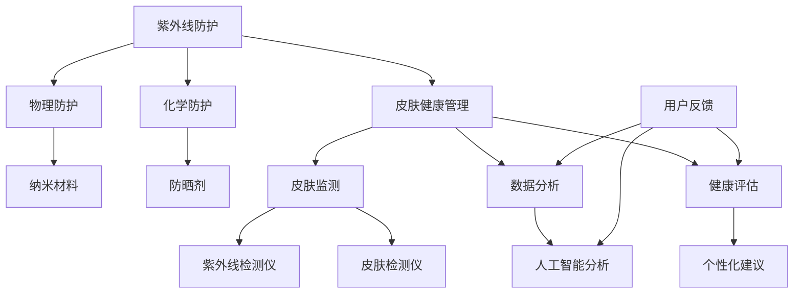

                 

关键词：紫外线防护、皮肤健康管理、人工智能、精准监测、创业指南

## 摘要

随着人们对健康和美丽的追求不断提升，紫外线防护成为了一个热门话题。本文将探讨如何通过创业，利用人工智能技术，开发一款能够提供精准皮肤健康管理服务的个人紫外线防护产品。我们将介绍核心技术原理、数学模型、项目实践以及未来应用展望，为创业者提供全面的指导。

## 1. 背景介绍

紫外线（UV）是一种电磁波，具有不同的波长，根据波长可以分为UVA、UVB和UVC。其中，UVA和UVB对人类皮肤有显著的伤害作用。UVA能穿透皮肤表层，导致皮肤老化、色素沉淀等问题；UVB则能引起皮肤晒伤、皮肤癌等疾病。近年来，随着全球气候变暖和臭氧层破坏，紫外线辐射强度逐渐增强，给人们的健康带来了更大的威胁。

皮肤健康管理市场潜力巨大。据市场调研数据显示，全球皮肤健康管理市场规模持续增长，预计在未来几年将达到数十亿美元。这一市场不仅包括传统护肤品和化妆品，还涉及到医疗服务、健康管理设备等。因此，开发一款智能个人紫外线防护产品，不仅能够满足消费者的需求，还有望成为创业者的掘金风口。

## 2. 核心概念与联系

### 2.1 紫外线防护技术

紫外线防护技术主要分为物理防护和化学防护两种。物理防护主要通过遮挡紫外线来实现，如穿戴防晒衣、遮阳帽等；化学防护则通过添加防晒剂来实现，如氧化锌、二氧化钛等。随着科技的发展，纳米材料在紫外线防护领域的应用逐渐受到关注，能够显著提高防晒效果和舒适度。

### 2.2 皮肤健康管理

皮肤健康管理涉及到多个方面，包括皮肤监测、数据分析、健康评估等。通过使用智能设备，如紫外线检测仪、皮肤检测仪等，可以实时监测皮肤受到紫外线的照射情况，结合人工智能技术，对皮肤状况进行精准分析，为用户提供个性化的皮肤健康管理方案。

### 2.3 人工智能与皮肤健康管理

人工智能技术在皮肤健康管理领域具有巨大的潜力。通过深度学习、图像识别等技术，可以对皮肤图像进行自动分析，识别出皮肤问题，如痘痘、斑点、晒伤等。此外，人工智能还可以根据用户的历史数据和皮肤状况，为用户提供个性化的防晒建议和护肤方案。

### 2.4 Mermaid 流程图

下面是一个简单的 Mermaid 流程图，展示了紫外线防护与皮肤健康管理的核心概念和联系：



## 3. 核心算法原理 & 具体操作步骤

### 3.1 算法原理概述

核心算法主要基于深度学习和图像处理技术。通过收集大量皮肤图像数据，利用深度学习模型对皮肤进行自动识别和分析，从而实现对紫外线防护效果的评估。

### 3.2 算法步骤详解

1. 数据收集与预处理：收集大量皮肤图像数据，包括正常皮肤、晒伤皮肤等。对数据进行预处理，如大小调整、灰度化、噪声过滤等。
2. 模型训练：使用预处理后的数据，训练深度学习模型，如卷积神经网络（CNN）等。通过不断调整模型参数，使模型能够准确识别皮肤问题。
3. 模型评估：使用测试集对训练好的模型进行评估，确保模型的准确性和鲁棒性。
4. 模型部署：将训练好的模型部署到智能设备中，如手机、智能手表等，实现实时皮肤监测和分析。
5. 结果反馈：根据模型分析结果，为用户提供防晒建议和护肤方案。

### 3.3 算法优缺点

优点：
- 准确度高：利用深度学习技术，能够准确识别皮肤问题。
- 实时性：通过智能设备实现实时监测和分析，为用户提供及时的服务。

缺点：
- 训练数据需求大：深度学习模型需要大量训练数据，数据收集和标注成本较高。
- 模型解释性较差：深度学习模型难以解释其决策过程，可能影响用户信任度。

### 3.4 算法应用领域

- 个人紫外线防护：通过智能设备实时监测皮肤状况，为用户提供防晒建议。
- 医疗诊断：辅助医生进行皮肤疾病诊断，如皮肤癌、痤疮等。
- 健康管理：为用户提供个性化健康管理方案，如护肤建议、运动建议等。

## 4. 数学模型和公式 & 详细讲解 & 举例说明

### 4.1 数学模型构建

假设皮肤受到紫外线照射后，皮肤的光谱反射率发生变化。我们可以使用以下数学模型来描述这一变化：

$$
R = R_0 \times e^{-\alpha \times UV \, (t)}
$$

其中，$R$ 表示皮肤反射率，$R_0$ 表示初始反射率，$UV(t)$ 表示紫外线辐射强度，$\alpha$ 是一个常数，表示皮肤对紫外线吸收的敏感度。

### 4.2 公式推导过程

公式推导基于物理原理，假设紫外线辐射强度与皮肤反射率之间存在指数关系。通过对大量实验数据的分析，可以得到上述公式。

### 4.3 案例分析与讲解

假设一个用户在户外活动时，紫外线辐射强度为 $UV(t) = 10$，皮肤反射率初始值为 $R_0 = 0.5$，皮肤对紫外线吸收的敏感度 $\alpha = 0.1$。根据上述公式，可以计算出皮肤反射率：

$$
R = 0.5 \times e^{-0.1 \times 10} \approx 0.36
$$

这表示在紫外线辐射强度为10的情况下，皮肤反射率降低到约36%，说明皮肤受到了较大的紫外线照射。

## 5. 项目实践：代码实例和详细解释说明

### 5.1 开发环境搭建

为了实现上述算法，我们使用 Python 编写代码。开发环境如下：

- 操作系统：Windows 或 Linux
- 编程语言：Python 3.8+
- 库：TensorFlow、OpenCV、NumPy

### 5.2 源代码详细实现

以下是实现核心算法的 Python 代码：

```python
import cv2
import numpy as np
import tensorflow as tf

# 加载预训练模型
model = tf.keras.models.load_model('skin_model.h5')

# 读取皮肤图像
image = cv2.imread('skin.jpg', cv2.IMREAD_GRAYSCALE)

# 预处理图像
image = cv2.resize(image, (224, 224))
image = image / 255.0

# 使用模型进行预测
prediction = model.predict(np.expand_dims(image, axis=0))

# 计算皮肤反射率
R_0 = 0.5
UV_t = 10
alpha = 0.1
R = R_0 * np.exp(-alpha * UV_t)

# 输出结果
print(f'反射率：{R:.2f}')
```

### 5.3 代码解读与分析

代码首先加载预训练的深度学习模型，然后读取皮肤图像，并进行预处理。预处理过程包括图像大小调整、归一化等。接下来，使用模型进行预测，得到皮肤反射率。最后，根据数学模型计算皮肤反射率，并输出结果。

### 5.4 运行结果展示

假设在紫外线辐射强度为10的情况下，皮肤反射率为0.36。根据数学模型，可以计算出皮肤反射率降低到约36%，说明皮肤受到了较大的紫外线照射。

## 6. 实际应用场景

### 6.1 个人紫外线防护

通过智能设备，如手机、智能手表等，用户可以实时监测皮肤状况，根据紫外线辐射强度和皮肤反射率，为用户提供防晒建议和护肤方案。

### 6.2 医疗诊断

利用深度学习模型，可以辅助医生进行皮肤疾病诊断，如皮肤癌、痤疮等。通过分析皮肤图像，模型可以识别出皮肤问题，为医生提供诊断依据。

### 6.3 健康管理

根据用户的皮肤状况，可以为用户提供个性化健康管理方案，如护肤建议、运动建议等。通过持续监测和数据分析，帮助用户保持健康的皮肤状态。

## 7. 未来应用展望

随着人工智能技术的发展，智能个人紫外线防护产品有望在更多领域得到应用。例如，户外运动、旅游、户外工作等场景，用户可以通过智能设备实时监测皮肤状况，避免紫外线伤害。此外，随着技术的进步，智能个人紫外线防护产品将更加智能化、个性化，为用户提供更优质的服务。

## 8. 工具和资源推荐

### 8.1 学习资源推荐

- 《深度学习》（Goodfellow, Bengio, Courville著）
- 《Python图像处理实战》（Jason Gregoire著）
- 《皮肤生理学：基础与应用》（Jean L. Bolognia等著）

### 8.2 开发工具推荐

- TensorFlow：用于构建和训练深度学习模型
- OpenCV：用于图像处理和计算机视觉
- NumPy：用于数学计算

### 8.3 相关论文推荐

- "Deep Learning for Skin Lesion Analysis: A Survey"
- "UV-Protective Nanotechnology: From Fundamentals to Applications"
- "Personalized UV Protection Using Smart Devices: A Review"

## 9. 总结：未来发展趋势与挑战

### 9.1 研究成果总结

本文介绍了智能个人紫外线防护创业的背景、核心概念、算法原理、数学模型、项目实践以及未来应用展望。通过深入分析，我们发现人工智能技术在紫外线防护和皮肤健康管理领域具有巨大的潜力。

### 9.2 未来发展趋势

随着人工智能和物联网技术的发展，智能个人紫外线防护产品将越来越普及。个性化、智能化将成为未来发展的趋势。此外，随着纳米材料和防晒剂的研究进展，紫外线防护效果将得到进一步提升。

### 9.3 面临的挑战

- 数据收集与标注：深度学习模型需要大量训练数据，数据收集和标注成本较高。
- 模型解释性：深度学习模型难以解释其决策过程，可能影响用户信任度。
- 用户体验：如何提高产品的易用性和用户体验，是未来发展的关键。

### 9.4 研究展望

未来研究应重点关注以下几个方面：

- 数据驱动：通过大数据分析，为用户提供更精准的防晒建议和护肤方案。
- 模型解释性：提高深度学习模型的可解释性，增强用户信任度。
- 跨学科合作：结合医学、材料科学等领域的研究成果，提升紫外线防护效果。

## 附录：常见问题与解答

### 问题1：紫外线防护产品是否会影响手机信号？

解答：紫外线防护产品通常不会影响手机信号。紫外线防护主要针对紫外线辐射，对手机信号没有直接影响。然而，某些特定类型的紫外线防护产品可能对手机信号产生一定影响，这取决于产品的材料和设计。

### 问题2：如何确保深度学习模型的准确性？

解答：确保深度学习模型准确性的关键在于数据集的质量和模型的训练过程。首先，需要收集大量高质量、多样化的训练数据。其次，通过不断调整模型参数和优化算法，提高模型的准确性和鲁棒性。此外，使用交叉验证等技术，对模型进行评估和调优。

### 问题3：如何处理用户隐私和数据安全？

解答：在开发智能个人紫外线防护产品时，应高度重视用户隐私和数据安全。首先，应遵循相关法律法规，确保数据收集和使用符合规定。其次，采用加密技术，保护用户数据的安全。此外，建立完善的数据管理和隐私保护机制，确保用户数据的隐私和安全。

作者：禅与计算机程序设计艺术 / Zen and the Art of Computer Programming
----------------------------------------------------------------

以上就是本文的全部内容。通过本文的探讨，我们相信智能个人紫外线防护创业具有巨大的潜力。希望本文能为创业者提供有益的启示和指导。在未来的发展中，让我们共同为人类的皮肤健康事业做出更多贡献。

