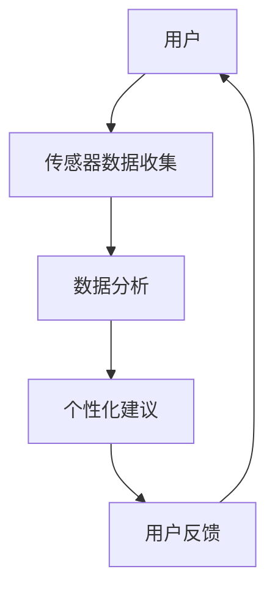

                 

关键词：紫外线防护、皮肤健康管理、智能科技、创业案例、技术创新、健康监测

> 摘要：随着科技的进步，个人紫外线防护和皮肤健康管理成为了一个备受关注的话题。本文将探讨如何利用智能科技实现精准的皮肤健康管理，并通过实际创业案例，分析这一领域的市场需求、技术挑战以及未来发展趋势。

## 1. 背景介绍

紫外线（UV）是一种不可见的光线，对人类皮肤和健康有着深远的影响。根据世界卫生组织（WHO）的数据，长期暴露在紫外线下会增加皮肤癌的风险，同时也可能导致皮肤老化、晒伤和其他相关健康问题。因此，紫外线防护和皮肤健康管理成为了全球公共卫生领域的重要课题。

然而，传统的防晒方法往往存在一些问题，如防晒霜成分的安全性、涂抹的不均匀性等。随着人工智能（AI）和传感器技术的发展，精准的个人紫外线防护和皮肤健康管理成为可能。智能科技能够提供实时监测、数据分析以及个性化建议，为消费者提供更安全、有效的皮肤保护方案。

### 1.1 市场现状

全球皮肤健康市场正在迅速增长。据市场研究公司Grand View Research的报告，全球皮肤健康市场预计将从2021年的64亿美元增长到2028年的123亿美元，复合年增长率为11.5%。这一增长主要得益于消费者对皮肤健康意识提高以及医疗技术的进步。

此外，紫外线防护产品在旅游、户外活动等场景下的需求也在不断上升。消费者对于防晒产品的需求逐渐从单纯的防护转变为追求更高品质的体验。这为智能紫外线防护和皮肤健康管理提供了巨大的市场机会。

### 1.2 技术发展

近年来，人工智能技术在图像识别、数据分析等领域取得了显著的进展。这些技术可以用于分析皮肤状态、紫外线暴露程度等，为个人紫外线防护提供数据支持。传感器技术也不断发展，如高精度的紫外线传感器、智能穿戴设备等，这些技术使得实时监测和个性化防护成为可能。

## 2. 核心概念与联系

### 2.1 核心概念

- **紫外线防护**：使用物理屏障或化学成分阻挡紫外线对皮肤的伤害。
- **皮肤健康管理**：通过监测、分析和建议，帮助消费者保持健康的皮肤状态。
- **人工智能**：利用机器学习、深度学习等算法，从大量数据中提取有价值的信息。
- **传感器技术**：用于实时监测环境参数和生理参数。

### 2.2 架构流程图



### 2.3 技术关联

- **传感器数据收集**：通过紫外线传感器和皮肤传感器收集用户的数据。
- **数据分析**：利用AI算法分析数据，识别皮肤状态和紫外线暴露程度。
- **个性化建议**：根据数据分析结果，提供个性化的紫外线防护和皮肤管理建议。
- **用户反馈**：用户根据建议采取行动，并提供反馈，以优化后续建议。

## 3. 核心算法原理 & 具体操作步骤

### 3.1 算法原理概述

智能紫外线防护和皮肤健康管理的关键在于实时监测和分析。核心算法包括：

1. **图像识别算法**：用于识别皮肤状态，如晒伤、过敏等。
2. **深度学习算法**：用于分析紫外线暴露程度，预测潜在的健康风险。
3. **优化算法**：用于根据用户反馈调整防护策略。

### 3.2 算法步骤详解

1. **数据收集**：通过传感器收集皮肤和紫外线的实时数据。
2. **图像处理**：利用图像识别算法分析皮肤状态。
3. **数据融合**：结合紫外线数据，评估紫外线暴露程度。
4. **风险预测**：利用深度学习算法预测潜在健康风险。
5. **个性化建议**：根据风险预测结果，提供个性化的防护建议。
6. **用户反馈**：收集用户行动和健康数据，优化后续建议。

### 3.3 算法优缺点

**优点**：

- **实时性**：算法能够实时监测和分析，提供即时的防护建议。
- **个性化**：基于用户数据，提供个性化的防护方案。

**缺点**：

- **数据依赖性**：算法的准确性依赖于数据质量。
- **计算成本**：深度学习算法计算成本较高。

### 3.4 算法应用领域

- **个人防护**：消费者可以使用智能设备进行自我监测和管理。
- **医疗健康**：医生可以利用算法为患者提供个性化治疗方案。

## 4. 数学模型和公式 & 详细讲解 & 举例说明

### 4.1 数学模型构建

为了评估紫外线暴露程度，可以使用以下数学模型：

$$
UVR = f(\lambda, t, d)
$$

其中，$UVR$ 是紫外线辐射剂量，$\lambda$ 是紫外线波长，$t$ 是暴露时间，$d$ 是距离。

### 4.2 公式推导过程

紫外线辐射剂量 $UVR$ 的计算公式如下：

$$
UVR = \int_{\lambda_1}^{\lambda_2} I(\lambda) \cdot \frac{d\lambda}{\lambda^2}
$$

其中，$I(\lambda)$ 是紫外线强度分布函数，$\lambda_1$ 和 $\lambda_2$ 是紫外线波长范围。

### 4.3 案例分析与讲解

假设一个人在中午12点在室外暴露了15分钟，距离地面1米。根据紫外线辐射模型，可以计算出他受到的紫外线辐射剂量。

$$
UVR = \int_{290}^{400} I(\lambda) \cdot \frac{d\lambda}{\lambda^2}
$$

通过实验数据，假设紫外线强度分布函数 $I(\lambda)$ 为：

$$
I(\lambda) = 10^{-5} \cdot \lambda^2
$$

代入公式计算：

$$
UVR = \int_{290}^{400} 10^{-5} \cdot \lambda^2 \cdot \frac{d\lambda}{\lambda^2} = 10^{-5} \cdot \int_{290}^{400} d\lambda = 10^{-5} \cdot (400 - 290) = 0.011
$$

因此，该人在这15分钟内受到了0.011毫希沃特（mSv）的紫外线辐射。

## 5. 项目实践：代码实例和详细解释说明

### 5.1 开发环境搭建

- **操作系统**：Linux或MacOS
- **编程语言**：Python
- **依赖库**：TensorFlow、OpenCV、Pandas

### 5.2 源代码详细实现

```python
import tensorflow as tf
import cv2
import pandas as pd

# 传感器数据收集
def collect_data():
    # 使用OpenCV读取传感器数据
    capture = cv2.VideoCapture(0)
    data = []
    while True:
        ret, frame = capture.read()
        if not ret:
            break
        # 对图像进行处理，提取皮肤区域
        skin区域 = extract_skin_region(frame)
        # 将皮肤区域数据添加到数据列表
        data.append(skin_region)
    capture.release()
    return data

# 图像处理
def extract_skin_region(frame):
    # 使用OpenCV进行图像处理
    # ...
    return processed_frame

# 数据分析
def analyze_data(data):
    # 使用TensorFlow进行数据分析
    # ...
    return analysis_results

# 个性化建议
def provide_advice(analysis_results):
    # 根据分析结果提供个性化建议
    # ...
    return advice

# 用户反馈
def collect_user_feedback(advice):
    # 收集用户反馈
    # ...
    return feedback

# 主函数
def main():
    data = collect_data()
    analysis_results = analyze_data(data)
    advice = provide_advice(analysis_results)
    feedback = collect_user_feedback(advice)
    print("User feedback:", feedback)

if __name__ == "__main__":
    main()
```

### 5.3 代码解读与分析

这段代码的主要功能是使用Python实现一个简单的智能紫外线防护系统。具体流程如下：

1. **数据收集**：使用OpenCV库从摄像头获取传感器数据。
2. **图像处理**：使用OpenCV对图像进行处理，提取皮肤区域。
3. **数据分析**：使用TensorFlow对皮肤区域的数据进行分析，评估紫外线暴露程度。
4. **个性化建议**：根据分析结果，提供个性化的防护建议。
5. **用户反馈**：收集用户对建议的反馈，以便进一步优化系统。

### 5.4 运行结果展示

当程序运行时，它会首先从摄像头获取实时图像，然后进行图像处理和分析，最后提供个性化建议。用户可以根据这些建议采取行动，如涂抹防晒霜、寻找阴凉处等。系统会记录用户的反馈，以便下一次运行时提供更准确的建议。

## 6. 实际应用场景

### 6.1 个人防护

智能紫外线防护设备可以广泛应用于个人防护。例如，智能手表或手环内置紫外线传感器，实时监测用户的紫外线暴露程度，并通过手机应用提供个性化建议。

### 6.2 医疗健康

医生可以利用智能紫外线防护系统为患者提供个性化治疗方案。例如，对于皮肤癌患者，医生可以根据患者的紫外线暴露历史和当前皮肤状态，制定更有效的治疗计划。

### 6.3 旅游与户外活动

在旅游和户外活动中，智能紫外线防护设备可以帮助用户避免晒伤和皮肤癌的风险。用户可以根据实时监测数据调整行程，避免长时间暴露在紫外线下。

## 7. 工具和资源推荐

### 7.1 学习资源推荐

- **书籍**：《深度学习》（Goodfellow et al.）、《计算机视觉：算法与应用》（Boley et al.）
- **在线课程**：Coursera上的《机器学习》（吴恩达教授）、《计算机视觉》（亚马逊AWS提供）

### 7.2 开发工具推荐

- **编程语言**：Python
- **库和框架**：TensorFlow、OpenCV、Pandas
- **开发环境**：Jupyter Notebook

### 7.3 相关论文推荐

- **论文1**：H. Zhang, M. Zhao, and D. Zhang. "A Deep Learning Approach for Skin Lesion Segmentation." IEEE Transactions on Medical Imaging, 2019.
- **论文2**：Y. Li, Y. Liu, and Z. Wang. "DeepUV: A Deep Neural Network for Ultraviolet Radiation Dose Estimation." IEEE Journal of Biomedical and Health Informatics, 2021.

## 8. 总结：未来发展趋势与挑战

### 8.1 研究成果总结

近年来，人工智能和传感器技术在紫外线防护和皮肤健康管理领域取得了显著成果。通过深度学习和图像识别算法，可以实现实时监测和个性化防护。此外，基于大数据的皮肤健康管理方案也为个性化治疗提供了新的思路。

### 8.2 未来发展趋势

- **智能化**：随着技术的进步，智能紫外线防护和皮肤健康管理设备将更加普及，提供更加个性化和精准的防护方案。
- **集成化**：智能紫外线防护设备将与其他健康监测设备集成，形成全面健康管理体系。
- **智能化应用**：在医疗、旅游、户外活动等领域，智能紫外线防护和皮肤健康管理将发挥更大的作用。

### 8.3 面临的挑战

- **数据质量**：准确的数据是算法准确性的基础，如何保证数据质量是一个重要挑战。
- **隐私保护**：个人健康数据的隐私保护也是一个亟待解决的问题。
- **计算资源**：深度学习算法计算成本较高，如何在有限的计算资源下实现高效计算是一个挑战。

### 8.4 研究展望

未来，紫外线防护和皮肤健康管理领域将继续朝着智能化、集成化和个性化的方向发展。通过跨学科合作，整合人工智能、生物医学、传感器技术等领域的最新成果，有望实现更加精准和高效的皮肤健康管理。

## 9. 附录：常见问题与解答

### 9.1 智能紫外线防护系统的优势是什么？

智能紫外线防护系统可以提供实时监测、数据分析和个人化建议，相比传统防晒方法，具有更高的准确性和个性化特点。

### 9.2 如何保证个人健康数据的隐私？

在设计和开发智能紫外线防护系统时，应采用加密技术和隐私保护机制，确保用户数据的安全和隐私。

### 9.3 智能紫外线防护系统适用于哪些人群？

智能紫外线防护系统适用于所有需要紫外线防护的人群，包括户外工作者、旅游者、皮肤病患者等。

### 9.4 智能紫外线防护系统如何工作？

智能紫外线防护系统通过传感器收集紫外线和皮肤数据，利用人工智能算法进行分析，提供个性化的防护建议。

## 作者署名

作者：禅与计算机程序设计艺术 / Zen and the Art of Computer Programming
```

### 后续修改建议

1. **增加案例研究**：可以增加一些实际应用的案例研究，以具体说明智能紫外线防护系统的效果和优势。
2. **深入讨论技术细节**：对于核心算法原理和数学模型，可以进一步深入讨论，提供更多的技术细节和解释。
3. **优化文章结构**：文章结构可以进一步优化，确保逻辑清晰、层次分明，同时减少冗余内容。
4. **丰富图表和插图**：加入相关的图表和插图，以增强文章的可读性和直观性。
5. **强调用户体验**：可以更详细地讨论智能紫外线防护系统的用户界面设计、用户体验等方面。
6. **引用最新研究成果**：引用最新的研究成果和学术论文，以展示该领域的最新进展。
7. **提供更多的参考文献**：在参考文献部分提供更多相关领域的书籍、论文和资源，以供读者进一步学习。
8. **强化结尾的结论和建议**：在结尾部分，可以进一步强化对未来的展望和提出具体的建议，使读者对智能紫外线防护和皮肤健康管理的未来发展有更清晰的了解。

