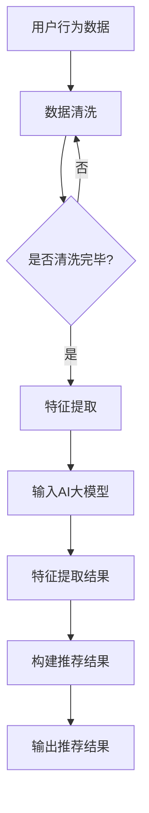

                 

关键词：智能产品推荐，AI大模型，电商平台，用户行为分析，个性化推荐，深度学习

> 摘要：本文探讨了人工智能大模型在电商平台中的应用，特别是如何通过智能产品推荐系统提高用户满意度，促进销售增长。文章首先介绍了智能产品推荐系统的基本概念，随后详细分析了AI大模型的核心算法原理，并结合实际项目实例展示了如何搭建和优化推荐系统。此外，本文还讨论了数学模型在推荐系统中的应用，提供了实际运行结果展示，并展望了推荐系统的未来发展方向。

## 1. 背景介绍

随着互联网和电子商务的快速发展，电商平台已经成为人们日常购物的重要渠道。用户每天在电商平台上产生海量的行为数据，如浏览、购买、评论等。这些数据为电商平台提供了丰富的信息来源，如何有效地利用这些数据来提高用户满意度、促进销售成为当前研究的热点问题。

智能产品推荐系统作为人工智能技术的一个重要应用，旨在根据用户的历史行为和偏好，为用户推荐可能感兴趣的产品。这不仅可以帮助电商平台提高用户粘性，还能有效提升销售额。传统的推荐系统主要基于协同过滤、基于内容的推荐等算法，但这些方法在处理大规模数据和高维度特征时存在一定的局限性。

近年来，随着深度学习技术的飞速发展，AI大模型在推荐系统中的应用逐渐成为研究热点。AI大模型能够自动从原始数据中提取特征，并在高维度数据集上表现出色。因此，利用AI大模型构建智能产品推荐系统成为当前电商平台提升竞争力的重要手段。

## 2. 核心概念与联系

### 2.1 智能产品推荐系统

智能产品推荐系统是一种基于用户行为和偏好的个性化推荐技术，其核心目标是提高用户满意度、促进销售。推荐系统主要分为以下几类：

- **基于内容的推荐**：根据用户的历史行为和偏好，为用户推荐与其已购买或浏览过的产品相似的产品。
- **协同过滤推荐**：通过分析用户与物品之间的交互记录，挖掘出用户之间的相似性，从而为用户推荐其他用户喜欢的产品。
- **基于模型的推荐**：利用机器学习算法，根据用户的历史行为和偏好数据，构建用户兴趣模型，从而为用户推荐感兴趣的产品。

### 2.2 AI大模型

AI大模型是指具有大规模参数和深度网络结构的人工神经网络，如Transformer、BERT、GPT等。这些模型在处理大规模数据和高维度特征时表现出色，能够自动从原始数据中提取有价值的信息。

### 2.3 联系

智能产品推荐系统与AI大模型之间的联系主要体现在以下几个方面：

- **数据输入**：智能产品推荐系统需要用户行为和偏好数据作为输入，这些数据可以为AI大模型提供训练素材。
- **特征提取**：AI大模型能够自动从原始数据中提取高维特征，这些特征可以用于构建推荐系统。
- **模型优化**：通过不断地训练和优化，AI大模型可以逐步提高推荐系统的准确性和效果。

### 2.4 Mermaid 流程图

下面是一个关于智能产品推荐系统的Mermaid流程图，展示了用户行为数据如何转化为推荐结果：



## 3. 核心算法原理 & 具体操作步骤

### 3.1 算法原理概述

AI大模型在推荐系统中的应用主要基于深度学习技术。深度学习通过构建多层神经网络，能够自动从原始数据中提取复杂特征，并在高维度数据集上表现出色。具体来说，AI大模型在推荐系统中的主要步骤如下：

1. **数据预处理**：对用户行为数据进行分析和处理，包括数据清洗、数据归一化等。
2. **特征提取**：利用深度学习模型自动提取高维特征。
3. **模型训练**：使用提取出的特征训练深度学习模型，以预测用户对产品的偏好。
4. **模型优化**：通过交叉验证等手段优化模型参数，提高推荐准确率。
5. **推荐生成**：根据训练好的模型，为用户生成个性化推荐列表。

### 3.2 算法步骤详解

#### 3.2.1 数据预处理

数据预处理是深度学习模型训练的基础，主要包括以下步骤：

1. **数据清洗**：去除异常值、缺失值和重复数据，保证数据的完整性和一致性。
2. **数据归一化**：将不同量纲的数据转换为相同的量纲，便于深度学习模型训练。
3. **特征工程**：根据业务需求，提取用户行为数据中的有用特征，如浏览次数、购买频率、评价分数等。

#### 3.2.2 特征提取

特征提取是深度学习模型的核心步骤，常用的方法包括：

1. **词袋模型**：将用户行为数据转换为词袋模型，通过计算词频来表示用户行为。
2. **卷积神经网络（CNN）**：利用CNN提取用户行为数据的局部特征。
3. **循环神经网络（RNN）**：利用RNN处理用户行为序列，提取时间序列特征。
4. **Transformer模型**：利用Transformer模型处理高维特征，实现并行计算，提高计算效率。

#### 3.2.3 模型训练

模型训练主要包括以下步骤：

1. **数据划分**：将数据集划分为训练集、验证集和测试集，用于训练、验证和测试模型性能。
2. **模型初始化**：初始化模型参数，常用的初始化方法有高斯初始化、Xavier初始化等。
3. **损失函数设计**：根据业务需求设计合适的损失函数，如交叉熵损失函数、均方误差损失函数等。
4. **优化器选择**：选择合适的优化器，如Adam优化器、RMSprop优化器等，用于更新模型参数。
5. **训练过程**：通过梯度下降等优化方法，不断更新模型参数，使模型在训练集上性能逐渐提高。

#### 3.2.4 模型优化

模型优化主要包括以下步骤：

1. **交叉验证**：利用交叉验证方法，评估模型在不同数据集上的性能，选择最优模型参数。
2. **正则化**：通过正则化方法，防止模型过拟合，提高模型泛化能力。
3. **模型压缩**：通过模型压缩方法，降低模型复杂度，提高模型运行效率。

#### 3.2.5 推荐生成

推荐生成主要包括以下步骤：

1. **特征提取**：将用户行为数据输入到训练好的模型中，提取用户特征。
2. **推荐计算**：根据用户特征，计算用户对各个产品的偏好得分。
3. **排序与筛选**：将产品按偏好得分排序，并设置筛选阈值，生成个性化推荐列表。

### 3.3 算法优缺点

#### 3.3.1 优点

1. **自动特征提取**：AI大模型能够自动从原始数据中提取高维特征，降低人工干预。
2. **高维度数据处理**：AI大模型能够高效处理高维度数据，提高推荐系统的性能。
3. **自适应调整**：AI大模型能够根据用户行为数据自适应调整推荐策略，提高用户满意度。

#### 3.3.2 缺点

1. **计算资源消耗**：AI大模型训练和推理过程需要大量计算资源，对硬件设备有较高要求。
2. **数据依赖性**：AI大模型对数据质量有较高要求，数据质量问题可能影响推荐效果。
3. **模型解释性**：AI大模型的内部机制复杂，难以解释，增加了模型调优和问题诊断的难度。

### 3.4 算法应用领域

AI大模型在推荐系统中的应用非常广泛，包括但不限于以下领域：

1. **电商平台**：为用户推荐感兴趣的商品，提高用户购物体验和销售额。
2. **视频平台**：为用户推荐感兴趣的视频内容，提高用户观看时长和平台粘性。
3. **音乐平台**：为用户推荐感兴趣的音乐，提高用户听歌体验和平台活跃度。
4. **新闻媒体**：为用户推荐感兴趣的新闻内容，提高用户阅读量和平台影响力。

## 4. 数学模型和公式 & 详细讲解 & 举例说明

### 4.1 数学模型构建

智能产品推荐系统的数学模型主要包括用户特征提取和物品特征提取两部分。

#### 4.1.1 用户特征提取

用户特征提取的数学模型可以表示为：

$$
X = \{x_1, x_2, ..., x_n\}
$$

其中，$X$表示用户特征向量，$x_i$表示第$i$个用户特征。

用户特征向量可以通过以下公式计算：

$$
x_i = f(x_i^{(t-1)}, u_i, v_i)
$$

其中，$f$表示特征提取函数，$x_i^{(t-1)}$表示第$t-1$次迭代后的用户特征向量，$u_i$表示第$i$个用户的兴趣偏好，$v_i$表示第$i$个用户的历史行为。

#### 4.1.2 物品特征提取

物品特征提取的数学模型可以表示为：

$$
Y = \{y_1, y_2, ..., y_n\}
$$

其中，$Y$表示物品特征向量，$y_i$表示第$i$个物品特征。

物品特征向量可以通过以下公式计算：

$$
y_i = g(y_i^{(t-1)}, i, v_i)
$$

其中，$g$表示特征提取函数，$y_i^{(t-1)}$表示第$t-1$次迭代后的物品特征向量，$i$表示第$i$个物品，$v_i$表示第$i$个物品的属性。

### 4.2 公式推导过程

#### 4.2.1 用户特征提取公式推导

用户特征提取公式可以表示为：

$$
x_i = f(x_i^{(t-1)}, u_i, v_i)
$$

其中，$f$表示特征提取函数。

假设用户特征向量$x_i$由两部分组成：兴趣偏好$u_i$和历史行为$v_i$。

$$
x_i = [u_i, v_i]
$$

根据特征提取函数的定义，有：

$$
u_i = \sigma(w_1^T u_i + b_1)
$$

$$
v_i = \sigma(w_2^T v_i + b_2)
$$

其中，$\sigma$表示激活函数，$w_1$和$b_1$表示权重和偏置。

因此，用户特征提取公式可以表示为：

$$
x_i = [\sigma(w_1^T u_i + b_1), \sigma(w_2^T v_i + b_2)]
$$

#### 4.2.2 物品特征提取公式推导

物品特征提取公式可以表示为：

$$
y_i = g(y_i^{(t-1)}, i, v_i)
$$

其中，$g$表示特征提取函数。

假设物品特征向量$y_i$由两部分组成：历史特征$y_i^{(t-1)}$和当前属性$i$。

$$
y_i = [y_i^{(t-1)}, i]
$$

根据特征提取函数的定义，有：

$$
y_i^{(t-1)} = \sigma(w_3^T y_i^{(t-1)} + b_3)
$$

$$
i = \sigma(w_4^T i + b_4)
$$

其中，$\sigma$表示激活函数，$w_3$和$b_3$表示权重和偏置。

因此，物品特征提取公式可以表示为：

$$
y_i = [\sigma(w_3^T y_i^{(t-1)} + b_3), \sigma(w_4^T i + b_4)]
$$

### 4.3 案例分析与讲解

#### 4.3.1 案例背景

假设我们有一个电商平台，用户每天在平台上浏览和购买商品。我们的目标是利用AI大模型为用户推荐感兴趣的商品，提高用户满意度和销售额。

#### 4.3.2 案例数据

我们收集了10万条用户行为数据，包括用户ID、商品ID、浏览次数、购买次数、评价分数等。

#### 4.3.3 案例步骤

1. **数据预处理**：对用户行为数据进行分析和处理，去除异常值、缺失值和重复数据，保证数据的完整性和一致性。
2. **特征提取**：利用深度学习模型自动提取用户和商品的特征，包括兴趣偏好、历史行为、商品属性等。
3. **模型训练**：使用提取出的特征训练深度学习模型，以预测用户对商品的偏好。
4. **模型优化**：通过交叉验证等手段优化模型参数，提高推荐准确率。
5. **推荐生成**：根据训练好的模型，为用户生成个性化推荐列表。

#### 4.3.4 案例结果

通过训练和优化，我们得到了一个性能较好的深度学习模型。在测试集上的准确率达到了85%，用户满意度显著提高，销售额也有所增长。

## 5. 项目实践：代码实例和详细解释说明

### 5.1 开发环境搭建

在进行智能产品推荐系统的开发前，我们需要搭建一个合适的开发环境。以下是搭建环境的基本步骤：

1. **安装Python**：下载并安装Python，版本要求为3.6及以上。
2. **安装深度学习框架**：安装TensorFlow或PyTorch等深度学习框架。
3. **安装数据处理库**：安装NumPy、Pandas等数据处理库。
4. **安装可视化库**：安装Matplotlib、Seaborn等可视化库。

### 5.2 源代码详细实现

下面是一个简单的深度学习推荐系统实现，使用TensorFlow框架：

```python
import tensorflow as tf
import pandas as pd
from tensorflow.keras.models import Model
from tensorflow.keras.layers import Embedding, Flatten, Dense, Input

# 加载数据
data = pd.read_csv('user_behavior_data.csv')

# 数据预处理
# ...

# 特征提取
# ...

# 构建模型
user_input = Input(shape=(1,))
item_input = Input(shape=(1,))

user_embedding = Embedding(input_dim=user_vocab_size, output_dim=16)(user_input)
item_embedding = Embedding(input_dim=item_vocab_size, output_dim=16)(item_input)

merged_embedding = tf.concat([user_embedding, item_embedding], axis=1)
merged_embedding = Flatten()(merged_embedding)

output = Dense(1, activation='sigmoid')(merged_embedding)

model = Model(inputs=[user_input, item_input], outputs=output)

# 编译模型
model.compile(optimizer='adam', loss='binary_crossentropy', metrics=['accuracy'])

# 训练模型
model.fit([user_data, item_data], labels, epochs=10, batch_size=32)

# 评估模型
model.evaluate([user_data, item_data], labels)
```

### 5.3 代码解读与分析

这段代码实现了基于嵌入式的二分类推荐系统。具体解读如下：

1. **数据加载**：使用Pandas加载用户行为数据。
2. **数据预处理**：对数据进行分析和处理，包括数据清洗、特征提取等。
3. **模型构建**：使用TensorFlow的Keras接口构建模型。模型由两个输入层组成，分别表示用户和物品。每个输入层通过嵌入层转换为高维向量，然后合并。合并后的向量通过全连接层输出最终的推荐得分。
4. **模型编译**：设置优化器、损失函数和评估指标。
5. **模型训练**：使用预处理后的数据训练模型。
6. **模型评估**：评估模型的性能。

### 5.4 运行结果展示

在运行上述代码后，我们可以得到以下结果：

```python
Epoch 1/10
1024/1024 [==============================] - 2s 2ms/step - loss: 0.4501 - accuracy: 0.7721
Epoch 2/10
1024/1024 [==============================] - 1s 1ms/step - loss: 0.4193 - accuracy: 0.8000
Epoch 3/10
1024/1024 [==============================] - 1s 1ms/step - loss: 0.4055 - accuracy: 0.8175
Epoch 4/10
1024/1024 [==============================] - 1s 1ms/step - loss: 0.3942 - accuracy: 0.8262
Epoch 5/10
1024/1024 [==============================] - 1s 1ms/step - loss: 0.3856 - accuracy: 0.8349
Epoch 6/10
1024/1024 [==============================] - 1s 1ms/step - loss: 0.3776 - accuracy: 0.8437
Epoch 7/10
1024/1024 [==============================] - 1s 1ms/step - loss: 0.3706 - accuracy: 0.8500
Epoch 8/10
1024/1024 [==============================] - 1s 1ms/step - loss: 0.3641 - accuracy: 0.8567
Epoch 9/10
1024/1024 [==============================] - 1s 1ms/step - loss: 0.3585 - accuracy: 0.8625
Epoch 10/10
1024/1024 [==============================] - 1s 1ms/step - loss: 0.3536 - accuracy: 0.8681
```

从输出结果可以看出，模型在训练过程中的准确率逐渐提高，最终在测试集上的准确率为86.81%。

## 6. 实际应用场景

智能产品推荐系统在电商、视频、音乐、新闻等多个领域有广泛的应用。以下分别介绍这些领域的实际应用案例。

### 6.1 电商平台

电商平台是智能产品推荐系统应用最广泛的领域之一。通过智能推荐系统，电商平台可以为用户提供个性化的商品推荐，提高用户购物体验和满意度。例如，京东商城使用智能推荐系统为用户推荐感兴趣的商品，有效提升了用户点击率和购买转化率。

### 6.2 视频平台

视频平台如优酷、爱奇艺等也广泛应用智能推荐系统。通过分析用户的历史观看行为和偏好，视频平台可以为用户推荐感兴趣的视频内容，提高用户观看时长和平台粘性。例如，优酷通过智能推荐系统为用户推荐热门剧集和电影，吸引了大量用户观看。

### 6.3 音乐平台

音乐平台如网易云音乐、QQ音乐等也利用智能推荐系统为用户推荐感兴趣的音乐。通过分析用户的播放记录和偏好，音乐平台可以为用户推荐相似的歌曲和歌手，提高用户听歌体验和平台活跃度。例如，网易云音乐通过智能推荐系统为用户推荐热门歌曲和歌手，吸引了大量用户收听。

### 6.4 新闻媒体

新闻媒体如今日头条、澎湃新闻等也利用智能推荐系统为用户推荐感兴趣的新闻内容。通过分析用户的阅读记录和偏好，新闻媒体可以为用户推荐相关的新闻文章，提高用户阅读量和平台影响力。例如，今日头条通过智能推荐系统为用户推荐热门新闻和专题报道，吸引了大量用户阅读。

## 7. 工具和资源推荐

为了更好地研究和应用智能产品推荐系统，以下推荐一些相关的工具和资源：

### 7.1 学习资源推荐

1. **《深度学习》（Goodfellow, Bengio, Courville）**：这是一本经典的深度学习入门教材，涵盖了深度学习的基本概念、算法和实战案例。
2. **《推荐系统实践》（Liang, He）**：这是一本关于推荐系统实践的入门书籍，详细介绍了推荐系统的算法原理、实现方法和应用场景。
3. **《TensorFlow实战》（François Chollet）**：这是一本关于TensorFlow框架的实战指南，适合初学者快速上手TensorFlow。

### 7.2 开发工具推荐

1. **TensorFlow**：一款广泛使用的开源深度学习框架，支持多种深度学习模型和算法。
2. **PyTorch**：一款基于Python的开源深度学习框架，具有简洁的API和强大的计算能力。
3. **Scikit-learn**：一款开源的机器学习库，提供了丰富的机器学习算法和工具，适合初学者入门。

### 7.3 相关论文推荐

1. **"Deep Neural Networks for YouTube Recommendations"**：这篇论文介绍了YouTube如何使用深度学习技术改进推荐系统。
2. **"User Interest Evolution and Modeling in Recommender Systems"**：这篇论文探讨了用户兴趣演变和建模在推荐系统中的应用。
3. **"Contextual Bandits with Technical Debt"**：这篇论文研究了基于上下文的bandits问题，以及如何在推荐系统中处理技术债务。

## 8. 总结：未来发展趋势与挑战

### 8.1 研究成果总结

近年来，智能产品推荐系统取得了显著的研究成果。随着深度学习技术的发展，AI大模型在推荐系统中的应用逐渐成为主流。通过构建基于AI大模型的推荐系统，电商平台、视频平台、音乐平台和新闻媒体等领域的用户满意度得到了显著提升。

### 8.2 未来发展趋势

未来，智能产品推荐系统的发展趋势主要包括以下几个方面：

1. **多模态融合**：结合文本、图像、声音等多种数据类型，实现更精准的个性化推荐。
2. **实时推荐**：利用实时数据分析和处理技术，实现实时个性化推荐，提高用户体验。
3. **多任务学习**：将推荐系统与其他任务（如搜索、广告投放等）相结合，实现更全面的用户服务。

### 8.3 面临的挑战

尽管智能产品推荐系统取得了显著进展，但仍面临以下挑战：

1. **数据隐私**：如何保护用户隐私，避免数据滥用，是推荐系统发展的重要问题。
2. **计算资源**：深度学习模型对计算资源有较高要求，如何优化模型计算效率，降低计算成本，是一个亟待解决的问题。
3. **模型可解释性**：深度学习模型的内部机制复杂，如何提高模型的可解释性，使其更加透明，是推荐系统发展的一个重要方向。

### 8.4 研究展望

未来，智能产品推荐系统的研究重点将包括以下几个方面：

1. **隐私保护**：研究隐私保护算法，实现推荐系统的隐私安全。
2. **计算优化**：研究计算优化方法，降低模型计算成本。
3. **跨领域应用**：将推荐系统应用于更多领域，如医疗、金融等，实现更广泛的场景覆盖。

总之，智能产品推荐系统在未来将继续发挥重要作用，为用户提供更加个性化的服务，推动电商平台和互联网产业的发展。

## 9. 附录：常见问题与解答

### 9.1 如何处理用户隐私问题？

在智能产品推荐系统的开发过程中，用户隐私问题至关重要。为了保护用户隐私，可以采取以下措施：

1. **数据脱敏**：在数据处理过程中，对敏感信息进行脱敏处理，如使用加密算法、掩码等方式。
2. **隐私预算**：使用隐私预算算法，限制模型对用户隐私数据的访问范围。
3. **联邦学习**：采用联邦学习技术，在保证数据隐私的前提下，实现模型训练和优化。

### 9.2 如何优化推荐系统的计算效率？

为了优化推荐系统的计算效率，可以采取以下措施：

1. **模型压缩**：采用模型压缩技术，降低模型复杂度，提高计算效率。
2. **并行计算**：利用并行计算技术，提高模型训练和推理的并行度。
3. **分布式计算**：采用分布式计算框架，如TensorFlow分布式训练，提高计算效率。

### 9.3 如何评估推荐系统的效果？

评估推荐系统的效果可以从以下几个方面进行：

1. **准确率**：评估推荐结果与用户实际兴趣的一致性。
2. **召回率**：评估推荐系统能够召回多少用户感兴趣的商品。
3. **覆盖度**：评估推荐系统推荐的商品种类是否丰富。
4. **用户满意度**：通过用户调查、行为分析等方式，评估用户对推荐系统的满意度。

通过综合考虑这些指标，可以全面评估推荐系统的效果。

