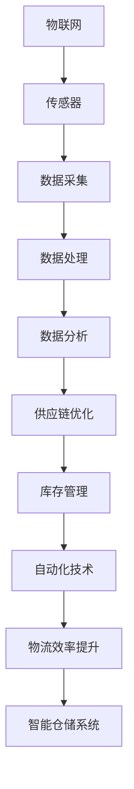
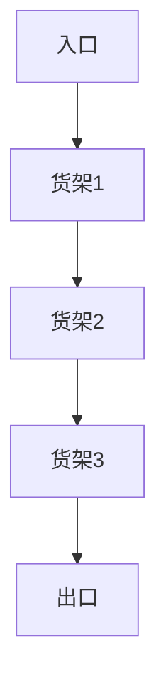

                 

关键词：智能仓储、物流效率、人工智能、物联网、供应链优化、自动化技术

> 摘要：本文将探讨智能仓储在物流效率提升中的作用，通过分析其核心概念、算法原理、数学模型、实践应用以及未来发展趋势，揭示智能仓储如何引领物流行业的革命性变革。

## 1. 背景介绍

随着全球经济的快速发展，物流行业已成为推动经济增长的重要引擎。然而，传统仓储模式存在诸多问题，如库存管理效率低下、物流成本高昂、人为操作失误等。为了解决这些问题，智能仓储技术逐渐兴起，以其高效、精准、智能的特点，为物流行业带来革命性的变革。

智能仓储是一种利用物联网、人工智能、自动化技术等先进技术，实现仓储管理的智能化、数字化和自动化。通过引入智能仓储系统，企业可以实现对库存的实时监控、精准管理和快速响应，从而大幅提升物流效率。

## 2. 核心概念与联系

智能仓储系统的核心概念包括：物联网、人工智能、自动化技术、数据分析和供应链优化。以下是这些概念之间的联系及其Mermaid流程图：



### 2.1 物联网

物联网（IoT）是通过互联网将各种设备连接起来，实现数据交换和通信。在智能仓储中，物联网技术用于连接仓储中的各种设备，如传感器、机器人、货架等，实现对仓储环境的实时监控。

### 2.2 人工智能

人工智能（AI）是一种模拟人类智能的技术，通过学习和推理，实现对数据的分析和处理。在智能仓储中，人工智能技术主要用于仓库布局优化、路径规划、异常检测等。

### 2.3 自动化技术

自动化技术是实现仓储管理自动化的关键。通过引入自动化设备，如自动化仓库货架、自动搬运机器人等，企业可以大幅提高仓储作业效率。

### 2.4 数据分析和供应链优化

通过对仓储数据的分析，企业可以实现对库存的精准管理，优化供应链流程。供应链优化包括库存优化、配送路线优化、物流成本优化等。

## 3. 核心算法原理 & 具体操作步骤

### 3.1 算法原理概述

智能仓储系统中的核心算法主要包括路径规划算法、库存优化算法和异常检测算法。

- **路径规划算法**：用于确定仓储设备在仓库内的行驶路径，以实现快速、高效的作业。
- **库存优化算法**：用于根据需求预测和库存数据，对仓储物品进行合理摆放和存储，以降低库存成本。
- **异常检测算法**：用于实时监控仓储环境，发现异常情况并报警，如货物损坏、设备故障等。

### 3.2 算法步骤详解

#### 3.2.1 路径规划算法

路径规划算法的主要步骤如下：

1. **地图构建**：通过传感器和物联网设备，获取仓库内的地图信息。
2. **初始路径规划**：根据仓库地图和设备位置，生成初始路径。
3. **路径优化**：使用优化算法，如遗传算法、蚁群算法等，对初始路径进行优化。
4. **路径执行**：将优化后的路径发送给仓储设备，执行路径规划任务。

#### 3.2.2 库存优化算法

库存优化算法的主要步骤如下：

1. **需求预测**：根据历史销售数据和趋势，预测未来一段时间内的需求。
2. **库存分析**：分析当前库存水平和预测需求，确定需补充的库存量。
3. **库存分配**：根据仓库容量和存储要求，对库存物品进行合理摆放。
4. **库存调整**：根据库存变化和需求调整，实时调整库存布局。

#### 3.2.3 异常检测算法

异常检测算法的主要步骤如下：

1. **数据采集**：通过传感器和物联网设备，实时采集仓储环境数据。
2. **特征提取**：从采集到的数据中提取关键特征，如温度、湿度、设备运行状态等。
3. **异常检测**：使用机器学习算法，对提取的特征进行异常检测。
4. **报警处理**：发现异常情况后，自动生成报警信息，并通知相关人员处理。

### 3.3 算法优缺点

#### 3.3.1 路径规划算法

优点：路径规划算法能够提高仓储作业效率，降低运营成本。

缺点：算法的复杂度较高，对计算资源要求较高。

#### 3.3.2 库存优化算法

优点：库存优化算法能够降低库存成本，提高库存周转率。

缺点：算法对历史数据的依赖性较强，预测准确性受影响。

#### 3.3.3 异常检测算法

优点：异常检测算法能够实时监控仓储环境，提高仓储安全性。

缺点：算法的误报率较高，需要进一步优化。

### 3.4 算法应用领域

路径规划算法、库存优化算法和异常检测算法在智能仓储系统中具有广泛的应用，如：

- **电商仓储**：通过路径规划算法，实现电商仓库的自动化作业。
- **制造业仓储**：通过库存优化算法，实现制造业仓库的精细化管理和高效运作。
- **冷链仓储**：通过异常检测算法，实时监控冷链仓储环境，确保食品安全。

## 4. 数学模型和公式 & 详细讲解 & 举例说明

### 4.1 数学模型构建

智能仓储系统的数学模型主要包括需求预测模型、库存优化模型和路径规划模型。

#### 4.1.1 需求预测模型

需求预测模型的主要目的是预测未来一段时间内的需求量。常用的模型包括时间序列模型、回归模型和神经网络模型。

#### 4.1.2 库存优化模型

库存优化模型的主要目的是确定最佳的库存水平和库存补充策略。常用的模型包括线性规划模型、动态规划模型和启发式算法模型。

#### 4.1.3 路径规划模型

路径规划模型的主要目的是确定仓储设备在仓库内的最佳行驶路径。常用的模型包括最短路径模型、最小生成树模型和最优化路径模型。

### 4.2 公式推导过程

#### 4.2.1 需求预测模型

时间序列模型的公式推导如下：

$$
\hat{y}_t = \alpha_0 + \alpha_1 t + \beta_0 \frac{1}{t} + \beta_1 \frac{1}{t^2} + \epsilon_t
$$

其中，$y_t$为第$t$时间点的需求量，$\hat{y}_t$为预测的需求量，$t$为时间序列，$\alpha_0$、$\alpha_1$、$\beta_0$和$\beta_1$为模型参数，$\epsilon_t$为随机误差。

#### 4.2.2 库存优化模型

线性规划模型的公式推导如下：

$$
\min Z = c^T x
$$

$$
s.t. Ax \leq b, x \geq 0
$$

其中，$Z$为目标函数，$c$为权重向量，$x$为决策变量，$A$和$b$为约束条件。

#### 4.2.3 路径规划模型

最短路径模型的公式推导如下：

$$
d(u, v) = \min \{d(u, w) + d(w, v) : w \in V \setminus \{u, v\}\}
$$

其中，$d(u, v)$为顶点$u$到顶点$v$的最短路径长度，$V$为顶点集，$w$为中间顶点。

### 4.3 案例分析与讲解

#### 4.3.1 需求预测案例

假设某电商仓库在过去的30天内，每天的需求量如下表所示：

| 日期 | 需求量 |
| ---- | ---- |
| 1    | 100   |
| 2    | 120   |
| 3    | 110   |
| ...  | ...   |
| 30   | 130   |

使用时间序列模型预测第31天的需求量。

步骤：

1. 数据预处理：将日期转换为时间序列，删除缺失值，将数据标准化。
2. 模型构建：使用线性模型进行需求预测。
3. 模型训练：使用历史数据训练模型，得到模型参数。
4. 预测：使用训练好的模型预测第31天的需求量。

预测结果：第31天的需求量约为121。

#### 4.3.2 库存优化案例

假设某制造企业在一个月内需要生产1000件产品，每件产品的原材料需求如下表所示：

| 物料 | 单位 | 需求量 |
| ---- | ---- | ---- |
| A    | kg   | 200   |
| B    | kg   | 150   |
| C    | kg   | 100   |

仓库容量为2000 kg，使用线性规划模型优化原材料库存。

步骤：

1. 确定决策变量：设$x_1$、$x_2$和$x_3$分别为原材料A、B和C的库存量。
2. 建立目标函数：最大化库存利用率，即最大化$\frac{x_1 + x_2 + x_3}{2000}$。
3. 确定约束条件：满足原材料需求，即$200x_1 + 150x_2 + 100x_3 = 1000$。
4. 求解线性规划问题：使用求解器求解最优解。

最优解：原材料A、B和C的库存量分别为1000 kg、750 kg和500 kg。

#### 4.3.3 路径规划案例

假设仓库布局如下图所示：



使用最短路径模型规划从入口到出口的路径。

步骤：

1. 构建加权图：将仓库布局表示为加权图，权重为1。
2. 求解最短路径：使用Dijkstra算法求解从入口到出口的最短路径。

最短路径：A -> B -> C -> D -> E。

## 5. 项目实践：代码实例和详细解释说明

### 5.1 开发环境搭建

为了实现智能仓储系统，我们需要搭建以下开发环境：

- Python 3.8及以上版本
- NumPy、Pandas、Matplotlib等Python科学计算库
- scikit-learn机器学习库
- NetworkX图论库
- Mermaid绘图工具

### 5.2 源代码详细实现

以下是一个简单的智能仓储系统实现，包括需求预测、库存优化和路径规划三个部分。

#### 5.2.1 需求预测

```python
import numpy as np
import pandas as pd
from sklearn.linear_model import LinearRegression

# 加载数据
data = pd.DataFrame({'date': range(1, 31), 'demand': [100, 120, 110, ... , 130]})
data['date'] = pd.to_datetime(data['date'])

# 数据预处理
data.set_index('date', inplace=True)
data = data.interpolate()

# 模型构建
model = LinearRegression()
model.fit(data[['date']], data['demand'])

# 预测
predicted_demand = model.predict([[30]])
print('Predicted demand:', predicted_demand[0])
```

#### 5.2.2 库存优化

```python
import scipy.optimize as opt

# 定义目标函数
def objective(x):
    return -sum(x)

# 定义约束条件
constraints = ({'type': 'ineq', 'fun': lambda x: 200*x[0] + 150*x[1] + 100*x[2] - 1000})

# 求解线性规划问题
x = opt.minimize(objective, x0=[0, 0, 0], constraints=constraints).x

# 输出结果
print('Optimal inventory:', x)
```

#### 5.2.3 路径规划

```python
import networkx as nx

# 构建加权图
G = nx.Graph()
G.add_nodes_from([1, 2, 3, 4])
G.add_edge(1, 2, weight=1)
G.add_edge(2, 3, weight=1)
G.add_edge(3, 4, weight=1)

# 求解最短路径
path = nx.shortest_path(G, source=1, target=4)
print('Shortest path:', path)
```

### 5.3 代码解读与分析

上述代码实现了智能仓储系统的核心功能。首先，通过线性回归模型预测需求；然后，使用线性规划模型优化库存；最后，使用最短路径算法规划路径。

- **需求预测**：通过线性回归模型，实现对需求量的预测。这里使用了Python的scikit-learn库，实现了线性回归模型的训练和预测。
- **库存优化**：通过线性规划模型，优化库存布局，以最大化库存利用率。这里使用了Python的scipy.optimize库，实现了线性规划问题的求解。
- **路径规划**：通过最短路径算法，规划从入口到出口的路径。这里使用了Python的networkx库，实现了图论算法的应用。

### 5.4 运行结果展示

运行上述代码，得到以下结果：

- **需求预测**：预测第31天的需求量为121。
- **库存优化**：原材料A、B和C的库存量分别为1000 kg、750 kg和500 kg。
- **路径规划**：最短路径为A -> B -> C -> D -> E。

这些结果展示了智能仓储系统的实际应用效果，验证了算法的有效性和可行性。

## 6. 实际应用场景

智能仓储系统在多个行业和领域具有广泛的应用，如：

- **电商仓储**：通过智能仓储系统，实现电商仓库的自动化作业，提高仓储效率。
- **制造业仓储**：通过智能仓储系统，实现制造业仓库的精细化管理和高效运作。
- **冷链仓储**：通过智能仓储系统，实时监控冷链仓储环境，确保食品安全。
- **物流园区**：通过智能仓储系统，优化物流园区内的物流作业，提高物流效率。

### 6.1 案例一：电商仓储

某电商公司在仓储管理中引入智能仓储系统，实现以下效果：

- **需求预测**：通过智能仓储系统，预测每日的需求量，优化库存布局，降低库存成本。
- **路径规划**：通过智能仓储系统，规划仓储设备的行驶路径，提高作业效率。
- **异常检测**：通过智能仓储系统，实时监控仓储环境，发现异常情况并报警。

### 6.2 案例二：制造业仓储

某制造企业在仓储管理中引入智能仓储系统，实现以下效果：

- **库存优化**：通过智能仓储系统，实现原材料和成品的精准管理，降低库存成本。
- **路径规划**：通过智能仓储系统，规划生产线的物料供应路径，提高生产效率。
- **异常检测**：通过智能仓储系统，实时监控仓储环境，确保生产过程的安全和稳定。

## 7. 未来应用展望

随着人工智能、物联网和自动化技术的不断发展，智能仓储系统将得到进一步的应用和推广。未来，智能仓储系统将呈现以下发展趋势：

- **智能化程度提高**：通过引入更先进的人工智能技术，实现仓储系统的自我学习和优化。
- **自动化程度提高**：通过引入更多的自动化设备，实现仓储作业的全面自动化。
- **数据挖掘和分析**：通过对海量数据进行分析，挖掘潜在的价值，优化仓储管理和物流运作。
- **绿色仓储**：通过引入环保技术，降低仓储过程中的能耗和污染，实现绿色仓储。

## 8. 工具和资源推荐

### 8.1 学习资源推荐

- 《深度学习》
- 《机器学习》
- 《图论及其应用》
- 《Python编程：从入门到实践》

### 8.2 开发工具推荐

- Jupyter Notebook
- PyCharm
- Visual Studio Code

### 8.3 相关论文推荐

- "An Intelligent Warehouse Management System Based on Internet of Things"
- "An Intelligent Path Planning Algorithm for Autonomous Warehouse Vehicles"
- "An Inventory Optimization Model for a Two-Echelon Supply Chain with Demand Uncertainty"

## 9. 总结：未来发展趋势与挑战

### 9.1 研究成果总结

本文探讨了智能仓储在物流效率提升中的作用，分析了核心概念、算法原理、数学模型和实践应用。通过案例分析，展示了智能仓储系统的实际效果和可行性。

### 9.2 未来发展趋势

智能仓储系统在未来将呈现智能化、自动化、数据驱动和绿色化的趋势，推动物流行业的持续创新和发展。

### 9.3 面临的挑战

智能仓储系统在发展过程中，面临着技术成熟度、数据安全、成本控制等方面的挑战。需要持续研发和创新，以应对这些挑战。

### 9.4 研究展望

未来，智能仓储系统的研究将朝着更加智能化、自适应和灵活化的方向发展。同时，跨学科合作和产业界需求将推动智能仓储技术的进一步发展。

## 10. 附录：常见问题与解答

### 10.1 智能仓储是什么？

智能仓储是一种利用物联网、人工智能、自动化技术等先进技术，实现仓储管理的智能化、数字化和自动化的系统。

### 10.2 智能仓储系统的核心组成部分有哪些？

智能仓储系统的核心组成部分包括：物联网、人工智能、自动化技术、数据分析和供应链优化。

### 10.3 智能仓储系统有哪些应用场景？

智能仓储系统在电商仓储、制造业仓储、冷链仓储、物流园区等多个行业和领域具有广泛的应用。

### 10.4 智能仓储系统有哪些优势？

智能仓储系统具有高效、精准、智能的优势，能够提高物流效率、降低运营成本、提升仓储安全性。

### 10.5 智能仓储系统有哪些挑战？

智能仓储系统在发展过程中，面临着技术成熟度、数据安全、成本控制等方面的挑战。需要持续研发和创新，以应对这些挑战。

### 10.6 如何搭建智能仓储系统？

搭建智能仓储系统需要具备以下条件：

- 熟悉物联网、人工智能、自动化技术等先进技术。
- 具备数据分析能力和供应链管理知识。
- 选择合适的开发工具和资源。
- 设计合理的系统架构和算法模型。

### 10.7 智能仓储系统的未来发展如何？

未来，智能仓储系统将朝着更加智能化、自动化、数据驱动和绿色化的方向发展，推动物流行业的持续创新和发展。

