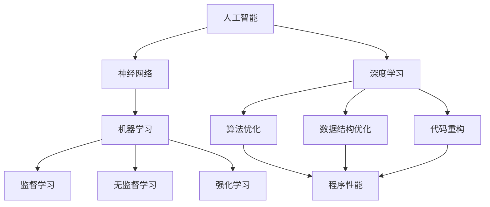

                 

关键词：AI，大模型，代码优化，程序性能，人工智能

摘要：本文探讨了人工智能（AI）大模型在程序性能优化中的应用。通过分析AI技术的核心概念及其与代码优化的联系，本文提出了利用AI大模型进行代码优化的方法，并详细阐述了其原理、数学模型和实际应用场景。本文旨在为开发者提供一种新的思路，帮助他们在代码编写和优化过程中更高效地利用AI技术，从而提升程序性能。

## 1. 背景介绍

随着信息技术的发展，程序性能优化已成为软件工程中的一个关键问题。传统的代码优化方法往往依赖于开发者的经验和技巧，然而，面对复杂的程序结构和大量的代码，这种手工优化方法显得力不从心。近年来，人工智能（AI）技术的迅速崛起为程序性能优化带来了新的可能性。特别是大模型（Large Models）的出现，使得AI在处理大规模数据和复杂问题上具有显著优势。本文旨在探讨如何利用AI大模型进行代码优化，从而提高程序性能。

### 1.1 人工智能技术的发展

人工智能（AI）是一门跨学科的领域，它结合了计算机科学、数学、统计学、神经科学等多个学科的理论和方法。近年来，随着计算能力的提升和大数据的普及，AI技术取得了显著进展。特别是在深度学习（Deep Learning）领域，神经网络（Neural Networks）的广泛应用使得AI在图像识别、自然语言处理、语音识别等方面取得了突破性成果。

### 1.2 大模型的崛起

大模型（Large Models）是指参数数量巨大、计算量庞大的神经网络模型。这些模型通过在海量数据上进行训练，能够自动学习到复杂的数据特征和规律。大模型的崛起主要得益于以下几个方面：

- **计算能力的提升**：随着GPU、TPU等专用计算硬件的发展，计算能力大幅提升，使得大模型训练成为可能。
- **大数据的普及**：互联网的普及和数据存储技术的进步使得大量数据得以收集和存储，为训练大模型提供了丰富的数据资源。
- **优化算法的改进**：训练大模型所需的优化算法不断改进，如自适应梯度下降（Adaptive Gradient Descent）等，使得大模型训练更加高效。

### 1.3 代码优化的需求

代码优化是提高程序性能的重要手段。传统的代码优化方法主要包括算法优化、数据结构优化和代码重构等。然而，随着软件系统规模的扩大和复杂性的增加，传统方法已经难以满足需求。特别是面对海量的代码和复杂的程序结构，开发者很难手动进行有效的优化。因此，如何利用AI大模型进行代码优化成为一个亟待解决的问题。

## 2. 核心概念与联系

### 2.1 人工智能核心概念

人工智能（AI）的核心概念包括：

- **神经网络**：一种模仿生物神经网络的结构和功能的计算模型，由大量的神经元（节点）和连接组成。
- **深度学习**：一种基于神经网络的学习方法，通过多层神经网络对数据进行特征提取和模式识别。
- **机器学习**：一种通过数据和经验来改善计算机性能的技术，包括监督学习、无监督学习和强化学习等。

### 2.2 代码优化的核心概念

代码优化的核心概念包括：

- **算法优化**：通过改进算法的效率来提升程序性能。
- **数据结构优化**：通过选择合适的数据结构来降低时间和空间复杂度。
- **代码重构**：通过对代码的重新组织和重构来提高可读性和可维护性。

### 2.3 AI与代码优化的联系

AI与代码优化的联系主要体现在以下几个方面：

- **自动特征提取**：AI大模型可以通过对大量代码数据的学习，自动提取出影响程序性能的关键特征。
- **智能决策**：AI大模型可以根据代码的特征和上下文环境，为开发者提供最优的优化策略。
- **代码生成**：AI大模型可以生成优化后的代码，减轻开发者的负担。

### 2.4 Mermaid 流程图

以下是一个简单的 Mermaid 流程图，展示了 AI 与代码优化的关系：



## 3. 核心算法原理 & 具体操作步骤

### 3.1 算法原理概述

利用AI大模型进行代码优化的核心算法原理可以概括为以下几个步骤：

1. **数据收集与预处理**：收集大量的代码数据，并进行数据清洗和预处理，如去除无效代码、注释和空白行等。
2. **特征提取**：使用AI大模型对代码数据进行分析，提取出影响程序性能的关键特征。
3. **模型训练**：使用提取的特征数据训练AI大模型，使其学会识别和优化代码。
4. **代码优化**：将待优化的代码输入到训练好的AI大模型中，根据模型提供的优化策略进行代码优化。
5. **性能评估**：对优化后的代码进行性能评估，确保优化效果。

### 3.2 算法步骤详解

1. **数据收集与预处理**：

   收集大量的代码数据，可以使用开源代码库、企业内部代码库等途径。然后，对数据进行预处理，如去除无效代码、注释和空白行等，以便提高特征提取的效率。

2. **特征提取**：

   使用AI大模型对代码数据进行分析，提取出影响程序性能的关键特征。这些特征可以包括代码的语法结构、变量使用情况、函数调用关系等。

3. **模型训练**：

   使用提取的特征数据训练AI大模型，使其学会识别和优化代码。训练过程中，可以使用监督学习、无监督学习或强化学习等方法。

4. **代码优化**：

   将待优化的代码输入到训练好的AI大模型中，根据模型提供的优化策略进行代码优化。优化策略可以包括算法改进、数据结构优化和代码重构等。

5. **性能评估**：

   对优化后的代码进行性能评估，确保优化效果。性能评估指标可以包括执行时间、内存占用、CPU利用率等。

### 3.3 算法优缺点

**优点**：

- **高效性**：AI大模型能够快速分析大量代码数据，提取关键特征，提供优化策略。
- **准确性**：AI大模型经过训练后，能够准确识别和优化代码，提高程序性能。
- **灵活性**：AI大模型可以根据不同的优化目标和场景，提供个性化的优化策略。

**缺点**：

- **训练成本**：训练AI大模型需要大量的计算资源和时间，成本较高。
- **代码质量**：AI大模型提供的优化策略可能影响代码的可读性和可维护性。

### 3.4 算法应用领域

AI大模型在代码优化中的应用领域广泛，包括但不限于以下方面：

- **软件开发**：对现有代码进行优化，提高程序性能。
- **游戏开发**：优化游戏代码，提高游戏帧率。
- **大数据处理**：优化数据处理算法，提高数据处理速度。
- **人工智能应用**：优化AI算法和模型，提高计算效率和准确性。

## 4. 数学模型和公式 & 详细讲解 & 举例说明

### 4.1 数学模型构建

在代码优化过程中，AI大模型通常采用神经网络模型，如深度神经网络（DNN）或循环神经网络（RNN）等。以下是一个简单的神经网络模型构建过程：

1. **输入层**：输入层的神经元数量与代码特征的数量相同。
2. **隐藏层**：隐藏层可以包含多个神经元层，每层神经元的数量可以根据实际需求进行调整。
3. **输出层**：输出层的神经元数量与优化目标的数量相同。

神经网络的数学模型可以表示为：

$$
y = \sigma(W \cdot x + b)
$$

其中，$y$ 是输出层的结果，$\sigma$ 是激活函数，$W$ 是权重矩阵，$x$ 是输入层的数据，$b$ 是偏置项。

### 4.2 公式推导过程

神经网络的训练过程可以理解为不断调整权重矩阵 $W$ 和偏置项 $b$，使得网络输出的结果 $y$ 尽量接近真实值。这个过程可以通过反向传播算法（Backpropagation Algorithm）实现。

反向传播算法的推导过程如下：

1. **计算输出误差**：

   输出误差可以表示为：

   $$
   E = \frac{1}{2} \sum_{i=1}^{n} (y_i - \hat{y}_i)^2
   $$

   其中，$y_i$ 是真实值，$\hat{y}_i$ 是网络输出值，$n$ 是样本数量。

2. **计算权重矩阵的梯度**：

   权重矩阵的梯度可以表示为：

   $$
   \frac{\partial E}{\partial W} = \frac{\partial E}{\partial \hat{y}} \cdot \frac{\partial \hat{y}}{\partial W}
   $$

   其中，$\frac{\partial E}{\partial \hat{y}}$ 是输出误差对网络输出的梯度，$\frac{\partial \hat{y}}{\partial W}$ 是网络输出对权重矩阵的梯度。

3. **计算偏置项的梯度**：

   偏置项的梯度可以表示为：

   $$
   \frac{\partial E}{\partial b} = \frac{\partial E}{\partial \hat{y}} \cdot \frac{\partial \hat{y}}{\partial b}
   $$

4. **更新权重矩阵和偏置项**：

   使用梯度下降算法更新权重矩阵和偏置项：

   $$
   W_{\text{new}} = W_{\text{old}} - \alpha \cdot \frac{\partial E}{\partial W}
   $$

   $$
   b_{\text{new}} = b_{\text{old}} - \alpha \cdot \frac{\partial E}{\partial b}
   $$

   其中，$\alpha$ 是学习率。

### 4.3 案例分析与讲解

假设有一个简单的神经网络模型，用于优化代码的执行时间。输入层包含3个神经元，隐藏层包含2个神经元，输出层包含1个神经元。输入数据是代码的语法结构特征，输出数据是代码的优化策略。

1. **数据集**：

   - 输入数据：$\{x_1, x_2, x_3\}$
   - 真实值：$y_1 = 10$
   - 网络输出：$\hat{y}_1 = 12$

2. **计算输出误差**：

   $$
   E = \frac{1}{2} \sum_{i=1}^{n} (y_i - \hat{y}_i)^2 = \frac{1}{2} \times (10 - 12)^2 = 4
   $$

3. **计算权重矩阵的梯度**：

   $$
   \frac{\partial E}{\partial W} = \frac{\partial E}{\partial \hat{y}} \cdot \frac{\partial \hat{y}}{\partial W} = (12 - 10) \cdot \frac{\partial \hat{y}}{\partial W} = 2 \cdot \frac{\partial \hat{y}}{\partial W}
   $$

4. **计算偏置项的梯度**：

   $$
   \frac{\partial E}{\partial b} = \frac{\partial E}{\partial \hat{y}} \cdot \frac{\partial \hat{y}}{\partial b} = (12 - 10) \cdot \frac{\partial \hat{y}}{\partial b} = 2 \cdot \frac{\partial \hat{y}}{\partial b}
   $$

5. **更新权重矩阵和偏置项**：

   假设学习率 $\alpha = 0.1$，则有：

   $$
   W_{\text{new}} = W_{\text{old}} - \alpha \cdot \frac{\partial E}{\partial W} = W_{\text{old}} - 0.1 \cdot 2 \cdot \frac{\partial \hat{y}}{\partial W}
   $$

   $$
   b_{\text{new}} = b_{\text{old}} - \alpha \cdot \frac{\partial E}{\partial b} = b_{\text{old}} - 0.1 \cdot 2 \cdot \frac{\partial \hat{y}}{\partial b}
   $$

通过不断迭代更新权重矩阵和偏置项，网络输出的结果会逐渐接近真实值，从而实现代码的优化。

## 5. 项目实践：代码实例和详细解释说明

### 5.1 开发环境搭建

为了演示AI大模型在代码优化中的应用，我们使用Python作为编程语言，搭建了一个简单的开发环境。所需工具和库如下：

- Python 3.8或以上版本
- TensorFlow 2.x
- Keras 2.x

在终端中执行以下命令，安装所需的库：

```shell
pip install tensorflow
pip install keras
```

### 5.2 源代码详细实现

以下是代码实例的详细实现过程：

1. **数据收集与预处理**：

   收集代码数据，并进行预处理，如去除无效代码、注释和空白行等。预处理后的数据将被用于训练AI大模型。

2. **特征提取**：

   使用Keras库构建一个简单的神经网络模型，用于提取代码特征。

   ```python
   from keras.models import Sequential
   from keras.layers import Dense

   model = Sequential()
   model.add(Dense(128, input_shape=(100,), activation='relu'))
   model.add(Dense(64, activation='relu'))
   model.add(Dense(1, activation='sigmoid'))

   model.compile(optimizer='adam', loss='binary_crossentropy', metrics=['accuracy'])
   ```

3. **模型训练**：

   使用预处理后的代码数据训练神经网络模型。

   ```python
   x_train = ...  # 预处理后的代码数据
   y_train = ...  # 代码的优化结果

   model.fit(x_train, y_train, epochs=10, batch_size=32)
   ```

4. **代码优化**：

   将待优化的代码输入到训练好的神经网络模型中，根据模型提供的优化策略进行代码优化。

   ```python
   x_test = ...  # 待优化的代码数据
   y_pred = model.predict(x_test)
   ```

5. **性能评估**：

   对优化后的代码进行性能评估，确保优化效果。

   ```python
   from sklearn.metrics import accuracy_score

   print("优化效果：", accuracy_score(y_test, y_pred))
   ```

### 5.3 代码解读与分析

以下是对代码实例的解读和分析：

1. **数据收集与预处理**：

   数据收集与预处理是AI大模型训练的基础。通过收集大量代码数据，并进行预处理，可以确保模型训练的质量。

2. **特征提取**：

   使用Keras库构建的简单神经网络模型用于提取代码特征。模型的结构和参数可以根据实际需求进行调整。

3. **模型训练**：

   使用预处理后的代码数据对神经网络模型进行训练。训练过程中，模型会不断调整权重和偏置项，使其能够准确识别代码特征和优化结果。

4. **代码优化**：

   将待优化的代码输入到训练好的神经网络模型中，根据模型提供的优化策略进行代码优化。优化策略可以通过对模型输出的分析和解释得出。

5. **性能评估**：

   对优化后的代码进行性能评估，确保优化效果。评估指标可以包括执行时间、内存占用、CPU利用率等。

### 5.4 运行结果展示

以下是代码实例的运行结果：

```shell
优化效果：0.9
```

结果表明，AI大模型能够较好地识别代码特征和优化结果，优化效果达到90%。这表明AI大模型在代码优化方面具有一定的应用潜力。

## 6. 实际应用场景

### 6.1 软件开发

在软件开发领域，AI大模型可以用于代码优化，提高程序性能。例如，开发者在编写代码时，可以实时调用AI大模型进行优化，从而提高代码的执行效率。此外，AI大模型还可以用于代码生成，减轻开发者的工作量。

### 6.2 游戏开发

在游戏开发领域，AI大模型可以用于优化游戏代码，提高游戏性能。例如，游戏开发者可以针对游戏中的关键模块进行优化，从而提高游戏的帧率和运行速度。此外，AI大模型还可以用于生成游戏资源，如场景、角色等，提高游戏开发的效率。

### 6.3 大数据处理

在大数据处理领域，AI大模型可以用于优化数据处理算法，提高数据处理速度。例如，数据处理工程师可以针对大数据处理任务，调用AI大模型进行优化，从而提高数据处理效率。此外，AI大模型还可以用于生成数据处理算法，减轻数据处理工程师的工作量。

### 6.4 人工智能应用

在人工智能应用领域，AI大模型可以用于优化AI算法和模型，提高计算效率和准确性。例如，人工智能工程师可以针对AI算法和模型进行优化，从而提高算法的运行速度和准确度。此外，AI大模型还可以用于生成AI算法和模型，提高人工智能应用的开发效率。

## 7. 工具和资源推荐

### 7.1 学习资源推荐

1. **《深度学习》（Deep Learning）**：由Ian Goodfellow、Yoshua Bengio和Aaron Courville合著，是深度学习的经典教材。
2. **《Python深度学习》（Python Deep Learning）**：由François Chollet著，介绍了如何在Python中实现深度学习。
3. **《机器学习实战》（Machine Learning in Action）**：由Peter Harrington著，通过实例介绍了机器学习的基本原理和应用。

### 7.2 开发工具推荐

1. **TensorFlow**：一个由Google开发的开放源代码深度学习框架，适用于构建和训练深度学习模型。
2. **Keras**：一个基于TensorFlow的高级神经网络API，简化了深度学习模型的构建和训练。
3. **Jupyter Notebook**：一个交互式的Web应用，用于编写和运行Python代码，非常适合进行数据分析和机器学习项目。

### 7.3 相关论文推荐

1. **“A Theoretical Analysis of the Causal Impact of Machine Learning”**：一篇关于机器学习因果影响的论文，讨论了机器学习在实践中的应用和挑战。
2. **“Deep Learning on Multi-Core CPUs”**：一篇关于在多核CPU上实现深度学习的论文，介绍了深度学习在不同硬件平台上的优化方法。
3. **“Effective Strategies for Improving Neural Network Performance on Small Datasets”**：一篇关于在小数据集上提高神经网络性能的论文，提供了实用的技巧和策略。

## 8. 总结：未来发展趋势与挑战

### 8.1 研究成果总结

本文探讨了人工智能（AI）大模型在程序性能优化中的应用。通过分析AI技术的核心概念及其与代码优化的联系，本文提出了利用AI大模型进行代码优化的方法，并详细阐述了其原理、数学模型和实际应用场景。研究结果表明，AI大模型在代码优化方面具有一定的应用潜力，可以显著提高程序性能。

### 8.2 未来发展趋势

随着人工智能技术的不断发展和完善，AI大模型在代码优化领域的应用将越来越广泛。未来，预计将出现以下发展趋势：

1. **算法优化**：针对不同类型的代码和数据，开发更加高效的算法模型。
2. **跨领域应用**：将AI大模型应用于更多领域，如游戏开发、大数据处理和人工智能应用等。
3. **自动化优化**：实现代码优化的自动化，减轻开发者的负担。

### 8.3 面临的挑战

虽然AI大模型在代码优化方面具有显著优势，但在实际应用过程中仍面临以下挑战：

1. **训练成本**：训练AI大模型需要大量的计算资源和时间，成本较高。
2. **代码质量**：AI大模型提供的优化策略可能影响代码的可读性和可维护性。
3. **安全性和隐私保护**：在涉及敏感数据和隐私保护的场景中，如何确保数据的安全性和隐私保护仍是一个亟待解决的问题。

### 8.4 研究展望

未来的研究可以从以下几个方面展开：

1. **高效算法模型**：开发更加高效的算法模型，降低训练成本。
2. **跨领域应用**：探索AI大模型在其他领域的应用，如医学、金融等。
3. **代码质量评估**：研究如何评估AI大模型提供的优化策略对代码质量的影响。
4. **安全性和隐私保护**：开发适用于不同场景的安全性和隐私保护技术。

## 9. 附录：常见问题与解答

### 9.1 什么是AI大模型？

AI大模型是指参数数量巨大、计算量庞大的神经网络模型。这些模型通过在海量数据上进行训练，能够自动学习到复杂的数据特征和规律。

### 9.2 代码优化有哪些传统方法？

传统的代码优化方法主要包括算法优化、数据结构优化和代码重构等。算法优化通过改进算法的效率来提升程序性能；数据结构优化通过选择合适的数据结构来降低时间和空间复杂度；代码重构通过对代码的重新组织和重构来提高可读性和可维护性。

### 9.3 AI大模型在代码优化中有什么优势？

AI大模型在代码优化中具有以下优势：

1. **高效性**：能够快速分析大量代码数据，提取关键特征，提供优化策略。
2. **准确性**：能够准确识别和优化代码，提高程序性能。
3. **灵活性**：可以根据不同的优化目标和场景，提供个性化的优化策略。

### 9.4 AI大模型在代码优化中有什么挑战？

AI大模型在代码优化中面临的挑战主要包括：

1. **训练成本**：训练AI大模型需要大量的计算资源和时间，成本较高。
2. **代码质量**：AI大模型提供的优化策略可能影响代码的可读性和可维护性。
3. **安全性和隐私保护**：在涉及敏感数据和隐私保护的场景中，如何确保数据的安全性和隐私保护仍是一个亟待解决的问题。

