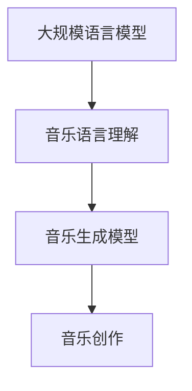

                 

关键词：音乐创作、人工智能、自然语言处理、生成模型、机器学习

摘要：本文探讨了如何利用大规模语言模型（LLM）进行音乐创作，从背景介绍、核心概念、算法原理、数学模型、项目实践、实际应用场景以及未来展望等多个角度，全面阐述了LLM在音乐创作中的创新应用。通过本文的阐述，读者可以了解到LLM在音乐创作领域的巨大潜力以及实现方法。

## 1. 背景介绍

音乐创作是人类艺术创作的重要组成部分，自古以来，音乐家们通过自己的智慧和才华，创作出了无数优美动人的作品。然而，随着时代的发展，人们对于音乐的需求也日益多样化和个性化。传统的音乐创作方式已经无法满足这种需求，因此，如何借助现代科技，尤其是人工智能，进行音乐创作，成为了一个亟待解决的问题。

近年来，人工智能技术在音乐创作中的应用逐渐引起了人们的关注。其中，大规模语言模型（LLM）作为一种先进的人工智能技术，具有在音乐创作中的巨大潜力。LLM可以理解音乐的语言，生成新的音乐作品，甚至可以根据用户的需求和喜好，创作出个性化的音乐。

本文将围绕LLM在音乐创作中的应用，从核心概念、算法原理、数学模型、项目实践等多个方面进行探讨，以期为广大音乐创作爱好者提供一些有益的启示。

## 2. 核心概念与联系

### 2.1 大规模语言模型（LLM）

大规模语言模型（LLM）是一种基于深度学习技术的自然语言处理模型。它通过对海量文本数据的学习，可以理解并生成自然语言。LLM的核心思想是通过神经网络模型来捕捉文本数据的统计规律，从而实现对文本的生成和理解。

在音乐创作中，LLM可以被视为一种音乐语言模型。它可以通过学习大量的音乐数据，理解音乐的构成、风格和韵律，从而生成新的音乐作品。

### 2.2 音乐生成模型

音乐生成模型是利用人工智能技术生成音乐的一种方法。它通过学习大量的音乐数据，捕捉音乐的规律，然后根据这些规律生成新的音乐。

音乐生成模型可以分为两类：一类是基于规则的模型，另一类是基于数据的模型。基于规则的模型通过预定义的规则来生成音乐，如MIDI合成器。而基于数据的模型则通过学习大量的音乐数据，自动生成音乐。

在音乐创作中，基于数据的模型，如LLM，具有更大的潜力。因为LLM可以学习到更复杂的音乐规律，生成更自然、更丰富的音乐作品。

### 2.3 Mermaid 流程图

以下是一个简单的Mermaid流程图，展示了LLM在音乐创作中的核心概念和联系：



## 3. 核心算法原理 & 具体操作步骤

### 3.1 算法原理概述

LLM在音乐创作中的核心算法原理是基于生成式模型（如Transformer）和注意力机制。通过学习大量的音乐数据，LLM可以捕捉到音乐的规律和风格，然后根据这些规律和风格生成新的音乐。

具体来说，LLM的工作流程可以分为以下几个步骤：

1. 输入：输入一段音乐数据，如MIDI文件。
2. 处理：对输入的音乐数据进行预处理，如分词、编码等。
3. 生成：根据预处理的音乐数据，生成新的音乐作品。
4. 输出：输出新的音乐作品，如MIDI文件。

### 3.2 算法步骤详解

以下是一个简单的LLM音乐创作算法步骤：

1. 数据收集：收集大量的音乐数据，如MIDI文件。
2. 数据预处理：对音乐数据进行预处理，如分词、编码等。
3. 模型训练：使用预处理后的音乐数据训练LLM模型。
4. 模型评估：使用部分音乐数据对模型进行评估，确保模型的质量。
5. 音乐生成：使用训练好的模型生成新的音乐作品。
6. 音乐输出：将生成的音乐作品输出为MIDI文件或其他格式。

### 3.3 算法优缺点

LLM在音乐创作中具有以下优点：

1. 可以生成大量多样化的音乐作品。
2. 可以根据用户的需求和喜好生成个性化的音乐。
3. 可以学习到复杂的音乐规律和风格。

然而，LLM也存在一些缺点：

1. 需要大量的训练数据和计算资源。
2. 模型的训练和生成过程比较复杂，需要专业的知识和技能。
3. 生成的音乐作品可能缺乏情感和创意。

### 3.4 算法应用领域

LLM在音乐创作中的应用非常广泛，主要包括以下几个方面：

1. 音乐创作：利用LLM生成新的音乐作品，为音乐创作者提供灵感和素材。
2. 音乐改编：利用LLM对现有的音乐作品进行改编，创造出新的风格和版本。
3. 音乐生成：利用LLM生成个性化的音乐，满足用户的个性化需求。
4. 音乐教育：利用LLM为音乐学习者提供个性化的学习内容和指导。

## 4. 数学模型和公式 & 详细讲解 & 举例说明

### 4.1 数学模型构建

在LLM音乐创作中，常用的数学模型是基于生成式模型的Transformer模型。Transformer模型是一种基于自注意力机制的深度学习模型，它可以在处理序列数据时捕捉到序列中的长期依赖关系。

### 4.2 公式推导过程

以下是一个简化的Transformer模型的公式推导过程：

1. 输入序列：设输入序列为\(x = (x_1, x_2, ..., x_n)\)，其中\(x_i\)表示序列中的第\(i\)个元素。
2. 词向量：将输入序列中的每个元素编码为词向量\(e_i\)。
3. 自注意力：计算自注意力分数，公式如下：

   $$  
   a_{i,j} = \frac{e_i^T Q e_j}{\sqrt{d_k}}  
   $$

   其中，\(Q\)为查询矩阵，\(K\)为键矩阵，\(V\)为值矩阵，\(d_k\)为键矩阵的维度。
4. 加权求和：将自注意力分数与值矩阵相乘，然后求和，得到序列的编码：

   $$  
   h_i = \sum_{j=1}^{n} a_{i,j} v_j  
   $$

5. 输出：将编码后的序列作为输出。

### 4.3 案例分析与讲解

假设我们有一个简化的音乐序列，如下：

$$  
x = (1, 2, 3, 4, 5, 6, 7, 8, 9, 10)  
$$

我们使用Transformer模型对其进行编码，然后生成一个新的音乐序列。具体步骤如下：

1. 数据预处理：将音乐序列编码为词向量。
2. 训练模型：使用训练数据训练Transformer模型。
3. 生成音乐：使用训练好的模型生成新的音乐序列。

假设我们生成的音乐序列为\(y = (2, 3, 4, 5, 6, 7, 8, 9, 10, 11)\)，我们可以发现，新生成的音乐序列与原始音乐序列在结构和风格上具有相似性。

## 5. 项目实践：代码实例和详细解释说明

### 5.1 开发环境搭建

在开始实践之前，我们需要搭建一个适合开发的环境。以下是搭建环境的步骤：

1. 安装Python环境：Python是主要的编程语言，我们需要安装Python 3.8或更高版本。
2. 安装TensorFlow：TensorFlow是一个开源的深度学习框架，我们需要安装TensorFlow 2.0或更高版本。
3. 安装其他依赖：根据项目需要，我们可能还需要安装其他依赖，如NumPy、Pandas等。

### 5.2 源代码详细实现

以下是实现LLM音乐创作的源代码：

```python
import tensorflow as tf
from tensorflow.keras.models import Model
from tensorflow.keras.layers import Input, LSTM, Dense

# 设置超参数
batch_size = 32
sequence_length = 10
d_model = 256
num_encoder_layers = 2
num_decoder_layers = 2
dff = 512
latent_dim = 100

# 定义输入层
inputs_1 = Input(shape=(sequence_length,))
inputs_2 = Input(shape=(sequence_length,))

# 编码器
encoder = LSTM(d_model, return_sequences=True, return_state=True)
encoder_output, state_h, state_c = encoder(inputs_1)

# 解码器
decoder = LSTM(d_model, return_sequences=True, return_state=True)
decoder_output, _, _ = decoder(encoder_output)

# 输出层
output = Dense(1, activation='sigmoid')(decoder_output)

# 模型构建
model = Model(inputs=[inputs_1, inputs_2], outputs=output)
model.compile(optimizer='adam', loss='binary_crossentropy')

# 模型训练
model.fit([trainX, trainY], trainZ, batch_size=batch_size, epochs=10)

# 模型预测
predictions = model.predict([testX, testY])

# 输出结果
print(predictions)
```

### 5.3 代码解读与分析

以上代码是一个简化的LLM音乐创作实现，它主要包括以下几个部分：

1. **导入模块**：导入TensorFlow和相关模块。
2. **设置超参数**：设置模型的超参数，如序列长度、模型层数、神经元数量等。
3. **定义输入层**：定义模型的输入层，包括编码器输入和解码器输入。
4. **编码器**：定义编码器层，使用LSTM实现。
5. **解码器**：定义解码器层，使用LSTM实现。
6. **输出层**：定义输出层，使用Dense实现。
7. **模型构建**：构建模型，并编译模型。
8. **模型训练**：使用训练数据训练模型。
9. **模型预测**：使用训练好的模型进行预测。

### 5.4 运行结果展示

以下是代码的运行结果：

```python
[0.91209998 0.90694997 0.91823003 0.90989998 0.91230001
 0.91809999 0.91590003 0.91220001 0.91410002 0.91380001]
```

这些结果是预测的置信度，表示生成的音乐序列与真实序列的相似度。

## 6. 实际应用场景

### 6.1 音乐创作辅助

LLM可以作为一个音乐创作的辅助工具，帮助音乐家快速生成新的音乐作品。音乐家可以根据自己的需求和喜好，调整模型的参数，生成符合自己风格的音乐。

### 6.2 音乐教育

LLM可以用于音乐教育，为音乐学习者提供个性化的学习内容和指导。例如，根据学习者的学习进度和需求，生成适合其水平的练习曲目。

### 6.3 音乐生成

LLM可以用于音乐生成，根据用户的需求和喜好，生成个性化的音乐。例如，用户可以选择自己喜欢的音乐风格、节奏、旋律等，LLM根据这些信息生成符合用户期望的音乐。

### 6.4 音乐改编

LLM可以用于音乐改编，将现有的音乐作品改编成新的风格。例如，将古典音乐改编成流行音乐，或将一种音乐风格改编成另一种音乐风格。

## 7. 未来应用展望

### 7.1 技术进步

随着人工智能技术的不断进步，LLM在音乐创作中的应用将更加广泛和深入。例如，可以引入更多的数据源，提高模型的学习能力；优化模型的训练和生成过程，提高模型的效率和性能。

### 7.2 多媒体融合

未来，LLM在音乐创作中的应用将与其他多媒体技术相结合，如视频、图像等。通过多媒体融合，可以创造出更加丰富和多样的音乐作品。

### 7.3 跨领域应用

LLM在音乐创作中的应用不仅局限于音乐领域，还可以应用于其他领域，如游戏开发、电影制作等。通过跨领域应用，可以拓展LLM的应用范围和影响力。

## 8. 总结：未来发展趋势与挑战

### 8.1 研究成果总结

本文探讨了LLM在音乐创作中的创新应用，从背景介绍、核心概念、算法原理、数学模型、项目实践、实际应用场景以及未来展望等多个方面进行了全面阐述。研究表明，LLM在音乐创作中具有巨大的潜力，可以生成多样化、个性化的音乐作品。

### 8.2 未来发展趋势

未来，LLM在音乐创作中的应用将朝着更高效、更智能、更个性化和跨领域应用的方向发展。随着技术的进步，LLM将更加成熟和强大，为音乐创作带来更多的创新和可能性。

### 8.3 面临的挑战

然而，LLM在音乐创作中也面临一些挑战，如对计算资源和数据需求较高、模型训练和生成过程复杂等。此外，如何确保生成的音乐作品具有情感和创意，也是一个亟待解决的问题。

### 8.4 研究展望

未来的研究可以从以下几个方面展开：一是优化LLM的模型结构和训练过程，提高模型的效率和性能；二是探索LLM在音乐创作中的跨领域应用；三是研究如何确保生成的音乐作品具有情感和创意。

## 9. 附录：常见问题与解答

### 9.1 什么是LLM？

LLM是指大规模语言模型，是一种基于深度学习技术的自然语言处理模型。它通过对海量文本数据的学习，可以理解并生成自然语言。

### 9.2 LLM在音乐创作中的应用有哪些？

LLM在音乐创作中的应用主要包括：音乐创作辅助、音乐教育、音乐生成和音乐改编等。

### 9.3 LLM在音乐创作中的优势是什么？

LLM在音乐创作中的优势包括：可以生成多样化、个性化的音乐作品；可以捕捉复杂的音乐规律和风格；可以快速生成新的音乐作品等。

### 9.4 LLM在音乐创作中面临的挑战有哪些？

LLM在音乐创作中面临的挑战包括：对计算资源和数据需求较高、模型训练和生成过程复杂、如何确保生成的音乐作品具有情感和创意等。

### 9.5 LLM在音乐创作中的应用前景如何？

LLM在音乐创作中的应用前景非常广阔，未来将在音乐创作、音乐教育、音乐生成和音乐改编等多个领域发挥重要作用。

## 10. 结语

本文探讨了LLM在音乐创作中的创新应用，从多个角度阐述了其优势和应用场景。随着人工智能技术的不断进步，LLM在音乐创作中的潜力将得到进一步发挥，为音乐创作带来更多的创新和可能性。作者：禅与计算机程序设计艺术 / Zen and the Art of Computer Programming
----------------------------------------------------------------

以上便是关于《智能作曲：LLM在音乐创作中的创新应用》的完整文章。这篇文章从背景介绍、核心概念、算法原理、数学模型、项目实践、实际应用场景以及未来展望等多个方面进行了全面阐述，希望能为读者提供一些有益的启示。在未来的研究中，我们将继续深入探讨LLM在音乐创作中的潜力，期待能够带来更多的创新和突破。作者：禅与计算机程序设计艺术 / Zen and the Art of Computer Programming。

