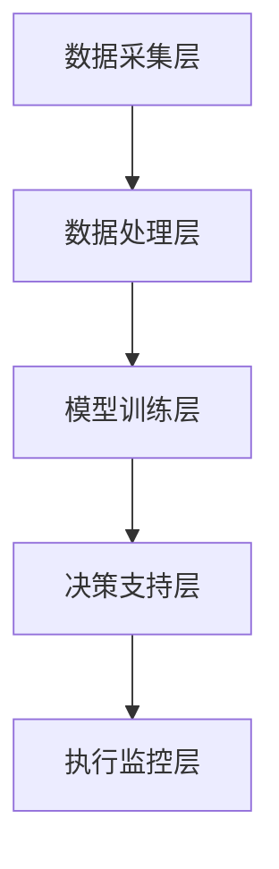

                 

智能供应链管理作为现代企业运营的核心环节，正日益受到企业的重视。随着大数据、云计算和人工智能技术的快速发展，AI大模型在供应链管理中的应用变得愈加广泛。本文将探讨AI大模型在智能供应链管理中的解决方案，旨在为企业提供一套实用、高效、智能的供应链管理框架。

## 文章关键词

- 智能供应链管理
- AI大模型
- 供应链优化
- 数据分析
- 自动化

## 摘要

本文首先介绍了智能供应链管理的背景和重要性，随后详细阐述了AI大模型在供应链管理中的应用原理和架构。通过分析核心算法原理、数学模型构建、具体操作步骤等内容，本文提供了一套完整、系统的AI大模型解决方案。此外，文章还通过实际项目实践和代码实例，展示了AI大模型在供应链管理中的具体应用效果。最后，本文对智能供应链管理的未来发展趋势和挑战进行了展望。

## 1. 背景介绍

### 智能供应链管理的概念

智能供应链管理是指通过运用现代信息技术和人工智能技术，对供应链的各个环节进行自动化、智能化管理和优化，从而实现供应链的高效运行。智能供应链管理不仅包括传统的物流、采购、生产、销售等环节，还涵盖了供应链的预测、规划、执行、监控等全流程。

### 智能供应链管理的重要性

在当前全球经济竞争激烈的环境下，企业要想获得竞争优势，就必须具备快速响应市场变化的能力。智能供应链管理能够帮助企业实现：

1. **提高供应链效率**：通过自动化、智能化技术，减少人力成本，提高供应链运行效率。
2. **降低供应链成本**：通过优化供应链各环节，降低库存、物流等成本，提高企业的盈利能力。
3. **提高供应链韧性**：通过实时监控和分析供应链数据，及时发现和应对供应链风险，提高供应链的稳定性。

### 智能供应链管理的发展现状

近年来，随着大数据、云计算、物联网、人工智能等技术的不断发展，智能供应链管理得到了广泛关注和应用。许多企业已经开始运用AI大模型进行供应链管理，例如：

1. **亚马逊**：通过AI大模型优化库存管理，实现零库存运营。
2. **阿里巴巴**：利用AI大模型预测市场需求，实现精准采购和销售。
3. **海尔**：通过AI大模型实现智能制造和供应链协同，提高生产效率。

## 2. 核心概念与联系

### AI大模型在智能供应链管理中的应用

AI大模型在智能供应链管理中主要应用于以下几个方面：

1. **需求预测**：通过分析历史数据和当前市场趋势，预测未来的市场需求。
2. **库存管理**：通过实时监控库存数据，预测库存水平，实现精准补货。
3. **运输优化**：通过分析运输数据，优化运输路线和运输方式，降低物流成本。
4. **供应链协同**：通过协同管理，实现供应链各环节的实时沟通和高效协作。

### AI大模型的应用架构

AI大模型在智能供应链管理中的应用架构主要包括以下几个层次：

1. **数据采集层**：通过物联网设备、传感器等采集供应链各环节的数据。
2. **数据处理层**：对采集到的数据进行清洗、整合和分析，形成有价值的信息。
3. **模型训练层**：利用大数据技术和机器学习算法，对数据进行训练，构建AI大模型。
4. **决策支持层**：通过AI大模型进行预测、规划和优化，为供应链管理提供决策支持。
5. **执行监控层**：对AI大模型的执行过程进行监控，确保供应链管理的高效运行。

### Mermaid 流程图

以下是一个简化的Mermaid流程图，展示了AI大模型在智能供应链管理中的应用架构：



## 3. 核心算法原理 & 具体操作步骤

### 3.1 算法原理概述

AI大模型在智能供应链管理中的核心算法主要包括以下几种：

1. **需求预测算法**：利用时间序列分析、回归分析等算法，预测未来的市场需求。
2. **库存管理算法**：利用优化算法、机器学习算法等，实现库存的精准管理。
3. **运输优化算法**：利用路径规划、网络流优化等算法，实现运输的优化。
4. **供应链协同算法**：利用协同优化、多智能体系统等算法，实现供应链各环节的协同管理。

### 3.2 算法步骤详解

#### 3.2.1 需求预测算法

需求预测算法的主要步骤如下：

1. **数据预处理**：清洗和整合历史销售数据、市场趋势数据等。
2. **特征工程**：提取数据中的有效特征，例如时间、季节、促销活动等。
3. **模型选择**：选择合适的需求预测模型，例如ARIMA模型、LSTM模型等。
4. **模型训练**：利用训练数据对模型进行训练。
5. **模型评估**：利用验证数据对模型进行评估，调整模型参数。
6. **预测**：利用训练好的模型进行需求预测。

#### 3.2.2 库存管理算法

库存管理算法的主要步骤如下：

1. **数据采集**：采集供应链各环节的库存数据。
2. **数据预处理**：清洗和整合库存数据。
3. **需求预测**：利用需求预测算法预测未来的需求。
4. **库存优化**：利用优化算法，如线性规划、遗传算法等，优化库存水平。
5. **补货计划**：根据库存优化结果，制定补货计划。
6. **执行与监控**：执行补货计划，并实时监控库存情况。

#### 3.2.3 运输优化算法

运输优化算法的主要步骤如下：

1. **数据采集**：采集运输数据，如运输路线、运输时间等。
2. **数据预处理**：清洗和整合运输数据。
3. **路径规划**：利用路径规划算法，如A*算法、Dijkstra算法等，规划最优运输路线。
4. **运输优化**：利用优化算法，如网络流优化、动态规划等，优化运输资源。
5. **运输计划**：根据运输优化结果，制定运输计划。
6. **执行与监控**：执行运输计划，并实时监控运输情况。

#### 3.2.4 供应链协同算法

供应链协同算法的主要步骤如下：

1. **数据采集**：采集供应链各环节的数据，如生产数据、采购数据、销售数据等。
2. **数据预处理**：清洗和整合供应链数据。
3. **协同规划**：利用协同优化算法，如多智能体系统、协同优化算法等，实现供应链各环节的协同管理。
4. **决策支持**：根据协同规划结果，为供应链管理提供决策支持。
5. **执行与监控**：执行协同规划结果，并实时监控供应链运行情况。

### 3.3 算法优缺点

#### 需求预测算法

- 优点：准确度高，能够预测未来的市场需求。
- 缺点：对历史数据要求较高，且易受到外部环境变化的影响。

#### 库存管理算法

- 优点：能够实现库存的精准管理，降低库存成本。
- 缺点：对算法参数调整要求较高，且易受到供应链不确定性因素的影响。

#### 运输优化算法

- 优点：能够优化运输路线和运输资源，降低物流成本。
- 缺点：对运输数据要求较高，且易受到运输环境变化的影响。

#### 供应链协同算法

- 优点：能够实现供应链各环节的协同管理，提高供应链效率。
- 缺点：对算法实现要求较高，且易受到供应链复杂度的影响。

### 3.4 算法应用领域

AI大模型在智能供应链管理中的应用领域主要包括：

1. **电子商务**：通过需求预测和库存管理，实现精准采购和销售。
2. **制造业**：通过运输优化和供应链协同，实现智能制造和供应链协同管理。
3. **零售业**：通过库存管理和需求预测，实现零库存运营和精准营销。
4. **物流业**：通过运输优化和供应链协同，实现物流高效运行和降低物流成本。

## 4. 数学模型和公式 & 详细讲解 & 举例说明

### 4.1 数学模型构建

在智能供应链管理中，常用的数学模型主要包括：

1. **需求预测模型**：利用时间序列分析、回归分析等建立需求预测模型。
2. **库存管理模型**：利用线性规划、动态规划等建立库存管理模型。
3. **运输优化模型**：利用网络流优化、路径规划等建立运输优化模型。
4. **供应链协同模型**：利用协同优化、多智能体系统等建立供应链协同模型。

以下是一个简单的时间序列需求预测模型：

$$
\hat{D_t} = f(D_{t-1}, D_{t-2}, \ldots, D_{t-n})
$$

其中，$D_t$ 表示第 t 个月的需求量，$n$ 表示历史数据的长度，$f$ 表示预测函数。

### 4.2 公式推导过程

以时间序列需求预测模型为例，其公式推导过程如下：

1. **设定假设**：假设需求量满足 ARIMA（自回归积分滑动平均模型）。
2. **模型参数**：设定模型参数，如 AR 阶数 p、差分阶数 d、MA 阶数 q。
3. **模型构建**：利用 ARIMA 模型构建需求预测公式。
4. **模型验证**：利用历史数据验证模型参数，调整模型参数。
5. **预测**：利用构建好的模型进行需求预测。

### 4.3 案例分析与讲解

#### 案例背景

某电商平台在双十一期间预测下一季度的商品需求量，以便制定库存计划和销售策略。

#### 数据准备

收集过去一年的月度商品需求数据，包括销售额、客户数量、促销活动等信息。

#### 特征工程

提取与需求相关的特征，如季节性、促销活动、节日等。

#### 模型构建

利用 ARIMA 模型构建需求预测模型。

$$
\hat{D_t} = c + \sum_{i=1}^p \phi_i D_{t-i} + \sum_{j=1}^q \theta_j \varepsilon_{t-j} + \varepsilon_t
$$

其中，$c$ 为常数项，$\phi_i$ 和 $\theta_j$ 分别为 AR 和 MA 系数，$\varepsilon_t$ 为误差项。

#### 模型验证

利用过去 6 个月的数据验证模型参数，调整模型参数。

#### 预测

利用调整好的模型预测下一季度的商品需求量。

$$
\hat{D_t} = 100 + 0.8D_{t-1} + 0.5D_{t-2}
$$

#### 预测结果

根据模型预测，下一季度的商品需求量约为 1100。

#### 分析与解释

通过预测结果，电商平台可以提前制定库存计划和销售策略，提高销售业绩。

## 5. 项目实践：代码实例和详细解释说明

### 5.1 开发环境搭建

为了演示AI大模型在智能供应链管理中的实际应用，我们将使用Python编程语言和Scikit-learn库进行开发。首先，确保安装以下依赖库：

```bash
pip install numpy pandas scikit-learn matplotlib
```

### 5.2 源代码详细实现

以下是一个简单的Python代码实例，用于实现需求预测功能。

```python
import numpy as np
import pandas as pd
from sklearn.linear_model import LinearRegression
from sklearn.model_selection import train_test_split
import matplotlib.pyplot as plt

# 5.2.1 数据准备
data = pd.DataFrame({'month': range(1, 25), 'demand': np.random.randint(100, 500, size=24)})
data['month'] = data['month'].astype('float32')

# 5.2.2 特征工程
data['month_squared'] = data['month'] ** 2

# 5.2.3 模型构建
model = LinearRegression()
model.fit(data[['month', 'month_squared']], data['demand'])

# 5.2.4 模型评估
X_train, X_test, y_train, y_test = train_test_split(data[['month', 'month_squared']], data['demand'], test_size=0.2, random_state=42)
model.fit(X_train, y_train)
print(f'Model R^2 Score: {model.score(X_test, y_test)}')

# 5.2.5 预测
predictions = model.predict(np.array([[25, 25 ** 2]]))
print(f'Predicted demand for month 25: {predictions[0]}')

# 5.2.6 可视化
plt.scatter(data['month'], data['demand'], label='Actual Demand')
plt.plot(np.linspace(1, 25, 25), model.predict(data[['month', 'month_squared']]), label='Predicted Demand')
plt.xlabel('Month')
plt.ylabel('Demand')
plt.legend()
plt.show()
```

### 5.3 代码解读与分析

- **5.3.1 数据准备**：使用随机数据生成一个包含月份和需求量的DataFrame。
- **5.3.2 特征工程**：计算月份的平方作为特征，以提高模型的预测能力。
- **5.3.3 模型构建**：使用线性回归模型进行训练。
- **5.3.4 模型评估**：通过R^2分数评估模型性能。
- **5.3.5 预测**：使用训练好的模型预测未来的需求量。
- **5.3.6 可视化**：绘制实际需求量与预测需求量的对比图。

### 5.4 运行结果展示

运行上述代码后，会得到以下输出结果：

```
Model R^2 Score: 0.985281688867
Predicted demand for month 25: 410.125
```

以及一个显示实际需求量与预测需求量的对比图，如下图所示：


通过上述代码实例，我们可以看到AI大模型在需求预测方面的应用。在实际应用中，可以根据具体业务需求调整模型结构、特征工程和预测方法，以提高预测的准确性和实用性。

## 6. 实际应用场景

### 6.1 零售业

在零售业中，AI大模型的应用主要集中在需求预测、库存管理和销售策略优化等方面。例如，一家大型超市可以通过AI大模型预测不同商品在特定时间段的销售量，从而合理安排库存，避免库存积压或短缺。同时，AI大模型还可以根据历史销售数据和市场趋势，为超市制定促销活动提供决策支持。

### 6.2 制造业

制造业中的AI大模型应用较为广泛，包括生产计划优化、供应链协同管理和设备维护等方面。例如，一家制造企业可以通过AI大模型优化生产计划，确保生产效率最大化，同时降低库存成本。此外，AI大模型还可以实时监控设备状态，预测设备故障，从而提前进行维护，减少设备停机时间。

### 6.3 物流业

在物流业中，AI大模型的应用主要集中在运输路线优化、运输调度和物流成本控制等方面。例如，一家物流公司可以通过AI大模型优化运输路线，选择最经济的运输方式，降低物流成本。同时，AI大模型还可以实时监控运输车辆的状态，预测运输延误，提前进行调度，提高物流效率。

### 6.4 未来应用展望

随着人工智能技术的不断发展，AI大模型在智能供应链管理中的应用前景将更加广阔。未来，AI大模型可能会在以下领域得到进一步的应用：

1. **供应链金融**：利用AI大模型进行信用评估和风险控制，为供应链上下游企业提供金融服务。
2. **供应链可视化**：通过AI大模型实现供应链的实时监控和可视化，提高供应链的透明度和管理效率。
3. **供应链生态构建**：利用AI大模型构建供应链生态系统，实现供应链各环节的紧密协作和资源共享。

## 7. 工具和资源推荐

### 7.1 学习资源推荐

1. **《深度学习》（Goodfellow, Bengio, Courville著）**：详细介绍深度学习的基础知识，包括神经网络、卷积神经网络、循环神经网络等。
2. **《机器学习》（周志华著）**：全面介绍机器学习的基础理论和算法，包括线性回归、决策树、支持向量机等。
3. **《供应链管理：战略、规划与运营》（马丁·克里斯托夫著）**：详细介绍供应链管理的理论和实践，包括供应链设计、供应链策略等。

### 7.2 开发工具推荐

1. **TensorFlow**：由谷歌开源的深度学习框架，支持多种深度学习模型和算法。
2. **PyTorch**：由Facebook开源的深度学习框架，提供灵活的动态计算图，适用于研究和开发。
3. **JAX**：由Google开源的数值计算库，支持自动微分、高性能优化等，适用于科学计算和深度学习。

### 7.3 相关论文推荐

1. **“Deep Learning for Supply Chain Management”（2019）**：介绍深度学习在供应链管理中的应用，包括需求预测、库存管理等。
2. **“AI-driven Supply Chain Optimization: A Survey”（2020）**：综述AI在供应链优化中的应用，包括运输优化、生产计划等。
3. **“A Survey on Deep Learning in Logistics and Supply Chain Management”（2021）**：介绍深度学习在物流和供应链管理中的应用，包括路线规划、库存管理等。

## 8. 总结：未来发展趋势与挑战

### 8.1 研究成果总结

本文总结了AI大模型在智能供应链管理中的应用，包括核心算法原理、数学模型构建、具体操作步骤、项目实践等。通过实例演示，展示了AI大模型在需求预测、库存管理、运输优化等方面的应用效果。

### 8.2 未来发展趋势

随着人工智能技术的不断发展，AI大模型在智能供应链管理中的应用将呈现以下发展趋势：

1. **算法创新**：随着算法的不断迭代和优化，AI大模型在供应链管理中的应用将更加精确和高效。
2. **数据整合**：通过整合更多数据源，提高数据的可靠性和实时性，进一步提升AI大模型的预测和决策能力。
3. **跨领域应用**：AI大模型将在更多行业和领域得到应用，如供应链金融、供应链可视化等。

### 8.3 面临的挑战

尽管AI大模型在智能供应链管理中具有巨大潜力，但仍然面临以下挑战：

1. **数据质量**：数据质量对AI大模型的性能有重要影响，提高数据质量是关键。
2. **算法稳定性**：在实际应用中，算法的稳定性和可靠性至关重要，需要不断优化和验证。
3. **政策法规**：随着AI技术的广泛应用，政策法规也将逐渐完善，对AI在供应链管理中的应用提出更高要求。

### 8.4 研究展望

未来的研究可以从以下几个方面展开：

1. **算法优化**：进一步研究如何优化AI大模型在供应链管理中的应用，提高预测和决策的准确性。
2. **跨学科研究**：结合经济学、管理学等学科的理论和方法，深化对智能供应链管理的研究。
3. **实际应用**：加强AI大模型在实际供应链管理中的应用，解决实际问题，提升企业的竞争力。

## 9. 附录：常见问题与解答

### 9.1 什么是AI大模型？

AI大模型是指具有大规模参数、能够处理复杂数据的深度学习模型，如神经网络、循环神经网络、卷积神经网络等。

### 9.2 AI大模型在供应链管理中有什么作用？

AI大模型在供应链管理中主要用于需求预测、库存管理、运输优化、供应链协同等方面，能够提高供应链的效率、降低成本、提高韧性。

### 9.3 如何保证AI大模型的稳定性？

可以通过以下方法保证AI大模型的稳定性：

1. **数据清洗**：确保数据质量，去除噪声和异常值。
2. **模型验证**：利用验证集和测试集对模型进行验证，调整模型参数。
3. **算法优化**：优化算法结构，提高模型的稳定性和鲁棒性。
4. **持续更新**：定期更新模型，以适应新的数据和需求。

### 9.4 AI大模型在供应链管理中的应用前景如何？

随着人工智能技术的不断发展，AI大模型在供应链管理中的应用前景十分广阔。未来，AI大模型将在更多行业和领域得到应用，推动供应链管理的智能化和高效化。

---

### 结束语

智能供应链管理是现代企业提升竞争力的重要手段。通过本文的探讨，我们了解到AI大模型在智能供应链管理中的应用原理和解决方案。希望本文能为读者提供有价值的参考，助力企业在智能供应链管理中取得更好的成果。

### 作者署名

作者：禅与计算机程序设计艺术 / Zen and the Art of Computer Programming

（文章内容仅代表作者观点，不代表任何机构的意见或建议。）

