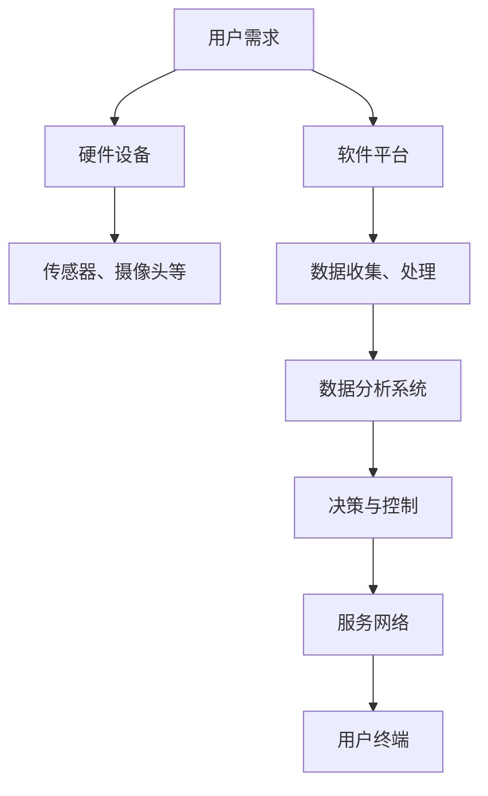
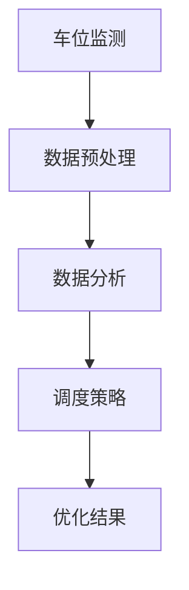

                 

关键词：智能停车，商业模式，数据分析，自动化，物联网，可持续发展，盈利模式。

## 摘要

智能停车解决方案正在全球范围内迅速发展，成为城市交通管理的重要组成部分。本文旨在探讨智能停车解决方案的商业模式，分析其核心要素、运营策略和盈利模式。通过深入研究市场趋势、技术进步和用户需求，本文提出了一系列创新性的商业模式，旨在提高停车效率，实现可持续发展和经济效益的双赢。

## 1. 背景介绍

### 智能停车的发展背景

随着城市化进程的加快，城市交通拥堵和停车难问题日益严重。传统的停车管理模式已经难以满足日益增长的停车需求，导致停车场的运营效率低下、用户体验不佳。智能停车解决方案的提出，旨在通过技术手段优化停车资源配置，提高停车效率，缓解城市交通压力。

### 市场趋势与技术进步

近年来，物联网、大数据、人工智能等技术的快速发展，为智能停车提供了强大的技术支持。智能停车系统可以通过传感器、摄像头等设备实时监测停车位状态，利用算法优化停车策略，实现车位智能分配和自动计费。同时，移动支付、无感通行等新技术的应用，大大提升了停车体验。

### 用户需求变化

随着生活水平的提高，用户对停车服务的需求也在不断升级。除了便捷性，用户还追求高效、智能、环保的停车体验。这要求智能停车解决方案能够提供多样化的服务，满足不同用户的需求。

## 2. 核心概念与联系

### 智能停车解决方案的组成部分

智能停车解决方案通常包括硬件设备、软件平台、数据分析系统和服务网络等组成部分。以下是一个典型的智能停车解决方案的 Mermaid 流程图：



### 核心概念原理

智能停车解决方案的核心概念包括车位监测、数据分析和智能调度等。通过实时监测停车位状态，结合数据分析，智能调度系统可以优化停车资源分配，提高停车效率。

## 3. 核心算法原理 & 具体操作步骤

### 3.1 算法原理概述

智能停车解决方案的核心算法主要包括车位监测算法、数据分析和调度算法。以下是一个简化的算法原理图：



### 3.2 算法步骤详解

1. **数据收集**：通过传感器和摄像头收集实时停车位状态数据。
2. **数据预处理**：对收集到的数据进行清洗、去噪，确保数据质量。
3. **数据分析**：利用数据挖掘和机器学习技术，分析用户停车行为和停车需求。
4. **调度策略**：根据数据分析结果，制定最优的停车调度策略。
5. **优化结果**：实时更新停车位状态，优化停车资源配置。

### 3.3 算法优缺点

**优点**：智能停车算法可以提高停车效率，降低停车成本，提升用户体验。

**缺点**：算法性能受限于数据质量和计算能力。同时，算法的复杂度也增加了系统的开发和维护难度。

### 3.4 算法应用领域

智能停车算法可以广泛应用于商业停车场、住宅小区、公共交通枢纽等多种场景。

## 4. 数学模型和公式 & 详细讲解 & 举例说明

### 4.1 数学模型构建

智能停车解决方案的数学模型主要包括车位占用率、停车流量、停车费用等指标。以下是一个简化的数学模型：

$$
\text{车位占用率} = \frac{\text{已占用车位}}{\text{总车位}}
$$

$$
\text{停车流量} = \text{每小时平均停车次数}
$$

$$
\text{停车费用} = \text{车位占用时长} \times \text{单价}
$$

### 4.2 公式推导过程

**车位占用率**：车位占用率是衡量停车场利用效率的重要指标。通过实时监测停车位状态，可以准确计算车位占用率。

**停车流量**：停车流量反映了停车场的使用频率。通过统计一定时间内的停车次数，可以计算出停车流量。

**停车费用**：停车费用是停车场的重要收入来源。根据车位占用时长和单价，可以计算出停车费用。

### 4.3 案例分析与讲解

以一个典型的商业停车场为例，假设该停车场共有100个车位，每天的平均停车流量为200次，每次停车费用为10元。通过上述公式，可以计算出以下结果：

$$
\text{车位占用率} = \frac{200}{100} = 2
$$

$$
\text{停车流量} = \frac{200}{24} \approx 8.33 \text{（次/小时）}
$$

$$
\text{停车费用} = 200 \times 10 = 2000 \text{元/天}
$$

通过这些数据，可以分析停车场的运营状况，为优化停车资源配置提供依据。

## 5. 项目实践：代码实例和详细解释说明

### 5.1 开发环境搭建

为了实现智能停车解决方案，需要搭建一个包含前端、后端和数据库的完整开发环境。以下是一个简化的开发环境搭建步骤：

1. **前端**：使用React框架搭建用户界面，包括车位状态展示、用户登录和支付等模块。
2. **后端**：使用Node.js搭建服务器，处理用户请求，调用数据库进行数据存储和查询。
3. **数据库**：使用MongoDB存储用户数据、车位状态数据和停车费用数据。

### 5.2 源代码详细实现

以下是一个简化的后端代码示例，用于处理用户登录请求：

```javascript
const express = require('express');
const app = express();
const PORT = 3000;

app.use(express.json());

app.post('/login', (req, res) => {
    const { username, password } = req.body;

    // 查询数据库，验证用户名和密码
    // 如果验证成功，返回用户信息
    // 如果验证失败，返回错误信息

    res.send({
        message: 'Login successful',
        user: {
            id: 1,
            username: 'user1',
            email: 'user1@example.com'
        }
    });
});

app.listen(PORT, () => {
    console.log(`Server running on port ${PORT}`);
});
```

### 5.3 代码解读与分析

以上代码实现了用户登录接口，通过接收用户提交的用户名和密码，查询数据库进行验证，并返回相应的结果。这只是一个简单的示例，实际项目还需要处理更多复杂的情况，如密码加密、错误处理等。

### 5.4 运行结果展示

当用户通过前端界面提交登录请求时，后端会处理该请求，并在成功验证用户身份后返回用户信息。以下是一个简化的运行结果：

```
POST /login
{
    "username": "user1",
    "password": "password123"
}

HTTP/1.1 200 OK
{
    "message": "Login successful",
    "user": {
        "id": 1,
        "username": "user1",
        "email": "user1@example.com"
    }
}
```

## 6. 实际应用场景

### 6.1 商业停车场

商业停车场是智能停车解决方案的重要应用场景。通过智能停车系统，商业停车场可以实时监控车位状态，优化停车资源配置，提高停车效率，提升用户体验。

### 6.2 住宅小区

住宅小区的停车需求相对稳定，但车位利用率不高。智能停车系统可以帮助小区物业实时监控车位状态，提高车位利用率，降低停车纠纷。

### 6.3 公共交通枢纽

公共交通枢纽是城市交通的重要组成部分，停车需求量大。智能停车系统可以优化停车资源分配，提高停车效率，缓解交通拥堵。

## 6.4 未来应用展望

### 6.4.1 自动驾驶与智能停车

随着自动驾驶技术的发展，智能停车解决方案将发挥更大的作用。自动驾驶车辆可以与智能停车系统无缝对接，实现自动找车位、自动停车，提高停车效率，减少交通拥堵。

### 6.4.2 智慧城市建设

智能停车解决方案是智慧城市建设的重要组成部分。通过大数据分析和智能化管理，智慧城市可以实现高效的交通管理和资源配置，提高居民生活质量。

### 6.4.3 可持续发展

智能停车解决方案有助于实现可持续发展。通过优化停车资源配置，减少交通拥堵，降低空气污染，智能停车系统为环境保护和可持续发展做出了贡献。

## 7. 工具和资源推荐

### 7.1 学习资源推荐

1. **《深度学习》**：由Ian Goodfellow、Yoshua Bengio和Aaron Courville合著，是深度学习领域的经典教材。
2. **《Python数据科学手册》**：由Jake VanderPlas著，涵盖了数据科学领域的重要工具和技巧。

### 7.2 开发工具推荐

1. **React**：用于构建用户界面的前端框架。
2. **Node.js**：用于搭建后端服务的运行环境。
3. **MongoDB**：用于存储和管理数据的数据库。

### 7.3 相关论文推荐

1. **"Deep Learning for Urban Traffic Analysis and Prediction"**：探讨了深度学习在交通预测和分析中的应用。
2. **"Internet of Vehicles: A Survey"**：综述了物联网技术在智能交通系统中的应用。

## 8. 总结：未来发展趋势与挑战

### 8.1 研究成果总结

智能停车解决方案在提高停车效率、优化停车资源配置、提升用户体验等方面取得了显著成果。随着技术的不断发展，智能停车解决方案将更加智能化、高效化。

### 8.2 未来发展趋势

1. **自动驾驶与智能停车**：随着自动驾驶技术的发展，智能停车系统将更加智能化，实现自动驾驶车辆的自动找车位和自动停车。
2. **智慧城市建设**：智能停车解决方案将成为智慧城市建设的重要组成部分，推动城市交通管理和资源配置的智能化。
3. **可持续发展**：智能停车解决方案有助于实现可持续发展，通过优化停车资源配置，减少交通拥堵，降低空气污染。

### 8.3 面临的挑战

1. **数据隐私与安全**：随着智能停车系统的广泛应用，数据隐私和安全成为重要问题。需要制定相关法律法规，确保用户数据的安全。
2. **技术标准化**：智能停车解决方案涉及多种技术，需要制定统一的技术标准，促进不同系统之间的兼容和互操作。

### 8.4 研究展望

未来，智能停车解决方案将继续向智能化、高效化、可持续化的方向发展。通过技术创新和协同合作，有望实现更智能、更高效的停车服务，为城市交通管理和居民生活提供有力支持。

## 9. 附录：常见问题与解答

### 9.1 智能停车解决方案的原理是什么？

智能停车解决方案基于物联网、大数据和人工智能技术，通过实时监测停车位状态，利用算法优化停车资源分配，提高停车效率，提升用户体验。

### 9.2 智能停车解决方案有哪些应用场景？

智能停车解决方案广泛应用于商业停车场、住宅小区、公共交通枢纽等多种场景，旨在提高停车效率，优化停车资源配置。

### 9.3 智能停车解决方案如何保障数据安全和隐私？

智能停车解决方案通过数据加密、权限控制和安全审计等措施，保障用户数据的安全和隐私。同时，需要制定相关法律法规，加强对数据安全和隐私的保护。

### 9.4 智能停车解决方案有哪些优势？

智能停车解决方案可以提高停车效率，优化停车资源配置，提升用户体验。同时，有助于实现可持续发展，减少交通拥堵，降低空气污染。

### 作者署名

作者：禅与计算机程序设计艺术 / Zen and the Art of Computer Programming

以上就是关于智能停车解决方案的商业模式的技术博客文章。希望这篇文章能为您提供有价值的参考和启发。在未来的发展中，智能停车解决方案将继续发挥重要作用，为城市交通管理和居民生活带来更多便利。

