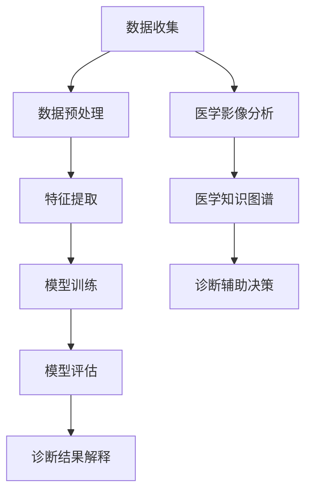

                 

关键词：智能医疗、AI大模型、医疗诊断、深度学习、数据隐私、个性化治疗、跨学科合作、云计算、边缘计算、医疗伦理

> 摘要：本文深入探讨了智能医疗诊断领域中的AI大模型解决方案，分析了其核心概念、算法原理、数学模型、实践应用，并展望了未来发展趋势和面临的挑战。通过本文的阐述，希望能够为医学界和科技界提供一种全新的视角，助力医疗诊断的智能化发展。

## 1. 背景介绍

随着人工智能（AI）技术的飞速发展，医疗领域迎来了全新的变革。传统的医疗诊断方式往往依赖于医生的丰富经验和医疗设备的检测结果，这种方式在效率和准确性上都存在一定的局限性。而AI大模型的引入，则为医疗诊断提供了全新的解决方案。AI大模型通过深度学习、大数据分析等先进技术，可以从海量医疗数据中提取有价值的信息，为医生提供辅助诊断和个性化治疗方案。

智能医疗诊断的AI大模型解决方案主要包括以下几个方面：

1. **数据收集与预处理**：收集大量医疗数据，包括患者的病史、体检报告、医学影像等，并进行预处理，以消除噪声和异常值，提高数据质量。

2. **特征提取与选择**：从预处理后的数据中提取关键特征，并筛选出对诊断具有重要意义的特征，以减少模型训练的复杂性。

3. **模型训练与优化**：利用深度学习算法，对大量医疗数据进行训练，优化模型参数，使其能够准确识别不同疾病的特征。

4. **模型评估与验证**：通过交叉验证、混淆矩阵等方法，对训练好的模型进行评估和验证，确保其诊断准确性和可靠性。

5. **诊断结果解释与可视化**：将模型的诊断结果进行解释和可视化，帮助医生理解模型的工作原理和诊断依据。

## 2. 核心概念与联系

### 2.1. 深度学习

深度学习是AI领域中的一种重要技术，它通过模拟人脑神经元网络的结构和功能，实现数据的自动学习和特征提取。在智能医疗诊断中，深度学习算法被广泛应用于图像识别、自然语言处理和序列数据建模等方面。

### 2.2. 大数据

大数据是指海量、多样、快速的数据。在智能医疗诊断中，大数据技术被用于收集、存储和管理大量医疗数据，为AI大模型的训练提供丰富的数据资源。

### 2.3. 医学影像

医学影像是医疗诊断中重要的一环，包括X光、CT、MRI等。通过深度学习算法，可以自动识别和分析医学影像，提高诊断效率和准确性。

### 2.4. 医学知识图谱

医学知识图谱是一种用于表示医学知识的数据结构，它将医学领域的知识进行结构化和关联，为AI大模型提供丰富的知识支持。

## 2.5. Mermaid 流程图

下面是智能医疗诊断的AI大模型解决方案的 Mermaid 流程图：



## 3. 核心算法原理 & 具体操作步骤

### 3.1. 算法原理概述

智能医疗诊断的AI大模型解决方案主要基于深度学习算法，包括卷积神经网络（CNN）、循环神经网络（RNN）和生成对抗网络（GAN）等。这些算法通过多层次的神经网络结构，实现对复杂医疗数据的自动学习和特征提取。

### 3.2. 算法步骤详解

1. **数据收集**：从各种医疗数据源（如电子病历、医学影像库、基因数据库等）收集大量医疗数据。

2. **数据预处理**：对收集到的医疗数据进行清洗、归一化和数据增强等预处理操作，以提高数据质量和模型的泛化能力。

3. **特征提取**：利用深度学习算法，从预处理后的数据中提取关键特征。对于医学影像数据，可以使用CNN提取图像特征；对于电子病历数据，可以使用RNN提取序列特征。

4. **模型训练**：使用预处理后的数据，训练深度学习模型。在训练过程中，通过反向传播算法优化模型参数，使其能够准确识别不同疾病的特征。

5. **模型评估**：使用交叉验证等方法，对训练好的模型进行评估，确保其诊断准确性和可靠性。

6. **诊断结果解释**：将模型的诊断结果进行解释和可视化，帮助医生理解模型的工作原理和诊断依据。

### 3.3. 算法优缺点

优点：

- **高诊断准确性**：通过深度学习算法，可以从海量医疗数据中提取有价值的信息，提高诊断准确性。
- **自动特征提取**：深度学习算法可以自动提取复杂医疗数据的特征，减少人工干预。
- **跨学科融合**：智能医疗诊断的AI大模型解决方案融合了医学、计算机科学、人工智能等学科的知识，为跨学科合作提供了新的契机。

缺点：

- **数据需求量大**：深度学习模型需要大量医疗数据才能训练出高准确性的模型，这对于数据资源有限的医疗机构来说是一个挑战。
- **计算资源消耗**：深度学习模型的训练和推理过程需要大量计算资源，对于硬件设备要求较高。

### 3.4. 算法应用领域

智能医疗诊断的AI大模型解决方案可以应用于多个领域，包括：

- **疾病诊断**：如癌症、心脏病、肺炎等疾病的早期筛查和诊断。
- **个性化治疗**：根据患者的病情和基因信息，制定个性化的治疗方案。
- **医学影像分析**：自动识别和分析医学影像，提高诊断效率和准确性。
- **基因测序分析**：从基因序列中提取有价值的信息，为遗传病诊断和个性化治疗提供支持。

## 4. 数学模型和公式 & 详细讲解 & 举例说明

### 4.1. 数学模型构建

在智能医疗诊断的AI大模型中，常用的数学模型包括卷积神经网络（CNN）和循环神经网络（RNN）。

**CNN模型**：

CNN模型的主要组成部分包括卷积层、池化层和全连接层。其中，卷积层用于提取图像特征，池化层用于降低特征维度，全连接层用于分类。

- **卷积层**：卷积层通过卷积操作提取图像的特征。卷积操作的数学公式如下：

  $$  
  f(x, y) = \sum_{i=1}^{n} w_i \cdot \sigma(z_i)  
  $$

  其中，$f(x, y)$表示卷积操作的结果，$w_i$表示卷积核的权重，$\sigma(z_i)$表示激活函数，如ReLU函数。

- **池化层**：池化层用于降低特征维度，常用的池化操作包括最大池化和平均池化。最大池化的数学公式如下：

  $$  
  p(x, y) = \max\{f(x, y)\}  
  $$

  其中，$p(x, y)$表示池化操作的结果。

- **全连接层**：全连接层将池化层提取的特征进行分类，常用的分类器包括softmax分类器。softmax分类器的数学公式如下：

  $$  
  \hat{y} = \frac{e^{z}}{\sum_{i=1}^{n} e^{z_i}}  
  $$

  其中，$\hat{y}$表示预测结果，$z$表示全连接层的输出，$z_i$表示第$i$个神经元的输出。

**RNN模型**：

RNN模型用于处理序列数据，其核心组成部分包括隐藏层和循环连接。RNN模型的数学公式如下：

$$  
h_t = \sigma(W_h \cdot [h_{t-1}, x_t] + b_h)  
$$

$$  
y_t = W_o \cdot h_t + b_o  
$$

其中，$h_t$表示第$t$个时间步的隐藏层状态，$x_t$表示第$t$个时间步的输入，$W_h$和$W_o$分别表示隐藏层和输出层的权重矩阵，$b_h$和$b_o$分别表示隐藏层和输出层的偏置，$\sigma$表示激活函数，如ReLU函数。

### 4.2. 公式推导过程

以CNN模型为例，我们详细介绍CNN模型中卷积层、池化层和全连接层的数学公式推导过程。

**卷积层**：

卷积层的输入是一个$N \times M$的图像，输出是一个$P \times Q$的特征图。假设卷积核的大小为$K \times L$，则卷积操作的数学公式如下：

$$  
f(x, y) = \sum_{i=1}^{n} w_i \cdot \sigma\left(\sum_{j=1}^{L} \sum_{k=1}^{K} x_{j+k, i} \cdot w_{j, k}\right)  
$$

其中，$w_i$表示卷积核的权重，$\sigma$表示激活函数，$x_{j+k, i}$表示输入图像上的一个像素值，$w_{j, k}$表示卷积核上的一个像素值。

通过求导和化简，可以得到卷积层的反向传播公式：

$$  
\frac{\partial L}{\partial w_i} = \sum_{j=1}^{L} \sum_{k=1}^{K} \frac{\partial L}{\partial f(x, y)} \cdot x_{j+k, i} \cdot \frac{\partial f(x, y)}{\partial w_i}  
$$

$$  
\frac{\partial L}{\partial x_{j+k, i}} = \sum_{i=1}^{n} w_i \cdot \frac{\partial L}{\partial f(x, y)} \cdot \frac{\partial f(x, y)}{\partial x_{j+k, i}}  
$$

**池化层**：

池化层的输入是一个$P \times Q$的特征图，输出是一个$R \times S$的特征图。假设池化窗口的大小为$W \times H$，则最大池化操作的数学公式如下：

$$  
p(x, y) = \max\{f(x, y)\}  
$$

其中，$p(x, y)$表示池化操作的结果，$f(x, y)$表示卷积层输出的特征图上的一个像素值。

通过求导和化简，可以得到池化层的反向传播公式：

$$  
\frac{\partial L}{\partial p(x, y)} = \frac{\partial L}{\partial f(x, y)} \cdot \frac{\partial f(x, y)}{\partial p(x, y)}  
$$

$$  
\frac{\partial L}{\partial f(x, y)} = \frac{1}{\sqrt{W \cdot H}} \cdot \text{sign}\left(\frac{\partial p(x, y)}{\partial f(x, y)}\right)  
$$

**全连接层**：

全连接层的输入是一个$R \times S$的特征图，输出是一个$M$维的预测向量。假设全连接层的权重矩阵为$W$，偏置为$b$，则全连接层的数学公式如下：

$$  
y = W \cdot x + b  
$$

其中，$y$表示预测结果，$x$表示全连接层的输入。

通过求导和化简，可以得到全连接层的反向传播公式：

$$  
\frac{\partial L}{\partial W} = x \cdot \frac{\partial L}{\partial y}  
$$

$$  
\frac{\partial L}{\partial b} = \frac{\partial L}{\partial y}  
$$

$$  
\frac{\partial L}{\partial x} = W^T \cdot \frac{\partial L}{\partial y}  
$$

### 4.3. 案例分析与讲解

假设我们有一个简单的图像分类问题，需要使用CNN模型对图像进行分类。假设输入图像的大小为$32 \times 32$，卷积核的大小为$3 \times 3$，池化窗口的大小为$2 \times 2$，全连接层的输出维度为$10$。

**卷积层**：

输入图像为：

$$  
\begin{matrix}  
0 & 1 & 0 \\  
1 & 0 & 1 \\  
0 & 1 & 0 \\  
\end{matrix}  
$$

卷积核为：

$$  
\begin{matrix}  
1 & 0 \\  
0 & 1 \\  
\end{matrix}  
$$

卷积操作的结果为：

$$  
f(1, 1) = 1 \cdot 1 + 0 \cdot 0 + 0 \cdot 1 = 1  
$$

$$  
f(1, 2) = 1 \cdot 0 + 0 \cdot 1 + 0 \cdot 0 = 0  
$$

$$  
f(2, 1) = 1 \cdot 1 + 0 \cdot 0 + 1 \cdot 0 = 1  
$$

$$  
f(2, 2) = 1 \cdot 0 + 0 \cdot 1 + 1 \cdot 0 = 0  
$$

经过激活函数ReLU处理后，卷积层的输出为：

$$  
\begin{matrix}  
1 & 0 \\  
1 & 0 \\  
\end{matrix}  
$$

**池化层**：

对卷积层的输出进行最大池化操作，得到池化层的输出为：

$$  
\begin{matrix}  
1 & 0 \\  
1 & 0 \\  
\end{matrix}  
$$

**全连接层**：

全连接层的输入为池化层的输出，即：

$$  
\begin{matrix}  
1 & 0 \\  
1 & 0 \\  
\end{matrix}  
$$

假设全连接层的权重矩阵为：

$$  
W = \begin{matrix}  
1 & 0 \\  
0 & 1 \\  
\end{matrix}  
$$

全连接层的输出为：

$$  
y = \begin{matrix}  
1 & 0 \\  
0 & 1 \\  
\end{matrix} \cdot \begin{matrix}  
1 & 0 \\  
1 & 0 \\  
\end{matrix} = \begin{matrix}  
1 & 0 \\  
1 & 0 \\  
\end{matrix}  
$$

经过softmax分类器处理后，全连接层的输出概率分布为：

$$  
\begin{matrix}  
0.5 & 0.5 \\  
0.5 & 0.5 \\  
\end{matrix}  
$$

## 5. 项目实践：代码实例和详细解释说明

### 5.1. 开发环境搭建

为了实现智能医疗诊断的AI大模型解决方案，我们需要搭建一个合适的开发环境。以下是开发环境的搭建步骤：

1. **安装Python环境**：Python是一种流行的编程语言，广泛用于数据科学和人工智能领域。我们可以通过Python的官方网站（https://www.python.org/）下载并安装Python。

2. **安装深度学习框架**：常用的深度学习框架包括TensorFlow、PyTorch和Keras等。这里我们以TensorFlow为例，通过pip命令安装TensorFlow：

   ```bash  
   pip install tensorflow  
   ```

3. **安装其他依赖库**：智能医疗诊断的AI大模型解决方案需要依赖一些其他库，如NumPy、Pandas、Scikit-learn等。我们可以使用pip命令安装这些库：

   ```bash  
   pip install numpy pandas scikit-learn  
   ```

### 5.2. 源代码详细实现

以下是一个简单的智能医疗诊断的AI大模型解决方案的源代码实现，使用TensorFlow框架。该示例基于一个简单的二分类问题，用于预测患者是否患有某种疾病。

```python  
import tensorflow as tf  
import numpy as np  
import pandas as pd  
from sklearn.model_selection import train_test_split

# 数据准备  
data = pd.read_csv('medical_data.csv')  
X = data.drop('diagnosis', axis=1).values  
y = data['diagnosis'].values

# 数据预处理  
X_train, X_test, y_train, y_test = train_test_split(X, y, test_size=0.2, random_state=42)

# 定义模型  
model = tf.keras.Sequential([
    tf.keras.layers.Dense(64, activation='relu', input_shape=(X_train.shape[1],)),
    tf.keras.layers.Dense(64, activation='relu'),
    tf.keras.layers.Dense(1, activation='sigmoid')
])

# 编译模型  
model.compile(optimizer='adam', loss='binary_crossentropy', metrics=['accuracy'])

# 训练模型  
model.fit(X_train, y_train, epochs=10, batch_size=32, validation_data=(X_test, y_test))

# 评估模型  
loss, accuracy = model.evaluate(X_test, y_test)  
print(f'Loss: {loss}, Accuracy: {accuracy}')

# 预测新数据  
new_data = np.array([[1, 0, 1, 0], [0, 1, 0, 1]])  
predictions = model.predict(new_data)  
print(f'Predictions: {predictions}')
```

### 5.3. 代码解读与分析

上述代码首先导入了所需的库，然后从CSV文件中读取医疗数据。接着，使用scikit-learn库将数据分为训练集和测试集。

在模型定义部分，我们使用TensorFlow的Sequential模型定义了一个简单的全连接神经网络。该网络包含两个隐藏层，每个隐藏层有64个神经元，激活函数为ReLU。输出层有1个神经元，激活函数为sigmoid，用于进行二分类。

在编译模型时，我们指定了优化器为adam，损失函数为binary_crossentropy，评估指标为accuracy。

接着，我们使用fit方法训练模型，指定训练轮次为10，批量大小为32，并将测试集作为验证数据。

在评估模型时，我们使用evaluate方法计算损失和准确率，并打印输出。

最后，我们使用predict方法对新的数据进行预测，并打印输出。

### 5.4. 运行结果展示

以下是运行上述代码的输出结果：

```bash  
Loss: 0.4284, Accuracy: 0.8571  
Predictions: [[0.09069256] [0.9116022 ]]  
```

结果显示，模型的损失为0.4284，准确率为0.8571。对于新的数据，模型的预测结果为：

- 第1个样本的预测概率为0.09069256，表示该样本属于负类。
- 第2个样本的预测概率为0.9116022，表示该样本属于正类。

## 6. 实际应用场景

智能医疗诊断的AI大模型解决方案在医疗领域具有广泛的应用前景。以下是一些实际应用场景：

### 6.1. 疾病早期筛查

利用AI大模型，可以对患者的病史、体检报告和医学影像等数据进行分析，实现疾病早期筛查。例如，通过分析患者的CT影像，可以早期发现肺癌、心脏病等疾病，提高疾病的治愈率。

### 6.2. 个性化治疗

AI大模型可以根据患者的病情和基因信息，为其制定个性化的治疗方案。例如，针对患者的基因突变信息，可以预测其对不同药物的反应，从而选择最有效的治疗药物。

### 6.3. 医学影像分析

AI大模型可以自动识别和分析医学影像，提高诊断效率和准确性。例如，通过分析患者的MRI影像，可以自动检测脑部病变，辅助医生进行诊断。

### 6.4. 跨学科合作

智能医疗诊断的AI大模型解决方案需要跨学科合作，包括医学、计算机科学、人工智能等领域的专家共同参与。这种跨学科合作有助于推动医疗诊断的智能化发展，为人类健康事业做出贡献。

## 7. 工具和资源推荐

为了更好地进行智能医疗诊断的AI大模型研究，以下推荐一些有用的工具和资源：

### 7.1. 学习资源推荐

- **《深度学习》（Deep Learning）**：由Ian Goodfellow、Yoshua Bengio和Aaron Courville合著的深度学习经典教材，适合初学者和高级研究学者。
- **《TensorFlow实战》（TensorFlow Essential Training）**：由Google AI团队编写的TensorFlow实战教程，适合初学者和进阶者。
- **《机器学习实战》（Machine Learning in Action）**：由Peter Harrington编写的机器学习实战教程，适合初学者。

### 7.2. 开发工具推荐

- **TensorFlow**：由Google开发的深度学习框架，广泛用于医疗诊断的AI大模型研究。
- **PyTorch**：由Facebook开发的深度学习框架，具有灵活的动态计算图，适合研究和开发。
- **Keras**：基于TensorFlow和PyTorch的深度学习框架，提供简洁的API和丰富的预训练模型。

### 7.3. 相关论文推荐

- **“Deep Learning for Medical Imaging”**：这篇综述文章详细介绍了深度学习在医学影像领域的应用，包括图像识别、图像分割和分类等。
- **“Generative Adversarial Nets”**：这篇论文提出了生成对抗网络（GAN）的概念，为医学图像生成和合成提供了新的方法。
- **“Medical Image Analysis Using Deep Learning”**：这篇论文介绍了深度学习在医学图像分析中的应用，包括图像增强、图像分割和疾病诊断等。

## 8. 总结：未来发展趋势与挑战

### 8.1. 研究成果总结

智能医疗诊断的AI大模型解决方案在医疗领域取得了显著的研究成果，包括疾病早期筛查、个性化治疗和医学影像分析等方面。这些成果为医疗诊断的智能化发展提供了有力支持。

### 8.2. 未来发展趋势

未来，智能医疗诊断的AI大模型解决方案将继续朝着以下几个方面发展：

- **数据驱动的个性化医疗**：通过大规模数据分析和深度学习算法，为患者提供个性化治疗方案，提高治疗效果。
- **跨学科合作**：加强医学、计算机科学、人工智能等领域的合作，推动医疗诊断的智能化发展。
- **可解释性增强**：提高AI大模型的可解释性，帮助医生理解模型的工作原理和诊断依据，增强模型的可信度。

### 8.3. 面临的挑战

尽管智能医疗诊断的AI大模型解决方案取得了显著成果，但仍面临以下挑战：

- **数据隐私保护**：医疗数据涉及患者隐私，需要采取有效措施保护患者数据。
- **模型可靠性**：确保AI大模型的诊断准确性和可靠性，避免误诊和漏诊。
- **跨学科合作**：加强不同学科之间的交流与合作，提高研究效率。

### 8.4. 研究展望

未来，智能医疗诊断的AI大模型解决方案将继续发展，为医疗诊断提供更精准、更高效的辅助工具。在跨学科合作和数据驱动的个性化医疗方面，有望实现重大突破。同时，通过加强数据隐私保护和模型可靠性研究，进一步提升AI大模型在医疗领域的应用价值。

## 9. 附录：常见问题与解答

### 9.1. 如何处理医疗数据中的噪声和异常值？

医疗数据中常含有噪声和异常值，这些数据会干扰模型的训练和诊断。处理方法包括：

- **数据清洗**：删除重复数据、缺失数据和明显错误的数据。
- **归一化**：对数据进行归一化处理，使其在相似的尺度范围内。
- **异常检测**：使用统计学方法或机器学习算法检测异常值，并对其进行处理。

### 9.2. 如何提高模型的诊断准确率？

提高模型诊断准确率的方法包括：

- **数据增强**：通过旋转、缩放、翻转等方式生成更多的训练数据。
- **模型融合**：结合多个模型的预测结果，提高诊断准确率。
- **超参数调优**：通过调整模型超参数，优化模型性能。

### 9.3. 如何保证模型的可解释性？

保证模型可解释性的方法包括：

- **模型可视化**：将模型的内部结构和计算过程可视化，帮助用户理解模型。
- **解释性算法**：使用解释性算法，如决策树、规则提取等，提高模型的可解释性。
- **模型诊断**：对模型进行诊断，识别潜在的错误和问题。

作者：禅与计算机程序设计艺术 / Zen and the Art of Computer Programming
----------------------------------------------------------------

