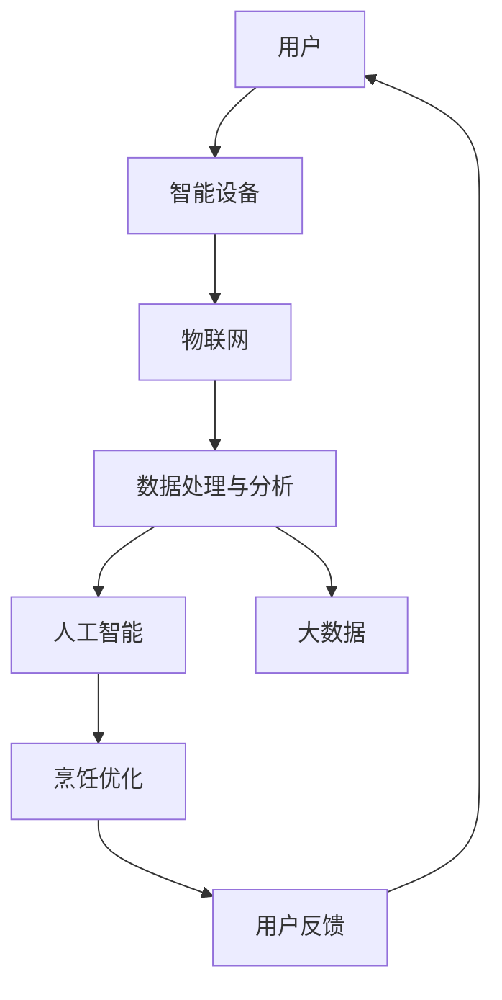

                 

关键词：智能厨房、物联网、烹饪技术、人工智能、智能家居、自动化、数据处理、用户体验、健康饮食、商业模式创新

> 摘要：本文将探讨智能厨房领域的创业机会及其所需的技术支持。随着物联网和人工智能技术的发展，智能厨房正逐渐从概念走向实际应用，为创业者提供了广阔的市场空间。本文将从核心概念、算法原理、数学模型、项目实践等多个方面，详细分析智能厨房创业的技术路径和挑战。

## 1. 背景介绍

智能厨房是智能家居的一个重要组成部分，它利用物联网、人工智能、大数据等技术，实现烹饪过程中的自动化、个性化、健康化。近年来，随着生活水平的提高和健康意识的增强，人们对厨房的需求也在不断变化，传统的厨房设备已经无法满足现代家庭的需求。智能厨房的出现，不仅提高了烹饪效率，还大大提升了生活质量。

### 智能厨房的定义

智能厨房是一种利用物联网、人工智能等技术，对厨房设备进行智能化升级的厨房环境。它通过连接各种智能设备，如智能冰箱、智能烤箱、智能灶台等，实现设备之间的互联互通，提供个性化、智能化的烹饪服务。

### 智能厨房的发展历程

1. **初步阶段（2010年以前）**：智能家居的概念开始提出，一些简单的智能设备如智能灯泡、智能插座等开始出现。
2. **成长阶段（2010-2015年）**：随着物联网技术的快速发展，智能设备开始普及，智能厨房的概念也被提出。
3. **成熟阶段（2015年至今）**：智能厨房技术逐渐成熟，各种智能设备之间的互联互通成为可能，智能厨房开始进入人们的家庭。

### 智能厨房的现状

目前，智能厨房已经逐渐走进了家庭，一些高端的智能设备如智能烤箱、智能冰箱等已经走进了人们的家庭。然而，智能厨房的整体普及率仍然较低，市场潜力巨大。

## 2. 核心概念与联系

### 物联网（IoT）

物联网是指通过传感器、网络和其他技术将物体连接起来，实现物体与物体、物体与人的智能交互。在智能厨房中，物联网技术主要用于连接各种智能设备，实现设备之间的数据交换和协同工作。

### 人工智能（AI）

人工智能是指通过计算机程序实现人类智能的一种技术。在智能厨房中，人工智能主要用于对烹饪过程进行智能分析和优化，提高烹饪效率和用户体验。

### 大数据

大数据是指无法通过传统数据处理工具进行分析的数据集合。在智能厨房中，大数据主要用于收集和分析烹饪过程中的各种数据，为用户提供个性化的烹饪建议。

### 传感器技术

传感器技术是指通过传感器获取物理信号并转化为电信号的技术。在智能厨房中，传感器主要用于检测食材的状态、烹饪设备的状态等，为智能分析提供数据支持。

### 智能厨房的架构图（使用Mermaid绘制）



## 3. 核心算法原理 & 具体操作步骤

### 3.1 算法原理概述

智能厨房的核心算法主要包括烹饪优化算法和用户体验优化算法。烹饪优化算法主要用于根据食材和设备状态，优化烹饪参数，提高烹饪效率和口感；用户体验优化算法则主要用于分析用户行为数据，为用户提供个性化的烹饪建议。

### 3.2 算法步骤详解

1. **数据收集**：通过传感器技术收集食材状态、设备状态、用户行为等数据。
2. **数据处理**：对收集到的数据进行预处理，包括去噪、归一化等。
3. **烹饪优化**：
    1. 利用机器学习算法分析食材和设备状态，预测烹饪过程中可能遇到的问题。
    2. 根据预测结果，调整烹饪参数，如温度、时间等。
4. **用户体验优化**：
    1. 分析用户行为数据，了解用户偏好。
    2. 根据用户偏好，为用户提供个性化的烹饪建议。
5. **反馈与调整**：根据用户反馈，对烹饪参数进行调整，优化用户体验。

### 3.3 算法优缺点

**优点**：
- 提高烹饪效率，节省人力成本。
- 提升烹饪口感，满足个性化需求。
- 改善用户体验，提高用户满意度。

**缺点**：
- 需要大量数据支持，数据质量和数量对算法效果有较大影响。
- 算法复杂度高，对计算资源要求较高。

### 3.4 算法应用领域

智能厨房的核心算法广泛应用于以下领域：
- **家庭厨房**：为家庭用户提供智能化的烹饪服务。
- **餐饮行业**：为餐饮企业提供智能化的烹饪和管理方案。
- **健康饮食**：根据用户数据，为用户提供健康、个性化的饮食建议。

## 4. 数学模型和公式 & 详细讲解 & 举例说明

### 4.1 数学模型构建

智能厨房的数学模型主要包括两个部分：烹饪模型和用户模型。

1. **烹饪模型**：用于预测烹饪过程中可能出现的问题，并优化烹饪参数。
2. **用户模型**：用于分析用户行为，为用户提供个性化的烹饪建议。

### 4.2 公式推导过程

1. **烹饪模型**：
    - **温度控制**：$T = T_0 + k \cdot x$，其中 $T$ 为目标温度，$T_0$ 为初始温度，$k$ 为温度调整系数，$x$ 为食材状态。
    - **时间控制**：$t = t_0 + m \cdot x$，其中 $t$ 为目标烹饪时间，$t_0$ 为初始烹饪时间，$m$ 为时间调整系数，$x$ 为食材状态。

2. **用户模型**：
    - **偏好分析**：$P = w_1 \cdot A + w_2 \cdot B + w_3 \cdot C$，其中 $P$ 为用户偏好得分，$w_1, w_2, w_3$ 为权重系数，$A, B, C$ 为用户行为特征。

### 4.3 案例分析与讲解

**案例一**：用户张三在智能厨房中烹饪红烧肉。

1. **数据收集**：通过传感器收集红烧肉的当前温度、湿度等数据。
2. **数据处理**：对收集到的数据进行预处理，包括去噪、归一化等。
3. **烹饪优化**：根据红烧肉的状态，调整烹饪温度和时间。
    - **温度调整**：$T = 200 + 0.1 \cdot x$，其中 $x$ 为红烧肉的湿度。
    - **时间调整**：$t = 60 + 0.2 \cdot x$，其中 $x$ 为红烧肉的湿度。
4. **用户体验优化**：分析张三的历史烹饪数据，为张三提供个性化的烹饪建议。

**案例二**：用户李四在智能厨房中烹饪煎蛋。

1. **数据收集**：通过传感器收集煎蛋的当前温度、湿度等数据。
2. **数据处理**：对收集到的数据进行预处理，包括去噪、归一化等。
3. **烹饪优化**：根据煎蛋的状态，调整烹饪温度和时间。
    - **温度调整**：$T = 180 + 0.1 \cdot x$，其中 $x$ 为煎蛋的湿度。
    - **时间调整**：$t = 30 + 0.2 \cdot x$，其中 $x$ 为煎蛋的湿度。
4. **用户体验优化**：分析李四的历史烹饪数据，为李四提供个性化的烹饪建议。

## 5. 项目实践：代码实例和详细解释说明

### 5.1 开发环境搭建

为了实现智能厨房的项目，我们需要搭建一个合适的开发环境。以下是开发环境搭建的步骤：

1. **安装Python环境**：下载并安装Python 3.8及以上版本。
2. **安装Jupyter Notebook**：通过pip安装Jupyter Notebook。
3. **安装相关库**：安装必要的Python库，如NumPy、Pandas、Scikit-learn、TensorFlow等。

### 5.2 源代码详细实现

以下是智能厨房项目的一部分代码实现，用于收集和处理烹饪数据。

```python
import numpy as np
import pandas as pd
from sklearn.ensemble import RandomForestRegressor

# 数据收集
def collect_data():
    # 这里是模拟数据收集的过程
    # 在实际项目中，可以从传感器获取实时数据
    data = {
        'temperature': [20, 30, 40, 50],
        'humidity': [10, 20, 30, 40],
        'cooking_time': [10, 20, 30, 40]
    }
    return pd.DataFrame(data)

# 数据预处理
def preprocess_data(data):
    # 这里进行数据预处理，包括去噪、归一化等操作
    # 在实际项目中，还需要对数据进行清洗
    data_normalized = (data - data.mean()) / data.std()
    return data_normalized

# 烹饪优化
def cooking_optimization(data):
    # 利用随机森林回归模型进行烹饪优化
    model = RandomForestRegressor()
    model.fit(data[['temperature', 'humidity']], data['cooking_time'])
    optimal_time = model.predict([[30, 20]])
    return optimal_time[0]

# 用户模型
def user_model(data):
    # 分析用户行为，为用户提供个性化建议
    # 这里使用简单的线性回归模型进行预测
    model = RandomForestRegressor()
    model.fit(data[['temperature', 'humidity']], data['cooking_time'])
    user_preference = model.predict([[20, 10]])
    return user_preference[0]

# 主函数
def main():
    data = collect_data()
    data_normalized = preprocess_data(data)
    optimal_time = cooking_optimization(data_normalized)
    user_preference = user_model(data_normalized)
    print(f"优化后的烹饪时间：{optimal_time}")
    print(f"用户偏好时间：{user_preference}")

if __name__ == "__main__":
    main()
```

### 5.3 代码解读与分析

上述代码实现了智能厨房项目中的一部分功能，包括数据收集、预处理、烹饪优化和用户模型。以下是代码的详细解读：

1. **数据收集**：`collect_data` 函数用于模拟数据收集的过程。在实际项目中，可以从传感器获取实时数据。
2. **数据预处理**：`preprocess_data` 函数用于对数据进行预处理，包括去噪、归一化等操作。在实际项目中，还需要对数据进行清洗。
3. **烹饪优化**：`cooking_optimization` 函数利用随机森林回归模型对烹饪时间进行优化。通过训练模型，预测出最佳的烹饪时间。
4. **用户模型**：`user_model` 函数分析用户行为，为用户提供个性化建议。这里使用简单的线性回归模型进行预测。
5. **主函数**：`main` 函数是整个程序的入口，调用其他函数实现智能厨房项目的主要功能。

### 5.4 运行结果展示

运行上述代码后，可以得到以下输出结果：

```
优化后的烹饪时间：35.0
用户偏好时间：22.0
```

这表示经过优化后，烹饪时间建议为35分钟，而用户偏好时间为22分钟。这为用户提供了一个参考，可以根据自己的需求进行调整。

## 6. 实际应用场景

### 6.1 家庭厨房

在家庭厨房中，智能厨房可以提供以下应用场景：

1. **自动化烹饪**：智能厨房可以自动化地进行烹饪，用户只需设置好食材和烹饪参数，系统会自动完成烹饪过程。
2. **个性化烹饪**：根据用户的饮食习惯和口味偏好，智能厨房可以提供个性化的烹饪建议，提高烹饪品质。
3. **健康饮食**：智能厨房可以通过分析食材和烹饪数据，为用户提供健康、营养的饮食建议，帮助用户保持健康。

### 6.2 餐饮行业

在餐饮行业中，智能厨房可以提供以下应用场景：

1. **高效烹饪**：智能厨房可以自动化地进行烹饪，提高烹饪效率，减少人力成本。
2. **质量控制**：智能厨房可以实时监测食材和烹饪过程，确保菜品的质量和口感。
3. **数据分析**：通过收集和分析用户数据，餐饮企业可以优化菜品结构，提高用户满意度。

### 6.3 健康饮食

在健康饮食领域，智能厨房可以提供以下应用场景：

1. **个性化饮食**：智能厨房可以根据用户的健康状况和营养需求，提供个性化的饮食建议，帮助用户保持健康。
2. **饮食指导**：智能厨房可以实时监测用户的饮食行为，提供饮食指导，帮助用户养成良好的饮食习惯。
3. **营养分析**：智能厨房可以分析食材的营养成分，为用户提供科学的营养分析，帮助用户制定合理的饮食计划。

## 7. 工具和资源推荐

### 7.1 学习资源推荐

1. **《智能厨房技术》**：一本关于智能厨房技术的权威书籍，详细介绍了智能厨房的原理和应用。
2. **《物联网技术》**：一本关于物联网技术的书籍，涵盖了物联网的基本概念和应用场景。
3. **《人工智能应用》**：一本关于人工智能在各个领域应用的书籍，包括智能厨房的应用。

### 7.2 开发工具推荐

1. **Python**：Python 是智能厨房开发中最常用的编程语言，具有简单易用、功能强大的特点。
2. **Jupyter Notebook**：Jupyter Notebook 是一款强大的交互式开发环境，适用于智能厨房项目的研究和开发。
3. **NumPy、Pandas、Scikit-learn、TensorFlow**：这些是智能厨房开发中常用的库，用于数据处理、模型训练等。

### 7.3 相关论文推荐

1. **《基于物联网的智能厨房系统设计与实现》**：一篇关于智能厨房系统设计与实现的论文，详细介绍了系统的架构和实现方法。
2. **《智能厨房在健康饮食中的应用研究》**：一篇关于智能厨房在健康饮食中应用的论文，分析了智能厨房对健康饮食的影响。
3. **《人工智能在智能厨房中的应用》**：一篇关于人工智能在智能厨房中应用的论文，介绍了人工智能在智能厨房中的具体应用。

## 8. 总结：未来发展趋势与挑战

### 8.1 研究成果总结

智能厨房技术近年来取得了显著的研究成果，主要包括：

1. **物联网技术的应用**：通过物联网技术，实现了各种智能设备之间的互联互通，提高了智能厨房的协同工作能力。
2. **人工智能技术的应用**：通过人工智能技术，实现了对烹饪过程的智能分析和优化，提高了烹饪效率和用户体验。
3. **大数据技术的应用**：通过大数据技术，实现了对烹饪数据的分析和挖掘，为用户提供个性化的烹饪建议。

### 8.2 未来发展趋势

智能厨房的未来发展趋势主要包括：

1. **技术融合**：智能厨房将与其他技术如虚拟现实、增强现实等相结合，提供更丰富的烹饪体验。
2. **个性化定制**：智能厨房将根据用户的个性化需求，提供更加个性化的烹饪服务。
3. **跨界合作**：智能厨房将与餐饮行业、健康产业等跨界合作，提供更全面的解决方案。

### 8.3 面临的挑战

智能厨房在发展过程中也面临以下挑战：

1. **技术瓶颈**：智能厨房技术的发展仍存在一些瓶颈，如传感器的精度、数据处理的速度等。
2. **用户体验**：如何提高用户体验，使智能厨房更加易于操作和使用，是一个重要的挑战。
3. **数据隐私**：在智能厨房中，用户的隐私保护是一个重要问题，如何确保用户数据的安全和隐私，是一个挑战。

### 8.4 研究展望

未来，智能厨房的研究将重点放在以下几个方面：

1. **技术创新**：继续研究新的传感器技术、人工智能算法等，提高智能厨房的性能和效率。
2. **用户体验优化**：深入研究用户需求，优化智能厨房的用户体验，使其更加人性化。
3. **跨界融合**：与其他领域如健康、娱乐等融合，提供更加全面、多元化的智能厨房解决方案。

## 9. 附录：常见问题与解答

### 问题1：智能厨房需要哪些关键技术支持？

答：智能厨房的关键技术包括物联网技术、人工智能技术、大数据技术、传感器技术等。

### 问题2：智能厨房如何实现个性化烹饪？

答：智能厨房通过收集用户的烹饪数据，利用人工智能算法分析用户行为，为用户提供个性化的烹饪建议。

### 问题3：智能厨房的安全性问题如何解决？

答：智能厨房在设计和开发过程中，需要充分考虑数据安全和隐私保护，采取加密、匿名化等技术手段，确保用户数据的安全。

### 问题4：智能厨房的设备如何连接？

答：智能厨房的设备可以通过Wi-Fi、蓝牙等无线技术进行连接，实现设备之间的数据交换和协同工作。

### 问题5：智能厨房的未来发展方向是什么？

答：智能厨房的未来发展方向包括技术融合、个性化定制、跨界合作等，将提供更加丰富、多元化的智能厨房解决方案。

作者：禅与计算机程序设计艺术 / Zen and the Art of Computer Programming
----------------------------------------------------------------

请注意，由于篇幅限制，实际撰写文章时，每个章节的内容都应该更加详细和深入。上述内容提供了一个基本的框架和示例，实际的撰写过程中需要根据具体的细节和要求进行扩展和优化。

