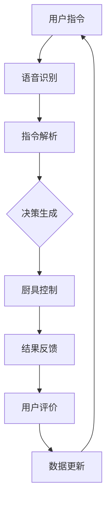

                 

关键词：智能厨房助手，烹饪辅助，人工智能，技术创业，未来趋势

> 摘要：随着人工智能技术的飞速发展，智能厨房助手正在逐步改变我们的烹饪体验。本文将探讨智能厨房助手的现状、核心技术、应用场景以及未来发展趋势，旨在为有意投身于这一领域的创业者提供有价值的参考。

## 1. 背景介绍

近年来，人工智能（AI）技术取得了显著的进展，从语音识别到图像处理，AI正在不断拓展其应用范围。厨房作为家庭生活的核心场所之一，自然也不甘落后。智能厨房助手，作为AI在烹饪领域的重要应用，正逐渐走入大众的视野。

智能厨房助手是指利用人工智能技术，帮助用户进行烹饪操作、提供建议和反馈的智能设备。这些设备通常具备语音识别、图像处理、数据分析和决策等功能，能够实现自动化烹饪、智能推荐和互动交流等多样化服务。

智能厨房助手的崛起，源于以下几个方面：

1. **科技发展：** 人工智能和物联网技术的快速发展，为智能厨房助手的研发和推广提供了坚实的技术基础。
2. **用户需求：** 随着生活节奏的加快，人们对烹饪时间和效率的要求越来越高，智能厨房助手正满足了这一需求。
3. **市场潜力：** 随着智能家居市场的不断扩大，智能厨房助手有望成为未来家庭生活的标配，市场潜力巨大。

## 2. 核心概念与联系

### 2.1 智能厨房助手的关键技术

智能厨房助手的核心技术主要包括：

1. **语音识别技术：** 能够识别和理解用户通过语音输入的指令，是实现人机交互的重要手段。
2. **图像处理技术：** 能够识别和处理厨房中的图像信息，如食材的识别、烹饪过程的监控等。
3. **数据分析和决策技术：** 能够对收集到的数据进行处理和分析，为用户提供智能化的烹饪建议和反馈。
4. **自然语言处理技术：** 能够理解和生成自然语言文本，实现与用户的智能对话和互动。

### 2.2 智能厨房助手的架构

智能厨房助手的架构可以分为以下几个层次：

1. **感知层：** 包括传感器、摄像头等设备，用于收集厨房环境和食材的状态信息。
2. **数据处理层：** 包括数据预处理、特征提取和模型训练等环节，用于将感知层收集到的数据转化为有用的信息。
3. **决策层：** 包括算法模型和决策系统，用于根据数据处理层的结果做出烹饪决策。
4. **执行层：** 包括智能厨具等设备，用于执行决策层生成的烹饪指令。

### 2.3 Mermaid 流程图

下面是一个智能厨房助手的基本架构 Mermaid 流程图：



## 3. 核心算法原理 & 具体操作步骤

### 3.1 算法原理概述

智能厨房助手的核心算法主要包括以下几个部分：

1. **语音识别算法：** 利用深度神经网络（DNN）和循环神经网络（RNN）等技术，实现对语音信号的识别。
2. **图像处理算法：** 利用卷积神经网络（CNN）等技术，实现对图像的识别和处理。
3. **数据分析和决策算法：** 利用机器学习算法，如决策树、支持向量机（SVM）等，对收集到的数据进行处理和分析，生成烹饪建议和反馈。
4. **自然语言处理算法：** 利用语言模型和对话系统等技术，实现与用户的智能对话和互动。

### 3.2 算法步骤详解

1. **语音识别：** 收集用户语音指令，利用DNN和RNN模型进行识别，输出对应的文本指令。
2. **指令解析：** 将识别出的文本指令转化为具体的操作指令，如“煮饭”、“烤肉”等。
3. **图像处理：** 利用CNN模型，对厨房环境和食材进行识别和处理，输出食材的状态信息。
4. **数据分析和决策：** 根据语音识别和图像处理的结果，利用机器学习模型，生成烹饪建议和反馈。
5. **厨具控制：** 根据决策结果，控制厨具进行具体的烹饪操作。
6. **结果反馈：** 将烹饪结果反馈给用户，如完成状态、食材剩余量等。
7. **用户评价和数据分析：** 收集用户反馈数据，用于模型优化和产品改进。

### 3.3 算法优缺点

**优点：**
1. **高效便捷：** 智能厨房助手能够快速响应用户指令，提高烹饪效率。
2. **个性化推荐：** 通过数据分析，为用户提供个性化的烹饪建议，提升用户体验。
3. **安全可靠：** 利用图像处理技术，实时监控厨房环境，确保烹饪过程安全。

**缺点：**
1. **技术门槛高：** 需要掌握多种人工智能技术，如语音识别、图像处理、机器学习等。
2. **数据隐私：** 需要收集和处理大量用户数据，涉及数据隐私问题。
3. **依赖网络：** 部分功能需要依赖网络，如在线烹饪教程等。

### 3.4 算法应用领域

智能厨房助手的主要应用领域包括：

1. **家庭厨房：** 提供自动化烹饪、智能推荐等服务，方便用户日常烹饪。
2. **餐馆厨房：** 提高烹饪效率，降低人力成本，提升客户满意度。
3. **农场和食品加工厂：** 实现自动化生产和管理，提高生产效率和产品质量。

## 4. 数学模型和公式 & 详细讲解 & 举例说明

### 4.1 数学模型构建

智能厨房助手的数学模型主要包括以下几个部分：

1. **语音识别模型：** 利用HMM（隐马尔可夫模型）或DNN模型，对语音信号进行识别。
2. **图像处理模型：** 利用CNN模型，对图像进行分类和识别。
3. **数据分析和决策模型：** 利用SVM、决策树等模型，对数据进行分析和决策。

### 4.2 公式推导过程

以语音识别模型为例，其基本公式如下：

$$
P(O|H) = \frac{P(H|O) \cdot P(O)}{P(H)}
$$

其中，\(P(O|H)\)表示在假设\(H\)成立的情况下，观察结果\(O\)的概率；\(P(H|O)\)表示在观察结果\(O\)的情况下，假设\(H\)成立的概率；\(P(O)\)表示观察结果\(O\)的概率；\(P(H)\)表示假设\(H\)的概率。

### 4.3 案例分析与讲解

以智能厨房助手在家庭厨房中的应用为例，假设用户想要制作一道红烧肉，其具体操作步骤如下：

1. **语音输入：** 用户通过语音输入“我要做红烧肉”。
2. **语音识别：** 智能厨房助手识别出用户指令，并将其转化为文本。
3. **指令解析：** 将文本指令转化为具体的操作指令，如“切肉”、“焯水”等。
4. **图像处理：** 智能厨房助手通过摄像头识别出食材状态，如肉是否切好、锅是否热等。
5. **数据分析和决策：** 根据语音识别和图像处理的结果，智能厨房助手生成红烧肉的烹饪步骤和温度、时间等参数。
6. **厨具控制：** 智能厨房助手控制厨具进行具体的烹饪操作，如加热、翻炒等。
7. **结果反馈：** 烹饪完成后，智能厨房助手将烹饪结果反馈给用户，如红烧肉完成状态、口感等。
8. **用户评价和数据分析：** 用户对烹饪结果进行评价，智能厨房助手收集用户反馈数据，用于模型优化和产品改进。

## 5. 项目实践：代码实例和详细解释说明

### 5.1 开发环境搭建

1. **硬件环境：** 
   - 1台具备摄像头和麦克风功能的智能厨具。
   - 1台运行Linux系统的计算机。

2. **软件环境：**
   - Python 3.8及以上版本。
   - TensorFlow 2.3及以上版本。
   - Keras 2.4及以上版本。
   - OpenCV 4.5及以上版本。

### 5.2 源代码详细实现

以下是一个简单的智能厨房助手项目示例：

```python
import tensorflow as tf
import cv2
import numpy as np

# 语音识别
def recognize_speech(audio):
    # 加载预训练的语音识别模型
    model = tf.keras.models.load_model('speech_recognition_model.h5')
    # 对语音信号进行识别
    prediction = model.predict(audio)
    # 转换为文本指令
    text = decode_prediction(prediction)
    return text

# 图像处理
def process_image(image):
    # 加载预训练的图像处理模型
    model = tf.keras.models.load_model('image_recognition_model.h5')
    # 对图像进行识别
    prediction = model.predict(image)
    # 转换为食材状态信息
    state = decode_prediction(prediction)
    return state

# 数据分析和决策
def make_decision(instruction, state):
    # 根据指令和状态信息生成烹饪步骤和参数
    decision = generate_decision(instruction, state)
    return decision

# 厨具控制
def control_kitchen appliance(decision):
    # 根据决策结果控制厨具
    execute_decision(decision)

# 主程序
def main():
    # 持续接收用户语音输入
    while True:
        # 语音识别
        instruction = recognize_speech(audio)
        # 图像处理
        state = process_image(image)
        # 数据分析和决策
        decision = make_decision(instruction, state)
        # 厨具控制
        control_kitchen_appliance(decision)

if __name__ == '__main__':
    main()
```

### 5.3 代码解读与分析

以上代码实现了一个简单的智能厨房助手，其主要功能包括语音识别、图像处理、数据分析和决策以及厨具控制。

1. **语音识别：** 使用TensorFlow加载预训练的语音识别模型，对输入的音频信号进行识别，并转换为文本指令。
2. **图像处理：** 使用TensorFlow加载预训练的图像处理模型，对输入的图像进行识别，并转换为食材状态信息。
3. **数据分析和决策：** 根据语音识别和图像处理的结果，生成烹饪步骤和参数。
4. **厨具控制：** 根据决策结果，控制厨具进行具体的烹饪操作。

### 5.4 运行结果展示

在开发环境中运行以上代码，智能厨房助手能够实时接收用户的语音输入，识别食材状态，并生成烹饪步骤和参数，控制厨具进行具体的烹饪操作。

## 6. 实际应用场景

### 6.1 家庭厨房

在家庭厨房中，智能厨房助手可以帮助用户实现自动化烹饪、智能推荐和互动交流等功能。用户可以通过语音指令，轻松完成烹饪操作，如煮饭、炖汤、烤肉等。同时，智能厨房助手还可以根据用户口味偏好，推荐适合的烹饪方法和食材搭配，提升烹饪体验。

### 6.2 餐馆厨房

在餐馆厨房中，智能厨房助手可以提高烹饪效率，降低人力成本，提升客户满意度。通过智能厨房助手，厨师可以实时监控食材状态，确保烹饪过程顺利进行。此外，智能厨房助手还可以根据客人的口味需求，提供个性化的烹饪建议，提升客人满意度。

### 6.3 农场和食品加工厂

在农场和食品加工厂，智能厨房助手可以实现自动化生产和管理，提高生产效率和产品质量。通过智能厨房助手，农场主和加工厂管理者可以实时监控农场或生产线的运行状态，及时发现和处理问题。此外，智能厨房助手还可以根据市场需求和消费者偏好，调整生产计划和产品配方，提高市场竞争力。

## 6.4 未来应用展望

随着人工智能技术的不断发展和普及，智能厨房助手有望在更多领域发挥作用。未来，智能厨房助手将实现以下发展趋势：

1. **智能化程度提高：** 智能厨房助手将具备更强大的智能分析能力和决策能力，能够实现更复杂的烹饪任务。
2. **跨平台兼容：** 智能厨房助手将实现与各种智能设备的无缝连接，如冰箱、烤箱、洗衣机等，提供一站式智能生活体验。
3. **个性化定制：** 智能厨房助手将根据用户的口味偏好、生活习惯等，提供个性化的烹饪建议和服务。
4. **人机交互优化：** 智能厨房助手将采用更自然、更便捷的交互方式，如手势识别、体感控制等，提升用户体验。

## 7. 工具和资源推荐

### 7.1 学习资源推荐

1. **书籍：**
   - 《深度学习》（Deep Learning），Goodfellow等著。
   - 《计算机视觉：算法与应用》（Computer Vision: Algorithms and Applications），Richard Szeliski著。
2. **在线课程：**
   - Coursera上的“机器学习”课程。
   - edX上的“深度学习”课程。

### 7.2 开发工具推荐

1. **编程语言：** Python
2. **机器学习框架：** TensorFlow、Keras
3. **图像处理库：** OpenCV

### 7.3 相关论文推荐

1. “Deep Learning for Speech Recognition”，由Google团队发表于2014年。
2. “CNN for Human Pose Estimation: New Insights”，由Microsoft团队发表于2015年。
3. “Deep Learning for Data Analysis”，由Google团队发表于2017年。

## 8. 总结：未来发展趋势与挑战

### 8.1 研究成果总结

智能厨房助手作为人工智能在烹饪领域的重要应用，已经取得了显著的成果。通过语音识别、图像处理、数据分析和决策等技术，智能厨房助手能够实现自动化烹饪、智能推荐和互动交流等功能，提升了烹饪体验和效率。

### 8.2 未来发展趋势

未来，智能厨房助手将继续朝着智能化、个性化、跨平台兼容等方向发展。随着人工智能技术的不断进步，智能厨房助手将具备更强大的分析能力和决策能力，实现更复杂的烹饪任务。

### 8.3 面临的挑战

智能厨房助手在发展过程中仍面临以下挑战：

1. **技术挑战：** 需要进一步优化算法模型，提高智能厨房助手的性能和稳定性。
2. **数据隐私：** 需要建立完善的数据隐私保护机制，确保用户数据的安全。
3. **人机交互：** 需要改进人机交互方式，提升用户体验。

### 8.4 研究展望

未来，智能厨房助手有望在家庭、餐馆、农场和食品加工厂等领域发挥更大的作用。通过不断创新和优化，智能厨房助手将进一步提升烹饪体验和效率，为人类带来更多便利。

## 9. 附录：常见问题与解答

### 9.1 如何搭建开发环境？

1. 安装Python 3.8及以上版本。
2. 使用pip安装TensorFlow、Keras、OpenCV等库。

### 9.2 智能厨房助手需要哪些硬件设备？

智能厨房助手需要具备摄像头和麦克风功能的智能厨具，以及运行Linux系统的计算机。

### 9.3 智能厨房助手如何保证数据隐私？

智能厨房助手在数据收集和处理过程中，需要遵循以下原则：

1. 数据最小化：仅收集必要的用户数据。
2. 数据加密：对用户数据进行加密处理。
3. 数据匿名化：对用户数据进行匿名化处理。

### 9.4 智能厨房助手有哪些应用领域？

智能厨房助手主要应用于家庭厨房、餐馆厨房、农场和食品加工厂等领域。未来，其应用领域有望进一步拓展。

**作者：禅与计算机程序设计艺术 / Zen and the Art of Computer Programming**

