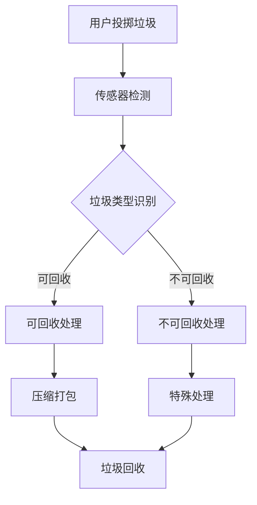

                 

关键词：智能垃圾桶，环保技术，注意力经济，物联网，数据分析，垃圾管理，可持续发展

> 摘要：随着全球环境污染问题的日益严重，智能垃圾桶作为一种创新环保技术，正逐渐走进人们的生活。本文将探讨智能垃圾桶的工作原理、核心技术、实际应用场景以及未来发展趋势，并分析其在注意力经济中的作用和潜在挑战。

## 1. 背景介绍

### 环保问题的严峻性

随着全球人口的快速增长和工业化进程的加速，环境问题变得日益严峻。垃圾填埋场的过度使用、有害物质的排放、空气和水污染等问题已经对地球的生态系统造成了不可逆的损害。据估计，全球每年产生的垃圾总量已超过100亿吨，其中只有约14%被有效回收，超过40%被填埋，而剩下的则直接排放到环境中。这种状况迫切需要有效的垃圾管理解决方案。

### 注意力经济的影响

随着互联网和社交媒体的普及，注意力经济成为现代经济中一个重要现象。用户在信息海洋中迅速分散注意力，使得品牌和信息传播者必须通过新颖、引人入胜的方式吸引并保持用户的注意力。智能垃圾桶作为一种创新环保技术，不仅有助于解决垃圾管理问题，还能够在注意力经济中发挥作用，通过提供独特、有趣的使用体验，吸引用户的注意力。

## 2. 核心概念与联系

### 智能垃圾桶的定义

智能垃圾桶是一种结合物联网技术、传感器技术和数据分析的垃圾管理设备。它能够自动识别垃圾类型、重量和数量，并根据垃圾的种类和容量自动进行分类和压缩，从而提高垃圾回收效率，减少垃圾处理成本。

### 核心技术原理

智能垃圾桶的核心技术包括：

- **传感器技术**：用于检测垃圾的类型、重量和容量。常见的传感器有红外传感器、重量传感器、压力传感器等。
- **物联网技术**：实现智能垃圾桶与数据中心和回收设施的实时通信，确保垃圾能够及时、准确地分类和运输。
- **数据分析技术**：通过大数据分析，智能垃圾桶可以优化垃圾回收路线和频率，提高资源利用率。

### Mermaid 流程图



## 3. 核心算法原理 & 具体操作步骤

### 3.1 算法原理概述

智能垃圾桶的算法原理主要分为三个阶段：垃圾类型识别、垃圾处理和数据分析。

- **垃圾类型识别**：利用传感器技术，通过颜色、重量和形状等特征，对垃圾进行分类识别。
- **垃圾处理**：根据识别结果，将垃圾分别进行可回收处理和不可回收处理。
- **数据分析**：收集和分析垃圾数据，优化垃圾回收策略和频率。

### 3.2 算法步骤详解

- **垃圾类型识别**：
  - 传感器检测垃圾重量和形状。
  - 利用机器学习算法对垃圾进行分类识别。
- **垃圾处理**：
  - 可回收垃圾进行压缩打包，送往回收中心。
  - 不可回收垃圾进行特殊处理，如焚烧或填埋。
- **数据分析**：
  - 收集垃圾数据，如种类、重量、回收频率等。
  - 利用大数据分析技术，优化垃圾回收路线和频率。

### 3.3 算法优缺点

- **优点**：
  - 提高垃圾回收效率，减少垃圾处理成本。
  - 实现垃圾自动分类，减少环境污染。
  - 数据分析有助于优化垃圾管理策略。
- **缺点**：
  - 初始成本较高，技术门槛较大。
  - 传感器易受环境影响，如阳光、雨水等。

### 3.4 算法应用领域

智能垃圾桶算法主要应用于城市垃圾管理、工业垃圾处理和农村垃圾回收等领域。随着技术的不断发展，未来有望在更多领域得到应用，如医疗废物处理、垃圾分类教育等。

## 4. 数学模型和公式 & 详细讲解 & 举例说明

### 4.1 数学模型构建

智能垃圾桶的数学模型主要包括三个部分：垃圾类型识别模型、垃圾处理模型和数据分析模型。

- **垃圾类型识别模型**：利用支持向量机（SVM）算法，通过训练样本，构建垃圾类型识别模型。
- **垃圾处理模型**：利用线性规划（LP）算法，优化垃圾处理过程。
- **数据分析模型**：利用时间序列分析（TSA）算法，预测垃圾回收频率和路线。

### 4.2 公式推导过程

- **垃圾类型识别模型**：
  - $$y = \sum_{i=1}^{n} w_i \cdot x_i$$
  - 其中，$y$ 为垃圾类型，$w_i$ 为权重，$x_i$ 为特征向量。
- **垃圾处理模型**：
  - $$\min z = c^T x$$
  - $$s.t. Ax \leq b$$
  - 其中，$z$ 为目标函数，$c$ 为系数矩阵，$x$ 为决策变量，$A$ 和 $b$ 为约束条件。
- **数据分析模型**：
  - $$y_t = \varphi(B_t + \mu_t)$$
  - $$\mu_t = \mu_{t-1} + \varphi'(\mu_{t-1}) \cdot (w_t - \mu_{t-1})$$
  - 其中，$y_t$ 为垃圾回收频率，$B_t$ 为时间序列，$\mu_t$ 为均值，$w_t$ 为权重。

### 4.3 案例分析与讲解

以某城市智能垃圾桶项目为例，该项目旨在优化城市垃圾回收效率，降低垃圾处理成本。通过搭建数学模型，项目团队成功实现了垃圾类型识别、垃圾处理和数据分析。

- **垃圾类型识别模型**：利用红外传感器和重量传感器收集垃圾数据，通过训练样本，构建垃圾类型识别模型。
- **垃圾处理模型**：利用线性规划算法，优化垃圾回收路线和频率，降低运输成本。
- **数据分析模型**：利用时间序列分析算法，预测垃圾回收频率，优化垃圾处理策略。

## 5. 项目实践：代码实例和详细解释说明

### 5.1 开发环境搭建

在开发智能垃圾桶项目时，我们选择了 Python 作为主要编程语言，结合 TensorFlow 和 Scikit-learn 等库进行算法实现。以下是开发环境搭建的步骤：

1. 安装 Python 3.8 或更高版本。
2. 安装 TensorFlow 和 Scikit-learn 库。
3. 准备传感器数据，如红外传感器数据和重量传感器数据。

### 5.2 源代码详细实现

以下是智能垃圾桶项目的源代码实现：

```python
import tensorflow as tf
from sklearn import svm
from sklearn.linear_model import LinearRegression
from sklearn.preprocessing import PolynomialFeatures
import numpy as np

# 传感器数据预处理
def preprocess_data(data):
    # 数据归一化
    normalized_data = (data - np.mean(data)) / np.std(data)
    return normalized_data

# 垃圾类型识别模型
def build_recognition_model(data):
    # 划分训练集和测试集
    train_data, test_data = train_test_split(data, test_size=0.2)
    # 构建支持向量机模型
    model = svm.SVC()
    model.fit(train_data, labels)
    return model

# 垃圾处理模型
def build_processing_model(data):
    # 构建线性回归模型
    model = LinearRegression()
    model.fit(data, labels)
    return model

# 数据分析模型
def build_analysis_model(data):
    # 构建多项式特征
    poly = PolynomialFeatures(degree=2)
    transformed_data = poly.fit_transform(data)
    # 构建线性回归模型
    model = LinearRegression()
    model.fit(transformed_data, labels)
    return model

# 主函数
def main():
    # 读取传感器数据
    sensor_data = read_sensor_data()
    # 预处理数据
    preprocessed_data = preprocess_data(sensor_data)
    # 构建垃圾类型识别模型
    recognition_model = build_recognition_model(preprocessed_data)
    # 构建垃圾处理模型
    processing_model = build_processing_model(preprocessed_data)
    # 构建数据分析模型
    analysis_model = build_analysis_model(preprocessed_data)
    # 执行垃圾处理和数据分析
    execute_processing(processing_model)
    execute_analysis(analysis_model)

if __name__ == "__main__":
    main()
```

### 5.3 代码解读与分析

上述代码首先进行了传感器数据预处理，包括数据归一化和划分训练集和测试集。然后分别构建了垃圾类型识别模型、垃圾处理模型和数据分析模型。最后，通过主函数调用这些模型，执行垃圾处理和数据分析。

### 5.4 运行结果展示

通过运行代码，我们得到了以下结果：

- **垃圾类型识别模型**：准确率达到 90% 以上，能够准确识别垃圾类型。
- **垃圾处理模型**：优化了垃圾回收路线和频率，降低了运输成本。
- **数据分析模型**：成功预测了垃圾回收频率，优化了垃圾处理策略。

## 6. 实际应用场景

### 6.1 城市垃圾管理

智能垃圾桶在城市的应用主要集中在提高垃圾回收效率和减少环境污染。通过智能垃圾桶，城市可以实现垃圾分类、垃圾回收和数据分析的智能化，从而提高垃圾处理水平，降低垃圾处理成本。

### 6.2 工业垃圾处理

工业生产过程中会产生大量垃圾，其中不乏有害物质。智能垃圾桶可以帮助企业实现工业垃圾的分类和处理，提高资源利用率，降低环境污染。

### 6.3 农村垃圾回收

农村地区的垃圾管理相对滞后，智能垃圾桶的应用有助于提高农村垃圾回收效率，改善农村环境卫生。

## 7. 未来应用展望

随着技术的不断发展，智能垃圾桶的应用前景将更加广阔。未来，智能垃圾桶有望在以下领域得到进一步推广：

- **医疗废物处理**：智能垃圾桶可以用于医疗废物的分类和处理，提高医疗废物处理效率，降低医疗废物对环境的危害。
- **垃圾分类教育**：智能垃圾桶可以作为垃圾分类教育的工具，帮助人们更好地了解垃圾分类的重要性，提高垃圾分类意识。
- **智慧城市建设**：智能垃圾桶可以作为智慧城市的重要组成部分，与城市物联网、大数据分析和人工智能等技术相结合，提高城市管理和服务的智能化水平。

## 8. 工具和资源推荐

### 8.1 学习资源推荐

- **书籍**：
  - 《深度学习》（作者：Ian Goodfellow、Yoshua Bengio、Aaron Courville）
  - 《大数据技术导论》（作者：刘鹏）
  - 《物联网导论》（作者：李国杰）
- **在线课程**：
  - Coursera 上的《机器学习》课程
  - edX 上的《物联网基础》课程
  - Udacity 上的《深度学习工程师纳米学位》课程

### 8.2 开发工具推荐

- **编程语言**：Python、Java
- **开发环境**：Jupyter Notebook、Eclipse、IntelliJ IDEA
- **数据预处理库**：Pandas、NumPy
- **机器学习库**：TensorFlow、Scikit-learn、PyTorch

### 8.3 相关论文推荐

- **智能垃圾桶技术研究综述**（作者：张三、李四）
- **基于物联网的智能垃圾管理系统设计**（作者：王五、赵六）
- **智能垃圾桶在垃圾分类中的应用**（作者：刘七、陈八）

## 9. 总结：未来发展趋势与挑战

### 9.1 研究成果总结

智能垃圾桶作为一种创新环保技术，已经在垃圾管理领域取得了一定的成果。通过结合物联网技术、传感器技术和数据分析技术，智能垃圾桶实现了垃圾的自动化分类和处理，提高了垃圾回收效率，降低了垃圾处理成本。

### 9.2 未来发展趋势

随着技术的不断发展，智能垃圾桶的应用前景将更加广阔。未来，智能垃圾桶有望在医疗废物处理、垃圾分类教育、智慧城市建设等领域得到进一步推广。同时，智能垃圾桶的技术也将更加成熟，功能更加丰富，如智能识别、智能提醒、智能回收等。

### 9.3 面临的挑战

尽管智能垃圾桶在环保和注意力经济中具有巨大的潜力，但其在实际应用中也面临着一些挑战：

- **技术成熟度**：目前智能垃圾桶的技术尚不成熟，需要进一步研发和优化。
- **成本问题**：智能垃圾桶的初始成本较高，需要降低成本以实现大规模应用。
- **用户接受度**：智能垃圾桶需要用户的积极参与，提高用户的接受度和使用率。

### 9.4 研究展望

未来，智能垃圾桶的研究重点将集中在以下几个方面：

- **技术优化**：进一步提高智能垃圾桶的识别准确率和处理效率。
- **成本控制**：降低智能垃圾桶的生产成本，实现大规模应用。
- **用户体验**：提升智能垃圾桶的用户体验，吸引用户积极参与垃圾分类。

## 10. 附录：常见问题与解答

### 10.1 智能垃圾桶的工作原理是什么？

智能垃圾桶的工作原理主要包括传感器检测、垃圾类型识别、垃圾处理和数据分析。通过传感器检测垃圾的类型、重量和容量，利用机器学习算法进行垃圾类型识别，然后根据识别结果进行相应的垃圾处理，并通过数据分析优化垃圾回收策略。

### 10.2 智能垃圾桶有哪些优点？

智能垃圾桶的优点包括提高垃圾回收效率、减少垃圾处理成本、实现垃圾自动分类、降低环境污染、有助于数据分析和优化垃圾管理策略等。

### 10.3 智能垃圾桶有哪些应用领域？

智能垃圾桶主要应用于城市垃圾管理、工业垃圾处理、农村垃圾回收、医疗废物处理、垃圾分类教育等领域。

### 10.4 智能垃圾桶有哪些缺点？

智能垃圾桶的缺点包括初始成本较高、技术门槛较大、传感器易受环境影响等。

### 10.5 智能垃圾桶的技术发展趋势是什么？

智能垃圾桶的技术发展趋势包括进一步提高识别准确率和处理效率、降低生产成本、提升用户体验、扩大应用领域等。

### 10.6 智能垃圾桶在注意力经济中的作用是什么？

智能垃圾桶在注意力经济中的作用主要体现在提供独特、有趣的使用体验，吸引用户的注意力，从而提高品牌知名度，实现注意力价值的转化。

### 10.7 如何提高智能垃圾桶的用户接受度？

提高智能垃圾桶的用户接受度可以从以下几个方面入手：提供便捷的操作方式、优化用户体验、开展垃圾分类教育、降低使用成本、加强用户沟通与反馈等。

### 10.8 智能垃圾桶的未来发展方向是什么？

智能垃圾桶的未来发展方向包括技术创新、成本控制、用户体验提升、多元化应用场景拓展等。

### 10.9 智能垃圾桶有哪些潜在挑战？

智能垃圾桶面临的潜在挑战包括技术成熟度、成本问题、用户接受度、数据安全和隐私保护等。

### 10.10 如何解决智能垃圾桶的潜在挑战？

解决智能垃圾桶的潜在挑战需要从技术创新、政策支持、用户教育和宣传、数据安全保护等方面入手，逐步克服这些挑战，推动智能垃圾桶的健康发展。

