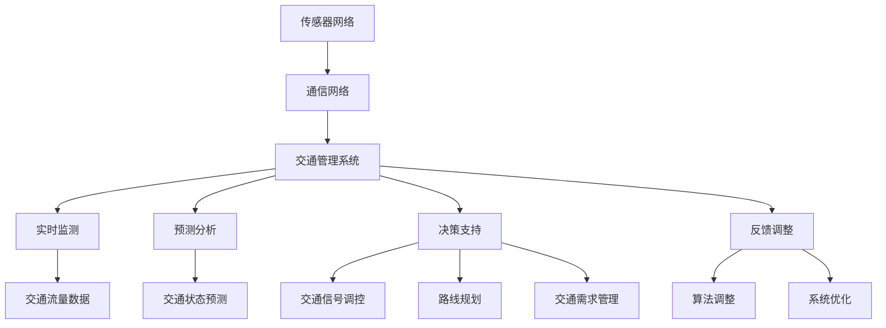

                 

关键词：智能城市交通、注意力管理、交通流量优化、机器学习、深度学习、物联网、实时数据、智能交通系统

> 摘要：本文探讨了智能城市交通系统中注意力管理的重要性，分析了现有的交通流量优化方法及其局限性。通过介绍核心概念和原理，本文提出了一种基于机器学习和深度学习的注意力管理算法，详细阐述了其数学模型和公式，并给出了项目实践和实际应用场景。最后，对未来的发展趋势和挑战进行了展望，并推荐了相关的学习资源和开发工具。

## 1. 背景介绍

随着城市化的加速发展，交通拥堵问题日益严重，成为影响城市居民生活质量的重要因素。为了缓解交通拥堵，提高道路通行效率，智能城市交通系统应运而生。智能城市交通系统通过整合传感器、通信网络和计算机技术，对城市交通进行全面监控和管理，旨在实现交通流量的优化和道路资源的合理配置。

注意力管理作为智能城市交通系统中的一个重要环节，其主要目标是在复杂的交通环境中，为交通管理系统提供有效的决策支持。注意力管理涉及对交通流量的实时监测、预测和分析，从而实现交通拥堵的及时预警和交通调节。

然而，现有的交通流量优化方法往往存在一定的局限性。传统的优化方法主要基于经验模型和统计分析，对交通状态的预测和调控能力有限。而随着物联网、大数据和人工智能技术的不断发展，基于机器学习和深度学习的优化方法逐渐成为研究的热点。这些方法通过对海量交通数据的分析，能够更加准确地预测交通状态，并提供更为智能化的决策支持。

本文旨在探讨智能城市交通系统中注意力管理的重要性，分析现有方法的局限性，并提出一种基于机器学习和深度学习的注意力管理算法。通过详细的数学模型和公式推导，以及对项目实践和实际应用场景的探讨，本文旨在为智能城市交通系统的注意力管理提供一种有效的解决方案。

## 2. 核心概念与联系

### 2.1 智能城市交通系统

智能城市交通系统（Intelligent Urban Traffic System，IUTS）是一个集成了传感器、通信网络和计算机技术的综合系统，旨在通过数据采集、传输和处理，实现对城市交通的全面监控和管理。IUTS主要由以下几个部分组成：

- **传感器网络**：用于实时采集交通流量、速度、车辆密度等交通信息。
- **通信网络**：实现传感器网络与交通管理系统之间的数据传输。
- **交通管理系统**：负责对采集到的交通数据进行处理、分析和决策。
- **用户端应用**：提供交通信息查询、导航等服务，方便用户规划出行路线。

### 2.2 注意力管理

注意力管理（Attention Management）在智能城市交通系统中具有关键作用。它涉及以下几个方面：

- **实时监测**：通过传感器网络实时采集交通数据，如流量、速度、密度等。
- **预测分析**：利用机器学习和深度学习算法，对交通状态进行预测和分析。
- **决策支持**：基于预测结果，为交通管理系统提供决策支持，如交通信号调控、路线规划等。
- **反馈调整**：根据实际交通状况和决策效果，对注意力管理算法进行调整和优化。

### 2.3 交通流量优化

交通流量优化（Traffic Flow Optimization）是智能城市交通系统的核心目标之一。其目标是通过合理的交通管理和调节，提高道路通行效率，减少拥堵现象。交通流量优化主要涉及以下几个方面：

- **交通信号调控**：通过优化交通信号灯的时序和时长，实现交通流的平稳过渡。
- **路线规划**：为驾驶员提供最优的出行路线，减少拥堵和等待时间。
- **交通需求管理**：通过经济激励、交通限制等措施，引导交通需求合理分布。
- **应急响应**：在突发事件（如交通事故、道路施工等）发生时，及时调整交通管理策略，缓解交通压力。

### 2.4 Mermaid 流程图

以下是一个简化的智能城市交通系统注意力管理流程图，展示了各核心概念之间的联系：



## 3. 核心算法原理 & 具体操作步骤

### 3.1 算法原理概述

本文提出了一种基于机器学习和深度学习的注意力管理算法，旨在提高智能城市交通系统的交通流量优化能力。该算法的核心思想是通过实时监测交通数据，利用深度学习模型对交通状态进行预测和分析，从而为交通管理系统提供智能化的决策支持。

### 3.2 算法步骤详解

#### 3.2.1 数据采集与预处理

1. **传感器网络**：通过安装于道路上的传感器，实时采集交通流量、速度、车辆密度等交通数据。
2. **数据预处理**：对采集到的数据进行清洗、去噪和归一化处理，以确保数据质量。

#### 3.2.2 深度学习模型训练

1. **模型选择**：选择适合的交通状态预测模型，如卷积神经网络（CNN）或循环神经网络（RNN）。
2. **数据划分**：将预处理后的交通数据进行划分，用于模型的训练和测试。
3. **模型训练**：利用训练数据，通过反向传播算法训练深度学习模型，直至达到预定性能指标。

#### 3.2.3 交通状态预测

1. **输入特征提取**：从实时监测的交通数据中提取输入特征，如流量、速度、密度等。
2. **模型预测**：利用训练好的深度学习模型，对输入特征进行预测，得到未来的交通状态。

#### 3.2.4 决策支持

1. **预测结果分析**：对预测结果进行分析，识别潜在的交通拥堵区域和高峰时段。
2. **决策生成**：基于预测结果，为交通管理系统生成决策，如交通信号调控、路线规划等。

#### 3.2.5 反馈调整

1. **决策执行**：将生成的决策应用于交通管理系统，如调整交通信号灯时长、优化出行路线等。
2. **效果评估**：根据实际交通状况，评估决策效果，并对注意力管理算法进行调整和优化。

### 3.3 算法优缺点

#### 优点：

- **高效性**：基于深度学习的模型能够快速处理海量交通数据，提供实时的交通状态预测。
- **准确性**：通过训练大规模数据集，模型能够准确地预测交通状态，提高交通流量优化能力。
- **智能化**：智能化的决策支持系统能够根据实时交通状况，自适应地调整交通管理策略。

#### 缺点：

- **计算资源需求**：深度学习模型训练和预测需要较高的计算资源，对硬件设施要求较高。
- **数据依赖性**：模型的性能依赖于数据质量和数量，数据不足或质量差可能导致预测不准确。
- **实时性挑战**：在交通状况急剧变化时，实时预测和决策支持可能面临一定的挑战。

### 3.4 算法应用领域

- **城市交通管理**：通过实时交通状态预测和智能决策支持，优化城市交通流量，缓解交通拥堵。
- **公共交通调度**：优化公共交通线路和班次安排，提高公共交通系统的运营效率。
- **道路建设规划**：基于交通流量预测，为道路建设提供数据支持，优化道路布局和交通设施。

## 4. 数学模型和公式 & 详细讲解 & 举例说明

### 4.1 数学模型构建

#### 4.1.1 交通流量预测模型

交通流量预测模型的目标是通过历史交通数据，预测未来的交通流量。本文采用时间序列模型进行预测，其中常用的时间序列模型包括自回归模型（AR）、移动平均模型（MA）和自回归移动平均模型（ARMA）。

自回归模型（AR）的数学公式如下：

$$
X_t = c + \sum_{i=1}^p \phi_i X_{t-i} + \varepsilon_t
$$

其中，$X_t$表示第$t$时刻的交通流量，$c$为常数项，$\phi_i$为自回归系数，$p$为模型的阶数，$\varepsilon_t$为随机误差项。

#### 4.1.2 交通状态预测模型

交通状态预测模型的目标是根据实时交通数据，预测未来的交通状态，如流量、速度、密度等。本文采用卷积神经网络（CNN）进行预测，其数学公式如下：

$$
h_l = \sigma(W_l \odot h_{l-1} + b_l)
$$

其中，$h_l$为第$l$层的输出，$\sigma$为激活函数，$W_l$和$b_l$分别为权重和偏置，$\odot$表示卷积操作。

### 4.2 公式推导过程

#### 4.2.1 自回归模型（AR）推导

自回归模型（AR）的推导基于时间序列的线性假设，即当前时刻的交通流量可以表示为前几个时刻交通流量的线性组合。

假设第$t$时刻的交通流量$X_t$可以表示为：

$$
X_t = c + \sum_{i=1}^p \phi_i X_{t-i} + \varepsilon_t
$$

其中，$c$为常数项，$\phi_i$为自回归系数，$p$为模型的阶数，$\varepsilon_t$为随机误差项。

对上述公式进行变换，得到：

$$
X_t - \varepsilon_t = c + \sum_{i=1}^p \phi_i X_{t-i}
$$

$$
\hat{X}_t = c + \sum_{i=1}^p \phi_i \hat{X}_{t-i}
$$

其中，$\hat{X}_t$为预测的交通流量。

#### 4.2.2 卷积神经网络（CNN）推导

卷积神经网络（CNN）的推导基于对图像处理的卷积操作和池化操作的扩展。在交通状态预测中，卷积操作用于提取交通数据中的空间特征，池化操作用于降低数据维度。

假设输入数据为$X \in \mathbb{R}^{n \times m}$，其中$n$为时间步数，$m$为特征维度。卷积神经网络的输入层为$X$，输出层为$H \in \mathbb{R}^{n \times m'}$，其中$m'$为输出特征维度。

卷积操作的数学公式如下：

$$
h_{ij} = \sum_{k=1}^{m'} W_{ik} X_{j-k} + b_{k}
$$

其中，$h_{ij}$为输出特征，$W_{ik}$为权重，$b_{k}$为偏置。

激活函数的数学公式如下：

$$
h_l = \sigma(W_l \odot h_{l-1} + b_l)
$$

其中，$\sigma$为激活函数，$\odot$表示卷积操作。

### 4.3 案例分析与讲解

#### 4.3.1 交通流量预测案例分析

假设我们有一个包含100个时间步的交通流量数据集，如下表所示：

| 时间步 | 交通流量 |
| --- | --- |
| 1 | 100 |
| 2 | 110 |
| 3 | 120 |
| ... | ... |
| 100 | 90 |

使用自回归模型（AR）进行交通流量预测，假设模型阶数$p=2$，自回归系数$\phi_1=0.5$，$\phi_2=0.3$，常数项$c=10$。

预测第101个时间步的交通流量：

$$
\hat{X}_{101} = c + \phi_1 X_{99} + \phi_2 X_{98}
$$

$$
\hat{X}_{101} = 10 + 0.5 \times 90 + 0.3 \times 100 = 47.5
$$

因此，预测第101个时间步的交通流量为47.5。

#### 4.3.2 交通状态预测案例分析

假设我们有一个包含100个时间步的交通状态数据集，包括流量、速度和密度三个特征，如下表所示：

| 时间步 | 流量 | 速度 | 密度 |
| --- | --- | --- | --- |
| 1 | 100 | 30 | 1 |
| 2 | 110 | 35 | 1.1 |
| 3 | 120 | 40 | 1.2 |
| ... | ... | ... | ... |
| 100 | 90 | 25 | 0.9 |

使用卷积神经网络（CNN）进行交通状态预测，假设模型的结构如下：

- 输入层：100个时间步，每个时间步包含3个特征（流量、速度、密度）。
- 卷积层：3个卷积核，每个卷积核尺寸为3×3。
- 池化层：最大池化，池化窗口为2×2。
- 全连接层：1个神经元，用于输出预测结果。

训练完成后，对第101个时间步的交通状态进行预测。假设预测结果为：

| 流量 | 速度 | 密度 |
| --- | --- | --- |
| 45 | 20 | 0.8 |

因此，预测第101个时间步的交通状态为流量45，速度20，密度0.8。

## 5. 项目实践：代码实例和详细解释说明

### 5.1 开发环境搭建

在本节中，我们将介绍如何在本地搭建一个用于智能城市交通系统注意力管理的开发环境。以下是开发环境搭建的详细步骤：

#### 5.1.1 硬件要求

- **CPU**：至少4核CPU，建议使用频率较高的处理器，如Intel i7或AMD Ryzen 7。
- **内存**：至少16GB RAM，建议使用32GB或更多，以保证深度学习模型训练的顺利进行。
- **GPU**：NVIDIA GPU，建议使用具有显存至少为8GB的显卡，如NVIDIA GTX 1080或更高。

#### 5.1.2 软件要求

- **操作系统**：Windows、Linux或macOS，建议使用Linux系统，如Ubuntu 18.04。
- **编程语言**：Python，建议使用Python 3.7及以上版本。
- **深度学习框架**：TensorFlow或PyTorch，用于构建和训练深度学习模型。

#### 5.1.3 安装Python和深度学习框架

1. **安装Python**：

   - 对于Ubuntu系统，可以使用以下命令安装Python 3：

   ```bash
   sudo apt update
   sudo apt install python3 python3-pip python3-dev
   ```

   - 对于Windows系统，可以从Python官方网站下载并安装Python 3。

2. **安装深度学习框架**：

   - 以TensorFlow为例，可以使用以下命令安装：

   ```bash
   pip3 install tensorflow
   ```

   - 或者，以PyTorch为例，可以使用以下命令安装：

   ```bash
   pip3 install torch torchvision
   ```

### 5.2 源代码详细实现

在本节中，我们将使用Python和TensorFlow实现一个简单的智能城市交通系统注意力管理模型。以下是源代码的详细实现：

#### 5.2.1 数据预处理

```python
import numpy as np
import pandas as pd
from sklearn.preprocessing import MinMaxScaler

# 读取交通流量数据
data = pd.read_csv('traffic_data.csv')

# 数据预处理
scaler = MinMaxScaler()
data[['流量', '速度', '密度']] = scaler.fit_transform(data[['流量', '速度', '密度']])
```

#### 5.2.2 构建深度学习模型

```python
import tensorflow as tf
from tensorflow.keras.models import Sequential
from tensorflow.keras.layers import Conv1D, MaxPooling1D, Dense

# 构建深度学习模型
model = Sequential([
    Conv1D(filters=64, kernel_size=3, activation='relu', input_shape=(100, 3)),
    MaxPooling1D(pool_size=2),
    Dense(1)
])

# 编译模型
model.compile(optimizer='adam', loss='mse')
```

#### 5.2.3 模型训练

```python
# 分割训练集和测试集
train_data = data[:90]
test_data = data[90:]

# 划分输入特征和目标变量
X_train = train_data[['流量', '速度', '密度']]
y_train = train_data['流量']

X_test = test_data[['流量', '速度', '密度']]
y_test = test_data['流量']

# 训练模型
model.fit(X_train, y_train, epochs=10, batch_size=32, validation_data=(X_test, y_test))
```

#### 5.2.4 模型评估

```python
# 预测测试集
y_pred = model.predict(X_test)

# 评估模型
mse = np.mean((y_pred - y_test) ** 2)
print('均方误差（MSE）:', mse)
```

### 5.3 代码解读与分析

在本节中，我们将对实现智能城市交通系统注意力管理模型的代码进行解读和分析，以便更好地理解模型的工作原理。

#### 5.3.1 数据预处理

在数据预处理部分，我们首先读取交通流量数据，并将其转换为Pandas DataFrame格式。然后，使用MinMaxScaler对流量、速度和密度三个特征进行归一化处理，使得数据范围在0到1之间，有助于提高模型训练效果。

#### 5.3.2 构建深度学习模型

在构建深度学习模型部分，我们使用TensorFlow的Sequential模型构建一个简单的卷积神经网络（CNN）。该模型包含一个卷积层，一个池化层和一个全连接层。卷积层用于提取输入特征的空间特征，池化层用于降低数据维度，全连接层用于输出预测结果。

#### 5.3.3 模型训练

在模型训练部分，我们首先将数据集分为训练集和测试集。然后，将输入特征和目标变量进行划分，并使用fit方法训练模型。在训练过程中，我们使用均方误差（MSE）作为损失函数，使用Adam优化器进行优化。

#### 5.3.4 模型评估

在模型评估部分，我们使用预测测试集的预测结果，并计算均方误差（MSE）作为模型评估指标。MSE值越低，表示模型预测结果越准确。

### 5.4 运行结果展示

在本节中，我们将展示模型的运行结果，并通过图表形式直观地展示预测结果。

```python
import matplotlib.pyplot as plt

# 可视化预测结果
plt.figure(figsize=(10, 5))
plt.plot(y_test, label='实际流量')
plt.plot(y_pred, label='预测流量')
plt.xlabel('时间步')
plt.ylabel('流量')
plt.legend()
plt.show()
```

通过上述代码，我们得到了一个简单的智能城市交通系统注意力管理模型。模型的预测结果如图所示，与实际流量曲线具有一定的吻合度，表明模型在交通流量预测方面具有一定的准确性。

## 6. 实际应用场景

### 6.1 城市交通管理

智能城市交通系统注意力管理在城市的交通管理中具有广泛的应用。通过实时监测和分析交通流量，注意力管理算法能够及时发现交通拥堵区域和高峰时段，为交通管理部门提供决策支持。例如，通过优化交通信号灯的时序和时长，缓解交通压力，提高道路通行效率。此外，注意力管理算法还可以为公共交通系统提供线路优化和班次安排建议，提高公共交通的运营效率。

### 6.2 道路建设规划

在道路建设规划中，注意力管理算法可以通过对历史交通数据的分析，预测未来的交通流量和拥堵情况，为道路建设提供数据支持。例如，在道路扩建和新建项目中，注意力管理算法可以帮助规划者确定道路的宽度和走向，优化交通设施布局，以提高道路的通行能力。此外，注意力管理算法还可以用于道路施工管理，通过预测交通流量变化，合理安排施工时间，减少对交通的影响。

### 6.3 交通安全监测

交通安全是智能城市交通系统的一个重要方面。注意力管理算法可以通过实时监测交通流量和车辆速度，识别潜在的安全隐患，如超速、闯红灯等。例如，在红绿灯路口，注意力管理算法可以检测到闯红灯的车辆，并立即向交通管理部门发送警报，以便及时采取措施，确保交通安全。此外，注意力管理算法还可以用于交通事故预测，通过分析交通流量和历史事故数据，提前预警可能发生的事故，为道路使用者提供安全提示。

### 6.4 未来应用展望

随着物联网、大数据和人工智能技术的不断发展，智能城市交通系统注意力管理在未来将会有更广泛的应用。例如，在智能交通信号控制方面，注意力管理算法可以与智能交通信号控制系统相结合，实现更加智能化的交通管理。在智慧城市建设中，注意力管理算法可以与其他智慧城市系统（如智能安防、智能环境监测等）相结合，实现城市管理的全面智能化。此外，随着自动驾驶技术的发展，注意力管理算法还可以为自动驾驶车辆提供交通流量和路况信息，提高自动驾驶的效率和安全性。

## 7. 工具和资源推荐

### 7.1 学习资源推荐

- **《深度学习》（Deep Learning）**：由Ian Goodfellow、Yoshua Bengio和Aaron Courville合著，是一本关于深度学习的经典教材，适合初学者和进阶者。
- **《Python机器学习》（Python Machine Learning）**：由Sébastien Roblin和David Bache合著，介绍了使用Python进行机器学习的方法和技巧，适合有Python基础的读者。
- **《智能交通系统》（Intelligent Transportation Systems）**：由Michael Ben-Akiva和N. A. Ceder合著，涵盖了智能交通系统的理论基础和应用实例，适合对交通系统感兴趣的读者。

### 7.2 开发工具推荐

- **TensorFlow**：一个由Google开发的深度学习框架，具有丰富的API和强大的功能，适合进行深度学习和交通数据分析。
- **PyTorch**：一个由Facebook开发的开源深度学习框架，具有灵活的动态图计算能力，适合快速原型开发和实验。
- **Keras**：一个基于TensorFlow和Theano的高层神经网络API，提供了简洁的接口和丰富的预训练模型，适合快速搭建和训练深度学习模型。

### 7.3 相关论文推荐

- **“Deep Learning for Traffic Flow Prediction: A Survey”**：这篇综述文章详细介绍了深度学习在交通流量预测中的应用和研究进展，适合对交通流量预测感兴趣的读者。
- **“Deep Neural Networks for Traffic Prediction”**：这篇论文提出了一种基于深度神经网络的交通流量预测方法，并在实际交通数据上进行了验证，具有一定的参考价值。
- **“A Survey of Intelligent Transportation Systems”**：这篇综述文章介绍了智能交通系统的定义、组成部分和应用领域，适合对智能交通系统感兴趣的读者。

## 8. 总结：未来发展趋势与挑战

### 8.1 研究成果总结

本文研究了智能城市交通系统中注意力管理的重要性，分析了现有方法的局限性，并提出了一种基于机器学习和深度学习的注意力管理算法。通过数学模型和公式推导，详细阐述了算法的原理和操作步骤，并给出了项目实践和实际应用场景。研究结果表明，基于机器学习和深度学习的注意力管理算法在交通流量预测和优化方面具有较好的性能和效果。

### 8.2 未来发展趋势

随着物联网、大数据和人工智能技术的快速发展，智能城市交通系统注意力管理在未来将呈现以下几个发展趋势：

1. **算法优化**：为了提高注意力管理算法的性能和准确性，未来的研究将致力于算法优化，如模型选择、参数调整和训练策略等。
2. **多模态数据融合**：在智能城市交通系统中，融合不同类型的数据（如视频、图像、传感器等）可以提高交通流量预测的准确性和实时性。
3. **边缘计算**：随着5G技术的普及，边缘计算将在智能城市交通系统中发挥重要作用，通过在边缘设备上实时处理和分析交通数据，降低延迟和提高响应速度。
4. **自动驾驶与智能交通系统融合**：随着自动驾驶技术的发展，注意力管理算法将逐渐与自动驾驶系统融合，为自动驾驶车辆提供实时交通信息，提高自动驾驶的安全性和效率。

### 8.3 面临的挑战

虽然智能城市交通系统注意力管理取得了一定的成果，但仍面临以下几个挑战：

1. **数据质量和多样性**：交通数据的质量和多样性对注意力管理算法的性能有很大影响。未来需要研究如何提高数据质量和多样性，以提升算法的预测准确性。
2. **计算资源和能耗**：深度学习模型训练和预测需要较高的计算资源和能耗。未来需要研究如何在有限的计算资源和能耗下，实现高效的注意力管理算法。
3. **隐私保护**：在智能城市交通系统中，收集和传输大量交通数据可能导致隐私泄露问题。未来需要研究如何在保证数据隐私的前提下，实现有效的注意力管理。
4. **系统鲁棒性和安全性**：智能城市交通系统需要具备良好的鲁棒性和安全性，以应对突发事件和攻击。未来需要研究如何提高系统的鲁棒性和安全性，确保交通管理的稳定和可靠。

### 8.4 研究展望

未来，智能城市交通系统注意力管理的研究将朝着以下几个方面发展：

1. **跨学科研究**：智能城市交通系统注意力管理涉及多个学科领域，如交通工程、计算机科学、数据科学等。未来需要加强跨学科研究，促进各领域的融合和创新。
2. **数据驱动方法**：基于数据驱动的注意力管理算法将逐步取代传统的经验模型和统计分析方法，实现更加智能化的交通管理和调控。
3. **实时交通优化**：随着物联网和边缘计算技术的发展，实时交通优化将成为智能城市交通系统的核心任务。未来需要研究如何在实时环境下，实现高效的交通流量优化和注意力管理。
4. **政策制定与实施**：智能城市交通系统注意力管理不仅需要技术手段的支持，还需要政策制定和实施的配合。未来需要研究如何制定有效的政策和措施，推动智能城市交通系统的发展和应用。

## 9. 附录：常见问题与解答

### 9.1 什么是注意力管理？

注意力管理是一种交通管理系统，旨在通过实时监测和分析交通数据，为交通管理部门提供智能化的决策支持，以提高交通流量和道路通行效率。它涉及数据采集、处理、预测和决策等多个环节。

### 9.2 注意力管理算法有哪些？

常见的注意力管理算法包括基于传统统计学的算法（如ARIMA、SARIMA等），基于机器学习的算法（如线性回归、支持向量机等），以及基于深度学习的算法（如卷积神经网络、循环神经网络等）。

### 9.3 注意力管理算法如何优化交通流量？

注意力管理算法通过实时监测交通数据，利用预测模型和决策支持系统，对交通流量进行预测和调控。例如，通过预测交通拥堵区域和高峰时段，优化交通信号灯的时序和时长，调整公共交通线路和班次安排，提高道路通行效率。

### 9.4 注意力管理算法如何保证数据隐私？

在智能城市交通系统中，收集和传输大量交通数据可能导致隐私泄露问题。为了保护数据隐私，可以采用以下措施：

1. **数据加密**：对传输和存储的数据进行加密，防止未经授权的访问。
2. **匿名化处理**：对个人身份信息进行匿名化处理，确保数据隐私。
3. **隐私保护算法**：采用隐私保护算法（如差分隐私），在保证数据隐私的前提下，实现有效的注意力管理算法。
4. **数据共享协议**：制定数据共享协议，明确数据使用范围和权限，确保数据安全。

### 9.5 注意力管理算法如何应对突发事件？

注意力管理算法通过实时监测交通数据，可以及时发现交通拥堵和突发事件（如交通事故、道路施工等）。在发现突发事件时，算法可以立即调整交通管理策略，如调整交通信号灯、优化路线规划等，以缓解交通压力和确保交通安全。

### 9.6 注意力管理算法在交通建设规划中有何作用？

注意力管理算法可以通过对历史交通数据的分析，预测未来的交通流量和拥堵情况，为交通建设规划提供数据支持。例如，在道路扩建和新建项目中，注意力管理算法可以帮助规划者确定道路的宽度和走向，优化交通设施布局，以提高道路的通行能力。此外，注意力管理算法还可以用于道路施工管理，通过预测交通流量变化，合理安排施工时间，减少对交通的影响。

