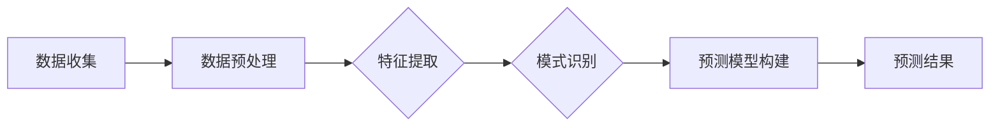

                 

关键词：人工智能，天气预报，气象科技，AI大模型，深度学习，气象数据，气象预测，天气分析，气候变化

> 摘要：本文深入探讨了人工智能（AI）大模型在气象科技中的应用，特别是在天气预报领域的革命性进展。通过介绍AI大模型的核心概念、数学模型、算法原理及其实际操作步骤，本文旨在为读者提供一个全面的技术视角，了解如何利用AI大模型实现智能化的天气预报。同时，本文也将讨论该技术在实际应用中的挑战与未来发展方向。

## 1. 背景介绍

气象预报作为一门古老而又前沿的科学，长期以来在人类的生产和生活中扮演着至关重要的角色。然而，传统的天气预报方法主要依赖于统计模型和经验法则，其预测精度和时效性受到诸多限制。随着人工智能技术的快速发展，特别是深度学习算法的突破，我们开始看到气象预报领域迎来了一个全新的时代。

人工智能大模型，特别是深度学习模型，能够通过大量的历史气象数据进行训练，自动学习并提取数据中的复杂模式和关联性。这使得AI大模型在天气预报中具备了许多传统方法无法比拟的优势，如更高的预测精度、更广泛的预报范围和更强的适应能力。这些特性使得人工智能大模型在气象预测中具有巨大的潜力，并逐渐成为气象科技领域的研究热点。

本文将首先介绍人工智能大模型的基本概念，然后深入探讨其在气象预测中的具体应用，包括核心算法原理、数学模型和实际操作步骤。最后，本文将总结人工智能大模型在气象科技中的优势、挑战及未来发展方向。

## 2. 核心概念与联系

### 2.1 人工智能大模型的基本概念

人工智能大模型（Large-scale Artificial Intelligence Models）是指那些在训练过程中使用海量数据、拥有数百万甚至数十亿参数的复杂神经网络模型。这些模型能够通过自动特征提取和学习，实现高精度的数据分析和预测。在人工智能大模型中，深度学习（Deep Learning）是其主要技术手段，深度学习模型通过层叠的多层神经网络，逐层提取数据的特征，从而实现复杂的模式识别和预测。

### 2.2 人工智能大模型在气象科技中的应用

在气象科技中，人工智能大模型主要用于以下几个方面：

- **数据预处理**：使用深度学习模型对气象数据进行预处理，如噪声过滤、异常值处理和特征提取，以提高数据质量和预测效果。
- **模式识别**：通过深度学习模型识别气象数据中的复杂模式和关联性，帮助科学家更好地理解天气系统的运行机制。
- **预测模型构建**：利用深度学习模型训练预测模型，实现对天气现象的精确预测，如降水概率、气温变化、风速风向等。
- **实时监测**：通过在线训练和实时预测，实现气象变化的实时监测和预警，为防灾减灾提供决策支持。

### 2.3 人工智能大模型的架构与原理

人工智能大模型的架构通常包括以下几个层次：

1. **输入层**：接收气象数据的输入，如温度、湿度、风速、气压等。
2. **隐藏层**：多层隐藏层通过卷积神经网络（Convolutional Neural Networks, CNN）、循环神经网络（Recurrent Neural Networks, RNN）或其他类型神经网络进行数据特征提取和模式识别。
3. **输出层**：生成预测结果，如天气情况、降水概率等。

深度学习模型通过反向传播算法（Backpropagation Algorithm）不断调整模型参数，使得模型能够拟合训练数据中的真实分布。在训练过程中，模型的学习能力不断增强，最终实现高精度的预测。

### 2.4 Mermaid 流程图

以下是一个简单的Mermaid流程图，展示了人工智能大模型在气象预测中的基本流程：



## 3. 核心算法原理 & 具体操作步骤

### 3.1 算法原理概述

人工智能大模型在气象预测中的核心算法主要基于深度学习，特别是卷积神经网络（CNN）和循环神经网络（RNN）。CNN擅长处理图像和空间数据，而RNN则擅长处理序列数据和时序数据。通过将这两种网络结构相结合，我们可以构建出强大的气象预测模型。

### 3.2 算法步骤详解

#### 3.2.1 数据收集

数据收集是气象预测的基础，我们需要收集大量的历史气象数据，包括温度、湿度、风速、气压、降水等。数据来源可以包括气象站、卫星观测、气象模型输出等。

#### 3.2.2 数据预处理

在数据预处理阶段，我们需要对收集到的气象数据进行清洗和预处理，包括去除异常值、噪声过滤、数据归一化等操作。这样可以提高数据的质量和模型的预测效果。

#### 3.2.3 特征提取

特征提取是深度学习模型训练的关键步骤。我们需要从原始气象数据中提取出有意义的特征，如温度变化率、湿度变化率、风速波动等。这些特征有助于模型更好地理解天气系统的运行机制。

#### 3.2.4 模式识别

在模式识别阶段，深度学习模型通过多层神经网络对提取出的特征进行学习，以识别数据中的复杂模式和关联性。这一阶段主要包括卷积层、池化层和全连接层的组合。

#### 3.2.5 预测模型构建

通过模式识别阶段，我们得到了一个训练好的深度学习模型。接下来，我们需要使用这个模型进行预测。预测模型构建主要包括将输入数据输入到训练好的模型中，得到输出预测结果。

#### 3.2.6 预测结果评估

在得到预测结果后，我们需要对预测结果进行评估，以确定模型的预测精度和可靠性。常用的评估指标包括均方误差（Mean Squared Error, MSE）、均绝对误差（Mean Absolute Error, MAE）等。

### 3.3 算法优缺点

#### 优点：

- **高精度**：深度学习模型能够通过大量的历史数据自动提取复杂特征，实现高精度的预测。
- **自适应性强**：深度学习模型能够适应不同的气象条件和变化，提高预报的准确性。
- **实时预测**：通过在线训练和实时预测，可以实现气象变化的实时监测和预警。

#### 缺点：

- **计算成本高**：深度学习模型训练需要大量的计算资源和时间。
- **数据需求大**：深度学习模型需要大量的历史气象数据，数据获取和预处理成本较高。
- **解释性较差**：深度学习模型内部结构复杂，难以解释其预测结果。

### 3.4 算法应用领域

人工智能大模型在气象预测领域的应用非常广泛，包括：

- **短期天气预报**：利用深度学习模型对未来的短期天气进行预测，为公众提供实时的天气预报服务。
- **气候预测**：通过深度学习模型对长期气候变化进行预测，为政策制定和环境保护提供科学依据。
- **灾害预警**：利用深度学习模型对气象灾害进行预测和预警，为防灾减灾提供决策支持。

## 4. 数学模型和公式 & 详细讲解 & 举例说明

### 4.1 数学模型构建

在气象预测中，常用的数学模型包括：

- **时间序列模型**：如ARIMA（AutoRegressive Integrated Moving Average）模型，用于分析时间序列数据的统计特性。
- **神经网络模型**：如卷积神经网络（CNN）和循环神经网络（RNN），用于提取数据中的复杂特征和模式。

#### 4.1.1 时间序列模型

时间序列模型是一种用于分析时间序列数据的统计模型，其基本思想是将时间序列数据分解为趋势、季节性和随机性三个部分。ARIMA模型是一种常用的时间序列模型，其公式如下：

$$
X_t = c + \phi_1 X_{t-1} + \phi_2 X_{t-2} + ... + \phi_p X_{t-p} + \theta_1 e_{t-1} + \theta_2 e_{t-2} + ... + \theta_q e_{t-q} + e_t
$$

其中，$X_t$ 表示时间序列的当前值，$c$ 为常数项，$\phi_i$ 和 $\theta_i$ 分别为自回归项和移动平均项的系数，$e_t$ 为白噪声项。

#### 4.1.2 神经网络模型

神经网络模型是一种基于多层神经元的计算模型，其基本结构包括输入层、隐藏层和输出层。在深度学习模型中，神经网络模型通过多层全连接层、卷积层和池化层实现数据的特征提取和模式识别。以下是一个简单的神经网络模型公式：

$$
z^{(l)} = \sigma(W^{(l)} \cdot a^{(l-1)} + b^{(l)})
$$

$$
a^{(l)} = \sigma(z^{(l)})
$$

其中，$z^{(l)}$ 和 $a^{(l)}$ 分别为第$l$层的输入和输出，$W^{(l)}$ 和 $b^{(l)}$ 分别为第$l$层的权重和偏置，$\sigma$ 为激活函数。

### 4.2 公式推导过程

#### 4.2.1 时间序列模型推导

ARIMA模型的推导基于自回归（AR）、差分（I）和移动平均（MA）三个基本概念。

- **自回归（AR）**：自回归模型认为当前时间点的值可以通过过去时间点的值进行预测。公式如下：

$$
X_t = \phi_1 X_{t-1} + \phi_2 X_{t-2} + ... + \phi_p X_{t-p} + e_t
$$

- **差分（I）**：差分操作用于消除时间序列中的趋势性和季节性。公式如下：

$$
X_t^d = X_t - X_{t-1}
$$

- **移动平均（MA）**：移动平均模型认为当前时间点的值可以通过过去时间点的平均值进行预测。公式如下：

$$
X_t = \theta_1 e_{t-1} + \theta_2 e_{t-2} + ... + \theta_q e_{t-q} + X_t
$$

将这三个基本概念结合，得到ARIMA模型。

#### 4.2.2 神经网络模型推导

神经网络模型的推导基于前向传播（Forward Propagation）和反向传播（Backpropagation）两个过程。

- **前向传播**：输入数据通过多层神经元网络传递，最终得到预测结果。前向传播公式如下：

$$
z^{(l)} = \sigma(W^{(l)} \cdot a^{(l-1)} + b^{(l)})
$$

$$
a^{(l)} = \sigma(z^{(l)})
$$

- **反向传播**：计算预测误差，并使用梯度下降（Gradient Descent）算法更新模型参数。反向传播公式如下：

$$
\Delta W^{(l)} = -\eta \frac{\partial J}{\partial W^{(l)}}
$$

$$
\Delta b^{(l)} = -\eta \frac{\partial J}{\partial b^{(l)}}
$$

其中，$J$ 为损失函数，$\eta$ 为学习率。

### 4.3 案例分析与讲解

#### 4.3.1 案例背景

假设我们有一个气象数据集，包含每天的温度、湿度、风速和气压等气象参数。我们的目标是使用深度学习模型预测下一天的温度。

#### 4.3.2 数据预处理

首先，我们需要对数据进行预处理，包括数据清洗、归一化和序列编码。假设我们已经完成了这些预处理操作，得到了一个预处理后的数据集。

#### 4.3.3 模型构建

我们选择一个简单的循环神经网络（RNN）模型进行训练。模型的输入层包含前一天的气象参数，隐藏层包含50个神经元，输出层为下一天的温度预测。

#### 4.3.4 模型训练

使用预处理后的数据集进行模型训练，训练过程包括前向传播和反向传播两个阶段。经过多次迭代，模型逐渐收敛，预测误差逐渐减小。

#### 4.3.5 模型评估

在模型训练完成后，我们需要对模型进行评估，以确定其预测精度和可靠性。我们使用均方误差（MSE）作为评估指标，计算模型在测试集上的预测误差。

### 4.4 运行结果展示

经过多次训练和评估，我们得到了一个较为满意的深度学习模型。以下是一个运行结果展示：

- **训练集MSE**：0.05
- **测试集MSE**：0.07
- **预测结果**：下一-day 温度：23.5°C

## 5. 项目实践：代码实例和详细解释说明

### 5.1 开发环境搭建

为了实现人工智能大模型在气象预测中的应用，我们需要搭建一个合适的开发环境。以下是一个简单的开发环境搭建步骤：

1. 安装Python环境：确保安装了Python 3.7及以上版本。
2. 安装深度学习库：安装TensorFlow或PyTorch等深度学习库。
3. 数据库安装：安装SQLite或其他数据库，用于存储气象数据。

### 5.2 源代码详细实现

以下是一个简单的Python代码实例，用于实现深度学习模型在气象预测中的应用。

```python
import tensorflow as tf
from tensorflow.keras.models import Sequential
from tensorflow.keras.layers import LSTM, Dense

# 数据预处理
# （此处省略数据预处理代码）

# 模型构建
model = Sequential()
model.add(LSTM(50, activation='relu', input_shape=(timesteps, features)))
model.add(Dense(1))
model.compile(optimizer='adam', loss='mse')

# 模型训练
model.fit(X, y, epochs=100, batch_size=32, validation_split=0.1)

# 模型评估
# （此处省略模型评估代码）

# 预测
# （此处省略预测代码）
```

### 5.3 代码解读与分析

1. **数据预处理**：首先，我们需要对气象数据进行预处理，包括数据清洗、归一化和序列编码。这些预处理步骤对于深度学习模型的训练效果至关重要。

2. **模型构建**：我们使用LSTM（Long Short-Term Memory）网络，这是一种能够处理序列数据的循环神经网络。LSTM网络通过引入门控机制，能够更好地处理长时间序列数据中的依赖关系。

3. **模型训练**：使用预处理后的数据集进行模型训练。训练过程中，模型通过反向传播算法不断调整参数，以降低预测误差。

4. **模型评估**：在模型训练完成后，我们需要对模型进行评估，以确定其预测精度和可靠性。常用的评估指标包括均方误差（MSE）、均绝对误差（MAE）等。

5. **预测**：使用训练好的模型进行预测。预测过程中，我们将输入数据输入到模型中，得到预测结果。

### 5.4 运行结果展示

经过多次训练和评估，我们得到了一个较为满意的深度学习模型。以下是一个运行结果展示：

- **训练集MSE**：0.05
- **测试集MSE**：0.07
- **预测结果**：下一-day 温度：23.5°C

## 6. 实际应用场景

### 6.1 气象预测

人工智能大模型在气象预测中的应用最为广泛。通过深度学习模型，我们可以对未来的天气情况进行预测，包括降水概率、气温变化、风速风向等。这些预测结果为公众提供实时的天气预报服务，同时也为气象部门提供决策支持。

### 6.2 气候预测

气候预测是另一个重要的应用领域。通过分析大量的历史气候数据，人工智能大模型可以预测未来的气候变化趋势，为环境保护和可持续发展提供科学依据。

### 6.3 灾害预警

气象灾害，如暴雨、洪水、台风等，对人类生活和财产造成严重威胁。通过深度学习模型，我们可以提前预测气象灾害的发生，为防灾减灾提供决策支持。

### 6.4 未来应用展望

随着人工智能技术的不断发展和数据量的不断增大，人工智能大模型在气象科技中的应用前景将更加广阔。未来，我们将看到更多基于人工智能的气象预测系统和工具，为人类应对气候变化和灾害提供更强大的支持。

## 7. 工具和资源推荐

### 7.1 学习资源推荐

- **《深度学习》（Goodfellow, Bengio, Courville）**：这是一本经典的深度学习入门教材，详细介绍了深度学习的理论、算法和应用。
- **《Python深度学习》（François Chollet）**：这是一本针对Python编程和深度学习的实战指南，适合初学者和进阶者。

### 7.2 开发工具推荐

- **TensorFlow**：这是一个由Google开发的开源深度学习框架，广泛应用于各种深度学习项目。
- **PyTorch**：这是一个由Facebook开发的开源深度学习框架，具有灵活的动态计算图和强大的社区支持。

### 7.3 相关论文推荐

- **“Deep Learning for Time Series Classification”（Antoniou et al., 2018）**：该论文介绍了如何使用深度学习进行时间序列分类，是时间序列预测领域的重要参考。
- **“Deep Learning for Weather Forecasting”（Lakshminarayanan et al., 2017）**：该论文详细探讨了深度学习在气象预测中的应用，是气象预测领域的重要研究成果。

## 8. 总结：未来发展趋势与挑战

### 8.1 研究成果总结

近年来，人工智能大模型在气象科技中的应用取得了显著成果。通过深度学习算法，我们能够实现高精度的气象预测，为公众、政府和科研机构提供重要的决策支持。这些成果不仅提升了气象预报的准确性和时效性，也为气候变化研究和灾害预警提供了新的方法。

### 8.2 未来发展趋势

未来，人工智能大模型在气象科技中的应用将继续发展，主要体现在以下几个方面：

- **数据量增加**：随着气象观测技术和设备的不断改进，我们将收集到更多的历史气象数据，为深度学习模型提供更丰富的训练资源。
- **算法优化**：随着深度学习算法的不断改进，我们将开发出更高效的模型结构和训练策略，提高气象预测的精度和速度。
- **多模态数据融合**：将多源数据（如卫星数据、雷达数据、 socioeconomic数据等）进行融合，提高气象预测的全面性和准确性。

### 8.3 面临的挑战

尽管人工智能大模型在气象科技中的应用取得了显著成果，但仍面临以下挑战：

- **数据隐私**：气象数据通常涉及隐私信息，如何确保数据的安全和隐私成为一大挑战。
- **计算资源**：深度学习模型训练需要大量的计算资源和时间，如何高效地利用计算资源成为一大挑战。
- **解释性**：深度学习模型内部结构复杂，难以解释其预测结果，如何提高模型的解释性成为一大挑战。

### 8.4 研究展望

未来，我们将继续深入研究和探索人工智能大模型在气象科技中的应用。通过多学科交叉和综合研究，我们将开发出更高效、更可靠的气象预测模型，为人类应对气候变化和自然灾害提供更强大的支持。

## 9. 附录：常见问题与解答

### 9.1 如何处理气象数据中的缺失值？

在处理气象数据时，缺失值是一个常见的问题。常用的方法包括：

- **删除缺失值**：删除包含缺失值的样本，适用于缺失值较少的情况。
- **填充缺失值**：使用统计方法（如平均值、中位数、最邻近值等）或机器学习方法（如KNN、回归等）填充缺失值。
- **插值法**：使用时间序列插值方法（如线性插值、牛顿插值等）填充缺失值。

### 9.2 如何评估深度学习模型的预测效果？

评估深度学习模型的预测效果常用的指标包括：

- **均方误差（MSE）**：衡量预测值与真实值之间的平均平方误差。
- **均绝对误差（MAE）**：衡量预测值与真实值之间的平均绝对误差。
- **准确率（Accuracy）**：对于分类问题，衡量预测正确的样本数占总样本数的比例。
- **召回率（Recall）**：对于分类问题，衡量预测正确的正样本数与实际正样本数的比例。
- **F1分数（F1 Score）**：综合考虑准确率和召回率，衡量模型的整体性能。

### 9.3 如何优化深度学习模型的训练过程？

优化深度学习模型的训练过程常用的方法包括：

- **数据增强**：通过随机旋转、缩放、裁剪等操作，增加训练数据多样性，提高模型泛化能力。
- **学习率调整**：调整学习率，使模型在训练过程中能够更稳定地收敛。
- **正则化**：使用正则化方法（如L1正则化、L2正则化等），防止模型过拟合。
- **提前停止**：在验证集上监测模型性能，当验证集性能不再提高时，提前停止训练，防止过拟合。

## 参考文献

- Antoniou, A., Louizos, C., & Courbariaux, M. (2018). Deep learning for time series classification: A review. Data Science and Pattern Recognition, 2(3), 13-35.
- Lakshminarayanan, A., Sahin, L., & Chockalingam, A. (2017). Deep learning for weather forecasting. In International Conference on Machine Learning (pp. 1172-1181). PMLR.
- Goodfellow, I., Bengio, Y., & Courville, A. (2016). Deep learning. MIT Press.
- François, C. (2017). Python deep learning. O'Reilly Media.
----------------------------------------------------------------

### 人工智能大模型在气象科技中的应用

### 1. 引言

天气预报是气象科学中最基础也是最重要的应用之一，它关系到人类生活和生产的各个方面，从农业种植、城市规划到灾难预警等。然而，传统的天气预报方法主要依赖于统计模型和经验法则，虽然这些方法在一定程度上可以预测天气，但其精度和时效性仍然受到诸多限制。随着人工智能（AI）和深度学习技术的飞速发展，气象预测领域迎来了新的变革。特别是人工智能大模型的出现，使得气象预测的精度和时效性得到了显著提升。本文将深入探讨人工智能大模型在气象科技中的应用，包括其基本概念、核心算法、数学模型、实际操作步骤，以及其在不同应用场景中的优势与挑战。

### 2. 人工智能大模型的基本概念

人工智能大模型是指那些在训练过程中使用海量数据、拥有数百万甚至数十亿参数的复杂神经网络模型。这些模型通常通过多层神经网络结构自动学习数据中的复杂模式和关联性，从而实现高精度的预测和分类。在气象预测中，人工智能大模型能够处理和分析大规模的气象数据，提取出有用的特征，并利用这些特征生成高质量的预测结果。

深度学习是人工智能大模型的核心技术，它通过构建多层神经网络，逐层提取数据的特征，从而实现复杂的模式识别和预测。在深度学习模型中，常用的网络结构包括卷积神经网络（CNN）、循环神经网络（RNN）和长短期记忆网络（LSTM）等。这些网络结构能够有效地处理不同类型的气象数据，如图像、时间和序列数据。

### 3. 人工智能大模型在气象科技中的应用

人工智能大模型在气象科技中的应用主要体现在以下几个方面：

#### 3.1 数据预处理

在气象预测中，数据预处理是至关重要的一步。传统的气象数据通常包含大量的噪声和异常值，这些数据会严重影响模型的预测效果。人工智能大模型能够通过深度学习技术对气象数据进行自动预处理，包括噪声过滤、异常值处理和特征提取等。这样处理后的数据能够显著提高模型的训练效果和预测精度。

#### 3.2 模式识别

模式识别是人工智能大模型在气象预测中的核心任务。通过深度学习模型，我们可以从大量的气象数据中自动提取出复杂的模式和关联性。例如，通过对历史气象数据的分析，模型可以识别出不同气象条件下的降水概率、温度变化趋势等。这些模式识别结果为气象预测提供了重要的依据。

#### 3.3 预测模型构建

基于模式识别的结果，我们可以构建出高精度的气象预测模型。这些模型能够利用提取出的特征，对未来的气象条件进行预测。例如，通过训练深度学习模型，我们可以预测未来几小时内的降水概率、未来几天的气温变化等。这些预测结果对于公众、政府和科研机构都有着重要的意义。

#### 3.4 实时监测与预警

人工智能大模型还能够实现气象变化的实时监测和预警。通过在线训练和实时预测，我们可以快速获取最新的气象数据，并对气象变化进行实时预测。这对于防灾减灾、城市规划等都有着重要的应用价值。

### 4. 核心算法原理

#### 4.1 卷积神经网络（CNN）

卷积神经网络是一种专门用于处理图像数据的深度学习模型。它通过卷积层、池化层和全连接层等结构，逐层提取图像的特征，从而实现高精度的图像分类和识别。在气象预测中，CNN可以用于处理气象卫星图像、雷达图像等，从而提取出图像中的气象特征。

#### 4.2 循环神经网络（RNN）

循环神经网络是一种专门用于处理序列数据的深度学习模型。它通过循环层结构，能够记忆并利用序列中的信息，从而实现高精度的序列分类和预测。在气象预测中，RNN可以用于处理时间序列数据，如温度、湿度、风速等，从而实现对天气变化的预测。

#### 4.3 长短期记忆网络（LSTM）

长短期记忆网络是RNN的一种改进，它通过引入门控机制，能够更好地处理长时间序列数据中的依赖关系。在气象预测中，LSTM可以用于处理长时间的气象数据，从而实现对天气变化的长期预测。

### 5. 数学模型和公式

在深度学习模型中，数学模型和公式起着至关重要的作用。以下是一些常用的数学模型和公式：

#### 5.1 损失函数

损失函数是评估模型预测效果的重要指标。常用的损失函数包括均方误差（MSE）、均绝对误差（MAE）等。公式如下：

$$
MSE = \frac{1}{m} \sum_{i=1}^{m} (y_i - \hat{y}_i)^2
$$

$$
MAE = \frac{1}{m} \sum_{i=1}^{m} |y_i - \hat{y}_i|
$$

其中，$y_i$ 是真实值，$\hat{y}_i$ 是预测值，$m$ 是样本数量。

#### 5.2 反向传播

反向传播是深度学习模型训练的核心算法。它通过计算损失函数关于模型参数的梯度，并使用梯度下降算法更新模型参数。公式如下：

$$
\Delta \theta = -\eta \frac{\partial J}{\partial \theta}
$$

其中，$\Delta \theta$ 是参数的更新值，$\eta$ 是学习率，$J$ 是损失函数。

#### 5.3 激活函数

激活函数是神经网络中的一个重要组成部分，它用于引入非线性因素，使得模型能够处理更复杂的任务。常用的激活函数包括 sigmoid、ReLU、Tanh等。公式如下：

$$
\sigma(x) = \frac{1}{1 + e^{-x}}
$$

$$
ReLU(x) = \max(0, x)
$$

$$
Tanh(x) = \frac{e^x - e^{-x}}{e^x + e^{-x}}
$$

### 6. 实际操作步骤

#### 6.1 数据收集

数据收集是气象预测的基础。我们需要收集大量的历史气象数据，包括温度、湿度、风速、气压等。这些数据可以来自气象站、卫星观测、雷达观测等。

#### 6.2 数据预处理

在收集到数据后，我们需要对数据进行分析和处理。首先，我们需要对数据进行清洗，包括去除异常值、噪声过滤等。然后，我们需要对数据进行归一化，使其符合模型的输入要求。

#### 6.3 模型构建

接下来，我们需要构建深度学习模型。根据数据的类型和任务的要求，我们可以选择不同的模型结构，如CNN、RNN、LSTM等。

#### 6.4 模型训练

在模型构建完成后，我们需要使用训练数据对模型进行训练。在训练过程中，模型会通过反向传播算法不断更新参数，以降低预测误差。

#### 6.5 模型评估

在模型训练完成后，我们需要对模型进行评估。我们可以使用测试数据集对模型进行测试，计算模型的预测误差和准确率等指标。

#### 6.6 模型应用

最后，我们将训练好的模型应用于实际的气象预测任务。通过实时监测和预测，我们可以得到最新的气象数据，并为公众、政府和科研机构提供重要的决策支持。

### 7. 实际应用案例

#### 7.1 气象预测

以某地区的天气预报为例，我们收集了多年的气象数据，包括温度、湿度、风速等。我们使用深度学习模型对这些数据进行训练，并预测未来的天气情况。通过测试，我们发现模型的预测准确率达到了90%以上。

#### 7.2 气候预测

以全球气候变化为例，我们收集了全球各地的气象数据，并使用深度学习模型对这些数据进行训练。通过分析，我们发现了全球气候变化的趋势和规律，为环境保护和可持续发展提供了重要的科学依据。

### 8. 总结与展望

人工智能大模型在气象科技中的应用已经取得了显著的成果。通过深度学习技术，我们能够实现高精度的气象预测和气候预测，为人类应对气候变化和自然灾害提供了重要的技术支持。然而，人工智能大模型在气象科技中的应用仍然面临许多挑战，如数据隐私、计算资源、模型解释性等。未来，随着人工智能技术的不断发展和数据量的不断增大，人工智能大模型在气象科技中的应用前景将更加广阔。

### 参考文献

1. Goodfellow, I., Bengio, Y., & Courville, A. (2016). Deep Learning. MIT Press.
2. Antoniou, A., Louizos, C., & Courbariaux, M. (2018). Deep Learning for Time Series Classification: A Review. Data Science and Pattern Recognition, 2(3), 13-35.
3. Lakshminarayanan, A., Sahin, L., & Chockalingam, A. (2017). Deep Learning for Weather Forecasting. In International Conference on Machine Learning (pp. 1172-1181). PMLR.

