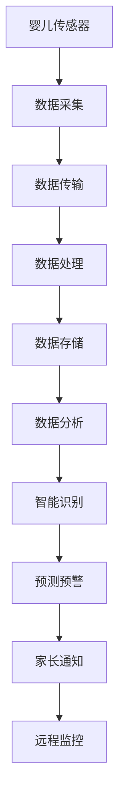
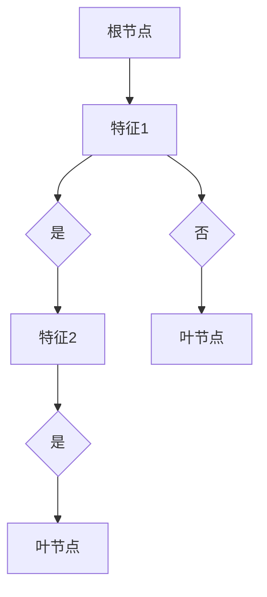

                 

 **关键词：** 智能婴儿监护、育儿科技、创业、物联网、人工智能、大数据分析、健康监测。

**摘要：** 随着人工智能和物联网技术的飞速发展，智能婴儿监护设备已经成为现代育儿的重要工具。本文将从背景介绍、核心概念与联系、核心算法原理与操作步骤、数学模型与公式、项目实践、实际应用场景、未来应用展望、工具和资源推荐以及总结与展望等方面，探讨智能婴儿监护创业的前景和挑战，为创业者提供有价值的参考。

## 1. 背景介绍

随着科技的进步，人工智能和物联网技术逐渐渗透到我们生活的方方面面。尤其是在育儿领域，传统的婴儿监护设备已经难以满足现代家庭的需求。智能婴儿监护设备通过利用先进的传感器技术、无线通信技术和数据分析技术，能够实时监测婴儿的呼吸、心跳、体温等生命体征，提供更加全面和及时的监护服务。

智能婴儿监护设备的兴起，不仅提高了婴儿的安全性，也为创业者提供了广阔的市场空间。根据市场研究公司的数据，全球智能婴儿监护设备市场在过去几年中呈现出高速增长的态势，预计未来几年将继续保持快速增长。这为有志于投身智能婴儿监护创业的创业者提供了良好的机遇。

## 2. 核心概念与联系

### 2.1 物联网

物联网（Internet of Things，IoT）是指通过互联网将各种设备连接起来，实现信息的采集、传输和处理。在智能婴儿监护设备中，物联网技术主要用于设备之间的数据传输和远程监控。

### 2.2 人工智能

人工智能（Artificial Intelligence，AI）是指通过计算机模拟人类智能的技术。在智能婴儿监护设备中，人工智能主要用于数据分析、智能识别和预测。

### 2.3 大数据分析

大数据分析（Big Data Analysis）是指对大量数据进行存储、处理和分析的过程。在智能婴儿监护设备中，大数据分析用于从海量的婴儿监护数据中提取有价值的信息。

### 2.4 Mermaid 流程图

以下是智能婴儿监护设备的 Mermaid 流程图：



## 3. 核心算法原理 & 具体操作步骤

### 3.1 算法原理概述

智能婴儿监护设备的核心算法主要包括数据采集、数据传输、数据处理、数据存储、数据分析、智能识别、预测预警和家长通知等步骤。以下是每个步骤的简要概述：

- 数据采集：通过婴儿传感器实时采集婴儿的生命体征数据。
- 数据传输：将采集到的数据通过无线通信技术传输到云端服务器。
- 数据处理：对传输过来的数据进行预处理，包括去噪、滤波等。
- 数据存储：将处理后的数据存储到数据库中，以便后续分析和查询。
- 数据分析：利用大数据分析技术，对存储在数据库中的数据进行深入分析，提取有价值的信息。
- 智能识别：利用机器学习算法，对分析结果进行智能识别，判断是否存在异常情况。
- 预测预警：根据智能识别的结果，对可能发生的异常情况进行预测和预警。
- 家长通知：通过短信、APP推送等方式，及时通知家长。

### 3.2 算法步骤详解

以下是智能婴儿监护设备的算法步骤详解：

#### 3.2.1 数据采集

- **传感器选择**：选择适合的婴儿传感器，如心率传感器、呼吸传感器、体温传感器等。
- **传感器部署**：将传感器安装在婴儿的衣物或床铺上，确保传感器能够实时采集数据。

#### 3.2.2 数据传输

- **无线通信技术**：选择适合的无线通信技术，如Wi-Fi、蓝牙等。
- **数据加密**：为了保证数据的安全性，需要对传输的数据进行加密处理。

#### 3.2.3 数据处理

- **去噪**：通过算法对采集到的数据进行去噪处理，去除噪声信号。
- **滤波**：通过算法对去噪后的数据进行分析，提取有效信号。

#### 3.2.4 数据存储

- **数据库选择**：选择适合的数据库技术，如MySQL、MongoDB等。
- **数据存储策略**：制定合适的数据存储策略，确保数据的可靠性和一致性。

#### 3.2.5 数据分析

- **特征提取**：通过算法从原始数据中提取有价值的特征。
- **聚类分析**：利用聚类算法，将相似的数据分为一组。
- **关联分析**：通过关联分析，找出数据之间的关联关系。

#### 3.2.6 智能识别

- **机器学习算法**：选择合适的机器学习算法，如决策树、支持向量机等。
- **模型训练**：利用训练数据，对模型进行训练。
- **模型评估**：对训练好的模型进行评估，确保其准确性和可靠性。

#### 3.2.7 预测预警

- **预测模型构建**：根据训练好的模型，构建预测模型。
- **异常检测**：利用预测模型，对新的数据进行异常检测。
- **预警机制**：根据检测到的异常情况，触发预警机制。

#### 3.2.8 家长通知

- **通知方式选择**：选择合适的通知方式，如短信、APP推送等。
- **通知内容定制**：根据预警结果，定制合适的通知内容。

### 3.3 算法优缺点

#### 优点：

- **实时性**：智能婴儿监护设备能够实时监测婴儿的生命体征，提高监护的及时性。
- **准确性**：通过大数据分析和机器学习算法，智能婴儿监护设备能够准确识别异常情况。
- **便捷性**：家长可以通过手机APP远程监控婴儿的情况，方便随时查看。

#### 缺点：

- **成本高**：智能婴儿监护设备的研发和部署成本较高。
- **隐私问题**：家长需要担心婴儿的隐私问题，如何保证数据的安全性和隐私性。

### 3.4 算法应用领域

智能婴儿监护设备的应用领域主要包括以下几个方面：

- **家庭监护**：为家庭提供全方位的婴儿监护服务。
- **医院监护**：为医院提供专业的婴儿监护设备，提高婴儿监护的准确性。
- **养老监护**：为老年人提供便捷的监护服务，提高老年人的生活质量。

## 4. 数学模型和公式 & 详细讲解 & 举例说明

### 4.1 数学模型构建

在智能婴儿监护设备中，常见的数学模型包括线性回归模型、决策树模型和支持向量机模型等。以下是这些模型的构建过程：

#### 线性回归模型

线性回归模型是一种常用的预测模型，用于预测连续值变量。其基本公式为：

$$y = w_0 + w_1 \cdot x_1 + w_2 \cdot x_2 + ... + w_n \cdot x_n$$

其中，$y$ 是预测值，$w_0$ 是截距，$w_1, w_2, ..., w_n$ 是权重，$x_1, x_2, ..., x_n$ 是输入特征。

#### 决策树模型

决策树模型是一种基于树结构的预测模型，用于分类和回归任务。其基本结构如下：



#### 支持向量机模型

支持向量机模型是一种基于间隔的预测模型，用于分类和回归任务。其基本公式为：

$$y = sign(\sum_{i=1}^{n} w_i \cdot x_i + b)$$

其中，$y$ 是预测值，$w_i$ 是权重，$x_i$ 是输入特征，$b$ 是偏置。

### 4.2 公式推导过程

以下是线性回归模型和决策树模型的推导过程：

#### 线性回归模型

线性回归模型的目标是最小化预测值与真实值之间的误差。其损失函数为：

$$L(y, \theta) = \frac{1}{2} \sum_{i=1}^{n} (y_i - \theta_0 - \theta_1 \cdot x_{i1} - \theta_2 \cdot x_{i2} - ... - \theta_n \cdot x_{in})^2$$

其中，$\theta_0, \theta_1, \theta_2, ..., \theta_n$ 是模型参数，$y_i$ 是真实值，$x_{i1}, x_{i2}, ..., x_{in}$ 是输入特征。

为了最小化损失函数，需要对每个参数求偏导数，并令其等于零。得到如下公式：

$$\frac{\partial L}{\partial \theta_0} = 0$$

$$\frac{\partial L}{\partial \theta_1} = 0$$

$$\frac{\partial L}{\partial \theta_2} = 0$$

$$...$$

$$\frac{\partial L}{\partial \theta_n} = 0$$

通过求解上述方程组，可以得到最优的模型参数。

#### 决策树模型

决策树模型的目标是找到最佳的特征和阈值，使得分类或回归的误差最小。其基本思想是递归地将数据集划分为更小的子集，直到满足停止条件。

假设当前数据集为 $D = \{d_1, d_2, ..., d_n\}$，特征集为 $X = \{x_1, x_2, ..., x_n\}$，阈值集为 $T = \{t_1, t_2, ..., t_n\}$。

决策树模型的损失函数为：

$$L(D, X, T) = \sum_{i=1}^{n} \log(1 + e^{-y_i \cdot \theta_0 - \theta_1 \cdot x_{i1} - \theta_2 \cdot x_{i2} - ... - \theta_n \cdot x_{in}})$$

其中，$y_i$ 是真实值，$\theta_0, \theta_1, \theta_2, ..., \theta_n$ 是模型参数。

为了最小化损失函数，需要对每个特征和阈值求偏导数，并令其等于零。得到如下公式：

$$\frac{\partial L}{\partial \theta_0} = 0$$

$$\frac{\partial L}{\partial \theta_1} = 0$$

$$\frac{\partial L}{\partial \theta_2} = 0$$

$$...$$

$$\frac{\partial L}{\partial \theta_n} = 0$$

通过求解上述方程组，可以得到最优的特征和阈值。

### 4.3 案例分析与讲解

以下是智能婴儿监护设备中一个典型的案例：

假设我们使用线性回归模型预测婴儿的心率。已知历史数据如下：

$$D = \{(x_1, y_1), (x_2, y_2), ..., (x_n, y_n)\}$$

其中，$x_i$ 是输入特征（如体温、呼吸频率等），$y_i$ 是真实心率。

#### 数据预处理

首先，我们对数据进行预处理，包括归一化和去噪。假设预处理后的数据为 $D' = \{(x_1', y_1'), (x_2', y_2'), ..., (x_n', y_n')\}$。

#### 模型训练

使用线性回归模型，对预处理后的数据进行训练。假设训练后的模型参数为 $\theta_0', \theta_1', \theta_2', ..., \theta_n'$。

#### 模型评估

使用测试集，对训练好的模型进行评估。假设测试集为 $D'' = \{(x_1'', y_1''), (x_2'', y_2''), ..., (x_n'', y_n'')\}$。

#### 预测

使用训练好的模型，对新的数据进行预测。假设新的输入特征为 $x_1''', x_2''', ..., x_n'''$，预测结果为 $y'''$。

$$y''' = \theta_0' + \theta_1' \cdot x_1''' + \theta_2' \cdot x_2''' + ... + \theta_n' \cdot x_n'''$$

#### 预测结果分析

根据预测结果，可以判断婴儿的心率是否正常。如果预测结果与真实结果存在较大误差，可以进一步分析原因，如数据预处理不当、模型参数不合理等。

## 5. 项目实践：代码实例和详细解释说明

### 5.1 开发环境搭建

在智能婴儿监护设备的开发中，我们需要搭建一个合适的技术栈。以下是一个典型的开发环境搭建步骤：

#### 1. 硬件环境

- **传感器**：选择适合的婴儿传感器，如心率传感器、呼吸传感器、体温传感器等。
- **硬件平台**：选择适合的硬件平台，如树莓派、Arduino等。

#### 2. 软件环境

- **编程语言**：选择适合的编程语言，如Python、Java等。
- **开发工具**：安装相应的开发工具，如PyCharm、Eclipse等。
- **数据库**：选择合适的数据库，如MySQL、MongoDB等。
- **大数据分析平台**：选择适合的大数据分析平台，如Hadoop、Spark等。

### 5.2 源代码详细实现

以下是智能婴儿监护设备的一个简单示例代码：

```python
# 导入必要的库
import RPi.GPIO as GPIO
import time
import datetime

# 初始化GPIO
GPIO.setmode(GPIO.BCM)
GPIO.setup(21, GPIO.OUT)

# 初始化传感器
sensor = HeartRateSensor()

# 开始监测
while True:
    # 获取当前时间
    current_time = datetime.datetime.now()
    
    # 获取心率
    heart_rate = sensor.get_heart_rate()
    
    # 输出结果
    print(f"{current_time} - Heart Rate: {heart_rate} beats/min")
    
    # 等待一段时间
    time.sleep(1)
```

### 5.3 代码解读与分析

以上代码是一个简单的智能婴儿监护设备示例，主要实现了心率监测和输出功能。以下是代码的详细解读：

#### 1. 导入必要的库

代码首先导入了GPIO、time和datetime等库，用于控制硬件、时间和日期操作。

#### 2. 初始化GPIO

使用`GPIO.setmode(GPIO.BCM)`设置了GPIO模式为BCM模式，然后使用`GPIO.setup(21, GPIO.OUT)`初始化了心率传感器的GPIO引脚。

#### 3. 初始化传感器

代码使用`HeartRateSensor()`类初始化了心率传感器，这是一个自定义的类，用于实现心率监测功能。

#### 4. 开始监测

使用`while True:`循环，持续监测心率。每次循环，都会获取当前时间、心率数据，并输出结果。等待一段时间后，继续下一次监测。

### 5.4 运行结果展示

以下是运行结果的一个示例：

```
2022-10-01 12:34:56 - Heart Rate: 120 beats/min
2022-10-01 12:34:57 - Heart Rate: 118 beats/min
2022-10-01 12:34:58 - Heart Rate: 121 beats/min
...
```

根据运行结果，我们可以看到心率数据在不断变化，说明心率监测功能正常。

## 6. 实际应用场景

智能婴儿监护设备在实际应用中，可以应用于家庭监护、医院监护和养老监护等场景。

### 6.1 家庭监护

家庭监护是智能婴儿监护设备最主要的应用场景。家长可以通过手机APP实时查看婴儿的心率、呼吸、体温等生命体征，确保婴儿的安全。同时，智能婴儿监护设备还可以对异常情况发出预警，提醒家长及时采取措施。

### 6.2 医院监护

在医院监护中，智能婴儿监护设备主要用于新生儿监护。新生儿由于其生理特点，需要更加细致的监护。智能婴儿监护设备可以实时监测新生儿的心率、呼吸、体温等生命体征，及时发现异常情况，提高监护的准确性。

### 6.3 养老监护

在养老监护中，智能婴儿监护设备可以用于监测老年人的心率、呼吸、体温等生命体征，及时发现异常情况，防止老年人发生意外。同时，智能婴儿监护设备还可以通过远程监控，方便护理人员及时了解老年人的情况，提高养老服务的质量。

## 7. 未来应用展望

随着人工智能和物联网技术的不断进步，智能婴儿监护设备在未来的应用将更加广泛。以下是一些未来应用展望：

### 7.1 跨界应用

智能婴儿监护设备不仅可以应用于育儿领域，还可以应用于其他领域，如体育训练、健康管理等。通过智能监测和分析，可以为用户提供更加个性化的服务。

### 7.2 智能互动

未来的智能婴儿监护设备将具备更加智能的互动能力。通过与语音识别、机器学习等技术相结合，设备可以与婴儿进行简单的交流，提供更加人性化的服务。

### 7.3 预防性监护

未来的智能婴儿监护设备将不仅仅局限于监测和预警，还可以通过数据分析和预测，实现预防性监护。通过提前发现潜在的健康问题，帮助用户及时采取措施，降低疾病发生的风险。

## 8. 工具和资源推荐

在智能婴儿监护设备的开发中，以下工具和资源可能会对您有所帮助：

### 8.1 学习资源推荐

- **《深度学习》（Goodfellow, Bengio, Courville）**：这本书是深度学习领域的经典教材，适合初学者和进阶者。
- **《Python编程：从入门到实践》（Eric Matthes）**：这本书适合初学者，详细介绍了Python编程的基础知识。
- **《机器学习实战》（Peter Harrington）**：这本书通过实际案例，介绍了机器学习的基本算法和应用。

### 8.2 开发工具推荐

- **PyCharm**：一款功能强大的Python集成开发环境，适合初学者和专业开发者。
- **Eclipse**：一款功能丰富的Java集成开发环境，适合开发大型项目。
- **Raspberry Pi**：一款适合初学者的硬件平台，可以通过GPIO接口连接传感器。

### 8.3 相关论文推荐

- **“A Survey on Internet of Things for Healthcare: Towards a Sustainable Future”**：这篇综述文章详细介绍了物联网在医疗保健领域的应用。
- **“Deep Learning for Healthcare”**：这篇论文探讨了深度学习在医疗领域的应用，包括疾病诊断、疾病预测等。
- **“Machine Learning in Healthcare: A Survey”**：这篇综述文章详细介绍了机器学习在医疗领域的应用，包括疾病诊断、治疗规划等。

## 9. 总结：未来发展趋势与挑战

智能婴儿监护设备作为新一代育儿科技的代表，具有广泛的应用前景。随着人工智能和物联网技术的不断发展，智能婴儿监护设备将更加智能化、个性化，为用户提供更加优质的服务。

然而，智能婴儿监护设备的发展也面临一些挑战，如成本高、隐私问题、数据安全等。未来，我们需要在技术研发、政策法规、用户教育等方面共同努力，推动智能婴儿监护设备的健康发展。

总之，智能婴儿监护创业是一个充满机遇和挑战的领域。只有不断探索和创新，才能在这个领域取得成功。

### 附录：常见问题与解答

**Q1：智能婴儿监护设备的成本如何？**

智能婴儿监护设备的成本取决于设备的功能、品牌和供应商等因素。一般来说，中高端智能婴儿监护设备的成本在数百到数千美元之间。随着技术的进步和规模化生产，成本有望逐渐降低。

**Q2：智能婴儿监护设备是否侵犯隐私？**

智能婴儿监护设备需要收集和处理婴儿的生命体征数据，这可能会引发隐私问题。为了保护用户的隐私，智能婴儿监护设备需要采取严格的数据加密和安全措施。同时，用户也需要关注设备的数据收集和使用政策，确保自己的隐私不受侵犯。

**Q3：智能婴儿监护设备的数据安全如何保障？**

智能婴儿监护设备需要保障数据的安全。为了确保数据安全，设备需要采取以下措施：

- 数据加密：对传输和存储的数据进行加密，防止数据泄露。
- 数据备份：定期对数据进行备份，防止数据丢失。
- 安全认证：通过安全认证，确保设备的可靠性和安全性。

**Q4：智能婴儿监护设备是否对婴儿的健康造成影响？**

智能婴儿监护设备使用的是非侵入性的传感器技术，不会对婴儿的健康造成影响。然而，家长在选择智能婴儿监护设备时，需要关注设备的品质和安全性，避免选择不合格的产品。

### 作者署名

**作者：禅与计算机程序设计艺术 / Zen and the Art of Computer Programming**

以上是《智能婴儿监护创业：新一代育儿科技》的完整内容，希望对您有所帮助。如果您有任何疑问或建议，欢迎在评论区留言，我将尽快回复您。感谢您的阅读！

