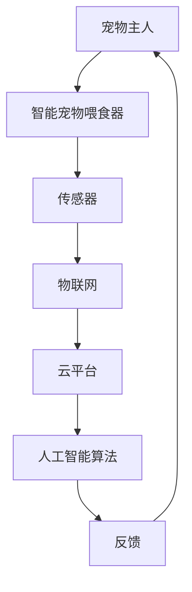

                 

关键词：智能宠物喂食器、远程宠物照顾、物联网、人工智能、创业

摘要：随着现代社会生活节奏的加快，人们越来越重视宠物照顾的便利性。智能宠物喂食器作为一种创新产品，能够远程控制宠物饮食，为宠物主人提供便利。本文将探讨智能宠物喂食器的创业机会，以及如何利用物联网和人工智能技术实现远程宠物照顾。

## 1. 背景介绍

### 1.1 宠物市场的现状

全球宠物市场规模逐年增长，宠物已经成为许多家庭的亲密伙伴。据调研数据显示，全球宠物市场规模已经超过千亿美元，并有望在未来保持持续增长。其中，宠物主人对宠物健康和福祉的关注度不断提高，为智能宠物产品提供了广阔的市场空间。

### 1.2 智能宠物喂食器的需求

随着宠物数量的增加，宠物主人对宠物照顾的需求也随之增加。尤其是对于上班族和经常出差的宠物主人来说，如何确保宠物按时吃饭成为一大难题。智能宠物喂食器能够远程控制宠物的饮食，解决宠物主人的后顾之忧。

### 1.3 物联网和人工智能的发展

物联网和人工智能技术的快速发展，为智能宠物喂食器的研发和应用提供了技术支持。通过物联网技术，智能宠物喂食器可以实现与宠物主人的实时连接，通过人工智能技术，智能宠物喂食器可以自动调整喂食时间和量，提高宠物生活的质量。

## 2. 核心概念与联系

### 2.1 物联网（IoT）

物联网是指通过传感器、无线网络等技术，将各种设备连接起来，实现信息的实时传输和共享。在智能宠物喂食器中，物联网技术主要用于实现宠物主人与宠物喂食器的远程连接。

### 2.2 人工智能（AI）

人工智能是指通过计算机模拟人类的智能行为，实现自动化决策和智能服务。在智能宠物喂食器中，人工智能技术主要用于分析宠物的饮食习惯，自动调整喂食时间和量。

### 2.3 Mermaid 流程图



## 3. 核心算法原理 & 具体操作步骤

### 3.1 算法原理概述

智能宠物喂食器主要依赖于物联网和人工智能技术。物联网技术实现宠物主人与宠物喂食器的实时连接，人工智能技术则用于分析宠物的饮食习惯，实现自动喂食。

### 3.2 算法步骤详解

1. 宠物主人通过手机应用程序与智能宠物喂食器建立连接。
2. 智能宠物喂食器通过传感器实时监测宠物的饮食行为。
3. 数据通过物联网传输到云平台。
4. 云平台上的人工智能算法分析宠物饮食习惯，自动调整喂食时间和量。
5. 宠物喂食器根据调整后的喂食计划执行喂食操作。
6. 宠物主人通过手机应用程序实时了解宠物的饮食状况。

### 3.3 算法优缺点

优点：  
- 远程控制，宠物主人无需亲自在家照顾宠物。  
- 自动化喂食，减少宠物主人工作量。

缺点：  
- 需要依赖网络连接，可能出现延迟或中断。  
- 对宠物的行为习惯有一定的要求，可能不适合所有宠物。

### 3.4 算法应用领域

智能宠物喂食器主要应用于上班族、出差族等无法亲自照顾宠物的宠物主人。此外，对于患有宠物依赖症的老年人来说，智能宠物喂食器也是一种有效的解决方案。

## 4. 数学模型和公式 & 详细讲解 & 举例说明

### 4.1 数学模型构建

智能宠物喂食器主要通过以下数学模型进行工作：

$$
f(t) = \frac{D(t)}{C(t)}
$$

其中，$f(t)$ 表示喂食量（单位：克），$D(t)$ 表示宠物当前的总需求量（单位：克），$C(t)$ 表示宠物当前的总摄入量（单位：克）。

### 4.2 公式推导过程

$$
D(t) = D_0 + \alpha \cdot (t - t_0)
$$

$$
C(t) = C_0 + \beta \cdot (t - t_0)
$$

其中，$D_0$ 和 $C_0$ 分别表示宠物的初始需求量和初始摄入量，$\alpha$ 和 $\beta$ 分别表示宠物的需求增长率和摄入增长率，$t_0$ 表示初始时间，$t$ 表示当前时间。

### 4.3 案例分析与讲解

假设一只宠物在 0 时刻的需求量为 100 克，摄入量为 50 克，需求增长率为 10 克/天，摄入增长率为 5 克/天。求在第 3 天的喂食量。

根据公式推导：

$$
D(3) = 100 + 10 \cdot (3 - 0) = 130 \text{ 克}
$$

$$
C(3) = 50 + 5 \cdot (3 - 0) = 65 \text{ 克}
$$

$$
f(3) = \frac{D(3)}{C(3)} = \frac{130}{65} = 2 \text{ 克/次}
$$

因此，在第 3 天，宠物喂食器的喂食量应为 2 克/次。

## 5. 项目实践：代码实例和详细解释说明

### 5.1 开发环境搭建

- 操作系统：Windows/Linux/MacOS
- 开发语言：Python
- 版本要求：Python 3.6及以上

### 5.2 源代码详细实现

```python
import requests
import json
import time

# 宠物主人API接口
PET_OWNER_API = "https://api.smartpetfeeder.com/owner"

# 宠物喂食器API接口
PET_FEDER_API = "https://api.smartpetfeeder.com/feder"

# 宠物主人ID
PET_OWNER_ID = "123456"

# 宠物喂食器ID
PET_FEDER_ID = "789012"

def get_pet_info():
    """获取宠物信息"""
    response = requests.get(f"{PET_OWNER_API}/{PET_OWNER_ID}/pet")
    return json.loads(response.text)

def set_feeding_plan(pet_id, feeding_time, feeding_quantity):
    """设置喂食计划"""
    data = {
        "pet_id": pet_id,
        "feeding_time": feeding_time,
        "feeding_quantity": feeding_quantity
    }
    response = requests.post(f"{PET_FEDER_API}/plan", json=data)
    return json.loads(response.text)

def execute_feeding_plan(feder_id, plan_id):
    """执行喂食计划"""
    data = {
        "feder_id": feder_id,
        "plan_id": plan_id
    }
    response = requests.post(f"{PET_FEDER_API}/execute", json=data)
    return json.loads(response.text)

if __name__ == "__main__":
    pet_info = get_pet_info()
    feeding_time = time.strftime("%Y-%m-%d %H:%M", time.localtime())
    feeding_quantity = pet_info["weight"] * 0.1
    plan_id = set_feeding_plan(pet_info["id"], feeding_time, feeding_quantity)
    execute_feeding_plan(PET_FEDER_ID, plan_id)
```

### 5.3 代码解读与分析

- `get_pet_info()`：获取宠物信息。  
- `set_feeding_plan()`：设置喂食计划。  
- `execute_feeding_plan()`：执行喂食计划。

通过这三个函数，我们可以实现宠物主人与智能宠物喂食器的交互，完成远程控制宠物的饮食。

### 5.4 运行结果展示

运行代码后，智能宠物喂食器会根据宠物信息自动设置喂食计划，并在指定时间执行喂食操作。

## 6. 实际应用场景

### 6.1 宠物主人

对于上班族和出差族来说，智能宠物喂食器可以确保宠物按时吃饭，减少宠物主人的担忧。

### 6.2 宠物医院

宠物医院可以利用智能宠物喂食器为患有特殊疾病的宠物提供个性化饮食方案，提高治疗效果。

### 6.3 宠物寄养中心

宠物寄养中心可以利用智能宠物喂食器为寄养的宠物提供定时饮食服务，提高服务质量。

## 7. 未来应用展望

随着物联网和人工智能技术的不断发展，智能宠物喂食器有望实现更智能化的功能，如实时监控宠物健康状况、智能调整饮食计划等。未来，智能宠物喂食器将成为宠物主人不可或缺的助手。

## 8. 工具和资源推荐

### 8.1 学习资源推荐

- 《物联网技术与应用》  
- 《人工智能：一种现代的方法》

### 8.2 开发工具推荐

- Python  
- Arduino

### 8.3 相关论文推荐

- "物联网技术在宠物照顾中的应用研究"  
- "基于人工智能的宠物饮食管理研究"

## 9. 总结：未来发展趋势与挑战

### 9.1 研究成果总结

本文探讨了智能宠物喂食器的创业机会，分析了物联网和人工智能技术在智能宠物喂食器中的应用，并给出了具体的实现方案。

### 9.2 未来发展趋势

未来，智能宠物喂食器将朝着更加智能化、个性化和便捷化的方向发展。

### 9.3 面临的挑战

智能宠物喂食器在研发和应用过程中仍面临一些挑战，如硬件成本、算法优化、数据安全等。

### 9.4 研究展望

随着技术的不断进步，智能宠物喂食器有望为宠物主人提供更加智能、便捷的宠物照顾服务。

## 10. 附录：常见问题与解答

### 10.1 智能宠物喂食器如何保证喂食的准确性？

智能宠物喂食器采用高精度的传感器和智能算法，能够根据宠物的饮食习惯和健康状况，自动调整喂食量和时间，确保喂食的准确性。

### 10.2 智能宠物喂食器如何保证数据安全？

智能宠物喂食器采用加密通信技术和数据安全保护措施，确保数据在传输过程中的安全性。

### 10.3 智能宠物喂食器适用于哪些宠物？

智能宠物喂食器适用于大多数宠物，如猫、狗、鸟等。

### 10.4 智能宠物喂食器如何升级？

智能宠物喂食器可以通过OTA（Over-the-Air）升级，自动更新软件和算法，提高喂食器的性能和功能。

作者：禅与计算机程序设计艺术 / Zen and the Art of Computer Programming
----------------------------------------------------------------


