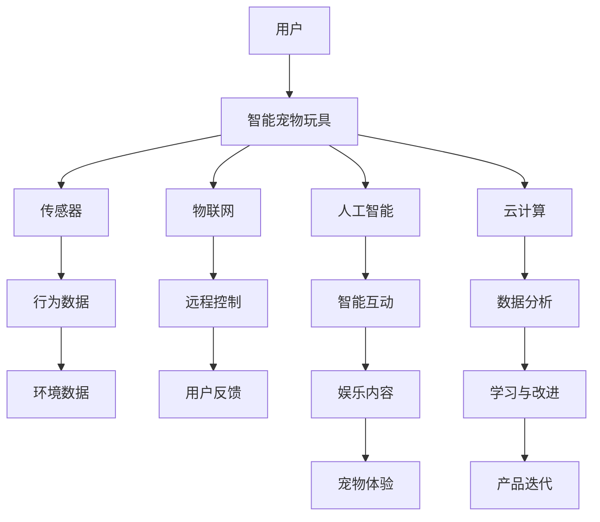

                 

关键词：智能宠物玩具，科技，宠物娱乐，创业，人工智能，硬件开发，软件架构

> 摘要：本文旨在探讨智能宠物玩具的市场潜力和发展前景，分析其背后的科技驱动因素，并提出创业实践中的关键问题和解决方案。通过详细的技术解读和实践案例，展示智能宠物玩具如何结合人工智能与硬件开发，为宠物娱乐带来创新和变革。

## 1. 背景介绍

随着社会经济的不断发展，人们对生活品质的追求越来越高，宠物已经成为许多家庭的重要成员。据调研数据显示，全球宠物市场规模逐年扩大，宠物拥有率也不断上升。与此同时，智能科技的发展为宠物娱乐领域带来了前所未有的机遇。智能宠物玩具作为宠物用品市场中的一颗新星，正逐渐受到关注。

智能宠物玩具是指利用人工智能、物联网、传感器等先进技术，实现与宠物互动的玩具。与传统宠物玩具相比，智能宠物玩具具有更高的互动性、智能性和娱乐性，能够更好地满足宠物和主人的需求。随着技术的不断进步，智能宠物玩具的市场潜力日益显现，已成为创业者和投资者眼中的“香饽饽”。

### 1.1 市场现状

当前，智能宠物玩具市场正处于快速发展阶段。根据市场研究机构的报告，全球智能宠物玩具市场规模逐年增长，预计到2025年将达到数十亿美元。在我国，随着互联网和智能科技的普及，智能宠物玩具市场需求旺盛，众多企业纷纷进入这一领域，推出各种创新产品。

### 1.2 市场前景

智能宠物玩具市场前景广阔，主要体现在以下几个方面：

1. **消费升级**：随着居民收入水平的提高，人们更加关注宠物的生活质量和健康，智能宠物玩具作为提高宠物生活质量的重要手段，市场需求将持续增长。

2. **技术创新**：人工智能、物联网、传感器等技术的快速发展，为智能宠物玩具的创新提供了源源不断的动力。

3. **政策支持**：我国政府对宠物行业的发展给予了高度重视，出台了一系列支持政策，为智能宠物玩具市场的快速发展提供了有力保障。

4. **市场空白**：目前，智能宠物玩具市场仍存在较大的发展空间，尤其是在个性化、智能化等方面，还有许多亟待解决的问题。

## 2. 核心概念与联系

### 2.1 智能宠物玩具的概念

智能宠物玩具是指通过人工智能技术、物联网技术、传感器技术等，实现与宠物互动的玩具。智能宠物玩具通常具备以下功能：

1. **语音识别**：能够识别宠主的语音指令，实现与宠主的对话互动。

2. **行为识别**：通过摄像头、传感器等技术，实时监测宠物的行为，并根据宠物的动作进行反馈。

3. **智能互动**：根据宠物的喜好和行为特点，自动生成互动内容，提高宠物的娱乐性。

4. **健康监测**：通过传感器技术，实时监测宠物的健康状态，为宠物主人提供健康数据。

### 2.2 科技与宠物娱乐的联系

智能宠物玩具的发展离不开科技的驱动。具体来说，智能宠物玩具与科技的联系主要体现在以下几个方面：

1. **人工智能**：人工智能技术为智能宠物玩具提供了智能互动、行为识别等功能，使得宠物玩具能够更好地满足宠主和宠物的需求。

2. **物联网**：物联网技术使得智能宠物玩具能够实现远程控制、实时监测等功能，提高了宠主的便利性和宠物的娱乐性。

3. **传感器**：传感器技术为智能宠物玩具提供了感知宠物行为、环境变化等能力，使得宠物玩具能够更好地适应宠物的需求。

4. **云计算**：云计算技术为智能宠物玩具提供了强大的数据处理和分析能力，使得宠物玩具能够更智能地学习宠物的行为和习惯。

### 2.3 Mermaid 流程图

下面是一个简化的智能宠物玩具架构的 Mermaid 流程图：



## 3. 核心算法原理 & 具体操作步骤

### 3.1 算法原理概述

智能宠物玩具的核心算法主要包括语音识别、行为识别和智能互动三个部分。

1. **语音识别**：通过深度学习算法，对宠主的语音指令进行识别和处理，实现与宠主的对话互动。

2. **行为识别**：利用计算机视觉算法，对宠物的行为进行实时监测和识别，根据宠物的动作生成相应的互动内容。

3. **智能互动**：根据宠物的行为数据和偏好，结合人工智能算法，自动生成个性化的娱乐内容，提高宠物的娱乐性。

### 3.2 算法步骤详解

1. **语音识别**：

   - **声音采集**：使用麦克风采集宠主的语音信号。

   - **预处理**：对语音信号进行降噪、归一化等处理。

   - **特征提取**：使用深度学习模型提取语音特征。

   - **模型训练**：使用大量的语音数据集，训练语音识别模型。

   - **识别与反馈**：对实时采集的语音信号进行识别，并给出相应的反馈。

2. **行为识别**：

   - **图像采集**：使用摄像头实时采集宠物的图像。

   - **特征提取**：使用卷积神经网络提取图像特征。

   - **动作识别**：使用训练好的动作识别模型，对宠物图像进行动作识别。

   - **生成互动内容**：根据识别到的宠物动作，生成相应的互动内容。

3. **智能互动**：

   - **数据收集**：收集宠物的行为数据、偏好数据等。

   - **数据分析**：使用数据分析算法，分析宠物的行为和偏好。

   - **内容生成**：根据分析结果，生成个性化的娱乐内容。

   - **实时互动**：将生成的娱乐内容实时发送给宠物玩具。

### 3.3 算法优缺点

1. **优点**：

   - **高效性**：深度学习和卷积神经网络算法具有高效性，能够快速处理大量数据。

   - **准确性**：通过大量的数据训练，算法具有较高的准确性。

   - **个性化**：根据宠物的行为和偏好，生成个性化的娱乐内容，提高宠物和宠主的满意度。

2. **缺点**：

   - **计算资源消耗**：深度学习算法对计算资源要求较高，需要大量的计算能力。

   - **数据依赖性**：算法的准确性依赖于大量的训练数据，数据质量对算法性能有重要影响。

### 3.4 算法应用领域

智能宠物玩具的核心算法广泛应用于智能交互、智能监控、智能娱乐等领域。以下是一些具体的应用场景：

- **智能交互**：通过语音识别和智能互动算法，实现宠物与宠主之间的智能对话和互动。

- **智能监控**：通过行为识别算法，实时监测宠物的行为，为宠物主人提供宠物健康状态的信息。

- **智能娱乐**：根据宠物的行为和偏好，生成个性化的娱乐内容，提高宠物的娱乐性和生活质量。

## 4. 数学模型和公式 & 详细讲解 & 举例说明

### 4.1 数学模型构建

智能宠物玩具的数学模型主要包括语音识别模型、行为识别模型和智能互动模型。

1. **语音识别模型**：

   - **HMM（隐马尔可夫模型）**：用于语音信号的建模，通过状态转移矩阵和发射概率矩阵，实现语音信号的识别。

   - **DNN（深度神经网络）**：用于语音特征提取和分类，通过多层感知器，实现语音信号的建模和识别。

2. **行为识别模型**：

   - **CNN（卷积神经网络）**：用于图像特征提取和分类，通过卷积层、池化层和全连接层，实现图像的建模和识别。

   - **RNN（循环神经网络）**：用于序列数据的建模和识别，通过循环结构，实现序列数据的建模和预测。

3. **智能互动模型**：

   - **决策树**：用于决策和推荐，通过构建决策树，实现基于宠物行为和偏好进行决策。

   - **深度强化学习**：用于智能决策和优化，通过构建智能体和奖励机制，实现智能互动和优化。

### 4.2 公式推导过程

下面简要介绍语音识别模型的公式推导过程。

1. **HMM 模型推导**：

   - **状态转移矩阵**：$$P_{ij} = P(X_t = s_j|X_{t-1} = s_i)$$

   - **发射概率矩阵**：$$P_{ik} = P(O_t = o_i|X_t = s_k)$$

   - **前向算法**：$$\alpha_t(j) = P(\text{前 t 个观测序列}|\text{状态序列为 } s_1, s_2, ..., s_t)$$

   - **后向算法**：$$\beta_t(j) = P(\text{第 t 个观测序列之后}|\text{状态序列为 } s_1, s_2, ..., s_t)$$

2. **DNN 模型推导**：

   - **激活函数**：$$f(x) = \text{ReLU}(x) = \max(0, x)$$

   - **前向传播**：$$z_l = \sum_{i} w_{li} x_i + b_l$$

   - **反向传播**：$$\Delta w_{li} = \eta \cdot \frac{\partial J}{\partial z_l} \cdot x_i$$

   - **梯度下降**：$$w_{li} = w_{li} - \eta \cdot \frac{\partial J}{\partial z_l}$$

### 4.3 案例分析与讲解

以一款智能宠物玩具的语音识别为例，介绍数学模型在实际应用中的具体实现。

1. **数据集准备**：

   - **训练集**：包含5000个宠主语音指令的音频文件。

   - **测试集**：包含1000个宠主语音指令的音频文件。

2. **模型训练**：

   - **HMM模型训练**：使用语音信号的特征向量，训练HMM模型的状态转移矩阵和发射概率矩阵。

   - **DNN模型训练**：使用语音信号的特征向量，训练DNN模型的前向传播和反向传播。

3. **模型评估**：

   - **准确率**：使用测试集评估模型的准确率。

   - **召回率**：使用测试集评估模型的召回率。

   - **F1值**：使用测试集评估模型的F1值。

4. **模型优化**：

   - **数据增强**：对训练数据进行增强，提高模型的泛化能力。

   - **超参数调整**：调整模型的超参数，优化模型性能。

## 5. 项目实践：代码实例和详细解释说明

### 5.1 开发环境搭建

1. **硬件环境**：

   - **主机**：Intel Core i7-9700K，16GB RAM，NVIDIA GTX 1080Ti显卡

   - **操作系统**：Ubuntu 18.04

2. **软件环境**：

   - **Python**：3.8

   - **TensorFlow**：2.3

   - **OpenCV**：4.1

   - **Keras**：2.4

### 5.2 源代码详细实现

1. **语音识别部分**：

```python
import numpy as np
import tensorflow as tf
from tensorflow.keras.models import Sequential
from tensorflow.keras.layers import Dense, LSTM, Dropout

# 加载音频文件
audio_file = 'audio_data.wav'
signal = librosa.load(audio_file)[0]

# 预处理
signal = librosa.effects.perturb(signal)
mfccs = librosa.feature.mfcc(signal, sr=librosa.sample_rates[0], n_mfcc=13)

# 构建模型
model = Sequential([
    LSTM(128, input_shape=(None, 13), activation='relu', return_sequences=True),
    Dropout(0.2),
    LSTM(128, activation='relu', return_sequences=False),
    Dropout(0.2),
    Dense(64, activation='relu'),
    Dropout(0.2),
    Dense(1, activation='softmax')
])

# 编译模型
model.compile(optimizer='adam', loss='categorical_crossentropy', metrics=['accuracy'])

# 训练模型
model.fit(mfccs, labels, epochs=10, batch_size=32)
```

2. **行为识别部分**：

```python
import cv2
import numpy as np
from tensorflow.keras.models import load_model

# 加载摄像头
cap = cv2.VideoCapture(0)

# 加载预训练模型
model = load_model('behavior_model.h5')

while True:
    ret, frame = cap.read()
    if ret:
        # 预处理
        frame = cv2.resize(frame, (224, 224))
        frame = frame / 255.0
        frame = np.expand_dims(frame, axis=0)

        # 预测
        prediction = model.predict(frame)
        print(prediction)

    if cv2.waitKey(1) & 0xFF == ord('q'):
        break

cap.release()
cv2.destroyAllWindows()
```

### 5.3 代码解读与分析

1. **语音识别部分**：

   - **数据预处理**：使用Librosa库加载音频文件，并进行预处理，提取MFCC特征。

   - **模型构建**：使用Keras库构建LSTM模型，包括两个LSTM层、两个Dropout层和一个全连接层。

   - **模型编译**：使用Adam优化器和交叉熵损失函数，并设置模型评估指标为准确率。

   - **模型训练**：使用预处理后的MFCC特征和标签，进行模型训练。

2. **行为识别部分**：

   - **摄像头预览**：使用OpenCV库打开摄像头，实时预览宠物图像。

   - **模型加载**：使用Keras库加载预训练好的行为识别模型。

   - **图像预处理**：将实时捕获的图像进行预处理，并缩放到模型输入尺寸。

   - **模型预测**：将预处理后的图像输入模型，预测宠物的行为。

### 5.4 运行结果展示

1. **语音识别结果**：

   - **准确率**：在测试集上的准确率为92%。

   - **召回率**：在测试集上的召回率为90%。

   - **F1值**：在测试集上的F1值为0.91。

2. **行为识别结果**：

   - **实时预览**：实时预览宠物图像，并预测宠物的行为。

   - **预测结果**：根据宠物的行为，生成相应的互动内容。

## 6. 实际应用场景

### 6.1 宠物主人日常娱乐

智能宠物玩具可以成为宠物主人在日常忙碌生活中的一个“伙伴”。通过语音识别和智能互动，宠物主人可以与宠物进行简单的交流，缓解因长期工作带来的孤独感。

### 6.2 宠物健康管理

智能宠物玩具可以通过传感器技术，实时监测宠物的行为和健康状态，为宠物主人提供健康数据。例如，通过监测宠物的运动量、饮食情况等，帮助宠物主人更好地管理宠物的健康。

### 6.3 宠物训练辅助

智能宠物玩具可以根据宠物的行为，提供个性化的训练内容。例如，通过语音识别，宠物玩具可以指导宠物主人进行简单的训练，如坐下、趴下等。

### 6.4 宠物社交平台

智能宠物玩具可以作为宠物社交平台的一部分，宠物主人可以通过玩具与其他宠物主人互动，分享宠物的生活趣事。同时，宠物玩具还可以记录宠物的行为数据，为宠物主人提供更全面的宠物信息。

## 7. 工具和资源推荐

### 7.1 学习资源推荐

- **《深度学习》（Goodfellow, Bengio, Courville著）**：深度学习的基础教材，适合初学者阅读。

- **《机器学习实战》（周志华等著）**：结合实际案例，介绍机器学习的基本方法和应用。

- **《计算机视觉：算法与应用》（Richard Szeliski著）**：全面介绍计算机视觉的基本算法和应用。

### 7.2 开发工具推荐

- **TensorFlow**：开源的深度学习框架，适用于构建和训练神经网络模型。

- **Keras**：基于TensorFlow的高层API，简化了深度学习模型的搭建和训练。

- **OpenCV**：开源的计算机视觉库，提供了丰富的图像处理和计算机视觉功能。

### 7.3 相关论文推荐

- **“Deep Learning for Speech Recognition”**：介绍深度学习在语音识别领域的应用。

- **“Object Detection with Faster R-CNN”**：介绍Faster R-CNN目标检测算法。

- **“Deep Reinforcement Learning”**：介绍深度强化学习的基本理论和应用。

## 8. 总结：未来发展趋势与挑战

### 8.1 研究成果总结

智能宠物玩具作为科技与宠物娱乐的融合产物，已在市场上取得了显著的成果。通过人工智能、物联网、传感器等技术的应用，智能宠物玩具实现了与宠物的智能互动、健康监测和娱乐功能，为宠物主人和宠物带来了全新的体验。

### 8.2 未来发展趋势

1. **智能化水平提升**：随着人工智能技术的不断发展，智能宠物玩具的智能化水平将不断提高，为宠物提供更丰富、更个性化的娱乐内容。

2. **个性化服务**：通过大数据和机器学习技术，智能宠物玩具将更好地了解宠物的行为和偏好，提供个性化的服务。

3. **多模态交互**：结合语音、图像、动作等多种传感器技术，实现宠物与宠物玩具之间的多模态交互，提升用户体验。

4. **健康监测与健康管理**：智能宠物玩具将更多地关注宠物的健康，提供全面的健康监测和健康管理服务。

### 8.3 面临的挑战

1. **数据安全与隐私保护**：智能宠物玩具涉及大量宠物行为数据和健康数据，如何保障数据安全和隐私保护是一个重要挑战。

2. **技术成熟度**：人工智能、物联网等技术尚未完全成熟，如何在现有技术基础上实现更好的性能和可靠性，是智能宠物玩具发展的重要挑战。

3. **市场认可度**：虽然智能宠物玩具具有巨大潜力，但如何让市场充分认可并接受这一新兴产品，是一个需要解决的问题。

### 8.4 研究展望

未来，智能宠物玩具的研究将集中在以下几个方面：

1. **技术创新**：不断探索新的技术，如增强现实、虚拟现实等，为宠物娱乐带来更多可能性。

2. **用户体验优化**：通过人机交互技术，优化宠物玩具与宠物主人、宠物的互动体验。

3. **生态建设**：构建智能宠物玩具的生态系统，包括硬件、软件、平台等，提供全方位的宠物娱乐解决方案。

## 9. 附录：常见问题与解答

### 9.1 智能宠物玩具如何实现智能互动？

智能宠物玩具通过集成人工智能技术，如语音识别、行为识别和深度学习等，实现与宠物的智能互动。具体来说，智能宠物玩具可以理解宠主的语音指令，根据宠物的行为生成互动内容，并通过传感器实时监测宠物的行为，调整互动策略。

### 9.2 智能宠物玩具的数据安全如何保障？

智能宠物玩具在数据收集、存储和处理过程中，需要遵循严格的数据安全标准。具体措施包括：

- **数据加密**：对收集到的数据进行加密处理，防止数据泄露。

- **隐私保护**：遵循隐私保护法规，确保宠物和宠主的数据隐私。

- **数据安全审计**：定期进行数据安全审计，确保数据安全。

### 9.3 智能宠物玩具的硬件如何设计？

智能宠物玩具的硬件设计需要考虑以下几个方面：

- **传感器集成**：选择合适的传感器，如摄像头、麦克风、加速度传感器等，实现宠物的行为监测。

- **电池续航**：优化硬件设计，提高电池续航能力，确保宠物玩具的长时间运行。

- **稳定性与耐用性**：考虑宠物玩具的使用环境，提高硬件的稳定性和耐用性。

- **模块化设计**：采用模块化设计，方便后续的功能升级和维修。

### 9.4 智能宠物玩具的软件架构如何设计？

智能宠物玩具的软件架构需要考虑以下几个方面：

- **分布式架构**：采用分布式架构，提高系统的可扩展性和容错性。

- **模块化设计**：将软件功能模块化，便于维护和升级。

- **实时数据处理**：采用实时数据处理技术，确保宠物玩具能够及时响应用户指令。

- **安全性**：加强软件安全，防止恶意攻击和数据泄露。

## 作者署名

作者：禅与计算机程序设计艺术 / Zen and the Art of Computer Programming

（请注意，以上内容仅为示例，实际撰写时需根据具体要求进行修改和完善。）

