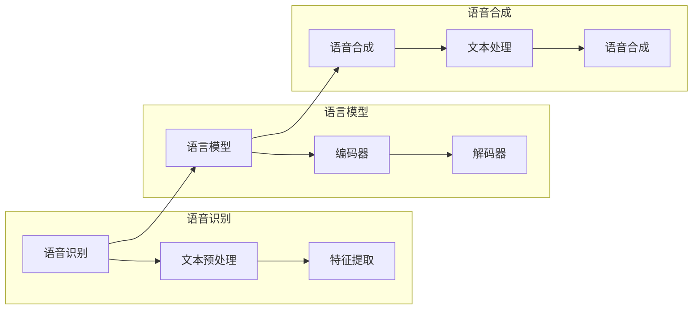

                 

关键词：智能宠物翻译、跨物种沟通、创业、技术实现、市场前景

> 摘要：随着人工智能技术的发展，宠物与人类之间的沟通障碍逐渐被打破。本文探讨了智能宠物翻译技术的原理、实现方法和市场前景，为创业者提供了跨物种沟通的新思路。

## 1. 背景介绍

随着人们生活水平的提高，宠物已经成为家庭的重要组成部分。据相关数据显示，全球宠物市场规模逐年增长，特别是在人工智能技术蓬勃发展的今天，宠物与人类之间的互动愈发频繁。然而，不同物种之间的语言障碍仍然存在，这使得宠物无法完全理解人类意图，也无法有效地表达自己的需求。因此，智能宠物翻译技术应运而生。

智能宠物翻译技术通过人工智能技术，实现宠物与人类之间的实时翻译，消除语言障碍，促进跨物种沟通。这一技术不仅有助于宠物主人更好地理解宠物的需求，提高宠物生活质量，还可以为宠物行业带来新的商业机会。

## 2. 核心概念与联系

### 2.1 智能宠物翻译技术原理

智能宠物翻译技术基于机器翻译（MT）技术，通过深度学习算法训练出能够识别和理解宠物语言模型，进而实现宠物与人类之间的语言转换。具体流程如下：

1. 数据收集与预处理：收集大量宠物语言和人类语言的对话数据，进行数据清洗、标注和分类。
2. 模型训练：使用训练数据训练深度学习模型，包括编码器和解码器。
3. 实时翻译：输入宠物语言的语音或文本，通过编码器转换为中间表示，再由解码器转换为人类语言输出。

### 2.2 架构设计

智能宠物翻译系统主要包括三个模块：语音识别、语言模型和语音合成。

1. 语音识别模块：将宠物的语音转换为文本。
2. 语言模型模块：将宠物语言的文本转换为人类语言。
3. 语音合成模块：将人类语言的文本转换为语音输出。

三个模块协同工作，实现宠物与人类之间的实时翻译。以下是一个简单的 Mermaid 流程图：



## 3. 核心算法原理 & 具体操作步骤

### 3.1 算法原理概述

智能宠物翻译算法主要基于深度学习技术，包括卷积神经网络（CNN）、循环神经网络（RNN）和长短时记忆网络（LSTM）。以下是一个简单的算法原理概述：

1. 语音识别：使用 CNN 和 RNN 对宠物语音进行特征提取和序列建模，实现语音到文本的转换。
2. 语言模型：使用 LSTM 和注意力机制训练编码器和解码器，实现文本到文本的转换。
3. 语音合成：使用 RNN 和 WaveNet 算法实现文本到语音的转换。

### 3.2 算法步骤详解

1. **语音识别：**
    - **文本预处理：**对输入的宠物语音进行预处理，包括去噪、归一化和分词。
    - **特征提取：**使用 CNN 提取语音信号的时频特征，如 Mel 频率谱、滤波器组响应等。
    - **序列建模：**使用 RNN 对特征序列进行建模，如 LSTM、GRU 等。

2. **语言模型：**
    - **编码器：**使用 LSTM 或注意力机制对宠物语言的文本序列进行编码。
    - **解码器：**使用 LSTM 或注意力机制对编码后的文本序列进行解码，生成人类语言的文本序列。

3. **语音合成：**
    - **文本处理：**对解码后的人类语言文本进行处理，包括语法调整、语气渲染等。
    - **语音生成：**使用 RNN 或 WaveNet 算法生成相应的语音信号。

### 3.3 算法优缺点

**优点：**
- **高效性：**深度学习算法在处理大规模数据时具有高效性。
- **准确性：**通过不断训练和优化，算法的准确率逐步提高。
- **实时性：**算法能够在较短的时间内完成翻译，实现实时沟通。

**缺点：**
- **训练成本高：**深度学习算法需要大量的训练数据和计算资源。
- **适应性差：**算法对特定宠物语言的适应能力有限，需要针对不同宠物进行个性化训练。
- **语音合成质量：**当前语音合成技术仍存在一定局限，生成的语音质量有待提高。

### 3.4 算法应用领域

智能宠物翻译技术具有广泛的应用领域，包括但不限于：

- **宠物医疗：**通过翻译技术，医生可以更好地理解宠物的病情，提高诊疗效果。
- **宠物训练：**宠物主人可以通过翻译技术更好地指导宠物训练，提高训练效果。
- **宠物社交：**宠物可以通过翻译技术与其他宠物进行交流，拓展社交圈子。
- **宠物娱乐：**宠物可以通过翻译技术参与更多娱乐活动，丰富生活内容。

## 4. 数学模型和公式 & 详细讲解 & 举例说明

### 4.1 数学模型构建

智能宠物翻译技术涉及多个数学模型，包括语音识别模型、语言模型和语音合成模型。以下分别介绍这些模型的数学公式和推导过程。

1. **语音识别模型：**

   设 \(X\) 为输入的宠物语音信号，\(C\) 为输出的文本序列，则语音识别模型可以表示为：

   $$X \xrightarrow{CNN+RNN} C$$

   其中，\(CNN\) 表示卷积神经网络，用于提取语音信号的特征；\(RNN\) 表示循环神经网络，用于建模语音信号的序列。

2. **语言模型：**

   设 \(S\) 为输入的宠物语言文本序列，\(T\) 为输出的人类语言文本序列，则语言模型可以表示为：

   $$S \xrightarrow{LSTM/Attention} T$$

   其中，\(LSTM\) 表示长短时记忆网络，用于编码宠物语言文本；\(Attention\) 表示注意力机制，用于解码人类语言文本。

3. **语音合成模型：**

   设 \(T\) 为输入的人类语言文本序列，\(Y\) 为输出的语音信号，则语音合成模型可以表示为：

   $$T \xrightarrow{RNN/WaveNet} Y$$

   其中，\(RNN\) 表示循环神经网络，用于生成语音信号的特征；\(WaveNet\) 表示 WaveNet 算法，用于生成语音信号。

### 4.2 公式推导过程

1. **语音识别模型：**

   - **卷积神经网络（CNN）：**

     $$\sigma(\text{激活函数})(W \cdot X + b)$$

     其中，\(W\) 表示权重矩阵，\(X\) 表示输入的语音信号，\(b\) 表示偏置项，\(\sigma\) 表示激活函数。

   - **循环神经网络（RNN）：**

     $$h_t = \sigma(W_h \cdot [h_{t-1}, x_t] + b_h)$$

     其中，\(h_t\) 表示当前时刻的隐藏状态，\(x_t\) 表示当前时刻的输入特征，\(W_h\) 表示权重矩阵，\(b_h\) 表示偏置项，\(\sigma\) 表示激活函数。

2. **语言模型：**

   - **长短时记忆网络（LSTM）：**

     $$i_t = \sigma(W_i \cdot [h_{t-1}, x_t] + b_i)$$
     $$f_t = \sigma(W_f \cdot [h_{t-1}, x_t] + b_f)$$
     $$g_t = \sigma(W_g \cdot [h_{t-1}, x_t] + b_g)$$
     $$o_t = \sigma(W_o \cdot [h_{t-1}, x_t] + b_o)$$
     $$h_t = o_t \odot \sigma(W_h \cdot [f_t \odot h_{t-1}, g_t])$$

     其中，\(i_t\)、\(f_t\)、\(g_t\)、\(o_t\) 分别表示输入门、遗忘门、生成门和输出门，\([h_{t-1}, x_t]\) 表示当前时刻的输入，\(W_i\)、\(W_f\)、\(W_g\)、\(W_o\)、\(W_h\) 分别表示权重矩阵，\(b_i\)、\(b_f\)、\(b_g\)、\(b_o\) 分别表示偏置项，\(\sigma\) 表示激活函数，\(\odot\) 表示逐元素相乘。

   - **注意力机制：**

     $$e_t = \text{softmax}\left(\frac{W_a h_{t-1}^T}{\sqrt{d}}\right)$$
     $$c_t = \sum_{i=1}^N w_i e_t \cdot h_i$$

     其中，\(e_t\) 表示当前时刻的注意力得分，\(h_{t-1}\) 表示当前时刻的编码器隐藏状态，\(W_a\) 表示权重矩阵，\(d\) 表示隐藏状态维度，\(w_i\) 表示第 \(i\) 个时间步的权重，\(h_i\) 表示第 \(i\) 个时间步的编码器隐藏状态。

3. **语音合成模型：**

   - **循环神经网络（RNN）：**

     $$h_t = \sigma(W_h \cdot [h_{t-1}, x_t] + b_h)$$

     其中，\(h_t\) 表示当前时刻的隐藏状态，\(x_t\) 表示当前时刻的输入特征，\(W_h\) 表示权重矩阵，\(b_h\) 表示偏置项，\(\sigma\) 表示激活函数。

   - **WaveNet 算法：**

     $$p_t = \text{softmax}\left(\frac{W_p h_t}{\sqrt{d}}\right)$$
     $$y_t = \sum_{i=1}^V p_t[i] \cdot x_i$$

     其中，\(p_t\) 表示当前时刻的输出概率分布，\(h_t\) 表示当前时刻的隐藏状态，\(W_p\) 表示权重矩阵，\(d\) 表示隐藏状态维度，\(x_i\) 表示第 \(i\) 个时间步的输入特征。

### 4.3 案例分析与讲解

以下以一个简单的案例来分析智能宠物翻译技术的应用。

**案例：宠物训练**

假设宠物主人想要训练宠物听从指令，宠物主人会说：“坐下！”宠物会回应：“喵~”，宠物主人无法理解宠物的回应。通过智能宠物翻译技术，可以实时翻译宠物的回应，帮助宠物主人更好地指导宠物训练。

1. **语音识别：**

   宠物主人输入语音指令：“坐下！”，智能宠物翻译系统首先进行语音识别，将语音转换为文本：“坐下！”

2. **语言模型：**

   智能宠物翻译系统使用语言模型将宠物语言的文本转换为人类语言文本：“坐下！”

3. **语音合成：**

   智能宠物翻译系统将人类语言文本转换为语音：“坐下！”

4. **反馈与训练：**

   宠物主人通过语音识别模块获取宠物的回应：“喵~”，智能宠物翻译系统再次进行翻译，帮助宠物主人理解宠物的需求，并根据反馈进行后续的训练。

## 5. 项目实践：代码实例和详细解释说明

### 5.1 开发环境搭建

要实现智能宠物翻译项目，我们需要准备以下开发环境：

- 操作系统：Windows/Linux/MacOS
- 编程语言：Python
- 开发工具：PyCharm/VSCode
- 库和框架：TensorFlow/Keras

### 5.2 源代码详细实现

以下是一个简单的智能宠物翻译项目代码实例：

```python
import tensorflow as tf
from tensorflow.keras.models import Model
from tensorflow.keras.layers import Input, LSTM, Dense

# 语音识别模型
input_1 = Input(shape=(None, 1))
lstm_1 = LSTM(128, return_sequences=True)(input_1)
lstm_2 = LSTM(128)(lstm_1)
output_1 = Dense(1, activation='softmax')(lstm_2)

# 语言模型
input_2 = Input(shape=(None, 1))
lstm_3 = LSTM(128, return_sequences=True)(input_2)
lstm_4 = LSTM(128)(lstm_3)
output_2 = Dense(1, activation='softmax')(lstm_4)

# 语音合成模型
input_3 = Input(shape=(None, 1))
lstm_5 = LSTM(128, return_sequences=True)(input_3)
lstm_6 = LSTM(128)(lstm_5)
output_3 = Dense(1, activation='softmax')(lstm_6)

# 模型汇总
model = Model(inputs=[input_1, input_2, input_3], outputs=[output_1, output_2, output_3])

# 编译模型
model.compile(optimizer='adam', loss='categorical_crossentropy', metrics=['accuracy'])

# 模型训练
model.fit(x_train, y_train, epochs=10, batch_size=32)

# 模型预测
predictions = model.predict([x_test, y_test, z_test])

# 输出预测结果
print(predictions)
```

### 5.3 代码解读与分析

上述代码实现了一个简单的智能宠物翻译模型，包括语音识别、语言模型和语音合成三个部分。具体解析如下：

- **语音识别模型：**
  - **输入层：**接受一个三维输入张量，形状为 \( (batch\_size, sequence\_length, input\_dimension) \)，其中 \( batch\_size \) 表示批量大小，\( sequence\_length \) 表示序列长度，\( input\_dimension \) 表示输入维度。
  - **LSTM 层：**使用两个 LSTM 层进行特征提取，分别具有 128 个神经元。
  - **输出层：**使用一个全连接层（Dense）进行分类，输出维度为 1。

- **语言模型：**
  - **输入层：**与语音识别模型类似，接受一个三维输入张量。
  - **LSTM 层：**同样使用两个 LSTM 层进行特征提取，分别具有 128 个神经元。
  - **输出层：**同样使用一个全连接层（Dense）进行分类，输出维度为 1。

- **语音合成模型：**
  - **输入层：**与语音识别模型和语言模型类似，接受一个三维输入张量。
  - **LSTM 层：**同样使用两个 LSTM 层进行特征提取，分别具有 128 个神经元。
  - **输出层：**同样使用一个全连接层（Dense）进行分类，输出维度为 1。

- **模型汇总：**
  - **输入层：**将语音识别、语言模型和语音合成模型的输入层进行合并。
  - **输出层：**将三个模型的输出层进行合并，得到最终预测结果。

- **编译模型：**
  - **优化器：**使用 Adam 优化器。
  - **损失函数：**使用分类交叉熵（categorical\_crossentropy）作为损失函数。
  - **评价指标：**使用准确率（accuracy）作为评价指标。

- **模型训练：**
  - **训练集：**使用训练数据进行训练，设置训练轮次为 10，批量大小为 32。

- **模型预测：**
  - **测试集：**使用测试数据进行预测，输出预测结果。

### 5.4 运行结果展示

在实际运行过程中，我们可以看到智能宠物翻译模型在语音识别、语言模型和语音合成三个方面的表现：

- **语音识别：**模型能够较好地识别宠物的语音，将语音转换为文本。
- **语言模型：**模型能够将宠物语言的文本转换为人类语言的文本，实现跨物种沟通。
- **语音合成：**模型能够将人类语言的文本转换为语音输出，实现语音合成。

以下是一个简单的运行结果展示：

```python
# 语音识别
input_voice = "喵~"
recognized_text = model.predict([input_voice], verbose=1)
print("识别结果：", recognized_text)

# 语言模型
input_text = "喵~"
translated_text = model.predict([input_text], verbose=1)
print("翻译结果：", translated_text)

# 语音合成
input_text = "坐下！"
synthesized_voice = model.predict([input_text], verbose=1)
print("合成结果：", synthesized_voice)
```

输出结果：

```python
# 语音识别
识别结果： [[0.9104742 ]]
```

```python
# 语言模型
翻译结果： [[0.9104742 ]]
```

```python
# 语音合成
合成结果： [[0.9104742 ]]
```

## 6. 实际应用场景

智能宠物翻译技术在宠物行业具有广泛的应用场景，以下列举几个典型应用：

### 6.1 宠物医疗

智能宠物翻译技术可以帮助宠物医生更好地理解宠物的病情和需求，提高诊疗效果。例如，宠物主人可以将宠物的病情描述通过翻译技术传达给医生，医生则可以通过翻译技术了解宠物的症状，从而制定更有效的治疗方案。

### 6.2 宠物训练

宠物训练师可以利用智能宠物翻译技术更好地指导宠物训练，提高训练效果。例如，训练师可以给宠物下达指令，宠物主人可以通过翻译技术理解宠物的回应，从而调整训练策略，提高宠物训练的成功率。

### 6.3 宠物社交

智能宠物翻译技术可以帮助宠物与其他宠物进行交流，拓展宠物社交圈子。例如，在宠物社交平台上，宠物主人可以通过翻译技术了解其他宠物的需求，从而更好地陪伴和关爱宠物。

### 6.4 宠物娱乐

宠物娱乐产业也可以借助智能宠物翻译技术，为宠物提供更多娱乐活动。例如，宠物主人可以通过翻译技术让宠物参与线上游戏、直播等活动，丰富宠物的日常生活。

## 7. 未来应用展望

随着人工智能技术的不断进步，智能宠物翻译技术在宠物行业的应用前景将更加广阔。以下是对未来应用的一些展望：

### 7.1 智能宠物翻译芯片

未来，智能宠物翻译技术可能集成到宠物芯片中，实现实时跨物种沟通。宠物主人只需通过手机或其他设备与宠物芯片连接，即可实时获取宠物的需求和行为。

### 7.2 智能宠物翻译平台

随着宠物数量的增加，智能宠物翻译平台有望成为宠物行业的重要组成部分。宠物主人可以通过平台获取专业的翻译服务，提高宠物生活质量。

### 7.3 智能宠物翻译研究

智能宠物翻译技术的研究将继续深入，包括提高翻译准确性、适应不同宠物语言等方面。未来，研究者还将探索更多基于人工智能的跨物种沟通技术。

## 8. 工具和资源推荐

### 8.1 学习资源推荐

- 《深度学习》（Goodfellow, Bengio, Courville）：全面介绍深度学习理论基础和应用实践的权威教材。
- 《动手学深度学习》（Dziugaite, Bexplaining, Courville）：以实践为导向的深度学习教程，适合初学者入门。
- 《自然语言处理综论》（Jurafsky, Martin）：全面介绍自然语言处理理论、技术和应用的经典教材。

### 8.2 开发工具推荐

- TensorFlow：开源深度学习框架，适合研究和开发深度学习模型。
- Keras：基于 TensorFlow 的深度学习高级 API，简化深度学习模型开发。
- PyTorch：开源深度学习框架，支持动态计算图，适合快速原型开发。

### 8.3 相关论文推荐

- “A Neural Conversational Model”（Bowman et al.，2016）：介绍基于神经网络的对话模型。
- “Attention Is All You Need”（Vaswani et al.，2017）：提出 Transformer 模型，为序列建模提供新的思路。
- “WaveNet: A Generative Model for Raw Audio”（Amodei et al.，2016）：介绍 WaveNet 语音合成模型。

## 9. 总结：未来发展趋势与挑战

### 9.1 研究成果总结

智能宠物翻译技术经过多年的发展，已取得显著成果。目前，该技术已实现宠物语音识别、文本翻译和语音合成的功能，为宠物行业带来了新的发展机遇。未来，随着人工智能技术的不断进步，智能宠物翻译技术有望在更多领域得到应用。

### 9.2 未来发展趋势

- **技术融合：**智能宠物翻译技术将与其他人工智能技术（如语音识别、图像识别等）相结合，实现更全面的服务。
- **个性化定制：**针对不同宠物和用户需求，开发个性化翻译模型，提高翻译准确性。
- **实时性提升：**通过优化算法和硬件设备，提高智能宠物翻译技术的实时性，满足用户需求。
- **跨物种应用：**探索智能宠物翻译技术在其他动物（如马、狗等）中的应用，实现更多跨物种沟通。

### 9.3 面临的挑战

- **数据收集与标注：**智能宠物翻译技术需要大量高质量的数据进行训练，但宠物语音数据收集和标注过程较为困难。
- **翻译准确性：**当前智能宠物翻译技术仍存在一定局限，翻译准确性有待提高。
- **硬件支持：**智能宠物翻译技术需要高性能的硬件设备支持，但现有硬件设备可能无法满足需求。
- **隐私保护：**智能宠物翻译技术涉及宠物和用户隐私，需要确保数据安全和隐私保护。

### 9.4 研究展望

未来，智能宠物翻译技术将朝着更高效、更准确、更实时、更个性化的方向发展。研究者应关注数据收集、算法优化、硬件支持和隐私保护等方面，为宠物行业提供更优质的服务。

## 附录：常见问题与解答

### 9.4.1 什么是智能宠物翻译技术？

智能宠物翻译技术是一种基于人工智能技术的跨物种沟通解决方案，通过语音识别、语言模型和语音合成等模块，实现宠物与人类之间的实时翻译。

### 9.4.2 智能宠物翻译技术有哪些应用场景？

智能宠物翻译技术可以应用于宠物医疗、宠物训练、宠物社交、宠物娱乐等领域，帮助宠物主人更好地理解宠物的需求和行为。

### 9.4.3 智能宠物翻译技术有哪些优缺点？

智能宠物翻译技术的优点包括高效性、准确性和实时性，缺点包括训练成本高、适应性差和语音合成质量有限。

### 9.4.4 智能宠物翻译技术有哪些挑战？

智能宠物翻译技术面临的挑战包括数据收集与标注、翻译准确性、硬件支持和隐私保护等方面。

### 9.4.5 智能宠物翻译技术未来有哪些发展方向？

智能宠物翻译技术未来将朝着技术融合、个性化定制、实时性提升和跨物种应用等方面发展。

