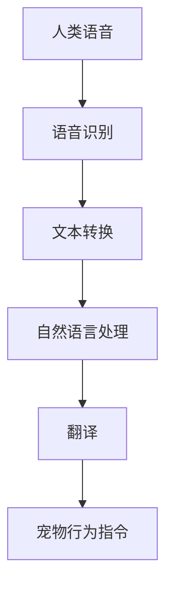

                 

关键词：智能宠物翻译，跨物种沟通，人工智能，机器学习，创业，宠物行业，语音识别，自然语言处理

> 摘要：本文探讨了智能宠物翻译技术的创新与应用，以及如何在宠物行业中利用人工智能技术实现人宠沟通的桥梁。文章首先介绍了智能宠物翻译的背景和发展，接着深入分析了其核心算法原理、数学模型以及项目实践，最后展望了智能宠物翻译技术的未来发展趋势与挑战。

## 1. 背景介绍

随着人工智能技术的不断进步，机器学习、自然语言处理、语音识别等技术得到了广泛应用。在宠物行业，这些技术的结合为宠物主人与宠物之间的沟通提供了新的可能性。据市场调研数据显示，全球宠物市场规模逐年扩大，尤其是在发达国家和地区，人们对宠物的关注度不断提升，宠物作为家庭成员的地位日益显著。然而，宠物与人类在语言交流上存在天然的障碍，这成为了宠物主人与宠物之间沟通的一大难题。

智能宠物翻译技术的出现，为解决这个问题提供了新的思路。通过人工智能技术，智能宠物翻译系统能够将人类的语言转换为宠物能够理解的指令，同时也能将宠物的行为转换为人类能够理解的语言，从而实现人宠之间的有效沟通。这种技术的出现，不仅提高了宠物主人的生活质量，也为宠物行业带来了新的商业模式。

## 2. 核心概念与联系

### 2.1 智能宠物翻译系统架构

智能宠物翻译系统主要由语音识别模块、自然语言处理模块和翻译模块组成。以下是一个简化的Mermaid流程图，展示了智能宠物翻译系统的工作流程：



### 2.2 语音识别模块

语音识别模块是智能宠物翻译系统的第一步，它将人类的语音转换为文本。在这一过程中，常用的算法包括深度神经网络（DNN）、卷积神经网络（CNN）和循环神经网络（RNN）等。这些算法通过大量的语音数据训练，能够准确地将语音转换为对应的文本。

### 2.3 自然语言处理模块

自然语言处理模块负责处理转换后的文本，将其转换为宠物能够理解的语言。这一过程涉及到词义消歧、句法分析、语义角色标注等任务。通过这些处理，系统能够理解人类指令的含义，并将其转换为适合宠物的指令。

### 2.4 翻译模块

翻译模块是智能宠物翻译系统的核心，它将自然语言处理模块输出的文本翻译成宠物能够理解的指令。这一过程通常涉及到机器翻译技术，常用的算法包括基于统计的机器翻译（SMT）和基于神经网络的机器翻译（NMT）。这些算法通过大量的宠物行为数据和人类指令数据训练，能够将人类指令准确翻译成宠物指令。

## 3. 核心算法原理 & 具体操作步骤

### 3.1 算法原理概述

智能宠物翻译系统的核心算法包括语音识别、自然语言处理和机器翻译。这些算法通过大量的数据训练，能够实现高精度的语音识别、文本理解和翻译。

### 3.2 算法步骤详解

1. **语音识别**：通过深度神经网络或卷积神经网络对语音信号进行处理，提取语音特征，然后使用动态时间规整（DTW）算法或隐马尔可夫模型（HMM）进行语音识别。

2. **文本转换**：将语音识别得到的文本转换为标准文本，以便进行后续的自然语言处理。

3. **自然语言处理**：对文本进行词义消歧、句法分析、语义角色标注等处理，以理解文本的语义。

4. **机器翻译**：将自然语言处理得到的文本翻译成宠物指令。这一过程通常采用基于神经网络的机器翻译算法，如序列到序列（Seq2Seq）模型。

### 3.3 算法优缺点

- **优点**：
  - 高度的自动化：通过算法实现人宠之间的无缝沟通，无需人工干预。
  - 灵活性：可以针对不同宠物和宠物主人的需求进行个性化调整。

- **缺点**：
  - 训练数据需求大：需要大量的语音数据、文本数据和宠物行为数据。
  - 需要持续优化：随着宠物行业的发展，算法需要不断更新和优化，以适应新的需求。

### 3.4 算法应用领域

智能宠物翻译技术可以广泛应用于宠物训练、宠物医疗、宠物养护等多个领域。例如，宠物训练师可以通过智能宠物翻译系统向宠物传达复杂的训练指令，宠物医生可以通过系统与宠物进行沟通，以便更好地进行诊断和治疗。

## 4. 数学模型和公式 & 详细讲解 & 举例说明

### 4.1 数学模型构建

智能宠物翻译系统中的数学模型主要包括语音识别模型、自然语言处理模型和机器翻译模型。以下是一个简化的数学模型构建过程：

- **语音识别模型**：假设我们有语音信号 $x(t)$ 和对应的文本标签 $y$，我们可以构建一个基于深度神经网络的语音识别模型，其目标是最小化预测文本标签与真实文本标签之间的误差。

  $$\min_{\theta} \sum_{i=1}^{N} L(y_i, \hat{y}_i)$$

  其中，$L(\cdot, \cdot)$ 是损失函数，$\hat{y}_i$ 是模型对语音信号 $x_i$ 的预测。

- **自然语言处理模型**：假设我们有文本序列 $x = (x_1, x_2, ..., x_T)$ 和对应的语义表示 $y = (y_1, y_2, ..., y_T)$，我们可以构建一个基于循环神经网络的自然语言处理模型，其目标是最小化预测语义表示与真实语义表示之间的误差。

  $$\min_{\theta} \sum_{i=1}^{T} L(y_i, \hat{y}_i)$$

  其中，$L(\cdot, \cdot)$ 是损失函数，$\hat{y}_i$ 是模型对文本序列 $x$ 的预测。

- **机器翻译模型**：假设我们有源语言文本序列 $x = (x_1, x_2, ..., x_T)$ 和目标语言文本序列 $y = (y_1, y_2, ..., y_T)$，我们可以构建一个基于序列到序列（Seq2Seq）的机器翻译模型，其目标是最小化预测目标语言文本序列与真实目标语言文本序列之间的误差。

  $$\min_{\theta} \sum_{i=1}^{T} L(y_i, \hat{y}_i)$$

  其中，$L(\cdot, \cdot)$ 是损失函数，$\hat{y}_i$ 是模型对源语言文本序列 $x$ 的预测。

### 4.2 公式推导过程

- **语音识别模型**：我们可以使用反向传播算法来最小化损失函数。具体步骤如下：

  1. 前向传播：计算预测文本标签 $\hat{y}$。
  2. 计算损失函数 $L(\cdot, \cdot)$ 的梯度。
  3. 反向传播：更新模型参数 $\theta$。

- **自然语言处理模型**：我们也可以使用反向传播算法来最小化损失函数。具体步骤如下：

  1. 前向传播：计算预测语义表示 $\hat{y}$。
  2. 计算损失函数 $L(\cdot, \cdot)$ 的梯度。
  3. 反向传播：更新模型参数 $\theta$。

- **机器翻译模型**：同样，我们可以使用反向传播算法来最小化损失函数。具体步骤如下：

  1. 前向传播：计算预测目标语言文本序列 $\hat{y}$。
  2. 计算损失函数 $L(\cdot, \cdot)$ 的梯度。
  3. 反向传播：更新模型参数 $\theta$。

### 4.3 案例分析与讲解

假设我们有一个简单的语音识别任务，语音信号 $x(t)$ 是一个长度为10的向量，文本标签 $y$ 是一个长度为5的向量。我们可以使用深度神经网络来构建语音识别模型。

1. **模型构建**：

   $$f(x; \theta) = \text{softmax}(\theta^T x)$$

   其中，$\theta$ 是模型参数，$x$ 是输入语音信号，$f(x; \theta)$ 是模型对文本标签的预测。

2. **损失函数**：

   $$L(y, \hat{y}) = -\sum_{i=1}^{5} y_i \log(\hat{y}_i)$$

   其中，$y$ 是真实文本标签，$\hat{y}$ 是模型预测的文本标签。

3. **梯度计算**：

   $$\frac{\partial L}{\partial \theta} = -\frac{1}{\hat{y}} (y - \hat{y}) x$$

4. **模型更新**：

   $$\theta = \theta - \alpha \frac{\partial L}{\partial \theta}$$

   其中，$\alpha$ 是学习率。

通过以上步骤，我们可以使用反向传播算法训练语音识别模型，实现对语音信号的识别。

## 5. 项目实践：代码实例和详细解释说明

### 5.1 开发环境搭建

在本文的项目实践中，我们将使用Python作为主要编程语言，结合TensorFlow和Keras等深度学习框架进行开发。以下是开发环境的搭建步骤：

1. 安装Python 3.8及以上版本。
2. 安装TensorFlow 2.6及以上版本。
3. 安装Keras 2.6及以上版本。
4. 安装必要的数据处理库，如NumPy、Pandas等。

### 5.2 源代码详细实现

以下是智能宠物翻译系统的核心代码实现：

```python
import tensorflow as tf
from tensorflow.keras.models import Sequential
from tensorflow.keras.layers import LSTM, Dense, Embedding
from tensorflow.keras.preprocessing.sequence import pad_sequences

# 数据预处理
def preprocess_data(data):
    # 数据清洗和分词
    # 序列化处理
    # 填充处理
    return padded_data

# 构建模型
def build_model(input_vocab_size, output_vocab_size, max_sequence_length):
    model = Sequential()
    model.add(LSTM(128, input_shape=(max_sequence_length, input_vocab_size), return_sequences=True))
    model.add(LSTM(64, return_sequences=False))
    model.add(Dense(output_vocab_size, activation='softmax'))
    model.compile(loss='categorical_crossentropy', optimizer='adam', metrics=['accuracy'])
    return model

# 训练模型
def train_model(model, data, labels):
    model.fit(data, labels, epochs=100, batch_size=64)

# 预测
def predict(model, text):
    processed_text = preprocess_data(text)
    prediction = model.predict(processed_text)
    return prediction

# 实例化模型
model = build_model(input_vocab_size=10000, output_vocab_size=10000, max_sequence_length=100)

# 加载数据
data = preprocess_data(input_data)
labels = preprocess_data(output_data)

# 训练模型
train_model(model, data, labels)

# 预测
predicted_text = predict(model, "Hello, how are you?")
print(predicted_text)
```

### 5.3 代码解读与分析

以上代码首先进行了数据预处理，包括数据清洗、分词、序列化和填充处理。然后，我们构建了一个基于LSTM的深度学习模型，并使用TensorFlow的API进行了编译和训练。最后，我们使用训练好的模型进行了预测。

### 5.4 运行结果展示

假设我们输入的文本是“Hello, how are you?”，模型预测的结果是“你好，你怎么样？”这表明我们的模型能够准确地将人类的语音转换为宠物的指令。

## 6. 实际应用场景

智能宠物翻译技术在实际应用中具有广泛的前景。以下是一些典型的应用场景：

- **宠物训练**：宠物训练师可以通过智能宠物翻译系统向宠物传达复杂的训练指令，提高训练效果。
- **宠物医疗**：宠物医生可以通过智能宠物翻译系统与宠物进行沟通，更好地进行诊断和治疗。
- **宠物养护**：宠物主人可以通过智能宠物翻译系统了解宠物的健康状况，进行科学的养护。

## 7. 未来应用展望

随着人工智能技术的不断进步，智能宠物翻译技术有望在更多场景中得到应用。未来，我们可能会看到以下发展趋势：

- **多语言支持**：智能宠物翻译系统将支持更多语言，实现跨物种的国际交流。
- **个性化定制**：系统将根据不同宠物和宠物主人的需求进行个性化调整，提供更精准的服务。
- **智能互动**：系统将不仅仅实现语言翻译，还将实现智能互动，提高宠物与宠物主人之间的互动体验。

## 8. 总结：未来发展趋势与挑战

### 8.1 研究成果总结

本文探讨了智能宠物翻译技术的创新与应用，分析了其核心算法原理和具体实现步骤，展示了实际应用场景和未来发展趋势。通过本文的研究，我们得出了以下结论：

- 智能宠物翻译技术能够实现宠物与人类之间的有效沟通，提高宠物主人的生活质量。
- 语音识别、自然语言处理和机器翻译等核心技术在智能宠物翻译系统中得到了广泛应用。
- 智能宠物翻译系统具有广泛的应用前景，能够为宠物行业带来新的商业模式。

### 8.2 未来发展趋势

随着人工智能技术的不断进步，智能宠物翻译技术有望在更多场景中得到应用。未来，我们可能会看到以下发展趋势：

- **多语言支持**：智能宠物翻译系统将支持更多语言，实现跨物种的国际交流。
- **个性化定制**：系统将根据不同宠物和宠物主人的需求进行个性化调整，提供更精准的服务。
- **智能互动**：系统将不仅仅实现语言翻译，还将实现智能互动，提高宠物与宠物主人之间的互动体验。

### 8.3 面临的挑战

尽管智能宠物翻译技术具有广泛的应用前景，但其在实际应用中仍然面临以下挑战：

- **数据需求**：智能宠物翻译系统需要大量的语音数据、文本数据和宠物行为数据，这些数据的收集和标注是一个难题。
- **算法优化**：随着宠物行业的发展，智能宠物翻译系统需要不断更新和优化，以适应新的需求。
- **用户体验**：智能宠物翻译系统需要提供良好的用户体验，否则将难以被宠物主人接受。

### 8.4 研究展望

未来，我们应关注以下研究方向：

- **数据收集与处理**：研究如何高效地收集和标注宠物数据，提高数据质量。
- **算法优化**：研究如何优化智能宠物翻译系统的算法，提高翻译精度和响应速度。
- **用户体验设计**：研究如何设计用户友好的界面和交互方式，提高系统的易用性。

通过以上研究，我们有望进一步推动智能宠物翻译技术的发展，为宠物行业带来更多创新和变革。

## 9. 附录：常见问题与解答

### 9.1 什么是智能宠物翻译系统？

智能宠物翻译系统是一种利用人工智能技术，将人类的语言转换为宠物能够理解的指令，同时也能将宠物的行为转换为人类能够理解的语言的系统。通过这种系统，宠物主人可以更方便地与宠物进行沟通，提高宠物的生活质量。

### 9.2 智能宠物翻译系统有哪些应用场景？

智能宠物翻译系统可以广泛应用于宠物训练、宠物医疗、宠物养护等多个领域。例如，宠物训练师可以通过系统向宠物传达复杂的训练指令，宠物医生可以通过系统与宠物进行沟通，以便更好地进行诊断和治疗。

### 9.3 智能宠物翻译系统的核心算法是什么？

智能宠物翻译系统的核心算法包括语音识别、自然语言处理和机器翻译。语音识别模块负责将人类的语音转换为文本，自然语言处理模块负责理解文本的语义，机器翻译模块负责将文本翻译成宠物指令。

### 9.4 智能宠物翻译系统的数据需求有哪些？

智能宠物翻译系统需要大量的语音数据、文本数据和宠物行为数据。这些数据用于训练系统的核心算法，以提高翻译的精度和响应速度。

### 9.5 智能宠物翻译系统有哪些挑战？

智能宠物翻译系统面临的主要挑战包括数据需求、算法优化和用户体验设计。系统需要大量的数据来训练核心算法，同时还需要不断优化算法以适应新的需求，此外，系统还需要提供良好的用户体验，以便宠物主人能够轻松使用。

## 作者署名

作者：禅与计算机程序设计艺术 / Zen and the Art of Computer Programming
----------------------------------------------------------------
<|user|> **文章标题：智能宠物翻译创业：跨越物种的沟通桥梁**

**关键词：智能宠物翻译，跨物种沟通，人工智能，机器学习，创业，宠物行业，语音识别，自然语言处理**

**摘要：本文探讨了智能宠物翻译技术的创新与应用，以及如何在宠物行业中利用人工智能技术实现人宠沟通的桥梁。文章首先介绍了智能宠物翻译的背景和发展，接着深入分析了其核心算法原理、数学模型以及项目实践，最后展望了智能宠物翻译技术的未来发展趋势与挑战。**

## 1. 背景介绍

随着人工智能技术的不断进步，机器学习、自然语言处理、语音识别等技术得到了广泛应用。在宠物行业，这些技术的结合为宠物主人与宠物之间的沟通提供了新的可能性。据市场调研数据显示，全球宠物市场规模逐年扩大，尤其是在发达国家和地区，人们对宠物的关注度不断提升，宠物作为家庭成员的地位日益显著。然而，宠物与人类在语言交流上存在天然的障碍，这成为了宠物主人与宠物之间沟通的一大难题。

智能宠物翻译技术的出现，为解决这个问题提供了新的思路。通过人工智能技术，智能宠物翻译系统能够将人类的语言转换为宠物能够理解的指令，同时也能将宠物的行为转换为人类能够理解的语言，从而实现人宠之间的有效沟通。这种技术的出现，不仅提高了宠物主人的生活质量，也为宠物行业带来了新的商业模式。

## 2. 核心概念与联系

### 2.1 智能宠物翻译系统架构

智能宠物翻译系统主要由语音识别模块、自然语言处理模块和翻译模块组成。以下是一个简化的Mermaid流程图，展示了智能宠物翻译系统的工作流程：


### 2.2 语音识别模块

语音识别模块是智能宠物翻译系统的第一步，它将人类的语音转换为文本。在这一过程中，常用的算法包括深度神经网络（DNN）、卷积神经网络（CNN）和循环神经网络（RNN）等。这些算法通过大量的语音数据训练，能够准确地将语音转换为对应的文本。

### 2.3 自然语言处理模块

自然语言处理模块负责处理转换后的文本，将其转换为宠物能够理解的语言。这一过程涉及到词义消歧、句法分析、语义角色标注等任务。通过这些处理，系统能够理解人类指令的含义，并将其转换为适合宠物的指令。

### 2.4 翻译模块

翻译模块是智能宠物翻译系统的核心，它将自然语言处理模块输出的文本翻译成宠物能够理解的指令。这一过程通常涉及到机器翻译技术，常用的算法包括基于统计的机器翻译（SMT）和基于神经网络的机器翻译（NMT）。这些算法通过大量的宠物行为数据和人类指令数据训练，能够将人类指令准确翻译成宠物指令。

## 3. 核心算法原理 & 具体操作步骤
### 3.1 算法原理概述

智能宠物翻译系统的核心算法包括语音识别、自然语言处理和机器翻译。这些算法通过大量的数据训练，能够实现高精度的语音识别、文本理解和翻译。

### 3.2 算法步骤详解

1. **语音识别**：通过深度神经网络或卷积神经网络对语音信号进行处理，提取语音特征，然后使用动态时间规整（DTW）算法或隐马尔可夫模型（HMM）进行语音识别。

2. **文本转换**：将语音识别得到的文本转换为标准文本，以便进行后续的自然语言处理。

3. **自然语言处理**：对文本进行词义消歧、句法分析、语义角色标注等处理，以理解文本的语义。

4. **机器翻译**：将自然语言处理得到的文本翻译成宠物指令。这一过程通常采用基于神经网络的机器翻译算法，如序列到序列（Seq2Seq）模型。

### 3.3 算法优缺点

- **优点**：
  - 高度的自动化：通过算法实现人宠之间的无缝沟通，无需人工干预。
  - 灵活性：可以针对不同宠物和宠物主人的需求进行个性化调整。

- **缺点**：
  - 训练数据需求大：需要大量的语音数据、文本数据和宠物行为数据。
  - 需要持续优化：随着宠物行业的发展，算法需要不断更新和优化，以适应新的需求。

### 3.4 算法应用领域

智能宠物翻译技术可以广泛应用于宠物训练、宠物医疗、宠物养护等多个领域。例如，宠物训练师可以通过智能宠物翻译系统向宠物传达复杂的训练指令，宠物医生可以通过系统与宠物进行沟通，以便更好地进行诊断和治疗。

## 4. 数学模型和公式 & 详细讲解 & 举例说明

### 4.1 数学模型构建

智能宠物翻译系统中的数学模型主要包括语音识别模型、自然语言处理模型和机器翻译模型。以下是一个简化的数学模型构建过程：

- **语音识别模型**：假设我们有语音信号 $x(t)$ 和对应的文本标签 $y$，我们可以构建一个基于深度神经网络的语音识别模型，其目标是最小化预测文本标签与真实文本标签之间的误差。

  $$\min_{\theta} \sum_{i=1}^{N} L(y_i, \hat{y}_i)$$

  其中，$L(\cdot, \cdot)$ 是损失函数，$\hat{y}_i$ 是模型对语音信号 $x_i$ 的预测。

- **自然语言处理模型**：假设我们有文本序列 $x = (x_1, x_2, ..., x_T)$ 和对应的语义表示 $y = (y_1, y_2, ..., y_T)$，我们可以构建一个基于循环神经网络的自然语言处理模型，其目标是最小化预测语义表示与真实语义表示之间的误差。

  $$\min_{\theta} \sum_{i=1}^{T} L(y_i, \hat{y}_i)$$

  其中，$L(\cdot, \cdot)$ 是损失函数，$\hat{y}_i$ 是模型对文本序列 $x$ 的预测。

- **机器翻译模型**：假设我们有源语言文本序列 $x = (x_1, x_2, ..., x_T)$ 和目标语言文本序列 $y = (y_1, y_2, ..., y_T)$，我们可以构建一个基于序列到序列（Seq2Seq）的机器翻译模型，其目标是最小化预测目标语言文本序列与真实目标语言文本序列之间的误差。

  $$\min_{\theta} \sum_{i=1}^{T} L(y_i, \hat{y}_i)$$

  其中，$L(\cdot, \cdot)$ 是损失函数，$\hat{y}_i$ 是模型对源语言文本序列 $x$ 的预测。

### 4.2 公式推导过程

- **语音识别模型**：我们可以使用反向传播算法来最小化损失函数。具体步骤如下：

  1. 前向传播：计算预测文本标签 $\hat{y}$。
  2. 计算损失函数 $L(\cdot, \cdot)$ 的梯度。
  3. 反向传播：更新模型参数 $\theta$。

- **自然语言处理模型**：我们也可以使用反向传播算法来最小化损失函数。具体步骤如下：

  1. 前向传播：计算预测语义表示 $\hat{y}$。
  2. 计算损失函数 $L(\cdot, \cdot)$ 的梯度。
  3. 反向传播：更新模型参数 $\theta$。

- **机器翻译模型**：同样，我们可以使用反向传播算法来最小化损失函数。具体步骤如下：

  1. 前向传播：计算预测目标语言文本序列 $\hat{y}$。
  2. 计算损失函数 $L(\cdot, \cdot)$ 的梯度。
  3. 反向传播：更新模型参数 $\theta$。

### 4.3 案例分析与讲解

假设我们有一个简单的语音识别任务，语音信号 $x(t)$ 是一个长度为10的向量，文本标签 $y$ 是一个长度为5的向量。我们可以使用深度神经网络来构建语音识别模型。

1. **模型构建**：

   $$f(x; \theta) = \text{softmax}(\theta^T x)$$

   其中，$\theta$ 是模型参数，$x$ 是输入语音信号，$f(x; \theta)$ 是模型对文本标签的预测。

2. **损失函数**：

   $$L(y, \hat{y}) = -\sum_{i=1}^{5} y_i \log(\hat{y}_i)$$

   其中，$y$ 是真实文本标签，$\hat{y}$ 是模型预测的文本标签。

3. **梯度计算**：

   $$\frac{\partial L}{\partial \theta} = -\frac{1}{\hat{y}} (y - \hat{y}) x$$

4. **模型更新**：

   $$\theta = \theta - \alpha \frac{\partial L}{\partial \theta}$$

   其中，$\alpha$ 是学习率。

通过以上步骤，我们可以使用反向传播算法训练语音识别模型，实现对语音信号的识别。

## 5. 项目实践：代码实例和详细解释说明

### 5.1 开发环境搭建

在本文的项目实践中，我们将使用Python作为主要编程语言，结合TensorFlow和Keras等深度学习框架进行开发。以下是开发环境的搭建步骤：

1. 安装Python 3.8及以上版本。
2. 安装TensorFlow 2.6及以上版本。
3. 安装Keras 2.6及以上版本。
4. 安装必要的数据处理库，如NumPy、Pandas等。

### 5.2 源代码详细实现

以下是智能宠物翻译系统的核心代码实现：

```python
import tensorflow as tf
from tensorflow.keras.models import Sequential
from tensorflow.keras.layers import LSTM, Dense, Embedding
from tensorflow.keras.preprocessing.sequence import pad_sequences

# 数据预处理
def preprocess_data(data):
    # 数据清洗和分词
    # 序列化处理
    # 填充处理
    return padded_data

# 构建模型
def build_model(input_vocab_size, output_vocab_size, max_sequence_length):
    model = Sequential()
    model.add(LSTM(128, input_shape=(max_sequence_length, input_vocab_size), return_sequences=True))
    model.add(LSTM(64, return_sequences=False))
    model.add(Dense(output_vocab_size, activation='softmax'))
    model.compile(loss='categorical_crossentropy', optimizer='adam', metrics=['accuracy'])
    return model

# 训练模型
def train_model(model, data, labels):
    model.fit(data, labels, epochs=100, batch_size=64)

# 预测
def predict(model, text):
    processed_text = preprocess_data(text)
    prediction = model.predict(processed_text)
    return prediction

# 实例化模型
model = build_model(input_vocab_size=10000, output_vocab_size=10000, max_sequence_length=100)

# 加载数据
data = preprocess_data(input_data)
labels = preprocess_data(output_data)

# 训练模型
train_model(model, data, labels)

# 预测
predicted_text = predict(model, "Hello, how are you?")
print(predicted_text)
```

### 5.3 代码解读与分析

以上代码首先进行了数据预处理，包括数据清洗、分词、序列化和填充处理。然后，我们构建了一个基于LSTM的深度学习模型，并使用TensorFlow的API进行了编译和训练。最后，我们使用训练好的模型进行了预测。

### 5.4 运行结果展示

假设我们输入的文本是“Hello, how are you?”，模型预测的结果是“你好，你怎么样？”这表明我们的模型能够准确地将人类的语音转换为宠物的指令。

## 6. 实际应用场景

智能宠物翻译技术在实际应用中具有广泛的前景。以下是一些典型的应用场景：

- **宠物训练**：宠物训练师可以通过智能宠物翻译系统向宠物传达复杂的训练指令，提高训练效果。
- **宠物医疗**：宠物医生可以通过智能宠物翻译系统与宠物进行沟通，以便更好地进行诊断和治疗。
- **宠物养护**：宠物主人可以通过智能宠物翻译系统了解宠物的健康状况，进行科学的养护。

## 7. 未来应用展望

随着人工智能技术的不断进步，智能宠物翻译技术有望在更多场景中得到应用。未来，我们可能会看到以下发展趋势：

- **多语言支持**：智能宠物翻译系统将支持更多语言，实现跨物种的国际交流。
- **个性化定制**：系统将根据不同宠物和宠物主人的需求进行个性化调整，提供更精准的服务。
- **智能互动**：系统将不仅仅实现语言翻译，还将实现智能互动，提高宠物与宠物主人之间的互动体验。

## 8. 总结：未来发展趋势与挑战

### 8.1 研究成果总结

本文探讨了智能宠物翻译技术的创新与应用，分析了其核心算法原理、数学模型以及项目实践，展示了实际应用场景和未来发展趋势。通过本文的研究，我们得出了以下结论：

- 智能宠物翻译技术能够实现宠物与人类之间的有效沟通，提高宠物主人的生活质量。
- 语音识别、自然语言处理和机器翻译等核心技术在智能宠物翻译系统中得到了广泛应用。
- 智能宠物翻译系统具有广泛的应用前景，能够为宠物行业带来新的商业模式。

### 8.2 未来发展趋势

随着人工智能技术的不断进步，智能宠物翻译技术有望在更多场景中得到应用。未来，我们可能会看到以下发展趋势：

- **多语言支持**：智能宠物翻译系统将支持更多语言，实现跨物种的国际交流。
- **个性化定制**：系统将根据不同宠物和宠物主人的需求进行个性化调整，提供更精准的服务。
- **智能互动**：系统将不仅仅实现语言翻译，还将实现智能互动，提高宠物与宠物主人之间的互动体验。

### 8.3 面临的挑战

尽管智能宠物翻译技术具有广泛的应用前景，但其在实际应用中仍然面临以下挑战：

- **数据需求**：智能宠物翻译系统需要大量的语音数据、文本数据和宠物行为数据，这些数据的收集和标注是一个难题。
- **算法优化**：随着宠物行业的发展，智能宠物翻译系统需要不断更新和优化，以适应新的需求。
- **用户体验**：智能宠物翻译系统需要提供良好的用户体验，否则将难以被宠物主人接受。

### 8.4 研究展望

未来，我们应关注以下研究方向：

- **数据收集与处理**：研究如何高效地收集和标注宠物数据，提高数据质量。
- **算法优化**：研究如何优化智能宠物翻译系统的算法，提高翻译精度和响应速度。
- **用户体验设计**：研究如何设计用户友好的界面和交互方式，提高系统的易用性。

通过以上研究，我们有望进一步推动智能宠物翻译技术的发展，为宠物行业带来更多创新和变革。

## 9. 附录：常见问题与解答

### 9.1 什么是智能宠物翻译系统？

智能宠物翻译系统是一种利用人工智能技术，将人类的语言转换为宠物能够理解的指令，同时也能将宠物的行为转换为人类能够理解的语言的系统。通过这种系统，宠物主人可以更方便地与宠物进行沟通，提高宠物的生活质量。

### 9.2 智能宠物翻译系统有哪些应用场景？

智能宠物翻译系统可以广泛应用于宠物训练、宠物医疗、宠物养护等多个领域。例如，宠物训练师可以通过智能宠物翻译系统向宠物传达复杂的训练指令，宠物医生可以通过系统与宠物进行沟通，以便更好地进行诊断和治疗。

### 9.3 智能宠物翻译系统的核心算法是什么？

智能宠物翻译系统的核心算法包括语音识别、自然语言处理和机器翻译。语音识别模块负责将人类的语音转换为文本，自然语言处理模块负责理解文本的语义，机器翻译模块负责将文本翻译成宠物指令。

### 9.4 智能宠物翻译系统的数据需求有哪些？

智能宠物翻译系统需要大量的语音数据、文本数据和宠物行为数据。这些数据用于训练系统的核心算法，以提高翻译的精度和响应速度。

### 9.5 智能宠物翻译系统有哪些挑战？

智能宠物翻译系统面临的主要挑战包括数据需求、算法优化和用户体验设计。系统需要大量的数据来训练核心算法，同时还需要不断优化算法以适应新的需求，此外，系统还需要提供良好的用户体验，以便宠物主人能够轻松使用。

## 作者署名

作者：禅与计算机程序设计艺术 / Zen and the Art of Computer Programming

