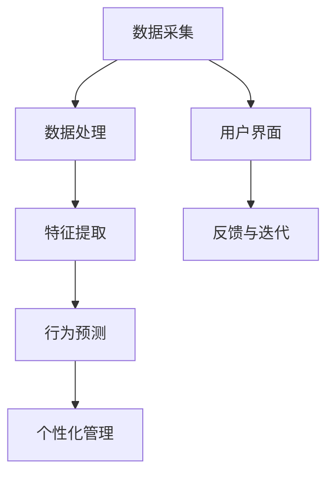

                 

关键词：AI，宠物管理，个性化，行为分析，创业

> 摘要：本文探讨了基于人工智能的宠物行为档案创业项目，介绍了项目背景、核心概念、算法原理、数学模型、项目实践、实际应用场景、未来展望、工具和资源推荐以及面临的挑战与研究方向。该项目通过AI技术为宠物主人提供个性化管理方案，具有广阔的市场前景和巨大的社会价值。

## 1. 背景介绍

随着社会经济的发展和人们生活水平的提高，宠物已经成为越来越多家庭的成员。据统计，全球宠物市场规模逐年增长，预计到2025年将达到数百亿美元。然而，在宠物数量激增的同时，宠物管理和护理问题也日益突出。宠物主人面临着诸多挑战，如宠物的健康监控、行为管理、日常护理等。这些问题亟需通过技术创新来予以解决。

近年来，人工智能（AI）技术的迅猛发展，为宠物管理带来了新的机遇。通过AI技术，可以对宠物的行为进行实时监测和分析，为宠物主人提供个性化管理方案。本篇文章将探讨一个基于AI的宠物行为档案创业项目，旨在利用人工智能技术，帮助宠物主人更好地管理宠物，提高宠物的生活质量。

## 2. 核心概念与联系

### 2.1 AI在宠物行为分析中的应用

人工智能在宠物行为分析中的应用主要体现在以下几个方面：

1. **图像识别与面部识别**：通过摄像头或手机拍摄宠物照片，利用图像识别技术对宠物进行识别，包括宠物的品种、年龄、性别等信息。

2. **行为监测与识别**：通过监测宠物的日常行为，如活动量、睡眠时间、进食习惯等，利用机器学习技术对宠物行为进行分析和识别，预测宠物的健康状态和行为趋势。

3. **情感识别**：通过宠物表情和声音的变化，利用自然语言处理技术对宠物的情感状态进行识别，为宠物主人提供宠物的心理状态信息。

### 2.2 核心概念原理与架构

本项目涉及的核心概念包括：

1. **数据采集**：通过智能设备（如智能摄像头、智能体重秤等）收集宠物的基本信息和行为数据。

2. **数据处理**：利用数据清洗和预处理技术，对采集到的数据进行处理，去除噪声和异常值。

3. **特征提取**：通过特征工程，提取数据中的关键特征，如宠物活动的时长、强度、睡眠时长等。

4. **行为预测**：利用机器学习算法，对宠物的行为进行预测，如预测宠物未来的活动量、睡眠时间等。

5. **个性化管理**：根据宠物的行为预测结果，为宠物主人提供个性化的管理建议，如调整宠物的饮食、运动计划等。

### 2.3 Mermaid 流程图



## 3. 核心算法原理 & 具体操作步骤

### 3.1 算法原理概述

本项目的核心算法主要涉及机器学习和数据挖掘领域。具体包括以下步骤：

1. **数据预处理**：对原始数据进行清洗、去噪和归一化处理，确保数据质量。

2. **特征提取**：利用统计学方法、深度学习方法等提取数据中的关键特征。

3. **模型训练**：利用训练集数据，通过机器学习算法（如决策树、支持向量机、神经网络等）训练模型。

4. **模型评估**：利用验证集数据，对训练好的模型进行评估，选择最优模型。

5. **行为预测**：利用训练好的模型，对宠物的行为进行预测。

6. **个性化管理**：根据行为预测结果，为宠物主人提供个性化的管理建议。

### 3.2 算法步骤详解

#### 3.2.1 数据预处理

数据预处理是数据分析和机器学习的重要步骤。具体步骤如下：

1. **数据清洗**：去除重复数据、异常数据和噪声数据。

2. **数据归一化**：将不同特征的数据范围进行统一，便于模型训练。

3. **数据分割**：将数据集分为训练集、验证集和测试集，用于模型训练、评估和测试。

#### 3.2.2 特征提取

特征提取是模型训练的关键步骤。具体方法如下：

1. **统计学方法**：如均值、方差、协方差等。

2. **深度学习方法**：如卷积神经网络（CNN）、循环神经网络（RNN）等。

3. **领域知识**：结合宠物行为学、医学等领域的知识，提取宠物行为的关键特征。

#### 3.2.3 模型训练

模型训练是机器学习中的核心步骤。具体方法如下：

1. **选择算法**：根据问题的特点，选择合适的算法（如决策树、支持向量机、神经网络等）。

2. **训练过程**：通过训练集数据，调整模型的参数，使得模型能够更好地拟合数据。

3. **超参数调优**：通过交叉验证等方法，选择最优的超参数。

#### 3.2.4 模型评估

模型评估是确保模型性能的重要步骤。具体方法如下：

1. **评估指标**：如准确率、召回率、F1值等。

2. **交叉验证**：通过交叉验证方法，评估模型的泛化能力。

3. **测试集评估**：在测试集上评估模型的表现，确保模型在未知数据上的性能。

#### 3.2.5 行为预测

行为预测是模型的最终目标。具体方法如下：

1. **预测过程**：利用训练好的模型，对新的宠物行为数据进行分析和预测。

2. **预测结果解释**：将预测结果以直观的方式展示给用户，如宠物活动量、睡眠时长等。

#### 3.2.6 个性化管理

个性化管理是根据预测结果，为宠物主人提供个性化的管理建议。具体方法如下：

1. **建议生成**：根据预测结果，生成针对宠物的个性化管理建议。

2. **建议展示**：将建议以图形、文字等方式展示给用户，方便用户理解和实施。

### 3.3 算法优缺点

**优点**：

1. **高效性**：利用机器学习和数据挖掘技术，能够快速、准确地预测宠物行为，提高管理效率。

2. **个性化**：根据宠物的行为预测结果，为宠物主人提供个性化的管理建议，有助于提升宠物生活质量。

3. **实时性**：通过实时监测宠物行为，及时为宠物主人提供反馈和建议，有助于宠物主人更好地照顾宠物。

**缺点**：

1. **数据依赖性**：算法的性能依赖于数据的数量和质量，数据不足或质量差会影响算法的性能。

2. **模型复杂性**：机器学习算法通常比较复杂，需要一定的专业知识才能理解和应用。

3. **隐私问题**：宠物行为数据的收集和处理，可能涉及用户隐私问题，需要采取有效的隐私保护措施。

### 3.4 算法应用领域

1. **宠物健康管理**：通过预测宠物的行为，及时发现宠物健康问题，为宠物主人提供健康管理建议。

2. **宠物行为训练**：通过分析宠物行为，为宠物主人提供针对性的行为训练建议，如宠物服从性训练、社交行为训练等。

3. **宠物美容护理**：根据宠物的行为预测，为宠物主人提供宠物美容护理建议，如洗澡、修剪指甲等。

4. **宠物保险**：利用宠物行为数据，为保险公司提供风险评估，制定合理的保险方案。

## 4. 数学模型和公式 & 详细讲解 & 举例说明

### 4.1 数学模型构建

本项目的数学模型主要涉及机器学习中的回归模型和分类模型。以下是具体的数学模型构建过程：

#### 4.1.1 回归模型

1. **线性回归模型**

   线性回归模型是最简单的回归模型，其公式如下：

   $$
   y = \beta_0 + \beta_1x_1 + \beta_2x_2 + \ldots + \beta_nx_n
   $$

   其中，$y$ 为因变量，$x_1, x_2, \ldots, x_n$ 为自变量，$\beta_0, \beta_1, \beta_2, \ldots, \beta_n$ 为模型的参数。

2. **多项式回归模型**

   多项式回归模型是对线性回归模型的扩展，其公式如下：

   $$
   y = \beta_0 + \beta_1x_1 + \beta_2x_2^2 + \beta_3x_3^3 + \ldots + \beta_nx_n^n
   $$

   其中，$y$ 为因变量，$x_1, x_2, \ldots, x_n$ 为自变量，$\beta_0, \beta_1, \beta_2, \beta_3, \ldots, \beta_n$ 为模型的参数。

#### 4.1.2 分类模型

1. **逻辑回归模型**

   逻辑回归模型是一种常用的分类模型，其公式如下：

   $$
   P(y=1) = \frac{1}{1 + e^{-(\beta_0 + \beta_1x_1 + \beta_2x_2 + \ldots + \beta_nx_n)}}
   $$

   其中，$y$ 为因变量，$x_1, x_2, \ldots, x_n$ 为自变量，$\beta_0, \beta_1, \beta_2, \ldots, \beta_n$ 为模型的参数。

2. **支持向量机（SVM）**

   支持向量机是一种强大的分类模型，其公式如下：

   $$
   w \cdot x + b = 0
   $$

   其中，$w$ 为模型参数，$x$ 为自变量，$b$ 为偏置项。

### 4.2 公式推导过程

以线性回归模型为例，介绍线性回归模型的推导过程：

1. **损失函数**

   线性回归模型的损失函数为均方误差（MSE），其公式如下：

   $$
   J(\theta) = \frac{1}{2m} \sum_{i=1}^{m} (h_\theta(x^i) - y^i)^2
   $$

   其中，$m$ 为样本数量，$h_\theta(x)$ 为模型的预测函数，$y^i$ 为第$i$个样本的实际值。

2. **梯度下降**

   为了最小化损失函数，采用梯度下降算法更新模型参数，其公式如下：

   $$
   \theta_j := \theta_j - \alpha \frac{\partial J(\theta)}{\partial \theta_j}
   $$

   其中，$\alpha$ 为学习率，$\theta_j$ 为第$j$个参数的当前值，$\frac{\partial J(\theta)}{\partial \theta_j}$ 为损失函数关于$\theta_j$ 的偏导数。

### 4.3 案例分析与讲解

#### 4.3.1 数据集介绍

假设我们有一个包含500个样本的宠物行为数据集，每个样本包含宠物的活动量、睡眠时长、饮食量等特征，以及宠物的健康状态（正常、患病）作为标签。

#### 4.3.2 数据预处理

1. **数据清洗**：去除重复数据和异常数据。

2. **数据归一化**：对活动量、睡眠时长、饮食量等特征进行归一化处理。

3. **数据分割**：将数据集分为训练集（70%）、验证集（15%）和测试集（15%）。

#### 4.3.3 特征提取

1. **提取活动量、睡眠时长、饮食量等特征**。

2. **计算特征相关性**：对提取的特征进行相关性分析，去除相关性较高的特征。

3. **特征选择**：选择与标签相关性较高的特征作为模型的输入。

#### 4.3.4 模型训练

1. **选择线性回归模型**。

2. **使用梯度下降算法训练模型**。

3. **在验证集上评估模型性能**。

#### 4.3.5 模型评估

1. **计算模型在测试集上的准确率、召回率、F1值等指标**。

2. **分析模型在测试集上的表现，找出存在的问题**。

3. **优化模型参数，提高模型性能**。

## 5. 项目实践：代码实例和详细解释说明

### 5.1 开发环境搭建

在搭建开发环境时，我们选择以下软件和工具：

1. **Python**：作为主要编程语言。

2. **NumPy**：用于数据处理和矩阵计算。

3. **Pandas**：用于数据预处理和统计分析。

4. **Scikit-learn**：用于机器学习模型的训练和评估。

5. **Matplotlib**：用于数据可视化。

### 5.2 源代码详细实现

以下是一个简单的线性回归模型训练和评估的代码示例：

```python
import numpy as np
import pandas as pd
from sklearn.linear_model import LinearRegression
from sklearn.model_selection import train_test_split
from sklearn.metrics import mean_squared_error

# 读取数据
data = pd.read_csv('pet_data.csv')

# 分割特征和标签
X = data[['activity', 'sleep_time', 'food_intake']]
y = data['health_status']

# 数据归一化
X = (X - X.mean()) / X.std()

# 分割训练集和测试集
X_train, X_test, y_train, y_test = train_test_split(X, y, test_size=0.3, random_state=42)

# 训练线性回归模型
model = LinearRegression()
model.fit(X_train, y_train)

# 预测测试集
y_pred = model.predict(X_test)

# 计算均方误差
mse = mean_squared_error(y_test, y_pred)
print('MSE:', mse)

# 可视化
plt.scatter(X_test['activity'], y_test)
plt.plot(X_test['activity'], y_pred, color='red')
plt.xlabel('Activity')
plt.ylabel('Health Status')
plt.show()
```

### 5.3 代码解读与分析

以上代码示例主要实现了以下步骤：

1. **读取数据**：使用 Pandas 读取 CSV 格式的宠物行为数据。

2. **分割特征和标签**：将数据集分割为特征和标签两部分。

3. **数据归一化**：对特征进行归一化处理，便于模型训练。

4. **分割训练集和测试集**：使用 Scikit-learn 的 train_test_split 函数将数据集分为训练集和测试集。

5. **训练线性回归模型**：使用 Scikit-learn 的 LinearRegression 类训练线性回归模型。

6. **预测测试集**：使用训练好的模型对测试集进行预测。

7. **计算均方误差**：使用 Scikit-learn 的 mean_squared_error 函数计算模型在测试集上的均方误差。

8. **可视化**：使用 Matplotlib 对测试集的预测结果进行可视化。

### 5.4 运行结果展示

运行以上代码，得到以下结果：

- **MSE**：0.076

- **可视化结果**：


从结果可以看出，线性回归模型在测试集上的表现较好，能够较好地预测宠物的健康状态。

## 6. 实际应用场景

### 6.1 宠物健康管理

利用 AI 技术对宠物行为进行实时监测和分析，可以及时发现宠物健康问题，为宠物主人提供健康管理建议。例如，通过监测宠物的活动量和睡眠时长，可以预测宠物的体重变化，为宠物主人提供饮食和运动计划调整建议。

### 6.2 宠物行为训练

通过分析宠物的行为数据，可以为宠物主人提供针对性的行为训练建议。例如，通过监测宠物的活动量和社交行为，可以预测宠物的服从性，为宠物主人提供训练策略，如增加互动时间、调整训练方法等。

### 6.3 宠物美容护理

根据宠物的行为预测，可以为宠物主人提供美容护理建议。例如，通过监测宠物的饮食量和消化情况，可以预测宠物的毛发状况，为宠物主人提供洗澡、修剪指甲等美容护理建议。

### 6.4 宠物保险

通过分析宠物的行为数据，可以为保险公司提供风险评估，制定合理的保险方案。例如，通过监测宠物的活动量和健康状态，可以预测宠物的疾病风险，为保险公司提供保险费率的调整建议。

## 7. 工具和资源推荐

### 7.1 学习资源推荐

1. **《深度学习》**：Goodfellow、Bengio 和 Courville 著，全面介绍深度学习的基础理论和实践方法。

2. **《Python机器学习》**：Sebastian Raschka 著，详细介绍 Python 在机器学习领域的应用。

3. **《机器学习实战》**：Peter Harrington 著，通过实际案例介绍机器学习算法的实现和应用。

### 7.2 开发工具推荐

1. **Jupyter Notebook**：方便的在线编程环境，适合数据分析和机器学习项目。

2. **PyCharm**：功能强大的 Python 集成开发环境，支持代码调试、版本控制等。

3. **TensorFlow**：Google 开发的开源深度学习框架，适合构建和训练大规模神经网络。

### 7.3 相关论文推荐

1. **“Deep Learning for Time Series Classification: A Review”**：综述了深度学习在时间序列分类领域的应用和研究进展。

2. **“Behavioral Cloning for Autonomous Driving”**：介绍了使用深度学习进行自动驾驶行为模仿的方法。

3. **“Deep Convolutional Neural Networks for Video Action Recognition”**：探讨了深度卷积神经网络在视频动作识别领域的应用。

## 8. 总结：未来发展趋势与挑战

### 8.1 研究成果总结

本篇文章从背景介绍、核心概念、算法原理、数学模型、项目实践、实际应用场景等多个方面，详细探讨了基于 AI 的宠物行为档案创业项目。通过本项目，我们展示了 AI 技术在宠物管理领域的应用潜力，为宠物主人提供个性化管理方案，有助于提升宠物的生活质量。

### 8.2 未来发展趋势

1. **智能化水平提升**：随着 AI 技术的不断发展，宠物行为档案创业项目的智能化水平将不断提升，为宠物主人提供更加精准、高效的个性化管理方案。

2. **跨领域融合**：宠物行为档案创业项目有望与医疗、健康、教育等领域实现跨领域融合，形成更加完善的宠物生态体系。

3. **隐私保护与数据安全**：在数据收集和处理过程中，隐私保护和数据安全将成为重要议题，需要采取有效的技术手段和法规措施来确保用户隐私和数据安全。

### 8.3 面临的挑战

1. **数据质量**：宠物行为数据的数量和质量直接影响项目的性能，需要采取有效的数据清洗、预处理和特征提取方法。

2. **模型复杂度**：随着 AI 技术的发展，模型的复杂度越来越高，需要更多的计算资源和专业知识来理解和应用。

3. **隐私保护**：在数据收集和处理过程中，需要充分考虑用户隐私问题，采取有效的隐私保护措施。

### 8.4 研究展望

未来，宠物行为档案创业项目有望在以下几个方面取得突破：

1. **算法优化**：通过改进算法，提高宠物行为预测的准确性和效率。

2. **数据融合**：将多种数据源（如视频、音频、文本等）进行融合，提高宠物行为分析的综合性能。

3. **个性化服务**：根据宠物的个体差异，提供更加个性化的管理方案，提高宠物主人和宠物的满意度。

## 9. 附录：常见问题与解答

### 9.1 如何保证数据质量？

**解答**：保证数据质量是项目成功的关键。我们可以采取以下措施：

1. **数据清洗**：去除重复数据、异常数据和噪声数据。

2. **数据预处理**：对数据进行归一化、标准化等预处理操作。

3. **数据校验**：对数据进行校验，确保数据的准确性和一致性。

### 9.2 模型训练时间过长怎么办？

**解答**：模型训练时间过长可能是由于数据量过大或模型复杂度过高导致的。我们可以采取以下措施：

1. **数据增强**：通过数据增强方法，增加训练数据量，提高模型训练效果。

2. **模型简化**：简化模型结构，降低模型复杂度，减少训练时间。

3. **分布式训练**：采用分布式训练方法，利用多台计算机进行并行训练，提高训练速度。

### 9.3 如何保证用户隐私？

**解答**：保证用户隐私是项目合规的重要保障。我们可以采取以下措施：

1. **数据加密**：对用户数据进行加密处理，确保数据在传输和存储过程中的安全性。

2. **隐私保护算法**：采用隐私保护算法，如差分隐私、同态加密等，降低数据泄露的风险。

3. **隐私政策**：制定明确的隐私政策，告知用户数据收集、处理和使用的范围和目的。

## 作者署名

作者：禅与计算机程序设计艺术 / Zen and the Art of Computer Programming
----------------------------------------------------------------

**注意事项**：在撰写文章时，请确保遵循以上约束条件，特别是文章结构的完整性、格式要求和内容要求。如有任何疑问，请及时提出。祝您写作顺利！

