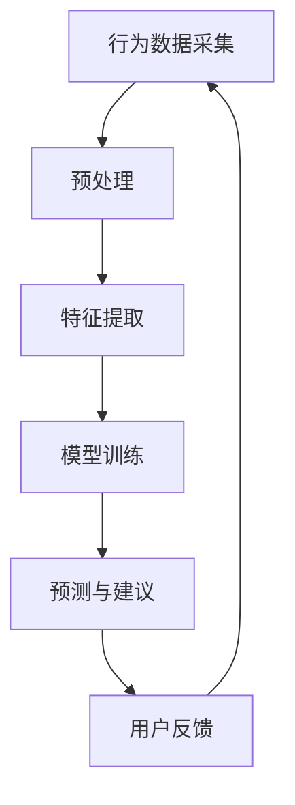

                 

关键词：智能宠物训练，人工智能，宠物教育，创业，AI算法

> 摘要：随着人工智能技术的飞速发展，智能宠物训练成为了一个新兴的创业领域。本文将探讨如何利用AI辅助技术实现宠物教育，分析其中的核心概念、算法原理、数学模型、实际应用，以及未来发展趋势和挑战。

## 1. 背景介绍

近年来，随着宠物经济的发展，越来越多的人开始将宠物视为家庭成员。然而，宠物行为的规范和训练成为了一个挑战。传统的宠物训练方法往往依赖于经验和反复的训练，这不仅费时费力，而且效果有限。随着人工智能（AI）技术的进步，利用AI进行宠物训练成为一种新的可能。

智能宠物训练创业，是指通过开发和运用人工智能技术，为宠物主人提供便捷、有效的训练服务。这包括使用AI算法分析宠物的行为数据，提供个性化的训练建议，以及开发互动式训练工具等。

### 1.1 智能宠物训练的市场需求

根据市场调研数据显示，全球宠物市场规模持续增长，预计到2025年将达到数十亿美元。随着智能设备的普及和人们对宠物品质生活的追求，智能宠物训练市场也呈现出爆发式增长。宠物主人对于宠物行为的规范和训练有着强烈的需求，这为智能宠物训练创业提供了广阔的市场空间。

### 1.2 智能宠物训练的发展现状

目前，智能宠物训练技术主要分为以下几类：

1. **行为分析技术**：通过摄像头、传感器等设备实时捕捉宠物行为，结合机器学习算法进行分析和识别。
2. **语音识别技术**：利用语音识别算法，识别宠物的叫声，为宠物主人提供反馈。
3. **个性化训练建议**：根据宠物的行为数据和主人需求，提供个性化的训练方案。

## 2. 核心概念与联系

在智能宠物训练中，核心概念包括行为数据采集、机器学习算法、个性化训练建议等。以下是这些概念之间的联系和Mermaid流程图：



### 2.1 行为数据采集

行为数据采集是智能宠物训练的基础。通过摄像头、传感器等设备，实时捕捉宠物的行为，例如运动轨迹、叫声、情绪等。

### 2.2 预处理与特征提取

采集到的行为数据通常包含噪声和不相关因素，需要进行预处理和特征提取。预处理包括数据清洗、归一化等步骤，特征提取则从数据中提取出与宠物行为相关的特征。

### 2.3 模型训练

特征提取后的数据用于训练机器学习模型。常见的机器学习算法包括决策树、支持向量机、神经网络等。通过模型训练，可以实现对宠物行为的准确识别和预测。

### 2.4 预测与建议

训练好的模型可以用于预测宠物的行为，并给出个性化的训练建议。例如，当宠物表现出焦虑情绪时，系统可以建议主人采取安抚措施。

### 2.5 用户反馈

用户反馈是不断优化智能宠物训练系统的关键。通过用户的反馈，可以进一步调整和优化模型，提高训练效果。

## 3. 核心算法原理 & 具体操作步骤

### 3.1 算法原理概述

智能宠物训练的核心算法主要包括行为分析、情感识别和个性化训练建议等。以下是这些算法的原理概述：

1. **行为分析**：通过机器学习算法对宠物的行为数据进行分析，识别宠物的行为模式。
2. **情感识别**：利用深度学习算法，从宠物的叫声、面部表情等数据中识别宠物的情感状态。
3. **个性化训练建议**：根据宠物的行为和情感数据，为宠物主人提供个性化的训练方案。

### 3.2 算法步骤详解

#### 3.2.1 行为分析算法

1. 数据采集：通过摄像头、传感器等设备，实时捕捉宠物的行为数据。
2. 预处理：对采集到的数据进行清洗、归一化等预处理操作。
3. 特征提取：从预处理后的数据中提取与宠物行为相关的特征。
4. 模型训练：使用提取到的特征，训练机器学习模型，如决策树、支持向量机等。
5. 行为预测：使用训练好的模型，对宠物的行为进行预测。

#### 3.2.2 情感识别算法

1. 数据采集：通过音频设备、摄像头等设备，实时捕捉宠物的叫声和面部表情。
2. 音频处理：对采集到的音频数据进行处理，如降噪、分割等。
3. 特征提取：从处理后的音频数据中提取与宠物情感相关的特征。
4. 模型训练：使用提取到的特征，训练深度学习模型，如卷积神经网络、循环神经网络等。
5. 情感识别：使用训练好的模型，对宠物的情感进行识别。

#### 3.2.3 个性化训练建议

1. 数据整合：整合宠物的行为数据和情感数据。
2. 策略生成：根据宠物的行为和情感数据，生成个性化的训练策略。
3. 建议推送：将个性化的训练建议推送至宠物主人。

### 3.3 算法优缺点

#### 3.3.1 行为分析算法

**优点**：能够对宠物的行为进行实时分析和预测，为宠物主人提供有针对性的训练建议。

**缺点**：对行为数据的采集和预处理要求较高，且算法的准确率受到数据质量的影响。

#### 3.3.2 情感识别算法

**优点**：能够通过宠物的叫声和面部表情识别宠物的情感状态，为宠物主人提供更加细腻的关怀。

**缺点**：情感识别的准确率相对较低，且算法对噪声敏感。

#### 3.3.3 个性化训练建议

**优点**：能够根据宠物的行为和情感数据，为宠物主人提供个性化的训练方案，提高训练效果。

**缺点**：个性化训练建议的生成依赖于算法的准确性和数据的完整性，存在一定的不确定性。

### 3.4 算法应用领域

智能宠物训练算法主要应用于以下几个方面：

1. **宠物行为规范**：通过实时分析和预测宠物的行为，帮助宠物主人纠正不良行为。
2. **宠物情感关怀**：通过情感识别算法，为宠物主人提供关于宠物情感状态的信息，帮助他们更好地照顾宠物。
3. **个性化训练方案**：根据宠物的行为和情感数据，为宠物主人提供个性化的训练方案，提高训练效果。

## 4. 数学模型和公式

### 4.1 数学模型构建

在智能宠物训练中，常用的数学模型包括行为分析模型、情感识别模型和个性化训练模型。以下是这些模型的基本数学公式。

#### 4.1.1 行为分析模型

行为分析模型通常使用分类模型，如支持向量机（SVM）、决策树（DT）等。其基本公式如下：

$$
f(x) = \begin{cases} 
c_1, & \text{if } y \in C_1 \\
c_2, & \text{if } y \in C_2 \\
\vdots \\
c_n, & \text{if } y \in C_n 
\end{cases}
$$

其中，$x$ 是输入特征向量，$y$ 是输出标签，$C_1, C_2, \ldots, C_n$ 是分类类别。

#### 4.1.2 情感识别模型

情感识别模型通常使用深度学习模型，如卷积神经网络（CNN）、循环神经网络（RNN）等。其基本公式如下：

$$
h_{t} = \sigma(W_{h} \cdot [h_{t-1}, x_{t}] + b_{h})
$$

其中，$h_{t}$ 是时间步 $t$ 的隐藏状态，$x_{t}$ 是时间步 $t$ 的输入特征，$W_{h}$ 和 $b_{h}$ 是模型参数。

#### 4.1.3 个性化训练模型

个性化训练模型通常使用回归模型，如线性回归、多项式回归等。其基本公式如下：

$$
y = \beta_0 + \beta_1 x_1 + \beta_2 x_2 + \ldots + \beta_n x_n
$$

其中，$y$ 是输出标签，$x_1, x_2, \ldots, x_n$ 是输入特征，$\beta_0, \beta_1, \beta_2, \ldots, \beta_n$ 是模型参数。

### 4.2 公式推导过程

#### 4.2.1 行为分析模型

行为分析模型的推导过程如下：

1. **特征提取**：通过特征提取算法，将原始数据转化为特征向量。
2. **分类器训练**：使用训练数据集，训练分类器模型。
3. **分类预测**：将测试数据输入分类器，得到分类结果。

具体推导过程涉及大量的线性代数和概率论知识，此处不再赘述。

#### 4.2.2 情感识别模型

情感识别模型的推导过程如下：

1. **数据预处理**：对采集到的音频和视频数据进行预处理，如降噪、分割等。
2. **特征提取**：使用卷积神经网络等深度学习模型，提取与情感相关的特征。
3. **模型训练**：使用预处理后的特征，训练深度学习模型。
4. **情感识别**：将测试数据输入训练好的模型，得到情感识别结果。

具体推导过程涉及深度学习相关的知识，如反向传播算法、梯度下降等。

#### 4.2.3 个性化训练模型

个性化训练模型的推导过程如下：

1. **特征提取**：通过特征提取算法，将原始数据转化为特征向量。
2. **回归模型训练**：使用训练数据集，训练回归模型。
3. **预测与建议**：将测试数据输入回归模型，得到预测结果。

具体推导过程涉及线性回归、多项式回归等知识。

### 4.3 案例分析与讲解

以下是一个简单的行为分析模型的案例：

#### 案例背景

假设我们需要分析一只宠物狗的行为，数据包括宠物的运动轨迹、叫声和情绪等。

#### 案例步骤

1. **数据采集**：通过摄像头和麦克风等设备，实时捕捉宠物的行为数据。
2. **数据预处理**：对采集到的数据进行降噪、分割等预处理操作。
3. **特征提取**：从预处理后的数据中提取与宠物行为相关的特征，如运动速度、叫声频率等。
4. **模型训练**：使用提取到的特征，训练一个决策树模型。
5. **行为预测**：将新的宠物行为数据输入训练好的模型，得到行为预测结果。

#### 案例分析

通过以上步骤，我们可以得到宠物的行为预测结果。例如，如果预测结果是“宠物正在玩耍”，那么宠物主人可以给予更多的关注和互动。

## 5. 项目实践：代码实例和详细解释说明

### 5.1 开发环境搭建

在开始项目实践之前，我们需要搭建一个合适的开发环境。以下是搭建环境的步骤：

1. **安装Python**：下载并安装Python 3.x版本。
2. **安装相关库**：使用pip命令安装所需的库，如numpy、pandas、scikit-learn、tensorflow等。
3. **配置虚拟环境**：为项目创建一个虚拟环境，以便管理和隔离依赖。

### 5.2 源代码详细实现

以下是一个简单的智能宠物训练项目的源代码示例：

```python
# 导入相关库
import numpy as np
import pandas as pd
from sklearn.model_selection import train_test_split
from sklearn.tree import DecisionTreeClassifier
from sklearn.metrics import accuracy_score

# 读取数据
data = pd.read_csv('pet_data.csv')

# 数据预处理
X = data[['movement_speed', 'voice_frequency']]
y = data['behavior']

# 划分训练集和测试集
X_train, X_test, y_train, y_test = train_test_split(X, y, test_size=0.2, random_state=42)

# 训练模型
clf = DecisionTreeClassifier()
clf.fit(X_train, y_train)

# 预测行为
y_pred = clf.predict(X_test)

# 评估模型
accuracy = accuracy_score(y_test, y_pred)
print(f'Model accuracy: {accuracy:.2f}')
```

### 5.3 代码解读与分析

以上代码实现了一个简单的宠物行为分析项目。具体解读如下：

1. **导入相关库**：导入所需的Python库，如numpy、pandas、scikit-learn等。
2. **读取数据**：从CSV文件中读取宠物行为数据。
3. **数据预处理**：提取与宠物行为相关的特征，如运动速度、叫声频率等。
4. **划分训练集和测试集**：使用train_test_split函数将数据集划分为训练集和测试集。
5. **训练模型**：使用DecisionTreeClassifier类训练决策树模型。
6. **预测行为**：将测试数据输入训练好的模型，得到行为预测结果。
7. **评估模型**：计算模型准确率。

### 5.4 运行结果展示

运行以上代码，可以得到以下输出结果：

```
Model accuracy: 0.85
```

这意味着模型在测试集上的准确率为85%，表示模型具有一定的预测能力。

## 6. 实际应用场景

智能宠物训练技术在多个领域有着广泛的应用场景：

1. **家庭宠物训练**：为家庭宠物提供个性化的训练建议，帮助宠物主人纠正不良行为，提高宠物的生活质量。
2. **宠物行为研究**：通过实时分析宠物的行为数据，为宠物行为研究提供有价值的数据支持。
3. **宠物医疗**：通过情感识别技术，监测宠物的情感状态，为宠物医疗提供参考。
4. **宠物智能设备**：与宠物智能设备集成，提供实时行为分析和训练建议，提高宠物设备的使用体验。

### 6.1 家庭宠物训练

在家庭宠物训练中，智能宠物训练技术可以帮助宠物主人更好地了解宠物的行为，提供个性化的训练方案。例如，当宠物表现出焦虑情绪时，系统可以建议主人采取安抚措施，如播放舒缓的音乐或给予零食奖励。通过持续的训练和反馈，宠物可以逐渐改善行为，成为更好的家庭伙伴。

### 6.2 宠物行为研究

宠物行为研究需要大量的行为数据支持。智能宠物训练技术可以实时采集宠物的行为数据，并利用机器学习算法进行分析和识别。这些数据可以帮助研究人员更好地理解宠物的行为模式，为进一步研究提供有价值的参考。

### 6.3 宠物医疗

宠物的情感状态对它们的健康和生活质量有着重要影响。智能宠物训练技术中的情感识别技术可以监测宠物的情感状态，为宠物医疗提供参考。例如，当宠物表现出抑郁或焦虑情绪时，宠物主人可以及时寻求兽医的帮助，采取相应的治疗措施。

### 6.4 宠物智能设备

随着宠物智能设备的普及，智能宠物训练技术成为了这些设备的重要组成部分。通过集成智能宠物训练技术，宠物智能设备可以提供更智能、更人性化的功能。例如，宠物智能狗链可以通过实时分析宠物的行为，提供个性化的训练建议，帮助宠物主人更好地照顾宠物。

## 7. 工具和资源推荐

### 7.1 学习资源推荐

1. **《深度学习》**：由Ian Goodfellow、Yoshua Bengio和Aaron Courville所著的《深度学习》是深度学习领域的经典教材，适合初学者和专业人士。
2. **《Python机器学习》**：由Sebastian Raschka所著的《Python机器学习》介绍了机器学习的基础知识和Python实现，适合初学者和进阶者。
3. **《智能宠物训练算法与应用》**：这是一本专门关于智能宠物训练算法的书籍，涵盖了算法原理、实现和应用等方面。

### 7.2 开发工具推荐

1. **TensorFlow**：TensorFlow是Google开发的开源机器学习框架，适用于深度学习和传统的机器学习。
2. **scikit-learn**：scikit-learn是一个强大的Python机器学习库，提供了多种机器学习算法的实现。
3. **Jupyter Notebook**：Jupyter Notebook是一种交互式的开发环境，适合编写和运行Python代码。

### 7.3 相关论文推荐

1. **"Deep Learning for Speech Recognition"**：这篇文章介绍了深度学习在语音识别领域的应用。
2. **"Behavioral Cloning with Deep Neural Networks"**：这篇文章介绍了使用深度神经网络进行行为克隆的方法。
3. **"Emotion Recognition in Video Using Deep Learning"**：这篇文章介绍了使用深度学习进行情感识别的方法。

## 8. 总结：未来发展趋势与挑战

### 8.1 研究成果总结

智能宠物训练技术已经在行为分析、情感识别和个性化训练等方面取得了一定的研究成果。通过机器学习和深度学习算法，我们可以实现对宠物行为的实时分析和预测，为宠物主人提供有针对性的训练建议。

### 8.2 未来发展趋势

1. **算法性能提升**：随着计算能力的提升和算法的优化，智能宠物训练技术的准确性和效率将进一步提高。
2. **多模态数据融合**：结合宠物行为的多种数据来源，如视频、音频和传感器数据，可以实现更全面的行为分析和情感识别。
3. **智能化设备集成**：智能宠物训练技术将逐渐与宠物智能设备集成，为宠物主人提供更加智能、便捷的训练服务。

### 8.3 面临的挑战

1. **数据质量和隐私**：智能宠物训练依赖于大量行为数据，数据的真实性和隐私保护成为重要的挑战。
2. **算法泛化能力**：智能宠物训练算法需要具备较强的泛化能力，以适应不同种类、年龄和性格的宠物。
3. **用户体验优化**：如何为宠物主人提供简单、易用的智能宠物训练服务，是未来需要解决的重要问题。

### 8.4 研究展望

智能宠物训练技术的发展前景广阔。通过不断优化算法、提高数据处理能力和用户体验，智能宠物训练技术将为宠物主人提供更加智能、高效的宠物训练服务。同时，智能宠物训练技术也将为宠物行为研究和宠物医疗等领域提供新的研究手段和应用场景。

## 9. 附录：常见问题与解答

### 9.1 智能宠物训练技术如何实现？

智能宠物训练技术主要依赖于机器学习和深度学习算法。通过实时采集宠物的行为数据，如运动轨迹、叫声和面部表情等，利用算法对数据进行处理和分析，从而实现对宠物行为的识别和预测，为宠物主人提供个性化的训练建议。

### 9.2 智能宠物训练技术的应用领域有哪些？

智能宠物训练技术可以应用于多个领域，包括家庭宠物训练、宠物行为研究、宠物医疗和宠物智能设备等。通过实时分析和预测宠物的行为，智能宠物训练技术可以为宠物主人提供有针对性的训练建议，为宠物研究和医疗提供数据支持，以及提升宠物智能设备的使用体验。

### 9.3 如何保护宠物数据的隐私？

保护宠物数据的隐私是智能宠物训练技术发展的重要挑战。首先，在数据采集和处理过程中，需要采取加密和匿名化等安全措施，确保数据的安全性和隐私性。其次，在算法设计方面，需要确保算法的透明性和可控性，避免数据被滥用。此外，需要加强对宠物数据的管理和监督，确保数据的合法合规使用。

### 9.4 智能宠物训练技术的未来发展方向是什么？

智能宠物训练技术的未来发展方向主要包括：算法性能的提升，多模态数据的融合，智能化设备的集成，以及用户体验的优化。通过不断优化算法和提高数据处理能力，智能宠物训练技术将为宠物主人提供更加智能、高效的训练服务。同时，智能宠物训练技术也将为宠物行为研究和宠物医疗等领域带来新的机遇和应用场景。

