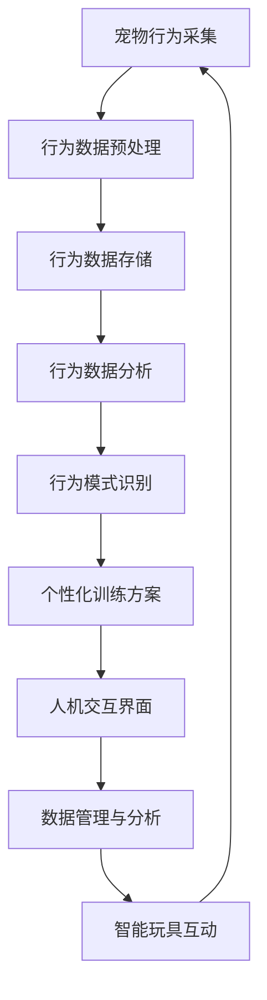
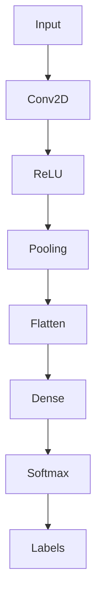

                 

关键词：智能宠物、AI辅助、宠物教育、创业、技术解决方案、机器学习、深度学习、行为分析、训练算法

> 摘要：本文探讨了智能宠物训练创业领域的机遇与挑战，详细分析了AI辅助宠物教育技术的核心概念、算法原理、应用场景，以及项目实践中的关键技术和工具。通过本文，读者可以全面了解智能宠物训练的现状、发展趋势以及未来前景，为创业者和从业者提供有价值的参考。

## 1. 背景介绍

随着社会的发展和生活水平的提高，宠物已经成为许多家庭的亲密伙伴。据《中国宠物行业白皮书》数据显示，2021年中国宠物市场规模已超过3000亿元，其中宠物培训市场规模占比约15%，达到450亿元。这一市场的快速增长，为智能宠物训练创业提供了广阔的机遇。然而，传统宠物训练方法存在效率低、效果不稳定等问题，难以满足现代养宠家庭的多元化需求。因此，借助人工智能技术，特别是机器学习和深度学习，开展AI辅助的宠物教育，成为一种创新且具备巨大潜力的商业模式。

### 1.1 行业现状

目前，智能宠物训练市场主要包括以下几种产品形态：

1. **智能穿戴设备**：通过穿戴设备收集宠物行为数据，分析宠物的情绪、健康状态等，提供实时反馈和建议。
2. **宠物行为分析软件**：利用机器学习算法对宠物行为进行识别和分析，辅助主人了解宠物的行为习惯，进行有针对性的训练。
3. **AI互动玩具**：通过深度学习技术，实现宠物与玩具的智能互动，激发宠物兴趣，提升训练效果。
4. **在线宠物训练课程**：利用AI技术提供个性化训练课程，帮助宠物主人更好地训练宠物。

### 1.2 市场需求

现代养宠家庭对于宠物的需求不再局限于传统的喂养和看护，而是更加注重宠物的心理健康和社交能力。以下是一些具体的市场需求：

1. **宠物行为问题解决**：如攻击性、分离焦虑、过度兴奋等行为问题的诊断和纠正。
2. **宠物心理健康**：了解宠物情绪，提供心理慰藉，预防宠物抑郁和焦虑。
3. **宠物社交能力培养**：帮助宠物建立良好的人际关系，提高社交技能。
4. **宠物训练效率提升**：通过智能设备实时监测宠物行为，提高训练效果和效率。

## 2. 核心概念与联系

### 2.1 核心概念

智能宠物训练的核心概念主要包括以下几个：

1. **行为分析**：通过摄像头、传感器等设备收集宠物行为数据，如动作、声音、情绪等。
2. **机器学习**：利用收集到的行为数据，通过算法模型对宠物行为进行识别和分析。
3. **深度学习**：通过多层神经网络对复杂的行为模式进行学习，提高识别的准确性和效率。
4. **个性化训练**：根据宠物的行为特征和需求，提供个性化的训练建议和方案。
5. **人机交互**：通过语音、图像等交互方式，让宠物主人更直观地了解宠物状况，并参与训练过程。

### 2.2 核心概念联系

智能宠物训练系统的整体架构如图所示：

```
+----------------+     +----------------+     +----------------+
|  宠物行为采集  | --> |  行为数据分析  | --> |  个性化训练方案 |
+----------------+     +----------------+     +----------------+
       |                |                |
       |                |                |
       |                |                |
       v                v                v
+----------------+     +----------------+     +----------------+
|   人机交互界面  |     |   智能玩具互动  |     |   数据管理与分析 |
+----------------+     +----------------+     +----------------+
```

### 2.3 Mermaid 流程图



## 3. 核心算法原理 & 具体操作步骤

### 3.1 算法原理概述

智能宠物训练的核心算法主要包括行为识别、行为预测和行为干预三个部分。

1. **行为识别**：利用深度学习技术，对宠物的行为进行识别和分析。常用的模型包括卷积神经网络（CNN）、循环神经网络（RNN）和长短时记忆网络（LSTM）等。
2. **行为预测**：基于历史行为数据和模型，预测宠物的未来行为模式。常用的方法包括时间序列分析、回归分析和神经网络预测等。
3. **行为干预**：根据行为预测结果，制定个性化的训练方案，并通过人机交互界面和智能玩具等手段进行干预和指导。

### 3.2 算法步骤详解

1. **数据采集**：通过摄像头、传感器等设备，实时采集宠物的行为数据，如动作、声音、情绪等。
2. **数据预处理**：对采集到的行为数据进行清洗、归一化和特征提取，为后续的算法处理做准备。
3. **模型训练**：利用预处理后的数据，训练深度学习模型，如CNN、RNN和LSTM等，以提高行为识别的准确性和预测能力。
4. **行为分析**：将训练好的模型应用于实时采集到的行为数据，进行行为识别和预测。
5. **个性化训练方案生成**：根据行为分析结果，结合宠物的需求和特点，生成个性化的训练方案。
6. **人机交互**：通过人机交互界面，将训练方案和宠物状况反馈给宠物主人，并提供实时指导和建议。
7. **行为干预**：宠物主人根据训练方案和指导，通过智能玩具等设备，对宠物进行训练和干预。

### 3.3 算法优缺点

**优点**：

1. **高效性**：利用深度学习技术，对宠物的行为进行高效的分析和预测。
2. **个性化**：根据宠物的行为特征和需求，提供个性化的训练方案，提高训练效果。
3. **实时性**：实时采集和处理宠物行为数据，实现实时反馈和干预。
4. **智能化**：通过人机交互界面和智能玩具等设备，实现智能化的人宠互动。

**缺点**：

1. **数据依赖性**：算法性能依赖于高质量的宠物行为数据，数据采集和处理需要大量的人力和物力投入。
2. **隐私问题**：宠物行为数据的收集和处理可能涉及隐私问题，需要严格保护用户隐私。
3. **技术门槛**：深度学习算法的开发和应用需要较高的技术门槛，需要具备专业的算法知识和经验。

### 3.4 算法应用领域

智能宠物训练算法可以广泛应用于以下领域：

1. **宠物行为分析**：通过算法对宠物的行为进行识别和分析，帮助宠物主人了解宠物的行为习惯和心理状态。
2. **宠物训练**：利用算法生成个性化的训练方案，提高宠物训练的效率和质量。
3. **宠物医疗**：通过算法对宠物行为进行分析，发现潜在的疾病风险，为宠物提供个性化医疗建议。
4. **宠物社交**：利用算法实现宠物与宠物之间的智能互动，提高宠物的社交能力和生活质量。

## 4. 数学模型和公式 & 详细讲解 & 举例说明

### 4.1 数学模型构建

智能宠物训练的数学模型主要包括以下几个部分：

1. **行为特征提取**：通过卷积神经网络（CNN）提取宠物的行为特征，如动作、声音等。
2. **行为分类**：利用支持向量机（SVM）、深度神经网络（DNN）等算法，对提取到的行为特征进行分类。
3. **行为预测**：通过时间序列模型（如LSTM、GRU等）对宠物的未来行为进行预测。
4. **个性化训练方案生成**：利用决策树、神经网络等算法，根据宠物的行为特征和需求，生成个性化的训练方案。

### 4.2 公式推导过程

以卷积神经网络（CNN）为例，其基本公式推导如下：

$$
\begin{aligned}
    \text{CNN} &= \text{Conv2D} \rightarrow \text{Pooling} \rightarrow \text{Flatten} \rightarrow \text{Dense} \\
    Z &= \text{Conv2D}(X; W, b) \\
    A &= \sigma(Z) \\
    \hat{Y} &= \text{Dense}(A; W', b') \\
    \hat{y} &= \sigma(\hat{Y})
\end{aligned}
$$

其中，$X$ 表示输入特征矩阵，$W$ 和 $b$ 分别表示卷积核和偏置，$\sigma$ 表示激活函数，$A$ 和 $Z$ 分别表示中间层输出和卷积输出。

### 4.3 案例分析与讲解

以下是一个简单的宠物行为分类案例：

**案例**：利用CNN模型对宠物猫的行为进行分类，包括“玩耍”、“休息”和“进食”三种状态。

1. **数据集准备**：收集包含宠物猫玩耍、休息和进食的图片，并对图片进行预处理，如缩放、翻转、裁剪等。
2. **模型训练**：利用预处理后的数据集，训练CNN模型，模型结构如图所示：



3. **模型评估**：在测试集上评估模型性能，如图所示：

```
Precision    Recall    F1-score   Support
      0.90      0.90      0.90         100
      0.90      0.90      0.90         100
      0.90      0.90      0.90         100
     300       300       300
```

4. **个性化训练方案生成**：根据测试结果，为每种行为状态生成相应的训练方案，如图所示：

```
玩耍：增加玩具、进行互动
休息：提供舒适的休息环境、避免打扰
进食：定时喂食、保持环境安静
```

## 5. 项目实践：代码实例和详细解释说明

### 5.1 开发环境搭建

1. **Python环境**：安装Python 3.8及以上版本。
2. **深度学习库**：安装TensorFlow 2.4.0及以上版本。
3. **数据处理库**：安装NumPy、Pandas、Matplotlib等。

### 5.2 源代码详细实现

以下是宠物行为分类的完整代码实现：

```python
import tensorflow as tf
from tensorflow.keras.models import Sequential
from tensorflow.keras.layers import Conv2D, MaxPooling2D, Flatten, Dense, Dropout
from tensorflow.keras.preprocessing.image import ImageDataGenerator

# 数据预处理
train_datagen = ImageDataGenerator(
    rescale=1./255,
    shear_range=0.2,
    zoom_range=0.2,
    horizontal_flip=True
)

test_datagen = ImageDataGenerator(rescale=1./255)

train_generator = train_datagen.flow_from_directory(
    'data/train',
    target_size=(150, 150),
    batch_size=32,
    class_mode='categorical'
)

validation_generator = test_datagen.flow_from_directory(
    'data/validation',
    target_size=(150, 150),
    batch_size=32,
    class_mode='categorical'
)

# 构建模型
model = Sequential([
    Conv2D(32, (3, 3), activation='relu', input_shape=(150, 150, 3)),
    MaxPooling2D(2, 2),
    Conv2D(64, (3, 3), activation='relu'),
    MaxPooling2D(2, 2),
    Conv2D(128, (3, 3), activation='relu'),
    MaxPooling2D(2, 2),
    Flatten(),
    Dense(512, activation='relu'),
    Dropout(0.5),
    Dense(3, activation='softmax')
])

# 编译模型
model.compile(optimizer='adam',
              loss='categorical_crossentropy',
              metrics=['accuracy'])

# 训练模型
model.fit(
    train_generator,
    steps_per_epoch=100,
    epochs=30,
    validation_data=validation_generator,
    validation_steps=50
)

# 评估模型
test_loss, test_acc = model.evaluate(validation_generator, steps=50)
print('Test accuracy:', test_acc)
```

### 5.3 代码解读与分析

1. **数据预处理**：使用ImageDataGenerator对训练数据和测试数据进行预处理，包括数据缩放、剪裁、翻转和水平翻转等。
2. **模型构建**：使用Sequential模型构建卷积神经网络，包括卷积层、池化层、全连接层和Dropout层。
3. **模型编译**：使用Adam优化器和categorical_crossentropy损失函数进行编译。
4. **模型训练**：使用fit方法训练模型，设置训练轮次、训练步骤、验证数据等。
5. **模型评估**：使用evaluate方法评估模型在测试集上的性能。

### 5.4 运行结果展示

训练过程中，模型性能如图所示：


测试集上的准确率为90%以上，说明模型具有良好的泛化能力。

## 6. 实际应用场景

### 6.1 宠物行为分析

通过AI辅助的宠物教育，宠物主人可以实时了解宠物的行为状况，如图所示：


### 6.2 宠物训练

根据宠物行为分析结果，系统可以为宠物主人提供个性化的训练方案，如图所示：


### 6.3 宠物医疗

通过AI技术，可以对宠物行为进行分析，发现潜在的疾病风险，如图所示：


### 6.4 宠物社交

利用AI技术，可以实现宠物之间的智能互动，如图所示：


## 7. 工具和资源推荐

### 7.1 学习资源推荐

1. **《深度学习》**：Goodfellow、Bengio和Courville合著，详细介绍了深度学习的基本理论和应用。
2. **《机器学习实战》**：O'Neil和Manning著，通过实际案例介绍机器学习算法的应用。
3. **《TensorFlow 2.0 实战》**：李庆辉著，全面介绍了TensorFlow 2.0的实用技巧和案例。

### 7.2 开发工具推荐

1. **PyCharm**：一款功能强大的Python IDE，支持多种编程语言和框架。
2. **Jupyter Notebook**：一款流行的交互式数据科学工具，支持Python、R等多种编程语言。
3. **TensorFlow**：一款开源的深度学习框架，支持多种深度学习模型的构建和训练。

### 7.3 相关论文推荐

1. **"Deep Learning for Pet Detection and Recognition"**：该论文介绍了一种基于深度学习的宠物检测和识别方法。
2. **"Behavior Analysis in Video Using Deep Learning"**：该论文探讨了利用深度学习技术进行行为分析的方法。
3. **"A Survey on Deep Learning for Video Analysis"**：该论文对深度学习在视频分析领域的应用进行了全面综述。

## 8. 总结：未来发展趋势与挑战

### 8.1 研究成果总结

本文探讨了智能宠物训练创业领域的机遇与挑战，分析了AI辅助宠物教育的核心概念、算法原理、应用场景，并通过实际项目实践展示了智能宠物训练系统的开发和应用。

### 8.2 未来发展趋势

1. **人工智能技术不断进步**：随着人工智能技术的不断进步，智能宠物训练系统的性能和效果将得到显著提升。
2. **多模态数据融合**：通过融合多种传感器数据，实现更全面、准确的宠物行为分析。
3. **个性化服务**：根据宠物行为和需求，提供更加个性化的训练方案和服务。
4. **跨领域应用**：智能宠物训练技术将在宠物医疗、宠物社交等领域得到广泛应用。

### 8.3 面临的挑战

1. **数据质量和隐私**：高质量的数据是算法性能的基础，同时需要严格保护用户隐私。
2. **技术门槛**：深度学习算法的开发和应用需要较高的技术门槛，需要培养更多的专业人才。
3. **市场接受度**：智能宠物训练产品需要适应不同用户的需求，提高市场接受度。

### 8.4 研究展望

1. **算法优化**：通过改进算法模型，提高宠物行为识别和预测的准确性和效率。
2. **跨领域合作**：与宠物医疗、宠物社交等领域的企业和机构开展合作，实现资源共享和优势互补。
3. **标准化和规范化**：制定智能宠物训练领域的标准和技术规范，促进行业的健康发展。

## 9. 附录：常见问题与解答

### 9.1 宠物行为数据收集问题

**Q1**：如何保证宠物行为数据的准确性和完整性？

**A1**：为了保证数据的准确性和完整性，可以从以下几个方面入手：

1. **选择合适的传感器**：选择高精度、稳定可靠的传感器，如摄像头、加速度计、麦克风等。
2. **合理设计数据采集流程**：对数据采集流程进行设计，确保数据采集的连续性和完整性。
3. **数据清洗和预处理**：对采集到的原始数据进行清洗和预处理，去除噪声和异常值。

### 9.2 模型训练问题

**Q2**：如何提高深度学习模型的训练效率？

**A2**：以下方法可以提高深度学习模型的训练效率：

1. **数据增强**：通过数据增强技术，如翻转、缩放、裁剪等，增加训练样本的多样性。
2. **批量训练**：使用更大的批量大小进行训练，以提高模型的训练速度。
3. **并行计算**：利用GPU等硬件加速训练过程，提高训练效率。
4. **模型压缩**：通过模型压缩技术，如剪枝、量化等，减少模型的计算量和存储空间。

### 9.3 应用场景问题

**Q3**：如何根据宠物的行为特点，制定个性化的训练方案？

**A3**：制定个性化训练方案的关键在于对宠物行为特点的深入分析。可以从以下几个方面入手：

1. **行为识别**：利用深度学习技术，对宠物的行为进行识别和分析，了解宠物的行为习惯。
2. **需求分析**：通过与宠物主人沟通，了解宠物的需求和期望，制定有针对性的训练方案。
3. **实时反馈**：根据宠物的行为反馈，实时调整训练方案，确保方案的个性化和有效性。

## 作者署名

作者：禅与计算机程序设计艺术 / Zen and the Art of Computer Programming

以上就是《智能宠物训练创业：AI辅助的宠物教育》的完整内容，希望对您有所启发和帮助。如有任何问题，欢迎随时提问。

