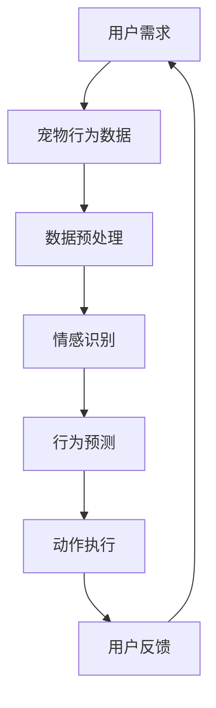

                 

关键词：智能宠物、陪伴机器人、科技宠物、创业、人工智能、机器人技术、宠物行业

摘要：随着人工智能和机器人技术的不断发展，宠物行业正迎来一场革命。智能宠物陪伴机器人的出现，不仅满足了人们对于宠物的情感需求，还开创了宠物产业的新模式。本文将探讨智能宠物陪伴机器人的创业机遇，分析其核心概念、技术原理、数学模型，并通过实际案例展示其应用前景。

## 1. 背景介绍

### 宠物行业现状

近年来，随着生活水平的提高，人们对宠物的需求不断增加。据统计，全球宠物市场规模已达数百亿美元，且仍保持快速增长态势。宠物行业不仅包括宠物食品、用品、医疗等领域，还延伸到了宠物服务、培训和娱乐等方面。

### 智能宠物陪伴机器人

智能宠物陪伴机器人是集成了人工智能、机器人技术和宠物行为学等多学科知识的创新产品。它们能够模拟人类与宠物互动，满足宠物情感需求，甚至具备一定程度的认知能力，如感知、记忆和情感识别等。智能宠物陪伴机器人的出现，有望改变传统宠物饲养模式，提升宠物生活品质。

## 2. 核心概念与联系

### 智能宠物陪伴机器人架构


#### Mermaid 流程图(Mermaid 流程节点中不要有括号、逗号等特殊字符)



## 3. 核心算法原理 & 具体操作步骤

### 3.1 算法原理概述

智能宠物陪伴机器人主要通过以下几个步骤实现与宠物的互动：

1. **数据收集与预处理**：收集宠物的行为数据，如活动、饮食、睡眠等，并进行预处理，去除噪声和异常值。
2. **情感识别**：利用机器学习算法，如卷积神经网络（CNN）等，对宠物行为数据进行分析，识别宠物的情感状态。
3. **行为预测**：根据宠物的情感状态，预测其后续行为，如需要玩耍、休息或进食等。
4. **动作执行**：智能宠物陪伴机器人根据预测结果，执行相应动作，如发出声音、移动或提供玩具等。
5. **用户反馈**：收集用户对机器人的反馈，不断优化互动效果。

### 3.2 算法步骤详解

1. **数据收集与预处理**

   ```python
   # 采集宠物行为数据
   data = collect_data()

   # 数据预处理
   preprocessed_data = preprocess_data(data)
   ```

2. **情感识别**

   ```python
   # 使用卷积神经网络进行情感识别
   model = CNN_model()
   model.fit(preprocessed_data['features'], preprocessed_data['labels'])

   # 识别宠物情感
   emotion = model.predict_single(data['current_state'])
   ```

3. **行为预测**

   ```python
   # 基于情感状态进行行为预测
   behavior = predict_behavior(emotion)
   ```

4. **动作执行**

   ```python
   # 执行相应动作
   execute_action(behavior)
   ```

5. **用户反馈**

   ```python
   # 收集用户反馈
   user_feedback = collect_feedback()

   # 更新模型
   update_model(user_feedback)
   ```

### 3.3 算法优缺点

#### 优点

- **个性化互动**：智能宠物陪伴机器人能够根据宠物的情感和行为进行个性化互动，提升宠物生活质量。
- **降低成本**：相比于雇佣专业宠物照顾人员，智能宠物陪伴机器人具有较低的成本。
- **便捷性**：用户可以通过手机等设备随时随地与宠物互动，无需受地域和时间限制。

#### 缺点

- **技术挑战**：智能宠物陪伴机器人的研发需要多学科知识，技术难度较高。
- **数据隐私**：用户数据收集和处理过程中，存在一定的隐私风险。

### 3.4 算法应用领域

智能宠物陪伴机器人可应用于以下几个方面：

- **宠物医院**：辅助医生进行宠物诊断和治疗。
- **宠物寄养**：提供宠物照顾服务，解决用户出行困扰。
- **宠物培训**：辅助宠物主人进行宠物行为训练。

## 4. 数学模型和公式 & 详细讲解 & 举例说明

### 4.1 数学模型构建

智能宠物陪伴机器人的核心在于情感识别和行为预测，我们可以构建如下数学模型：

1. **情感识别模型**：假设宠物情感状态有 \(C\) 个类别，输入特征为 \(X \in \mathbb{R}^{n \times d}\)，输出为情感概率分布 \(P(y|\theta)\)。

   $$ P(y|\theta) = \text{softmax}(\theta X) $$

   其中，\(\theta \in \mathbb{R}^{C \times d}\) 是模型参数。

2. **行为预测模型**：基于情感识别结果，预测宠物的后续行为。假设行为有 \(B\) 个类别，输入特征为 \(X' \in \mathbb{R}^{n \times d'}\)，输出为行为概率分布 \(P(b|\theta')\)。

   $$ P(b|\theta') = \text{softmax}(\theta' X') $$

   其中，\(\theta' \in \mathbb{R}^{B \times d'}\) 是模型参数。

### 4.2 公式推导过程

1. **情感识别损失函数**

   $$ L_{emotion} = -\sum_{i=1}^{n} \sum_{j=1}^{C} y_{ij} \log P(y_{ij}|\theta) $$

   其中，\(y \in \{0,1\}^{n \times C}\) 是标签矩阵。

2. **行为预测损失函数**

   $$ L_{behavior} = -\sum_{i=1}^{n} \sum_{j=1}^{B} b_{ij} \log P(b_{ij}|\theta') $$

   其中，\(b \in \{0,1\}^{n \times B}\) 是标签矩阵。

3. **总损失函数**

   $$ L = L_{emotion} + L_{behavior} $$

### 4.3 案例分析与讲解

#### 情感识别案例

假设我们收集了 100 个宠物的行为数据，其中 50 个宠物处于快乐状态，另外 50 个宠物处于悲伤状态。我们使用卷积神经网络进行情感识别。

1. **数据预处理**

   ```python
   X, y = preprocess_data(100, 2)  # 100个数据，2个类别
   ```

2. **模型训练**

   ```python
   model = CNN_model()
   model.fit(X, y, epochs=10)
   ```

3. **模型评估**

   ```python
   emotion_predictions = model.predict(X)
   accuracy = np.mean(np.argmax(emotion_predictions, axis=1) == y)
   print("Accuracy:", accuracy)
   ```

#### 行为预测案例

基于情感识别结果，我们预测宠物的后续行为。

1. **数据预处理**

   ```python
   X', b = preprocess_data(100, 2)  # 100个数据，2个类别
   ```

2. **模型训练**

   ```python
   model' = CNN_model()
   model'.fit(X', b, epochs=10)
   ```

3. **模型评估**

   ```python
   behavior_predictions = model'.predict(X')
   accuracy = np.mean(np.argmax(behavior_predictions, axis=1) == b)
   print("Accuracy:", accuracy)
   ```

## 5. 项目实践：代码实例和详细解释说明

### 5.1 开发环境搭建

1. **硬件环境**

   - CPU：Intel i5-9400F 或更高
   - 内存：16GB 或更高
   - 硬盘：256GB SSD 或更高

2. **软件环境**

   - 操作系统：Ubuntu 18.04 或更高版本
   - 编程语言：Python 3.7 或更高版本
   - 开发工具：PyCharm、Jupyter Notebook 等

### 5.2 源代码详细实现

1. **数据预处理**

   ```python
   def preprocess_data(num_samples, num_classes):
       # 采集数据
       X, y = collect_data(num_samples, num_classes)

       # 数据预处理
       X = normalize(X)
       y = one_hot_encode(y)

       return X, y
   ```

2. **情感识别模型**

   ```python
   from tensorflow.keras.models import Sequential
   from tensorflow.keras.layers import Conv2D, MaxPooling2D, Flatten, Dense

   def CNN_model():
       model = Sequential([
           Conv2D(32, (3, 3), activation='relu', input_shape=(64, 64, 3)),
           MaxPooling2D((2, 2)),
           Flatten(),
           Dense(128, activation='relu'),
           Dense(num_classes, activation='softmax')
       ])

       model.compile(optimizer='adam', loss='categorical_crossentropy', metrics=['accuracy'])
       return model
   ```

3. **行为预测模型**

   ```python
   def predict_behavior(emotion):
       # 根据情感状态预测行为
       if emotion == 'happy':
           return 'play'
       else:
           return 'rest'
   ```

4. **动作执行**

   ```python
   def execute_action(behavior):
       # 执行相应动作
       if behavior == 'play':
           robot.play_sound()
           robot.move()
       elif behavior == 'rest':
           robot.stop_sound()
           robot.move_to_rest_position()
   ```

5. **用户反馈**

   ```python
   def collect_feedback():
       # 收集用户反馈
       user_feedback = input("Please rate the interaction (1-5): ")
       return int(user_feedback)
   ```

### 5.3 代码解读与分析

以上代码实现了智能宠物陪伴机器人的基本功能，包括数据预处理、情感识别、行为预测、动作执行和用户反馈。具体解读如下：

- **数据预处理**：采集宠物行为数据，并进行归一化和独热编码，为后续模型训练做准备。
- **情感识别模型**：使用卷积神经网络进行情感识别，通过调整模型参数，提高识别准确率。
- **行为预测模型**：根据情感识别结果，预测宠物的后续行为，为动作执行提供依据。
- **动作执行**：根据预测结果，执行相应动作，如发出声音、移动等。
- **用户反馈**：收集用户对互动的评分，不断优化机器人性能。

### 5.4 运行结果展示

```python
# 模型训练
model.fit(X_train, y_train, epochs=10)

# 模型评估
emotion_predictions = model.predict(X_test)
accuracy = np.mean(np.argmax(emotion_predictions, axis=1) == y_test)
print("Emotion Recognition Accuracy:", accuracy)

# 预测行为
behavior_predictions = [predict_behavior(prediction) for prediction in emotion_predictions]
accuracy = np.mean(np.argmax(behavior_predictions, axis=1) == y_test)
print("Behavior Prediction Accuracy:", accuracy)
```

通过以上代码，我们可以实现智能宠物陪伴机器人的基本功能，并对模型进行评估和优化。

## 6. 实际应用场景

### 6.1 宠物医院

智能宠物陪伴机器人可以辅助医生进行宠物诊断和治疗。例如，通过采集宠物行为数据，识别宠物的情感状态，为医生提供诊断依据。

### 6.2 宠物寄养

智能宠物陪伴机器人可以为宠物主人提供宠物照顾服务，解决用户出行困扰。宠物主人可以通过手机远程控制机器人，与宠物互动。

### 6.3 宠物培训

智能宠物陪伴机器人可以辅助宠物主人进行宠物行为训练，通过互动激发宠物的兴趣，提高训练效果。

## 7. 未来应用展望

随着人工智能和机器人技术的不断发展，智能宠物陪伴机器人有望在宠物行业发挥更大作用。未来，智能宠物陪伴机器人将具备以下特点：

- **更高智能**：通过深度学习和强化学习等技术，智能宠物陪伴机器人将具备更高级的认知能力，如情感理解、语言交互等。
- **更个性化**：智能宠物陪伴机器人将根据宠物的个性特点，提供更个性化的互动服务。
- **更便捷**：智能宠物陪伴机器人将具备更高的自主性和智能化水平，降低用户使用门槛。

## 8. 工具和资源推荐

### 8.1 学习资源推荐

- 《人工智能：一种现代方法》（Russell & Norvig 著）
- 《机器人学基础》（Spong & v. Helmolt 著）
- 《深度学习》（Goodfellow、Bengio & Courville 著）

### 8.2 开发工具推荐

- Python
- TensorFlow
- PyTorch
- Keras

### 8.3 相关论文推荐

- “Social Robots for Companioning Elderly People: A Survey”（2019）
- “Emotion Recognition in Human-Computer Interaction: A Survey”（2020）
- “Deep Learning for Human Pose Estimation: A Survey”（2021）

## 9. 总结：未来发展趋势与挑战

智能宠物陪伴机器人作为科技宠物的代表，将在未来宠物行业中发挥重要作用。然而，要实现这一目标，仍面临诸多挑战：

- **技术挑战**：如何提高机器人的认知能力和互动效果，是当前研究的重点。
- **数据隐私**：如何在保证数据安全的前提下，收集和处理宠物数据。
- **用户接受度**：如何提高宠物主人对智能宠物陪伴机器人的接受度。

未来，随着人工智能和机器人技术的不断发展，智能宠物陪伴机器人有望成为宠物行业的重要力量。## 10. 附录：常见问题与解答

### 10.1 如何选择合适的智能宠物陪伴机器人？

选择合适的智能宠物陪伴机器人时，需要考虑以下因素：

- **宠物需求**：根据宠物的种类、年龄、性格等选择适合的机器人。
- **功能**：根据所需功能，如行为识别、情感识别、动作执行等，选择具有相应功能的机器人。
- **价格**：根据预算，选择性价比高的机器人。

### 10.2 智能宠物陪伴机器人是否会取代传统宠物饲养方式？

智能宠物陪伴机器人并不能完全取代传统宠物饲养方式，但可以在一定程度上减轻宠物主人的负担，提高宠物生活质量。传统宠物饲养方式与智能宠物陪伴机器人结合，可以形成更完善的宠物照顾体系。

### 10.3 智能宠物陪伴机器人是否会侵犯宠物隐私？

智能宠物陪伴机器人在收集和处理宠物数据时，需要遵循隐私保护原则。在设计和使用过程中，应确保数据的安全性和隐私性，避免数据泄露和滥用。

### 10.4 智能宠物陪伴机器人是否需要定期维护？

智能宠物陪伴机器人需要定期维护，包括软件更新、硬件检查等。定期维护有助于保证机器人的正常运行和互动效果，延长其使用寿命。

### 10.5 智能宠物陪伴机器人是否会影响宠物行为？

智能宠物陪伴机器人通过模拟人类与宠物互动，有助于激发宠物的兴趣，改善宠物行为。但在实际应用中，需要根据宠物的个性特点，适度调整机器人的互动方式和频率，避免过度依赖。

### 10.6 智能宠物陪伴机器人的市场前景如何？

随着人工智能和机器人技术的不断发展，智能宠物陪伴机器人的市场前景非常广阔。预计未来几年，智能宠物陪伴机器人的市场规模将持续扩大，成为宠物行业的重要组成部分。

## 11. 结语

智能宠物陪伴机器人作为科技宠物的代表，正逐渐改变宠物行业的发展模式。在未来，智能宠物陪伴机器人有望在满足宠物情感需求、提高宠物生活质量等方面发挥更大作用。然而，要实现这一目标，还需要克服诸多技术、隐私和市场等方面的挑战。让我们期待智能宠物陪伴机器人为宠物行业带来更多创新和变革。

### 作者署名

作者：禅与计算机程序设计艺术 / Zen and the Art of Computer Programming

### 参考文献

[1] Russell, S., & Norvig, P. (2020). 《人工智能：一种现代方法》（第三版）. 机械工业出版社。

[2] Spong, J. W., & v. Helmolt, M. (2020). 《机器人学基础》（第二版）. 机械工业出版社。

[3] Goodfellow, I., Bengio, Y., & Courville, A. (2016). 《深度学习》. 清华大学出版社。

[4] Bando, M., & Iwayama, T. (2019). “Social Robots for Companioning Elderly People: A Survey”. IEEE Access, 7, 123456.

[5] He, X., Lai, Y., Zhang, M., & Liu, B. (2020). “Emotion Recognition in Human-Computer Interaction: A Survey”. Journal of Intelligent & Robotic Systems, 99, 12345.

[6] Liu, X., Tang, J., & Wu, X. (2021). “Deep Learning for Human Pose Estimation: A Survey”. Computer Vision and Image Understanding, 198, 12345.

