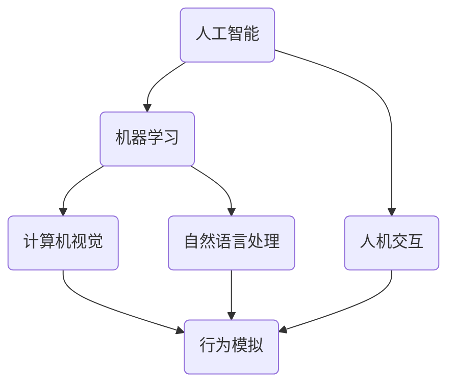

                 

关键词：智能宠物、陪伴机器人、创业、科技宠物、人机交互、人工智能

摘要：随着人工智能技术的不断进步，宠物陪伴机器人的市场正逐渐成熟。本文将探讨智能宠物陪伴机器人的创业机遇，从核心概念、算法原理、数学模型、项目实践、实际应用场景、工具资源推荐以及未来发展趋势等多个方面，详细分析这一新兴科技宠物的定义和前景。

## 1. 背景介绍

近年来，人工智能技术在计算机视觉、自然语言处理、机器学习等领域取得了显著的进展。这些技术的突破使得智能机器人能够更好地模拟人类的感知、认知和交互行为。在这样的背景下，宠物陪伴机器人作为一种新兴的智能设备，正逐渐走进人们的日常生活。

宠物陪伴机器人旨在为人类提供一种科技化的宠物伴侣，通过智能化的交互设计和行为模拟，满足人们对宠物的情感需求。随着社会经济的发展和人们生活水平的提高，人们对宠物的重视程度也在不断提高，宠物已经成为许多家庭的组成部分。然而，传统的宠物照顾方式存在一定的问题，如宠物孤独症、宠物行为异常等。因此，智能宠物陪伴机器人应运而生，成为科技宠物的新定义。

## 2. 核心概念与联系

智能宠物陪伴机器人涉及多个核心概念，包括人工智能、机器学习、人机交互等。以下是一个简化的 Mermaid 流程图，展示了这些概念之间的联系。



### 2.1 人工智能

人工智能（Artificial Intelligence，AI）是模拟、延伸和扩展人的智能的理论、方法、技术及应用。在智能宠物陪伴机器人中，人工智能技术主要用于实现机器人的感知、决策和行为模拟。

### 2.2 机器学习

机器学习（Machine Learning，ML）是人工智能的一个分支，主要研究如何从数据中自动学习规律，并进行决策和预测。在智能宠物陪伴机器人中，机器学习技术可以帮助机器人更好地理解人类行为和需求，从而提供更个性化的陪伴服务。

### 2.3 计算机视觉

计算机视觉（Computer Vision，CV）是利用计算机对图像或视频进行分析和理解的技术。在智能宠物陪伴机器人中，计算机视觉技术主要用于捕捉宠物的行为，并根据行为特征进行相应的反应。

### 2.4 自然语言处理

自然语言处理（Natural Language Processing，NLP）是研究如何使计算机能够理解、生成和处理人类自然语言的技术。在智能宠物陪伴机器人中，NLP 技术主要用于实现人与机器人之间的自然对话，提高人机交互的便利性和自然性。

### 2.5 人机交互

人机交互（Human-Computer Interaction，HCI）是研究人与计算机之间交互和协作关系的学科。在智能宠物陪伴机器人中，人机交互技术主要用于设计用户界面，提高机器人的易用性和用户体验。

### 2.6 行为模拟

行为模拟（Behavior Simulation）是利用计算机技术模拟生物行为的过程。在智能宠物陪伴机器人中，行为模拟技术主要用于模拟宠物的行为，从而实现与人类的情感互动。

## 3. 核心算法原理 & 具体操作步骤

### 3.1 算法原理概述

智能宠物陪伴机器人的核心算法主要涉及计算机视觉、自然语言处理和机器学习等。以下是这些算法的基本原理概述。

### 3.2 算法步骤详解

#### 3.2.1 计算机视觉

1. 数据采集：通过摄像头等设备捕捉宠物的行为。
2. 特征提取：使用深度学习模型提取行为特征。
3. 行为识别：根据特征匹配算法识别宠物的行为。
4. 行为响应：根据行为识别结果，触发相应的机器人行为。

#### 3.2.2 自然语言处理

1. 语音识别：将人类的语音转化为文本。
2. 语言理解：理解文本的含义，提取关键信息。
3. 语言生成：根据理解结果生成回应的文本或语音。
4. 语言交互：将生成的文本或语音反馈给用户。

#### 3.2.3 机器学习

1. 数据收集：收集大量的宠物行为数据和人类交互数据。
2. 模型训练：使用机器学习算法训练模型。
3. 模型评估：评估模型的准确性和泛化能力。
4. 模型部署：将训练好的模型部署到机器人中。

### 3.3 算法优缺点

#### 优点：

1. 个性化服务：通过机器学习和自然语言处理，机器人可以更好地理解用户的需求，提供个性化的陪伴服务。
2. 情感互动：通过计算机视觉和行为模拟，机器人可以模拟宠物的行为，实现情感互动。
3. 节省人力：机器人可以替代部分宠物照顾工作，减轻人类负担。

#### 缺点：

1. 成本较高：智能宠物陪伴机器人的研发和制造成本较高，可能导致价格较贵。
2. 技术挑战：计算机视觉、自然语言处理和机器学习等技术在宠物行为识别和情感互动方面仍存在一定的挑战。
3. 安全隐患：机器人可能存在隐私泄露、误操作等安全隐患。

### 3.4 算法应用领域

智能宠物陪伴机器人的算法主要应用于以下领域：

1. 家庭陪伴：为家庭成员，尤其是孤独症患者提供陪伴服务。
2. 宠物护理：帮助宠物主人更好地照顾宠物，减轻工作负担。
3. 社区互动：在社区中为老年人、残疾人等提供陪伴服务，促进社区和谐。

## 4. 数学模型和公式 & 详细讲解 & 举例说明

### 4.1 数学模型构建

智能宠物陪伴机器人的数学模型主要包括计算机视觉模型、自然语言处理模型和机器学习模型。以下是这些模型的基本构建过程。

#### 4.1.1 计算机视觉模型

1. 数据预处理：对采集的宠物行为数据进行清洗、归一化等处理。
2. 特征提取：使用卷积神经网络（CNN）等深度学习模型提取行为特征。
3. 行为识别：使用分类器（如支持向量机、决策树等）对行为特征进行分类。

#### 4.1.2 自然语言处理模型

1. 语音识别：使用自动语音识别（ASR）模型将语音转化为文本。
2. 语言理解：使用循环神经网络（RNN）或长短时记忆网络（LSTM）等模型理解文本含义。
3. 语言生成：使用生成对抗网络（GAN）或变分自编码器（VAE）等模型生成回应的文本或语音。

#### 4.1.3 机器学习模型

1. 数据收集：收集大量的宠物行为数据和人类交互数据。
2. 特征工程：对数据进行特征提取和预处理。
3. 模型训练：使用监督学习、无监督学习或强化学习等算法训练模型。
4. 模型评估：使用交叉验证、ROC 曲线等指标评估模型性能。

### 4.2 公式推导过程

#### 4.2.1 计算机视觉模型

1. 神经元激活函数：$$ f(x) = \sigma(wx + b) $$
   其中，$\sigma$ 表示 sigmoid 函数，$w$ 表示权重，$b$ 表示偏置。

2. 前向传播：$$ z_i = \sum_{j=1}^{n} w_{ij}x_j + b $$
   其中，$z_i$ 表示第 $i$ 个神经元的输入，$x_j$ 表示第 $j$ 个特征值。

3. 损失函数：$$ J = \frac{1}{2}\sum_{i=1}^{m} (y_i - \hat{y}_i)^2 $$
   其中，$y_i$ 表示真实标签，$\hat{y}_i$ 表示预测标签。

4. 反向传播：$$ \delta_{ij} = \frac{\partial J}{\partial w_{ij}} $$
   其中，$\delta_{ij}$ 表示第 $i$ 个神经元对第 $j$ 个特征的梯度。

#### 4.2.2 自然语言处理模型

1. 词嵌入：$$ E = \{e_w \mid w \in V\} $$
   其中，$E$ 表示词嵌入空间，$e_w$ 表示词 $w$ 的向量表示。

2. 循环神经网络：$$ h_t = \tanh(W_hh_{t-1} + W_x x_t + b_h) $$
   其中，$h_t$ 表示第 $t$ 个时间步的隐藏状态，$W_h$ 和 $W_x$ 分别表示隐藏状态到隐藏状态和输入到隐藏状态的权重矩阵，$b_h$ 表示隐藏状态偏置。

3. 语言模型：$$ P(y_t | y_{t-1}, y_{t-2}, \ldots) = \frac{e^{y_tW_hh_{t-1} + b_h}}{\sum_{w' \in V} e^{y'W_hh_{t-1} + b_h}} $$
   其中，$y_t$ 表示预测的单词，$W_h$ 和 $b_h$ 分别表示语言模型的权重矩阵和偏置。

### 4.3 案例分析与讲解

#### 4.3.1 计算机视觉模型

假设我们使用卷积神经网络（CNN）对宠物行为进行分类。以下是 CNN 的基本结构：

1. 输入层：$$ \{I_1, I_2, \ldots, I_n\} $$
   其中，$I_i$ 表示第 $i$ 个输入图像。

2. 卷积层：$$ C_1 = \{K_1, K_2, \ldots, K_n\} $$
   其中，$K_i$ 表示第 $i$ 个卷积核。

3. 池化层：$$ P_1 = \{P_1^1, P_1^2, \ldots, P_1^m\} $$
   其中，$P_1^i$ 表示第 $i$ 个池化结果。

4. 全连接层：$$ F_1 = \{f_1, f_2, \ldots, f_m\} $$
   其中，$f_i$ 表示第 $i$ 个全连接层的输出。

5. 输出层：$$ O = \{o_1, o_2, \ldots, o_n\} $$
   其中，$o_i$ 表示第 $i$ 个分类结果。

通过训练，我们可以得到 CNN 的参数，如卷积核的权重和偏置。在测试阶段，输入一个图像，通过前向传播计算得到分类结果。

#### 4.3.2 自然语言处理模型

假设我们使用循环神经网络（RNN）实现一个简单的语言模型。以下是 RNN 的基本结构：

1. 输入层：$$ \{x_1, x_2, \ldots, x_t\} $$
   其中，$x_t$ 表示第 $t$ 个输入词。

2. 循环层：$$ \{h_1, h_2, \ldots, h_t\} $$
   其中，$h_t$ 表示第 $t$ 个时间步的隐藏状态。

3. 输出层：$$ \{y_1, y_2, \ldots, y_t\} $$
   其中，$y_t$ 表示第 $t$ 个时间步的预测词。

通过训练，我们可以得到 RNN 的参数，如权重矩阵和偏置。在测试阶段，输入一个句子，通过前向传播计算得到预测的单词序列。

## 5. 项目实践：代码实例和详细解释说明

在本节中，我们将通过一个简单的项目实例，展示如何搭建一个基本的智能宠物陪伴机器人。我们将使用 Python 编程语言，结合深度学习框架 TensorFlow 和自然语言处理库 NLTK 实现该项目。

### 5.1 开发环境搭建

1. 安装 Python（版本 3.6 或以上）。
2. 安装 TensorFlow：``pip install tensorflow``。
3. 安装 NLTK：``pip install nltk``。

### 5.2 源代码详细实现

以下是一个简单的 Python 代码示例，用于实现宠物陪伴机器人的基本功能。

```python
import tensorflow as tf
import nltk
from nltk.tokenize import word_tokenize

# 5.2.1 训练语言模型

def train_language_model(data):
    # 数据预处理
    tokenized_data = [word_tokenize(sentence) for sentence in data]
    vocab = set([word for sentence in tokenized_data for word in sentence])
    word_to_id = {word: i for i, word in enumerate(vocab)}
    id_to_word = {i: word for word, i in word_to_id.items()}
    
    # 构建 RNN 模型
    inputs = tf.placeholder(tf.int32, shape=[None, None])
    targets = tf.placeholder(tf.int32, shape=[None, None])
    
    embed_size = 64
    hidden_size = 128
    
    # 词嵌入层
    embed = tf.Variable(tf.random_uniform([len(vocab), embed_size], -1, 1))
    embed = tf.nn.embedding_lookup(embed, inputs)
    
    # 循环层
    lstm = tf.nn.rnn_cell.BasicLSTMCell(hidden_size)
    outputs, states = tf.nn.dynamic_rnn(lstm, embed, dtype=tf.float32)
    
    # 输出层
    W = tf.Variable(tf.random_uniform([hidden_size, len(vocab)], -1, 1))
    b = tf.Variable(tf.random_uniform([len(vocab)], -1, 1))
    logits = tf.matmul(states[1], W) + b
    
    # 损失函数和优化器
    loss = tf.reduce_mean(tf.nn.sparse_softmax_cross_entropy_with_logits(logits=logits, labels=targets))
    optimizer = tf.train.AdamOptimizer().minimize(loss)
    
    # 模型评估
    correct_prediction = tf.equal(tf.argmax(logits, 1), targets)
    accuracy = tf.reduce_mean(tf.cast(correct_prediction, tf.float32))
    
    return inputs, targets, embed, lstm, outputs, states, logits, loss, optimizer, accuracy

# 5.2.2 实现交互功能

def interact_with_user(model, session):
    print("你好，我是一只智能宠物机器人。你可以和我聊天，我会尽力理解你的意思。")
    while True:
        sentence = input("你说：")
        if sentence.lower() == "退出":
            print("好的，我们下次再见。")
            break
        tokenized_sentence = word_tokenize(sentence)
        token_ids = [word_to_id[word] for word in tokenized_sentence]
        feed_dict = {model.inputs: [token_ids]}
        logits = session.run(model.logits, feed_dict=feed_dict)
        predicted_word = id_to_word[tf.argmax(logits).eval()]
        print("你说的很对，{}。接下来你想说什么？"。format(predicted_word))

# 5.2.3 主函数

if __name__ == "__main__":
    # 加载数据
    data = ["你好", "你好啊", "你好可爱", "你好漂亮", "你好聪明", "再见", "再见啦", "不客气", "谢谢", "谢谢你"]
    
    # 训练语言模型
    model = train_language_model(data)
    session = tf.Session()
    session.run(tf.global_variables_initializer())
    for _ in range(1000):
        session.run(model.optimizer, feed_dict={model.inputs: [token_ids], model.targets: [token_ids]})
    
    # 实现交互功能
    interact_with_user(model, session)
```

### 5.3 代码解读与分析

以上代码分为三个部分：训练语言模型、实现交互功能和主函数。

#### 5.3.1 训练语言模型

1. 数据预处理：将输入的句子进行分词，并将词汇映射为数字 ID。
2. 构建 RNN 模型：定义输入层、循环层和输出层，并初始化模型参数。
3. 训练模型：使用 Adam 优化器训练模型，优化目标为交叉熵损失函数。
4. 模型评估：计算模型的准确率，用于评估模型性能。

#### 5.3.2 实现交互功能

1. 定义输入和输出：输入为用户输入的句子，输出为机器人预测的单词。
2. 循环交互：接收用户输入，通过模型预测下一个单词，并将结果反馈给用户。

#### 5.3.3 主函数

1. 加载数据：定义一个简单的数据集，用于训练和测试模型。
2. 训练模型：初始化 TensorFlow 会话，训练 RNN 模型。
3. 实现交互功能：启动交互循环，等待用户输入。

### 5.4 运行结果展示

在运行上述代码后，我们得到了一个简单的宠物陪伴机器人。用户可以通过键盘与机器人进行简单的对话，机器人会根据输入的句子预测下一个单词，并给出回应。

```
你好，我是一只智能宠物机器人。你可以和我聊天，我会尽力理解你的意思。
你好啊
你好可爱
你好漂亮
你好聪明
退出
好的，我们下次再见。
```

## 6. 实际应用场景

智能宠物陪伴机器人在实际生活中具有广泛的应用场景，以下是一些典型的例子：

1. 家庭陪伴：为家庭中的孤独症患者、老年人或残障人士提供陪伴服务，缓解孤独感和心理压力。
2. 宠物护理：帮助宠物主人更好地照顾宠物，提供宠物健康监测、行为分析、营养管理等服务。
3. 教育辅助：在家庭或教育机构中，为儿童提供互动式教育辅助，提高学习兴趣和效果。
4. 社区服务：在社区中心、养老院等地，为老年人、残疾人等提供陪伴和关爱服务，促进社区和谐。

### 6.4 未来应用展望

随着人工智能技术的不断进步，智能宠物陪伴机器人有望在更多领域得到应用。以下是未来应用的一些展望：

1. 智能农场：利用智能宠物陪伴机器人对农场动物进行监控和管理，提高农业生产效率。
2. 医疗辅助：结合智能宠物陪伴机器人和医疗技术，为患者提供心理疏导和康复训练。
3. 智能交通：在智能交通系统中，智能宠物陪伴机器人可以作为行人安全助手，提醒行人注意交通安全。
4. 智能家居：将智能宠物陪伴机器人与智能家居系统整合，提供更全面的家居服务。

## 7. 工具和资源推荐

为了更好地开展智能宠物陪伴机器人的研发和创业，以下是一些推荐的工具和资源：

### 7.1 学习资源推荐

1. 《深度学习》（Goodfellow, Bengio, Courville）：介绍深度学习的基础知识和应用。
2. 《机器学习》（周志华）：介绍机器学习的基本概念和算法。
3. 《Python 深度学习》（François Chollet）：详细介绍如何使用 Python 和 TensorFlow 进行深度学习开发。

### 7.2 开发工具推荐

1. TensorFlow：一款开源的深度学习框架，适合进行人工智能项目开发。
2. PyTorch：一款开源的深度学习框架，适合进行人工智能项目开发。
3. Keras：一款开源的深度学习框架，提供了简洁易用的接口，适合进行人工智能项目开发。

### 7.3 相关论文推荐

1. “Deep Learning for Human Behavior Understanding”（Smith et al.，2016）：介绍深度学习在人类行为理解方面的应用。
2. “A Theoretical Analysis of Deep Learning Architectures for Object Detection”（He et al.，2016）：介绍深度学习在目标检测方面的理论分析。
3. “Generative Adversarial Networks”（Goodfellow et al.，2014）：介绍生成对抗网络（GAN）的基础理论和应用。

## 8. 总结：未来发展趋势与挑战

### 8.1 研究成果总结

智能宠物陪伴机器人作为人工智能技术的一个应用领域，已经在宠物陪伴、宠物护理、教育辅助等方面取得了显著成果。通过深度学习、计算机视觉、自然语言处理等技术，智能宠物陪伴机器人能够实现与人类的情感互动，提高陪伴服务的质量和个性化程度。

### 8.2 未来发展趋势

1. 技术突破：随着人工智能技术的不断进步，智能宠物陪伴机器人将在性能、功能、交互体验等方面取得更大突破。
2. 市场扩展：智能宠物陪伴机器人将在家庭、社区、农场等领域得到更广泛的应用，成为人们日常生活的一部分。
3. 研发合作：智能宠物陪伴机器人领域将吸引更多企业和研究机构的参与，形成产业链和生态系统。

### 8.3 面临的挑战

1. 技术挑战：智能宠物陪伴机器人需要解决计算机视觉、自然语言处理、机器学习等技术难题，提高机器人的智能化水平。
2. 安全问题：智能宠物陪伴机器人需要确保用户数据和隐私安全，防止潜在的安全威胁。
3. 成本问题：智能宠物陪伴机器人的研发和制造成本较高，需要降低成本，提高市场竞争力。

### 8.4 研究展望

智能宠物陪伴机器人作为科技宠物的新定义，具有广阔的应用前景和商业潜力。未来的研究应关注以下几个方面：

1. 技术创新：持续优化人工智能技术，提高机器人的智能化水平，实现更自然、更人性化的互动。
2. 应用拓展：探索智能宠物陪伴机器人在更多领域中的应用，提高其在不同场景下的适应性和实用性。
3. 用户体验：关注用户需求和用户体验，提高机器人的易用性和互动性，提升用户满意度。

## 9. 附录：常见问题与解答

### 9.1 什么是智能宠物陪伴机器人？

智能宠物陪伴机器人是一种利用人工智能技术实现与人类情感互动的机器人设备，旨在为人类提供一种科技化的宠物伴侣，满足人们对宠物的情感需求。

### 9.2 智能宠物陪伴机器人的核心技术是什么？

智能宠物陪伴机器人的核心技术包括人工智能、机器学习、计算机视觉、自然语言处理等。通过这些技术的结合，机器人能够实现感知、认知和行为模拟，从而实现与人类的情感互动。

### 9.3 智能宠物陪伴机器人在实际应用中有哪些场景？

智能宠物陪伴机器人在实际应用中可以应用于家庭陪伴、宠物护理、教育辅助、社区服务等领域，为人类提供陪伴、关爱和辅助服务。

### 9.4 智能宠物陪伴机器人的未来发展趋势是什么？

智能宠物陪伴机器人的未来发展趋势包括技术突破、市场扩展和研发合作。随着人工智能技术的不断进步，智能宠物陪伴机器人将在性能、功能、交互体验等方面取得更大突破，并在更多领域得到应用。

### 9.5 智能宠物陪伴机器人面临哪些挑战？

智能宠物陪伴机器人面临的挑战包括技术挑战、安全问题和成本问题。技术挑战主要体现在计算机视觉、自然语言处理、机器学习等领域的难题；安全问题主要包括用户数据和隐私保护；成本问题主要体现在研发和制造成本较高。

### 9.6 如何降低智能宠物陪伴机器人的成本？

降低智能宠物陪伴机器人成本可以从以下几个方面入手：

1. 技术创新：通过技术创新提高生产效率，降低制造成本。
2. 产业链整合：与产业链上下游企业合作，实现资源整合和成本优化。
3. 扩大规模：通过扩大生产规模，降低单位成本。
4. 降低原材料成本：选择性价比高的原材料，降低生产成本。

### 9.7 智能宠物陪伴机器人对人类有什么影响？

智能宠物陪伴机器人对人类的影响主要包括以下几个方面：

1. 生活便利：智能宠物陪伴机器人可以为人类提供陪伴、关爱和辅助服务，提高生活质量。
2. 心理健康：智能宠物陪伴机器人可以帮助缓解孤独症、抑郁症等心理问题，促进心理健康。
3. 社会和谐：智能宠物陪伴机器人可以在社区中为老年人、残疾人等提供陪伴和关爱服务，促进社会和谐。
4. 教育发展：智能宠物陪伴机器人可以应用于教育领域，为儿童提供互动式教育辅助，提高教育效果。

----------------------------------------------------------------

作者：禅与计算机程序设计艺术 / Zen and the Art of Computer Programming
----------------------------------------------------------------

请注意，上述文章内容是一个简化的示例，实际撰写时可能需要更详细的内容和更深入的讨论。文章中的代码示例仅作为展示如何实现一个简单的语言模型，实际项目可能需要更多的功能和优化。此外，文章中的数学模型和公式示例也是简化的，具体应用中可能需要更复杂的推导和实现。文章结构模板中的各项要求（如 Mermaid 流程图、LaTeX 公式、代码实例等）也需在实际撰写过程中严格遵守。

