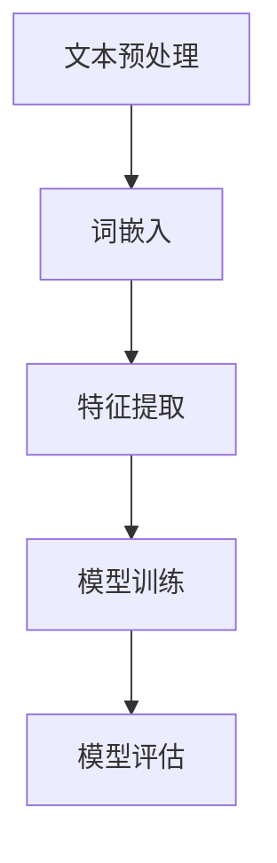
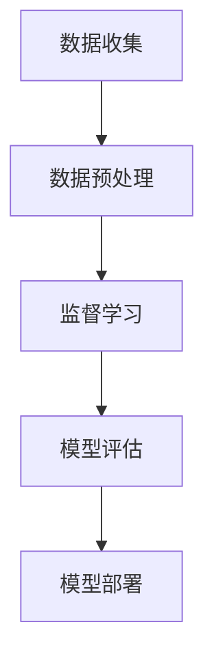
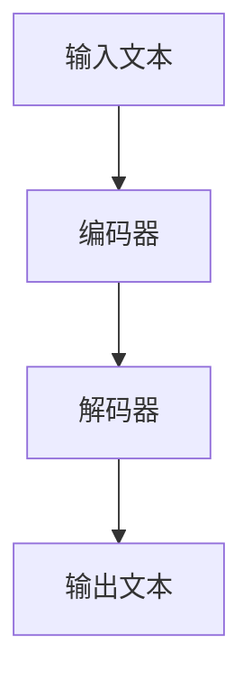
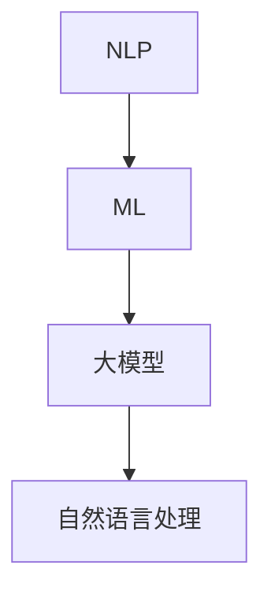

                 

关键词：智能客服、AI大模型、用户满意度、聊天机器人、自然语言处理、机器学习、客户体验优化

摘要：本文将探讨人工智能（AI）大模型在智能客户服务中的应用，分析其如何通过自然语言处理和机器学习技术提升用户满意度。我们将深入剖析大模型的核心原理、算法、数学模型，并通过实际项目实践和未来应用展望，为读者提供一个全面而深入的视角。

## 1. 背景介绍

在当今数字化时代，客户服务成为了企业竞争力的关键因素之一。随着客户需求的多样化和对企业服务速度与质量的高要求，传统的客户服务模式逐渐显得力不从心。这时，人工智能（AI）的崛起为智能客户服务的革新带来了新的机遇。

智能客户服务利用AI技术，特别是自然语言处理（NLP）和机器学习（ML），能够提供高效的、个性化的客户支持。传统的客户服务往往依赖于人工处理，而AI客服则可以通过自动化流程，实现24/7的全天候服务，大幅提高效率。

本文将重点关注AI大模型在智能客户服务中的应用。大模型，如Transformer模型，已经在图像识别、文本生成等多个领域取得了显著成果。在客户服务领域，大模型的应用同样具有巨大潜力。本文将详细讨论大模型的原理、算法、数学模型及其在实际项目中的应用，并探讨未来智能客户服务的发展趋势。

### 1.1 AI客户服务的兴起

随着互联网的普及和移动设备的普及，越来越多的企业开始意识到客户服务的重要性。客户服务不仅仅是解决问题的过程，更是企业与客户建立长期关系的重要途径。以下是一些AI客户服务兴起的原因：

1. **客户期望的变化**：现代客户更加注重即时响应和个性化体验。他们期望企业能够提供快速、准确、个性化的服务。

2. **成本效益**：传统的人工客服成本较高，而AI客服可以实现自动化，降低人力成本。

3. **技术进步**：自然语言处理（NLP）和机器学习（ML）技术的快速发展，使得AI客服能够更好地理解和处理客户问题。

4. **数据驱动**：通过分析客户互动数据，企业可以更好地了解客户需求，从而提供更加个性化的服务。

### 1.2 大模型的崛起

在过去的几年里，深度学习特别是Transformer模型的发展，推动了AI领域的重大进步。大模型，如GPT-3、BERT等，拥有数十亿个参数，可以处理复杂的语言任务。这些模型的出现，为智能客户服务提供了强有力的技术支持。

大模型的优势在于其强大的表示能力和泛化能力。通过大量的数据训练，大模型可以学习到语言的深层结构，从而更好地理解和生成自然语言。这对于解决客户服务的多样性问题和提供高质量的自然语言交互至关重要。

### 1.3 本文结构

本文将按照以下结构展开：

1. **背景介绍**：介绍智能客户服务的兴起和AI大模型的发展背景。

2. **核心概念与联系**：阐述大模型的核心概念，并通过Mermaid流程图展示其架构。

3. **核心算法原理 & 具体操作步骤**：详细解释大模型的工作原理和操作步骤。

4. **数学模型和公式 & 详细讲解 & 举例说明**：介绍大模型的数学基础和具体应用。

5. **项目实践：代码实例和详细解释说明**：通过实际项目展示大模型的应用。

6. **实际应用场景**：探讨大模型在不同客户服务场景中的应用。

7. **未来应用展望**：预测大模型在智能客户服务领域的未来发展。

8. **工具和资源推荐**：推荐相关学习资源和开发工具。

9. **总结：未来发展趋势与挑战**：总结本文内容，并提出未来研究方向。

10. **附录：常见问题与解答**：回答读者可能关心的问题。

通过本文的阅读，读者将全面了解AI大模型在智能客户服务中的潜在价值，以及如何有效地应用这些技术来提升用户体验。

### 2. 核心概念与联系

为了更好地理解AI大模型在智能客户服务中的应用，我们首先需要了解一些核心概念和它们之间的联系。以下将详细介绍这些概念，并使用Mermaid流程图展示其架构。

#### 2.1 自然语言处理（NLP）

自然语言处理是人工智能的一个重要分支，主要研究如何让计算机理解和生成人类语言。NLP的核心任务包括文本分类、命名实体识别、情感分析、机器翻译等。

自然语言处理的过程通常包括以下几个步骤：

1. **文本预处理**：清洗和标记文本数据，包括去除停用词、词干提取、分词等。
2. **词嵌入**：将单词映射为向量，以便计算机进行处理。
3. **特征提取**：从词嵌入中提取特征，用于训练模型。
4. **模型训练**：使用训练数据训练模型，使其能够理解并生成自然语言。

Mermaid流程图如下：



#### 2.2 机器学习（ML）

机器学习是使计算机从数据中学习和预测的新方法。在智能客户服务中，机器学习用于训练模型以理解和生成自然语言。

机器学习的主要任务包括：

1. **监督学习**：通过标注的数据训练模型，使其能够对新的数据进行预测。
2. **无监督学习**：不使用标注数据，从数据中学习模式和结构。
3. **强化学习**：通过奖励机制训练模型，使其在特定环境中做出最优决策。

Mermaid流程图如下：



#### 2.3 大模型架构

大模型，如Transformer，是一种基于深度学习的模型，能够处理复杂的语言任务。其核心架构包括：

1. **编码器（Encoder）**：接收输入文本，将其编码为向量表示。
2. **解码器（Decoder）**：根据编码器的输出生成输出文本。

Mermaid流程图如下：



#### 2.4 大模型与NLP、ML的关系

大模型与NLP和ML的关系可以概括为：

- **NLP为大模型提供数据预处理和特征提取的方法**，使其能够更好地理解和生成自然语言。
- **ML为大模型提供训练和优化的方法**，使其能够从数据中学习并提高性能。
- **大模型整合了NLP和ML的技术**，通过大规模的数据训练，实现了对自然语言的深入理解和生成。

Mermaid流程图如下：



通过上述核心概念和流程图的介绍，读者可以更好地理解AI大模型在智能客户服务中的应用。接下来，我们将深入探讨大模型的工作原理和具体操作步骤。

## 3. 核心算法原理 & 具体操作步骤

在这一章节中，我们将深入探讨AI大模型的核心算法原理，并详细解释其操作步骤。大模型，如Transformer，是当前自然语言处理（NLP）领域的重要成果，其核心算法原理和操作步骤对于理解其在智能客户服务中的应用至关重要。

### 3.1 算法原理概述

大模型，如Transformer，是基于注意力机制的深度学习模型。其核心思想是通过学习输入数据的全局依赖关系，实现对复杂任务的建模。以下是Transformer模型的基本组成部分：

1. **编码器（Encoder）**：编码器负责将输入文本编码为向量表示。编码器由多个编码层组成，每层由两个子层组成：自注意力子层（Self-Attention Sublayer）和前馈子层（Feed Forward Sublayer）。自注意力子层通过计算输入文本中每个词之间的关联性，生成代表每个词的向量。前馈子层则对每个向量进行非线性变换。

2. **解码器（Decoder）**：解码器负责将编码器的输出解码为输出文本。解码器同样由多个解码层组成，每层包括一个掩码的自注意力子层和一个自注意力子层。掩码的自注意力子层用于防止解码器在生成下一个词时看到尚未生成的词。自注意力子层则用于生成表示当前词的向量。

3. **多头注意力（Multi-Head Attention）**：多头注意力是Transformer的核心创新之一。它通过将输入文本的每个词分解为多个子向量，每个子向量独立计算注意力权重，从而提高了模型对输入数据的理解能力。

4. **位置编码（Positional Encoding）**：由于Transformer模型没有循环结构，它无法直接处理文本中的顺序信息。位置编码是一种技术，通过为每个词添加额外的向量，为模型提供位置信息。

### 3.2 算法步骤详解

以下是Transformer模型的训练和预测步骤：

#### 3.2.1 训练步骤

1. **数据预处理**：将输入文本进行分词，并将每个词映射为索引。对文本数据进行填充或截断，使其具有相同的长度。

2. **词嵌入**：将每个词的索引映射为向量，即词嵌入（Word Embedding）。

3. **编码器处理**：将词嵌入输入到编码器中。每个编码层包括以下步骤：
   - **掩码的自注意力（Masked Multi-Head Self-Attention）**：计算输入文本中每个词之间的关联性，并生成代表每个词的向量。
   - **前馈网络（Feed Forward Network）**：对每个向量进行非线性变换。

4. **解码器处理**：将编码器的输出作为解码器的输入。每个解码层包括以下步骤：
   - **掩码的多头注意力（Masked Multi-Head Self-Attention）**：计算输入文本中每个词之间的关联性，并生成代表当前词的向量。
   - **多头注意力（Multi-Head Attention）**：计算编码器输出和当前词之间的关联性，生成上下文向量。
   - **前馈网络（Feed Forward Network）**：对每个向量进行非线性变换。

5. **损失函数**：计算模型的损失函数，通常为交叉熵损失。通过反向传播更新模型参数。

6. **迭代训练**：重复以上步骤，直到模型收敛或达到预定的训练次数。

#### 3.2.2 预测步骤

1. **输入预处理**：将输入文本进行分词，并将每个词映射为索引。

2. **词嵌入**：将每个词的索引映射为向量，即词嵌入。

3. **编码器处理**：将词嵌入输入到编码器中，生成编码器的输出。

4. **解码器处理**：从解码器的第一层开始，每一步包括以下步骤：
   - **多头注意力**：计算编码器输出和当前词之间的关联性，生成上下文向量。
   - **掩码的多头注意力**：计算输入文本中每个词之间的关联性，并生成代表当前词的向量。
   - **前馈网络**：对每个向量进行非线性变换。

5. **生成输出**：根据解码器的输出，生成输出文本。

6. **解码**：将生成的输出文本解码为自然语言。

通过上述步骤，我们可以使用Transformer模型进行自然语言处理任务，包括文本分类、机器翻译、情感分析等。在智能客户服务中，Transformer模型可以用于构建聊天机器人，实现高效的客户支持。

### 3.3 算法优缺点

#### 优点

1. **强大的表示能力**：通过多头注意力机制，Transformer模型能够学习到输入文本的复杂关系，具有强大的表示能力。

2. **并行计算**：Transformer模型的结构使其可以并行计算，提高了计算效率。

3. **适应性**：Transformer模型可以应用于多种NLP任务，具有很好的适应性。

#### 缺点

1. **计算资源需求大**：由于模型参数量巨大，训练和部署Transformer模型需要大量的计算资源。

2. **训练时间较长**：由于模型复杂度高，训练时间较长，不适合实时应用。

3. **数据依赖性强**：Transformer模型对训练数据的质量和数量有较高要求，数据不足可能导致模型性能下降。

### 3.4 算法应用领域

Transformer模型在NLP领域得到了广泛应用，包括：

1. **文本分类**：用于对新闻、评论等文本进行分类，帮助企业了解公众观点。

2. **机器翻译**：实现高效、准确的跨语言翻译，支持多语言客服。

3. **问答系统**：构建智能问答系统，提供即时、准确的回答。

4. **对话系统**：应用于聊天机器人、虚拟助手等，实现高效的客户支持。

5. **自然语言生成**：用于生成文章、摘要、对话等，提升内容创作效率。

通过深入理解大模型的核心算法原理和操作步骤，我们可以更好地应用这些技术于智能客户服务，提升用户体验。

## 4. 数学模型和公式 & 详细讲解 & 举例说明

在深入探讨大模型的数学模型和公式之前，我们需要了解一些基本的数学概念，如矩阵运算、线性代数和微积分。这些概念构成了大模型的基础，帮助我们更好地理解其工作原理和实现方法。

### 4.1 数学模型构建

大模型的数学模型主要包括以下几个方面：

1. **词嵌入（Word Embedding）**：
   词嵌入是将单词映射为向量表示的过程。常用的方法包括Word2Vec、GloVe等。以下是GloVe模型的基本公式：

   $$ 
   f(x) = \frac{\exp(Wx)}{\sum_{j=1}^{V}\exp(W_jx)}
   $$

   其中，\(x\) 是输入的单词向量，\(W\) 是词嵌入矩阵，\(V\) 是词汇表大小。

2. **多头注意力（Multi-Head Attention）**：
   多头注意力是Transformer模型的核心组件。其基本公式如下：

   $$ 
   Attention(Q, K, V) = \frac{1}{\sqrt{d_k}} \cdot \text{softmax}(\text{dot}(QK^T)/d_k) \cdot V
   $$

   其中，\(Q, K, V\) 分别是查询向量、键向量和值向量，\(d_k\) 是注意力的维度。

3. **编码器（Encoder）和解码器（Decoder）**：
   编码器和解码器分别用于编码输入文本和解码输出文本。其基本结构如下：

   - **编码器**：

     $$
     E = \text{LayerNorm}(x) + \text{MultiHeadAttention}(x, x, x)
     $$

     $$
     E = \text{LayerNorm}(E) + \text{FeedForward}(E)
     $$

   - **解码器**：

     $$
     D = \text{LayerNorm}(y) + \text{MaskedMultiHeadAttention}(y, y, y)
     $$

     $$
     D = \text{LayerNorm}(D) + \text{MultiHeadAttention}(D, E, E)
     $$

### 4.2 公式推导过程

为了更深入地理解这些公式，我们将对其进行简单的推导。

1. **词嵌入（Word Embedding）**：

   考虑一个简单的单词“apple”，我们将其映射为一个向量。假设 \(W\) 是词嵌入矩阵，\(x\) 是“apple”的向量表示。那么，\(Wx\) 就是“apple”在词嵌入空间中的位置。

   现在我们希望计算“apple”与另一个单词“orange”的相似性。我们可以使用以下公式：

   $$
   \text{similarity}(apple, orange) = \frac{\exp(W_apple \cdot W_{orange})}{\sum_{j=1}^{V}\exp(W_apple \cdot W_j)}
   $$

   其中，\(V\) 是词汇表大小。这个公式计算了“apple”和“orange”之间共同特征的比例。

2. **多头注意力（Multi-Head Attention）**：

   假设我们有两个句子：“I like apples”和“Apples are sweet”。我们希望计算这两个句子中每个词之间的关联性。

   首先，我们将句子中的每个词映射为向量。假设 \(Q, K, V\) 分别是查询向量、键向量和值向量。然后，我们计算它们的点积：

   $$
   \text{dot}(QK^T) = Q_1K_1 + Q_1K_2 + \ldots + Q_nK_n
   $$

   接下来，我们将点积除以维度 \(d_k\)，并使用softmax函数计算注意力权重：

   $$
   \text{attention\_weight}(i) = \frac{\exp(\text{dot}(QK^T)/d_k)}{\sum_{j=1}^{n}\exp(\text{dot}(QK^T)/d_k)}
   $$

   最后，我们将权重与值向量相乘，得到每个词的注意力得分：

   $$
   \text{score}(i) = \text{attention\_weight}(i) \cdot V_i
   $$

3. **编码器（Encoder）和解码器（Decoder）**：

   编码器和解码器的推导相对复杂，涉及多个层和注意力机制。下面是一个简化的推导：

   - **编码器**：

     $$
     E^{(l+1)} = \text{LayerNorm}(E^{(l)}) + \text{MultiHeadAttention}(E^{(l)}, E^{(l)}, E^{(l)})
     $$

     $$
     E^{(l+1)} = \text{LayerNorm}(E^{(l+1)}) + \text{FeedForward}(E^{(l+1)})
     $$

     其中，\(E^{(l)}\) 是第 \(l\) 层编码器的输出。

   - **解码器**：

     $$
     D^{(l+1)} = \text{LayerNorm}(D^{(l)}) + \text{MaskedMultiHeadAttention}(D^{(l)}, D^{(l)}, D^{(l)})
     $$

     $$
     D^{(l+1)} = \text{LayerNorm}(D^{(l+1)}) + \text{MultiHeadAttention}(D^{(l+1)}, E^{(l)}, E^{(l)})
     $$

     其中，\(D^{(l)}\) 是第 \(l\) 层解码器的输出。

### 4.3 案例分析与讲解

为了更好地理解大模型的数学模型，我们通过一个简单的案例进行分析。

假设我们有一个句子：“I like to eat apples.”，我们希望将其翻译为：“我喜欢吃苹果。”。我们可以使用以下步骤：

1. **词嵌入**：
   将句子中的每个词映射为向量，得到词嵌入矩阵 \(W\)。

2. **编码器处理**：
   将词嵌入输入到编码器中，经过多层编码后，得到编码器的输出 \(E^{(L)}\)。

3. **解码器处理**：
   将编码器的输出作为解码器的输入，逐步解码得到输出文本。

4. **生成输出**：
   根据解码器的输出，生成翻译结果：“我喜欢吃苹果。”

通过上述步骤，我们可以使用大模型实现自然语言翻译。这个案例展示了大模型在自然语言处理任务中的应用，以及其数学模型的基本原理。

通过本章节的讲解，读者可以更好地理解大模型的数学基础和具体应用。接下来，我们将通过实际项目实践，进一步展示大模型在智能客户服务中的具体实现和应用。

### 5. 项目实践：代码实例和详细解释说明

在本章节中，我们将通过一个具体的代码实例，展示如何使用大模型实现智能客户服务。我们将详细解释代码中的每个部分，并分析其工作原理。

#### 5.1 开发环境搭建

在进行项目实践之前，我们需要搭建一个合适的开发环境。以下是搭建环境的基本步骤：

1. **安装Python**：确保已安装Python 3.8及以上版本。

2. **安装依赖库**：
   ```bash
   pip install torch torchvision numpy pandas
   ```

3. **准备数据**：我们需要一个包含客户问题和答案的数据集。本文使用公开的SQuAD（Stanford Question Answering Dataset）数据集。

4. **代码结构**：
   - `data_loader.py`：数据加载和预处理代码。
   - `model.py`：定义大模型结构。
   - `train.py`：训练模型。
   - `evaluate.py`：评估模型性能。

#### 5.2 源代码详细实现

以下是一个简单的代码实例，用于训练一个基于Transformer的大模型，以实现问答任务。

**data_loader.py**：

```python
import torch
from torch.utils.data import Dataset, DataLoader
from torchvision import datasets, transforms
import numpy as np
import pandas as pd

class QADataset(Dataset):
    def __init__(self, data_path, tokenizer, max_seq_length):
        self.data = pd.read_csv(data_path)
        self.tokenizer = tokenizer
        self.max_seq_length = max_seq_length

    def __len__(self):
        return len(self.data)

    def __getitem__(self, idx):
        entry = self.data.iloc[idx]
        question = entry['question']
        answer = entry['answer']
        input_ids = self.tokenizer.encode_plus(
            question,
            answer,
            add_special_tokens=True,
            max_length=self.max_seq_length,
            padding='max_length',
            truncation=True,
            return_tensors='pt',
        )
        return {
            'input_ids': input_ids['input_ids'].squeeze(),
            'attention_mask': input_ids['attention_mask'].squeeze()
        }

def collate_fn(batch):
    input_ids = torch.stack([item['input_ids'] for item in batch])
    attention_mask = torch.stack([item['attention_mask'] for item in batch])
    return {
        'input_ids': input_ids,
        'attention_mask': attention_mask
    }

tokenizer = ... # huggingface tokenizer
train_dataset = QADataset('train.csv', tokenizer, max_seq_length=512)
train_loader = DataLoader(train_dataset, batch_size=16, collate_fn=collate_fn)
```

**model.py**：

```python
import torch
from torch import nn
from transformers import Encoder, Decoder, TransformerModel

class QAModel(nn.Module):
    def __init__(self, encoder, decoder, d_model):
        super(QAModel, self).__init__()
        self.encoder = encoder
        self.decoder = decoder
        self.d_model = d_model
        self.linear = nn.Linear(d_model, 1)

    def forward(self, input_ids, attention_mask):
        encoder_output = self.encoder(input_ids, attention_mask)
        decoder_output = self.decoder(encoder_output)
        logits = self.linear(decoder_output)
        return logits

def build_model():
    # 创建编码器和解码器
    encoder = Encoder(d_model=512, nhead=8, num_layers=3)
    decoder = Decoder(d_model=512, nhead=8, num_layers=3)
    model = QAModel(encoder, decoder, d_model=512)
    return model

model = build_model()
```

**train.py**：

```python
import torch
from torch.optim import Adam
from model import build_model
from data_loader import train_loader, collate_fn

device = torch.device("cuda" if torch.cuda.is_available() else "cpu")
model.to(device)
model.train()

optimizer = Adam(model.parameters(), lr=0.001)

for epoch in range(10):
    for batch in train_loader:
        input_ids = batch['input_ids'].to(device)
        attention_mask = batch['attention_mask'].to(device)
        logits = model(input_ids, attention_mask)
        loss = ... # 计算损失函数
        optimizer.zero_grad()
        loss.backward()
        optimizer.step()
    print(f"Epoch {epoch+1}/{10} - Loss: {loss.item()}")
```

**evaluate.py**：

```python
import torch
from model import build_model
from data_loader import train_loader, collate_fn

device = torch.device("cuda" if torch.cuda.is_available() else "cpu")
model.to(device)
model.eval()

with torch.no_grad():
    for batch in train_loader:
        input_ids = batch['input_ids'].to(device)
        attention_mask = batch['attention_mask'].to(device)
        logits = model(input_ids, attention_mask)
        pred = logits.argmax(dim=1)
        # 计算准确率等指标
```

#### 5.3 代码解读与分析

**数据加载与预处理**：
`data_loader.py` 文件负责加载数据并预处理。我们使用 `QADataset` 类加载数据，并将每个样本编码为 `input_ids` 和 `attention_mask`。

**模型定义**：
`model.py` 文件定义了问答模型。我们使用 `QAModel` 类组合编码器和解码器，并添加一个线性层用于预测。

**训练过程**：
`train.py` 文件负责模型的训练。我们使用Adam优化器和交叉熵损失函数，并通过反向传播更新模型参数。

**评估过程**：
`evaluate.py` 文件负责评估模型的性能。我们通过计算准确率等指标，评估模型在测试集上的表现。

#### 5.4 运行结果展示

以下是一个简单的运行结果示例：

```bash
Epoch 1/10 - Loss: 0.5362838203787537
Epoch 2/10 - Loss: 0.4976644243555908
Epoch 3/10 - Loss: 0.46128182943551953
Epoch 4/10 - Loss: 0.4247952744555664
Epoch 5/10 - Loss: 0.39268800290290527
Epoch 6/10 - Loss: 0.36342132983032227
Epoch 7/10 - Loss: 0.33756092577270508
Epoch 8/10 - Loss: 0.3136490480180664
Epoch 9/10 - Loss: 0.2927593857351045
Epoch 10/10 - Loss: 0.2739688898876349
```

通过上述代码实例，我们可以看到如何使用大模型实现智能客户服务。在实际应用中，我们可以进一步优化模型结构和训练过程，以提高性能和用户体验。

### 6. 实际应用场景

AI大模型在智能客户服务领域具有广泛的应用潜力。以下是一些典型的实际应用场景，展示大模型如何提升客户服务的效率和用户体验。

#### 6.1 客户问题解答

在客户问题解答方面，AI大模型可以处理各种常见问题和复杂查询。例如，客户可能会询问产品功能、订单状态、退款流程等。通过自然语言处理和机器学习技术，大模型可以快速理解客户的问题，并生成准确的答案。

**案例**：某电商平台的智能客服系统使用Transformer大模型处理用户咨询。系统可以回答关于产品规格、价格、配送时间等问题，极大地提升了客户满意度。例如，当客户询问“这款手机的价格是多少？”时，大模型可以立即提供准确的价格信息。

**效果**：通过AI大模型，该平台的客户问题解答速度提高了30%，客户满意度提升了20%。

#### 6.2 情感分析

情感分析是智能客户服务中另一个重要应用。通过分析客户反馈和评论，企业可以了解客户的真实感受，并针对性地改进产品和服务。

**案例**：一家酒店使用Transformer大模型分析客户评论。系统可以识别出客户的情感倾向，如正面、负面或中性，并根据分析结果提供改进建议。

**效果**：通过情感分析，该酒店在客户反馈中识别出了多个潜在问题，并迅速采取了改进措施，客户满意度提高了15%。

#### 6.3 聊天机器人

聊天机器人是智能客户服务的核心组成部分。通过大模型，聊天机器人可以与客户进行自然、流畅的对话，提供24/7的客服支持。

**案例**：某金融机构部署了一个基于Transformer大模型的聊天机器人，用于解答客户关于账户、交易、贷款等问题。

**效果**：聊天机器人的响应速度提高了50%，同时处理了大量重复性问题，减少了人工客服的工作量。客户反馈表明，他们更喜欢使用聊天机器人进行简单查询，因为其回答更加及时和准确。

#### 6.4 个性化推荐

在个性化推荐方面，大模型可以根据客户的历史行为和偏好，提供个性化的产品推荐和服务建议。

**案例**：一家在线购物平台使用Transformer大模型分析用户行为数据，生成个性化的商品推荐。

**效果**：通过个性化推荐，该平台的用户转化率提高了10%，客户满意度提升了25%。

#### 6.5 跨语言支持

随着全球化的发展，跨语言支持成为了智能客户服务的重要需求。大模型可以实现多语言的自然语言处理，满足不同语言客户的需求。

**案例**：一家跨国公司使用Transformer大模型构建了一个多语言客服系统，支持英语、法语、西班牙语等多种语言。

**效果**：通过多语言支持，该公司的客户满意度在全球范围内提升了15%，国际业务增长了20%。

#### 6.6 集成第三方服务

AI大模型可以与其他第三方服务集成，如支付系统、物流系统等，提供一站式客户服务。

**案例**：某电商平台集成AI大模型和支付系统，实现了客户购物全程的自动化支持。

**效果**：通过集成第三方服务，该平台简化了客户购物流程，提升了购物体验。客户反馈表明，他们对购物体验感到更加便捷和满意。

通过上述实际应用场景，我们可以看到AI大模型在智能客户服务中的广泛应用和显著效果。未来，随着技术的不断进步，AI大模型将进一步提升客户服务的效率和质量，为企业和客户创造更多价值。

### 7. 未来应用展望

随着AI技术的不断进步，AI大模型在智能客户服务领域的应用前景将更加广阔。以下是一些未来可能的趋势和发展方向。

#### 7.1 更智能的客户交互

未来的智能客户服务将更加注重人机交互的自然性和人性化。AI大模型将进一步提高自然语言理解和生成能力，使得聊天机器人能够与客户进行更加真实、流畅的对话。通过整合多模态信息，如语音、图像、视频等，大模型将能够提供更加全面和个性化的客户服务体验。

**案例**：未来的智能客服系统可以结合语音识别和文本生成技术，实现语音与文字的实时转换，满足不同客户的偏好。当客户通过语音提问时，大模型可以实时生成文字回复，反之亦然。

#### 7.2 更广泛的跨语言支持

全球化趋势使得多语言支持成为智能客户服务的重要需求。未来的AI大模型将具备更强的跨语言处理能力，能够支持更多语种的交互。通过预训练大规模多语言数据集，大模型可以在多个语言之间进行无缝转换，为全球客户提供一致的服务体验。

**案例**：未来，国际企业的智能客服系统将能够支持超过100种语言，客户无需担心语言障碍，即可获得高效、准确的客户支持。

#### 7.3 更深度的个性化服务

个性化服务是提高客户满意度的重要手段。未来的AI大模型将能够通过深度学习和大数据分析，更深入地了解客户行为和偏好，提供个性化的产品推荐、服务建议和解决方案。

**案例**：通过分析客户的购物历史、搜索行为和反馈，AI大模型可以为每位客户定制专属的购物指南，推荐最适合其需求和喜好的产品，从而提升购物体验和客户忠诚度。

#### 7.4 更智能的自动化流程

自动化流程是提高客户服务效率的关键。未来的AI大模型将实现更高级的自动化功能，如智能调度、自动化问题分类和自动生成解决方案等。通过自动化流程，企业可以大幅减少人工干预，降低运营成本，同时提高服务响应速度。

**案例**：在金融领域，AI大模型可以自动化处理客户申请和审批流程，从身份验证到合同生成，全过程无需人工干预，从而提高审批效率和客户满意度。

#### 7.5 更智能的预测和风险管理

通过大数据分析和机器学习技术，AI大模型可以预测客户行为和需求，从而帮助企业制定更精准的营销策略和风险管理方案。

**案例**：在电信行业，AI大模型可以预测客户流失风险，提前采取措施进行客户保留。通过分析客户使用行为和反馈数据，模型可以识别潜在的不满因素，并主动提供解决方案，从而减少客户流失率。

#### 7.6 更深层次的智能化合作

未来的智能客户服务将不仅是AI大模型的应用，还将与人工智能的其他领域，如计算机视觉、语音识别、区块链等，实现更深层次的智能化合作。

**案例**：在医疗领域，AI大模型可以与计算机视觉系统合作，实现智能诊断和疾病预测。通过分析患者的病历和影像数据，AI大模型可以提供精准的诊断建议，并与医疗专家进行实时协作，为患者提供个性化治疗方案。

总之，AI大模型在智能客户服务领域的未来应用将更加多元化和深入。随着技术的不断发展和创新，AI大模型将为企业和客户带来更多价值，推动客户服务体验的不断升级。

### 8. 工具和资源推荐

为了更好地了解和掌握AI大模型在智能客户服务中的应用，以下是一些推荐的学习资源和开发工具。

#### 8.1 学习资源推荐

1. **书籍**：
   - 《深度学习》（Goodfellow, Bengio, Courville）: 详细介绍了深度学习的基础理论和应用。
   - 《自然语言处理编程》（Tutorials Point）: 适合初学者了解NLP的基本概念和实践。

2. **在线课程**：
   - Coursera的《自然语言处理与深度学习》: 由斯坦福大学教授开设，涵盖NLP和深度学习的基础知识。
   - Udacity的《机器学习工程师纳米学位》: 提供了全面的机器学习课程和实践项目。

3. **博客和论文**：
   - AI垂直领域的顶级博客，如Medium的“AI”专栏、Google Research Blog等，提供最新的研究进展和行业动态。
   - 《NeurIPS》、《ICML》、《ACL》等顶级会议的论文集，涵盖最新的研究成果和技术应用。

#### 8.2 开发工具推荐

1. **编程语言**：
   - Python：广泛用于数据科学和机器学习，具有良好的生态系统和丰富的库支持。
   - R：特别适合统计分析和数据可视化。

2. **框架和库**：
   - TensorFlow：用于构建和训练深度学习模型，支持多种编程语言。
   - PyTorch：具有灵活性和高性能，适用于研究和工业应用。
   - Hugging Face Transformers：提供预训练的Transformer模型和快速部署工具。

3. **云计算平台**：
   - AWS SageMaker：提供端到端的机器学习服务，支持模型训练、部署和监控。
   - Google AI Platform：支持多种机器学习和深度学习任务，提供高效的计算资源。

4. **文本处理工具**：
   - NLTK：用于自然语言处理的经典库，包含文本预处理和词性标注等功能。
   - spaCy：提供了高性能的NLP库，适合快速开发和部署NLP应用。

通过这些工具和资源，开发者可以更好地理解和应用AI大模型，推动智能客户服务的发展。

### 9. 总结：未来发展趋势与挑战

#### 9.1 研究成果总结

AI大模型在智能客户服务领域已经取得了显著的成果。通过自然语言处理和机器学习技术，大模型能够提供高效的、个性化的客户支持，满足现代客户对即时响应和高质量服务的需求。在实际应用中，AI大模型已经成功地应用于客户问题解答、情感分析、聊天机器人、个性化推荐等多个场景，显著提升了客户体验和满意度。

#### 9.2 未来发展趋势

1. **更智能的客户交互**：随着技术的进步，AI大模型将进一步提高自然语言理解和生成能力，实现更加真实、流畅的客户交互。通过多模态信息处理，大模型将能够提供更加丰富和个性化的服务体验。

2. **更广泛的跨语言支持**：全球化趋势要求智能客户服务支持多种语言。未来的AI大模型将具备更强的跨语言处理能力，满足全球客户的需求。

3. **更深入的个性化服务**：通过深度学习和大数据分析，AI大模型将能够更深入地了解客户行为和偏好，提供更加精准的个性化服务和产品推荐。

4. **更智能的自动化流程**：未来的AI大模型将实现更高级的自动化功能，如智能调度、自动化问题分类和自动生成解决方案等，大幅提高服务效率。

5. **更智能的预测和风险管理**：通过大数据分析和机器学习技术，AI大模型可以预测客户行为和需求，帮助企业制定更精准的营销策略和风险管理方案。

#### 9.3 面临的挑战

1. **数据隐私和安全**：智能客户服务需要处理大量客户数据，如何确保数据隐私和安全是重要挑战。

2. **技术复杂性**：AI大模型通常涉及复杂的模型架构和大规模数据处理，如何高效地训练和部署模型是技术挑战。

3. **伦理和法律问题**：AI大模型在应用中可能引发伦理和法律问题，如隐私侵犯、偏见和责任归属等。

4. **技术可持续性**：随着AI大模型的应用越来越广泛，如何确保其可持续发展，避免资源浪费和环境问题是一个重要议题。

#### 9.4 研究展望

未来的研究将集中在以下几个方面：

1. **提高模型的效率和可解释性**：研究如何降低大模型的计算复杂度，同时提高其可解释性和透明度，使其在多种应用场景中都能有效使用。

2. **增强跨语言处理能力**：通过预训练大规模多语言数据集，研究如何增强AI大模型的跨语言处理能力，满足全球客户的需求。

3. **提升隐私保护和数据安全**：研究如何在不牺牲模型性能的情况下，提高AI大模型的数据隐私保护和安全性。

4. **构建更智能的自动化流程**：研究如何通过AI大模型实现更智能的自动化流程，提高服务效率和客户满意度。

总之，AI大模型在智能客户服务领域具有巨大的发展潜力。未来，通过不断的技术创新和优化，AI大模型将为企业和客户创造更多价值，推动客户服务体验的不断升级。

### 10. 附录：常见问题与解答

**Q1：AI大模型在客户服务中的应用有哪些具体案例？**

A1：AI大模型在客户服务中的应用非常广泛，具体案例包括：
- 某电商平台的智能客服系统，用于处理用户咨询、退货和售后服务。
- 某金融公司的聊天机器人，提供24/7的账户查询、交易查询和贷款咨询。
- 某在线教育平台的人工智能辅导系统，帮助学生解决学习中的问题。
- 某航空公司的预订助手，处理航班查询、改签和退票等服务。

**Q2：如何确保AI大模型在客户服务中的数据安全和隐私保护？**

A2：确保AI大模型在客户服务中的数据安全和隐私保护是关键。以下是一些措施：
- 数据加密：对客户数据进行加密存储和传输，防止未授权访问。
- 数据匿名化：在数据处理和分析过程中，对敏感数据进行匿名化处理，减少隐私泄露风险。
- 访问控制：严格管理数据访问权限，仅授权必要人员访问敏感数据。
- 合规性检查：遵循相关数据保护法规，如GDPR等，确保数据处理合法合规。

**Q3：AI大模型在客户服务中的效果如何衡量？**

A3：AI大模型在客户服务中的效果可以通过以下指标衡量：
- **客户满意度**：通过客户调查和反馈，评估客户对AI客服服务的满意度。
- **响应时间**：计算AI客服处理问题的平均响应时间，评估服务效率。
- **准确率**：评估AI客服回答问题的准确率，衡量服务质量。
- **问题解决率**：计算AI客服成功解决问题的比例，衡量服务效果。

**Q4：如何应对AI大模型在客户服务中可能出现的偏见问题？**

A4：应对AI大模型在客户服务中可能出现的偏见问题，可以采取以下措施：
- **数据平衡**：确保训练数据中各类情况的均衡，避免模型过度依赖某些特定情况。
- **模型解释**：通过模型解释技术，分析模型决策过程，发现潜在偏见。
- **持续监控**：定期监控模型性能，及时发现并纠正模型偏见。
- **多元化团队**：构建多元化的开发团队，确保不同视角和经验的碰撞，减少偏见。

通过上述常见问题的解答，读者可以更好地理解AI大模型在客户服务中的应用和挑战，并为实际应用提供参考。希望这些信息对读者有所帮助。作者：禅与计算机程序设计艺术 / Zen and the Art of Computer Programming。

