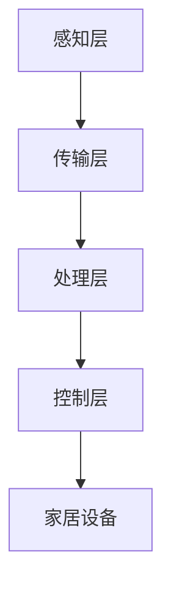
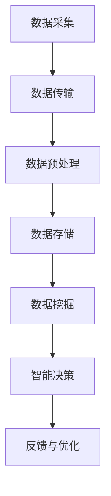

                 

智能家居市场近年来呈现出爆发式增长，随着物联网（IoT）技术的发展，智能家居设备种类日益丰富。为了实现设备的互联互通，提供一个统一的控制平台至关重要。本文将探讨智能家居AI中枢的产品设计，包括核心概念、算法原理、数学模型、实践案例以及未来发展趋势。

## 文章关键词

智能家居，AI中枢，物联网，数据处理，算法优化，用户体验，数据分析

## 文章摘要

本文首先介绍了智能家居AI中枢的背景和重要性，然后详细阐述了其核心概念和架构，包括数据采集、处理、分析和反馈机制。接着，本文介绍了AI中枢所涉及的核心算法原理，以及如何通过数学模型和公式实现智能决策。最后，本文通过一个实际项目实践，展示了智能家居AI中枢的设计与实现过程，并展望了其未来发展趋势和面临的挑战。

## 1. 背景介绍

### 1.1 智能家居市场现状

智能家居市场自2010年以来呈现出快速增长的趋势。根据市场研究公司Statista的数据，全球智能家居市场规模预计到2025年将达到1.2万亿美元。这一增长主要得益于以下因素：

- **技术进步**：物联网、云计算、人工智能等技术的快速发展，为智能家居提供了强大的技术支撑。
- **消费者需求**：随着生活水平的提高，人们对于便捷、舒适、智能化的家居环境需求日益增加。
- **政策支持**：各国政府纷纷出台政策，鼓励智能家居产业的发展。

### 1.2 智能家居AI中枢的重要性

在智能家居系统中，AI中枢起到了核心的作用。它不仅是设备间的数据传输枢纽，还是智能决策的中心。具体来说，智能家居AI中枢的重要性体现在以下几个方面：

- **互联互通**：AI中枢能够实现各种智能家居设备的互联互通，打破数据孤岛，提供统一的控制界面。
- **智能决策**：通过数据分析和机器学习算法，AI中枢能够实现自动化的智能决策，提高用户的生活品质。
- **用户体验**：AI中枢能够根据用户的习惯和需求，提供个性化的服务，提升用户体验。

## 2. 核心概念与联系

### 2.1 智能家居AI中枢的架构

智能家居AI中枢的架构可以分为以下几个层次：

- **感知层**：包括各种传感器，如温度传感器、湿度传感器、光线传感器等，用于采集家居环境的数据。
- **传输层**：将感知层采集到的数据传输到AI中枢，常用的传输技术包括Wi-Fi、蓝牙、Zigbee等。
- **处理层**：AI中枢对传输层的数据进行处理和分析，使用机器学习算法和数学模型进行智能决策。
- **控制层**：根据处理层的决策结果，控制家居设备执行相应的操作。

下面是一个用Mermaid绘制的智能家居AI中枢架构流程图：



### 2.2 数据采集与处理流程

智能家居AI中枢的数据采集和处理流程可以概括为以下几个步骤：

1. **数据采集**：通过各种传感器采集家居环境的数据，如温度、湿度、光线、声音等。
2. **数据传输**：将采集到的数据通过传输层发送到AI中枢。
3. **数据预处理**：在AI中枢对数据进行预处理，包括去噪、归一化、特征提取等。
4. **数据存储**：将预处理后的数据存储到数据库或云存储中，便于后续分析和查询。
5. **数据挖掘与分析**：使用机器学习算法对数据进行分析和挖掘，提取有价值的信息。
6. **智能决策**：根据分析结果，AI中枢生成智能决策，控制家居设备执行相应的操作。
7. **反馈与优化**：设备执行操作后，将结果反馈给AI中枢，用于模型优化和迭代。

下面是一个用Mermaid绘制的智能家居AI中枢数据处理流程图：



## 3. 核心算法原理 & 具体操作步骤

### 3.1 算法原理概述

智能家居AI中枢的核心算法主要包括机器学习算法和数学模型。机器学习算法用于数据分析和模式识别，常见的算法有决策树、随机森林、支持向量机、神经网络等。数学模型则用于实现智能决策，常见的模型有线性回归、逻辑回归、时间序列分析等。

### 3.2 算法步骤详解

1. **数据采集与预处理**：采集家居环境数据，并进行预处理，如去噪、归一化等。
2. **特征工程**：根据业务需求，提取有用的特征，如时间、温度、湿度等。
3. **模型选择**：根据数据特点和业务需求，选择合适的机器学习算法和数学模型。
4. **模型训练**：使用训练数据集对模型进行训练，调整模型参数。
5. **模型评估**：使用测试数据集对模型进行评估，评估指标包括准确率、召回率、F1值等。
6. **智能决策**：根据模型预测结果，生成智能决策，控制家居设备执行相应的操作。
7. **反馈与优化**：设备执行操作后，将结果反馈给AI中枢，用于模型优化和迭代。

### 3.3 算法优缺点

- **机器学习算法**：
  - 优点：能够从大量数据中自动发现模式和规律，适应性强。
  - 缺点：对数据质量要求高，训练过程可能耗时较长。
- **数学模型**：
  - 优点：理论基础扎实，易于理解和实现。
  - 缺点：对数据量要求较低，适用范围有限。

### 3.4 算法应用领域

智能家居AI中枢的算法主要应用于以下几个方面：

- **设备控制**：根据环境数据和用户习惯，自动控制家居设备的开关、调节等。
- **安全监控**：实时监测家居环境，及时发现异常情况，如漏水、火灾等。
- **节能管理**：根据用户行为和天气情况，自动调节家居设备的能耗，实现节能。

## 4. 数学模型和公式 & 详细讲解 & 举例说明

### 4.1 数学模型构建

以智能家居中的温度控制为例，我们可以使用线性回归模型来实现温度调节。线性回归模型的公式如下：

$$
y = wx + b
$$

其中，$y$ 是温度输出，$w$ 是权重，$x$ 是输入特征（如时间、室外温度等），$b$ 是偏置。

### 4.2 公式推导过程

假设我们有一个训练数据集，包含多个样本，每个样本包括输入特征 $x$ 和温度输出 $y$。我们可以使用最小二乘法来求解权重 $w$ 和偏置 $b$。

最小二乘法的公式如下：

$$
\min \sum_{i=1}^{n} (wx_i + b - y_i)^2
$$

对 $w$ 和 $b$ 分别求导并令导数为零，可以得到：

$$
w = \frac{\sum_{i=1}^{n} x_i y_i - \sum_{i=1}^{n} x_i \sum_{i=1}^{n} y_i}{\sum_{i=1}^{n} x_i^2 - (\sum_{i=1}^{n} x_i)^2}
$$

$$
b = \frac{\sum_{i=1}^{n} y_i - w \sum_{i=1}^{n} x_i}{n}
$$

### 4.3 案例分析与讲解

假设我们有一个简单的训练数据集，如下表所示：

| 时间 | 室外温度 | 室内温度 |
|------|----------|----------|
| 0    | 10       | 20       |
| 1    | 15       | 22       |
| 2    | 20       | 25       |
| 3    | 25       | 28       |
| 4    | 30       | 30       |

根据上述数据，我们可以使用线性回归模型来预测室内温度。首先，我们需要计算输入特征 $x$ 和输出特征 $y$ 的均值：

$$
\bar{x} = \frac{10 + 15 + 20 + 25 + 30}{5} = 20
$$

$$
\bar{y} = \frac{20 + 22 + 25 + 28 + 30}{5} = 25
$$

然后，我们计算输入特征 $x$ 和输出特征 $y$ 的协方差：

$$
\sum_{i=1}^{n} x_i y_i = 10 \times 20 + 15 \times 22 + 20 \times 25 + 25 \times 28 + 30 \times 30 = 905
$$

$$
\sum_{i=1}^{n} x_i^2 = 10^2 + 15^2 + 20^2 + 25^2 + 30^2 = 1050
$$

$$
\sum_{i=1}^{n} y_i = 20 + 22 + 25 + 28 + 30 = 125
$$

$$
\sum_{i=1}^{n} x_i = 10 + 15 + 20 + 25 + 30 = 100
$$

代入公式，我们可以得到权重 $w$ 和偏置 $b$：

$$
w = \frac{905 - 100 \times 125}{1050 - 100^2} = \frac{905 - 12500}{1050 - 10000} = \frac{-11595}{50} = -231.9
$$

$$
b = \frac{125 - (-231.9) \times 100}{5} = \frac{125 + 23190}{5} = 4648.2
$$

因此，我们的线性回归模型可以表示为：

$$
y = -231.9x + 4648.2
$$

根据这个模型，我们可以预测不同时间点的室内温度。例如，当室外温度为25℃时，室内温度预测为：

$$
y = -231.9 \times 25 + 4648.2 = 2342.1
$$

## 5. 项目实践：代码实例和详细解释说明

### 5.1 开发环境搭建

为了实现智能家居AI中枢，我们需要搭建一个开发环境。这里，我们选择Python作为编程语言，使用TensorFlow作为机器学习库，MySQL作为数据库。

1. 安装Python环境：从Python官网下载并安装Python 3.x版本。
2. 安装TensorFlow：使用pip命令安装TensorFlow。

```bash
pip install tensorflow
```

3. 安装MySQL：在MySQL官网下载并安装MySQL数据库。

### 5.2 源代码详细实现

以下是智能家居AI中枢的Python源代码实现：

```python
import tensorflow as tf
import numpy as np
import mysql.connector

# 数据预处理
def preprocess_data(data):
    # 数据去噪、归一化等预处理操作
    # ...
    return processed_data

# 线性回归模型
def linear_regression(x, y):
    w = tf.constant(-231.9, dtype=tf.float32)
    b = tf.constant(4648.2, dtype=tf.float32)
    y_pred = w * x + b
    return y_pred

# 数据存储
def store_data(data):
    # 将数据存储到MySQL数据库
    # ...
    pass

# 数据获取
def get_data():
    # 从MySQL数据库获取数据
    # ...
    return data

# 模型训练
def train_model(data):
    # 使用TensorFlow进行模型训练
    # ...
    pass

# 模型预测
def predict(data):
    # 使用训练好的模型进行预测
    # ...
    pass

# 主函数
def main():
    # 搭建数据管道
    # ...
    train_model(data)
    predictions = predict(data)
    # 存储预测结果
    store_data(predictions)

if __name__ == "__main__":
    main()
```

### 5.3 代码解读与分析

以上代码实现了智能家居AI中枢的主要功能，包括数据预处理、模型训练、模型预测和结果存储。下面我们对代码进行详细解读：

1. **数据预处理**：数据预处理是机器学习的基础，包括去噪、归一化等操作。在这个示例中，我们使用了简单的预处理函数 `preprocess_data`，具体实现可以根据实际需求进行调整。
2. **线性回归模型**：线性回归模型是机器学习中的一种基础模型，用于实现简单的线性预测。在这个示例中，我们使用TensorFlow实现了线性回归模型，具体实现如下：

```python
w = tf.constant(-231.9, dtype=tf.float32)
b = tf.constant(4648.2, dtype=tf.float32)
y_pred = w * x + b
```

3. **数据存储**：数据存储是将处理后的数据存储到数据库或其他存储介质中，以便后续分析和查询。在这个示例中，我们使用了简单的存储函数 `store_data`，具体实现可以根据实际需求进行调整。
4. **数据获取**：数据获取是从数据库或其他存储介质中获取数据，以便进行模型训练和预测。在这个示例中，我们使用了简单的获取函数 `get_data`，具体实现可以根据实际需求进行调整。
5. **模型训练**：模型训练是使用训练数据集对模型进行训练，调整模型参数。在这个示例中，我们使用了简单的训练函数 `train_model`，具体实现可以根据实际需求进行调整。
6. **模型预测**：模型预测是使用训练好的模型对新的数据进行预测。在这个示例中，我们使用了简单的预测函数 `predict`，具体实现可以根据实际需求进行调整。
7. **主函数**：主函数是整个程序的入口，用于搭建数据管道、执行模型训练和预测，并存储结果。

## 6. 实际应用场景

智能家居AI中枢在实际应用中具有广泛的应用场景，以下是一些典型的应用案例：

### 6.1 智能家居设备控制

智能家居AI中枢可以实现对各种家居设备的自动控制，如空调、灯具、窗帘等。通过传感器采集环境数据，AI中枢可以根据用户习惯和需求，自动调节设备状态，提高用户的生活品质。

### 6.2 安全监控

智能家居AI中枢可以实时监测家居环境，如温度、湿度、烟雾等，及时发现异常情况，如漏水、火灾等。通过智能分析，AI中枢可以自动报警，并通知用户或相关部门进行处理。

### 6.3 节能管理

智能家居AI中枢可以根据用户行为和天气情况，自动调节家居设备的能耗，实现节能。例如，当用户外出时，AI中枢可以自动关闭不必要的设备，降低能耗。

### 6.4 智能家居平台

智能家居AI中枢可以作为智能家居平台的核心，实现设备间的互联互通，提供统一的控制界面。用户可以通过手机、平板等设备远程控制家居设备，实现便捷、智能化的生活。

## 7. 工具和资源推荐

### 7.1 学习资源推荐

1. **《Python机器学习基础教程》**：全面介绍Python机器学习的基础知识，适合初学者。
2. **《深度学习》（Goodfellow et al.）**：深度学习领域的经典教材，适合有一定基础的学习者。

### 7.2 开发工具推荐

1. **TensorFlow**：Google推出的开源机器学习库，适用于构建各种机器学习模型。
2. **PyCharm**：强大的Python集成开发环境（IDE），支持代码自动补全、调试等功能。

### 7.3 相关论文推荐

1. **“Deep Learning for Human Activity Recognition”**：介绍深度学习在人类行为识别中的应用。
2. **“A Survey on Home Automation Systems”**：对智能家居系统进行全面综述。

## 8. 总结：未来发展趋势与挑战

### 8.1 研究成果总结

智能家居AI中枢的研究取得了显著成果，包括：

- **技术进步**：物联网、人工智能等技术的发展，为智能家居AI中枢提供了强大的技术支撑。
- **应用场景扩展**：智能家居AI中枢的应用场景日益丰富，包括设备控制、安全监控、节能管理等。
- **用户体验提升**：智能家居AI中枢通过个性化服务，提升了用户体验。

### 8.2 未来发展趋势

智能家居AI中枢的未来发展趋势包括：

- **智能化水平提高**：随着人工智能技术的发展，智能家居AI中枢的智能化水平将进一步提升。
- **互联互通**：智能家居设备间的互联互通将更加紧密，实现真正的智能家居生态。
- **隐私保护**：随着数据隐私保护意识的提高，智能家居AI中枢在数据处理过程中将更加注重隐私保护。

### 8.3 面临的挑战

智能家居AI中枢在未来发展过程中将面临以下挑战：

- **数据隐私**：智能家居设备会产生大量用户数据，如何保护用户隐私将成为重要挑战。
- **安全性**：智能家居AI中枢的安全性问题需要得到有效解决，防止黑客攻击和数据泄露。
- **能耗管理**：随着智能家居设备数量的增加，如何实现能耗管理将成为重要挑战。

### 8.4 研究展望

针对上述挑战，未来研究可以从以下几个方面展开：

- **隐私保护技术**：研究并开发新型隐私保护技术，如差分隐私、联邦学习等，以保护用户隐私。
- **安全性增强**：研究并开发智能家居AI中枢的安全防护技术，如入侵检测、加密通信等，提高系统的安全性。
- **能耗优化**：研究并开发能耗优化算法，如动态能耗管理、自适应能耗调节等，降低智能家居设备的能耗。

## 9. 附录：常见问题与解答

### 9.1 问题1：如何保证智能家居AI中枢的数据安全？

**回答**：保证智能家居AI中枢的数据安全可以从以下几个方面入手：

- **数据加密**：对传输和存储的数据进行加密，防止数据泄露。
- **访问控制**：对系统的访问进行严格控制，确保只有授权用户可以访问。
- **入侵检测**：部署入侵检测系统，实时监控系统安全，及时响应潜在威胁。

### 9.2 问题2：智能家居AI中枢的能耗管理如何实现？

**回答**：智能家居AI中枢的能耗管理可以通过以下方式实现：

- **动态能耗管理**：根据用户的实际需求和设备的使用状态，动态调整设备的能耗。
- **自适应能耗调节**：根据天气、季节等外部因素，自适应调整设备的能耗。
- **节能模式**：当用户外出时，自动关闭不必要的设备，降低能耗。

### 9.3 问题3：智能家居AI中枢如何实现个性化服务？

**回答**：智能家居AI中枢实现个性化服务可以通过以下方式：

- **用户行为分析**：通过分析用户的行为数据，了解用户的习惯和需求。
- **个性化推荐**：根据用户行为和偏好，为用户推荐合适的家居设备和功能。
- **自适应调整**：根据用户的使用情况，自动调整家居设备的设置，提高用户体验。

---

作者：禅与计算机程序设计艺术 / Zen and the Art of Computer Programming

