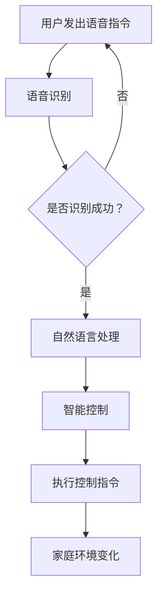

                 

关键词：智能家居、语音交互、创业、生活方式

> 摘要：随着人工智能技术的发展，智能家居市场迅速崛起。本文将探讨智能家居声控的创业机会，分析其核心概念、算法原理、数学模型以及实际应用场景，旨在为创业者提供有价值的参考。

## 1. 背景介绍

近年来，人工智能（AI）技术取得了显著的突破，语音识别和自然语言处理（NLP）成为其中的亮点。这些技术的进步不仅改变了人们的日常生活，也为智能家居市场带来了前所未有的发展机遇。智能家居，顾名思义，是指通过人工智能技术实现家庭设备的智能化管理。而声控技术作为智能家居的重要组成部分，正在逐渐改变人们的家居生活方式。

智能家居市场的快速增长吸引了众多创业者的目光。据统计，全球智能家居市场规模预计将在未来几年内持续扩大，年复合增长率超过20%。这其中，声控技术的应用无疑是重要驱动力之一。本文将从以下几个方面展开讨论：

- **核心概念与联系**：介绍智能家居声控技术的核心概念，包括语音识别、自然语言处理和智能控制。
- **核心算法原理 & 具体操作步骤**：分析声控技术的算法原理和具体操作步骤，包括语音识别算法、语义理解算法和智能控制算法。
- **数学模型和公式 & 详细讲解 & 举例说明**：探讨声控技术的数学模型和公式，并举例说明其在实际应用中的作用。
- **项目实践：代码实例和详细解释说明**：通过具体的项目实践，展示声控技术的开发流程和实际效果。
- **实际应用场景**：分析声控技术在家庭、酒店、养老院等场景中的应用，探讨其市场前景。
- **未来应用展望**：展望声控技术在未来智能家居领域的发展趋势和潜在应用。

## 2. 核心概念与联系

### 2.1 语音识别

语音识别（Speech Recognition）是声控技术的核心组成部分，它通过将语音信号转换为文本，实现人机交互。语音识别技术主要包括以下几个步骤：

1. **信号处理**：对采集到的语音信号进行预处理，包括去噪、增强、分帧等。
2. **特征提取**：将处理后的语音信号转换为能够反映语音特征的向量。
3. **模型训练**：使用大量的语音数据进行模型训练，包括隐马尔可夫模型（HMM）、深度神经网络（DNN）等。
4. **结果输出**：将识别结果输出为文本形式，供后续自然语言处理使用。

### 2.2 自然语言处理

自然语言处理（Natural Language Processing，NLP）是计算机科学领域与人工智能领域中的一个重要方向。它研究能实现人与计算机之间用自然语言进行有效通信的各种理论和方法。自然语言处理是一门融语言学、计算机科学、数学于一体的科学。该领域的研究将涉及自然语言，即人们日常使用的语言，所以它与语言学的研究有着密切的联系，但又有重要的区别。例如，语言学家研究语义，以词或短语的搭配和排列为分析单位，而自然语言处理领域则研究如何让计算机能实现理解、处理和生成语言。

自然语言处理主要包括以下几个子任务：

1. **分词**：将连续的文本分割成一个个独立的单词或短语。
2. **词性标注**：为每个单词标注其词性，如名词、动词、形容词等。
3. **句法分析**：分析句子的结构，包括句法成分和句法关系。
4. **语义理解**：理解句子的含义，包括语义角色标注、语义关系标注等。

### 2.3 智能控制

智能控制（Intelligent Control）是基于人工智能技术实现的自动控制。它利用计算机技术、控制理论、人工智能技术等对生产过程或设备进行自动化控制和优化。智能控制技术主要包括以下几个步骤：

1. **数据采集**：通过传感器等设备收集家庭环境数据，如温度、湿度、光照等。
2. **数据处理**：对采集到的数据进行分析和处理，提取有用的信息。
3. **决策生成**：基于语音识别和自然语言处理的结果，生成控制指令。
4. **执行控制**：通过智能家居设备执行控制指令，实现家庭环境的智能管理。

### 2.4 Mermaid 流程图

以下是智能家居声控技术的 Mermaid 流程图：

## 3. 核心算法原理 & 具体操作步骤

### 3.1 算法原理概述

智能家居声控技术的核心算法主要包括语音识别、自然语言处理和智能控制。

#### 3.1.1 语音识别算法

语音识别算法主要分为两个阶段：特征提取和模型训练。

1. **特征提取**：将语音信号转换为特征向量，常用的特征提取方法包括梅尔频率倒谱系数（MFCC）、线性预测编码（LPC）等。
2. **模型训练**：使用大量的语音数据进行模型训练，常见的模型包括隐马尔可夫模型（HMM）、深度神经网络（DNN）等。

#### 3.1.2 自然语言处理算法

自然语言处理算法主要包括分词、词性标注、句法分析和语义理解等。

1. **分词**：将连续的文本分割成一个个独立的单词或短语。
2. **词性标注**：为每个单词标注其词性，如名词、动词、形容词等。
3. **句法分析**：分析句子的结构，包括句法成分和句法关系。
4. **语义理解**：理解句子的含义，包括语义角色标注、语义关系标注等。

#### 3.1.3 智能控制算法

智能控制算法主要基于规则和机器学习等方法。

1. **规则控制**：根据预先设定的规则进行控制，如温度控制、光照控制等。
2. **机器学习控制**：通过学习用户的行为数据，自动生成控制策略。

### 3.2 算法步骤详解

以下是智能家居声控技术的具体操作步骤：

1. **用户发出语音指令**：用户通过语音助手或智能音箱等设备发出语音指令。
2. **语音识别**：设备使用语音识别算法对语音指令进行识别，输出文本形式。
3. **自然语言处理**：设备对识别结果进行自然语言处理，提取出关键信息。
4. **智能控制**：设备根据提取出的关键信息，生成控制指令。
5. **执行控制指令**：设备通过智能家居设备执行控制指令，实现家庭环境的智能管理。

### 3.3 算法优缺点

#### 3.3.1 语音识别算法

**优点**：
- **便捷性**：用户无需动手，通过语音即可控制设备。
- **多样性**：支持多种语音指令，如语音控制、语音查询等。

**缺点**：
- **识别率**：在噪声环境或语音质量较差的情况下，识别率可能较低。
- **准确性**：对于某些方言或口音，识别准确性可能不高。

#### 3.3.2 自然语言处理算法

**优点**：
- **语义理解**：能够理解用户的需求，提供更准确的服务。
- **灵活性**：支持多种语言和方言，适应不同的用户需求。

**缺点**：
- **计算复杂度**：自然语言处理算法通常较为复杂，计算资源消耗较大。
- **准确性**：对于复杂的语义理解，准确性可能较低。

#### 3.3.3 智能控制算法

**优点**：
- **自动化**：能够自动执行用户指令，提高生活便利性。
- **个性化**：根据用户行为数据，提供个性化的服务。

**缺点**：
- **依赖数据**：智能控制算法需要大量的用户行为数据，数据质量直接影响算法效果。
- **可靠性**：在极端情况下，智能控制算法可能无法正确执行用户指令。

### 3.4 算法应用领域

智能家居声控技术广泛应用于家庭、酒店、养老院等场景。

1. **家庭**：用户可以通过语音控制家居设备，如灯光、空调、电视等。
2. **酒店**：酒店可以通过声控技术提供个性化服务，如客房服务、呼叫服务等。
3. **养老院**：养老院可以通过声控技术为老人提供便利，如呼叫护士、调节环境等。

## 4. 数学模型和公式 & 详细讲解 & 举例说明

### 4.1 数学模型构建

智能家居声控技术的数学模型主要包括语音识别模型、自然语言处理模型和智能控制模型。

#### 4.1.1 语音识别模型

语音识别模型通常采用基于深度神经网络的声学模型和基于循环神经网络的语言模型。以下是声学模型和语言模型的构建方法：

**声学模型**：

$$
\hat{y} = \text{softmax}(W_a \cdot \text{relu}(W_s \cdot x_s + b_s))
$$

其中，$x_s$ 表示语音信号，$W_s$ 和 $b_s$ 分别为声学模型的权重和偏置，$\text{relu}$ 表示ReLU激活函数，$W_a$ 为softmax模型的权重。

**语言模型**：

$$
p(y|x) = \text{softmax}(W_l \cdot \text{relu}(W_g \cdot y + b_g))
$$

其中，$y$ 表示语音识别结果，$x$ 表示语音信号，$W_g$ 和 $b_g$ 分别为语言模型的权重和偏置。

#### 4.1.2 自然语言处理模型

自然语言处理模型通常采用基于循环神经网络（RNN）或Transformer的结构。以下是RNN模型的构建方法：

$$
h_t = \text{relu}(W_h \cdot [h_{t-1}, x_t] + b_h)
$$

其中，$h_t$ 表示当前时刻的隐藏状态，$x_t$ 表示输入文本，$W_h$ 和 $b_h$ 分别为RNN模型的权重和偏置。

#### 4.1.3 智能控制模型

智能控制模型通常采用基于规则或机器学习的结构。以下是基于规则的智能控制模型的构建方法：

$$
\text{control\_command} = \text{rule\_application}(input\_data)
$$

其中，$input\_data$ 表示输入数据，$\text{rule\_application}$ 表示规则应用函数。

### 4.2 公式推导过程

以下是智能家居声控技术的数学模型推导过程：

#### 4.2.1 语音识别模型推导

**声学模型**：

1. **输入层**：将语音信号$x_s$ 输入到输入层。
2. **隐藏层**：使用ReLU激活函数，将输入层输出通过权重$W_s$ 和偏置$b_s$ 进行加权求和。
3. **输出层**：使用softmax激活函数，将隐藏层输出通过权重$W_a$ 进行加权求和，得到概率分布。

**语言模型**：

1. **输入层**：将语音识别结果$y$ 输入到输入层。
2. **隐藏层**：使用ReLU激活函数，将输入层输出通过权重$W_g$ 和偏置$b_g$ 进行加权求和。
3. **输出层**：使用softmax激活函数，将隐藏层输出通过权重$W_l$ 进行加权求和，得到概率分布。

#### 4.2.2 自然语言处理模型推导

**RNN模型**：

1. **输入层**：将输入文本$x_t$ 输入到输入层。
2. **隐藏层**：使用ReLU激活函数，将输入层输出通过权重$W_h$ 和偏置$b_h$ 进行加权求和。
3. **输出层**：将隐藏层输出作为当前时刻的隐藏状态$h_t$。

#### 4.2.3 智能控制模型推导

**规则模型**：

1. **输入层**：将输入数据$

