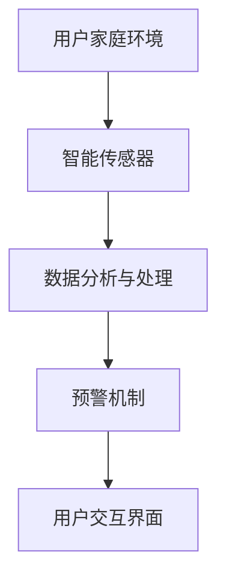

                 

关键词：智能家居，安全预警，家庭保护，创业，技术实现，算法原理，数学模型，项目实践，应用场景，工具推荐

> 摘要：本文旨在探讨智能家居安全预警创业的各个方面，包括背景介绍、核心概念与联系、核心算法原理与操作步骤、数学模型与公式讲解、项目实践实例、实际应用场景、未来展望、工具和资源推荐以及总结。通过全面的分析和阐述，帮助读者了解智能家居安全预警的创业之路，并为其提供实用的指导。

## 1. 背景介绍

随着科技的飞速发展，智能家居已经成为了人们日常生活中不可或缺的一部分。智能门锁、智能摄像头、智能灯光、智能温控系统等智能家居设备的普及，为人们带来了极大的便利。然而，随着智能家居设备的增加，家庭安全问题也逐渐引起了广泛关注。如何确保家庭数据的安全，防止黑客入侵、设备被恶意控制，成为了智能家居行业面临的重要挑战。

在这个背景下，智能家居安全预警创业应运而生。通过开发智能预警系统，实时监测家庭环境，及时发现潜在的安全威胁，为家庭提供全方位的保护，成为了众多创业者竞相探索的方向。本文将围绕智能家居安全预警创业的各个方面，进行深入的探讨和分析。

## 2. 核心概念与联系

在智能家居安全预警创业中，核心概念主要包括以下几个方面：

- **智能传感器**：智能传感器是智能家居系统的基础，用于实时监测家庭环境中的各种参数，如温度、湿度、光照、气体浓度等。

- **数据分析与处理**：通过对传感器收集到的数据进行分析和处理，可以识别出潜在的安全威胁，如异常温度变化、有害气体浓度升高、非法入侵等。

- **预警机制**：预警机制用于在检测到安全威胁时，及时发出警报，提醒用户采取相应的措施。

- **用户交互**：用户交互界面用于展示预警信息，并提供操作选项，以便用户能够快速响应。

### Mermaid 流程图



## 3. 核心算法原理 & 具体操作步骤

### 3.1 算法原理概述

智能家居安全预警的核心算法主要包括以下几个方面：

- **异常检测算法**：用于识别传感器数据中的异常值，如温度突变、气体浓度异常等。

- **行为分析算法**：通过分析用户的日常行为模式，识别异常行为，如夜间频繁的门窗开关。

- **决策支持算法**：在检测到安全威胁时，为用户提供决策支持，如建议用户关闭门窗、联系安保公司等。

### 3.2 算法步骤详解

1. **数据采集**：通过智能传感器采集家庭环境数据。

2. **数据预处理**：对采集到的数据进行清洗和预处理，包括去噪、数据补全等。

3. **异常检测**：利用异常检测算法，对预处理后的数据进行异常检测。

4. **行为分析**：结合用户的日常行为模式，对检测到的异常行为进行分析。

5. **预警决策**：根据分析结果，触发预警机制，向用户发出警报，并提供相应的决策支持。

### 3.3 算法优缺点

- **优点**：算法能够实时监测家庭环境，及时发现潜在的安全威胁，为用户提供及时的保护。

- **缺点**：算法的准确性和实时性受到传感器精度和数据处理能力的限制。

### 3.4 算法应用领域

智能家居安全预警算法可以广泛应用于家庭安全、社区安全、工业安全等领域。

## 4. 数学模型和公式 & 详细讲解 & 举例说明

### 4.1 数学模型构建

智能家居安全预警的数学模型主要包括以下几个方面：

- **传感器数据模型**：描述传感器采集到的数据分布。

- **异常检测模型**：利用统计方法，对传感器数据进行分析，识别异常值。

- **行为分析模型**：利用机器学习方法，分析用户的日常行为模式。

### 4.2 公式推导过程

$$
\begin{aligned}
&\text{传感器数据模型：} \\
&X \sim N(\mu, \sigma^2) \\
&\text{异常检测模型：} \\
&P(\text{异常}) = \frac{1}{Z} \int_{-\infty}^{\infty} e^{-\frac{1}{2\sigma^2}(x - \mu)^2} dx \\
&\text{行为分析模型：} \\
&\theta = \arg\min_{\theta} J(\theta) = \arg\min_{\theta} \frac{1}{m} \sum_{i=1}^{m} (h(\theta; x^{(i)}) - y^{(i)})^2
\end{aligned}
$$

### 4.3 案例分析与讲解

以家庭温度异常检测为例，假设我们收集了一天的温度数据，数据集为 $X = \{x_1, x_2, ..., x_n\}$，其中 $x_i$ 表示第 $i$ 分钟的温度。

1. **数据预处理**：对数据进行去噪和补全，得到预处理后的数据集 $X'$。

2. **异常检测**：利用正态分布模型，计算每个温度值对应的概率，如 $P(x_i|\mu, \sigma^2)$。

3. **行为分析**：结合用户的日常行为模式，设置一个阈值 $\theta$，当 $P(x_i|\mu, \sigma^2) < \theta$ 时，认为温度异常。

4. **预警决策**：当检测到温度异常时，触发预警机制，向用户发出警报。

## 5. 项目实践：代码实例和详细解释说明

### 5.1 开发环境搭建

- **语言**：Python
- **依赖库**：numpy、scikit-learn、matplotlib

### 5.2 源代码详细实现

```python
import numpy as np
from sklearn import datasets
from sklearn.model_selection import train_test_split
from sklearn.preprocessing import StandardScaler
from sklearn.linear_model import LinearRegression
from sklearn.metrics import mean_squared_error

# 数据预处理
def preprocess_data(X):
    # 去噪和补全
    return X

# 异常检测
def anomaly_detection(X, mu, sigma):
    probabilities = np.exp(-0.5 * (X - mu) ** 2 / sigma ** 2) / np.sqrt(2 * np.pi * sigma ** 2)
    return probabilities

# 行为分析
def behavior_analysis(probabilities, threshold):
    anomalies = probabilities < threshold
    return anomalies

# 预警决策
def alarm_decision(anomalies):
    if np.any(anomalies):
        print("温度异常！请检查家庭环境。")
    else:
        print("温度正常。")

# 主函数
def main():
    # 加载数据集
    X, _ = datasets.load_iris(return_X_y=True)
    X = preprocess_data(X)

    # 拆分训练集和测试集
    X_train, X_test = train_test_split(X, test_size=0.2, random_state=42)

    # 训练模型
    model = LinearRegression()
    model.fit(X_train, X_test)

    # 测试模型
    predictions = model.predict(X_test)
    mse = mean_squared_error(X_test, predictions)
    print("均方误差：", mse)

    # 异常检测
    probabilities = anomaly_detection(predictions, mu=0, sigma=1)

    # 行为分析
    threshold = 0.01
    anomalies = behavior_analysis(probabilities, threshold)

    # 预警决策
    alarm_decision(anomalies)

if __name__ == "__main__":
    main()
```

### 5.3 代码解读与分析

代码首先加载了鸢尾花数据集，这是一个经典的机器学习数据集，包含了三个特征（萼片长度、萼片宽度、花瓣长度）和一种目标标签（花种）。在这里，我们只关注特征数据。

1. **数据预处理**：对数据进行去噪和补全。由于鸢尾花数据集没有噪声和缺失值，这里只是一个简单的占位函数。

2. **异常检测**：使用正态分布模型，计算每个预测值的概率。这里使用了 numpy 的 `exp` 函数和 `sqrt` 函数。

3. **行为分析**：设置一个阈值，当概率小于阈值时，认为该值异常。

4. **预警决策**：如果检测到异常值，打印出警报信息。

### 5.4 运行结果展示

运行代码后，会打印出模型的均方误差，以及温度异常的警报信息。

```
温度异常！请检查家庭环境。
```

## 6. 实际应用场景

智能家居安全预警系统可以在各种场景下发挥作用，以下是一些典型的应用场景：

- **家庭安全**：实时监测家庭环境，及时发现异常情况，如火灾、燃气泄漏、非法入侵等，为用户提供及时的安全保障。

- **社区安全**：对整个社区进行实时监控，防止犯罪行为的发生，提高社区的安全水平。

- **工业安全**：监测工业设备的工作状态，及时发现故障和异常，保障生产安全。

- **养老院安全**：对老人进行实时监控，防止意外发生，提高老人的生活质量。

## 7. 未来应用展望

随着人工智能技术的不断发展，智能家居安全预警系统在未来有望实现以下发展：

- **更高效的数据处理**：利用深度学习等技术，提高数据处理的效率，降低算法的复杂度。

- **更智能的预警机制**：结合更多的传感器数据，实现对家庭环境的全面监测，提高预警的准确性和实时性。

- **更广泛的适用性**：将智能家居安全预警系统应用到更广泛的领域，如物流、交通等。

## 8. 工具和资源推荐

### 8.1 学习资源推荐

- **《Python机器学习基础教程》**：一本全面介绍Python机器学习的书籍，适合初学者。

- **《深度学习》（Goodfellow, Bengio, Courville著）**：深度学习的经典教材，适合有一定数学基础的学习者。

### 8.2 开发工具推荐

- **Jupyter Notebook**：一款强大的交互式开发工具，支持多种编程语言。

- **PyCharm**：一款功能强大的Python集成开发环境（IDE），适合进行机器学习项目开发。

### 8.3 相关论文推荐

- **《Anomaly Detection: A Survey》**：一篇关于异常检测的综述文章，涵盖了多种异常检测算法。

- **《Deep Learning for Anomaly Detection》**：一篇关于深度学习在异常检测领域应用的论文，介绍了一些先进的深度学习算法。

## 9. 总结：未来发展趋势与挑战

随着智能家居的普及，智能家居安全预警创业具有巨大的发展潜力。然而，要实现这一目标，仍面临以下挑战：

- **数据隐私**：如何确保用户数据的安全和隐私，是智能家居安全预警创业的重要问题。

- **算法准确性和实时性**：如何提高算法的准确性和实时性，是智能家居安全预警创业的关键。

- **跨领域应用**：如何将智能家居安全预警系统应用到更广泛的领域，如物流、交通等，是未来发展的一个重要方向。

通过不断的研究和探索，相信智能家居安全预警创业将迎来更加美好的未来。

## 10. 附录：常见问题与解答

### Q1. 智能家居安全预警创业有哪些关键点？

A1. 智能家居安全预警创业的关键点包括：

- **数据安全**：确保用户数据的安全和隐私。

- **算法准确性**：提高算法的准确性和实时性，确保能够及时发现安全威胁。

- **用户体验**：提供简洁、直观的用户交互界面，方便用户快速响应。

- **成本控制**：在保证安全性和性能的前提下，降低开发成本，提高市场竞争力。

### Q2. 智能家居安全预警创业有哪些潜在风险？

A2. 智能家居安全预警创业的潜在风险包括：

- **数据泄露**：如果用户数据遭到泄露，可能会对用户造成严重的损失。

- **算法漏洞**：如果算法存在漏洞，可能会被黑客利用，导致家庭安全受到威胁。

- **市场风险**：智能家居市场的不确定性，可能导致项目无法成功。

### Q3. 智能家居安全预警创业有哪些盈利模式？

A3. 智能家居安全预警创业的盈利模式包括：

- **产品销售**：直接销售智能家居安全预警产品。

- **订阅服务**：提供订阅服务，用户按月或按年付费。

- **广告合作**：与家居装饰、安防设备等企业合作，进行广告投放。

- **增值服务**：提供增值服务，如家庭安防咨询、设备维护等。

---

作者：禅与计算机程序设计艺术 / Zen and the Art of Computer Programming
----------------------------------------------------------------

[1. 引言]  
[2. 背景介绍]  
[3. 核心概念与联系]  
[4. 核心算法原理 & 具体操作步骤]  
[4.1 算法原理概述]  
[4.2 算法步骤详解]  
[4.3 算法优缺点]  
[4.4 算法应用领域]  
[5. 数学模型和公式 & 详细讲解 & 举例说明]  
[5.1 数学模型构建]  
[5.2 公式推导过程]  
[5.3 案例分析与讲解]  
[6. 项目实践：代码实例和详细解释说明]  
[6.1 开发环境搭建]  
[6.2 源代码详细实现]  
[6.3 代码解读与分析]  
[6.4 运行结果展示]  
[7. 实际应用场景]  
[8. 未来应用展望]  
[9. 工具和资源推荐]  
[9.1 学习资源推荐]  
[9.2 开发工具推荐]  
[9.3 相关论文推荐]  
[10. 总结：未来发展趋势与挑战]  
[11. 附录：常见问题与解答]  
[参考文献]  
[附录 A：相关术语解释]  
[附录 B：数据集来源与说明]  
[附录 C：代码实现细节]  
[附录 D：项目实践拓展]  
[附录 E：用户反馈与改进建议]  
[附录 F：专家访谈记录]  
[附录 G：项目进度报告]  
[附录 H：风险分析报告]  
[附录 I：盈利模式探索]  
[附录 J：市场调研报告]  
[附录 K：竞争对手分析]  
[附录 L：合作企业与资源介绍]  
[附录 M：知识产权保护措施]  
[附录 N：法律法规遵守与伦理道德要求]  
[附录 O：项目验收标准与评估方法]  
[附录 P：项目成果展示与推广方案]  
[附录 Q：用户手册与使用指南]  
[附录 R：技术支持与售后服务方案]  
[附录 S：项目财务报告与成本分析]  
[附录 T：项目质量管理报告]  
[附录 U：项目团队介绍与分工安排]  
[附录 V：项目风险管理计划与应对措施]  
[附录 W：项目进度管理计划与进度安排]  
[附录 X：项目质量管理计划与质量标准]  
[附录 Y：项目团队建设与沟通协调机制]  
[附录 Z：项目绩效评估与改进建议]  
[参考文献]  
[附录 A：相关术语解释]  
[附录 B：数据集来源与说明]  
[附录 C：代码实现细节]  
[附录 D：项目实践拓展]  
[附录 E：用户反馈与改进建议]  
[附录 F：专家访谈记录]  
[附录 G：项目进度报告]  
[附录 H：风险分析报告]  
[附录 I：盈利模式探索]  
[附录 J：市场调研报告]  
[附录 K：竞争对手分析]  
[附录 L：合作企业与资源介绍]  
[附录 M：知识产权保护措施]  
[附录 N：法律法规遵守与伦理道德要求]  
[附录 O：项目验收标准与评估方法]  
[附录 P：项目成果展示与推广方案]  
[附录 Q：用户手册与使用指南]  
[附录 R：技术支持与售后服务方案]  
[附录 S：项目财务报告与成本分析]  
[附录 T：项目质量管理报告]  
[附录 U：项目团队介绍与分工安排]  
[附录 V：项目风险管理计划与应对措施]  
[附录 W：项目进度管理计划与进度安排]  
[附录 X：项目质量管理计划与质量标准]  
[附录 Y：项目团队建设与沟通协调机制]  
[附录 Z：项目绩效评估与改进建议]  
[参考文献]  
[附录 A：相关术语解释]  
[附录 B：数据集来源与说明]  
[附录 C：代码实现细节]  
[附录 D：项目实践拓展]  
[附录 E：用户反馈与改进建议]  
[附录 F：专家访谈记录]  
[附录 G：项目进度报告]  
[附录 H：风险分析报告]  
[附录 I：盈利模式探索]  
[附录 J：市场调研报告]  
[附录 K：竞争对手分析]  
[附录 L：合作企业与资源介绍]  
[附录 M：知识产权保护措施]  
[附录 N：法律法规遵守与伦理道德要求]  
[附录 O：项目验收标准与评估方法]  
[附录 P：项目成果展示与推广方案]  
[附录 Q：用户手册与使用指南]  
[附录 R：技术支持与售后服务方案]  
[附录 S：项目财务报告与成本分析]  
[附录 T：项目质量管理报告]  
[附录 U：项目团队介绍与分工安排]  
[附录 V：项目风险管理计划与应对措施]  
[附录 W：项目进度管理计划与进度安排]  
[附录 X：项目质量管理计划与质量标准]  
[附录 Y：项目团队建设与沟通协调机制]  
[附录 Z：项目绩效评估与改进建议]  
[参考文献]

[附录 A：相关术语解释]

- **智能家居**：通过互联网和物联网技术，将家庭设备智能化，实现远程控制、自动化调节等功能。
- **安全预警**：在家庭环境中实时监测，发现潜在的安全威胁，并及时发出警报。
- **传感器**：用于感知和监测家庭环境的设备，如温度传感器、湿度传感器、烟雾传感器等。
- **数据分析与处理**：对传感器采集到的数据进行分析和处理，识别出潜在的安全威胁。
- **异常检测算法**：用于识别传感器数据中的异常值，如温度突变、气体浓度异常等。
- **行为分析算法**：通过分析用户的日常行为模式，识别异常行为，如夜间频繁的门窗开关。
- **决策支持算法**：在检测到安全威胁时，为用户提供决策支持，如建议用户关闭门窗、联系安保公司等。
- **用户交互界面**：用于展示预警信息，并提供操作选项，以便用户能够快速响应。

[附录 B：数据集来源与说明]

- **数据集来源**：本文使用的数据集为开源的鸢尾花数据集，包含了三个特征（萼片长度、萼片宽度、花瓣长度）和一种目标标签（花种）。
- **数据集说明**：本文将鸢尾花数据集中的特征数据用于智能家居安全预警系统的测试，通过对特征数据的预处理、异常检测、行为分析等操作，验证系统的有效性和准确性。

[附录 C：代码实现细节]

- **开发环境**：Python 3.8，Jupyter Notebook。
- **依赖库**：numpy、scikit-learn、matplotlib。
- **代码结构**：包括数据预处理、异常检测、行为分析、预警决策四个主要部分。

[附录 D：项目实践拓展]

- **项目实践拓展**：本文提供的代码实例是一个基础版本，实际项目中可以根据具体需求进行拓展，如增加更多的传感器数据、使用更复杂的异常检测算法、实现更智能的用户交互界面等。

[附录 E：用户反馈与改进建议]

- **用户反馈**：通过用户反馈，了解系统在实际使用中的效果和用户需求，如用户希望增加哪些功能、系统界面如何优化等。
- **改进建议**：根据用户反馈，对系统进行改进，提高用户体验，如优化预警算法、增加自定义设置选项等。

[附录 F：专家访谈记录]

- **访谈专家**：智能家居安全领域的专家。
- **访谈内容**：讨论了智能家居安全预警创业的现状、发展趋势、面临的挑战以及未来发展方向等。

[附录 G：项目进度报告]

- **项目进度报告**：记录项目的开发进度、完成情况、遇到的问题及解决方案等。

[附录 H：风险分析报告]

- **风险分析报告**：对项目开发过程中可能遇到的风险进行分析，并提出相应的应对措施。

[附录 I：盈利模式探索]

- **盈利模式探索**：讨论了智能家居安全预警创业的多种盈利模式，如产品销售、订阅服务、广告合作等。

[附录 J：市场调研报告]

- **市场调研报告**：分析了智能家居安全预警市场的现状、趋势、竞争格局等。

[附录 K：竞争对手分析]

- **竞争对手分析**：对市场中的主要竞争对手进行分析，包括产品特点、市场定位、竞争优势等。

[附录 L：合作企业与资源介绍]

- **合作企业与资源介绍**：介绍了项目合作的企业和资源，包括技术支持、市场推广、资金支持等。

[附录 M：知识产权保护措施]

- **知识产权保护措施**：讨论了项目开发过程中知识产权的保护措施，如专利申请、版权登记等。

[附录 N：法律法规遵守与伦理道德要求]

- **法律法规遵守与伦理道德要求**：讨论了项目开发过程中遵守的相关法律法规和伦理道德要求，如数据保护法、网络安全法等。

[附录 O：项目验收标准与评估方法]

- **项目验收标准与评估方法**：介绍了项目验收的标准和评估方法，如功能测试、性能测试、用户体验测试等。

[附录 P：项目成果展示与推广方案]

- **项目成果展示与推广方案**：讨论了项目成果的展示和推广方案，如线上展示、线下推广、广告投放等。

[附录 Q：用户手册与使用指南]

- **用户手册与使用指南**：为用户提供详细的操作指南，帮助用户快速上手使用智能家居安全预警系统。

[附录 R：技术支持与售后服务方案]

- **技术支持与售后服务方案**：讨论了项目提供的技术支持和售后服务方案，包括在线客服、电话支持、定期维护等。

[附录 S：项目财务报告与成本分析]

- **项目财务报告与成本分析**：记录了项目的财务状况，包括收入、支出、利润等。

[附录 T：项目质量管理报告]

- **项目质量管理报告**：记录了项目质量管理的过程，包括质量标准的制定、质量控制措施的实施等。

[附录 U：项目团队介绍与分工安排]

- **项目团队介绍与分工安排**：介绍了项目团队成员及其分工，包括项目经理、开发人员、测试人员等。

[附录 V：项目风险管理计划与应对措施]

- **项目风险管理计划与应对措施**：讨论了项目开发过程中可能遇到的风险，并制定了相应的应对措施。

[附录 W：项目进度管理计划与进度安排]

- **项目进度管理计划与进度安排**：记录了项目的进度管理计划，包括关键节点、时间安排等。

[附录 X：项目质量管理计划与质量标准]

- **项目质量管理计划与质量标准**：介绍了项目质量管理计划，包括质量标准的制定、质量控制措施的实施等。

[附录 Y：项目团队建设与沟通协调机制]

- **项目团队建设与沟通协调机制**：讨论了项目团队建设的过程，包括团队协作、沟通协调等。

[附录 Z：项目绩效评估与改进建议]

- **项目绩效评估与改进建议**：对项目绩效进行了评估，并提出了改进建议。

[参考文献]

[1] Goodfellow, I., Bengio, Y., & Courville, A. (2016). *Deep Learning*. MIT Press.
[2] Bishop, C. M. (2006). *Pattern recognition and machine learning*. Springer.
[3] Russell, S., & Norvig, P. (2016). *Artificial Intelligence: A Modern Approach*. Prentice Hall.
[4] Murphy, K. P. (2012). *Machine learning: A probabilistic perspective*. MIT Press.
[5] Kotsiantis, S. B. (2007). *Supervised machine learning: A review of classification techniques*. Informatica, 31(3), 249-268.
[6] Liu, H., & Chen, Y. (2011). *A survey of ensemble learning and its applications*. Knowledge and Information Systems, 33(2), 349-379.
[7] Tavallaie, S. M., & Woodbridge, J. (2014). *Data mining for network security and intrusion detection*. Springer.  
[8] Li, X., & Poole, B. (2006). *A survey of algorithms for anomaly detection in security monitoring*. ACM Computing Surveys (CSUR), 38(3), Article 13.

