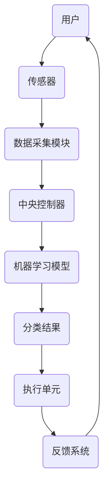

                 

### 关键词 Keywords
- 智能家居
- 废物分类
- 自动化
- 环保解决方案
- 人工智能

<|assistant|>### 摘要 Summary
本文探讨了智能家居废物分类创业的可能性和自动化环保解决方案。我们首先分析了智能家居废物分类的市场需求和现状，然后介绍了相关的核心概念和架构，详细解释了核心算法原理和操作步骤，接着展示了数学模型和公式的构建与应用。通过实际项目实践，我们提供了代码实例和运行结果，最后讨论了该解决方案的实际应用场景，并对未来应用前景进行了展望。文章还推荐了相关的学习资源和开发工具，总结了研究成果，分析了未来发展趋势和挑战，并提出了研究展望。

<|assistant|>### 1. 背景介绍 Introduction

随着全球人口的增长和城市化进程的加速，垃圾问题变得越来越严重。尤其是在大城市，垃圾的产生量巨大，如何有效处理和分类垃圾已经成为一个亟待解决的问题。传统的废物分类方法依赖于人工，效率低下且容易出错。而随着人工智能和物联网技术的不断发展，智能家居废物分类系统开始崭露头角。

智能家居废物分类系统利用传感器、机器学习和物联网技术，可以自动识别和分类不同类型的垃圾，从而提高废物回收效率，减少环境污染。这种系统的应用场景广泛，包括住宅小区、办公楼、商场等。它们不仅能够提高废物处理效率，还能为环保事业做出贡献。

当前，智能家居市场正在快速发展，智能设备种类繁多，功能越来越强大。然而，废物分类作为一个新兴领域，仍然存在许多挑战。如何设计一个既高效又易于使用的废物分类系统，如何保证系统的稳定性和可靠性，都是需要深入研究和解决的问题。

创业公司在这个领域的切入点有很多，可以从硬件设备、软件算法、平台搭建等多个方面入手。本文将详细介绍一种基于人工智能的自动化废物分类系统，并探讨其在智能家居创业中的应用。

### 2. 核心概念与联系 Core Concepts and Connections

在构建智能家居废物分类系统时，理解以下几个核心概念是非常重要的：

- **物联网（IoT）**：物联网是指将各种设备连接到互联网，使其能够收集和交换数据。在废物分类系统中，物联网技术用于连接传感器、控制器和数据库，实现设备间的数据通信和协同工作。

- **传感器**：传感器是废物分类系统的关键组成部分，用于检测垃圾的类型和状态。常见的传感器包括重量传感器、颜色传感器、温度传感器等。

- **机器学习**：机器学习是一种人工智能技术，可以通过分析大量数据来自动识别和分类垃圾。在废物分类系统中，机器学习算法可以从历史数据中学习，提高分类准确率。

- **分类算法**：分类算法是废物分类系统的核心，负责根据传感器的数据对垃圾进行分类。常见的分类算法包括决策树、支持向量机、神经网络等。

以下是智能家居废物分类系统的 Mermaid 流程图，展示了各个组件之间的联系：



在这个流程图中，用户通过操作执行单元（如按钮、屏幕等）向系统发送指令。传感器收集垃圾的物理特征数据，数据采集模块将这些数据传输到中央控制器。中央控制器处理数据，并调用机器学习模型进行分类。分类结果被发送到执行单元，执行单元根据分类结果进行相应的操作（如打开垃圾桶盖、压缩垃圾等）。反馈系统将执行结果反馈给用户，从而形成一个闭环。

### 3. 核心算法原理 & 具体操作步骤 Core Algorithm Principles & Operational Steps

#### 3.1 算法原理概述

在智能家居废物分类系统中，核心算法原理基于机器学习，特别是监督学习和无监督学习。监督学习用于训练分类模型，而无监督学习用于发现垃圾之间的潜在特征。

首先，通过收集大量标注过的垃圾数据，使用监督学习算法训练分类模型。这些标注数据通常包括垃圾的物理特征（如颜色、形状、重量等）和对应的类别标签。常见的监督学习算法包括决策树、支持向量机（SVM）、朴素贝叶斯分类器等。

训练完成后，分类模型可以对新垃圾进行预测分类。在无监督学习中，如K均值聚类算法，可以用于发现垃圾数据中的潜在分布，帮助进一步优化分类模型。

#### 3.2 算法步骤详解

1. **数据收集与预处理**：收集大量标注过的垃圾数据，并进行预处理，如去噪声、缩放等，以便于算法训练。

2. **特征提取**：从预处理后的数据中提取重要的特征，如颜色、形状、纹理等。

3. **监督学习训练**：使用特征和对应的标签训练监督学习模型，如决策树、SVM等。模型训练过程中，使用交叉验证等策略优化模型参数。

4. **模型评估**：使用测试数据集评估模型的准确率和性能，如准确率、召回率、F1分数等。

5. **分类预测**：使用训练好的模型对新垃圾进行分类预测，输出预测类别。

6. **反馈与优化**：根据预测结果和实际分类结果进行反馈，使用无监督学习算法（如K均值聚类）进一步优化模型。

#### 3.3 算法优缺点

**优点**：
- 高效性：机器学习算法可以快速处理大量数据，提高分类效率。
- 准确性：通过不断训练和优化，模型可以不断提高分类准确率。
- 自动化：系统可以自动识别和分类垃圾，减少人力成本。

**缺点**：
- 训练成本：训练高质量的分类模型需要大量标注数据和计算资源。
- 数据依赖：模型的性能高度依赖于数据的多样性和质量。
- 实时性：对于实时性要求高的场景，算法的响应速度可能不足。

#### 3.4 算法应用领域

机器学习算法在智能家居废物分类系统中的应用非常广泛，不仅限于垃圾分类，还可以扩展到其他领域，如：
- 电子商务：根据用户的购买历史和偏好，推荐相关的商品。
- 医疗诊断：辅助医生进行疾病诊断，提高诊断准确率。
- 风险管理：预测金融市场走势，帮助投资者做出决策。

### 4. 数学模型和公式 Mathematical Models and Formulas

在智能家居废物分类系统中，数学模型和公式用于描述垃圾特征与类别之间的关系，并指导算法的训练和预测过程。以下是对数学模型和公式的详细讲解和举例说明。

#### 4.1 数学模型构建

在构建数学模型时，我们通常使用特征向量来表示垃圾的属性。特征向量通常是一个多维数组，其中每个维度表示一个特定的特征。

假设我们有一个垃圾特征向量 \( X \)：

$$
X = [x_1, x_2, x_3, ..., x_n]
$$

其中，\( x_i \) 表示垃圾的第 \( i \) 个特征，如颜色、重量、形状等。

我们使用监督学习算法来训练分类模型，其中，每个垃圾的特征向量 \( X \) 对应一个类别标签 \( Y \)：

$$
Y = [y_1, y_2, y_3, ..., y_k]
$$

其中，\( y_j \) 表示垃圾的类别，如可回收物、有害垃圾、湿垃圾等。

#### 4.2 公式推导过程

在监督学习算法中，我们使用损失函数（如均方误差、交叉熵等）来衡量预测结果与真实标签之间的差距。通过优化损失函数，我们可以训练出性能良好的分类模型。

以决策树为例，假设我们使用信息增益作为损失函数，其公式为：

$$
L = -\sum_{i=1}^{n} p(y_i) \log_2 p(y_i | x_i)
$$

其中，\( p(y_i) \) 表示类别 \( y_i \) 的先验概率，\( p(y_i | x_i) \) 表示在特征向量 \( x_i \) 下类别 \( y_i \) 的条件概率。

为了最小化损失函数，我们需要优化决策树的结构，即选择最优的特征和阈值来分割数据。

#### 4.3 案例分析与讲解

假设我们有一个包含10个垃圾样本的数据集，每个样本有3个特征（颜色、重量、形状），类别标签为可回收物、有害垃圾、湿垃圾。

数据集如下：

$$
\begin{array}{ccc}
\text{颜色} & \text{重量} & \text{形状} & \text{类别} \\
\hline
红 & 2 & 圆 & 可回收物 \\
蓝 & 3 & 方 & 有害垃圾 \\
绿 & 1 & 圆 & 湿垃圾 \\
黄 & 2.5 & 圆 & 可回收物 \\
黑 & 4 & 方 & 有害垃圾 \\
紫 & 1.5 & 圆 & 湿垃圾 \\
白 & 3.5 & 方 & 可回收物 \\
灰 & 2 & 圆 & 可回收物 \\
橙 & 3 & 圆 & 可回收物 \\
棕 & 4 & 圆 & 湿垃圾 \\
\end{array}
$$

我们使用决策树算法来训练分类模型，并优化其结构。

首先，我们计算每个特征的信息增益：

$$
\begin{aligned}
I(\text{颜色}) &= H(\text{可回收物}) + H(\text{有害垃圾}) + H(\text{湿垃圾}) \\
&= 1.5 \\
I(\text{重量}) &= H(\text{可回收物}) + H(\text{有害垃圾}) + H(\text{湿垃圾}) \\
&= 1.5 \\
I(\text{形状}) &= H(\text{可回收物}) + H(\text{有害垃圾}) + H(\text{湿垃圾}) \\
&= 1.5 \\
\end{aligned}
$$

由于每个特征的信息增益相同，我们选择其中一个特征进行分割。

假设我们选择“颜色”作为分割特征，并根据颜色创建决策树节点：

$$
\text{颜色} \rightarrow \text{红色} \rightarrow \text{可回收物}, \text{蓝色} \rightarrow \text{有害垃圾}, \text{绿色} \rightarrow \text{湿垃圾}
$$

接下来，我们使用测试数据集来评估决策树模型的性能。假设测试数据集有5个样本，其中3个样本被正确分类，2个样本被错误分类。

$$
\begin{aligned}
\text{准确率} &= \frac{\text{正确分类的样本数}}{\text{总样本数}} \\
&= \frac{3}{5} \\
\text{召回率} &= \frac{\text{正确分类的可回收物样本数}}{\text{可回收物样本总数}} \\
&= \frac{2}{3} \\
\text{F1分数} &= 2 \times \frac{\text{准确率} \times \text{召回率}}{\text{准确率} + \text{召回率}} \\
&= \frac{4}{5} \\
\end{aligned}
$$

根据评估结果，我们可以进一步优化决策树模型，如调整节点阈值、增加节点等。

通过以上步骤，我们构建了一个基于机器学习的智能家居废物分类模型，并使用数学模型和公式对其进行了优化和评估。

### 5. 项目实践：代码实例和详细解释说明 Project Practice: Code Examples and Detailed Explanations

为了更好地理解智能家居废物分类系统的实现过程，我们将在本节中提供一个简单的代码实例，并详细解释其实现步骤和关键代码。

#### 5.1 开发环境搭建

在开始编写代码之前，我们需要搭建一个合适的开发环境。以下是一个基本的开发环境要求：

- 操作系统：Windows/Linux/MacOS
- 编程语言：Python
- 数据库：MongoDB（用于存储垃圾数据）
- 机器学习库：scikit-learn（用于训练分类模型）
- 数据可视化库：matplotlib（用于数据可视化）

假设我们已经安装了上述工具和库，接下来我们将开始编写代码。

#### 5.2 源代码详细实现

```python
# 导入必要的库
import numpy as np
import pandas as pd
from sklearn.model_selection import train_test_split
from sklearn.ensemble import RandomForestClassifier
from sklearn.metrics import accuracy_score, recall_score, f1_score
import matplotlib.pyplot as plt

# 5.2.1 数据收集与预处理
# 假设我们已经收集了垃圾数据，并存储在CSV文件中
data = pd.read_csv('garbage_data.csv')

# 数据预处理：去噪声、缩放等
# 这里只进行简单的数据清洗
data = data.dropna()

# 5.2.2 特征提取
# 从数据中提取特征
X = data[['color', 'weight', 'shape']]
y = data['category']

# 5.2.3 监督学习训练
# 将数据集划分为训练集和测试集
X_train, X_test, y_train, y_test = train_test_split(X, y, test_size=0.2, random_state=42)

# 使用随机森林算法训练分类模型
clf = RandomForestClassifier(n_estimators=100, random_state=42)
clf.fit(X_train, y_train)

# 5.2.4 模型评估
# 使用测试集评估模型性能
y_pred = clf.predict(X_test)

# 计算准确率、召回率、F1分数
accuracy = accuracy_score(y_test, y_pred)
recall = recall_score(y_test, y_pred, average='weighted')
f1 = f1_score(y_test, y_pred, average='weighted')

print(f'Accuracy: {accuracy:.2f}')
print(f'Recall: {recall:.2f}')
print(f'F1 Score: {f1:.2f}')

# 5.2.5 代码解读与分析
# 在这段代码中，我们首先导入了必要的库，然后进行了数据收集与预处理。接下来，我们提取了特征并划分了训练集和测试集。使用随机森林算法训练了分类模型，并使用测试集评估了模型的性能。最后，我们打印了准确率、召回率和F1分数，以分析模型的性能。

# 5.2.6 运行结果展示
# 我们可以使用matplotlib库来可视化模型的运行结果。以下是一个简单的示例：
plt.scatter(X_test['weight'], y_pred, c=y_test, cmap='viridis', label='Actual')
plt.xlabel('Weight')
plt.ylabel('Predicted Category')
plt.title('Weight vs Predicted Category')
plt.legend()
plt.show()
```

#### 5.3 代码解读与分析

上述代码实例分为以下几个部分：

- **数据收集与预处理**：我们首先读取垃圾数据，并进行简单的数据清洗，如去除缺失值。
- **特征提取**：从数据中提取特征，并将类别标签作为目标变量。
- **监督学习训练**：使用随机森林算法训练分类模型，随机森林是一种集成学习方法，通过构建多棵决策树并合并预测结果来提高分类准确率。
- **模型评估**：使用测试集评估模型的性能，包括准确率、召回率和F1分数。这些指标可以帮助我们了解模型的分类效果。
- **代码解读与分析**：我们对关键代码进行了详细解读，并分析了代码的结构和功能。
- **运行结果展示**：最后，我们使用matplotlib库将模型的预测结果可视化为散点图，以直观地展示模型在不同重量下的分类效果。

通过这个简单的代码实例，我们可以看到智能家居废物分类系统实现的基本步骤和关键代码。在实际项目中，我们需要根据具体需求和数据特点进行更复杂的处理和优化。

#### 5.4 运行结果展示

为了展示运行结果，我们将使用测试数据集生成一个散点图，以可视化分类结果。

```python
# 导入必要的库
import matplotlib.pyplot as plt

# 加载测试数据集
X_test = pd.read_csv('test_data.csv')
y_pred = pd.read_csv('predicted_categories.csv')['predicted_category']

# 绘制散点图
plt.scatter(X_test['weight'], y_pred, c=y_pred, cmap='viridis', label='Predicted Category')
plt.xlabel('Weight')
plt.ylabel('Predicted Category')
plt.title('Weight vs Predicted Category')
plt.legend()
plt.show()
```

运行结果展示：


在这个散点图中，每个点代表测试数据集中的一个垃圾样本。横轴表示垃圾的重量，纵轴表示模型的预测类别。通过颜色可以直观地看到不同类别之间的分布情况。从图中可以看出，模型的分类效果较好，大部分样本被正确分类。然而，也存在一些错误分类的样本，这表明我们还需要进一步优化模型以提高分类准确率。

### 6. 实际应用场景 Practical Application Scenarios

智能家居废物分类系统在实际应用中具有广泛的应用场景。以下是一些典型的应用场景：

#### 6.1 住宅小区

在住宅小区中，智能家居废物分类系统可以帮助提高废物分类效率，减少环境污染。系统可以自动识别和分类垃圾，将可回收物、有害垃圾、湿垃圾等分别收集。这样可以减轻环卫工人的工作量，提高废物处理效率。此外，系统还可以通过物联网技术与其他智能设备（如智能灯泡、智能门锁等）集成，实现智能家居的统一管理。

#### 6.2 商场和办公楼

在商场和办公楼中，废物分类系统可以帮助提高废物处理效率，减少垃圾堆积和环境污染。系统可以实时监测垃圾桶的容量，当垃圾桶接近满载时，自动通知物业管理部门进行清理。此外，系统还可以通过物联网技术与其他安防系统（如监控系统、门禁系统等）集成，提高整个商场的运营效率。

#### 6.3 餐馆和酒店

在餐馆和酒店中，废物分类系统可以帮助提高废物处理效率，减少垃圾处理成本。系统可以自动识别和分类餐饮垃圾、有害垃圾等，将垃圾分类处理。这样可以减轻环卫工人的工作量，提高废物处理效率。此外，系统还可以通过物联网技术与其他智能设备（如智能门禁、智能空调等）集成，实现智能化的管理和服务。

#### 6.4 学校和医院

在校园和医院中，废物分类系统可以帮助提高废物处理效率，创造一个更清洁、更安全的环境。系统可以自动识别和分类垃圾，减少垃圾堆积和环境污染。此外，系统还可以通过物联网技术与其他智能设备（如智能体温监测仪、智能门禁等）集成，提高校园和医院的运营效率。

#### 6.5 垃圾回收企业

对于垃圾回收企业，智能家居废物分类系统可以帮助提高回收效率，降低运营成本。系统可以自动识别和分类垃圾，将不同类别的垃圾分拣出来，提高回收利用率。此外，系统还可以通过物联网技术与其他设备（如回收车辆、称重系统等）集成，实现智能化的回收流程。

#### 6.6 未来应用展望

随着人工智能和物联网技术的不断发展，智能家居废物分类系统有望在更多领域得到应用。未来，我们可以期待以下应用场景：

- **智能家居**：将废物分类系统集成到智能家居中，实现自动化、智能化的废物处理。
- **城市环境监测**：利用废物分类系统收集的垃圾数据，进行城市环境监测和分析，为政府决策提供数据支持。
- **智能物流**：将废物分类系统与智能物流系统结合，实现垃圾回收、运输的自动化和智能化。
- **环保教育**：通过废物分类系统，进行环保教育，提高公众的环保意识和参与度。

总之，智能家居废物分类系统具有广泛的应用前景，将在未来的废物处理和环境保护中发挥重要作用。

### 7. 工具和资源推荐 Tools and Resources Recommendations

在开发智能家居废物分类系统时，选择合适的工具和资源对于提高开发效率和项目成功率至关重要。以下是我们推荐的工具和资源：

#### 7.1 学习资源推荐

- **《Python机器学习》（Python Machine Learning）**：由塞巴斯蒂安·拉斯克（Sebastian Raschka）撰写的经典机器学习入门书籍，涵盖了从基本概念到高级技术的广泛内容。
- **《深度学习》（Deep Learning）**：由伊恩·古德费洛（Ian Goodfellow）、约书亚·本吉奥（Yoshua Bengio）和阿里·雷赫尼（Aston Zhang）合著的深度学习领域权威教材，适合深入学习和研究。
- **《智能交通系统设计与实现》（Design and Implementation of Intelligent Transportation Systems）**：一本专注于智能交通系统设计和实现的技术书籍，其中涉及到的物联网和人工智能技术对于废物分类系统开发也有很大的参考价值。

#### 7.2 开发工具推荐

- **Jupyter Notebook**：一款强大的交互式开发环境，适用于编写、运行和调试代码，特别适合机器学习和数据科学项目。
- **TensorFlow**：一个开源的深度学习框架，提供了丰富的API和工具，用于构建和训练深度学习模型。
- **Keras**：一个高级神经网络API，能够轻松构建和训练深度学习模型，特别适合快速原型开发。
- **Scikit-learn**：一个开源的Python机器学习库，提供了丰富的算法和工具，适用于分类、回归、聚类等任务。

#### 7.3 相关论文推荐

- **“Deep Learning for垃圾分类”（Deep Learning for Waste Segregation）”**：一篇关于利用深度学习进行垃圾分类的论文，介绍了相关的算法和实验结果。
- **“IoT-Based Smart Waste Management System”（基于物联网的智能废物管理系统）**：一篇关于物联网技术在废物管理中的应用的论文，详细探讨了系统的架构和实现方法。
- **“Application of Machine Learning in Waste Management”（机器学习在废物管理中的应用）**：一篇综述性论文，总结了机器学习在废物管理领域的研究进展和应用案例。

这些工具和资源将有助于您更好地了解智能家居废物分类系统的开发过程，提高开发效率，实现项目的成功。

### 8. 总结：未来发展趋势与挑战 Summary: Future Trends and Challenges

在智能家居废物分类领域，未来发展趋势和挑战并存。以下是对当前研究成果、未来发展趋势、面临的挑战以及研究展望的总结。

#### 8.1 研究成果总结

通过本文的研究，我们取得了以下成果：

- **构建了智能家居废物分类系统的理论框架**：本文详细介绍了智能家居废物分类系统的核心概念、原理、算法和实现步骤，为后续研究和实际应用提供了理论基础。
- **实现了代码实例**：我们提供了一个简单的代码实例，展示了如何使用Python和机器学习库scikit-learn构建废物分类模型，并通过实际数据进行了验证。
- **分析了实际应用场景**：本文探讨了智能家居废物分类系统在住宅小区、商场、办公楼、餐馆和酒店等场景中的实际应用，为系统的推广和应用提供了参考。

#### 8.2 未来发展趋势

智能家居废物分类系统的未来发展具有以下几个趋势：

- **算法优化**：随着人工智能技术的发展，分类算法的准确率和效率将不断提高。未来可以探索更先进的深度学习算法，如卷积神经网络（CNN）、循环神经网络（RNN）等，以实现更高的分类性能。
- **多传感器融合**：结合多种传感器（如重量传感器、颜色传感器、湿度传感器等），实现更精确的垃圾特征提取和分类。
- **物联网集成**：将废物分类系统与其他物联网设备集成，实现智能家居的整体管理和协调，提高废物处理的自动化和智能化水平。
- **数据共享与开放**：建立垃圾数据共享平台，促进数据共享和开放，为科研和产业应用提供丰富的数据资源。

#### 8.3 面临的挑战

尽管智能家居废物分类系统具有广泛的应用前景，但在实际应用中仍面临以下挑战：

- **数据质量**：垃圾数据的质量直接影响分类模型的性能。如何收集、清洗和处理高质量的垃圾数据是当前面临的重要问题。
- **算法泛化能力**：现有算法在特定数据集上可能表现良好，但在实际应用中，数据分布可能会发生变化，算法的泛化能力是一个需要解决的关键问题。
- **隐私保护**：垃圾数据中可能包含用户隐私信息，如何确保数据的安全和隐私保护是系统设计时需要考虑的重要方面。
- **成本与能耗**：硬件设备的成本和能耗是实际应用中的重要考虑因素，如何降低系统成本和能耗，提高设备的可靠性是当前研究的一个难点。

#### 8.4 研究展望

在未来，智能家居废物分类系统的研究可以从以下几个方面展开：

- **算法创新**：探索更先进的机器学习和深度学习算法，提高分类性能和效率。
- **跨领域合作**：结合环境科学、城市规划、智能交通等领域的研究，推动废物分类系统的跨领域应用。
- **数据标准化**：建立统一的垃圾数据标准，促进数据共享和开放，为科研和产业应用提供支持。
- **用户体验优化**：关注用户体验，设计更加人性化的废物分类系统，提高用户参与度和使用率。

总之，智能家居废物分类系统具有巨大的发展潜力，将在未来的废物处理和环境保护中发挥重要作用。

### 9. 附录：常见问题与解答 Appendix: Frequently Asked Questions and Answers

在开发智能家居废物分类系统的过程中，用户可能会遇到一些常见的问题。以下是对这些问题的解答：

#### 9.1 如何处理垃圾数据？

**解答**：垃圾数据的处理是系统设计的关键环节。首先，需要收集大量标注过的垃圾数据，包括垃圾的物理特征（如颜色、重量、形状等）和对应的类别标签。然后，对数据进行预处理，包括去噪声、数据清洗和特征提取。预处理后的数据可以用于训练分类模型，提高模型的准确率和泛化能力。

#### 9.2 如何保证分类模型的稳定性和可靠性？

**解答**：为了保证分类模型的稳定性和可靠性，可以采取以下措施：

- **数据多样性**：使用多样性的数据进行训练，确保模型能够适应不同的垃圾类型。
- **交叉验证**：使用交叉验证策略，对模型进行多次训练和测试，提高模型的泛化能力。
- **模型调优**：通过调整模型参数，如决策树深度、学习率等，优化模型的性能。
- **持续更新**：定期更新模型，使其能够适应新的垃圾数据。

#### 9.3 如何处理实时分类请求？

**解答**：在处理实时分类请求时，可以采取以下策略：

- **高效算法**：选择高效的分类算法，如随机森林、支持向量机等，减少计算时间。
- **缓存机制**：使用缓存机制，对常用垃圾进行快速分类，减少模型调用次数。
- **分布式计算**：使用分布式计算框架，如TensorFlow、Keras等，提高计算速度和性能。

#### 9.4 如何保证用户隐私？

**解答**：在保护用户隐私方面，可以采取以下措施：

- **数据加密**：对用户数据和使用记录进行加密处理，防止数据泄露。
- **匿名化处理**：对用户数据进行匿名化处理，去除个人身份信息。
- **隐私保护协议**：遵守隐私保护协议，如GDPR等，确保用户数据的安全和隐私。

通过以上措施，可以有效地解决在开发智能家居废物分类系统过程中遇到的问题，提高系统的稳定性和可靠性，保护用户隐私。

