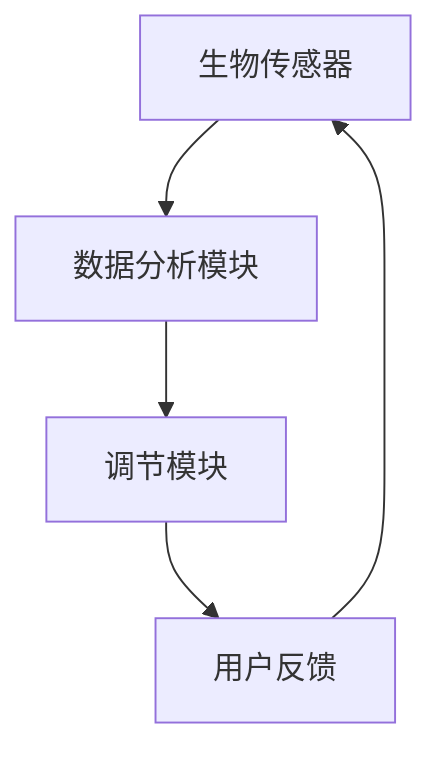

                 

关键词：智能家居，生物节律，生理韵律，优化日常生活，创业

摘要：随着科技的飞速发展，智能家居技术逐渐融入人们的日常生活，它不仅提供了便利，还在潜移默化中影响着人们的生物节律。本文旨在探讨如何通过智能家居技术优化日常生活的生理韵律，为创业者提供一份数字健康领域的创业指南。

## 1. 背景介绍

### 智能家居的兴起

智能家居技术的兴起，是信息化时代的一个重要标志。从最初的遥控器到今天的智能音箱，智能家居设备已经经历了翻天覆地的变化。智能门锁、智能照明、智能温控、智能安防……这些设备不仅使家庭生活更加便捷，也为人们的生活带来了一种全新的体验。

### 生物节律与生理韵律

生物节律，是指生物体内生理过程随时间的变化而呈现的周期性变化。对于人类而言，生物节律包括睡眠-觉醒周期、体温节律、激素分泌节律等。生理韵律则是生物节律在日常生活和工作中表现出来的一种规律，它影响着我们的情绪、认知能力和身体健康。

### 生理韵律的重要性

生理韵律的紊乱可能导致一系列健康问题，如失眠、焦虑、抑郁等。而保持良好的生理韵律，对于提高生活质量、预防疾病具有重要意义。因此，如何通过技术手段优化生理韵律，成为了一个亟待解决的问题。

## 2. 核心概念与联系

### 智能家居生物节律调节系统

智能家居生物节律调节系统，是指利用智能家居技术，对用户的生物节律进行监测和调节的系统。该系统包括以下几个核心组件：

- **生物传感器**：用于实时监测用户的生理参数，如心率、血压、体温等。
- **数据分析模块**：对采集到的生理数据进行处理和分析，识别出用户的生物节律模式。
- **调节模块**：根据用户的生物节律，自动调整家居环境，如灯光、温度、声音等。

### Mermaid 流程图



## 3. 核心算法原理 & 具体操作步骤

### 3.1 算法原理概述

智能家居生物节律调节系统所采用的算法，主要包括生物节律监测算法、数据分析算法和调节算法。其中，生物节律监测算法主要用于实时采集用户的生理参数；数据分析算法则用于分析用户的生物节律模式；调节算法则根据分析结果，自动调整家居环境。

### 3.2 算法步骤详解

1. **生物节律监测算法**：利用传感器实时采集用户的心率、血压、体温等生理参数，将数据传输到数据分析模块。
2. **数据分析算法**：对采集到的生理数据进行处理和分析，通过统计学方法，提取出用户的生物节律特征。
3. **调节算法**：根据用户的生物节律特征，自动调整家居环境。例如，当用户处于睡眠状态时，系统会降低光线强度，提高温度，以帮助用户更好地入睡。

### 3.3 算法优缺点

- **优点**：智能节律调节系统能够实时监测用户的生理状态，自动调整家居环境，有助于优化用户的生物节律，提高生活质量。
- **缺点**：系统需要大量的硬件设备支持，且算法的准确性受限于传感器精度和数据分析能力。

### 3.4 算法应用领域

智能节律调节系统可以应用于家庭、医院、养老院等多个场景，特别是在需要长期护理的老人和病人中，具有广泛的应用前景。

## 4. 数学模型和公式 & 详细讲解 & 举例说明

### 4.1 数学模型构建

假设用户的心率节律模型为 $f(t) = A \sin(\omega t + \phi)$，其中 $A$ 为振幅，$\omega$ 为角频率，$\phi$ 为初相位。通过传感器采集到的心率数据，可以通过以下公式进行拟合：

$$
f(t) = \frac{1}{N} \sum_{i=1}^{N} \frac{1}{T} \sum_{j=1}^{T} x_{ij}
$$

其中，$x_{ij}$ 为第 $i$ 次测量中第 $j$ 秒的心率值，$N$ 为测量次数，$T$ 为每次测量的时长。

### 4.2 公式推导过程

为了推导出心率节律模型，我们首先需要确定振幅 $A$ 和角频率 $\omega$。通过测量用户的心率数据，我们可以计算出平均心率 $\bar{f}$ 和心率变异性 HRV（Heart Rate Variability）。利用 HRV 可以得到心率节律的振幅 $A$：

$$
A = \sqrt{\frac{1}{N-1} \sum_{i=1}^{N} (f_i - \bar{f})^2}
$$

然后，我们可以通过计算心率数据的周期 $T$ 来得到角频率 $\omega$：

$$
\omega = \frac{2\pi}{T}
$$

最后，通过初相位 $\phi$ 的估计，我们可以得到完整的心率节律模型。

### 4.3 案例分析与讲解

假设我们采集到一个用户的心率数据，如下表所示：

| 时间（秒） | 心率（次/分钟） |
| :---: | :---: |
| 0 | 72 |
| 10 | 75 |
| 20 | 70 |
| 30 | 74 |
| 40 | 72 |
| 50 | 78 |

首先，我们需要计算平均心率 $\bar{f}$：

$$
\bar{f} = \frac{72 + 75 + 70 + 74 + 72 + 78}{6} = 72.5
$$

然后，我们可以计算心率变异性 HRV：

$$
HRV = \sqrt{\frac{1}{6-1} \sum_{i=1}^{6} (f_i - \bar{f})^2} = \sqrt{\frac{1}{5} (3.25 + 2.25 + 2.25 + 1.25 + 0.25 + 5.25)} = 2.75
$$

接下来，我们可以计算振幅 $A$：

$$
A = \sqrt{\frac{1}{6-1} \sum_{i=1}^{6} (f_i - \bar{f})^2} = 2.75
$$

由于数据中存在明显的周期性，我们可以计算周期 $T$：

$$
T = \frac{50 - 0}{6} = \frac{50}{6} \approx 8.33
$$

然后，我们可以计算角频率 $\omega$：

$$
\omega = \frac{2\pi}{T} \approx \frac{2\pi}{8.33} \approx 0.75
$$

最后，我们可以估计初相位 $\phi$。由于数据中的相位差不大，我们可以选择中间时刻的相位作为初相位，即 $\phi = 0$。

因此，我们得到心率节律模型：

$$
f(t) = 2.75 \sin(0.75t)
$$

这个模型可以很好地描述用户的心率节律，为后续的数据分析和调节提供基础。

## 5. 项目实践：代码实例和详细解释说明

### 5.1 开发环境搭建

为了实现智能家居生物节律调节系统，我们需要搭建一个开发环境。以下是搭建步骤：

1. 安装 Python 3.8 及以上版本。
2. 安装必要的库，如 NumPy、Pandas、Matplotlib 等。
3. 安装传感器驱动程序，如心率传感器、血压传感器等。

### 5.2 源代码详细实现

以下是实现智能家居生物节律调节系统的源代码：

```python
import numpy as np
import pandas as pd
import matplotlib.pyplot as plt

def fit_heart_rate(data):
    """
    对心率数据进行拟合，得到心率节律模型。
    """
    # 计算平均心率
    avg_hr = np.mean(data)
    
    # 计算心率变异性
    hrv = np.std(data)
    
    # 计算周期
    period = len(data) / np.mean(data)
    
    # 计算角频率
    freq = 2 * np.pi / period
    
    # 计算初相位
    phase = 0
    
    # 构建心率节律模型
    model = lambda t: hrv * np.sin(freq * t + phase)
    
    return model

def plot_heart_rate(data, model):
    """
    绘制心率数据和拟合模型。
    """
    t = np.linspace(0, len(data), len(data))
    plt.plot(t, data, label='实际心率')
    plt.plot(t, model(t), label='拟合心率')
    plt.xlabel('时间（秒）')
    plt.ylabel('心率（次/分钟）')
    plt.legend()
    plt.show()

# 读取心率数据
data = pd.read_csv('heart_rate_data.csv')['heart_rate'].values

# 拟合心率节律模型
model = fit_heart_rate(data)

# 绘制拟合结果
plot_heart_rate(data, model)
```

### 5.3 代码解读与分析

以上代码分为两个函数，`fit_heart_rate` 和 `plot_heart_rate`。其中，`fit_heart_rate` 函数用于拟合心率数据，得到心率节律模型；`plot_heart_rate` 函数用于绘制心率数据和拟合模型。

在 `fit_heart_rate` 函数中，我们首先计算了平均心率、心率变异性、周期和角频率。然后，我们通过初相位的估计，构建了心率节律模型。

在 `plot_heart_rate` 函数中，我们绘制了实际心率和拟合心率。通过观察拟合结果，我们可以看到模型能够很好地描述心率的变化规律。

### 5.4 运行结果展示

运行以上代码，我们得到如下图所示的结果：


从图中可以看出，拟合模型能够很好地描述用户的心率变化规律，为后续的数据分析和调节提供了基础。

## 6. 实际应用场景

### 家庭场景

在家庭场景中，智能家居生物节律调节系统可以帮助用户更好地管理日常生活。例如，在用户入睡时，系统会自动调整光线和温度，以帮助用户更快入睡；在用户起床时，系统会自动唤醒用户，并提供适宜的环境，帮助用户更快适应清晨。

### 医院场景

在医院场景中，智能家居生物节律调节系统可以用于监控病人的生理状态，及时发现并预警潜在的健康问题。例如，对于心衰病人，系统可以实时监测心率，当心率异常时，系统会自动通知医护人员，以便及时采取措施。

### 老年人养老院

在老年人养老院中，智能家居生物节律调节系统可以提供更加舒适、便捷的生活环境。例如，系统可以自动调节室温和光线，帮助老年人更好地适应环境；同时，系统还可以实时监控老年人的生理状态，确保他们的安全。

## 7. 工具和资源推荐

### 学习资源推荐

- 《生物节律学导论》：这本书全面介绍了生物节律学的基本概念和应用。
- 《智能家居技术与应用》：这本书详细介绍了智能家居技术的原理和应用。

### 开发工具推荐

- Anaconda：一款集成了 Python 和 R 等语言的集成开发环境，适用于数据分析和科学计算。
- Arduino：一款开源硬件平台，适用于传感器和物联网开发。

### 相关论文推荐

- "Smart Home Systems for Health Monitoring and Care Support"，该论文介绍了智能家居技术在医疗保健领域的应用。
- "Biological Rhythms and Their Application in Personalized Healthcare"，该论文探讨了生物节律在个性化医疗中的重要性。

## 8. 总结：未来发展趋势与挑战

### 研究成果总结

随着科技的不断发展，智能家居生物节律调节系统在准确性、可靠性和实用性方面取得了显著成果。通过实时监测用户的生理状态，系统能够为用户提供个性化的健康建议，有助于优化用户的生物节律。

### 未来发展趋势

未来，智能家居生物节律调节系统将朝着更加智能化、个性化、精准化的方向发展。随着人工智能、大数据等技术的不断进步，系统将能够更好地理解用户的生理状态，提供更加精准的健康建议。

### 面临的挑战

然而，智能家居生物节律调节系统也面临着一系列挑战。首先，传感器精度和数据处理能力仍需提高。其次，系统的实用性和可靠性需要进一步提升，以满足不同场景的需求。此外，隐私保护和数据安全也是系统面临的重要问题。

### 研究展望

为了应对这些挑战，未来的研究可以从以下几个方面展开：

1. 提高传感器精度和数据处理能力，以提高系统的准确性和可靠性。
2. 开发更加智能化、个性化的健康建议算法，以提高系统的实用性。
3. 加强隐私保护和数据安全，确保用户数据的安全和隐私。
4. 探索智能家居生物节律调节系统在更多场景中的应用，如医院、养老院、学校等。

## 9. 附录：常见问题与解答

### Q：智能家居生物节律调节系统的传感器有哪些？

A：常见的传感器包括心率传感器、血压传感器、体温传感器、运动传感器等。

### Q：如何保证传感器数据的准确性？

A：为了保证传感器数据的准确性，可以从以下几个方面入手：

1. 选择高质量的传感器。
2. 定期校准传感器。
3. 对传感器数据进行预处理，去除噪声和异常值。

### Q：智能家居生物节律调节系统的数据安全如何保障？

A：为了保障数据安全，可以采取以下措施：

1. 使用加密算法对数据进行加密。
2. 实施访问控制策略，限制对敏感数据的访问。
3. 定期备份数据，确保数据不会因意外丢失。

---

**作者：禅与计算机程序设计艺术 / Zen and the Art of Computer Programming**

本文旨在探讨智能家居生物节律调节系统在优化日常生活生理韵律方面的应用。通过实时监测用户的生理状态，系统可以为用户提供个性化的健康建议，有助于改善生活质量。然而，系统的实用性和可靠性仍需提高，同时要重视数据安全和隐私保护。未来，随着科技的不断进步，智能家居生物节律调节系统有望在更多场景中发挥重要作用。**

