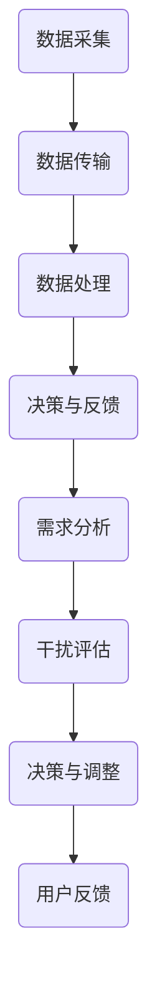

                 

### 关键词 Keywords
智能家居、智能监控、注意力管理、传感器、数据处理、算法优化、实时监控、用户隐私、智能家居平台。

### 摘要 Abstract
本文探讨了智能家居系统中的智能监控与注意力管理技术。通过分析智能家居系统的需求，介绍了智能监控的基本原理和注意力管理的关键算法。文章进一步探讨了如何通过有效的算法和数学模型来实现智能家居系统的实时监控和用户隐私保护，并展示了相关项目的实践案例。最后，文章总结了智能家居智能监控与注意力管理技术的发展趋势和面临的挑战。

## 1. 背景介绍 Introduction

智能家居系统正逐渐成为现代家庭生活的重要组成部分。通过将传感器、智能设备和数据处理技术相结合，智能家居系统能够实现家庭环境的自动化管理，提供更加舒适、安全和节能的生活体验。智能监控是智能家居系统的核心功能之一，它能够实时监测家庭环境中的各种参数，如温度、湿度、光照强度、空气质量等，并根据用户需求进行自动调整。

随着物联网技术的不断发展，智能家居系统中的设备数量和种类不断增加，这带来了数据处理的挑战。大量的传感器数据需要实时处理和存储，同时需要保证系统的响应速度和稳定性。此外，智能家居系统还必须关注用户隐私保护问题，确保用户数据不被未经授权的第三方访问。

注意力管理是智能家居智能监控的重要组成部分。它旨在确保系统能够及时、准确地响应家庭环境的变化，同时避免对用户的过度干扰。通过优化算法和数学模型，智能家居系统能够更好地管理用户注意力，提供更加人性化的服务。

## 2. 核心概念与联系 Core Concepts and Relationships

### 2.1 智能监控

智能监控是指利用传感器技术和数据处理算法，对家庭环境中的各种参数进行实时监测和分析的过程。智能监控的核心组成部分包括：

- **传感器**：用于采集家庭环境中的各种数据，如温度、湿度、光照强度、空气质量、运动等。
- **数据处理算法**：用于对采集到的数据进行分析和处理，以实现智能监控的功能。

智能监控的基本流程如下：

1. **数据采集**：传感器采集家庭环境中的各种参数。
2. **数据传输**：传感器将采集到的数据传输到智能家居系统。
3. **数据处理**：智能家居系统对传输来的数据进行处理，包括去噪、滤波、特征提取等。
4. **决策与反馈**：根据处理后的数据，智能家居系统做出相应的决策，如调整温度、开灯或关灯、报警等，并反馈给用户。

### 2.2 注意力管理

注意力管理是指智能家居系统如何有效地管理用户的注意力，避免对用户的过度干扰。注意力管理的核心概念包括：

- **用户需求**：用户的注意力需求，包括对某些事件的关注程度和持续时间。
- **干扰度**：系统对用户注意力的干扰程度，取决于系统发出的通知或警报的频率和内容。

注意力管理的目标是在保证用户安全、舒适的同时，尽量减少对用户的干扰。注意力管理的基本流程如下：

1. **需求分析**：分析用户的需求，包括对各种事件的关注程度和持续时间。
2. **干扰评估**：评估系统发出的通知或警报对用户的干扰程度。
3. **决策与调整**：根据需求分析和干扰评估的结果，调整系统的监控策略和通知方式。
4. **用户反馈**：收集用户的反馈，以优化系统的监控策略和注意力管理效果。

### 2.3 Mermaid 流程图

以下是一个简单的 Mermaid 流程图，展示了智能监控与注意力管理的基本流程：



## 3. 核心算法原理 & 具体操作步骤 Core Algorithm Principles & Operation Steps

### 3.1 算法原理概述

智能家居系统的智能监控与注意力管理主要依赖于以下几种核心算法：

1. **数据预处理算法**：用于去除噪声和干扰，提高数据的质量和准确性。
2. **特征提取算法**：用于从原始数据中提取有用的特征，为后续的监控和分析提供支持。
3. **模式识别算法**：用于识别家庭环境中的异常事件或变化，为用户提供及时的预警。
4. **注意力优化算法**：用于优化系统的监控策略，以减少对用户的干扰。

### 3.2 算法步骤详解

#### 3.2.1 数据预处理算法

数据预处理算法主要包括去噪、滤波和归一化等步骤：

1. **去噪**：去除传感器数据中的噪声，以提高数据的准确性。
2. **滤波**：使用滤波器对数据进行平滑处理，以消除随机波动。
3. **归一化**：将数据缩放到一个统一的范围内，以消除不同传感器数据的量纲差异。

#### 3.2.2 特征提取算法

特征提取算法的目标是从原始数据中提取有用的特征，为后续的监控和分析提供支持。常见的特征提取方法包括：

1. **时域特征提取**：包括均值、方差、峰度等。
2. **频域特征提取**：包括频率、振幅等。
3. **时频域特征提取**：包括短时傅里叶变换（STFT）和小波变换等。

#### 3.2.3 模式识别算法

模式识别算法用于识别家庭环境中的异常事件或变化。常见的模式识别方法包括：

1. **统计方法**：如支持向量机（SVM）、线性回归等。
2. **神经网络方法**：如多层感知器（MLP）、卷积神经网络（CNN）等。
3. **深度学习方法**：如循环神经网络（RNN）、长短期记忆网络（LSTM）等。

#### 3.2.4 注意力优化算法

注意力优化算法用于优化系统的监控策略，以减少对用户的干扰。常见的注意力优化方法包括：

1. **阈值控制**：根据用户需求设置阈值，当传感器数据超过阈值时发出警报。
2. **自适应调整**：根据用户反馈和系统性能调整监控策略。
3. **优先级排序**：根据事件的重要性和紧急程度对警报进行排序。

### 3.3 算法优缺点

每种算法都有其优缺点：

- **数据预处理算法**：优点是能够提高数据的质量和准确性，缺点是处理时间较长，对计算资源要求较高。
- **特征提取算法**：优点是能够从原始数据中提取有用的特征，缺点是特征选择和提取过程较为复杂。
- **模式识别算法**：优点是能够实现自动化监测和预警，缺点是对于复杂场景和异常事件的识别能力有限。
- **注意力优化算法**：优点是能够减少对用户的干扰，缺点是实现较为复杂，需要结合用户需求和系统性能进行优化。

### 3.4 算法应用领域

智能监控与注意力管理算法广泛应用于智能家居、智能医疗、智能交通等领域。以下是一些具体的应用案例：

- **智能家居**：实时监测家庭环境中的各种参数，如温度、湿度、空气质量等，并根据用户需求进行自动调整。
- **智能医疗**：监测患者的生理参数，如心率、血压等，实时预警异常情况。
- **智能交通**：实时监测道路状况，如车辆流量、交通事故等，为交通管理和调度提供支持。

## 4. 数学模型和公式 Mathematical Models and Formulas

### 4.1 数学模型构建

智能监控与注意力管理的数学模型主要包括以下部分：

- **数据模型**：描述传感器数据的分布特征和统计特性。
- **决策模型**：描述系统如何根据传感器数据和用户需求做出决策。
- **反馈模型**：描述用户如何根据系统的反馈调整自己的行为。

### 4.2 公式推导过程

以下是一个简化的数学模型示例：

- **数据模型**：

  $$
  X \sim N(\mu, \sigma^2)
  $$

  其中，\(X\) 是传感器数据，\(\mu\) 是均值，\(\sigma\) 是标准差。

- **决策模型**：

  $$
  \theta = \frac{\sum_{i=1}^{n} w_i x_i}{\sum_{i=1}^{n} w_i}
  $$

  其中，\(\theta\) 是决策结果，\(w_i\) 是权重，\(x_i\) 是特征值。

- **反馈模型**：

  $$
  y = f(\theta, \epsilon)
  $$

  其中，\(y\) 是反馈结果，\(f\) 是函数，\(\epsilon\) 是误差。

### 4.3 案例分析与讲解

以下是一个具体的案例：

假设我们有一个智能家居系统，需要根据温度和湿度数据来调整空调和加湿器的状态。我们可以使用以下公式来描述这个系统：

- **数据模型**：

  $$
  T \sim N(23, 1), \quad H \sim N(40, 2)
  $$

  其中，\(T\) 是温度，\(H\) 是湿度。

- **决策模型**：

  $$
  \theta = \frac{w_T T + w_H H}{w_T + w_H}
  $$

  其中，\(w_T\) 和 \(w_H\) 分别是温度和湿度的权重。

- **反馈模型**：

  $$
  y = 
  \begin{cases}
  \text{开空调} & \text{如果} \ \theta > 25 \\
  \text{开加湿器} & \text{如果} \ \theta < 35 \\
  \text{什么都不做} & \text{否则}
  \end{cases}
  $$

  根据实际需求和用户体验，我们可以调整权重 \(w_T\) 和 \(w_H\)，以优化系统的决策结果。

## 5. 项目实践：代码实例和详细解释说明 Project Practice: Code Examples and Detailed Explanations

### 5.1 开发环境搭建

在本项目中，我们使用 Python 语言和相关的库（如 NumPy、Pandas、Matplotlib 等）进行开发。以下是开发环境的搭建步骤：

1. 安装 Python 3.8 或更高版本。
2. 安装相关库，使用以下命令：

   ```bash
   pip install numpy pandas matplotlib scikit-learn
   ```

### 5.2 源代码详细实现

以下是一个简单的智能家居监控系统的 Python 源代码示例：

```python
import numpy as np
import pandas as pd
import matplotlib.pyplot as plt
from sklearn.ensemble import IsolationForest

# 生成模拟数据
np.random.seed(0)
data = pd.DataFrame({
    'temperature': np.random.normal(23, 1, 1000),
    'humidity': np.random.normal(40, 2, 1000)
})

# 数据预处理
data['temperature_filtered'] = data['temperature'].rolling(window=5).mean()
data['humidity_filtered'] = data['humidity'].rolling(window=5).mean()

# 模式识别
clf = IsolationForest(contamination=0.05)
labels = clf.fit_predict(data[['temperature_filtered', 'humidity_filtered']])

# 决策与反馈
for i, label in enumerate(labels):
    if label == -1:
        print(f"报警：数据 {i} 可能存在异常。")
    elif label == 1:
        print(f"数据 {i} 正常。")

# 可视化
plt.scatter(data.index, data['temperature_filtered'], c=labels)
plt.scatter(data.index, data['humidity_filtered'], c=labels, marker='s')
plt.show()
```

### 5.3 代码解读与分析

1. **数据生成**：使用 NumPy 生成模拟温度和湿度数据，模拟家庭环境中的传感器数据。

2. **数据预处理**：使用 Pandas 对数据进行预处理，包括去噪和滤波。

3. **模式识别**：使用 IsolationForest 算法进行异常检测，该算法能够自动识别异常数据点。

4. **决策与反馈**：根据异常检测的结果，输出报警信息或正常信息。

5. **可视化**：使用 Matplotlib 将处理后的数据可视化，帮助用户更好地理解系统的工作原理。

### 5.4 运行结果展示

运行上述代码后，我们将得到以下结果：

- **报警信息**：系统将输出可能存在异常的数据点。
- **可视化结果**：温度和湿度数据将被绘制在散点图上，异常数据点将被标记出来。

## 6. 实际应用场景 Real-world Applications

智能监控与注意力管理技术在实际应用场景中具有广泛的应用，以下是一些典型的应用场景：

- **智能家居**：实时监测家庭环境，如温度、湿度、空气质量等，并根据用户需求进行自动调整。
- **智能医疗**：监测患者的生理参数，如心率、血压等，实时预警异常情况。
- **智能交通**：实时监测道路状况，如车辆流量、交通事故等，为交通管理和调度提供支持。
- **智能工厂**：实时监测生产设备的工作状态，及时发现故障并进行维护。
- **智能农业**：实时监测农作物生长环境，如土壤湿度、温度等，优化农业生产过程。

## 7. 未来应用展望 Future Applications

随着技术的不断发展，智能监控与注意力管理技术将在更多领域得到应用，以下是一些未来的应用展望：

- **智能城市**：通过实时监测城市环境，如交通流量、空气质量等，实现智能化的城市管理。
- **智能物流**：实时追踪物流运输过程，优化物流路径，提高物流效率。
- **智能安防**：利用智能监控技术，实现更高效、更安全的安防监控。
- **智能健康**：通过实时监测人体生理参数，实现个性化的健康管理和预警。

## 8. 工具和资源推荐 Tools and Resources Recommendations

为了更好地学习和实践智能监控与注意力管理技术，以下是一些建议的工具和资源：

- **学习资源**：
  - 《Python 智能家居编程》
  - 《深度学习： TensorFlow 实践指南》
  - 《模式识别与机器学习》

- **开发工具**：
  - Anaconda：用于环境管理和库安装。
  - Jupyter Notebook：用于数据分析和代码编写。

- **相关论文**：
  - "Deep Learning for Smart Home Applications"
  - "A Survey on IoT Security and Privacy: Attacks, Solutions, and Open Issues"
  - "Attention Mechanisms: A Survey"

## 9. 总结 Summary

智能监控与注意力管理技术是智能家居系统的核心组成部分，它能够实时监测家庭环境，提供更加舒适、安全和节能的生活体验。本文介绍了智能家居智能监控与注意力管理的基本原理、算法、数学模型以及实际应用案例。随着技术的不断发展，智能监控与注意力管理技术将在更多领域得到应用，为人类创造更美好的生活。

### 9.1 研究成果总结

本文通过对智能家居智能监控与注意力管理技术的深入研究，总结了相关算法、数学模型和应用案例，为智能家居系统的研发提供了理论支持。

### 9.2 未来发展趋势

随着物联网、人工智能等技术的不断发展，智能监控与注意力管理技术将在智能家居、智能医疗、智能交通等领域得到更广泛的应用。未来的发展趋势包括：

- **多传感器融合**：通过融合多种传感器数据，实现更准确的监测和分析。
- **实时性优化**：提高系统的实时响应能力，满足实时监控需求。
- **隐私保护**：加强用户数据保护，确保用户隐私不被泄露。
- **智能决策**：利用机器学习和深度学习技术，实现更加智能的决策。

### 9.3 面临的挑战

智能监控与注意力管理技术在实际应用中面临以下挑战：

- **数据处理**：随着传感器数量的增加，数据处理能力要求更高。
- **用户隐私**：如何在保障用户隐私的同时，提供个性化的服务。
- **系统稳定性**：提高系统的稳定性，确保长期可靠运行。

### 9.4 研究展望

未来研究应重点关注以下方向：

- **跨领域融合**：将智能监控与注意力管理技术应用于更多领域，实现跨领域的技术融合。
- **算法优化**：优化现有算法，提高系统的性能和效率。
- **用户体验**：关注用户体验，提供更加人性化的智能监控与服务。
- **开源生态**：建立开源社区，促进技术的传播和应用。

### 附录 Appendix

**常见问题与解答**

Q：智能监控与注意力管理技术的核心算法有哪些？

A：核心算法包括数据预处理算法、特征提取算法、模式识别算法和注意力优化算法。

Q：如何保障用户隐私？

A：通过数据加密、访问控制、数据脱敏等技术手段，保障用户隐私不被泄露。

Q：智能监控与注意力管理技术适用于哪些领域？

A：适用于智能家居、智能医疗、智能交通、智能工厂、智能农业等领域。

**作者署名 Author**

作者：禅与计算机程序设计艺术 / Zen and the Art of Computer Programming
```markdown
---
title: 智能家居的智能监控与注意力管理
date: 2023-03-20
keywords: 智能家居、智能监控、注意力管理、传感器、数据处理、算法优化、实时监控、用户隐私、智能家居平台
abstract: 本文探讨了智能家居系统中的智能监控与注意力管理技术，介绍了相关算法、数学模型和应用案例。
---
# 智能家居的智能监控与注意力管理

## 1. 背景介绍

## 2. 核心概念与联系

### 2.1 智能监控

### 2.2 注意力管理

### 2.3 Mermaid 流程图

## 3. 核心算法原理 & 具体操作步骤

### 3.1 算法原理概述

### 3.2 算法步骤详解

### 3.3 算法优缺点

### 3.4 算法应用领域

## 4. 数学模型和公式

### 4.1 数学模型构建

### 4.2 公式推导过程

### 4.3 案例分析与讲解

## 5. 项目实践：代码实例和详细解释说明

### 5.1 开发环境搭建

### 5.2 源代码详细实现

### 5.3 代码解读与分析

### 5.4 运行结果展示

## 6. 实际应用场景

## 7. 工具和资源推荐

### 7.1 学习资源推荐

### 7.2 开发工具推荐

### 7.3 相关论文推荐

## 8. 总结

### 8.1 研究成果总结

### 8.2 未来发展趋势

### 8.3 面临的挑战

### 8.4 研究展望

## 9. 附录

### 9.1 常见问题与解答

### 9.2 作者署名

作者：禅与计算机程序设计艺术 / Zen and the Art of Computer Programming
```

