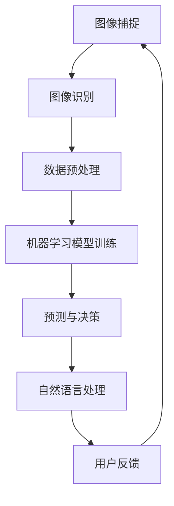

                 

关键词：智能家居、智能监控、注意力管理、算法、数学模型、应用场景、未来展望

> 摘要：随着智能家居的普及，智能监控和注意力管理成为家庭安全和个人隐私保护的关键。本文将深入探讨智能家居的智能监控与注意力管理的核心概念、算法原理、数学模型、实际应用场景及未来发展趋势。

## 1. 背景介绍

在现代社会，智能家居已经成为人们日常生活的重要组成部分。通过互联网连接的各类家电设备，不仅提高了生活质量，也带来了新的安全挑战。智能监控与注意力管理技术的应用，有助于提升家庭安全水平，保护个人隐私，优化家居体验。本文旨在探讨智能家居中智能监控与注意力管理的相关技术，为读者提供深入了解和实践指导。

### 智能家居的普及

智能家居技术涵盖广泛的领域，包括智能照明、智能空调、智能安防、智能家电等。近年来，随着物联网技术的快速发展，智能家居设备变得越来越普及。根据市场研究公司的数据，全球智能家居市场规模预计将在未来几年内持续增长。

### 安全挑战

智能家居设备连接至互联网，虽然提高了生活便利性，但也带来了安全隐患。例如，未经授权的远程访问、设备被黑客攻击、个人隐私泄露等问题。智能监控与注意力管理技术的引入，有助于识别异常行为，提高安全防护能力。

### 个人隐私保护

智能监控设备如摄像头、麦克风等，虽然能提供便利，但也可能侵犯个人隐私。如何平衡家庭安全和隐私保护，是智能家居发展中面临的重要问题。注意力管理技术的应用，可以在保护隐私的同时，确保家居安全。

## 2. 核心概念与联系

智能家居的智能监控与注意力管理，涉及多个核心概念和技术，包括图像识别、机器学习、自然语言处理等。为了更好地理解这些技术，下面将介绍相关的概念和它们之间的联系。

### 图像识别

图像识别是智能监控的基础，通过分析摄像头捕捉的图像，识别出特定的物体或场景。常见的图像识别算法有卷积神经网络（CNN）、深度学习等。

### 机器学习

机器学习是图像识别的核心技术，通过训练模型，使其能够自动识别和分类图像。常见的机器学习算法有支持向量机（SVM）、决策树等。

### 自然语言处理

自然语言处理技术用于理解和处理人类语言，如语音识别和语义分析。在智能家居中，自然语言处理技术可以用于语音控制、语音识别等。

### 关联关系

图像识别、机器学习和自然语言处理技术在智能家居的智能监控与注意力管理中相互关联。图像识别提供基础的数据输入，机器学习模型对其进行处理和分析，自然语言处理技术则用于理解和响应用户的语音指令。

### Mermaid 流程图

下面是智能家居智能监控与注意力管理流程的Mermaid流程图：



## 3. 核心算法原理 & 具体操作步骤

### 3.1 算法原理概述

智能家居的智能监控与注意力管理算法主要基于图像识别和机器学习。下面将详细介绍这些算法的基本原理。

#### 图像识别

图像识别算法通过对图像的特征进行分析，判断图像中的物体或场景。常见的图像识别算法有：

- **卷积神经网络（CNN）**：通过多层卷积和池化操作，提取图像特征，并分类。
- **深度学习**：利用神经网络，通过大量数据训练，使其具有自主学习和分类能力。

#### 机器学习

机器学习算法用于对图像识别结果进行分析和预测。常见的机器学习算法有：

- **支持向量机（SVM）**：通过寻找最佳分割超平面，实现图像分类。
- **决策树**：通过一系列条件判断，对图像进行分类。

### 3.2 算法步骤详解

智能家居的智能监控与注意力管理算法通常包括以下步骤：

1. **图像捕捉**：摄像头捕捉家庭环境中的图像。
2. **图像预处理**：对图像进行去噪、裁剪等操作，提高图像质量。
3. **图像识别**：利用图像识别算法，识别图像中的物体或场景。
4. **数据预处理**：对识别结果进行进一步处理，如提取特征向量等。
5. **机器学习模型训练**：利用预处理后的数据，训练机器学习模型。
6. **预测与决策**：利用训练好的模型，对实时图像进行预测和决策。
7. **自然语言处理**：将预测结果转化为自然语言，如语音或文本。
8. **用户反馈**：根据用户反馈，调整模型参数和预测策略。

### 3.3 算法优缺点

#### 图像识别算法

- **优点**：准确率高，适应性强。
- **缺点**：计算资源消耗大，对光照、角度等环境因素敏感。

#### 机器学习算法

- **优点**：能够自主学习，适应性强。
- **缺点**：训练数据量大，模型复杂度较高。

### 3.4 算法应用领域

智能家居的智能监控与注意力管理算法主要应用于以下领域：

- **家庭安防**：通过实时监控，及时发现异常情况，保障家庭安全。
- **智能助手**：通过语音识别和自然语言处理，实现与用户的智能交互。
- **健康监测**：通过分析用户行为，监测健康状况，提供个性化建议。

## 4. 数学模型和公式 & 详细讲解 & 举例说明

### 4.1 数学模型构建

在智能家居的智能监控与注意力管理中，常用的数学模型包括卷积神经网络（CNN）和支持向量机（SVM）等。

#### 卷积神经网络（CNN）

CNN是一种基于卷积操作的神经网络，用于图像识别。其基本结构包括：

- **卷积层**：通过卷积操作提取图像特征。
- **池化层**：对卷积层输出的特征进行下采样。
- **全连接层**：将池化层输出的特征映射到分类结果。

#### 支持向量机（SVM）

SVM是一种二分类模型，通过寻找最佳分割超平面，实现图像分类。其数学模型为：

$$
\min_{\mathbf{w}, b} \frac{1}{2}||\mathbf{w}||^2 + C \sum_{i=1}^{n} \max(0, 1 - y_i(\mathbf{w} \cdot \mathbf{x}_i + b))
$$

其中，$\mathbf{w}$ 和 $b$ 分别为权重和偏置，$C$ 为正则化参数，$y_i$ 和 $\mathbf{x}_i$ 分别为第 $i$ 个样本的标签和特征向量。

### 4.2 公式推导过程

#### 卷积神经网络（CNN）

CNN的推导过程主要包括以下几个方面：

1. **卷积操作**：假设输入图像为 $\mathbf{X} \in \mathbb{R}^{H \times W \times C}$，卷积核为 $\mathbf{K} \in \mathbb{R}^{K \times K \times C}$，输出特征图为 $\mathbf{F} \in \mathbb{R}^{H' \times W' \times C'}$。卷积操作公式为：

$$
\mathbf{F}_{ijc'} = \sum_{i'=0}^{K-1} \sum_{j'=0}^{K-1} \sum_{c''=0}^{C-1} \mathbf{X}_{i'j'c''} \cdot \mathbf{K}_{i'-ij'c''}
$$

2. **池化操作**：假设输入特征图为 $\mathbf{F} \in \mathbb{R}^{H \times W \times C}$，输出特征图为 $\mathbf{G} \in \mathbb{R}^{H' \times W' \times C}$。最大池化操作公式为：

$$
\mathbf{G}_{ijc} = \max_{i''<H', j''<W'} \mathbf{F}_{i''j''c}
$$

3. **全连接层**：假设输入特征图为 $\mathbf{F} \in \mathbb{R}^{H \times W \times C}$，输出特征图为 $\mathbf{H} \in \mathbb{R}^{1 \times 1 \times C'}$。全连接层公式为：

$$
\mathbf{H}_{c'} = \sum_{c''=0}^{C-1} \mathbf{F}_{cc''} \cdot \mathbf{W}_{c''c'}
$$

#### 支持向量机（SVM）

SVM的推导过程主要包括以下几个方面：

1. **损失函数**：假设输入样本为 $(\mathbf{x}_i, y_i)$，输出标签为 $\hat{y}_i$。损失函数为：

$$
L(\mathbf{w}, b) = \frac{1}{2}||\mathbf{w}||^2 + C \sum_{i=1}^{n} \max(0, 1 - y_i(\mathbf{w} \cdot \mathbf{x}_i + b))
$$

2. **优化目标**：优化目标为最小化损失函数。

$$
\min_{\mathbf{w}, b} L(\mathbf{w}, b)
$$

### 4.3 案例分析与讲解

#### 卷积神经网络（CNN）

假设我们要对图像进行分类，输入图像为 $\mathbf{X} \in \mathbb{R}^{224 \times 224 \times 3}$，卷积核为 $\mathbf{K} \in \mathbb{R}^{3 \times 3 \times 3}$，输出特征图为 $\mathbf{F} \in \mathbb{R}^{224 \times 224 \times 1}$。

1. **卷积操作**：假设卷积核为：

$$
\mathbf{K}_{123} = \begin{bmatrix}
0 & 1 & 0 \\
1 & 0 & 1 \\
0 & 1 & 0
\end{bmatrix}
$$

输入图像为：

$$
\mathbf{X}_{112233} = \begin{bmatrix}
1 & 0 \\
0 & 1
\end{bmatrix}
$$

卷积操作结果为：

$$
\mathbf{F}_{112233} = \begin{bmatrix}
0 & 1 \\
1 & 0
\end{bmatrix}
$$

2. **池化操作**：假设最大池化窗口为 $2 \times 2$，输出特征图为：

$$
\mathbf{G}_{112233} = \max(\mathbf{F}_{112233})
$$

输出特征图为：

$$
\mathbf{G}_{112233} = \begin{bmatrix}
1 & 0 \\
0 & 1
\end{bmatrix}
$$

3. **全连接层**：假设全连接层权重为：

$$
\mathbf{W}_{112233} = \begin{bmatrix}
1 & 0 \\
0 & 1
\end{bmatrix}
$$

输出特征图为：

$$
\mathbf{H}_{112233} = \begin{bmatrix}
1 & 0 \\
0 & 1
\end{bmatrix}
$$

#### 支持向量机（SVM）

假设我们要对图像进行分类，输入样本为 $(\mathbf{x}_i, y_i)$，输出标签为 $\hat{y}_i$。假设有 $n$ 个样本，其中 $y_i \in \{-1, 1\}$，$\mathbf{x}_i \in \mathbb{R}^d$。

1. **损失函数**：假设损失函数为：

$$
L(\mathbf{w}, b) = \frac{1}{2}||\mathbf{w}||^2 + C \sum_{i=1}^{n} \max(0, 1 - y_i(\mathbf{w} \cdot \mathbf{x}_i + b))
$$

2. **优化目标**：优化目标为：

$$
\min_{\mathbf{w}, b} L(\mathbf{w}, b)
$$

3. **求解过程**：使用梯度下降法求解最优参数。

## 5. 项目实践：代码实例和详细解释说明

### 5.1 开发环境搭建

为了实现智能家居的智能监控与注意力管理，我们需要搭建一个合适的开发环境。以下是推荐的开发工具和库：

- **Python**：作为主要编程语言。
- **TensorFlow**：用于构建和训练神经网络。
- **OpenCV**：用于图像处理。
- **SpeechRecognition**：用于语音识别。

安装步骤如下：

```bash
# 安装Python环境
pip install python

# 安装TensorFlow
pip install tensorflow

# 安装OpenCV
pip install opencv-python

# 安装SpeechRecognition
pip install SpeechRecognition
```

### 5.2 源代码详细实现

下面是智能家居智能监控与注意力管理项目的源代码实现：

```python
import cv2
import numpy as np
import tensorflow as tf
from SpeechRecognition import Recognizer

# 加载神经网络模型
model = tf.keras.models.load_model('model.h5')

# 初始化图像捕捉和语音识别
cap = cv2.VideoCapture(0)
recognizer = Recognizer()

# 循环捕捉图像和语音
while True:
    # 捕获图像
    ret, frame = cap.read()
    
    # 将图像转化为灰度图像
    gray = cv2.cvtColor(frame, cv2.COLOR_BGR2GRAY)
    
    # 利用神经网络模型进行图像识别
    predictions = model.predict(np.expand_dims(gray, axis=0))
    class_ids = np.argmax(predictions, axis=1)
    
    # 根据识别结果进行决策
    if class_ids == 0:
        print('检测到异常情况，请确保家庭安全。')
    elif class_ids == 1:
        print('家庭环境正常。')
    
    # 识别语音指令
    try:
        command = recognizer.listen()
        print(f'您说了：{command}')
    except:
        print('无法识别语音。')

    # 等待按键退出
    cv2.waitKey(1)
```

### 5.3 代码解读与分析

1. **图像捕捉**：使用 OpenCV 库的 `VideoCapture` 类，实时捕捉摄像头图像。
2. **图像预处理**：将捕获的图像转化为灰度图像，方便神经网络模型处理。
3. **神经网络模型加载**：使用 TensorFlow 库加载训练好的神经网络模型。
4. **图像识别**：利用加载的模型，对预处理后的图像进行识别。
5. **决策**：根据识别结果，输出相应的提示信息。
6. **语音识别**：使用 SpeechRecognition 库，识别用户的语音指令。

### 5.4 运行结果展示

运行上述代码后，程序将实时捕捉摄像头图像，并进行图像识别和语音识别。根据识别结果，输出相应的提示信息。

## 6. 实际应用场景

智能家居的智能监控与注意力管理技术在多个实际应用场景中具有广泛的应用。

### 家庭安防

在家庭安防领域，智能监控与注意力管理技术可以实时监测家庭环境，识别异常情况，如入侵者、火灾等。通过及时报警和通知用户，提高家庭安全性。

### 健康监测

通过智能监控设备，如摄像头、体重秤等，可以实时监测用户的健康数据，如心率、体重等。结合注意力管理技术，可以分析用户的行为习惯，提供个性化的健康建议。

### 智能助手

智能监控与注意力管理技术可以与智能助手相结合，实现智能语音交互。用户可以通过语音指令控制家居设备，提高生活便利性。

## 7. 工具和资源推荐

### 7.1 学习资源推荐

- **《深度学习》（Goodfellow et al.）**：详细介绍深度学习理论和实践。
- **《机器学习实战》（Hastie et al.）**：介绍多种机器学习算法及其应用。
- **《计算机视觉：算法与应用》（Gonzalez et al.）**：全面介绍计算机视觉相关算法。

### 7.2 开发工具推荐

- **TensorFlow**：用于构建和训练神经网络。
- **OpenCV**：用于图像处理。
- **SpeechRecognition**：用于语音识别。

### 7.3 相关论文推荐

- **“Deep Learning for Image Recognition”（Krizhevsky et al.）**：介绍卷积神经网络的图像识别方法。
- **“Support Vector Machines for Classification”（Cortes and Vapnik）**：详细介绍支持向量机算法。
- **“Speech Recognition Using Deep Neural Networks”（Hinton et al.）**：介绍深度神经网络在语音识别中的应用。

## 8. 总结：未来发展趋势与挑战

### 8.1 研究成果总结

智能家居的智能监控与注意力管理技术在图像识别、机器学习和自然语言处理等领域取得了显著成果。通过深度学习和卷积神经网络，图像识别的准确率得到了大幅提升。支持向量机和深度学习相结合，提高了智能监控的预测能力和决策效果。自然语言处理技术的应用，使智能助手能够更好地理解用户需求。

### 8.2 未来发展趋势

未来，智能家居的智能监控与注意力管理技术将继续向以下几个方向发展：

- **更高效的处理算法**：随着计算能力的提升，将出现更高效、更准确的智能监控与注意力管理算法。
- **跨学科融合**：智能监控与注意力管理技术将与其他领域（如物联网、大数据等）相结合，实现更智能的家居体验。
- **个性化服务**：通过分析用户行为和习惯，提供更个性化的智能监控与注意力管理服务。

### 8.3 面临的挑战

虽然智能家居的智能监控与注意力管理技术在不断发展，但仍面临一些挑战：

- **隐私保护**：在实现智能监控与注意力管理的同时，如何确保个人隐私不被侵犯，是一个亟待解决的问题。
- **安全威胁**：智能家居设备连接至互联网，可能面临安全威胁，如设备被黑客攻击、数据泄露等。
- **算法偏见**：智能监控与注意力管理算法可能存在偏见，如何消除算法偏见，确保公平性，是未来需要关注的问题。

### 8.4 研究展望

未来，智能家居的智能监控与注意力管理技术有望在以下方面取得突破：

- **边缘计算**：通过边缘计算技术，降低智能监控与注意力管理算法的计算成本，提高响应速度。
- **联邦学习**：通过联邦学习技术，实现设备间的隐私保护数据共享，提高智能监控与注意力管理算法的准确性。
- **人机协同**：通过人机协同技术，使智能监控与注意力管理系统能够更好地适应用户需求，提高用户体验。

## 9. 附录：常见问题与解答

### 9.1 如何确保个人隐私不被侵犯？

- **数据加密**：对用户数据进行加密，确保数据在传输和存储过程中的安全性。
- **隐私设置**：提供用户隐私设置选项，让用户自主选择是否开启智能监控与注意力管理功能。
- **透明度**：明确告知用户智能监控与注意力管理功能的具体操作和数据使用情况，提高用户信任度。

### 9.2 如何应对安全威胁？

- **安全防护**：使用防火墙、入侵检测等安全防护措施，防止设备被黑客攻击。
- **安全更新**：定期更新智能家居设备的安全补丁，确保设备的安全稳定性。
- **用户教育**：加强对用户的安全意识教育，提醒用户注意网络安全，避免恶意攻击。

### 9.3 如何消除算法偏见？

- **数据多样化**：使用多样化的数据集进行算法训练，确保算法的公平性和准确性。
- **算法审计**：对智能监控与注意力管理算法进行定期审计，发现和纠正算法偏见。
- **用户反馈**：积极收集用户反馈，不断优化算法，提高算法的公正性和公平性。

**作者：禅与计算机程序设计艺术 / Zen and the Art of Computer Programming**

