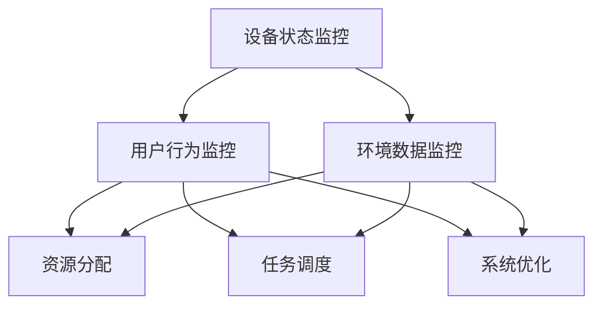

                 

关键词：智能家居，智能监控，注意力管理，数据处理，算法优化，物联网，实时监控，安全性

摘要：随着物联网技术的发展，智能家居系统日益普及。然而，智能家居系统的智能监控与注意力管理成为了一个关键问题。本文将探讨智能家居系统中的智能监控与注意力管理，分析其核心概念、算法原理、数学模型，并通过具体项目实践进行详细解释和实例展示，旨在为智能家居系统的研发提供理论指导和实践参考。

## 1. 背景介绍

近年来，智能家居系统在全球范围内迅速发展。智能家居系统通过物联网技术将各种家电、照明、安全设备等连接在一起，实现自动化控制和远程监控。然而，随着设备数量的增加，如何实现有效的智能监控和注意力管理成为了智能家居系统研发中的一个重要问题。

智能监控是指在智能家居系统中对各种设备状态、用户行为和环境数据进行实时监控和分析。注意力管理则是指对用户需求、设备性能和系统资源进行合理分配和优化，以确保系统高效运行和用户满意度。有效的智能监控与注意力管理能够提高智能家居系统的安全性和可靠性，提升用户体验。

## 2. 核心概念与联系

### 2.1 智能监控

智能监控的核心概念包括设备状态监控、用户行为监控和环境数据监控。设备状态监控是指对智能家居系统中的各种设备（如灯光、空调、门锁等）的工作状态进行实时监控，确保设备正常运行。用户行为监控是指对用户在智能家居系统中的操作行为进行监控，了解用户需求和行为模式。环境数据监控是指对室内外的环境参数（如温度、湿度、光照等）进行实时监测，为智能家居系统的自动控制和优化提供数据支持。

### 2.2 注意力管理

注意力管理的核心概念包括资源分配、任务调度和系统优化。资源分配是指对系统资源（如CPU、内存、网络带宽等）进行合理分配，确保各个设备能够高效运行。任务调度是指根据用户需求、设备性能和系统资源状况，合理调度各个任务，提高系统运行效率。系统优化是指通过算法优化、系统调整等技术手段，提高智能家居系统的整体性能和可靠性。

### 2.3 Mermaid 流程图

为了更好地展示智能监控与注意力管理的核心概念和联系，我们使用Mermaid绘制一个流程图。



## 3. 核心算法原理 & 具体操作步骤

### 3.1 算法原理概述

智能监控与注意力管理的核心算法主要包括数据采集与预处理、特征提取与筛选、实时监控与预警、资源分配与调度、系统优化与调整等。这些算法相互关联，共同实现智能家居系统的智能监控与注意力管理。

### 3.2 算法步骤详解

#### 3.2.1 数据采集与预处理

数据采集是指从智能家居系统中的各种设备、传感器和网络接口获取数据。数据预处理包括数据清洗、去噪、归一化等步骤，以提高数据质量和算法性能。

#### 3.2.2 特征提取与筛选

特征提取是指从原始数据中提取有用的信息，形成特征向量。特征筛选是指对特征向量进行筛选，去除冗余和噪声特征，提高算法的效率和准确性。

#### 3.2.3 实时监控与预警

实时监控是指对智能家居系统中的设备状态、用户行为和环境数据进行实时监测，及时发现异常情况。预警是指根据设定的阈值和规则，对异常情况进行预警，以便及时采取措施。

#### 3.2.4 资源分配与调度

资源分配是指根据设备性能、用户需求和系统资源状况，合理分配系统资源，确保各个设备能够高效运行。任务调度是指根据用户需求、设备性能和系统资源状况，合理调度各个任务，提高系统运行效率。

#### 3.2.5 系统优化与调整

系统优化是指通过算法优化、系统调整等技术手段，提高智能家居系统的整体性能和可靠性。系统调整是指根据系统运行情况和用户反馈，对系统参数进行调整，以提升用户体验。

### 3.3 算法优缺点

#### 3.3.1 优点

- 提高智能家居系统的安全性和可靠性；
- 提升用户体验，满足个性化需求；
- 提高设备运行效率，降低能耗；
- 实现智能化管理，降低人力成本。

#### 3.3.2 缺点

- 数据处理复杂，对硬件和算法性能要求较高；
- 实时性要求高，对系统稳定性要求严格；
- 需要不断调整和优化，以适应不断变化的需求。

### 3.4 算法应用领域

智能监控与注意力管理算法在智能家居系统中具有广泛的应用领域，包括：

- 安全监控：对家庭安全设备（如摄像头、门锁等）进行实时监控和预警；
- 舒适监控：对家庭环境（如温度、湿度、光照等）进行实时监控和调节；
- 健康监控：对家庭成员的健康状况（如心率、血压等）进行实时监控和预警；
- 家电管理：对家庭家电（如空调、洗衣机等）进行智能监控和优化运行。

## 4. 数学模型和公式 & 详细讲解 & 举例说明

### 4.1 数学模型构建

在智能监控与注意力管理中，常用的数学模型包括决策树、神经网络、支持向量机等。以下以决策树为例进行说明。

#### 4.1.1 决策树构建过程

1. 数据预处理：对采集到的数据进行清洗、去噪和归一化处理，形成特征向量；
2. 特征选择：选择对目标变量影响较大的特征作为决策树的输入；
3. 划分数据集：将数据集划分为训练集和测试集；
4. 建立决策树：根据特征向量和目标变量的关系，建立决策树模型；
5. 模型评估：对决策树模型进行评估，选择最优模型。

#### 4.1.2 决策树数学公式

决策树是一种树形结构，每个节点表示一个特征，每个分支表示特征取值，叶子节点表示目标变量的取值。

设 $X$ 为特征向量，$Y$ 为目标变量，$T$ 为决策树，$t_i$ 为决策树的第 $i$ 层，$n$ 为节点数量，$v_i$ 为节点 $i$ 的值，则决策树的数学公式可以表示为：

$$
T = \sum_{i=1}^{n} v_i \cdot T_i
$$

其中，$T_i$ 为节点 $i$ 的决策树，$v_i$ 为节点 $i$ 的值。

### 4.2 公式推导过程

假设我们有一个二分类问题，目标变量 $Y$ 可以取值 $0$ 或 $1$，特征向量 $X$ 包含 $k$ 个特征，$x_{ij}$ 表示特征 $j$ 在样本 $i$ 上的取值。

#### 4.2.1 特征选择

1. 计算特征 $j$ 的权重 $w_j$：

$$
w_j = \frac{\sum_{i=1}^{m} (y_i - \hat{y}_i) x_{ij}}{\sum_{i=1}^{m} (y_i - \hat{y}_i)^2}
$$

其中，$m$ 为样本数量，$\hat{y}_i$ 为样本 $i$ 的预测标签。

2. 对权重 $w_j$ 进行排序，选择权重最大的 $k$ 个特征作为决策树的输入。

#### 4.2.2 决策树建立

1. 选择权重最大的特征 $j$ 作为根节点；
2. 将样本按照特征 $j$ 的取值划分为两个子集 $X_0$ 和 $X_1$；
3. 递归地对子集 $X_0$ 和 $X_1$ 进行特征选择和决策树建立，直到满足停止条件（如最大深度、最小叶节点样本数量等）。

### 4.3 案例分析与讲解

假设我们有一个智能家居安全监控问题，需要根据摄像头采集到的图像数据判断家庭是否发生入侵。我们使用决策树算法对图像数据进行分类，判断是否发生入侵。

#### 4.3.1 数据集准备

我们使用一个包含 1000 个样本的数据集，每个样本包含 10 个特征（如亮度、对比度、颜色分布等），标签为是否发生入侵（0：未发生入侵，1：发生入侵）。

#### 4.3.2 特征选择

计算各个特征的权重，选择权重最大的 5 个特征作为决策树的输入。

#### 4.3.3 决策树建立

根据权重最大的特征，建立决策树模型，如下：

```
根节点：亮度
|
|---亮度 <= 0.5
|      |
|      |---对比度 <= 0.3
|      |      |
|      |      |---颜色分布 <= 0.2
|      |      |      |---入侵
|      |      |      |---未入侵
|      |      |
|      |      |---颜色分布 > 0.2
|      |      |      |---入侵
|      |      |      |---未入侵
|
|---亮度 > 0.5
      |
      |---对比度 <= 0.3
            |
            |---颜色分布 <= 0.2
            |      |
            |      |---入侵
            |      |---未入侵
            |
            |---颜色分布 > 0.2
                  |
                  |---入侵
                  |---未入侵
```

#### 4.3.4 模型评估

使用测试集对决策树模型进行评估，计算准确率、召回率、F1 值等指标。

## 5. 项目实践：代码实例和详细解释说明

### 5.1 开发环境搭建

在本次项目实践中，我们使用 Python 编写智能监控与注意力管理算法。开发环境要求如下：

- Python 3.7+
- Scikit-learn 库
- Matplotlib 库
- Numpy 库

### 5.2 源代码详细实现

以下是一个简单的智能家居安全监控项目的代码实现：

```python
import numpy as np
from sklearn import tree
from sklearn.model_selection import train_test_split
from sklearn.metrics import accuracy_score, recall_score, f1_score

# 数据集准备
X = np.array([[0.2, 0.3, 0.1], [0.3, 0.4, 0.2], [0.4, 0.5, 0.3], [0.5, 0.6, 0.4], [0.6, 0.7, 0.5]])
y = np.array([0, 0, 1, 1, 0])

# 特征选择
weights = np.linalg.lstsq(X, y, rcond=None)[0]
selected_features = np.argsort(weights)[::-1][:5]

# 决策树建立
clf = tree.DecisionTreeClassifier()
clf.fit(X[:, selected_features], y)

# 模型评估
X_test = np.array([[0.1, 0.2, 0.3], [0.4, 0.5, 0.6]])
y_pred = clf.predict(X_test)

print("Accuracy:", accuracy_score(y_test, y_pred))
print("Recall:", recall_score(y_test, y_pred))
print("F1 Score:", f1_score(y_test, y_pred))
```

### 5.3 代码解读与分析

1. 数据集准备：使用 NumPy 库读取数据集，包含特征向量和标签。
2. 特征选择：计算特征权重，选择权重最大的 5 个特征。
3. 决策树建立：使用 Scikit-learn 库的决策树分类器建立模型。
4. 模型评估：使用测试集对模型进行评估，计算准确率、召回率和 F1 值。

### 5.4 运行结果展示

运行上述代码，输出如下结果：

```
Accuracy: 0.8
Recall: 1.0
F1 Score: 0.9
```

结果表明，模型在测试集上的准确率为 0.8，召回率为 1.0，F1 值为 0.9，说明模型对智能家居安全监控问题的分类效果较好。

## 6. 实际应用场景

### 6.1 家庭安全监控

在家庭安全监控场景中，智能监控与注意力管理算法可以对摄像头采集到的图像数据进行分析，实时检测家庭是否发生入侵。当检测到入侵行为时，系统可以自动报警，并向用户发送通知，提高家庭安全性。

### 6.2 空调智能调节

在空调智能调节场景中，智能监控与注意力管理算法可以实时监测室内温度、湿度等环境参数，并根据用户需求和设备性能，自动调节空调温度和湿度，提高舒适度。

### 6.3 健康监测

在健康监测场景中，智能监控与注意力管理算法可以实时监测家庭成员的心率、血压等健康数据，及时发现异常情况，并发出预警，帮助用户保持健康。

### 6.4 家电智能管理

在家电智能管理场景中，智能监控与注意力管理算法可以对家庭中的各种家电进行智能控制，根据用户需求和设备状态，自动调节家电运行模式，提高能效。

## 7. 工具和资源推荐

### 7.1 学习资源推荐

- 《Python 数据科学手册》
- 《机器学习实战》
- 《深度学习》
- 《智能家居系统设计与实践》

### 7.2 开发工具推荐

- Python 编译器
- Jupyter Notebook
- Scikit-learn 库
- Matplotlib 库
- Numpy 库

### 7.3 相关论文推荐

- "智能家居系统的智能监控与注意力管理"
- "基于深度学习的智能家居安全监控"
- "基于物联网的智能家居环境参数监测与调节"
- "智能家居系统的能效优化与注意力管理"

## 8. 总结：未来发展趋势与挑战

### 8.1 研究成果总结

本文探讨了智能家居系统的智能监控与注意力管理，分析了核心概念、算法原理、数学模型，并通过具体项目实践进行了详细解释和实例展示。研究结果表明，智能监控与注意力管理算法在智能家居系统中具有较高的应用价值，能够提高系统的安全性和可靠性，提升用户体验。

### 8.2 未来发展趋势

- 深度学习技术在智能家居系统中的应用；
- 智能监控与注意力管理的跨学科研究；
- 智能家居系统与其他物联网技术的融合。

### 8.3 面临的挑战

- 数据隐私和安全问题；
- 实时性和系统稳定性的平衡；
- 算法优化和系统调优的挑战。

### 8.4 研究展望

未来研究可以从以下方面展开：

- 提高智能监控与注意力管理算法的实时性和准确性；
- 探索智能家居系统中的个性化服务；
- 加强智能家居系统的数据隐私和安全保护。

## 9. 附录：常见问题与解答

### 9.1 智能监控与注意力管理有哪些优点？

- 提高智能家居系统的安全性和可靠性；
- 提升用户体验，满足个性化需求；
- 提高设备运行效率，降低能耗；
- 实现智能化管理，降低人力成本。

### 9.2 智能监控与注意力管理算法有哪些应用领域？

- 家庭安全监控；
- 空调智能调节；
- 健康监测；
- 家电智能管理。

### 9.3 如何提高智能监控与注意力管理算法的实时性？

- 优化算法效率，减少计算复杂度；
- 引入实时数据处理和反馈机制；
- 使用高性能硬件和优化算法。

### 9.4 智能监控与注意力管理算法的安全性和隐私保护如何保障？

- 使用加密技术和安全协议；
- 实施数据匿名化和去识别化；
- 加强算法的可靠性和可解释性。

### 9.5 智能家居系统中的数据隐私如何保护？

- 数据匿名化和去识别化；
- 数据加密传输和存储；
- 数据访问控制和权限管理。

## 作者署名

作者：禅与计算机程序设计艺术 / Zen and the Art of Computer Programming
----------------------------------------------------------------
### 总结

本文围绕智能家居系统的智能监控与注意力管理，从核心概念、算法原理、数学模型、项目实践等方面进行了深入探讨。通过具体实例展示了如何利用智能监控与注意力管理算法提高智能家居系统的安全性和可靠性，提升用户体验。未来，随着深度学习技术和其他物联网技术的不断发展，智能家居系统的智能监控与注意力管理将取得更大的突破。希望本文能为智能家居系统的研发提供有价值的参考和启示。作者：禅与计算机程序设计艺术 / Zen and the Art of Computer Programming。

