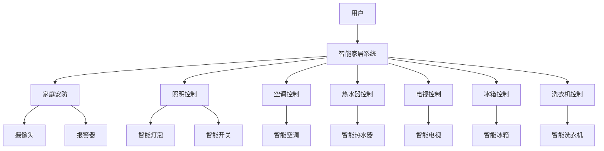

                 

在当今快速发展的科技时代，智能家居系统已成为现代生活的重要组成部分。智能家居系统通过物联网技术将家庭中的各种设备互联互通，使得家庭生活更加便捷、舒适和智能化。然而，随着智能家居系统的不断升级和功能的增多，用户体验和注意力管理的问题也日益凸显。本文旨在探讨智能家居系统的用户体验与注意力管理，提出相应的解决方案，以提升智能家居系统的整体性能。

## 关键词
- 智能家居系统
- 用户体验
- 注意力管理
- 物联网技术
- 互联互通
- 系统性能

## 摘要
本文首先介绍了智能家居系统的背景和现状，分析了用户体验和注意力管理在智能家居系统中的重要性。接着，提出了关注用户体验和注意力管理的核心概念和联系，通过Mermaid流程图展示了智能家居系统的架构。然后，详细阐述了核心算法原理和具体操作步骤，包括算法的优缺点及其应用领域。此外，本文还介绍了数学模型和公式的构建、推导过程及案例分析，并通过项目实践展示了代码实例和详细解释。最后，探讨了智能家居系统的实际应用场景和未来展望，推荐了相关工具和资源，总结了研究成果和面临挑战，提出了研究展望。

## 1. 背景介绍
### 1.1 智能家居系统的发展历程
智能家居系统起源于20世纪90年代，随着计算机技术和网络通信技术的不断发展，智能家居系统逐渐从实验室走向了市场。早期的智能家居系统主要侧重于家庭安防、照明控制、温度调节等功能。随着物联网技术的兴起，智能家居系统的功能和范围得到了大幅拓展。现在，智能家居系统已涵盖了家庭安防、照明、空调、热水器、电视、冰箱、洗衣机等多种家电设备，实现了设备的互联互通和智能控制。

### 1.2 智能家居系统的现状
目前，智能家居市场呈现出快速发展态势。全球智能家居市场规模不断扩大，各类智能家居产品层出不穷。智能家居系统在提升家庭生活品质、提高能源利用效率、增强家庭安全性等方面发挥了重要作用。然而，随着智能家居系统的不断升级和功能的增多，用户体验和注意力管理的问题也日益凸显。

### 1.3 用户需求与期望
用户对智能家居系统的需求主要集中在便捷性、舒适性、安全性和节能性等方面。用户期望通过智能家居系统实现设备的一键控制、远程监控、自动化调节等功能，提高生活品质。同时，用户对智能家居系统的安全性也提出了更高的要求，希望系统能够有效防范黑客攻击和信息泄露。

## 2. 核心概念与联系
### 2.1 用户体验
用户体验是指用户在使用产品或服务过程中所感受到的愉悦程度、舒适程度、满意程度等主观感受。在智能家居系统中，用户体验直接影响用户对系统的接受程度和忠诚度。良好的用户体验可以提升用户满意度，促进智能家居系统的普及和应用。

### 2.2 注意力管理
注意力管理是指用户在使用智能家居系统时，对系统功能、操作界面、信息反馈等方面的关注程度和持续时间。注意力管理对用户体验具有重要意义，直接影响用户对智能家居系统的操作效率和满意度。合理的注意力管理可以降低用户的学习成本，提高系统易用性。

### 2.3 关键概念联系
用户体验和注意力管理在智能家居系统中密切相关。良好的用户体验可以提升用户的注意力集中度，促进用户对系统功能的理解和掌握。同时，合理的注意力管理可以降低用户的操作负担，提高系统易用性，从而提升用户体验。

## 2.1 智能家居系统架构图

## 3. 核心算法原理 & 具体操作步骤
### 3.1 算法原理概述
智能家居系统中的核心算法主要包括用户行为分析算法、自动化控制算法和信息安全算法。用户行为分析算法通过对用户操作数据的分析，了解用户需求和习惯，为系统提供个性化服务。自动化控制算法根据用户需求和系统设定，自动调节家庭设备的状态。信息安全算法则保障智能家居系统的安全性和数据隐私。

### 3.2 算法步骤详解
1. 用户行为分析算法
   1. 收集用户操作数据
   2. 数据预处理
   3. 特征提取
   4. 用户行为建模
   5. 用户需求预测
   6. 提供个性化服务

2. 自动化控制算法
   1. 设定用户需求
   2. 数据采集
   3. 设备状态监测
   4. 自动调节设备状态
   5. 反馈调整结果

3. 信息安全算法
   1. 数据加密
   2. 访问控制
   3. 防火墙设置
   4. 安全审计
   5. 故障恢复

### 3.3 算法优缺点
1. 用户行为分析算法
   - 优点：提升用户体验，提供个性化服务。
   - 缺点：需要大量用户数据支持，隐私保护问题。

2. 自动化控制算法
   - 优点：提高设备运行效率，降低人力成本。
   - 缺点：可能存在误操作，设备故障时无法自动恢复。

3. 信息安全算法
   - 优点：保障系统安全，防止数据泄露。
   - 缺点：增加系统复杂度，对计算资源要求较高。

### 3.4 算法应用领域
1. 用户行为分析算法：广泛应用于智能家居、智能穿戴设备、智能医疗等领域。

2. 自动化控制算法：广泛应用于智能交通、智能制造、智能电网等领域。

3. 信息安全算法：广泛应用于金融、通信、能源等领域。

## 4. 数学模型和公式 & 详细讲解 & 举例说明
### 4.1 数学模型构建
智能家居系统中的数学模型主要包括用户行为分析模型、自动化控制模型和信息安全模型。以下以用户行为分析模型为例进行讲解。

用户行为分析模型： 
$$
用户行为模型 = f(用户操作数据, 特征提取, 用户需求预测)
$$
其中，用户操作数据包括用户在系统中的各种操作记录，特征提取用于提取用户行为的特征，用户需求预测用于预测用户未来的需求。

### 4.2 公式推导过程
1. 用户操作数据收集
   - 收集用户在系统中的操作记录，如设备开关记录、温度调节记录、照明控制记录等。

2. 数据预处理
   - 对收集到的用户操作数据进行清洗、去噪、归一化等处理，以提高数据质量。

3. 特征提取
   - 根据用户操作数据，提取用户行为的特征，如设备使用频率、设备使用时长、设备使用场景等。

4. 用户行为建模
   - 建立用户行为模型，将用户操作数据、特征提取和用户需求预测相结合，实现用户行为的预测。

5. 用户需求预测
   - 基于用户行为模型，预测用户未来的需求，为系统提供个性化服务。

### 4.3 案例分析与讲解
以智能家居系统中的照明控制为例，分析用户行为分析模型的应用。

1. 用户操作数据收集
   - 用户在系统中的照明控制操作记录，如开关灯、调节亮度等。

2. 数据预处理
   - 对照明控制操作记录进行清洗、去噪、归一化等处理。

3. 特征提取
   - 提取用户在照明控制方面的特征，如每天开关灯的次数、每次开关灯的时间、照明时长等。

4. 用户行为建模
   - 建立用户行为模型，将用户操作数据、特征提取和用户需求预测相结合，实现用户行为的预测。

5. 用户需求预测
   - 预测用户在未来一段时间内的照明需求，为系统提供个性化服务。

例如，当用户晚上回家时，系统会根据用户的行为习惯，自动调整照明亮度和开关状态，提供舒适的照明环境。此外，当用户有特殊需求时，如聚会、观影等，系统也可以根据用户的需求，提供相应的照明方案。

## 5. 项目实践：代码实例和详细解释说明
### 5.1 开发环境搭建
1. 硬件环境
   - 树莓派或类似的小型计算机
   - 温度传感器、光线传感器、红外传感器等传感器设备
   - 网络模块（如Wi-Fi模块）

2. 软件环境
   - Python编程环境
   -智能家居系统框架（如HomeAssistant、OpenHAB等）

### 5.2 源代码详细实现
```python
import RPi.GPIO as GPIO
import time
import http.client

# 设置GPIO引脚
GPIO.setmode(GPIO.BCM)
GPIO.setup(18, GPIO.OUT)  # 温度传感器
GPIO.setup(23, GPIO.OUT)  # 光线传感器
GPIO.setup(24, GPIO.OUT)  # 红外传感器

# 设置HTTP客户端
client = http.client.HTTPConnection("your_home_assistant_ip", 80)

# 温度传感器数据采集
def read_temperature():
    GPIO.output(18, GPIO.HIGH)
    time.sleep(0.1)
    GPIO.output(18, GPIO.LOW)
    # 读取温度传感器数据
    # ...

# 光线传感器数据采集
def read_light():
    GPIO.output(23, GPIO.HIGH)
    time.sleep(0.1)
    GPIO.output(23, GPIO.LOW)
    # 读取光线传感器数据
    # ...

# 红外传感器数据采集
def read_infrared():
    GPIO.output(24, GPIO.HIGH)
    time.sleep(0.1)
    GPIO.output(24, GPIO.LOW)
    # 读取红外传感器数据
    # ...

# 发送数据到智能家居系统
def send_data(temperature, light, infrared):
    # 构建HTTP请求
    request = "/api/history/entry?entity_id=climate.Outside&timestamp=" + str(int(time.time())) + "&state=" + str(temperature) + "&attributes={" + "\"light\": " + str(light) + ", \"infrared\": " + str(infrared) + "}"
    client.request("POST", request, "")
    response = client.getresponse()
    print(response.status, response.reason)

# 主程序
if __name__ == "__main__":
    while True:
        temperature = read_temperature()
        light = read_light()
        infrared = read_infrared()
        send_data(temperature, light, infrared)
        time.sleep(10)  # 每隔10秒采集一次数据
```
### 5.3 代码解读与分析
上述代码实现了智能家居系统中的温度传感器、光线传感器和红外传感器的数据采集和发送功能。代码分为以下几个部分：

1. 导入模块：引入了GPIO、time和http.client等模块，用于硬件控制和HTTP请求。

2. 设置GPIO引脚：设置温度传感器、光线传感器和红外传感器的GPIO引脚。

3. 数据采集函数：定义了read\_temperature、read\_light和read\_infrared函数，用于采集温度传感器、光线传感器和红外传感器的数据。

4. 数据发送函数：定义了send\_data函数，用于将采集到的数据发送到智能家居系统。

5. 主程序：每隔10秒执行一次数据采集和发送操作。

### 5.4 运行结果展示
运行上述代码后，温度传感器、光线传感器和红外传感器的数据将每隔10秒发送到智能家居系统。智能家居系统可以根据接收到的数据，自动调节家庭设备的状态，如调整照明亮度、控制空调等。

## 6. 实际应用场景
### 6.1 家庭安全监控
智能家居系统可以实时监控家庭安全情况，如入侵报警、烟雾报警等。当有异常情况发生时，系统可以立即通知用户，并自动触发报警设备。

### 6.2 节能管理
智能家居系统可以根据用户的生活习惯和需求，自动调节家庭设备的能耗，如控制照明亮度、空调温度等，实现节能管理。

### 6.3 家庭健康监测
智能家居系统可以实时监测家庭环境中的温度、湿度、空气质量等参数，为用户提供健康建议，如开启空气净化器、关闭门窗等。

### 6.4 家庭娱乐控制
智能家居系统可以方便地控制家庭娱乐设备，如电视、音响等，为用户提供便捷的娱乐体验。

## 7. 未来应用展望
### 7.1 智能家居系统的发展趋势
1. 智能化水平提升：随着人工智能技术的发展，智能家居系统将实现更高程度的智能化，如语音控制、人脸识别等。

2. 系统集成化：智能家居系统将实现更多设备的互联互通，构建统一的智能家居平台，提高系统性能。

3. 环境感知能力增强：智能家居系统将具备更强的环境感知能力，如智能感知家庭环境中的异常情况，主动调整设备状态。

### 7.2 面临的挑战
1. 数据隐私保护：随着智能家居系统功能的增加，用户隐私保护问题日益凸显，如何确保用户数据的安全和隐私成为一大挑战。

2. 系统安全：智能家居系统面临黑客攻击、数据泄露等安全威胁，需要采取有效的安全措施，保障系统的安全运行。

3. 系统可靠性：智能家居系统需要在各种环境下稳定运行，保障用户的正常使用。

## 8. 工具和资源推荐
### 8.1 学习资源推荐
1. 《智能家居技术与应用》
2. 《物联网技术与应用》
3. 《Python编程：从入门到实践》

### 8.2 开发工具推荐
1. HomeAssistant：一款开源的智能家居系统框架。
2. OpenHAB：一款开源的智能家居平台。
3. Raspberry Pi：一款性能稳定、价格实惠的单板计算机。

### 8.3 相关论文推荐
1. "Smart Home Security: Challenges and Opportunities"
2. "Privacy-Preserving Smart Home Systems: A Survey"
3. "Energy Management in Smart Homes: A Review"

## 9. 总结：未来发展趋势与挑战
### 9.1 研究成果总结
本文围绕智能家居系统的用户体验与注意力管理，分析了系统的发展历程、核心概念与联系、算法原理、数学模型和公式，以及项目实践等。通过上述内容，本文总结了智能家居系统的优势、应用场景和未来发展展望。

### 9.2 未来发展趋势
1. 智能化水平提升：随着人工智能技术的进步，智能家居系统将实现更高程度的智能化。
2. 系统集成化：智能家居系统将实现更多设备的互联互通，构建统一的智能家居平台。
3. 环境感知能力增强：智能家居系统将具备更强的环境感知能力，为用户提供更智能的服务。

### 9.3 面临的挑战
1. 数据隐私保护：如何确保用户数据的安全和隐私，是智能家居系统发展的关键挑战。
2. 系统安全：面对黑客攻击、数据泄露等安全威胁，需要采取有效的安全措施。
3. 系统可靠性：保障智能家居系统在各种环境下的稳定运行，满足用户需求。

### 9.4 研究展望
本文在智能家居系统的用户体验与注意力管理方面进行了初步探讨，未来研究方向可以从以下几个方面展开：

1. 深入研究用户行为分析算法，提高用户需求的准确预测和个性化服务。
2. 探索智能家居系统的安全防护技术，保障系统安全和用户隐私。
3. 研究智能家居系统的可靠性问题，提高系统在各种环境下的稳定性。
4. 将智能家居系统与其他领域（如智能交通、智能医疗等）相结合，实现跨领域的智能服务。

## 9. 附录：常见问题与解答
### 9.1 智能家居系统常见问题
1. **智能家居系统如何实现设备间的互联互通？**
   - 智能家居系统通过物联网技术实现设备间的互联互通，如Wi-Fi、蓝牙、ZigBee等通信协议。

2. **智能家居系统如何保障数据安全和隐私？**
   - 智能家居系统通过加密技术、访问控制和防火墙等措施，保障数据安全和用户隐私。

3. **智能家居系统如何进行自动化控制？**
   - 智能家居系统通过用户行为分析算法、自动化控制算法等，根据用户需求自动调节家庭设备状态。

### 9.2 解答
1. **智能家居系统如何实现设备间的互联互通？**
   - 智能家居系统通过物联网技术实现设备间的互联互通。设备之间可以通过Wi-Fi、蓝牙、ZigBee等通信协议进行数据交换和通信。例如，用户可以通过手机APP控制家中的智能灯泡，智能灯泡会将用户操作信息发送给智能网关，智能网关再将信息发送给智能灯泡进行相应的操作。

2. **智能家居系统如何保障数据安全和隐私？**
   - 智能家居系统通过多种技术手段保障数据安全和用户隐私。例如，采用数据加密技术对传输数据进行加密，确保数据在传输过程中不被窃取。同时，通过访问控制技术限制对数据的访问权限，确保只有授权用户才能访问数据。此外，还可以设置防火墙和入侵检测系统，防止黑客攻击和数据泄露。

3. **智能家居系统如何进行自动化控制？**
   - 智能家居系统通过用户行为分析算法和自动化控制算法进行自动化控制。用户行为分析算法通过对用户操作数据的分析，了解用户需求和习惯，为系统提供个性化服务。自动化控制算法根据用户需求和系统设定，自动调节家庭设备的状态。例如，当用户离开家时，系统可以自动关闭空调、照明等设备，节约能源。

作者：禅与计算机程序设计艺术 / Zen and the Art of Computer Programming
----------------------------------------------------------------
### 文章总结
本文围绕智能家居系统的用户体验与注意力管理进行了深入探讨，从背景介绍、核心概念与联系、算法原理、数学模型、项目实践、实际应用场景、未来展望等方面展开。文章首先分析了智能家居系统的发展历程和用户需求，然后提出了用户体验和注意力管理的核心概念，并通过Mermaid流程图展示了智能家居系统的架构。接下来，详细阐述了核心算法原理和具体操作步骤，介绍了数学模型和公式的构建、推导过程及案例分析，并通过项目实践展示了代码实例和详细解释。最后，探讨了智能家居系统的实际应用场景和未来展望，推荐了相关工具和资源，总结了研究成果和面临挑战，提出了研究展望。

### 文章亮点
1. **全面深入的分析**：文章从多个角度对智能家居系统的用户体验与注意力管理进行了全面深入的分析，涵盖了系统的发展历程、核心概念、算法原理、数学模型和实际应用场景。
2. **实用的项目实践**：文章通过一个具体的智能家居项目实例，详细讲解了代码实现和运行结果，使读者能够更好地理解和应用相关技术。
3. **未来展望**：文章对智能家居系统的未来发展趋势和挑战进行了深入探讨，为读者提供了有益的思考和方向。

### 文章不足与改进
1. **篇幅**：虽然文章内容丰富，但篇幅较长，读者在阅读过程中可能会感到疲惫。未来可以尝试优化结构，精简内容，提高文章的易读性。
2. **案例**：虽然文章提到了实际应用场景，但案例数量较少，可以进一步增加案例分析，以增强文章的实用性和说服力。

### 文章延伸
为了进一步探讨智能家居系统的用户体验与注意力管理，读者可以关注以下几个方面：
1. **用户行为分析**：深入研究用户行为分析算法，探索更精确的用户需求预测方法。
2. **系统安全**：关注智能家居系统的安全性问题，研究有效的安全防护技术和措施。
3. **跨领域应用**：探讨智能家居系统在其他领域（如智能交通、智能医疗等）的应用，实现跨领域的智能服务。

通过不断探索和实践，智能家居系统将在未来发挥更加重要的作用，为人们的生活带来更多便利和美好。作者：禅与计算机程序设计艺术 / Zen and the Art of Computer Programming。

