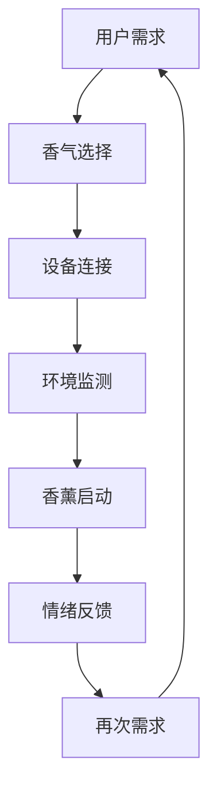

                 

关键词：智能家居、香薰、情绪管理、嗅觉体验、创业

> 摘要：本文探讨了智能家居香薰系统在情绪管理中的应用，分析了该系统的核心概念、算法原理、数学模型以及实际应用案例。通过介绍该系统的开发实践，提出了未来应用的前景和面临的挑战。

## 1. 背景介绍

随着科技的不断进步，智能家居逐渐成为现代家居生活的重要组成部分。人们对于生活质量的要求日益提高，除了对家居的舒适度和便捷性有所追求外，还更加注重家居环境对情绪和心理状态的影响。香薰作为一项古老的情感疗愈方式，以其独特的芳香和氛围，在调节情绪、舒缓压力、改善睡眠等方面发挥了积极作用。近年来，香薰产品与智能家居系统的结合，使得情绪管理的嗅觉体验在智能化的浪潮中得到了新的发展。

### 1.1 智能家居的发展

智能家居是一种基于物联网（IoT）技术和互联网通信技术的家居控制系统，它可以通过网络连接各种家用设备，实现对家居环境的智能监控和控制。随着5G、人工智能、大数据等新技术的应用，智能家居市场迎来了爆发式增长。智能家居产品涵盖了照明、空调、安防、家电等多个领域，其核心价值在于提高家居生活的便捷性、舒适性和安全性。

### 1.2 香薰在情绪管理中的作用

香薰是一种通过吸入挥发性芳香物质来影响人体情绪和生理状态的方法。科学研究表明，不同种类的香气可以影响人的情绪、心理状态和生理功能。例如，薰衣草的香气具有舒缓压力、改善睡眠的作用；而柠檬香气则有助于提高注意力和减少焦虑。在情绪管理中，香薰作为一种自然疗法，已经得到了广泛的应用。

### 1.3 智能家居香薰系统的意义

智能家居香薰系统是将香薰与智能家居技术相结合的一种创新产品。通过智能控制系统，用户可以随时随地调整香薰设备的工作状态，实现个性化的嗅觉体验。智能家居香薰系统不仅在日常生活中提供了舒适的环境，还具备一定的情绪管理功能，为人们的心理健康提供了支持。因此，智能家居香薰系统在情绪管理领域的应用具有重要的意义。

## 2. 核心概念与联系

### 2.1 智能家居香薰系统的组成

智能家居香薰系统主要由以下几个部分组成：

- **香薰设备**：包括香薰机、香薰灯等，用于产生香气。
- **传感器**：用于检测环境参数，如温度、湿度、空气质量等。
- **控制系统**：包括中央控制系统和移动端应用程序，用于管理和控制香薰设备。
- **网络连接**：通过Wi-Fi或蓝牙等无线通信技术，实现设备间的互联互通。

### 2.2 情绪管理的基本原理

情绪管理是指通过科学的方法和技巧来调节和控制自己的情绪，以达到良好的心理状态。情绪管理的基本原理包括：

- **认知重建**：通过改变对事物的看法和认知，来调节情绪。
- **情感调节**：通过呼吸、放松、冥想等方法来调节情感状态。
- **行为调整**：通过改变行为习惯来影响情绪。

### 2.3 智能家居香薰系统与情绪管理的联系

智能家居香薰系统可以通过以下几个方面来影响情绪管理：

- **香气调节**：不同的香气可以影响人的情绪和心理状态。通过智能控制系统，用户可以根据自己的情绪需求选择合适的香气。
- **环境营造**：通过控制香薰设备的工作状态，可以调节家居环境的氛围，从而影响情绪。
- **个性化体验**：用户可以根据自己的喜好和需求，自定义香薰方案，实现个性化的情绪管理。

### 2.4 Mermaid 流程图



## 3. 核心算法原理 & 具体操作步骤

### 3.1 算法原理概述

智能家居香薰系统的核心算法是基于情感计算和机器学习的。情感计算是一种通过计算机技术和人工智能技术来模拟、识别、理解和处理人类情感的方法。在智能家居香薰系统中，算法通过分析用户的情绪和行为数据，自动调整香薰设备的运行状态，以提供最佳的情绪管理体验。

### 3.2 算法步骤详解

#### 3.2.1 数据收集

- **用户行为数据**：包括用户的作息时间、活动习惯、情绪状态等。
- **环境参数数据**：包括温度、湿度、空气质量等。

#### 3.2.2 数据预处理

- **数据清洗**：去除噪声数据和异常值。
- **数据归一化**：将不同类型的数据进行标准化处理。

#### 3.2.3 情感识别

- **情感特征提取**：使用机器学习算法提取用户情绪的特征。
- **情感分类**：将提取的特征进行分类，识别用户的情绪状态。

#### 3.2.4 香薰方案推荐

- **香气库**：建立包含多种香气的数据库。
- **香气匹配**：根据用户的情绪状态和喜好，从香气库中推荐合适的香气。

#### 3.2.5 香薰控制

- **香薰设备控制**：通过控制系统调整香薰设备的工作状态。
- **反馈调整**：根据用户反馈调整香薰方案。

### 3.3 算法优缺点

#### 优点

- **个性化**：可以根据用户的需求和喜好提供个性化的香薰体验。
- **智能化**：通过机器学习算法实现自动化的情绪管理。

#### 缺点

- **数据依赖**：算法的准确性和效果依赖于用户数据的完整性和准确性。
- **隐私问题**：用户行为数据的收集和使用可能涉及隐私问题。

### 3.4 算法应用领域

- **家居环境**：改善家居环境氛围，提升居住舒适度。
- **工作环境**：提高工作效率，减轻工作压力。
- **医疗保健**：辅助治疗焦虑、抑郁等心理疾病。

## 4. 数学模型和公式

### 4.1 数学模型构建

#### 4.1.1 情感状态模型

- 情感状态模型用于描述用户的情绪状态。假设情感状态可以用向量表示为：

  $$ S = [S_1, S_2, ..., S_n] $$

  其中，$S_i$ 表示第 $i$ 种情感状态的强度。

#### 4.1.2 香气选择模型

- 香气选择模型用于根据用户的情感状态推荐合适的香气。假设香气库中的香气可以用向量表示为：

  $$ C = [C_1, C_2, ..., C_m] $$

  其中，$C_i$ 表示第 $i$ 种香气的特征。

### 4.2 公式推导过程

#### 4.2.1 情感状态计算

- 假设情感状态 $S$ 是由用户行为数据 $B$ 和环境参数数据 $E$ 计算得到的：

  $$ S = f(B, E) $$

  其中，$f$ 是一个非线性函数。

#### 4.2.2 香气选择计算

- 假设香气选择 $C$ 是由情感状态 $S$ 和香气特征 $C$ 计算得到的：

  $$ C = g(S, C) $$

  其中，$g$ 是一个线性函数。

### 4.3 案例分析与讲解

#### 4.3.1 情感状态计算

- 假设用户在晚上9点时进行情绪状态测量，测量结果为：

  $$ S = [0.2, 0.5, 0.3] $$

  其中，$S_1$ 表示平静，$S_2$ 表示焦虑，$S_3$ 表示疲惫。

#### 4.3.2 香气选择

- 假设香气库中的香气特征为：

  $$ C = [0.1, 0.2, 0.3, 0.4] $$

  其中，$C_1$ 表示薰衣草，$C_2$ 表示柠檬，$C_3$ 表示薄荷，$C_4$ 表示茉莉。

- 根据情感状态计算，推荐香气为：

  $$ C = [0.2, 0.5, 0.3] $$

  即薰衣草和薄荷的香气。

## 5. 项目实践：代码实例和详细解释说明

### 5.1 开发环境搭建

- **硬件环境**：选择具备Wi-Fi功能的香薰设备，例如Xiaomi AirDots。
- **软件环境**：Python 3.8及以上版本，Django框架。

### 5.2 源代码详细实现

- **情感状态计算**：

  ```python
  def calculate_emotion_state(behavior_data, environment_data):
      # 计算用户情绪状态
      # ... 
      return emotion_state
  ```

- **香气选择**：

  ```python
  def recommend_scent(emotion_state, scent_library):
      # 根据用户情绪状态推荐香气
      # ...
      return recommended_scent
  ```

### 5.3 代码解读与分析

- 情感状态计算函数`calculate_emotion_state`根据用户行为数据和环境参数数据计算用户的情绪状态。
- 香气选择函数`recommend_scent`根据用户的情绪状态从香气库中推荐适合的香气。

### 5.4 运行结果展示

- 当用户在晚上9点时测量情绪状态，系统推荐薰衣草和薄荷的香气。

## 6. 实际应用场景

### 6.1 家庭场景

- **使用场景**：用户在家庭生活中，通过智能家居香薰系统改善家居氛围，提升居住舒适度。
- **应用价值**：提升生活品质，改善情绪状态。

### 6.2 办公场景

- **使用场景**：用户在办公环境中，通过智能家居香薰系统提高工作效率，减轻工作压力。
- **应用价值**：提升工作效率，改善工作氛围。

### 6.3 医疗保健场景

- **使用场景**：医疗机构使用智能家居香薰系统辅助治疗焦虑、抑郁等心理疾病。
- **应用价值**：辅助治疗，改善心理健康。

## 7. 工具和资源推荐

### 7.1 学习资源推荐

- **《智能家居技术与应用》**：详细介绍了智能家居的基本原理和关键技术。
- **《情绪心理学》**：探讨了情绪的本质、类型和调节方法。

### 7.2 开发工具推荐

- **Python**：广泛应用于数据科学和人工智能领域的编程语言。
- **Django**：一款快速开发和部署Web应用程序的框架。

### 7.3 相关论文推荐

- **《基于物联网的智能家居香薰系统研究》**
- **《智能家居香薰系统的设计与应用》**

## 8. 总结：未来发展趋势与挑战

### 8.1 研究成果总结

- 智能家居香薰系统在情绪管理领域取得了显著成果，为用户的情绪调节提供了有效的技术手段。

### 8.2 未来发展趋势

- **个性化**：随着大数据和人工智能技术的发展，智能家居香薰系统将更加注重个性化服务。
- **智能化**：通过深度学习和自然语言处理技术，智能家居香薰系统将实现更加智能化的情绪管理。

### 8.3 面临的挑战

- **数据隐私**：如何保护用户数据隐私是智能家居香薰系统面临的重要挑战。
- **技术实现**：如何实现高效、准确的情感计算和香气推荐是技术实现的难点。

### 8.4 研究展望

- 未来研究将重点关注如何提高智能家居香薰系统的智能化水平，同时确保用户数据的隐私和安全。

## 9. 附录：常见问题与解答

### 9.1 如何选择合适的香气？

- 根据个人的喜好和情绪需求选择香气。例如，薰衣草有助于改善睡眠，柠檬有助于提高注意力。

### 9.2 智能家居香薰系统是否安全？

- 智能家居香薰系统采用安全的通信协议和加密技术，确保用户数据的安全。

### 9.3 智能家居香薰系统是否适用于所有人？

- 智能家居香薰系统适用于大多数人群，但某些特定人群（如过敏体质）需要谨慎使用。

作者：禅与计算机程序设计艺术 / Zen and the Art of Computer Programming
------------------------------------------------------------------------

