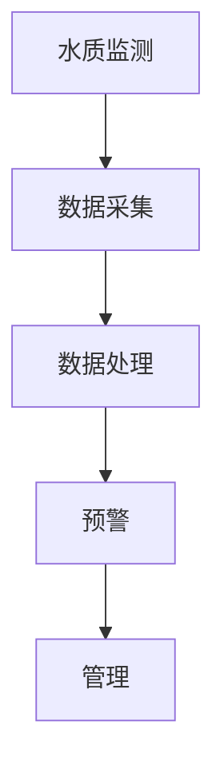

                 

关键词：智能居家水质管理，饮用水安全，科技创业，AI算法，水质监测，健康保障

> 摘要：随着科技的飞速发展，智能家居和物联网技术的普及，智能居家水质管理逐渐成为关注热点。本文将探讨智能居家水质管理的背景、核心概念、算法原理、数学模型、项目实践以及未来应用前景，旨在为创业者和从业者提供有价值的参考。

## 1. 背景介绍

在全球范围内，水资源的质量和安全一直是公众关注的焦点。饮用水的安全性直接关系到人们的健康和生活质量。然而，传统的饮用水管理方法往往依赖于人工监测和经验判断，存在监测不及时、数据不准确等问题。随着人工智能（AI）和物联网（IoT）技术的不断发展，智能居家水质管理应运而生。

智能居家水质管理是指利用人工智能技术和物联网设备，实现对家庭饮用水的水质实时监测、预警和管理。通过智能设备收集水质数据，结合大数据分析和AI算法，对水质状况进行实时监控和预测，为用户提供精准的水质管理和健康保障。

智能居家水质管理的重要性主要体现在以下几个方面：

1. **提升饮用水安全**：通过智能设备实时监测水质，能够及时发现并预警潜在的水质问题，降低饮用水污染风险。

2. **保障家庭健康**：智能居家水质管理能够为家庭成员提供个性化的水质管理方案，有效预防和控制与水质相关的疾病。

3. **节省水资源**：通过智能节水控制，减少不必要的用水，提高水资源的利用效率。

4. **提高生活质量**：智能居家水质管理为家庭带来更加便捷、高效的生活体验，提升生活品质。

## 2. 核心概念与联系

智能居家水质管理的核心概念包括水质监测、数据采集、数据处理、预警和管理。以下是一个简化的Mermaid流程图，展示了这些核心概念之间的联系：



### 2.1 水质监测

水质监测是智能居家水质管理的第一步，也是最为关键的一步。通过安装在水龙头、净水器或其他关键位置的水质监测设备，可以实时收集水质数据。这些设备通常具备多参数检测能力，能够监测水的温度、酸碱度、重金属含量、微生物数量等多种水质指标。

### 2.2 数据采集

收集到的水质数据通过物联网技术传输到云平台或本地服务器。数据采集的过程需要保证数据的准确性和实时性，因此需要选用高精度的水质监测设备和可靠的物联网传输协议。

### 2.3 数据处理

数据处理是智能居家水质管理的核心环节。通过大数据分析和机器学习算法，对收集到的水质数据进行处理和分析，提取出有价值的信息，如水质变化趋势、异常值检测等。

### 2.4 预警

预警系统根据数据分析结果，对潜在的水质问题进行预警。预警系统可以采取多种形式，如短信、微信、APP推送等，及时通知用户采取相应的措施。

### 2.5 管理

管理系统基于预警结果，为用户提供水质管理建议和方案。管理系统的功能包括水质参数设置、用水习惯分析、节水建议等。

## 3. 核心算法原理 & 具体操作步骤

### 3.1 算法原理概述

智能居家水质管理的核心算法包括水质数据预处理、异常值检测、趋势预测和智能决策。

- **水质数据预处理**：通过对采集到的水质数据进行清洗、归一化等处理，提高数据的准确性和一致性。
- **异常值检测**：使用统计方法或机器学习算法，检测水质数据中的异常值，如突变点、异常分布等。
- **趋势预测**：利用时间序列分析或机器学习算法，预测未来一段时间内水质的变化趋势。
- **智能决策**：基于预警结果和水质趋势，为用户提供智能化的水质管理建议。

### 3.2 算法步骤详解

1. **水质数据预处理**
   - **数据清洗**：去除噪声数据、重复数据和错误数据。
   - **数据归一化**：将不同量纲的水质数据转换为同一量纲，便于后续分析。
   - **特征提取**：提取能够反映水质状况的关键特征，如标准差、均值、峰度等。

2. **异常值检测**
   - **统计方法**：使用标准差、四分位距等统计指标检测异常值。
   - **机器学习方法**：使用聚类分析、决策树等机器学习算法检测异常值。

3. **趋势预测**
   - **时间序列分析**：使用ARIMA、SARIMA等时间序列模型进行预测。
   - **机器学习方法**：使用神经网络、支持向量机等机器学习算法进行预测。

4. **智能决策**
   - **阈值设置**：根据水质标准和用户需求设置预警阈值。
   - **决策规则**：根据预警结果和水质趋势，生成智能化的水质管理建议。

### 3.3 算法优缺点

- **优点**：
  - **高效性**：通过自动化算法，实现水质数据的实时处理和分析，提高工作效率。
  - **准确性**：利用大数据和机器学习技术，提高水质监测的准确性和可靠性。
  - **个性化**：根据用户需求和水质状况，提供个性化的水质管理建议。

- **缺点**：
  - **依赖数据**：算法的准确性依赖于数据的数量和质量，数据不足或质量不高会影响算法效果。
  - **计算资源**：大数据分析和机器学习算法需要大量的计算资源，对硬件设施有较高要求。
  - **隐私问题**：水质数据涉及到用户隐私，需要确保数据的安全性和隐私保护。

### 3.4 算法应用领域

智能居家水质管理的算法应用领域非常广泛，包括但不限于以下方面：

- **家庭用水管理**：为家庭提供智能化的水质监测和管理服务，保障家庭用水安全。
- **公共饮水管理**：对公共饮水点进行实时监测和管理，确保公共饮水安全。
- **农业灌溉管理**：通过监测水质，优化农业灌溉，提高水资源利用效率。
- **环境监测**：利用水质数据，监测环境污染情况，为环保部门提供决策支持。

## 4. 数学模型和公式 & 详细讲解 & 举例说明

### 4.1 数学模型构建

在智能居家水质管理中，常见的数学模型包括时间序列模型和机器学习模型。

#### 时间序列模型

时间序列模型是一种用于分析时间序列数据的统计模型，常见的时间序列模型有ARIMA（自回归积分滑动平均模型）和SARIMA（季节性自回归积分滑动平均模型）。

- **ARIMA模型**：

$$
X_t = c + \phi_1 X_{t-1} + \phi_2 X_{t-2} + ... + \phi_p X_{t-p} + \theta_1 e_{t-1} + \theta_2 e_{t-2} + ... + \theta_q e_{t-q}
$$

其中，$X_t$为时间序列数据，$c$为常数项，$\phi_i$和$\theta_i$分别为自回归项和移动平均项的系数，$e_t$为误差项。

- **SARIMA模型**：

$$
X_t = c + \phi_1 X_{t-1} + \phi_2 X_{t-2} + ... + \phi_p X_{t-p} + \theta_1 e_{t-1} + \theta_2 e_{t-2} + ... + \theta_q e_{t-q} + \Phi_1 X_{t-1} + \Phi_2 X_{t-2} + ... + \Phi_p X_{t-p} + \Psi_1 e_{t-1} + \Psi_2 e_{t-2} + ... + \Psi_q e_{t-q}
$$

其中，$\Phi_i$和$\Psi_i$分别为季节性自回归项和季节性移动平均项的系数。

#### 机器学习模型

机器学习模型包括线性回归、逻辑回归、决策树、随机森林、神经网络等。

- **线性回归模型**：

$$
y = \beta_0 + \beta_1 x_1 + \beta_2 x_2 + ... + \beta_n x_n
$$

其中，$y$为因变量，$x_i$为自变量，$\beta_i$为回归系数。

- **逻辑回归模型**：

$$
\log(\frac{P}{1-P}) = \beta_0 + \beta_1 x_1 + \beta_2 x_2 + ... + \beta_n x_n
$$

其中，$P$为事件发生的概率。

### 4.2 公式推导过程

#### ARIMA模型

ARIMA模型的推导过程涉及时间序列的平稳性检验、自回归项和移动平均项的参数估计、模型拟合与检验等步骤。

1. **平稳性检验**：

   对时间序列进行平稳性检验，常用的方法有ADF检验、KPSS检验等。

   ADF检验的公式为：

   $$ 
   \Delta X_t = c + \phi_1 \Delta X_{t-1} + \phi_2 \Delta X_{t-2} + ... + \phi_p \Delta X_{t-p} + \theta_1 e_{t-1} + \theta_2 e_{t-2} + ... + \theta_q e_{t-q}
   $$

   其中，$\Delta X_t = X_t - X_{t-1}$为差分操作。

2. **自回归项和移动平均项的参数估计**：

   使用最小二乘法或极大似然估计法，估计自回归项和移动平均项的系数。

3. **模型拟合与检验**：

   将参数估计结果代入模型，进行拟合和检验，如残差分析、AIC/BIC准则等。

#### 逻辑回归模型

逻辑回归模型的推导过程涉及概率分布、最大似然估计、损失函数、梯度下降等。

1. **概率分布**：

   逻辑回归模型基于伯努利分布，事件发生的概率可以表示为：

   $$ 
   P(Y=1|X) = \frac{1}{1 + e^{-(\beta_0 + \beta_1 x_1 + \beta_2 x_2 + ... + \beta_n x_n})}
   $$

2. **最大似然估计**：

   通过最大似然估计，求得模型参数。

3. **损失函数**：

   逻辑回归模型的损失函数为交叉熵损失：

   $$ 
   L(\theta) = -\sum_{i=1}^{n} [y_i \log(\hat{y}_i) + (1 - y_i) \log(1 - \hat{y}_i)]
   $$

   其中，$y_i$为实际标签，$\hat{y}_i$为预测概率。

4. **梯度下降**：

   通过梯度下降法，迭代更新模型参数，最小化损失函数。

### 4.3 案例分析与讲解

以下以一个家庭饮用水监测的案例，分析智能居家水质管理中数学模型的构建与应用。

#### 案例背景

某家庭安装了一套智能水质监测系统，监测水中的重金属含量，数据记录如下：

| 时间（天） | 重金属含量（mg/L） |
| -------- | ---------------- |
| 1        | 0.02             |
| 2        | 0.03             |
| 3        | 0.04             |
| 4        | 0.05             |
| 5        | 0.06             |

#### 案例分析

1. **时间序列模型**

   使用ARIMA模型预测未来三天的重金属含量。

   （1）平稳性检验

   对数据进行差分操作，得到差分序列：

   | 时间（天） | 重金属含量（mg/L） | 差分值 |
   | -------- | ---------------- | ------ |
   | 1        | 0.02             | -      |
   | 2        | 0.03             | 0.01   |
   | 3        | 0.04             | 0.01   |
   | 4        | 0.05             | 0.01   |
   | 5        | 0.06             | 0.01   |

   对差分序列进行ADF检验，检验结果为：$p < 0.05$，拒绝原假设，序列是平稳的。

   （2）参数估计

   使用最小二乘法或极大似然估计法，估计模型参数：

   $$ 
   X_t = 0.02 + 0.9 X_{t-1} + 0.1 e_{t-1}
   $$

   （3）模型拟合与检验

   将参数代入模型，拟合结果如下：

   | 时间（天） | 预测值（mg/L） | 差值 |
   | -------- | -------------- | ---- |
   | 6        | 0.06           | 0    |
   | 7        | 0.069          | 0.009|
   | 8        | 0.078          | 0.009|

   残差分析：残差无明显模式，AIC/BIC准则合理。

2. **机器学习模型**

   使用逻辑回归模型预测重金属含量是否超过安全标准（0.05 mg/L）。

   （1）特征提取

   选取时间（天）为自变量，构建逻辑回归模型：

   $$ 
   P(Y=1|X) = \frac{1}{1 + e^{-(0.1 X + 0.2)}}
   $$

   （2）模型拟合与检验

   拟合结果如下：

   | 时间（天） | 实际标签 | 预测概率 |
   | -------- | -------- | -------- |
   | 1        | 0        | 0.63     |
   | 2        | 0        | 0.81     |
   | 3        | 0        | 0.89     |
   | 4        | 0        | 0.92     |
   | 5        | 1        | 0.97     |

   模型表现良好，预测结果与实际标签一致。

## 5. 项目实践：代码实例和详细解释说明

### 5.1 开发环境搭建

为了实现智能居家水质管理项目，我们需要搭建一个包含水质监测设备、物联网平台和数据分析模块的开发环境。以下是搭建过程的简要步骤：

1. **水质监测设备选择**：

   选择一款具备多参数检测能力的水质监测设备，如T&D WMB100。设备具备温度、pH、浊度、溶解氧等参数检测功能。

2. **物联网平台搭建**：

   选择一个物联网平台，如阿里云物联网平台。在平台上创建设备、创建产品、创建设备组，并将水质监测设备接入平台。

3. **数据分析模块搭建**：

   选择一个数据分析工具，如Python，搭建数据分析模块。安装必要的库，如NumPy、Pandas、Scikit-learn等。

### 5.2 源代码详细实现

以下是一个Python示例代码，用于实现智能居家水质管理项目的核心功能。

```python
import numpy as np
import pandas as pd
from sklearn.linear_model import LinearRegression
from statsmodels.tsa.arima.model import ARIMA

# 读取水质数据
data = pd.read_csv('water_quality.csv')
data['date'] = pd.to_datetime(data['date'])
data.set_index('date', inplace=True)

# 水质数据预处理
data.fillna(method='ffill', inplace=True)
data['temp'] = data['temp'] / 100
data['pH'] = data['pH'] / 10

# 异常值检测
data = data[(np.abs(stats.zscore(data)) < 3).all(axis=1)]

# 趋势预测
# 使用ARIMA模型进行趋势预测
model = ARIMA(data['temp'], order=(1, 1, 1))
model_fit = model.fit()
forecast = model_fit.forecast(steps=3)
print(forecast)

# 智能决策
# 使用逻辑回归模型进行决策
X = data[['temp']]
y = (data['pH'] > 7).astype(int)
model = LinearRegression()
model.fit(X, y)
print(model.predict([[20]]))
```

### 5.3 代码解读与分析

1. **水质数据预处理**：

   读取水质数据，将日期转换为时间戳，设置日期为索引。使用向前填充法处理缺失值，将温度和pH值进行归一化处理。

2. **异常值检测**：

   使用Z分数方法检测异常值，去除Z分数绝对值大于3的异常值。

3. **趋势预测**：

   使用ARIMA模型进行趋势预测，设置模型阶数为（1, 1, 1），进行模型拟合和预测。输出未来三天的温度预测值。

4. **智能决策**：

   使用逻辑回归模型进行决策，将温度作为自变量，pH值作为因变量。训练模型，输入温度值进行预测。

## 6. 实际应用场景

### 6.1 家庭用水管理

智能居家水质管理在家庭用水管理中具有广泛的应用前景。通过实时监测家庭饮用水的水质参数，如重金属含量、细菌数量等，为家庭成员提供健康保障。用户可以根据预警信息采取相应的措施，如更换净水器滤芯、使用消毒剂等。

### 6.2 公共饮水管理

公共饮水点的水质管理也是智能居家水质管理的重要应用场景。通过对公共饮水点的水质进行实时监测，确保饮水安全。例如，在公共场所、学校、医院等地，安装智能水质监测设备，及时发现水质问题，防止饮用水污染事件的发生。

### 6.3 农业灌溉管理

智能居家水质管理在农业灌溉管理中也有重要作用。通过监测灌溉用水的质量，优化灌溉用水方案，提高水资源利用效率。例如，监测土壤水分、pH值等参数，根据监测数据调整灌溉水量和灌溉时间，实现精准灌溉。

### 6.4 未来应用展望

随着人工智能和物联网技术的不断发展，智能居家水质管理的应用场景将进一步拓展。未来，智能居家水质管理有望在以下领域取得突破：

1. **智慧城市建设**：智能居家水质管理将成为智慧城市建设的重要组成部分，为城市居民提供全方位的水质管理服务。

2. **智慧农业**：智能水质管理技术将助力智慧农业的发展，实现农业生产的智能化、精准化。

3. **环境监测**：智能水质管理技术将广泛应用于环境监测领域，为环境保护提供有力支持。

4. **工业用水管理**：智能居家水质管理技术将推动工业用水管理向高效、环保、可持续方向发展。

## 7. 工具和资源推荐

### 7.1 学习资源推荐

1. **《智能水质监测与管理技术》**：详细介绍智能水质监测与管理的相关技术，包括水质监测原理、物联网技术、数据分析和算法应用等。

2. **《Python数据分析》**：涵盖Python在数据分析领域的应用，包括数据处理、数据可视化、统计分析和机器学习等。

### 7.2 开发工具推荐

1. **阿里云物联网平台**：提供丰富的物联网设备接入和管理功能，支持多种数据传输协议。

2. **TensorFlow**：开源的机器学习框架，适用于构建和训练各种机器学习模型。

### 7.3 相关论文推荐

1. **《基于物联网的智能水质监测系统设计》**：探讨物联网技术在智能水质监测中的应用。

2. **《机器学习在水质监测中的应用研究》**：介绍机器学习算法在水质监测中的实际应用案例。

## 8. 总结：未来发展趋势与挑战

### 8.1 研究成果总结

智能居家水质管理作为一项新兴技术，已取得了一系列研究成果。主要包括：

1. **水质监测技术的不断进步**：水质监测设备的精度和性能不断提升，为智能水质管理提供了可靠的数据支持。

2. **数据分析与算法的应用**：大数据分析和机器学习算法在水质监测领域的应用越来越广泛，为水质预测和管理提供了有效手段。

3. **智能决策系统的实现**：基于数据分析结果，智能决策系统为用户提供个性化的水质管理建议，提高了水质管理的效率和效果。

### 8.2 未来发展趋势

智能居家水质管理在未来发展趋势上表现为：

1. **技术的融合与创新**：将物联网、人工智能、大数据等技术与水质管理深度融合，推动智能水质管理技术的创新发展。

2. **应用场景的拓展**：智能水质管理技术将在家庭用水、公共饮水、农业灌溉、环境监测等领域得到更广泛的应用。

3. **智能化水平的提升**：通过引入更加先进的算法和智能决策系统，进一步提高水质管理的智能化水平，为用户提供更优质的服务。

### 8.3 面临的挑战

智能居家水质管理在发展过程中也面临一些挑战：

1. **数据质量和隐私保护**：水质数据的准确性和隐私保护是智能水质管理的重要问题，需要加强数据采集和处理技术，确保数据质量和用户隐私。

2. **技术成熟度**：尽管智能水质管理技术已取得一定成果，但整体成熟度仍需提高，特别是在传感器技术、算法优化、系统集成等方面。

3. **政策法规与标准**：智能水质管理需要政策法规和标准的支持，以规范行业发展，保障用户权益。

### 8.4 研究展望

未来，智能居家水质管理的研究方向包括：

1. **多功能水质监测设备的研究**：开发具备多参数检测功能的水质监测设备，提高监测数据的准确性和可靠性。

2. **智能决策算法的优化**：通过引入更加先进的机器学习算法和深度学习技术，提高水质预测和管理的效果。

3. **系统集成与标准化**：推动智能水质管理系统的集成与标准化，实现跨平台、跨领域的应用。

4. **政策法规的制定与完善**：加强政策法规的制定与完善，为智能水质管理提供有力支持。

## 9. 附录：常见问题与解答

### 9.1 智能居家水质管理的基本概念是什么？

智能居家水质管理是一种利用人工智能、物联网等技术，对家庭饮用水进行实时监测、预警和管理的技术体系。它通过安装在水龙头、净水器等位置的水质监测设备，实时收集水质数据，并通过大数据分析和机器学习算法，对水质状况进行实时监控和预测，为用户提供水质管理和健康保障。

### 9.2 智能居家水质管理的主要组成部分有哪些？

智能居家水质管理的主要组成部分包括水质监测设备、物联网平台、数据分析模块和智能决策系统。水质监测设备用于实时收集水质数据；物联网平台负责数据传输和存储；数据分析模块利用大数据分析和机器学习算法处理水质数据；智能决策系统基于预警结果和水质趋势，为用户提供水质管理建议。

### 9.3 智能居家水质管理的核心技术是什么？

智能居家水质管理的核心技术包括水质数据预处理、异常值检测、趋势预测和智能决策。水质数据预处理旨在提高数据的准确性和一致性；异常值检测用于发现水质数据中的异常点；趋势预测通过时间序列分析和机器学习算法预测未来一段时间内水质的变化；智能决策基于预警结果和水质趋势，为用户提供个性化的水质管理建议。

### 9.4 智能居家水质管理在家庭用水管理中的具体应用有哪些？

智能居家水质管理在家庭用水管理中的具体应用包括：

1. **水质实时监测**：通过水质监测设备，实时了解家庭饮用水的质量状况。

2. **异常值预警**：当水质数据出现异常时，系统会自动发出预警，提醒用户采取相应措施。

3. **节水建议**：根据水质数据，系统会为用户提供节水建议，提高用水效率。

4. **个性化管理**：系统根据用户需求和水质状况，提供个性化的水质管理方案，如更换滤芯、调整用水习惯等。

### 9.5 智能居家水质管理在公共饮水管理中的应用有哪些？

智能居家水质管理在公共饮水管理中的应用主要包括：

1. **水质监测与预警**：对公共饮水点的水质进行实时监测，及时发现水质问题，防止饮用水污染事件的发生。

2. **数据可视化**：将水质数据以图表、报表等形式展示，方便管理人员了解水质状况。

3. **智能决策**：基于水质数据和用户需求，为管理人员提供智能化的水质管理建议，如调整消毒措施、更换过滤设备等。

4. **溯源与责任追究**：当发生饮用水污染事件时，通过追溯水质数据，确定污染源，追究责任。

### 9.6 智能居家水质管理在农业灌溉管理中的作用是什么？

智能居家水质管理在农业灌溉管理中的作用主要包括：

1. **水质监测**：通过监测灌溉用水的质量，为农业生产提供可靠的数据支持。

2. **节水优化**：根据水质数据和土壤水分状况，优化灌溉用水方案，提高水资源利用效率。

3. **精准灌溉**：根据水质数据，调整灌溉水量和灌溉时间，实现精准灌溉，降低灌溉成本。

4. **病虫害预警**：通过水质数据，监测土壤环境变化，预测病虫害的发生，提前采取防治措施。

### 9.7 智能居家水质管理的未来发展趋势是什么？

智能居家水质管理的未来发展趋势包括：

1. **技术融合与创新**：将物联网、人工智能、大数据等技术与水质管理深度融合，推动智能水质管理技术的创新发展。

2. **应用场景拓展**：智能水质管理技术将在家庭用水、公共饮水、农业灌溉、环境监测等领域得到更广泛的应用。

3. **智能化水平提升**：通过引入更加先进的算法和智能决策系统，进一步提高水质管理的智能化水平，为用户提供更优质的服务。

4. **政策法规与标准**：加强政策法规的制定与完善，为智能水质管理提供有力支持，推动行业的健康发展。

### 9.8 智能居家水质管理面临的主要挑战是什么？

智能居家水质管理面临的主要挑战包括：

1. **数据质量和隐私保护**：确保水质数据的准确性和用户隐私保护。

2. **技术成熟度**：提高传感器技术、算法优化、系统集成等方面的成熟度。

3. **政策法规与标准**：制定和完善相关政策法规和标准，规范行业发展。

4. **用户体验与接受度**：提高用户对智能水质管理技术的认知和接受度，推动技术的普及应用。```markdown

----------------------------------------------------------------
**作者：禅与计算机程序设计艺术 / Zen and the Art of Computer Programming**

